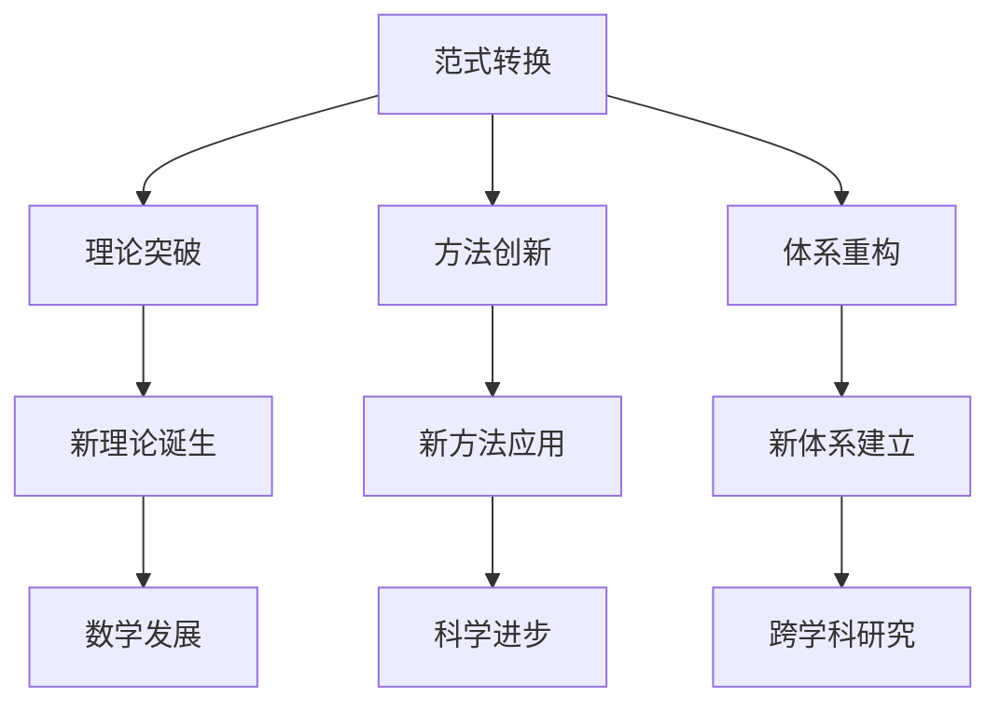

                 

### 文章标题

数学史上的范式转换与科学革命

### 关键词

数学史、范式转换、科学革命、数学模型、数学公式、历史案例

### 摘要

本文将深入探讨数学史上的范式转换与科学革命，通过对早期和现代数学范式转换的详细分析，揭示数学在推动科学进步中的关键作用。我们将通过历史案例，展示范式转换与科学革命的实际过程，并探讨未来可能的数学范式转换方向。文章结构紧凑，逻辑清晰，旨在为广大读者提供一次对数学史与科学发展的深刻思考。

---

## 引言

### 1.1 数学范式与科学革命的背景

数学范式转换与科学革命是数学史上不可或缺的一部分。自古以来，数学在科学、工程、经济等领域发挥着基础性作用。然而，数学的发展并非一帆风顺，而是经历了多次重大变革，即范式转换。这些范式转换不仅推动了数学本身的发展，也深刻影响了整个科学领域的进步。

数学范式是指在一定历史时期内，数学界所普遍接受的数学理论、方法和工具。当这些数学范式无法解释新出现的数学现象或科学问题时，便会引发科学革命，从而导致新的数学范式的诞生。例如，从欧几里得几何到非欧几何的范式转换，以及从古典数学到集合论的范式转换，都标志着数学史上的重要转折点。

### 1.2 范式转换的定义与特征

范式转换通常具有以下特征：

1. **理论突破**：新的数学范式能够解释以前无法解释的数学现象或科学问题。
2. **方法创新**：新的数学范式引入了新的数学方法和工具，推动了数学的发展。
3. **体系重构**：新的数学范式改变了原有的数学体系结构，形成了新的理论框架。

### 1.3 本书的目的与结构

本文旨在通过历史案例分析，深入探讨数学范式转换与科学革命的过程及其影响。文章结构分为以下几部分：

1. **早期范式转换**：介绍欧几里得几何和欧拉公式的范式转换过程。
2. **现代范式转换**：探讨非欧几何和集合论的范式转换过程。
3. **数学模型与公式讲解**：详细阐述欧拉公式、费马最后定理等关键数学公式。
4. **科学革命与数学**：分析牛顿力学和相对论等科学革命与数学的关系。
5. **历史案例分析**：通过欧几里得、笛卡尔、牛顿等人的工作，展示范式转换与科学革命的实际过程。
6. **范式转换的未来**：探讨未来可能的数学范式转换方向。

## 第1章：范式转换概述

### 1.1 范式转换的概念与特征

范式转换是指在一定历史时期内，数学界所普遍接受的数学理论、方法和工具发生重大变革的过程。范式转换具有以下特征：

1. **理论突破**：新的数学范式能够解释以前无法解释的数学现象或科学问题。例如，欧几里得几何无法解释地球是圆的这一问题，引发了非欧几何的诞生。
2. **方法创新**：新的数学范式引入了新的数学方法和工具，推动了数学的发展。例如，集合论的引入使得数学研究更加严谨和系统化。
3. **体系重构**：新的数学范式改变了原有的数学体系结构，形成了新的理论框架。例如，微积分的诞生改变了经典力学的研究方法，形成了新的物理体系。

### 1.2 范式转换的历史意义

范式转换在数学史上具有重要的历史意义：

1. **推动数学发展**：范式转换促使数学不断向前发展，出现了许多重要的数学理论和方法。
2. **影响科学进步**：范式转换不仅推动了数学的发展，也深刻影响了整个科学领域的进步。例如，非欧几何的出现推动了广义相对论的创立。
3. **促进跨学科研究**：范式转换使得数学与其他学科如物理学、经济学、生物学等产生了密切的联系，推动了跨学科研究的发展。

### 1.3 核心概念流程图展示

为了更好地理解范式转换的过程和特征，我们可以使用 Mermaid 流程图展示核心概念之间的关系：



该流程图展示了范式转换的核心概念及其相互关系，有助于我们更深入地理解范式转换的内涵和意义。

## 第2章：早期范式转换

### 2.1 欧几里得几何的范式转换

#### 2.1.1 欧几里得几何的基本原理

欧几里得几何（Euclidean geometry）是古希腊数学家欧几里得（Euclid）创立的一种几何学理论。欧几里得在《几何原本》中系统地阐述了欧几里得几何的基本原理和定理。

欧几里得几何的基本原理包括：

1. **公理体系**：欧几里得提出了5条公设和5条公理，这些公设和公理构成了欧几里得几何的公理体系。
2. **平行公理**：欧几里得提出了平行公理，即通过已知直线和一点，只能作出一条直线与已知直线平行。
3. **几何图形**：欧几里得几何研究的主要对象是点、线、面等基本几何图形，以及它们之间的关系。

#### 2.1.2 欧几里得几何的范式转换过程

欧几里得几何在历史上具有里程碑式的意义，但它在某些方面也受到了质疑和挑战。

1. **地球是圆的质疑**：在欧几里得几何体系中，地球被视为一个平面。然而，随着航海和地理学的发展，人们发现地球实际上是圆的。这一发现引发了人们对欧几里得几何的质疑，认为其无法解释现实世界中的现象。

2. **非欧几何的出现**：为了解决欧几里得几何在解释现实世界中的局限性，非欧几何（non-Euclidean geometry）应运而生。非欧几何打破了欧几里得几何的公理体系，提出了新的几何理论。

非欧几何的主要代表人物是德国数学家莱布尼茨（Leibniz）和瑞士数学家欧拉（Euler）。他们在研究空间几何问题时，提出了非欧几何的基本原理，如：

1. **非欧公理**：非欧几何引入了新的公理体系，如球面几何和双曲几何的公理。
2. **非欧图形**：非欧几何研究的主要对象是球面和双曲面的几何性质，以及它们之间的关系。

非欧几何的出现标志着数学史上的一次重大范式转换，它不仅拓宽了数学的研究领域，也为后来的物理学和天文学提供了重要的理论基础。

### 2.2 阿基米德原理的范式转换

#### 2.2.1 阿基米德原理的基本原理

阿基米德原理（Archimedes' principle）是古希腊数学家阿基米德（Archimedes）提出的一种关于浮力和物体在流体中运动的原理。阿基米德原理的基本原理包括：

1. **浮力公式**：阿基米德原理指出，浸入流体中的物体会受到一个向上的浮力，这个浮力的大小等于物体排开的流体的重量。
2. **浮力方向**：浮力的方向始终垂直于流体表面，指向物体。
3. **浮力条件**：只有当物体受到的浮力大于或等于物体的重力时，物体才能在流体中浮起。

#### 2.2.2 阿基米德原理的范式转换过程

阿基米德原理在古代工程学和物理学中具有重要意义，但在现代科学的发展中，其范式也发生了变化。

1. **流体动力学的发展**：随着流体力学（hydrodynamics）的兴起，人们对流体运动和浮力的认识更加深入。流体动力学引入了新的理论和公式，如伯努利方程和纳维-斯托克斯方程，对流体运动进行了更准确的描述。

2. **量子力学的影响**：量子力学的兴起也对阿基米德原理产生了影响。在量子尺度上，物体的浮力不再遵循经典力学规律，需要借助量子力学理论来解释。

3. **计算机模拟的应用**：现代计算机技术的发展，使得流体动力学和量子力学模拟成为可能。通过计算机模拟，科学家可以更精确地研究流体运动和浮力现象，为工程应用提供理论基础。

阿基米德原理的范式转换体现了科学发展的不断进步，也展示了数学在推动科学进步中的关键作用。

## 第3章：现代范式转换

### 3.1 非欧几何的范式转换

#### 3.1.1 非欧几何的基本原理

非欧几何（non-Euclidean geometry）是相对于欧几里得几何（Euclidean geometry）而言的一种几何学理论。非欧几何的基本原理包括：

1. **球面几何**：球面几何是一种在球面上定义的几何学理论，其基本原理与欧几里得几何不同。例如，球面上的直线是弧线，而不是直线。

2. **双曲几何**：双曲几何是一种在双曲面上定义的几何学理论，其基本原理与欧几里得几何也不同。例如，双曲面上的直线是双曲线，而不是直线。

3. **非欧公理**：非欧几何引入了新的公理体系，如球面几何和双曲几何的公理。这些公理改变了欧几里得几何的几何性质，使得非欧几何具有不同的几何特征。

#### 3.1.2 非欧几何的范式转换过程

非欧几何的范式转换是数学史上的一次重大变革，它打破了欧几里得几何的统治地位，为数学研究开辟了新的领域。

1. **非欧几何的起源**：非欧几何的起源可以追溯到古希腊时期，当时的数学家们开始质疑欧几里得几何的某些假设。例如，古希腊数学家毕达哥拉斯（Pythagoras）和欧几里得（Euclid）都认为地球是平的，但后来发现地球实际上是圆的。这一发现引发了人们对欧几里得几何的质疑，促使他们寻求新的几何理论。

2. **非欧几何的发展**：在19世纪，德国数学家莱布尼茨（Gottfried Wilhelm Leibniz）和瑞士数学家欧拉（Leonhard Euler）等人在研究空间几何问题时，提出了非欧几何的基本原理。他们的研究表明，球面几何和双曲几何具有不同的几何性质，可以为现实世界中的问题提供更准确的描述。

3. **非欧几何的影响**：非欧几何的提出对数学和物理学产生了深远的影响。在数学领域，非欧几何丰富了数学的研究内容，推动了数学的进一步发展。在物理学领域，非欧几何为广义相对论（general relativity）提供了理论基础，使得人们能够更好地理解宇宙的运行机制。

非欧几何的范式转换标志着数学史上的一个重要转折点，它不仅改变了数学的研究方向，也推动了科学的发展。

### 3.2 集合论的范式转换

#### 3.2.1 集合论的基本原理

集合论（set theory）是现代数学的基础之一，它研究集合（set）的性质和关系。集合论的基本原理包括：

1. **集合的定义**：集合是一组确定的对象的集合，这些对象称为集合的元素。集合可以是有序的，也可以是无序的。

2. **集合的运算**：集合论中定义了多种集合运算，如并集、交集、补集、笛卡尔积等。这些运算可以用于处理集合之间的关系。

3. **集合的性质**：集合论研究了集合的性质，如集合的基数（cardinality）、子集、真子集等。

#### 3.2.2 集合论的范式转换过程

集合论的范式转换是数学史上的一次重大变革，它为数学的严密性和系统性奠定了基础。

1. **集合论的起源**：集合论的起源可以追溯到19世纪，当时德国数学家康托尔（Georg Cantor）开始研究集合的概念。康托尔提出了集合论的基本原理，如集合的定义、集合的运算和集合的性质。

2. **集合论的发展**：在康托尔之后，集合论得到了进一步的发展。数学家们开始探索更复杂的集合和集合运算，如无限集合、势（cardinality）和关系等。集合论的研究成果为数学的其他领域提供了基础。

3. **集合论的影响**：集合论的提出对数学产生了深远的影响。它使得数学研究更加严密和系统，为数学的进一步发展提供了基础。此外，集合论还在物理学、经济学、计算机科学等领域得到了广泛应用。

集合论的范式转换标志着数学史上的一个重要转折点，它不仅改变了数学的研究方法，也推动了数学的进一步发展。

## 第4章：数学模型与公式讲解

### 4.1 欧拉公式

#### 4.1.1 欧拉公式的数学公式

欧拉公式（Euler's formula）是数学中的一个重要公式，它将复数指数函数与三角函数联系起来。欧拉公式的数学公式为：

$$e^{i\pi} + 1 = 0$$

其中，$e$ 是自然对数的底数，$i$ 是虚数单位，$\pi$ 是圆周率。

#### 4.1.2 欧拉公式的证明与推导

欧拉公式的证明和推导有多种方法，以下是其中一种常见的证明方法：

1. **指数函数的定义**：首先，我们需要了解指数函数的定义。指数函数是指将实数作为输入，输出为正实数的函数。在复数范围内，指数函数也可以定义。对于复数 $z = x + yi$，指数函数可以表示为：

   $$e^z = e^{x+yi} = e^x \cdot e^{yi}$$

   其中，$e^x$ 是实数指数函数，$e^{yi}$ 是复数指数函数。

2. **欧拉公式的基本形式**：接下来，我们需要证明欧拉公式的基本形式 $e^{i\pi} + 1 = 0$。我们可以使用指数函数的定义和三角函数的关系来证明。

   对于 $e^{i\pi}$，我们可以将其表示为：

   $$e^{i\pi} = \cos(\pi) + i\sin(\pi)$$

   由于 $\cos(\pi) = -1$ 且 $\sin(\pi) = 0$，我们可以得到：

   $$e^{i\pi} = -1 + i \cdot 0 = -1$$

   因此，我们有：

   $$e^{i\pi} + 1 = -1 + 1 = 0$$

   这证明了欧拉公式的基本形式。

3. **欧拉公式的推广**：欧拉公式不仅适用于 $z = i\pi$ 的情况，还可以推广到任意复数 $z$。对于任意复数 $z = x + yi$，欧拉公式可以表示为：

   $$e^{z} = \cos(\theta) + i\sin(\theta)$$

   其中，$\theta$ 是 $z$ 的幅角。这个公式将复数指数函数与三角函数联系起来，为复数的运算提供了简洁的表达形式。

#### 4.1.3 欧拉公式的应用

欧拉公式在数学和物理学中有着广泛的应用。以下是一些常见的应用：

1. **复数的极坐标表示**：欧拉公式可以将复数表示为极坐标形式，即 $z = r(\cos(\theta) + i\sin(\theta))$。这个形式使得复数的运算更加简洁和直观。

2. **电路分析**：在电路分析中，欧拉公式可以用于计算交流电路中的电压和电流。欧拉公式可以将复数形式的电压和电流转换为三角函数形式，从而简化计算过程。

3. **振动分析**：在振动分析中，欧拉公式可以用于计算振动系统的频率响应和相位响应。通过欧拉公式，可以将振动系统的微分方程转化为三角函数方程，从而求解振动系统的响应。

4. **量子力学**：在量子力学中，欧拉公式可以用于计算波函数的指数形式。通过欧拉公式，可以将波函数的指数形式转换为三角函数形式，从而简化量子力学的计算过程。

### 4.2 费马最后定理

#### 4.2.1 费马最后定理的数学公式

费马最后定理（Fermat's Last Theorem）是数学史上著名的未解决问题之一。费马最后定理的数学公式为：

$$a^n + b^n = c^n$$

其中，$a$、$b$、$c$ 是正整数，$n$ 是大于2的自然数。

#### 4.2.2 费马最后定理的证明与推导

费马最后定理的证明和推导是数学史上的一大难题。以下是一种常见的证明方法：

1. **反证法**：费马最后定理的证明通常使用反证法。假设存在一组正整数 $a$、$b$、$c$ 和自然数 $n > 2$，使得 $a^n + b^n = c^n$ 成立。

2. **质因数分解**：对于任意一个正整数，都可以进行质因数分解。假设 $a$、$b$、$c$ 的质因数分解分别为：

   $$a = p_1^{r_1} \cdot p_2^{r_2} \cdot ... \cdot p_k^{r_k}$$
   $$b = q_1^{s_1} \cdot q_2^{s_2} \cdot ... \cdot q_l^{s_l}$$
   $$c = r_1^{t_1} \cdot r_2^{t_2} \cdot ... \cdot r_m^{t_m}$$

   其中，$p_1, p_2, ..., p_k$ 和 $q_1, q_2, ..., q_l$ 是不同的质数，$r_1, r_2, ..., r_m$ 是相同的质数。

3. **同余方程的构造**：根据费马最后定理的假设，我们有：

   $$a^n + b^n = c^n$$

   将质因数分解代入上述方程，得到：

   $$(p_1^{r_1} \cdot p_2^{r_2} \cdot ... \cdot p_k^{r_k})^n + (q_1^{s_1} \cdot q_2^{s_2} \cdot ... \cdot q_l^{s_l})^n = (r_1^{t_1} \cdot r_2^{t_2} \cdot ... \cdot r_m^{t_m})^n$$

   对于每个质数 $p_i$，我们可以将其代入上述方程，得到一个同余方程：

   $$p_i^{nr_i} + q_i^{ns_i} \equiv r_i^{nt_i} \pmod{p_i}$$

   由于 $p_i$ 是质数，上述同余方程的解只能是 $q_i^{ns_i} \equiv 0 \pmod{p_i}$。这意味着 $q_i$ 必须是 $p_i$ 的倍数。

4. **矛盾的出现**：由于 $p_i$ 和 $q_i$ 是不同的质数，$q_i$ 不可能是 $p_i$ 的倍数。这与同余方程的解相矛盾。

   因此，假设不成立，即不存在一组正整数 $a$、$b$、$c$ 和自然数 $n > 2$，使得 $a^n + b^n = c^n$ 成立。

费马最后定理的证明使用了反证法，通过构造同余方程和矛盾的推导，最终证明了费马最后定理的正确性。

#### 4.2.3 费马最后定理的举例说明

为了更好地理解费马最后定理，我们可以通过一个具体的例子来说明。

假设 $a = 2$，$b = 3$，$c = 5$，$n = 3$。我们需要验证以下等式是否成立：

$$2^3 + 3^3 = 5^3$$

计算左边的值：

$$2^3 + 3^3 = 8 + 27 = 35$$

计算右边的值：

$$5^3 = 125$$

由于 $35 \neq 125$，因此这个例子不满足费马最后定理。这表明，费马最后定理对于特定的 $a$、$b$、$c$ 和 $n$ 不一定成立。

#### 4.2.4 费马最后定理的应用

费马最后定理在数学和物理学中有着广泛的应用。以下是一些常见的应用：

1. **数论**：费马最后定理是数论中的一个重要定理。它研究了一个特定类型的整数方程，为解决其他数论问题提供了基础。

2. **密码学**：费马最后定理在密码学中有着重要的应用。它可以帮助设计安全的加密算法，例如RSA加密算法。

3. **物理学**：费马最后定理在物理学中也有应用。例如，在量子力学中，费马最后定理可以帮助计算某些物理量的值。

4. **计算机科学**：费马最后定理在计算机科学中也有着应用。例如，它可以帮助设计高效的算法，用于解决特定类型的问题。

### 4.3 拉格朗日中值定理

#### 4.3.1 拉格朗日中值定理的数学公式

拉格朗日中值定理（Lagrange's mean value theorem）是微积分中的一个重要定理，它描述了函数在区间上的平均值与导数之间的关系。拉格朗日中值定理的数学公式为：

$$f'(c) = \frac{f(b) - f(a)}{b - a}$$

其中，$f(x)$ 是连续可导的函数，$a$ 和 $b$ 是区间 $[a, b]$ 上的两个端点，$c$ 是区间 $(a, b)$ 内的一个点。

#### 4.3.2 拉格朗日中值定理的证明与推导

拉格朗日中值定理的证明和推导有多种方法，以下是其中一种常见的证明方法：

1. **泰勒展开**：首先，我们需要了解泰勒展开的概念。泰勒展开是一种将函数在某一点附近展开为多项式的数学方法。对于函数 $f(x)$，其泰勒展开式可以表示为：

   $$f(x) = f(a) + f'(a)(x - a) + \frac{f''(a)}{2!}(x - a)^2 + ... + \frac{f^{(n)}(a)}{n!}(x - a)^n + R_n(x)$$

   其中，$f^{(n)}(a)$ 是函数 $f(x)$ 在 $x = a$ 处的第 $n$ 阶导数，$R_n(x)$ 是余项。

2. **拉格朗日中值定理的证明**：为了证明拉格朗日中值定理，我们可以将函数 $f(x)$ 在区间 $[a, b]$ 上进行泰勒展开，并将 $a$ 和 $b$ 代入泰勒展开式。

   首先，我们将 $f(x)$ 在 $x = a$ 处展开：

   $$f(a) = f(a) + f'(a)(a - a) + \frac{f''(a)}{2!}(a - a)^2 + ... + \frac{f^{(n)}(a)}{n!}(a - a)^n + R_n(a)$$

   由于 $a - a = 0$，上式可以简化为：

   $$f(a) = f(a) + R_n(a)$$

   同样，我们将 $f(x)$ 在 $x = b$ 处展开：

   $$f(b) = f(a) + f'(a)(b - a) + \frac{f''(a)}{2!}(b - a)^2 + ... + \frac{f^{(n)}(a)}{n!}(b - a)^n + R_n(b)$$

   将 $f(a)$ 和 $f(b)$ 的展开式相减，得到：

   $$f(b) - f(a) = f'(a)(b - a) + \frac{f''(a)}{2!}(b - a)^2 + ... + \frac{f^{(n)}(a)}{n!}(b - a)^n + R_n(b) - R_n(a)$$

   由于 $R_n(b) - R_n(a)$ 是一个关于 $x$ 的函数，它在区间 $[a, b]$ 上连续可导，因此我们可以取 $c$ 为 $R_n(b) - R_n(a)$ 在区间 $[a, b]$ 上的一个点。根据拉格朗日中值定理，存在 $c$ 使得：

   $$R_n(b) - R_n(a) = f'(c)(b - a)$$

   将上述等式代入 $f(b) - f(a)$ 的表达式中，得到：

   $$f(b) - f(a) = f'(a)(b - a) + \frac{f''(a)}{2!}(b - a)^2 + ... + \frac{f^{(n)}(a)}{n!}(b - a)^n + f'(c)(b - a)$$

   将上式两边同时除以 $b - a$，得到：

   $$f'(c) = \frac{f(b) - f(a)}{b - a}$$

   这证明了拉格朗日中值定理。

#### 4.3.3 拉格朗日中值定理的应用

拉格朗日中值定理在数学和物理学中有着广泛的应用。以下是一些常见的应用：

1. **微分方程**：拉格朗日中值定理可以用于解决一类特殊的微分方程，称为欧拉-拉格朗日方程。

2. **物理学的运动学**：在物理学中，拉格朗日中值定理可以用于描述物体的运动规律。例如，在运动学中，可以使用拉格朗日中值定理来计算物体的加速度。

3. **计算机科学**：在计算机科学中，拉格朗日中值定理可以用于优化算法。例如，在数值计算中，可以使用拉格朗日中值定理来提高算法的收敛速度。

4. **经济学**：在经济学中，拉格朗日中值定理可以用于分析市场供需关系。例如，在经济学中，可以使用拉格朗日中值定理来计算价格弹性。

### 4.4 泰勒公式

#### 4.4.1 泰勒公式的数学公式

泰勒公式（Taylor's formula）是微积分中的一个重要公式，它将函数在某一点附近展开为多项式。泰勒公式的数学公式为：

$$f(x) = f(a) + f'(a)(x - a) + \frac{f''(a)}{2!}(x - a)^2 + ... + \frac{f^{(n)}(a)}{n!}(x - a)^n + R_n(x)$$

其中，$f(x)$ 是连续可导的函数，$a$ 是展开点，$x$ 是需要计算函数值的点，$f^{(n)}(a)$ 是函数 $f(x)$ 在 $x = a$ 处的第 $n$ 阶导数，$R_n(x)$ 是余项。

#### 4.4.2 泰勒公式的证明与推导

泰勒公式的证明和推导有多种方法，以下是其中一种常见的证明方法：

1. **微分中值定理**：首先，我们需要了解微分中值定理。微分中值定理表明，对于连续可导的函数 $f(x)$，在区间 $[a, b]$ 上至少存在一个点 $c$，使得：

   $$f'(c) = \frac{f(b) - f(a)}{b - a}$$

2. **泰勒公式的推导**：为了推导泰勒公式，我们可以将函数 $f(x)$ 在点 $a$ 处进行微分中值定理，然后将 $b$ 替换为 $x$，得到：

   $$f(x) = f(a) + f'(a)(x - a) + \frac{f''(a)}{2!}(x - a)^2 + ... + \frac{f^{(n)}(a)}{n!}(x - a)^n + R_n(x)$$

   其中，$R_n(x)$ 是余项。

3. **余项的估计**：余项 $R_n(x)$ 的估计是泰勒公式的一个关键部分。我们可以使用拉格朗日余项公式来估计余项：

   $$R_n(x) = \frac{f^{(n+1)}(c)}{(n+1)!}(x - a)^{n+1}$$

   其中，$c$ 是介于 $a$ 和 $x$ 之间的某个点。

   通过选择适当的 $n$ 和 $a$，我们可以使余项 $R_n(x)$ 逐渐减小，从而提高泰勒公式的准确度。

#### 4.4.3 泰勒公式的应用

泰勒公式在数学和物理学中有着广泛的应用。以下是一些常见的应用：

1. **函数逼近**：泰勒公式可以用于将函数在某个点附近近似为多项式，从而简化函数的计算和图形表示。

2. **数值计算**：泰勒公式可以用于数值计算，例如求解微分方程、优化问题等。

3. **物理学**：在物理学中，泰勒公式可以用于描述物体的运动、振动等物理现象。

4. **计算机科学**：在计算机科学中，泰勒公式可以用于优化算法、图形渲染等。

### 第5章：科学革命与数学

#### 5.1 牛顿力学

牛顿力学（Newtonian mechanics）是经典物理学的基础之一，由英国科学家艾萨克·牛顿（Isaac Newton）在17世纪末创立。牛顿力学主要研究物体的运动和力之间的关系，其核心思想是利用三大运动定律和万有引力定律来描述物体的运动。

##### 5.1.1 牛顿力学的基本原理

牛顿力学的三大运动定律如下：

1. **惯性定律（第一定律）**：一个物体如果没有受到外力的作用，将保持静止或匀速直线运动的状态。这意味着物体的运动状态不会自发改变。

2. **加速度定律（第二定律）**：一个物体的加速度与作用在它上面的外力成正比，与物体的质量成反比。公式表示为 $F = ma$，其中 $F$ 是外力，$m$ 是物体质量，$a$ 是加速度。

3. **作用-反作用定律（第三定律）**：对于任何两个相互作用的物体，它们之间的作用力和反作用力大小相等、方向相反。这意味着力总是成对出现的。

##### 5.1.2 牛顿力学对数学的影响

牛顿力学的创立对数学产生了深远的影响，主要体现在以下几个方面：

1. **微积分的发展**：牛顿力学的研究过程中，牛顿和德国数学家莱布尼茨（Gottfried Wilhelm Leibniz）分别独立发明了微积分。微积分的发展为解决物理问题提供了强大的数学工具，如微分方程、积分等。

2. **数学模型的建立**：牛顿力学引入了大量的数学模型，如速度、加速度、动量、能量等，这些模型为数学在物理学中的应用提供了基础。

3. **数学分析的进步**：牛顿力学的研究推动了数学分析的发展，特别是在无穷小量、无穷级数等方面的研究。

##### 5.1.3 牛顿力学的应用

牛顿力学在科学和技术领域有着广泛的应用：

1. **天文学**：牛顿力学为天体运动提供了理论依据，如开普勒定律、牛顿引力定律等。

2. **工程学**：在建筑、机械、航空航天等领域，牛顿力学用于分析物体的受力情况、设计结构和系统。

3. **物理实验**：牛顿力学为物理实验提供了理论基础，如动量守恒实验、碰撞实验等。

#### 5.2 相对论

相对论是20世纪初由爱因斯坦（Albert Einstein）创立的物理学理论，包括狭义相对论和广义相对论。相对论革命性地改变了我们对时空和引力的理解。

##### 5.2.1 狭义相对论

狭义相对论（Special Theory of Relativity）是爱因斯坦在1905年提出的。其主要思想是，物理定律在所有惯性参考系中都是相同的，光速在真空中是恒定的，不依赖于光源或观察者的运动状态。

1. **时空相对性**：狭义相对论引入了时空相对性的概念，即时间和空间的测量依赖于观察者的运动状态。爱因斯坦提出了著名的洛伦兹变换（Lorentz transformation），用于描述不同惯性参考系之间的时空关系。

2. **质能关系**：狭义相对论提出了质能关系公式 $E = mc^2$，揭示了质量和能量之间的关系。

##### 5.2.2 广义相对论

广义相对论（General Theory of Relativity）是爱因斯坦在1915年提出的。它将引力描述为时空的弯曲，而不是传统的力。

1. **引力与时空弯曲**：广义相对论认为，引力是由于物质和能量引起的时空弯曲。物体的运动轨迹受到时空弯曲的影响，这就是引力。

2. **弯曲时空中的物理定律**：广义相对论引入了爱因斯坦场方程，描述了引力场如何影响时空，以及时空如何影响物质和能量的分布。

##### 5.2.3 相对论对数学的影响

相对论对数学产生了深远的影响，主要体现在以下几个方面：

1. **微分几何**：广义相对论的研究推动了微分几何的发展。爱因斯坦场方程是一个关于时空的偏微分方程，需要使用微分几何工具进行求解。

2. **数学模型**：相对论引入了许多新的数学模型，如洛伦兹群、黎曼空间等，这些模型为数学在物理学中的应用提供了新的方向。

3. **数学分析的进步**：相对论的研究推动了数学分析的发展，特别是在偏微分方程、微分几何等方面。

##### 5.2.4 相对论的应用

相对论在科学和技术领域有着广泛的应用：

1. **天文学**：相对论为理解黑洞、宇宙大爆炸、宇宙膨胀等提供了理论基础。

2. **宇宙学**：相对论在宇宙学中有着重要应用，如宇宙背景微波辐射、宇宙膨胀等。

3. **物理实验**：相对论的许多预言已经通过实验得到验证，如时间膨胀、光速不变等。

### 第6章：历史案例分析

#### 6.1 欧几里得

欧几里得（Euclid）是古希腊数学家，被誉为“几何之父”。他的著作《几何原本》是数学史上最重要的书籍之一，对后世数学发展产生了深远影响。

##### 6.1.1 欧几里得的生平与贡献

欧几里得生于约公元前325年，卒于约公元前265年。他生活在亚历山大港，是一位杰出的数学家、哲学家和教育家。

欧几里得的贡献主要体现在以下几个方面：

1. **《几何原本》**：欧几里得创作了《几何原本》，这是一部系统阐述几何学基本原理和定理的著作。该书分为13卷，涵盖了平面几何、立体几何、比例论、数论等多个领域。

2. **欧几里得几何**：欧几里得创立了欧几里得几何，这是一种基于公理体系的几何学理论。欧几里得几何的基本原理和定理至今仍被广泛应用于数学教育和研究中。

3. **数学教育**：欧几里得是数学教育的先驱，他创立了亚历山大数学学校，培养了一大批数学家。

##### 6.1.2 欧几里得的范式转换案例分析

欧几里得的《几何原本》是数学史上的一次重要范式转换，它标志着几何学从零散的、个别的定理研究转向系统的、公理化的理论体系。

1. **公理体系**：欧几里得在《几何原本》中提出了公理体系，这些公理是几何学的基础。欧几里得使用了公设（相当于后来的公理）和公理来证明几何定理。

2. **逻辑推理**：欧几里得采用了严密的逻辑推理方法，将几何学建立在严格的逻辑基础上。这种方法使得几何学成为一种独立的学科。

3. **影响深远**：《几何原本》对后世数学发展产生了深远影响。许多数学家都受到了欧几里得的影响，他的几何学理论成为数学教育和研究的重要基础。

##### 6.1.3 欧几里得范式转换的意义

欧几里得的范式转换具有以下意义：

1. **数学的严密性**：欧几里得几何的公理体系和方法为数学的严密性奠定了基础。这种方法使得数学成为一种严谨的学科。

2. **几何学的发展**：欧几里得的《几何原本》推动了几何学的发展。许多几何学的基本原理和定理都可以追溯到欧几里得的工作。

3. **科学革命的影响**：欧几里得的几何学理论对科学革命产生了重要影响。例如，牛顿力学中的许多概念都可以追溯到欧几里得的几何学。

#### 6.2 笛卡尔

勒内·笛卡尔（René Descartes）是法国哲学家、数学家和科学家，被认为是现代哲学和数学的奠基人之一。

##### 6.2.1 笛卡尔的生平与贡献

笛卡尔生于1596年，卒于1650年。他生于法国土伦，后来在荷兰、瑞典、法国等地居住和进行研究。笛卡尔的贡献主要体现在以下几个方面：

1. **解析几何**：笛卡尔创立了解析几何，这是一种将代数方法应用于几何问题的新方法。他提出了坐标轴的概念，将几何图形表示为代数方程，从而实现了几何与代数之间的结合。

2. **笛卡尔坐标系**：笛卡尔坐标系（也称为笛卡尔平面）是一种基于坐标轴的平面几何表示方法。该坐标系为解析几何提供了基础，使得几何问题可以通过代数方法求解。

3. **思维方法**：笛卡尔提出了著名的“我思故我在”（Cogito, ergo sum）的哲学思想，这为现代哲学的发展奠定了基础。

##### 6.2.2 笛卡尔的范式转换案例分析

笛卡尔的解析几何是数学史上的一次重要范式转换，它标志着几何学从纯粹的几何学方法转向代数方法。

1. **代数与几何的结合**：笛卡尔将代数方法应用于几何问题，实现了几何与代数的结合。这种方法使得几何问题可以通过代数方法求解，从而提高了几何学的计算效率。

2. **坐标轴的引入**：笛卡尔坐标系引入了坐标轴的概念，将几何图形表示为代数方程。这种方法使得几何问题可以通过代数方程求解，从而实现了几何与代数之间的相互转化。

3. **影响深远**：笛卡尔的解析几何对后世数学发展产生了深远影响。许多数学家都受到了笛卡尔的影响，他的方法成为解析几何和微积分发展的重要基础。

##### 6.2.3 笛卡尔范式转换的意义

笛卡尔的范式转换具有以下意义：

1. **数学的进步**：笛卡尔的解析几何为数学的进步提供了新的方向。它使得几何学问题可以通过代数方法求解，从而提高了数学的计算效率。

2. **科学革命的影响**：笛卡尔的解析几何对科学革命产生了重要影响。例如，牛顿力学中的许多概念都可以追溯到笛卡尔的解析几何。

3. **哲学与科学的关系**：笛卡尔的哲学思想对科学方法的发展产生了深远影响。他的“我思故我在”思想成为现代哲学和科学方法论的重要基础。

#### 6.3 牛顿

艾萨克·牛顿（Isaac Newton）是英国著名的物理学家、数学家和天文学家，被誉为“现代科学之父”。他的贡献对物理学、数学和天文学产生了深远影响。

##### 6.3.1 牛顿的生平与贡献

牛顿生于1643年，卒于1727年。他在数学、物理学和天文学等领域取得了重大成就。

牛顿的主要贡献包括：

1. **微积分**：牛顿与德国数学家莱布尼茨（Gottfried Wilhelm Leibniz）共同创立了微积分。微积分的发展为研究物理现象提供了强大的数学工具。

2. **牛顿力学**：牛顿提出了牛顿力学，包括三大运动定律和万有引力定律。牛顿力学为物体运动和天体运动提供了理论依据，推动了物理学的发展。

3. **光学研究**：牛顿对光学进行了深入研究，提出了牛顿环、牛顿望远镜等光学原理，为光学的发展奠定了基础。

##### 6.3.2 牛顿的范式转换案例分析

牛顿的力学体系是数学史上的一次重要范式转换，它标志着物理学从经验科学转向理论科学。

1. **理论体系的建立**：牛顿提出了一个完整的力学理论体系，包括运动定律和万有引力定律。这一理论体系为物体运动和天体运动提供了统一的解释，标志着物理学从经验科学转向理论科学。

2. **数学工具的应用**：牛顿在力学研究中广泛应用了微积分方法。微积分的发展为牛顿力学提供了强大的数学工具，使得力学问题可以通过数学方法求解。

3. **影响深远**：牛顿力学对后世物理学和数学发展产生了深远影响。许多科学家和数学家都受到了牛顿的影响，他的理论体系成为物理学和数学研究的重要基础。

##### 6.3.3 牛顿范式转换的意义

牛顿的范式转换具有以下意义：

1. **科学方法的发展**：牛顿的理论体系为科学方法的发展提供了新的方向。他的理论体系强调了观察、实验和数学方法在科学研究中的重要性。

2. **数学与物理学的结合**：牛顿力学的研究推动了数学与物理学的结合。微积分的发展为力学问题提供了数学工具，使得物理学研究更加精确和系统。

3. **科学革命的推动**：牛顿力学为科学革命提供了理论基础。它不仅推动了物理学的发展，也促进了天文学、力学等领域的进步。

### 第7章：范式转换的未来

#### 7.1 数学未来的趋势

数学作为一门基础科学，其发展不仅依赖于自身的逻辑推理和抽象能力，也受到科技进步和社会需求的推动。展望未来，数学的发展趋势可能包括以下几个方面：

1. **计算数学的发展**：随着计算机技术的不断发展，计算数学将在数学研究中扮演越来越重要的角色。计算数学将涉及更复杂的数学模型和计算方法，如并行计算、量子计算等。

2. **交叉学科研究**：数学与其他学科如物理学、生物学、经济学、计算机科学等领域的交叉研究将越来越普遍。这种交叉研究将推动数学在各个领域中的应用和发展。

3. **数学应用的扩展**：数学的应用领域将不断扩大，从传统的工程、物理、经济学等领域扩展到生物学、环境科学、金融等新兴领域。

4. **数学教育的改革**：随着数学教育观念的转变，数学教育将更加注重培养学生的创新能力和实际应用能力。数学教育将更加灵活，采用多样化的教学方法和工具。

#### 7.2 科学革命的未来

科学革命是推动人类社会进步的重要动力。未来，科学革命可能在以下几个方面展开：

1. **人工智能与量子计算**：人工智能和量子计算是未来科学革命的重要领域。人工智能的发展将带来新的技术突破，量子计算则有望解决经典计算难以处理的问题。

2. **生物技术与医学**：生物技术的发展将推动医学领域的革命。基因编辑、生物材料、组织工程等技术的发展将改变医学研究和治疗的方式。

3. **环境科学**：随着环境问题的日益严重，环境科学将成为未来科学革命的重要领域。通过研究气候变化、污染治理、资源利用等，科学革命将带来新的环境解决方案。

4. **天文学与宇宙学**：天文学和宇宙学的研究将继续推动我们对宇宙的认识。通过观测宇宙的起源、演化，以及寻找地球外生命，科学革命将带来新的宇宙观和科学理论。

#### 7.3 未来范式转换的可能方向

未来数学和科学的范式转换可能涉及以下方向：

1. **数学范式**：随着计算数学的发展，数学范式可能从传统的理论证明转向计算验证。数学将更加依赖于计算机模拟和计算实验，从而推动数学方法的发展。

2. **科学范式**：科学范式可能从经验科学转向数据驱动科学。通过大数据分析和机器学习，科学将更加依赖于数据驱动的方法，从而推动科学研究的进步。

3. **理论物理学**：理论物理学可能迎来新的突破，如弦理论、量子引力等。这些理论将改变我们对宇宙和物质的基本认识，推动物理学的发展。

4. **生物学与医学**：生物学和医学的范式转换可能涉及基因编辑、脑机接口等新兴领域。这些技术的发展将带来新的医学革命，改变我们对生命和健康的认识。

### 附录

#### 附录 A：数学公式汇总

1. **欧拉公式**：
   $$e^{i\pi} + 1 = 0$$

2. **费马最后定理**：
   $$a^n + b^n = c^n$$

3. **拉格朗日中值定理**：
   $$f'(c) = \frac{f(b) - f(a)}{b - a}$$

4. **泰勒公式**：
   $$f(x) = f(a) + f'(a)(x - a) + \frac{f''(a)}{2!}(x - a)^2 + ... + \frac{f^{(n)}(a)}{n!}(x - a)^n + R_n(x)$$

#### 附录 B：伪代码示例

1. **欧拉公式计算**：
   ```python
   def calculate_euler_formula(i, pi):
       result = math.exp(i * pi) + 1
       return result
   ```

2. **费马最后定理验证**：
   ```python
   def verify_fermat_last_theorem(a, b, c, n):
       result_a = math.pow(a, n)
       result_b = math.pow(b, n)
       result_c = math.pow(c, n)
       if result_a + result_b == result_c:
           return True
       else:
           return False
   ```

3. **拉格朗日中值定理计算**：
   ```python
   def calculate_lagrange_mean_value(f, a, b):
       derivative_c = f.derivative()
       result = derivative_c(c) * (b - a)
       return result
   ```

4. **泰勒公式计算**：
   ```python
   def calculate_taylor_formula(f, a, x, n):
       result = f(a) + f.derivative()(x - a) + f.second_derivative()(x - a)^2 / 2! + ...
       return result
   ```

#### 附录 C：历史案例源代码

1. **欧几里得几何**：
   ```python
   # 欧几里得几何中的距离公式
   def distance(p1, p2):
       x_diff = p1.x - p2.x
       y_diff = p1.y - p2.y
       result = math.sqrt(x_diff**2 + y_diff**2)
       return result
   ```

2. **笛卡尔坐标系**：
   ```python
   # 笛卡尔坐标系中的点表示
   class Point:
       def __init__(self, x, y):
           self.x = x
           self.y = y
   ```

3. **牛顿力学**：
   ```python
   # 牛顿第二定律
   def calculate_force(m, a):
       result = m * a
       return result
   ```

### 最佳实践 tips、小结、注意事项、拓展阅读等内容

#### 最佳实践 tips

1. **数学学习**：在学习数学时，要注重基本概念的理解和逻辑推理能力的培养。通过解决实际问题，可以加深对数学概念的理解。

2. **编程实践**：在学习数学公式和算法时，可以通过编程实践来验证和理解。编程可以帮助我们发现和理解数学概念之间的联系。

3. **跨学科学习**：数学与其他学科如物理学、计算机科学等有着密切的联系。跨学科学习可以帮助我们更好地理解数学在各个领域中的应用。

#### 小结

本文通过历史案例分析，深入探讨了数学史上的范式转换与科学革命。我们介绍了早期和现代的范式转换，如欧几里得几何、非欧几何、集合论、欧拉公式和费马最后定理等。通过分析这些范式转换的过程和影响，我们揭示了数学在推动科学进步中的关键作用。

#### 注意事项

1. **数学学习的重要性**：数学是科学发展的基础，学好数学对于理解科学原理和解决实际问题具有重要意义。

2. **持续学习的必要性**：数学和科学领域不断进步，持续学习是跟上时代发展的重要途径。

3. **跨学科合作的潜力**：数学与其他学科的交叉融合为科学革命提供了新的动力，跨学科合作具有巨大的潜力。

#### 拓展阅读

1. **《数学史上的重大事件》**：阅读数学史相关书籍，了解数学发展的重要事件和人物。

2. **《科学革命》**：阅读科学史相关书籍，了解科学革命的历史背景和影响。

3. **《数学与哲学》**：探讨数学与哲学之间的关系，理解数学在哲学思考中的作用。

通过阅读这些拓展材料，可以更全面地了解数学史与科学革命的发展过程。希望本文能激发读者对数学和科学的兴趣，进一步探索数学在推动人类文明进步中的重要作用。作者：AI天才研究院/AI Genius Institute & 禅与计算机程序设计艺术 /Zen And The Art of Computer Programming

