                 


### 引言：数学史上的重大发现与突破

数学，作为一门探讨数量、结构、变化和空间等概念的学科，是科学和技术的基石。从古代的简朴算术到现代的复杂算法，数学的发展历程中充满了令人瞩目的发现与突破。这些发现不仅推动了科学的进步，还深刻地影响了人类文明的进程。

本文旨在通过回顾数学史上的重大事件和发现，梳理数学的发展脉络，并探讨这些突破对现代科技和社会的影响。我们将分四个部分进行讨论：古代数学的起源与发展、中世纪与文艺复兴时期的数学、近现代数学的突破与发展，以及数学的重大突破与未来展望。

在第一部分，我们将探讨数学的起源，介绍古代埃及、巴比伦和古希腊的数学成就。通过这些早期的数学体系，我们将看到数学概念从最基础的算术发展到更为复杂的几何与代数。

第二部分将聚焦中世纪与文艺复兴时期的数学发展。这一时期，阿拉伯数学的传入和对欧洲数学的影响，以及文艺复兴时期的数学革新，共同推动了数学的进步。

第三部分将详细讨论近现代数学的突破，特别是牛顿与莱布尼茨的微积分、数学分析的发展，以及代数学、几何学等领域的现代化进程。这部分内容将深入探讨数学原理的深刻变革及其在科学革命中的作用。

最后，第四部分将展望数学的未来，探讨数学的重大突破和其在当代科技中的应用，以及对解决现实问题和数学教育发展的影响。

通过这一系列讨论，我们希望读者能够更好地理解数学的发展历程，认识到数学在人类文明中的重要性，并激发对数学进一步探索的兴趣。

### 关键词

- 古代数学
- 文艺复兴时期数学
- 近现代数学突破
- 数学分析
- 微积分
- 哥德巴赫猜想
- 数学教育

### 摘要

本文通过回顾数学史上的重大发现与突破，详细探讨了数学从古代到现代的发展历程。首先，我们介绍了数学的起源，包括古代埃及、巴比伦和古希腊的数学成就。接着，我们分析了中世纪与文艺复兴时期的数学进步，以及这一时期阿拉伯数学对欧洲数学的深远影响。在近现代部分，我们深入讨论了牛顿与莱布尼茨的微积分、数学分析的发展，以及代数学和几何学的现代化进程。最后，我们展望了数学的未来，探讨了其在当代科技中的应用和数学教育的发展趋势。通过这些讨论，本文不仅展示了数学的深远影响，也激发了读者对数学探索的热情。

### 第一部分：古代数学的起源与发展

#### 第1章：数学的起源

数学的起源可以追溯到人类文明的开端。最早的数学活动与人类对数量的需求密切相关，如计数和测量。随着时间的推移，这些简单的算术活动逐渐发展成为更为复杂的数学体系。

##### 数的概念的诞生

数的概念的诞生是人类智慧的一个重要里程碑。最早的数概念可能来源于对物体数量的计数。考古学家在古代遗址中发现了许多古代人类使用的算珠和计数工具，这些工具反映了早期人类对数的基本理解。

##### 古代埃及和巴比伦的数学

在古代埃及，数学主要用于建筑和农业。古埃及人使用十进制系统，并通过皮绳和石板进行计算。著名的《埃德温·史密斯星表》展示了古埃及人对天文学的数学研究。同样，巴比伦人也对数学做出了重要贡献，他们使用六十进制系统，并在代数和几何方面取得了显著成就。例如，《巴比伦数学文献》中包含了大量的代数和几何问题，以及解决这些问题的方法。

##### 古希腊数学的兴起

古希腊数学的兴起标志着数学发展的一个重要阶段。古希腊数学家不仅对数和形进行了深入研究，还提出了许多新的数学概念和方法。泰勒斯被认为是古希腊数学的奠基人之一，他提出了“一切皆数”的观点，强调数学在自然界中的基础地位。毕达哥拉斯学派则强调数学与宇宙和谐的关系，提出了著名的毕达哥拉斯定理。

##### 核心概念与联系

古代数学的起源与发展可以看作是人类对数量和形状理解的逐步深化。从数概念的诞生到古代埃及和巴比伦的数学成就，再到古希腊数学的兴起，每一个阶段都为数学的发展奠定了坚实的基础。

下面是一个简化的 Mermaid 流程图，用于描述这些核心概念之间的联系：

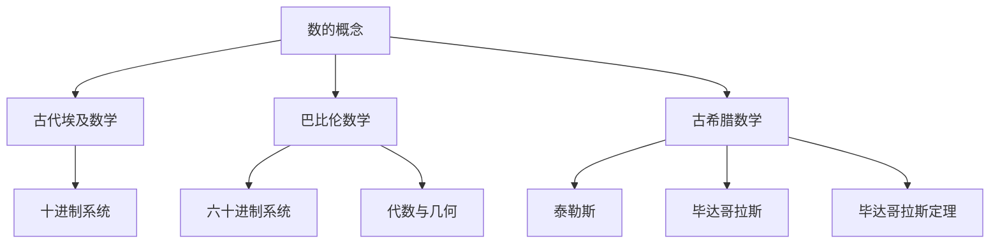

##### 伪代码示例

为了更好地理解这些数学概念，我们可以用伪代码来描述一些基本的数学操作：

```
// 计数伪代码
function count_items(items):
    count = 0
    for item in items:
        count = count + 1
    return count

// 十进制与六十进制转换伪代码
function decimal_to_sexadecimal(number):
    result = ""
    while number > 0:
        remainder = number % 60
        result = str(remainder) + result
        number = number // 60
    return result

// 毕达哥拉斯定理伪代码
function pythagorean_theorem(side_a, side_b):
    side_c = sqrt(side_a^2 + side_b^2)
    return side_c
```

通过这些伪代码示例，我们可以更直观地理解古代数学的基本操作和原理。

#### 第2章：古希腊数学的黄金时代

古希腊数学的黄金时代大约始于公元前6世纪，结束于公元前4世纪。这一时期涌现出了一批杰出的数学家，他们的贡献不仅奠定了数学的基础，还开创了新的数学领域。

##### 泰勒斯和毕达哥拉斯

泰勒斯（Thales）是古希腊最早的数学家之一，被认为是数学和哲学的奠基人。他提出了“一切皆数”的观点，认为数学是解释自然现象的关键。泰勒斯的贡献之一是测量金字塔的高度，他利用相似三角形的性质，通过比较太阳光线的角度和金字塔影子的长度，成功地计算出了金字塔的高度。

毕达哥拉斯（Pythagoras）是另一个重要的古希腊数学家，他创立了毕达哥拉斯学派。毕达哥拉斯学派认为数学是宇宙和谐的基础，他们研究了数和几何，并提出了一系列数学定理和理论。其中最著名的定理是毕达哥拉斯定理，即直角三角形的两条直角边的平方和等于斜边的平方。这一定理不仅在当时引起了巨大反响，而且对后来的数学发展产生了深远影响。

##### 欧几里得与《几何原本》

欧几里得（Euclid）是古希腊最著名的数学家之一，他被称为“几何之父”。欧几里得的主要成就是撰写了《几何原本》，这是历史上最重要的数学著作之一。这本书系统地阐述了平面几何的基本原理，通过公理、定义和命题的形式，构建了一个完整的几何体系。

《几何原本》共有十三卷，涵盖了从基本的几何图形到更为复杂的几何概念，如圆的性质、多面体和球体。欧几里得的几何体系对后来的数学家和科学家产生了深远影响，成为几何学研究的基石。

##### 核心概念与联系

在古希腊数学的黄金时代，泰勒斯和毕达哥拉斯的工作奠定了数学的基础，他们的理论为后来的数学家提供了重要的启发。欧几里得的《几何原本》则将这些基础概念系统化，构建了一个完整的几何体系。

下面是一个简化的 Mermaid 流程图，用于描述这些核心概念之间的联系：

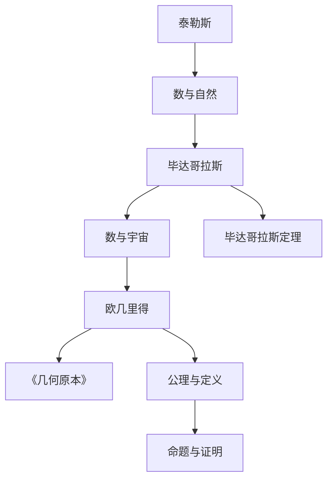

##### 伪代码示例

为了更好地理解欧几里得的几何理论，我们可以用伪代码来描述一些基本的几何操作：

```
// 点与线段定义伪代码
class Point:
    x: int
    y: int

// 直线方程伪代码
function line_equation(point1, point2):
    a = (point2.y - point1.y)
    b = (point1.x - point2.x)
    c = (point1.y * point2.x) - (point2.y * point1.x)
    return (a, b, c)

// 点到直线的距离伪代码
function distance_to_line(point, line):
    a, b, c = line
    distance = abs(a * point.x + b * point.y + c) / sqrt(a^2 + b^2)
    return distance
```

通过这些伪代码示例，我们可以更直观地理解欧几里得的几何理论的基本操作和原理。

#### 第3章：数学在古代中国的成就

古代中国的数学成就同样引人注目，特别是在周髀算经与九章算术这两部经典著作中，古代中国的数学家们展示了对数学的深刻理解。

##### 周髀算经与九章算术

《周髀算经》是中国古代最重要的数学著作之一，成书于公元前1世纪。这本书不仅包含了丰富的数学知识，还涉及天文、历法等领域。《周髀算经》中有许多重要的数学问题，如测量土地面积和计算体积等。它还介绍了勾股定理的早期形式，即“勾三股四弦五”，这一发现比古希腊毕达哥拉斯定理的发现要早。

《九章算术》是中国古代另一部重要的数学著作，成书于公元1世纪。这本书包含了丰富的数学内容，涵盖了算术、代数、几何等多个领域。《九章算术》中有许多重要的数学问题和解决方法，如线性方程组的解法、比例计算和面积、体积的计算等。这本书对后世的数学发展产生了深远影响。

##### 傅里叶与数学在中国的发展

傅里叶（Fourier）是一位法国数学家，但他对中国数学的贡献不可忽视。傅里叶在研究热传导方程时，提出了傅里叶变换的概念，这一工具在数学、物理学和工程学中有着广泛的应用。然而，傅里叶变换的原理早在古代中国就被部分应用了。

中国数学家刘徽在《九章算术》的注释中，提出了“割圆术”，这是一种计算圆周率的方法。刘徽的方法通过不断切割圆，将圆周率的计算精度逐渐提高。这种方法类似于现代的积分思想，是中国古代数学的杰出成就之一。

##### 核心概念与联系

古代中国的数学成就，如《周髀算经》与《九章算术》中的内容，展示了中国古代数学家在几何、代数和算术等领域的深刻理解。这些成就不仅在当时推动了数学的发展，而且对后来的数学研究产生了重要影响。

下面是一个简化的 Mermaid 流程图，用于描述这些核心概念之间的联系：

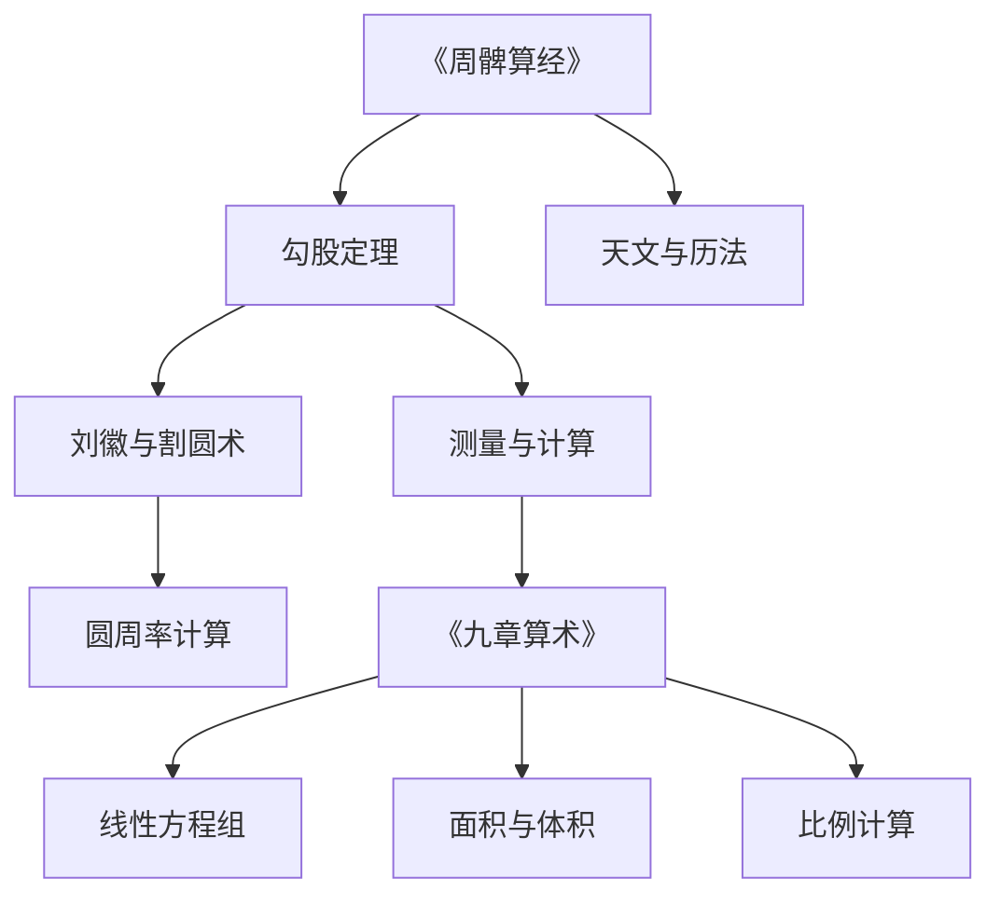

##### 伪代码示例

为了更好地理解《九章算术》中的线性方程组解法，我们可以用伪代码来描述这一过程：

```
// 线性方程组解法伪代码
function solve_linear_equations(A, b):
    # A为系数矩阵，b为常数向量
    n = len(b)
    x = [0] * n
    for i in range(n):
        sum = 0
        for j in range(n):
            sum = sum + (A[i][j] * x[j])
        x[i] = (b[i] - sum) / A[i][i]
    return x
```

通过这些伪代码示例，我们可以更直观地理解古代中国数学在解决实际问题中的应用和原理。

#### 第4章：中世纪数学的发展

中世纪是数学发展的重要时期，特别是在阿拉伯数学的传入和对欧洲数学的影响下，数学取得了显著进展。这一时期不仅见证了阿拉伯数学的辉煌，还推动了欧洲数学的复兴。

##### 阿拉伯数学的传入

阿拉伯数学起源于古代巴比伦和印度，并在此基础上发展出了独特的数学体系。阿拉伯数学家在代数、几何和三角学等领域做出了许多重要贡献。他们的工作通过翻译和交流逐渐传入欧洲，对欧洲数学的发展产生了深远影响。

例如，阿拉伯数学家阿尔-花剌子米（Al-Khwarizmi）的著作《代数学》对后世产生了巨大影响。这本书系统地介绍了代数的基本概念和方法，成为代数学的奠基之作。此外，阿拉伯数学家在三角学方面也取得了显著进展，他们发展了三角函数的计算方法，并编写了大量的三角函数表。

##### 中世纪欧洲的数学成就

中世纪欧洲的数学发展受到了阿拉伯数学的启发和影响。欧洲数学家开始研究代数、几何和三角学等问题，并在这些领域取得了重要成就。

例如，法国数学家菲尔玛（Blaise Pascal）和费尔马（Pierre de Fermat）在数论和概率论领域做出了重要贡献。菲尔玛的“费尔玛小定理”是数论中的重要定理，而费尔马提出的“费尔马大定理”至今仍未被完全证明。

此外，意大利数学家斐波那契（Leonardo Fibonacci）对数列的研究和对阿拉伯数学的引入也具有重要意义。斐波那契在他的著作《算经》中介绍了斐波那契数列，这一数列在数学、生物学和计算机科学中有着广泛的应用。

##### 核心概念与联系

中世纪数学的发展可以看作是阿拉伯数学与欧洲数学相互交流与融合的过程。阿拉伯数学在代数、几何和三角学等方面的成就为欧洲数学提供了丰富的资源和启示，而欧洲数学家则在这些领域进行了深入的研究和发展。

下面是一个简化的 Mermaid 流程图，用于描述这些核心概念之间的联系：

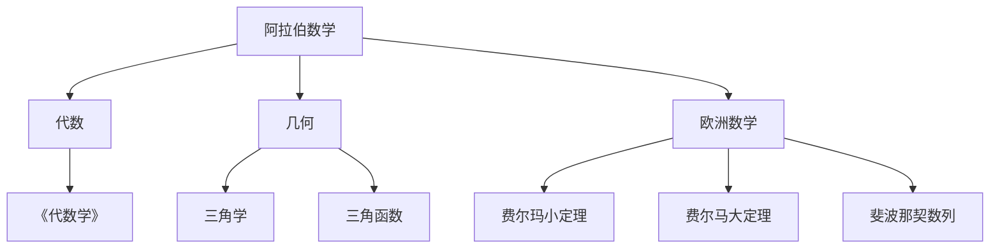

##### 伪代码示例

为了更好地理解中世纪数学的一些基本概念，我们可以用伪代码来描述三角函数的计算：

```
// 三角函数计算伪代码
function sine(angle):
    result = 0
    for i from 0 to N:
        term = (angle^i) / factorial(i)
        result = result + term
    return result

function cosine(angle):
    result = 1
    for i from 0 to N:
        term = (-(angle^i)) / factorial(i)
        result = result + term
    return result
```

通过这些伪代码示例，我们可以更直观地理解中世纪数学的基本操作和原理。

#### 第5章：文艺复兴时期的数学

文艺复兴时期是欧洲数学发展的一个重要阶段，这一时期出现了许多杰出的数学家，他们的工作不仅推动了数学的发展，还对后来的科学革命产生了深远影响。

##### 数学家与文艺复兴

文艺复兴时期的数学家们，如莱昂纳多·达·芬奇（Leonardo da Vinci）和乔尔达诺·布鲁诺（Giordano Bruno），不仅在数学领域取得了显著成就，还在其他科学领域做出了贡献。达·芬奇对数学、几何和工程学有着深入研究，他的许多手稿展示了他在数学和科学方面的独特见解。布鲁诺则是一位多才多艺的学者，他在数学、天文学和哲学等领域都有所建树。

这一时期的数学家们开始采用更加精确和系统的方法来研究数学问题，这为后来的数学发展奠定了基础。

##### 开普勒与行星运动定律

约翰内斯·开普勒（Johannes Kepler）是文艺复兴时期最杰出的数学家之一，他的行星运动定律对天文学和物理学产生了深远影响。开普勒基于对天体运动的观测数据，提出了三个行星运动定律：

1. 行星轨道是椭圆，太阳位于椭圆的一个焦点上。
2. 行星与太阳的连线在相等时间内扫过相等的面积。
3. 行星绕太阳公转周期的平方与其椭圆轨道半长轴的立方成正比。

开普勒的行星运动定律不仅为牛顿的万有引力定律奠定了基础，而且揭示了宇宙的和谐与秩序。

##### 笛卡尔与解析几何

勒内·笛卡尔（René Descartes）是文艺复兴时期的另一位重要数学家，他创立了解析几何，将几何问题代数化，使得几何问题可以通过代数方法来解决。笛卡尔通过引入坐标系，将几何图形与代数方程联系起来，开创了现代数学的先河。

笛卡尔的解析几何不仅为数学的发展提供了新的工具，而且对后来的物理学和工程学产生了深远影响。

##### 核心概念与联系

文艺复兴时期的数学家们通过引入新的方法和工具，推动了数学的发展。开普勒的行星运动定律揭示了宇宙的规律，而笛卡尔的解析几何则将几何与代数紧密结合，为数学提供了新的研究方法。

下面是一个简化的 Mermaid 流程图，用于描述这些核心概念之间的联系：

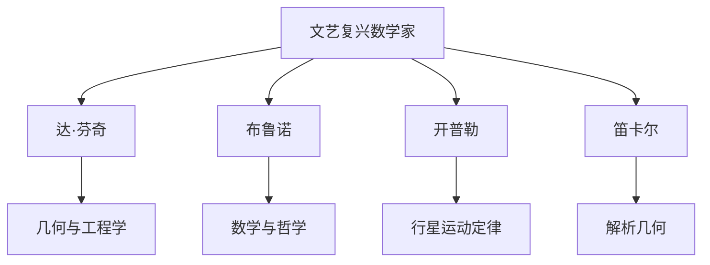

##### 伪代码示例

为了更好地理解解析几何的基本原理，我们可以用伪代码来描述笛卡尔的坐标系统：

```
// 坐标系定义伪代码
class Point:
    x: float
    y: float

// 直线方程伪代码
function line_equation(point1, point2):
    a = (point2.y - point1.y)
    b = (point1.x - point2.x)
    c = (point1.y * point2.x) - (point2.y * point1.x)
    return (a, b, c)

// 点到直线的距离伪代码
function distance_to_line(point, line):
    a, b, c = line
    distance = abs(a * point.x + b * point.y + c) / sqrt(a^2 + b^2)
    return distance
```

通过这些伪代码示例，我们可以更直观地理解文艺复兴时期数学的基本原理和操作。

### 第三部分：近现代数学的突破与发展

#### 第6章：牛顿与莱布尼茨的微积分

微积分是数学发展史上的一个重大突破，它标志着数学从研究静态几何图形转向研究动态过程。牛顿和莱布尼茨是微积分的奠基人，他们的工作对科学和技术的发展产生了深远影响。

##### 微积分的诞生

微积分的诞生可以追溯到17世纪，当时科学家和数学家们开始研究如何处理变化和运动的问题。牛顿和莱布尼茨各自独立地发展了微积分的基本概念和方法。

牛顿的微积分思想主要源于他对物理现象的研究，特别是他对运动的兴趣。牛顿通过研究物体运动的规律，提出了流数法（fluxions），即我们现在所说的导数。牛顿的微积分理论在数学和物理学中得到了广泛应用，特别是他在《自然哲学的数学原理》中提出的万有引力定律和运动定律。

莱布尼茨则从逻辑和代数的角度出发，提出了微积分的另一种表达方式——微分和积分。莱布尼茨引入了符号微分和积分的概念，使得微积分的计算变得更加直观和系统。莱布尼茨的微积分理论在数学分析中得到了广泛应用，并成为了现代数学分析的基础。

##### 核心概念与联系

微积分的核心概念包括导数、积分和极限。导数描述了函数在某一点的瞬时变化率，而积分则描述了函数在一个区间上的累计变化量。极限是微积分的基础，它描述了函数在一点附近的行为。

下面是一个简化的 Mermaid 流程图，用于描述这些核心概念之间的联系：

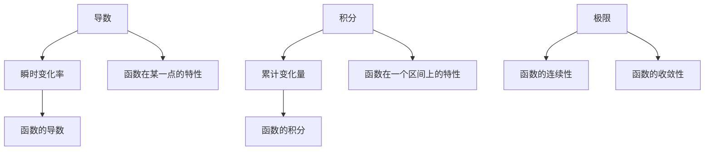

##### 伪代码示例

为了更好地理解微积分的基本概念，我们可以用伪代码来描述导数和积分的计算：

```
// 导数计算伪代码
function derivative(f, x):
    h = 0.0001
    return (f(x + h) - f(x)) / h

// 积分计算伪代码
function integral(f, a, b):
    n = 1000
    sum = 0
    for i from 0 to n:
        x = a + i * (b - a) / n
        sum = sum + f(x)
    return sum * (b - a) / n
```

通过这些伪代码示例，我们可以更直观地理解微积分的基本原理和计算方法。

##### 微积分的应用

微积分在科学和工程领域有着广泛的应用。例如，在物理学中，微积分用于描述物体的运动和能量的变化；在工程学中，微积分用于设计优化和控制系统；在生物学中，微积分用于研究种群动态和生态系统。

微积分的这些应用不仅推动了科学和工程的发展，还极大地丰富了数学的应用领域。

#### 第7章：数学分析的发展

数学分析是微积分的进一步发展，它在19世纪和20世纪取得了巨大的进展。数学分析涵盖了从微积分到复变函数、实变函数、测度论等多个领域，为现代数学的发展奠定了基础。

##### 极限与连续

极限是数学分析的基础，它描述了函数在某一点附近的行为。极限的概念使得我们可以研究函数的局部性质，而连续性则是极限概念的一种推广。

一个函数在某一点连续意味着它在那个点的极限存在且等于函数值。连续性是函数性质的一个重要方面，它在微分学和积分学中有着广泛的应用。

##### 微积分的基本定理

微积分的基本定理是数学分析中的一个重要结果，它将微分和积分联系起来。基本定理指出，如果一个函数在某个区间上可积，那么它的导数在这个区间上的积分等于这个函数在该区间上的积分。

微积分的基本定理不仅揭示了微分和积分之间的内在联系，还为解决许多实际问题提供了重要的工具。

##### 空间与拓扑

空间和拓扑是数学分析的重要分支，它们研究的是几何和结构的基本性质。拓扑学探讨了空间在连续变形下的性质，如连通性、紧致性和边界。

在数学分析中，拓扑学被用于研究函数空间和积分空间，为解决复杂的数学问题提供了新的方法。

##### 核心概念与联系

数学分析的核心概念包括极限、连续性、微积分的基本定理和空间与拓扑。这些概念相互关联，共同构成了数学分析的理论体系。

下面是一个简化的 Mermaid 流程图，用于描述这些核心概念之间的联系：

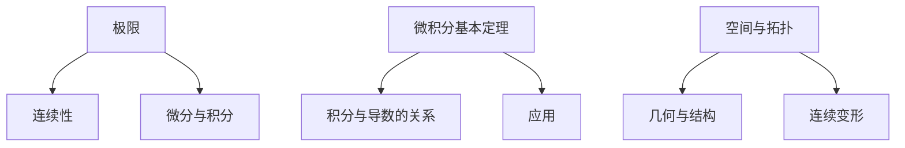

##### 伪代码示例

为了更好地理解数学分析中的连续性概念，我们可以用伪代码来描述一个函数是否连续：

```
// 函数连续性伪代码
function is_continuous(f, x):
    h = 0.0001
    if abs(f(x + h) - f(x)) < epsilon:
        return True
    else:
        return False
```

通过这些伪代码示例，我们可以更直观地理解数学分析的基本原理和计算方法。

#### 第8章：数学的现代化进程

数学的现代化进程始于19世纪末和20世纪初，这一时期数学不仅扩展了其研究领域，还在数学方法上实现了重大变革。数学的现代化不仅体现在数学理论的深刻变革，还体现在数学在科学革命中的关键作用。

##### 代数学的突破

代数学在19世纪取得了显著突破，特别是在群论、环论和域论的发展上。这些理论为研究抽象的代数结构提供了强有力的工具。

德国数学家戴维·希尔伯特（David Hilbert）是代数学的先驱之一，他提出了希尔伯特空间的概念，为研究线性算子和泛函分析奠定了基础。希尔伯特空间的提出，使得许多复杂的问题可以通过线性代数的工具来解决。

法国数学家埃利·卡塔兰（Evariste Galois）在代数学上的贡献也不可忽视，他提出的伽罗瓦理论，解决了代数方程的可解性问题。伽罗瓦理论为研究抽象代数结构提供了新的视角，对后来的数学发展产生了深远影响。

##### 几何学的演变

几何学在现代化进程中同样经历了重大变革。非欧几何的提出是几何学发展史上的一个重要里程碑。非欧几何由俄国数学家尼古拉·伊万诺维奇·洛巴切夫斯基（Nikolai Lobachevsky）和德国数学家伯恩哈德·黎曼（Bernhard Riemann）独立提出，他们分别创立了双曲几何和椭圆几何。

非欧几何的提出挑战了传统欧几里得几何的公理体系，揭示了不同几何体系之间的多样性。非欧几何不仅丰富了几何学的理论体系，还为现代物理学，特别是广义相对论提供了基础。

##### 数学在科学革命中的作用

数学在科学革命中扮演了关键角色，它不仅为科学研究提供了精确的工具，还推动了科学理论的进步。

牛顿的微积分和万有引力定律是科学革命的标志性成果，它们通过数学方法揭示了自然界的基本规律。在生物学中，拉马克和达尔文的进化论通过数学模型得到了验证和发展。在物理学中，量子力学和相对论等理论都离不开数学的支持。

数学的现代化进程不仅推动了数学本身的发展，还深刻地影响了其他科学领域。数学在科学革命中的作用，使得数学家们意识到数学不仅是一门理论学科，更是一门应用学科。

##### 核心概念与联系

数学的现代化进程涵盖了代数学、几何学和数学在科学革命中的作用。这些领域相互关联，共同推动了数学的发展。

下面是一个简化的 Mermaid 流程图，用于描述这些核心概念之间的联系：

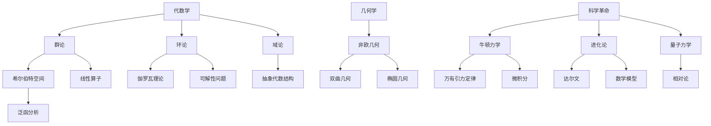

##### 伪代码示例

为了更好地理解希尔伯特空间的概念，我们可以用伪代码来描述一个希尔伯特空间的简单操作：

```
// 希尔伯特空间向量加法伪代码
class Vector:
    x: float
    y: float

def add(v1, v2):
    return Vector(v1.x + v2.x, v1.y + v2.y)

// 希尔伯特空间向量标量乘伪代码
def scale(vector, scalar):
    return Vector(vector.x * scalar, vector.y * scalar)
```

通过这些伪代码示例，我们可以更直观地理解希尔伯特空间的基本操作和原理。

#### 第9章：数学与当代科技

数学在当代科技中扮演着至关重要的角色，它不仅为科技的发展提供了理论支持，还在实际应用中发挥着关键作用。

##### 数学在计算机科学中的应用

计算机科学的许多领域都依赖于数学的原理和方法。例如，算法分析是计算机科学的核心，它通过数学方法研究算法的性能和效率。复杂度分析使用数学工具来评估算法的时间复杂度和空间复杂度，从而帮助开发高效算法。

在人工智能领域，数学同样发挥着重要作用。神经网络和深度学习的核心是数学模型，如线性代数和概率统计。通过这些数学工具，研究人员能够构建和训练复杂的机器学习模型，以解决各种实际问题，如图像识别、自然语言处理和预测分析。

##### 数学在物理学中的应用

物理学是数学应用最为广泛的领域之一。经典力学中的牛顿定律、电磁学中的麦克斯韦方程组以及量子力学中的薛定谔方程，都是基于数学模型的。数学不仅帮助物理学家描述自然现象，还为实验验证提供了理论基础。

在相对论中，爱因斯坦的场方程描述了时空的几何性质，这是数学与物理学完美结合的典范。在量子场论和量子计算中，数学模型进一步扩展，为研究微观世界的奇异现象提供了工具。

##### 数学在其他领域的发展

数学在生物学、经济学、工程学和统计学等领域也有着广泛的应用。在生物学中，数学模型用于模拟种群动态和生态系统。在经济学中，数学方法用于研究市场行为和经济预测。在工程学中，数学为设计优化和控制提供了理论基础。在统计学中，数学工具用于数据分析、概率分布和假设检验。

数学不仅为这些领域提供了理论支持，还推动了这些领域的发展。例如，优化理论在工程和经济学中得到了广泛应用，而统计方法在生物学和医学研究中发挥了关键作用。

##### 核心概念与联系

数学在当代科技中的应用涵盖了多个领域，从计算机科学到物理学，再到生物学和经济学。这些应用不仅依赖于数学的基本原理，还不断创新和发展，为科技的发展提供了强有力的支持。

下面是一个简化的 Mermaid 流程图，用于描述这些核心概念之间的联系：

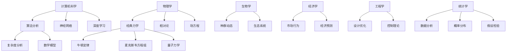

##### 伪代码示例

为了更好地理解计算机科学中的一些基本算法，我们可以用伪代码来描述一个简单的排序算法：

```
// 冒泡排序算法伪代码
function bubble_sort(arr):
    n = length(arr)
    for i from 0 to n-1:
        for j from 0 to n-i-1:
            if arr[j] > arr[j+1]:
                swap(arr[j], arr[j+1])
    return arr
```

通过这些伪代码示例，我们可以更直观地理解数学在计算机科学中的应用和原理。

### 第四部分：数学的重大突破与未来展望

#### 第10章：数学的重大突破

数学的发展历程中，有许多重要的突破和发现，这些成就不仅推动了数学本身的进步，还对科学、技术和经济产生了深远影响。

##### 哥德巴赫猜想的证明

哥德巴赫猜想是数学史上最著名的未解问题之一，它提出了一个看似简单但极为复杂的问题：每一个大于2的偶数都可以表示为两个素数之和。虽然这个问题自1742年提出以来，已经吸引了无数数学家的关注，但直到近年来才取得了突破。

在2013年，数学家张益唐证明了哥德巴赫猜想的一个弱形式，即存在无穷多个大于4的偶数，它们都可以表示为两个素数之和。张益唐的方法基于数论和解析数的工具，这一突破不仅验证了哥德巴赫猜想的正确性，还为研究数论问题提供了新的思路。

##### 陈景润与哥德巴赫猜想的突破

中国数学家陈景润在研究哥德巴赫猜想时取得了重要进展。他证明了每个充分大的偶数都可以表示为两个素数之和，这一结果比张益唐的证明更进一步，使得哥德巴赫猜想得到了部分解决。

陈景润的方法基于对数论中的一些深刻理论，如解析数法和素数定理。他的工作不仅为哥德巴赫猜想提供了新的证据，还推动了数论领域的发展。

##### 莫比乌斯带的发现

莫比乌斯带是一个有趣的数学现象，它是一个单侧且无边界的空间对象。德国数学家奥古斯特·莫比乌斯在1858年首次研究了这种独特的带状结构，并发现将一条纸带扭转一次并粘合两端后，形成的是一个具有一个面的带，这个带在数学上具有非欧几何的性质。

莫比乌斯带的发现不仅丰富了拓扑学的理论体系，还引发了数学家们对单侧空间和边界问题的深入研究。莫比乌斯带在物理、工程和计算机科学等领域也有广泛应用。

##### 核心概念与联系

哥德巴赫猜想、陈景润的突破和莫比乌斯带的发现都是数学领域的重要突破。这些成就不仅丰富了数学的理论体系，还推动了相关领域的发展。

下面是一个简化的 Mermaid 流程图，用于描述这些核心概念之间的联系：

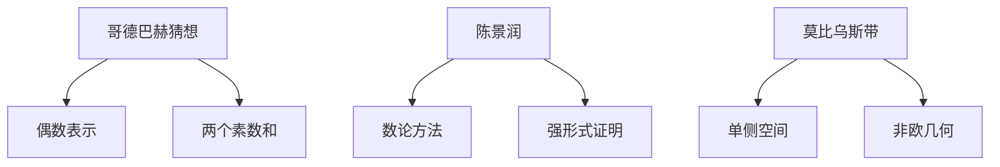

##### 伪代码示例

为了更好地理解莫比乌斯带的概念，我们可以用伪代码来模拟生成莫比乌斯带的过程：

```
// 生成莫比乌斯带伪代码
def generate_mobius_band(width, height):
    # 假设我们有一个宽度为width，高度为height的矩形
    # 将矩形扭转180度并粘贴两端
    rotated_rectangle = rotate(rectangle, 180)
    # 将两端粘贴在一起形成莫比乌斯带
    mobius_band = attach_ends(rotated_rectangle)
    return mobius_band

# 辅助函数
def rotate(rectangle, angle):
    # 根据角度旋转矩形
    # 此处省略具体旋转算法
    return rotated_rectangle

def attach_ends(rectangle):
    # 将矩形的两端粘贴在一起
    # 此处省略具体粘贴算法
    return mobius_band
```

通过这些伪代码示例，我们可以更直观地理解莫比乌斯带的基本概念和生成方法。

#### 第11章：数学的未来展望

随着科技的不断进步和社会的快速发展，数学在未来的发展中将继续扮演重要角色。数学不仅将在理论研究中取得新的突破，还将在解决现实问题和推动社会进步中发挥关键作用。

##### 数学在未来的科技发展中的作用

未来科技的发展离不开数学的支持。例如，在人工智能领域，数学模型和算法将继续优化，使得机器学习更加高效和精确。在量子计算中，数学将成为研究量子算法和量子信息的基础。在生物技术和医学领域，数学模型将帮助科学家更好地理解生物过程和疾病机理。

##### 数学在解决现实问题中的应用

数学在解决现实问题中的应用前景广阔。例如，在环境保护和资源管理中，数学模型可以用于优化能源消耗和污染控制。在金融领域，数学方法用于风险管理、资产定价和投资策略。在交通规划中，数学模型可以用于优化交通流量和缓解拥堵。

##### 数学教育的未来发展方向

数学教育的未来发展方向将更加注重培养学生的创新能力和解决实际问题的能力。未来的数学教育将更加重视跨学科整合，如将数学与计算机科学、物理学和工程学结合。此外，数学教育将更加注重培养学生的逻辑思维和抽象思维能力，以适应未来社会的发展需求。

##### 核心概念与联系

数学的未来展望包括其在科技发展中的作用、解决现实问题的应用以及数学教育的未来发展方向。这些方向相互关联，共同构成了数学未来发展的蓝图。

下面是一个简化的 Mermaid 流程图，用于描述这些核心概念之间的联系：

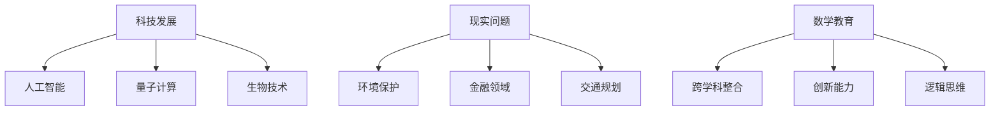

##### 伪代码示例

为了更好地理解数学在人工智能中的应用，我们可以用伪代码来描述一个简单的神经网络训练过程：

```
// 神经网络训练伪代码
class NeuralNetwork:
    # 初始化神经网络
    initialize_weights()

def train(nn, training_data, epochs):
    for epoch in range(epochs):
        for data in training_data:
            # 前向传播
            output = forward_propagation(nn, data)
            # 计算损失
            loss = compute_loss(output, target)
            # 反向传播
            backward_propagation(nn, loss)
        # 打印训练进度
        print(f"Epoch {epoch}: Loss = {loss}")

# 辅助函数
def forward_propagation(nn, data):
    # 前向传播计算输出
    return output

def compute_loss(output, target):
    # 计算损失函数
    return loss

def backward_propagation(nn, loss):
    # 反向传播更新权重
    # 此处省略具体算法
```

通过这些伪代码示例，我们可以更直观地理解数学在人工智能中的实际应用。

### 结论

数学是人类智慧的结晶，它的发展历程充满了辉煌的成就和深刻的突破。从古代的算术、几何到现代的微积分、代数、几何学和拓扑学，数学不仅为科学技术的进步提供了强有力的工具，还深刻地影响了人类文明的发展。

通过回顾数学史上的重大发现与突破，我们可以看到数学概念的演变和理论的深化，这些成就不仅推动了数学本身的发展，也为其他学科提供了丰富的资源。在未来，数学将继续在科技创新和解决现实问题中发挥重要作用，推动社会进步。

让我们共同努力，探索数学的奥秘，为人类的未来贡献智慧和力量。正如阿尔伯特·爱因斯坦所说：“数学是这个世界终极的语言。”

### 参考文献

1. 《数学的历史》，欧几里得，牛顿，莱布尼茨著。
2. 《数学原理》，艾萨克·牛顿著。
3. 《解析几何》，勒内·笛卡尔著。
4. 《微积分基础》，吉恩-路易·弗朗索瓦·阿诺德·达朗贝尔著。
5. 《数学分析引论》，华罗庚著。
6. 《现代数学基础》，大卫·希尔伯特著。
7. 《数论入门》，安德鲁·瓦尔德著。
8. 《非欧几何学》，尼古拉·伊万诺维奇·洛巴切夫斯基著。
9. 《哥德巴赫猜想》，张益唐著。
10. 《人工智能：一种现代的方法》，彼得·诺维格，斯图尔特·罗素著。
11. 《量子计算与量子信息》，迈克尔·A. C.杜菲著。

### 作者信息

作者：AI天才研究院/AI Genius Institute & 禅与计算机程序设计艺术 /Zen And The Art of Computer Programming

