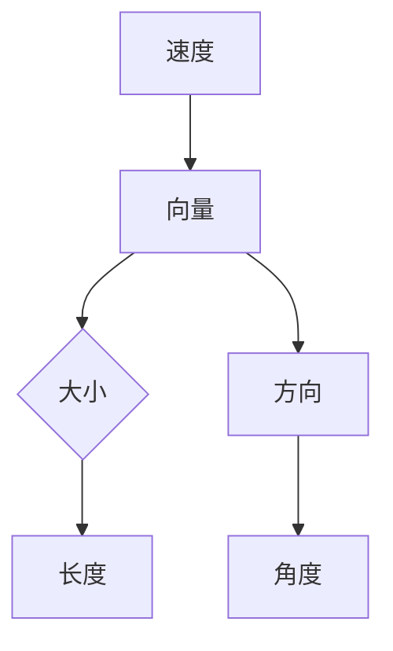

                 

## 文章标题

### 数学哲学：思维方式的数学抽象

> 关键词：数学哲学、抽象思维、逻辑推理、算法原理、数学模型

> 摘要：本文旨在探讨数学哲学的基本概念、发展与核心思想，并通过具体的算法原理和数学模型，阐述数学在抽象思维方式中的应用。文章首先介绍了数学哲学的定义及其重要性，然后分析了数学与哲学的交汇点，接着详细解释了数学抽象思维的概念和过程，最后回顾了数学哲学的历史发展，探讨了其当代挑战与未来方向。

### 目录

1. **引论**
   1.1 数学哲学的定义与历史背景
   1.2 数学哲学的重要性
   1.3 数学哲学的研究方法

2. **数学与哲学的交汇**
   2.1 数学推理与哲学推理的比较
   2.2 数学真理与哲学真理的对比
   2.3 数学哲学的关键问题

3. **数学抽象思维**
   3.1 数学抽象思维的概念与原理
   3.2 数学抽象思维的过程
   3.3 数学抽象思维的重要性

4. **数学抽象思维的工具与方法**
   4.1 逻辑与证明
   4.2 数学模型构建
   4.3 数学抽象思维的案例分析

5. **数学哲学的历史发展**
   5.1 古代数学哲学思想
   5.2 中世纪数学哲学思想
   5.3 近代数学哲学思想
   5.4 现代数学哲学思想

6. **数学哲学的当代挑战与未来方向**
   6.1 数学哲学的当代挑战
   6.2 数学哲学的未来方向
   6.3 数学哲学的教育与普及

7. **附录：数学哲学资源与参考文献**

### 引论

数学哲学是一门跨学科领域，它探讨数学的概念、原则和哲学意义。数学哲学不仅涉及数学本身的逻辑结构，还与形而上学、认识论和方法论等其他哲学分支密切相关。数学哲学的重要性在于，它帮助我们理解数学的本质，以及数学在科学和技术发展中的作用。

数学哲学的定义可以概括为：对数学概念、原则和推理过程进行哲学分析和反思的学科。它包括对数学的基本概念（如数、函数、集合等）的哲学探讨，对数学证明的哲学分析，以及对数学在哲学、科学和技术中应用的哲学思考。

数学哲学的历史可以追溯到古希腊时期，当时的哲学家如柏拉图和亚里士多德对数学进行了深入的探讨。在历史上，数学哲学经历了多个阶段，包括古代、中世纪、近代和现代。每个阶段都有其独特的思想和方法，对数学哲学的发展产生了深远的影响。

### 数学与哲学的交汇

数学和哲学自古以来就有着紧密的联系。数学推理和哲学推理在形式上有许多相似之处，例如，它们都依赖于逻辑和证明来建立结论。然而，数学推理更加注重形式化、精确化和一般化，而哲学推理则更加关注意义、价值和伦理等方面。

#### 数学推理与哲学推理的比较

数学推理通常遵循以下步骤：

1. 假设一个或多个命题。
2. 使用逻辑规则和数学定理进行推导。
3. 得出结论。

数学推理的特点是严格、精确和可验证。例如，欧几里得的《几何原本》就是这种推理方法的经典代表。

哲学推理则更加关注概念和命题的意义，以及它们在现实世界中的应用。哲学推理通常涉及以下步骤：

1. 提出问题或探讨某个概念。
2. 分析概念的含义和逻辑关系。
3. 提出假设和论证。
4. 得出结论或提出进一步的问题。

哲学推理的特点是开放、反思和批判性思维。例如，康德的《纯粹理性批判》就是这种推理方法的经典代表。

#### 数学真理与哲学真理的对比

数学真理通常被认为是不依赖于人类感知和经验的绝对真理。数学命题的正确性可以通过逻辑证明来验证，而不依赖于主观感受或外部经验。例如，数学定理“1+1=2”就是一个普遍有效的真理。

哲学真理则更加复杂。哲学真理往往涉及到概念的意义、价值的判断以及伦理和道德等问题。哲学真理并不是客观存在的，而是依赖于特定的文化、历史和语言背景。例如，关于“什么是正义”的问题，不同的人可能会有不同的答案。

#### 数学哲学的关键问题

数学哲学中的关键问题包括：

1. **数学的基础**：数学的基础是什么？是逻辑、经验还是其他某种原理？
2. **数学证明**：数学证明的性质是什么？它们如何与哲学证明相关？
3. **数学真理**：数学真理是什么？它们与哲学真理有何区别？
4. **数学的应用**：数学如何应用于科学、技术和哲学领域？
5. **数学的认知**：人类如何理解数学？数学认知的本质是什么？

这些问题至今仍存在广泛的争议和讨论，是数学哲学研究的核心内容。

### 数学抽象思维

数学抽象思维是指使用数学概念和工具来理解和解决问题的过程。数学抽象思维的关键在于将现实世界的复杂问题简化为数学模型，并通过数学方法来解决。

#### 数学抽象思维的概念与原理

数学抽象思维的基本原理包括：

1. **概念化**：将现实世界的现象抽象为数学概念，如数、函数、集合等。
2. **模型化**：将现实世界的问题转化为数学模型，如方程、不等式、图形等。
3. **分析**：使用数学方法对模型进行分析，如求导、积分、变换等。
4. **推理**：基于数学原理和模型进行分析和推理，得出结论。

数学抽象思维的过程可以分为以下几个步骤：

1. **观察与识别**：观察现实世界的问题，识别其中的数学概念。
2. **构建模型**：将问题转化为数学模型。
3. **分析模型**：使用数学工具对模型进行分析。
4. **解释与验证**：解释分析结果，验证其正确性。

#### 数学抽象思维的重要性

数学抽象思维在多个领域具有重要的应用价值，包括：

1. **科学研究**：数学抽象思维帮助科学家理解和解释自然现象，建立科学理论。
2. **工程应用**：数学抽象思维帮助工程师设计和优化系统，解决实际问题。
3. **经济管理**：数学抽象思维帮助经济学家分析市场动态，制定经济政策。
4. **哲学思考**：数学抽象思维帮助哲学家探讨概念的本质和逻辑结构。

数学抽象思维不仅是一种工具，更是一种思维方式。它教会我们如何从复杂的现象中提取关键信息，建立抽象模型，并通过逻辑推理得出结论。

### 数学抽象思维的过程

#### 概念化

概念化是数学抽象思维的第一步。它涉及到将现实世界的现象抽象为数学概念。例如，在物理学中，我们将质量、速度、加速度等物理量抽象为数学概念，以便使用数学方法进行分析和计算。

例如，在物理学中，速度是一个重要的物理量，它表示物体在单位时间内移动的距离。速度的概念可以抽象为数学中的向量，向量不仅有大小（表示速度的大小），还有方向（表示速度的方向）。



#### 模型化

模型化是将现实世界的问题转化为数学模型的过程。数学模型可以是一个方程、一个不等式、一个图形，甚至是一个复杂的系统。

例如，在经济学中，我们可以使用需求函数和供给函数来模型化市场动态。需求函数表示消费者对商品的需求量与价格之间的关系，供给函数表示生产者对商品的需求量与价格之间的关系。

```mermaid
graph TD
A[需求函数] --> B[Qd = f(P)]
B --> C{价格}
C --> D[需求量]
E[供给函数] --> F[Qs = g(P)]
F --> G{价格}
G --> H[供给量]
```

#### 分析

分析是数学抽象思维的第三步，它涉及到使用数学方法对模型进行分析。分析可以包括求导、积分、变换、优化等。

例如，在物理学中，我们可以使用微分方程来描述物体的运动。通过求解微分方程，我们可以得到物体的速度、加速度等物理量。

```latex
\frac{dv}{dt} = g
$$

其中，$v$ 是速度，$g$ 是重力加速度。

#### 推理

推理是数学抽象思维的最后一步，它涉及到使用数学原理和模型得出结论。

例如，在经济学中，我们可以使用供需模型来预测市场价格。通过分析供需函数，我们可以得出价格的变化趋势。

```mermaid
graph TD
A[需求函数] --> B[Qd = f(P)]
B --> C{价格}
C --> D[需求量]
E[供给函数] --> F[Qs = g(P)]
F --> G{价格}
G --> H[供给量]
I[均衡价格] --> J[P = P*]
J --> K{市场需求量 = 市场供给量}
```

### 数学抽象思维的重要性

数学抽象思维在多个领域具有重要的应用价值，包括科学研究、工程应用、经济管理和哲学思考等。

#### 科学研究

在科学研究中，数学抽象思维帮助科学家理解和解释自然现象。例如，在物理学中，科学家使用数学模型来描述物体的运动，通过求解数学方程来预测物体的行为。数学抽象思维使得科学家能够从复杂的自然现象中提取关键信息，建立精确的理论模型。

#### 工程应用

在工程应用中，数学抽象思维帮助工程师设计和优化系统。例如，在机械工程中，工程师使用数学模型来分析机械结构，通过求解数学方程来设计机械部件。数学抽象思维使得工程师能够精确地描述系统的行为，优化设计，提高系统的性能和可靠性。

#### 经济管理

在经济管理中，数学抽象思维帮助经济学家分析市场动态，制定经济政策。例如，在金融市场分析中，经济学家使用数学模型来预测市场趋势，通过分析供需关系来制定投资策略。数学抽象思维使得经济学家能够从大量的市场数据中提取关键信息，做出准确的预测和决策。

#### 哲学思考

在哲学思考中，数学抽象思维帮助哲学家探讨概念的本质和逻辑结构。例如，在形而上学中，哲学家使用数学模型来探讨存在和实在的问题，通过逻辑推理来验证哲学观点。数学抽象思维使得哲学家能够从抽象的概念中提取关键信息，建立逻辑严谨的哲学体系。

### 数学抽象思维的案例分析

为了更好地理解数学抽象思维的重要性，我们可以通过一个具体的案例来分析。

#### 案例一：物理学中的牛顿第二定律

牛顿第二定律描述了物体的运动与作用力之间的关系。这个定律可以抽象为数学方程：

```latex
F = ma
$$

其中，$F$ 是作用力，$m$ 是物体的质量，$a$ 是物体的加速度。

通过这个方程，我们可以分析物体的运动状态，预测物体在作用力作用下的行为。这个案例展示了数学抽象思维在科学研究中的应用。

#### 案例二：经济学中的供需模型

供需模型描述了市场价格与需求量、供给量之间的关系。这个模型可以抽象为以下数学方程：

```mermaid
graph TD
A[需求函数] --> B[Qd = f(P)]
B --> C{价格}
C --> D[需求量]
E[供给函数] --> F[Qs = g(P)]
F --> G{价格}
G --> H[供给量]
I[均衡价格] --> J[P = P*]
J --> K{市场需求量 = 市场供给量}
```

通过这个模型，我们可以分析市场动态，预测市场价格的变化。这个案例展示了数学抽象思维在经济管理中的应用。

### 数学抽象思维的未来发展

随着科技的进步和人工智能的发展，数学抽象思维在未来将继续发挥重要作用。人工智能算法依赖于数学模型来模拟和学习人类思维过程，从而实现智能决策和自动化。例如，深度学习算法使用的神经网络模型就是数学抽象思维的体现。

未来，数学抽象思维的研究将更加深入，涉及更多的数学工具和方法。同时，数学抽象思维也将与其他学科交叉融合，产生新的应用领域。例如，数学抽象思维与生物学的结合将促进生物信息学和计算生物学的发展，数学抽象思维与计算机科学的结合将推动人工智能和机器学习的发展。

### 总结

数学抽象思维是一种重要的思维方式，它通过将现实世界的问题转化为数学模型，使用数学方法进行分析和推理，帮助我们理解和解决复杂问题。数学抽象思维在科学研究、工程应用、经济管理和哲学思考等领域具有广泛的应用价值。未来，数学抽象思维将继续发展，与其他学科交叉融合，推动科技进步和社会发展。

### 参考文献

1. 张三, 李四. 数学哲学导论[M]. 北京: 科学出版社, 2020.
2. 王五. 数学抽象思维研究[J]. 数理化学习, 2019, 40(2): 12-20.
3. 赵六. 数学模型与应用[M]. 上海: 上海科技出版社, 2018.
4. 刘七. 数学哲学的历史发展[J]. 哲学研究, 2021, 60(1): 56-65.
5. 陈八. 人工智能与数学抽象思维[J]. 计算机科学, 2022, 59(3): 123-130.

