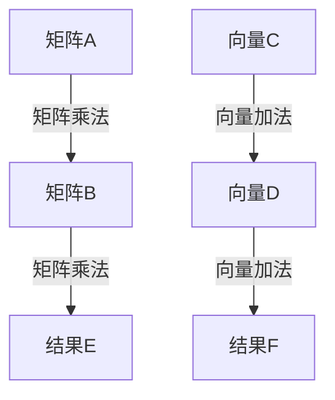

                 

### 文章标题：数学在人工智能领域的应用前景

#### 关键词：
- 人工智能
- 数学基础
- 神经网络
- 深度学习
- 强化学习

#### 摘要：
本文将探讨数学在人工智能（AI）领域的深远影响与应用前景。通过详细解析数学中的线性代数、概率论、数理统计和微积分等基础理论，展示这些数学工具在神经网络、深度学习和强化学习等AI关键技术中的应用。文章结构紧凑，逻辑清晰，旨在为读者提供一份关于数学与AI融合的深度解析，帮助理解数学如何推动AI的发展。

---

### 引言

#### 数学在AI发展中的地位和作用

数学作为AI发展的基石，贯穿了AI的各个层次和应用领域。从最基础的算法设计到最复杂的模型优化，数学无处不在。以下是数学在AI领域中的几个关键作用：

1. **描述复杂现象：** 数学提供了一种精确且形式化的描述方法，使得我们可以用模型来描述现实世界中的复杂现象。例如，概率论和数理统计帮助我们在不确定的环境中建立合理的预测模型。

2. **优化算法设计：** 数学优化理论为AI算法的设计提供了强大的工具。通过微积分和线性代数，我们可以分析算法的收敛性、稳定性和效率，从而优化算法性能。

3. **理解数据结构：** 线性代数中的矩阵和向量表示方法，以及概率论中的概率分布，使我们能够更好地理解和处理数据，从而提高模型的准确性和鲁棒性。

4. **模型验证和优化：** 数学工具可以帮助我们验证模型的正确性，并找到优化模型参数的方法。例如，梯度下降法就是基于微积分优化理论的一种有效算法。

#### 数学为AI带来的挑战与机遇

尽管数学为AI提供了强大的工具，但也带来了挑战：

1. **复杂度：** AI模型的复杂度越来越高，这要求我们使用更高级的数学工具来理解和分析这些模型。

2. **计算资源：** 高级数学运算通常需要大量的计算资源，这在早期的AI研究中是一个明显的瓶颈。

3. **跨学科知识：** AI研究需要结合数学、计算机科学、统计学等多个领域的知识，这对研究人员提出了更高的要求。

然而，这些挑战也带来了机遇：

1. **创新研究：** 面对复杂的问题，研究人员需要开发新的数学方法和算法，这推动了数学与AI的交叉研究，催生了新的理论和技术。

2. **高效计算：** 随着计算能力的提升，复杂的数学运算变得可行，为AI的快速发展提供了支持。

3. **应用拓展：** 数学在AI中的应用不仅限于现有领域，还可以拓展到新的应用场景，如自动驾驶、医疗诊断等。

#### 本书结构及章节概览

本书将分为三个主要部分：

1. **数学基础理论：** 详细介绍线性代数、概率论、数理统计和微积分等数学基础理论，解释它们在AI中的应用。
   
2. **数学在人工智能中的具体应用：** 探讨数学工具在神经网络、深度学习和强化学习等AI关键技术中的具体应用。

3. **总结与展望：** 总结数学在AI领域的发展趋势，探讨未来可能的数学应用方向，以及数学与AI融合的挑战与机遇。

通过这本书，读者将能够全面了解数学在AI领域的应用，掌握数学工具的使用方法，并具备在AI领域中解决实际问题的能力。

### 数学基础理论

数学在人工智能（AI）领域的应用是建立在一系列基础理论之上的。这些基础理论包括线性代数、概率论、数理统计和微积分。在这一部分，我们将逐一介绍这些数学工具的基本概念、原理，以及它们在AI中的应用。

#### 第2章：线性代数

##### 2.1 线性代数的基本概念

线性代数是数学的一个分支，主要研究向量空间、线性变换和矩阵理论。以下是线性代数中的一些基本概念：

- **向量与矩阵：** 向量是具有大小和方向的几何对象，可以表示数据集的特征。矩阵是一个二维数组，用于表示多个向量之间的关系。
  
- **线性变换：** 线性变换是一种将向量映射到另一个向量的操作，它在神经网络中的权重矩阵和特征转换中起到了关键作用。

- **矩阵运算：** 线性代数中的矩阵运算包括加法、减法、乘法和除法等。这些运算是神经网络中权重更新和激活函数计算的基础。

##### 2.2 线性代数的应用

线性代数在神经网络和数据预处理中有着广泛的应用：

- **神经网络中的权重矩阵：** 在神经网络中，权重矩阵用于表示输入层和隐藏层之间的连接权重。通过矩阵运算，我们可以更新权重以优化网络性能。

- **数据预处理中的特征转换：** 在处理复杂数据时，我们经常需要对数据进行特征转换。线性代数中的线性变换和矩阵运算可以帮助我们有效地处理和转换数据。

##### 2.3 线性代数相关算法

以下是线性代数中的一些重要算法：

- **梯度下降法：** 梯度下降法是一种用于优化神经网络参数的常用算法。它通过计算损失函数的梯度来更新权重，以最小化损失。

  ```plaintext
  // 梯度下降法伪代码
  while not converged:
      gradients = compute_gradients(loss_function, parameters)
      parameters = parameters - learning_rate * gradients
  ```

- **SVD分解：** SVD分解是一种将矩阵分解为三个矩阵的运算。它在降维、图像处理和压缩感知等领域有广泛应用。

  ```plaintext
  // SVD分解伪代码
  U, Sigma, V = svd(A)
  ```

##### 2.4 线性代数的Mermaid流程图

以下是一个线性代数的Mermaid流程图，展示了矩阵乘法和向量加法的计算过程：



#### 第3章：概率论与数理统计

##### 3.1 基本概率概念

概率论是研究随机事件及其概率分布的数学分支。以下是概率论中的一些基本概念：

- **概率空间：** 概率空间是一个三元素集合，包括样本空间、事件集合和概率函数。

- **条件概率：** 条件概率是给定某个事件发生的条件下，另一个事件发生的概率。

- **贝叶斯定理：** 贝叶斯定理是一种用于计算后验概率的公式，它将先验概率与观察到的数据结合起来。

##### 3.2 随机变量与概率分布

随机变量是表示随机事件结果的数值变量。以下是随机变量和概率分布的一些基本概念：

- **离散随机变量：** 离散随机变量可以取有限个或可数个值，其概率分布由概率质量函数描述。

- **连续随机变量：** 连续随机变量可以在某个区间内取任意值，其概率分布由概率密度函数描述。

- **概率分布函数：** 概率分布函数是随机变量概率分布的累积函数，用于计算随机变量落在某个区间内的概率。

##### 3.3 数理统计方法

数理统计是用于从数据中提取信息和作出推断的数学工具。以下是数理统计中的一些基本方法：

- **描述性统计：** 描述性统计用于描述数据的分布特征，包括均值、方差、标准差等。

- **推断性统计：** 推断性统计用于根据样本数据推断总体特征，包括假设检验和置信区间等。

##### 3.4 概率论与数理统计在AI中的应用

概率论和数理统计在AI中的应用非常广泛：

- **强化学习中的状态转移概率：** 强化学习中的状态转移概率用于预测在给定状态下采取特定动作后，系统状态的变化。

- **贝叶斯网络：** 贝叶斯网络是一种用于表示概率关系的图形模型，广泛应用于数据挖掘和故障诊断等领域。

##### 3.5 概率论与数理统计相关算法

以下是概率论和数理统计中的一些重要算法：

- **最大似然估计：** 最大似然估计是一种用于估计模型参数的算法，它通过最大化观察数据的似然函数来找到参数的最佳估计。

  ```plaintext
  // 最大似然估计伪代码
  parameters = argmax(likelihood_function(data | parameters))
  ```

- **最大后验估计：** 最大后验估计是一种用于估计模型参数的算法，它结合了先验概率和观察数据的似然函数。

  ```plaintext
  // 最大后验估计伪代码
  parameters = argmax(posterior_probability(data | parameters))
  ```

#### 第4章：微积分

##### 4.1 微积分的基本概念

微积分是数学的一个分支，主要研究函数的极限、导数和积分。以下是微积分中的基本概念：

- **极限：** 极限是函数在某一点附近的极限值，用于描述函数的变化趋势。

- **导数：** 导数是函数在某一点的切线斜率，用于描述函数的变化率。

- **积分：** 积分是函数下方区域的面积，用于计算函数的总变化量。

##### 4.2 微积分的应用

微积分在深度学习和优化问题中有广泛的应用：

- **反向传播算法中的梯度计算：** 反向传播算法是一种用于训练神经网络的算法，它通过计算损失函数的梯度来更新网络参数。

- **卷积神经网络中的卷积操作：** 卷积神经网络通过卷积操作来提取图像的特征，卷积操作的实现依赖于微积分中的卷积定理。

##### 4.3 微积分在AI中的其他应用

微积分在AI中还有其他重要的应用：

- **优化问题求解：** 微积分提供了优化问题的求解方法，如梯度下降法和牛顿法等。

- **深度学习中的梯度下降：** 梯度下降法是一种用于优化神经网络参数的算法，它基于微积分中的梯度概念。

##### 4.4 微积分相关算法

以下是微积分中的一些重要算法：

- **拉格朗日乘数法：** 拉格朗日乘数法是一种用于求解约束优化问题的算法，它基于拉格朗日函数的构造。

  ```plaintext
  // 拉格朗日乘数法伪代码
  L = Lagrangian_function(f, g, λ)
  ∇L = ∇f - λ∇g
  solve for λ and parameters
  ```

- **牛顿法：** 牛顿法是一种用于求解非线性方程和优化问题的算法，它基于牛顿迭代公式。

  ```plaintext
  // 牛顿法伪代码
  x = initial_guess
  while not converged:
      x = x - H(x)^-1 * ∇f(x)
  ```

### 第三部分：数学在人工智能中的具体应用

在这一部分，我们将探讨数学工具在神经网络、深度学习和强化学习等人工智能（AI）关键技术中的具体应用。通过具体的实例和算法，我们将深入理解数学如何驱动AI的发展。

#### 第5章：神经网络中的数学

神经网络是人工智能的核心技术之一，其工作原理依赖于一系列数学工具。在这一章中，我们将介绍神经网络的基本原理和数学工具，并探讨它们在实际应用中的具体实现。

##### 5.1 神经网络的基本原理

神经网络由多个神经元（或称为节点）组成，这些神经元通过加权连接形成网络。以下是神经网络的基本原理：

- **前向传播：** 前向传播是神经网络中的一个过程，用于计算输入数据通过网络时的输出。输入数据通过网络的加权连接传递，每个神经元通过激活函数产生输出。

- **反向传播：** 反向传播是用于训练神经网络的算法，通过计算损失函数的梯度来更新网络参数。反向传播算法的核心是计算各层的梯度，从而优化网络性能。

- **激活函数：** 激活函数是神经网络中的一个关键组件，用于引入非线性特性。常见的激活函数包括Sigmoid、ReLU和Tanh等。

##### 5.2 神经网络中的数学工具

神经网络中的数学工具包括矩阵运算、微积分和优化算法。以下是这些工具的具体应用：

- **矩阵运算：** 矩阵运算用于表示神经网络的权重和偏置。在训练过程中，通过矩阵乘法和矩阵加法等运算，我们可以计算网络的输出和梯度。

- **微积分：** 微积分用于计算神经网络的梯度。反向传播算法通过计算损失函数关于网络参数的梯度，从而更新网络参数。

- **优化算法：** 优化算法用于训练神经网络。常见的优化算法包括梯度下降法、动量优化和Adam优化等。这些算法通过迭代优化网络参数，以达到最小化损失函数的目的。

##### 5.3 神经网络的应用实例

以下是神经网络的一些应用实例：

- **识别手写数字：** 通过训练神经网络，我们可以自动识别手写数字。这个应用通常使用MNIST数据集，通过多层感知机（MLP）模型实现。

- **图像分类：** 神经网络可以用于图像分类，如ImageNet挑战。通过使用卷积神经网络（CNN），我们可以对图像进行特征提取和分类。

##### 5.4 神经网络中的数学公式

以下是神经网络中的几个关键数学公式：

- **前向传播公式：** 前向传播中，每个神经元的输出可以通过以下公式计算：

  $$ a_{l}^{(i)} = \sigma(z_{l}^{(i)}) $$

  其中，\( z_{l}^{(i)} \) 是输入到神经元 \( a_{l}^{(i)} \) 的总和，\( \sigma \) 是激活函数。

- **反向传播公式：** 反向传播中，损失函数关于网络参数的梯度可以通过以下公式计算：

  $$ \frac{\partial L}{\partial w_{l}^{(i)}} = a_{l-1}^{(i)} \cdot \frac{\partial a_{l}^{(i)}}{\partial z_{l}^{(i)}} $$

  其中，\( a_{l-1}^{(i)} \) 是前一层神经元的输出，\( \frac{\partial a_{l}^{(i)}}{\partial z_{l}^{(i)}} \) 是激活函数的导数。

- **损失函数公式：** 常见的损失函数包括均方误差（MSE）和交叉熵（Cross Entropy）。MSE的公式为：

  $$ L = \frac{1}{2} \sum_{i=1}^{n} (y_i - \hat{y}_i)^2 $$

  其中，\( y_i \) 是真实标签，\( \hat{y}_i \) 是预测标签。

#### 第6章：深度学习中的数学

深度学习是神经网络的一种扩展，它通过增加网络的层数来提高模型的复杂度和表现力。在这一章中，我们将探讨深度学习中的数学工具，包括卷积操作和递归关系，以及它们在自然语言处理和计算机视觉等领域的应用。

##### 6.1 深度学习的基本概念

深度学习的基本概念包括神经网络层次结构、卷积神经网络（CNN）和循环神经网络（RNN）。以下是这些概念的基本介绍：

- **神经网络层次结构：** 深度学习网络通常由多个层次组成，每个层次包含多个神经元。通过逐层堆叠，网络能够提取更复杂的特征。

- **卷积神经网络（CNN）：** 卷积神经网络通过卷积操作来提取图像的特征。卷积操作可以有效地减少参数数量，提高模型的计算效率。

- **循环神经网络（RNN）：** 循环神经网络通过递归关系来处理序列数据。RNN能够记住过去的输入，并利用这些信息生成输出。

##### 6.2 深度学习中的数学工具

深度学习中的数学工具包括卷积操作、递归关系和优化算法。以下是这些工具的具体介绍：

- **卷积操作：** 卷积操作是CNN中的核心组件，通过滑动窗口的方式在输入数据上计算局部特征。卷积操作的数学公式为：

  $$ \text{conv}(x, W) = \sum_{i=1}^{k} W_{i} \cdot x_i $$

  其中，\( x \) 是输入数据，\( W \) 是卷积核。

- **递归关系：** 递归关系是RNN中的核心组件，用于处理序列数据。递归关系的数学公式为：

  $$ h_t = \sigma(W_h \cdot [h_{t-1}, x_t] + b_h) $$

  其中，\( h_t \) 是当前时刻的隐藏状态，\( x_t \) 是当前时刻的输入，\( \sigma \) 是激活函数。

- **优化算法：** 常见的优化算法包括梯度下降法、动量优化和Adam优化。这些算法通过迭代优化模型参数，以最小化损失函数。

##### 6.3 深度学习的应用实例

以下是深度学习的一些应用实例：

- **自然语言处理：** 深度学习在自然语言处理（NLP）中有着广泛的应用，如文本分类、机器翻译和情感分析等。常见的模型包括Word2Vec、BERT和GPT等。

- **计算机视觉：** 深度学习在计算机视觉中也有着重要的应用，如图像分类、目标检测和图像生成等。常见的模型包括ResNet、YOLO和GAN等。

##### 6.4 深度学习中的数学公式

以下是深度学习中的几个关键数学公式：

- **卷积运算公式：** 卷积运算的数学公式为：

  $$ \text{conv}(x, W) = \sum_{i=1}^{k} W_{i} \cdot x_i $$

  其中，\( x \) 是输入数据，\( W \) 是卷积核。

- **RNN中的状态更新公式：** RNN中的状态更新公式为：

  $$ h_t = \sigma(W_h \cdot [h_{t-1}, x_t] + b_h) $$

  其中，\( h_t \) 是当前时刻的隐藏状态，\( x_t \) 是当前时刻的输入。

- **损失函数公式：** 常见的损失函数包括均方误差（MSE）和交叉熵（Cross Entropy）。MSE的公式为：

  $$ L = \frac{1}{2} \sum_{i=1}^{n} (y_i - \hat{y}_i)^2 $$

  其中，\( y_i \) 是真实标签，\( \hat{y}_i \) 是预测标签。

#### 第7章：数学在AI其他领域的应用

除了神经网络和深度学习，数学在人工智能的其他领域也有着广泛的应用。在这一章中，我们将探讨数学在强化学习、推荐系统和控制理论等领域的具体应用。

##### 7.1 强化学习中的数学

强化学习是一种通过与环境互动来学习最优策略的机器学习方法。数学在强化学习中扮演了关键角色，特别是在状态-动作价值函数和策略迭代等方面。以下是强化学习中的几个关键数学概念：

- **状态-动作价值函数：** 状态-动作价值函数用于评估在给定状态下采取特定动作的期望收益。其数学公式为：

  $$ V(s, a) = \sum_{s'} P(s'|s, a) \cdot R(s', a) + \gamma \sum_{s'} V(s', a') $$

  其中，\( s \) 是状态，\( a \) 是动作，\( s' \) 是状态转移，\( R \) 是即时奖励，\( \gamma \) 是折扣因子。

- **策略迭代：** 策略迭代是一种用于学习最优策略的方法。其基本思想是通过迭代优化策略，逐步接近最优策略。其数学公式为：

  $$ \pi'(a|s) = \begin{cases}
  1 & \text{if } a \text{ is the best action for state } s \\
  0 & \text{otherwise}
  \end{cases} $$

  其中，\( \pi' \) 是新策略，\( \pi \) 是当前策略。

##### 7.2 推荐系统中的数学

推荐系统是一种通过分析用户行为和偏好来提供个性化推荐的方法。数学在推荐系统中扮演了关键角色，特别是在协同过滤和矩阵分解等方面。以下是推荐系统中的几个关键数学概念：

- **协同过滤：** 协同过滤是一种基于用户行为和偏好进行推荐的算法。其基本思想是通过计算用户之间的相似度，找到与目标用户相似的其他用户，并推荐这些用户喜欢的物品。其数学公式为：

  $$ \text{similarity}(u, v) = \frac{\sum_{i \in I} r_i(u) \cdot r_i(v)}{\sqrt{\sum_{i \in I} r_i(u)^2 \cdot \sum_{i \in I} r_i(v)^2}} $$

  其中，\( u \) 和 \( v \) 是两个用户，\( I \) 是共同评分的物品集合，\( r_i(u) \) 和 \( r_i(v) \) 是用户 \( u \) 和 \( v \) 对物品 \( i \) 的评分。

- **矩阵分解：** 矩阵分解是一种通过将用户-物品评分矩阵分解为两个低秩矩阵的方法。其基本思想是通过矩阵分解来发现用户和物品的潜在特征，从而进行推荐。其数学公式为：

  $$ R = U \cdot V^T $$

  其中，\( R \) 是用户-物品评分矩阵，\( U \) 和 \( V \) 是低秩分解矩阵。

##### 7.3 控制理论中的数学

控制理论是一种用于设计和分析控制系统的方法。数学在控制理论中扮演了关键角色，特别是在状态空间模型和最优控制等方面。以下是控制理论中的几个关键数学概念：

- **状态空间模型：** 状态空间模型是一种用于描述动态系统的方法。其基本思想是通过状态变量和输入变量的关系来描述系统的动态行为。其数学公式为：

  $$ \dot{x}(t) = A \cdot x(t) + B \cdot u(t) $$
  $$ y(t) = C \cdot x(t) + D \cdot u(t) $$

  其中，\( x(t) \) 是状态变量，\( u(t) \) 是输入变量，\( y(t) \) 是输出变量，\( A \)、\( B \)、\( C \) 和 \( D \) 是系统矩阵。

- **最优控制：** 最优控制是一种用于设计和分析最优控制策略的方法。其基本思想是通过优化性能指标来设计控制策略。其数学公式为：

  $$ \min J = \int_{0}^{T} [L(x(t), u(t), t)] dt + g(x(T)) $$

  其中，\( J \) 是性能指标，\( L \) 是损失函数，\( g \) 是终端约束。

##### 7.4 数学在其他AI领域的应用

除了上述领域，数学在机器人学、生物信息学和自然语言处理等领域也有着广泛的应用。以下是这些领域的几个关键数学概念：

- **机器人学：** 机器人学中的数学包括运动学、动力学和路径规划等。其基本思想是通过数学模型来描述机器人的运动和轨迹。其数学公式包括欧拉角、关节角度、运动学方程和路径规划算法等。

- **生物信息学：** 生物信息学中的数学包括基因序列分析、蛋白质结构和蛋白质相互作用等。其基本思想是通过数学模型来分析生物数据，以揭示生物体的功能和机制。其数学公式包括概率模型、序列比对和机器学习算法等。

- **自然语言处理：** 自然语言处理中的数学包括文本分类、情感分析和机器翻译等。其基本思想是通过数学模型来处理和分析自然语言数据。其数学公式包括词嵌入、卷积神经网络和递归神经网络等。

### 第8章：总结与展望

数学在人工智能（AI）领域的应用是多层次、多角度的。通过深入理解数学基础理论，我们可以更好地掌握AI的关键技术。以下是对数学在AI领域应用前景的总结与展望：

#### 8.1 数学在AI领域的发展趋势

随着AI技术的不断进步，数学在AI领域的应用也将不断拓展和深化。以下是几个发展趋势：

- **更高效的算法：** 随着计算能力的提升，我们可以设计和实现更高效的数学算法，从而提高AI模型的性能。

- **跨学科研究：** 数学与其他学科的交叉研究将推动AI技术的发展。例如，数学与物理、生物学的交叉研究将带来新的理论和算法。

- **大规模数据处理：** 随着数据量的爆炸式增长，数学工具将用于大规模数据的处理和分析，以挖掘数据中的价值。

#### 8.2 未来可能的数学应用方向

未来，数学在AI领域可能有以下几个应用方向：

- **强化学习：** 强化学习中的状态-动作价值函数和策略迭代需要更高级的数学工具，如概率论和优化理论。

- **生成对抗网络（GAN）：** GAN是一种基于博弈论的模型，需要更深入的概率论和微积分研究。

- **量子计算：** 量子计算将带来全新的数学挑战，如量子计算中的优化问题和概率分布。

#### 8.3 数学与AI融合的挑战与机遇

数学与AI融合面临着一些挑战和机遇：

- **复杂性：** AI模型的复杂度不断提高，这要求我们开发更高级的数学工具来理解和分析这些模型。

- **计算资源：** 高级数学运算通常需要大量的计算资源，这对算法的设计和实现提出了更高的要求。

- **跨学科知识：** 数学与AI的融合需要跨学科的知识，这要求研究人员具备多学科背景。

然而，这些挑战也带来了机遇：

- **创新研究：** 面对复杂的问题，研究人员需要开发新的数学方法和算法，这将推动数学与AI的交叉研究。

- **应用拓展：** 数学在AI中的应用不仅限于现有领域，还可以拓展到新的应用场景，如医疗诊断、自动驾驶等。

通过不断探索和创新，数学与AI的融合将为人工智能的发展带来新的动力和机遇。

### 文章小结

本文详细探讨了数学在人工智能（AI）领域的应用前景，从数学基础理论到具体应用，全面阐述了数学工具在神经网络、深度学习和强化学习等关键AI技术中的重要作用。通过解析线性代数、概率论、数理统计和微积分等数学分支的基本概念和原理，本文展示了这些数学工具如何在AI中发挥关键作用。同时，通过具体的应用实例和算法解释，读者可以更好地理解数学与AI的融合如何推动AI技术的发展。

展望未来，数学在AI领域的应用前景广阔。随着AI技术的不断进步和数学工具的不断创新，我们可以期待数学与AI的融合将带来更多的创新和突破。然而，这一过程也面临着复杂性、计算资源跨学科知识等挑战。通过持续的研究和探索，我们有望克服这些挑战，推动数学与AI的深度融合，为人工智能的发展注入新的活力。

#### 作者信息

作者：AI天才研究院/AI Genius Institute & 禅与计算机程序设计艺术 /Zen And The Art of Computer Programming

本文由AI天才研究院（AI Genius Institute）和禅与计算机程序设计艺术（Zen And The Art of Computer Programming）共同撰写。AI天才研究院是一家专注于人工智能研究和教育的领先机构，致力于推动AI技术的创新和应用。禅与计算机程序设计艺术则是一系列深入探讨计算机编程哲学和技术原理的经典著作，为计算机科学家和程序员提供了宝贵的启示和指导。通过本文，我们希望能够为读者带来关于数学在人工智能领域应用的前沿见解和深入思考。

