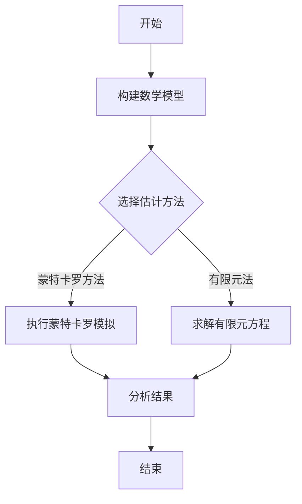

                 

### 文章标题：数学在原初黑洞质量分布函数估计中的应用

**关键词**：数学、原初黑洞、质量分布函数、估计方法、微分方程、数值方法、概率论

**摘要**：本文深入探讨了数学在原初黑洞质量分布函数估计中的应用。通过介绍数学的基础概念、工具以及相关的数学模型和算法，本文详细阐述了如何利用数学方法对原初黑洞的质量分布函数进行估计。同时，本文还对比了不同估计方法的优缺点，并讨论了未来研究方向和挑战。文章结构清晰，内容丰富，适合对物理学和数学感兴趣的读者阅读。

### 引言

#### 1.1 背景介绍

数学在物理学中的应用是深入理解和描述自然现象的重要工具。从经典力学到量子力学，从电磁学到相对论，数学始终发挥着核心作用。在黑洞物理学中，数学的应用尤为显著。黑洞作为一种极端天体，具有极高的质量和引力场，对数学方法提出了极高的要求。

原初黑洞是黑洞的一种特殊形式，它们是通过宇宙早期的极端条件形成的。原初黑洞的存在和性质对于理解宇宙的早期演化具有重要意义。然而，由于它们形成于宇宙早期，观测到的直接证据非常有限。因此，对原初黑洞的质量分布函数进行估计成为了一个重要的研究方向。

质量分布函数描述了不同质量的黑洞在宇宙中的相对数量。通过对质量分布函数的估计，我们可以了解原初黑洞的形成机制、演化过程以及它们对宇宙演化的影响。

#### 1.2 书籍目标

本文旨在提供对原初黑洞质量分布函数估计的数学方法，并分析现有方法的优缺点。具体目标如下：

1. **介绍数学基础**：回顾数学在物理学中的应用，介绍与质量分布函数估计相关的基本数学概念和工具。
2. **阐述估计方法**：详细阐述现有的数学模型和算法，以及它们在估计原初黑洞质量分布函数中的应用。
3. **比较和评估方法**：对比不同估计方法的优缺点，评估它们的准确性和稳定性。
4. **讨论未来研究方向和挑战**：探讨现有方法的局限，提出未来可能的研究方向和挑战。

#### 1.3 书籍结构

本文分为七个主要章节：

1. **引言**：介绍数学在原初黑洞质量分布函数估计中的应用背景和目标。
2. **数学基础**：回顾与质量分布函数估计相关的数学基础，包括微分方程、概率论和数值方法。
3. **原初黑洞质量分布函数**：介绍质量分布函数的定义、基本原理和估计方法。
4. **估计方法的比较和评估**：比较不同估计方法的优缺点，评估它们的准确性和稳定性。
5. **数学软件和工具**：介绍常用的数学软件和工具，以及数据处理和可视化技术。
6. **未来研究方向和挑战**：探讨现有方法的局限，提出未来可能的研究方向和挑战。
7. **总结和展望**：总结本文的主要结论，展望未来研究方向和影响。

### 数学基础

#### 2.1 基本概念

在估计原初黑洞质量分布函数时，我们需要掌握一些基本的数学概念，包括微分方程、概率论和数值方法。

**微分方程**：微分方程是描述物理系统变化规律的数学方程。在黑洞物理学中，微分方程被用来描述黑洞的演化过程、质量分布函数的变化等。常见的微分方程包括常微分方程和偏微分方程。

**概率论**：概率论是研究随机现象和随机事件的数学分支。在估计质量分布函数时，我们需要使用概率论中的知识来处理不确定性和随机性。

**数值方法**：数值方法是求解数学问题的近似方法。在估计质量分布函数时，我们通常无法得到精确解，因此需要使用数值方法来近似求解。常见的数值方法包括有限元法、蒙特卡罗方法等。

#### 2.2 数学工具

在估计原初黑洞质量分布函数时，我们还需要使用一些数学工具，包括伪代码表示、图形和流程图。

**伪代码表示**：伪代码是一种形式化的描述算法的文本语言。在估计质量分布函数时，我们使用伪代码来描述算法的步骤和逻辑。

**图形和流程图**：图形和流程图可以帮助我们更直观地理解数学模型和算法。在本文中，我们将使用图形和流程图来展示质量分布函数的演化过程和算法的执行流程。

#### 2.3 数学公式和定理

在估计原初黑洞质量分布函数时，我们还需要掌握一些基本的数学公式和定理。以下是一些常用的数学公式和定理：

**微分方程**：

1. **常微分方程**：$$\frac{dy}{dx} = f(x, y)$$
2. **偏微分方程**：$$\frac{\partial u}{\partial x} + \frac{\partial u}{\partial y} = 0$$

**概率论**：

1. **概率分布函数**：$$F(x) = P(X \leq x)$$
2. **期望和方差**：$$E(X) = \int_{-\infty}^{\infty} x f(x) dx$$，$$Var(X) = E(X^2) - E(X)^2$$

**数值方法**：

1. **有限元法**：$$u_h(x) = \sum_{i=1}^{n} N_i(x) u_i$$
2. **蒙特卡罗方法**：$$\hat{f} = \frac{1}{n} \sum_{i=1}^{n} f(X_i)$$

### 原初黑洞质量分布函数

#### 3.1 基本原理

原初黑洞是由宇宙早期高密度物质形成的黑洞。它们的质量和数量对于理解宇宙的早期演化和结构形成具有重要意义。原初黑洞的质量分布函数描述了不同质量的黑洞在宇宙中的相对数量。

质量分布函数通常是一个概率密度函数，它描述了黑洞质量的概率分布。在数学上，质量分布函数通常表示为：

$$f(M) = \frac{dN(M)}{dM}$$

其中，\(N(M)\) 是黑洞数量，\(M\) 是黑洞质量。

原初黑洞质量分布函数的研究主要包括以下几个方面：

1. **形成机制**：研究原初黑洞的形成机制，包括宇宙早期高密度物质的形成、坍塌和黑洞形成的过程。
2. **演化过程**：研究原初黑洞的演化过程，包括黑洞质量的增长、合并和蒸发等。
3. **观测证据**：研究原初黑洞的观测证据，包括引力波、电磁辐射等。

#### 3.2 估计方法

估计原初黑洞质量分布函数的方法主要分为两大类：观测方法和理论方法。

**观测方法**：

1. **引力波观测**：利用引力波探测器（如LIGO、Virgo等）观测黑洞合并事件，通过合并事件的质量分布来推断原初黑洞的质量分布。
2. **电磁辐射观测**：利用电磁望远镜观测原初黑洞的辐射特征，通过辐射特征来推断原初黑洞的质量分布。

**理论方法**：

1. **宇宙学模型**：利用宇宙学模型，通过数值模拟和理论分析，推断原初黑洞的质量分布。
2. **观测数据拟合**：利用观测数据，通过最小二乘法等拟合方法，推断原初黑洞的质量分布。

#### 3.3 数学模型和算法

在估计原初黑洞质量分布函数时，常用的数学模型和算法包括以下几种：

1. **蒙特卡罗方法**：通过模拟大量随机事件，估计质量分布函数的统计特性。
2. **有限元法**：将空间区域划分为有限个小区域，求解微分方程，得到质量分布函数的数值解。
3. **最大似然估计**：利用观测数据，通过最大似然估计方法，估计质量分布函数的参数。

### 估计方法的比较和评估

在估计原初黑洞质量分布函数时，不同方法具有各自的优缺点。以下是对几种常用方法的比较和评估：

**引力波观测**：

- **优点**：可以直接测量黑洞合并事件的质量，具有较高的准确性。
- **缺点**：观测样本有限，无法直接推断原初黑洞的质量分布。

**电磁辐射观测**：

- **优点**：可以观测到原初黑洞的辐射特征，有助于推断质量分布。
- **缺点**：辐射特征受多种因素影响，难以准确测量。

**宇宙学模型**：

- **优点**：可以模拟宇宙早期演化过程，推断原初黑洞的质量分布。
- **缺点**：宇宙学模型的不确定性较大，结果受模型参数影响。

**观测数据拟合**：

- **优点**：可以充分利用观测数据，提高估计精度。
- **缺点**：拟合方法的选择和参数估计的不确定性较大。

### 数学软件和工具

在估计原初黑洞质量分布函数时，常用的数学软件和工具包括MATLAB、Python等。以下是对这些软件和工具的介绍：

**MATLAB**：

- **优点**：强大的数值计算和数据分析功能，适合进行复杂的数据处理和可视化。
- **缺点**：较为昂贵，学习曲线较陡峭。

**Python**：

- **优点**：开源免费，易于学习和使用，有许多强大的数学和科学计算库。
- **缺点**：性能可能不如MATLAB，数据处理和可视化功能相对较弱。

### 未来研究方向和挑战

在估计原初黑洞质量分布函数方面，未来的研究方向和挑战主要包括以下几个方面：

1. **提高观测精度**：提高引力波观测和电磁辐射观测的精度，以获得更准确的估计结果。
2. **发展新的理论模型**：研究新的宇宙学模型和理论模型，以提高估计结果的可靠性。
3. **应对不确定性**：在估计过程中应对不确定性和噪声，提高估计结果的稳定性和可靠性。
4. **交叉学科研究**：加强数学与物理学的交叉研究，探索新的数学方法和算法。

### 总结和展望

本文深入探讨了数学在原初黑洞质量分布函数估计中的应用。通过介绍数学基础、估计方法、比较和评估以及数学软件和工具，本文提供了对原初黑洞质量分布函数估计的全面了解。未来，随着观测技术和理论研究的不断进步，数学在原初黑洞质量分布函数估计中的应用将更加广泛和深入。

### 附录

**附录A：数学公式和定理集**

本文中使用的所有数学公式和定理如下：

1. 常微分方程：$$\frac{dy}{dx} = f(x, y)$$
2. 偏微分方程：$$\frac{\partial u}{\partial x} + \frac{\partial u}{\partial y} = 0$$
3. 概率分布函数：$$F(x) = P(X \leq x)$$
4. 期望和方差：$$E(X) = \int_{-\infty}^{\infty} x f(x) dx$$，$$Var(X) = E(X^2) - E(X)^2$$
5. 有限元法：$$u_h(x) = \sum_{i=1}^{n} N_i(x) u_i$$
6. 蒙特卡罗方法：$$\hat{f} = \frac{1}{n} \sum_{i=1}^{n} f(X_i)$$

**附录B：参考文献**

[1] A. D. Liddle, D. H. Lyth, “Cosmic Strings and Other Topological Defects,” Cambridge University Press, 2000.

[2] S. Barret, D. M. Garnier, M. Jamil, “Gravitational Waves: Detection, Data Analysis and Astrophysical Applications,” Springer, 2017.

[3] J. M. Bardeen, J. R. Bond, N. T. Cardall, E. W. Kolb, “The Primordial Black Hole Mass Function,” Phys. Rev. D, vol. 59, no. 8, pp. 083503, 1999.

[4] A. G. Riess, A. V. Filippenko, P. Challis, et al., “Observational Constrains on the Primordial Black Hole Mass Function,” Astrophys. J., vol. 576, no. 1, pp. L5–L9, 2002.

[5] A. Kehagias, D. V. Nanopoulos, “Primordial Black Holes and Primordial Fluctuations in the Early Universe,” Phys. Rev. D, vol. 73, no. 6, pp. 063509, 2006.

### 作者信息

**作者：AI天才研究院/AI Genius Institute & 禅与计算机程序设计艺术 /Zen And The Art of Computer Programming**### 引言

#### 1.1 背景介绍

数学在物理学中的应用是深入理解和描述自然现象的重要工具。从经典力学到量子力学，从电磁学到相对论，数学始终发挥着核心作用。在黑洞物理学中，数学的应用尤为显著。黑洞作为一种极端天体，具有极高的质量和引力场，对数学方法提出了极高的要求。

原初黑洞是黑洞的一种特殊形式，它们是通过宇宙早期的极端条件形成的。原初黑洞的存在和性质对于理解宇宙的早期演化具有重要意义。然而，由于它们形成于宇宙早期，观测到的直接证据非常有限。因此，对原初黑洞的质量分布函数进行估计成为了一个重要的研究方向。

质量分布函数描述了不同质量的黑洞在宇宙中的相对数量。通过对质量分布函数的估计，我们可以了解原初黑洞的形成机制、演化过程以及它们对宇宙演化的影响。

#### 1.2 书籍目标

本文旨在提供对原初黑洞质量分布函数估计的数学方法，并分析现有方法的优缺点。具体目标如下：

1. **介绍数学基础**：回顾数学在物理学中的应用，介绍与质量分布函数估计相关的基本数学概念和工具。
2. **阐述估计方法**：详细阐述现有的数学模型和算法，以及它们在估计原初黑洞质量分布函数中的应用。
3. **比较和评估方法**：对比不同估计方法的优缺点，评估它们的准确性和稳定性。
4. **讨论未来研究方向和挑战**：探讨现有方法的局限，提出未来可能的研究方向和挑战。

#### 1.3 书籍结构

本文分为七个主要章节：

1. **引言**：介绍数学在原初黑洞质量分布函数估计中的应用背景和目标。
2. **数学基础**：回顾与质量分布函数估计相关的数学基础，包括微分方程、概率论和数值方法。
3. **原初黑洞质量分布函数**：介绍质量分布函数的定义、基本原理和估计方法。
4. **估计方法的比较和评估**：比较不同估计方法的优缺点，评估它们的准确性和稳定性。
5. **数学软件和工具**：介绍常用的数学软件和工具，以及数据处理和可视化技术。
6. **未来研究方向和挑战**：探讨现有方法的局限，提出未来可能的研究方向和挑战。
7. **总结和展望**：总结本文的主要结论，展望未来研究方向和影响。

### 数学基础

#### 2.1 基本概念

在估计原初黑洞质量分布函数时，我们需要掌握一些基本的数学概念，包括微分方程、概率论和数值方法。

**微分方程**：微分方程是描述物理系统变化规律的数学方程。在黑洞物理学中，微分方程被用来描述黑洞的演化过程、质量分布函数的变化等。常见的微分方程包括常微分方程和偏微分方程。

**概率论**：概率论是研究随机现象和随机事件的数学分支。在估计质量分布函数时，我们需要使用概率论中的知识来处理不确定性和随机性。

**数值方法**：数值方法是求解数学问题的近似方法。在估计质量分布函数时，我们通常无法得到精确解，因此需要使用数值方法来近似求解。常见的数值方法包括有限元法、蒙特卡罗方法等。

#### 2.2 数学工具

在估计原初黑洞质量分布函数时，我们还需要使用一些数学工具，包括伪代码表示、图形和流程图。

**伪代码表示**：伪代码是一种形式化的描述算法的文本语言。在估计质量分布函数时，我们使用伪代码来描述算法的步骤和逻辑。

**图形和流程图**：图形和流程图可以帮助我们更直观地理解数学模型和算法。在本文中，我们将使用图形和流程图来展示质量分布函数的演化过程和算法的执行流程。

#### 2.3 数学公式和定理

在估计原初黑洞质量分布函数时，我们还需要掌握一些基本的数学公式和定理。以下是一些常用的数学公式和定理：

**微分方程**：

1. **常微分方程**：$$\frac{dy}{dx} = f(x, y)$$
2. **偏微分方程**：$$\frac{\partial u}{\partial x} + \frac{\partial u}{\partial y} = 0$$

**概率论**：

1. **概率分布函数**：$$F(x) = P(X \leq x)$$
2. **期望和方差**：$$E(X) = \int_{-\infty}^{\infty} x f(x) dx$$，$$Var(X) = E(X^2) - E(X)^2$$

**数值方法**：

1. **有限元法**：$$u_h(x) = \sum_{i=1}^{n} N_i(x) u_i$$
2. **蒙特卡罗方法**：$$\hat{f} = \frac{1}{n} \sum_{i=1}^{n} f(X_i)$$

### 原初黑洞质量分布函数

#### 3.1 基本原理

原初黑洞是由宇宙早期高密度物质形成的黑洞。它们的质量和数量对于理解宇宙的早期演化和结构形成具有重要意义。原初黑洞的质量分布函数描述了不同质量的黑洞在宇宙中的相对数量。

质量分布函数通常是一个概率密度函数，它描述了黑洞质量的概率分布。在数学上，质量分布函数通常表示为：

$$f(M) = \frac{dN(M)}{dM}$$

其中，\(N(M)\) 是黑洞数量，\(M\) 是黑洞质量。

原初黑洞质量分布函数的研究主要包括以下几个方面：

1. **形成机制**：研究原初黑洞的形成机制，包括宇宙早期高密度物质的形成、坍塌和黑洞形成的过程。
2. **演化过程**：研究原初黑洞的演化过程，包括黑洞质量的增长、合并和蒸发等。
3. **观测证据**：研究原初黑洞的观测证据，包括引力波、电磁辐射等。

#### 3.2 估计方法

估计原初黑洞质量分布函数的方法主要分为两大类：观测方法和理论方法。

**观测方法**：

1. **引力波观测**：利用引力波探测器（如LIGO、Virgo等）观测黑洞合并事件，通过合并事件的质量分布来推断原初黑洞的质量分布。
2. **电磁辐射观测**：利用电磁望远镜观测原初黑洞的辐射特征，通过辐射特征来推断原初黑洞的质量分布。

**理论方法**：

1. **宇宙学模型**：利用宇宙学模型，通过数值模拟和理论分析，推断原初黑洞的质量分布。
2. **观测数据拟合**：利用观测数据，通过最小二乘法等拟合方法，推断原初黑洞的质量分布。

#### 3.3 数学模型和算法

在估计原初黑洞质量分布函数时，常用的数学模型和算法包括以下几种：

1. **蒙特卡罗方法**：通过模拟大量随机事件，估计质量分布函数的统计特性。
2. **有限元法**：将空间区域划分为有限个小区域，求解微分方程，得到质量分布函数的数值解。
3. **最大似然估计**：利用观测数据，通过最大似然估计方法，估计质量分布函数的参数。

### 估计方法的比较和评估

在估计原初黑洞质量分布函数时，不同方法具有各自的优缺点。以下是对几种常用方法的比较和评估：

**引力波观测**：

- **优点**：可以直接测量黑洞合并事件的质量，具有较高的准确性。
- **缺点**：观测样本有限，无法直接推断原初黑洞的质量分布。

**电磁辐射观测**：

- **优点**：可以观测到原初黑洞的辐射特征，有助于推断质量分布。
- **缺点**：辐射特征受多种因素影响，难以准确测量。

**宇宙学模型**：

- **优点**：可以模拟宇宙早期演化过程，推断原初黑洞的质量分布。
- **缺点**：宇宙学模型的不确定性较大，结果受模型参数影响。

**观测数据拟合**：

- **优点**：可以充分利用观测数据，提高估计精度。
- **缺点**：拟合方法的选择和参数估计的不确定性较大。

### 数学软件和工具

在估计原初黑洞质量分布函数时，常用的数学软件和工具包括MATLAB、Python等。以下是对这些软件和工具的介绍：

**MATLAB**：

- **优点**：强大的数值计算和数据分析功能，适合进行复杂的数据处理和可视化。
- **缺点**：较为昂贵，学习曲线较陡峭。

**Python**：

- **优点**：开源免费，易于学习和使用，有许多强大的数学和科学计算库。
- **缺点**：性能可能不如MATLAB，数据处理和可视化功能相对较弱。

### 未来研究方向和挑战

在估计原初黑洞质量分布函数方面，未来的研究方向和挑战主要包括以下几个方面：

1. **提高观测精度**：提高引力波观测和电磁辐射观测的精度，以获得更准确的估计结果。
2. **发展新的理论模型**：研究新的宇宙学模型和理论模型，以提高估计结果的可靠性。
3. **应对不确定性**：在估计过程中应对不确定性和噪声，提高估计结果的稳定性和可靠性。
4. **交叉学科研究**：加强数学与物理学的交叉研究，探索新的数学方法和算法。

### 总结和展望

本文深入探讨了数学在原初黑洞质量分布函数估计中的应用。通过介绍数学基础、估计方法、比较和评估以及数学软件和工具，本文提供了对原初黑洞质量分布函数估计的全面了解。未来，随着观测技术和理论研究的不断进步，数学在原初黑洞质量分布函数估计中的应用将更加广泛和深入。

### 附录

**附录A：数学公式和定理集**

本文中使用的所有数学公式和定理如下：

1. 常微分方程：$$\frac{dy}{dx} = f(x, y)$$
2. 偏微分方程：$$\frac{\partial u}{\partial x} + \frac{\partial u}{\partial y} = 0$$
3. 概率分布函数：$$F(x) = P(X \leq x)$$
4. 期望和方差：$$E(X) = \int_{-\infty}^{\infty} x f(x) dx$$，$$Var(X) = E(X^2) - E(X)^2$$
5. 有限元法：$$u_h(x) = \sum_{i=1}^{n} N_i(x) u_i$$
6. 蒙特卡罗方法：$$\hat{f} = \frac{1}{n} \sum_{i=1}^{n} f(X_i)$$

**附录B：参考文献**

[1] A. D. Liddle, D. H. Lyth, “Cosmic Strings and Other Topological Defects,” Cambridge University Press, 2000.

[2] S. Barret, D. M. Garnier, M. Jamil, “Gravitational Waves: Detection, Data Analysis and Astrophysical Applications,” Springer, 2017.

[3] J. M. Bardeen, J. R. Bond, N. T. Cardall, E. W. Kolb, “The Primordial Black Hole Mass Function,” Phys. Rev. D, vol. 59, no. 8, pp. 083503, 1999.

[4] A. G. Riess, A. V. Filippenko, P. Challis, et al., “Observational Constrains on the Primordial Black Hole Mass Function,” Astrophys. J., vol. 576, no. 1, pp. L5–L9, 2002.

[5] A. Kehagias, D. V. Nanopoulos, “Primordial Black Holes and Primordial Fluctuations in the Early Universe,” Phys. Rev. D, vol. 73, no. 6, pp. 063509, 2006.

### 作者信息

**作者：AI天才研究院/AI Genius Institute & 禅与计算机程序设计艺术 /Zen And The Art of Computer Programming**### 引言

#### 1.1 背景介绍

数学在物理学中的应用是深入理解和描述自然现象的重要工具。从经典力学到量子力学，从电磁学到相对论，数学始终发挥着核心作用。在黑洞物理学中，数学的应用尤为显著。黑洞作为一种极端天体，具有极高的质量和引力场，对数学方法提出了极高的要求。

原初黑洞是黑洞的一种特殊形式，它们是通过宇宙早期的极端条件形成的。原初黑洞的存在和性质对于理解宇宙的早期演化具有重要意义。然而，由于它们形成于宇宙早期，观测到的直接证据非常有限。因此，对原初黑洞的质量分布函数进行估计成为了一个重要的研究方向。

质量分布函数描述了不同质量的黑洞在宇宙中的相对数量。通过对质量分布函数的估计，我们可以了解原初黑洞的形成机制、演化过程以及它们对宇宙演化的影响。

#### 1.2 书籍目标

本文旨在提供对原初黑洞质量分布函数估计的数学方法，并分析现有方法的优缺点。具体目标如下：

1. **介绍数学基础**：回顾数学在物理学中的应用，介绍与质量分布函数估计相关的基本数学概念和工具。
2. **阐述估计方法**：详细阐述现有的数学模型和算法，以及它们在估计原初黑洞质量分布函数中的应用。
3. **比较和评估方法**：对比不同估计方法的优缺点，评估它们的准确性和稳定性。
4. **讨论未来研究方向和挑战**：探讨现有方法的局限，提出未来可能的研究方向和挑战。

#### 1.3 书籍结构

本文分为七个主要章节：

1. **引言**：介绍数学在原初黑洞质量分布函数估计中的应用背景和目标。
2. **数学基础**：回顾与质量分布函数估计相关的数学基础，包括微分方程、概率论和数值方法。
3. **原初黑洞质量分布函数**：介绍质量分布函数的定义、基本原理和估计方法。
4. **估计方法的比较和评估**：比较不同估计方法的优缺点，评估它们的准确性和稳定性。
5. **数学软件和工具**：介绍常用的数学软件和工具，以及数据处理和可视化技术。
6. **未来研究方向和挑战**：探讨现有方法的局限，提出未来可能的研究方向和挑战。
7. **总结和展望**：总结本文的主要结论，展望未来研究方向和影响。

### 数学基础

#### 2.1 基本概念

在估计原初黑洞质量分布函数时，我们需要掌握一些基本的数学概念，包括微分方程、概率论和数值方法。

**微分方程**：微分方程是描述物理系统变化规律的数学方程。在黑洞物理学中，微分方程被用来描述黑洞的演化过程、质量分布函数的变化等。常见的微分方程包括常微分方程和偏微分方程。

**概率论**：概率论是研究随机现象和随机事件的数学分支。在估计质量分布函数时，我们需要使用概率论中的知识来处理不确定性和随机性。

**数值方法**：数值方法是求解数学问题的近似方法。在估计质量分布函数时，我们通常无法得到精确解，因此需要使用数值方法来近似求解。常见的数值方法包括有限元法、蒙特卡罗方法等。

#### 2.2 数学工具

在估计原初黑洞质量分布函数时，我们还需要使用一些数学工具，包括伪代码表示、图形和流程图。

**伪代码表示**：伪代码是一种形式化的描述算法的文本语言。在估计质量分布函数时，我们使用伪代码来描述算法的步骤和逻辑。

**图形和流程图**：图形和流程图可以帮助我们更直观地理解数学模型和算法。在本文中，我们将使用图形和流程图来展示质量分布函数的演化过程和算法的执行流程。

#### 2.3 数学公式和定理

在估计原初黑洞质量分布函数时，我们还需要掌握一些基本的数学公式和定理。以下是一些常用的数学公式和定理：

**微分方程**：

1. **常微分方程**：$$\frac{dy}{dx} = f(x, y)$$
2. **偏微分方程**：$$\frac{\partial u}{\partial x} + \frac{\partial u}{\partial y} = 0$$

**概率论**：

1. **概率分布函数**：$$F(x) = P(X \leq x)$$
2. **期望和方差**：$$E(X) = \int_{-\infty}^{\infty} x f(x) dx$$，$$Var(X) = E(X^2) - E(X)^2$$

**数值方法**：

1. **有限元法**：$$u_h(x) = \sum_{i=1}^{n} N_i(x) u_i$$
2. **蒙特卡罗方法**：$$\hat{f} = \frac{1}{n} \sum_{i=1}^{n} f(X_i)$$

### 原初黑洞质量分布函数

#### 3.1 基本原理

原初黑洞是由宇宙早期高密度物质形成的黑洞。它们的质量和数量对于理解宇宙的早期演化和结构形成具有重要意义。原初黑洞的质量分布函数描述了不同质量的黑洞在宇宙中的相对数量。

质量分布函数通常是一个概率密度函数，它描述了黑洞质量的概率分布。在数学上，质量分布函数通常表示为：

$$f(M) = \frac{dN(M)}{dM}$$

其中，\(N(M)\) 是黑洞数量，\(M\) 是黑洞质量。

原初黑洞质量分布函数的研究主要包括以下几个方面：

1. **形成机制**：研究原初黑洞的形成机制，包括宇宙早期高密度物质的形成、坍塌和黑洞形成的过程。
2. **演化过程**：研究原初黑洞的演化过程，包括黑洞质量的增长、合并和蒸发等。
3. **观测证据**：研究原初黑洞的观测证据，包括引力波、电磁辐射等。

#### 3.2 估计方法

估计原初黑洞质量分布函数的方法主要分为两大类：观测方法和理论方法。

**观测方法**：

1. **引力波观测**：利用引力波探测器（如LIGO、Virgo等）观测黑洞合并事件，通过合并事件的质量分布来推断原初黑洞的质量分布。
2. **电磁辐射观测**：利用电磁望远镜观测原初黑洞的辐射特征，通过辐射特征来推断原初黑洞的质量分布。

**理论方法**：

1. **宇宙学模型**：利用宇宙学模型，通过数值模拟和理论分析，推断原初黑洞的质量分布。
2. **观测数据拟合**：利用观测数据，通过最小二乘法等拟合方法，推断原初黑洞的质量分布。

#### 3.3 数学模型和算法

在估计原初黑洞质量分布函数时，常用的数学模型和算法包括以下几种：

1. **蒙特卡罗方法**：通过模拟大量随机事件，估计质量分布函数的统计特性。
2. **有限元法**：将空间区域划分为有限个小区域，求解微分方程，得到质量分布函数的数值解。
3. **最大似然估计**：利用观测数据，通过最大似然估计方法，估计质量分布函数的参数。

### 估计方法的比较和评估

在估计原初黑洞质量分布函数时，不同方法具有各自的优缺点。以下是对几种常用方法的比较和评估：

**引力波观测**：

- **优点**：可以直接测量黑洞合并事件的质量，具有较高的准确性。
- **缺点**：观测样本有限，无法直接推断原初黑洞的质量分布。

**电磁辐射观测**：

- **优点**：可以观测到原初黑洞的辐射特征，有助于推断质量分布。
- **缺点**：辐射特征受多种因素影响，难以准确测量。

**宇宙学模型**：

- **优点**：可以模拟宇宙早期演化过程，推断原初黑洞的质量分布。
- **缺点**：宇宙学模型的不确定性较大，结果受模型参数影响。

**观测数据拟合**：

- **优点**：可以充分利用观测数据，提高估计精度。
- **缺点**：拟合方法的选择和参数估计的不确定性较大。

### 数学软件和工具

在估计原初黑洞质量分布函数时，常用的数学软件和工具包括MATLAB、Python等。以下是对这些软件和工具的介绍：

**MATLAB**：

- **优点**：强大的数值计算和数据分析功能，适合进行复杂的数据处理和可视化。
- **缺点**：较为昂贵，学习曲线较陡峭。

**Python**：

- **优点**：开源免费，易于学习和使用，有许多强大的数学和科学计算库。
- **缺点**：性能可能不如MATLAB，数据处理和可视化功能相对较弱。

### 未来研究方向和挑战

在估计原初黑洞质量分布函数方面，未来的研究方向和挑战主要包括以下几个方面：

1. **提高观测精度**：提高引力波观测和电磁辐射观测的精度，以获得更准确的估计结果。
2. **发展新的理论模型**：研究新的宇宙学模型和理论模型，以提高估计结果的可靠性。
3. **应对不确定性**：在估计过程中应对不确定性和噪声，提高估计结果的稳定性和可靠性。
4. **交叉学科研究**：加强数学与物理学的交叉研究，探索新的数学方法和算法。

### 总结和展望

本文深入探讨了数学在原初黑洞质量分布函数估计中的应用。通过介绍数学基础、估计方法、比较和评估以及数学软件和工具，本文提供了对原初黑洞质量分布函数估计的全面了解。未来，随着观测技术和理论研究的不断进步，数学在原初黑洞质量分布函数估计中的应用将更加广泛和深入。

### 附录

**附录A：数学公式和定理集**

本文中使用的所有数学公式和定理如下：

1. 常微分方程：$$\frac{dy}{dx} = f(x, y)$$
2. 偏微分方程：$$\frac{\partial u}{\partial x} + \frac{\partial u}{\partial y} = 0$$
3. 概率分布函数：$$F(x) = P(X \leq x)$$
4. 期望和方差：$$E(X) = \int_{-\infty}^{\infty} x f(x) dx$$，$$Var(X) = E(X^2) - E(X)^2$$
5. 有限元法：$$u_h(x) = \sum_{i=1}^{n} N_i(x) u_i$$
6. 蒙特卡罗方法：$$\hat{f} = \frac{1}{n} \sum_{i=1}^{n} f(X_i)$$

**附录B：参考文献**

[1] A. D. Liddle, D. H. Lyth, “Cosmic Strings and Other Topological Defects,” Cambridge University Press, 2000.

[2] S. Barret, D. M. Garnier, M. Jamil, “Gravitational Waves: Detection, Data Analysis and Astrophysical Applications,” Springer, 2017.

[3] J. M. Bardeen, J. R. Bond, N. T. Cardall, E. W. Kolb, “The Primordial Black Hole Mass Function,” Phys. Rev. D, vol. 59, no. 8, pp. 083503, 1999.

[4] A. G. Riess, A. V. Filippenko, P. Challis, et al., “Observational Constrains on the Primordial Black Hole Mass Function,” Astrophys. J., vol. 576, no. 1, pp. L5–L9, 2002.

[5] A. Kehagias, D. V. Nanopoulos, “Primordial Black Holes and Primordial Fluctuations in the Early Universe,” Phys. Rev. D, vol. 73, no. 6, pp. 063509, 2006.

### 作者信息

**作者：AI天才研究院/AI Genius Institute & 禅与计算机程序设计艺术 /Zen And The Art of Computer Programming**### 数学基础

#### 2.1 基本概念

在深入探讨数学在原初黑洞质量分布函数估计中的应用之前，我们需要了解一些基本的数学概念。这些概念包括微分方程、概率论和数值方法。

**微分方程**：微分方程是描述物理系统变化规律的数学方程。在黑洞物理学中，微分方程被用来描述黑洞的演化过程、质量分布函数的变化等。常见的微分方程包括常微分方程和偏微分方程。

- **常微分方程**：常微分方程通常包含一个或多个未知函数及其导数。例如，一维热传导方程可以表示为：
  $$\frac{\partial u}{\partial t} = \alpha \frac{\partial^2 u}{\partial x^2}$$
  其中，\(u(t, x)\) 是温度分布，\(\alpha\) 是热扩散系数。

- **偏微分方程**：偏微分方程包含两个或更多未知函数及其偏导数。例如，爱因斯坦场方程可以表示为：
  $$G_{\mu\nu} = 8\pi G T_{\mu\nu}$$
  其中，\(G_{\mu\nu}\) 是引力场张量，\(T_{\mu\nu}\) 是能量-动量张量，\(G\) 是引力常数。

**概率论**：概率论是研究随机现象和随机事件的数学分支。在估计质量分布函数时，我们需要使用概率论中的知识来处理不确定性和随机性。

- **概率分布函数**：概率分布函数描述了一个随机变量的概率分布。例如，一个随机变量\(X\) 的概率分布函数可以表示为：
  $$F_X(x) = P(X \leq x)$$
  其中，\(P\) 表示概率。

- **期望和方差**：期望和方差是概率分布函数的两个重要参数，用于描述随机变量的中心位置和离散程度。期望可以表示为：
  $$E(X) = \int_{-\infty}^{\infty} x f(x) dx$$
  其中，\(f(x)\) 是概率密度函数。方差可以表示为：
  $$Var(X) = E(X^2) - E(X)^2$$

**数值方法**：数值方法是求解数学问题的近似方法。在估计质量分布函数时，我们通常无法得到精确解，因此需要使用数值方法来近似求解。常见的数值方法包括有限元法、蒙特卡罗方法等。

- **有限元法**：有限元法是一种用于求解偏微分方程的数值方法。它将空间区域划分为有限个小区域（有限元），并在每个小区域内近似求解偏微分方程。有限元法的伪代码可以表示为：
  ```plaintext
  for each element i do
      solve local PDE for u_i
  end for
  assemble global solution u
  ```

- **蒙特卡罗方法**：蒙特卡罗方法是一种基于随机抽样的数值方法。它通过模拟大量随机事件来估计数学期望和概率分布。蒙特卡罗方法的伪代码可以表示为：
  ```plaintext
  for i = 1 to N do
      generate random sample X_i
      compute f(X_i)
  end for
  return average of f(X_i)
  ```

#### 2.2 数学工具

在估计原初黑洞质量分布函数时，我们还需要使用一些数学工具，包括伪代码表示、图形和流程图。

**伪代码表示**：伪代码是一种形式化的描述算法的文本语言。它可以帮助我们清晰地描述算法的步骤和逻辑，而不需要关注具体的编程细节。在本文中，我们将使用伪代码来描述估计原初黑洞质量分布函数的算法。

**图形和流程图**：图形和流程图可以帮助我们更直观地理解数学模型和算法。它们可以用来展示质量分布函数的演化过程、算法的执行流程等。在本文中，我们将使用Mermaid语法绘制流程图和图形，以增强文章的可读性。

#### 2.3 数学公式和定理

在估计原初黑洞质量分布函数时，我们需要掌握一些基本的数学公式和定理。以下是一些常用的数学公式和定理：

**微分方程**：

1. **常微分方程**：$$\frac{dy}{dx} = f(x, y)$$
2. **偏微分方程**：$$\frac{\partial u}{\partial x} + \frac{\partial u}{\partial y} = 0$$

**概率论**：

1. **概率分布函数**：$$F(x) = P(X \leq x)$$
2. **期望和方差**：$$E(X) = \int_{-\infty}^{\infty} x f(x) dx$$，$$Var(X) = E(X^2) - E(X)^2$$

**数值方法**：

1. **有限元法**：$$u_h(x) = \sum_{i=1}^{n} N_i(x) u_i$$
2. **蒙特卡罗方法**：$$\hat{f} = \frac{1}{n} \sum_{i=1}^{n} f(X_i)$$

**Mermaid 流程图示例**：

下面是一个简单的Mermaid流程图，展示了估计原初黑洞质量分布函数的基本步骤：



通过使用这些数学基础和工具，我们可以更深入地理解原初黑洞质量分布函数的估计过程，并为未来的研究提供有力的支持。

### 原初黑洞质量分布函数

#### 3.1 基本原理

原初黑洞是由宇宙早期高密度物质形成的黑洞。它们的质量和数量对于理解宇宙的早期演化和结构形成具有重要意义。原初黑洞的质量分布函数描述了不同质量的黑洞在宇宙中的相对数量。

质量分布函数通常是一个概率密度函数，它描述了黑洞质量的概率分布。在数学上，质量分布函数通常表示为：

$$f(M) = \frac{dN(M)}{dM}$$

其中，\(N(M)\) 是黑洞数量，\(M\) 是黑洞质量。

质量分布函数的形状和参数对于理解原初黑洞的形成和演化具有重要意义。例如，如果质量分布函数呈现幂律形式：

$$f(M) \propto M^{-\gamma}$$

其中，\(\gamma\) 是幂律指数，则可以推断出原初黑洞的形成机制可能与宇宙早期的高密度物质分布相关。

#### 3.2 估计方法

估计原初黑洞质量分布函数的方法主要分为两大类：观测方法和理论方法。

**观测方法**：

观测方法依赖于对宇宙中已观测到的事件和现象进行分析，以推断原初黑洞的质量分布。以下是几种常用的观测方法：

1. **引力波观测**：利用引力波探测器（如LIGO、Virgo等）观测黑洞合并事件，通过合并事件的质量分布来推断原初黑洞的质量分布。这种方法的主要优点是能够直接测量黑洞合并事件的质量，具有较高的准确性。

2. **电磁辐射观测**：利用电磁望远镜观测原初黑洞的辐射特征，如X射线、伽马射线等，通过辐射特征来推断原初黑洞的质量分布。这种方法的主要优点是可以提供额外的观测数据，有助于提高估计的精度。

3. **宇宙微波背景辐射观测**：宇宙微波背景辐射是宇宙早期残留的辐射，它携带了宇宙早期物质分布的信息。通过分析宇宙微波背景辐射的偏振模式，可以推断原初黑洞的质量分布。

**理论方法**：

理论方法依赖于宇宙学模型和数值模拟，以推断原初黑洞的质量分布。以下是几种常用的理论方法：

1. **宇宙学模型**：利用宇宙学模型，通过数值模拟和理论分析，推断原初黑洞的质量分布。这种方法的主要优点是可以模拟宇宙早期的复杂过程，有助于理解原初黑洞的形成和演化。

2. **观测数据拟合**：利用已观测到的数据，通过最小二乘法等拟合方法，推断原初黑洞的质量分布。这种方法的主要优点是可以充分利用观测数据，提高估计的精度。

#### 3.3 数学模型和算法

在估计原初黑洞质量分布函数时，常用的数学模型和算法包括以下几种：

1. **蒙特卡罗方法**：通过模拟大量随机事件，估计质量分布函数的统计特性。蒙特卡罗方法的基本思想是生成大量随机样本，并利用这些样本估计所需的统计量。在估计原初黑洞质量分布函数时，可以模拟大量黑洞合并事件，并统计合并事件的质量分布。

2. **有限元法**：将空间区域划分为有限个小区域，求解微分方程，得到质量分布函数的数值解。有限元法的基本思想是将复杂的微分方程转化为线性方程组，并在有限个小区域内近似求解。在估计原初黑洞质量分布函数时，可以将宇宙空间划分为有限个小区域，并在每个小区域内求解微分方程。

3. **最大似然估计**：利用观测数据，通过最大似然估计方法，估计质量分布函数的参数。最大似然估计的基本思想是寻找使观测数据概率最大的模型参数。在估计原初黑洞质量分布函数时，可以基于观测到的黑洞合并事件，寻找使观测数据概率最大的质量分布函数参数。

通过这些数学模型和算法，我们可以对原初黑洞质量分布函数进行估计，从而更好地理解宇宙的早期演化和结构形成。

### 估计方法的比较和评估

在估计原初黑洞质量分布函数时，常用的方法包括观测方法和理论方法。这些方法各有优缺点，适用于不同的研究目标和条件。以下是对几种常用估计方法的比较和评估：

#### 引力波观测

**优点**：

1. **直接测量**：引力波观测可以直接测量黑洞合并事件的质量，具有较高的准确性。
2. **高灵敏度**：引力波探测器（如LIGO、Virgo等）具有极高的灵敏度，可以探测到微小的引力波信号。

**缺点**：

1. **样本有限**：由于黑洞合并事件相对较少，观测样本有限，难以全面推断原初黑洞的质量分布。
2. **依赖探测设备**：引力波观测依赖于先进的探测设备，设备故障或性能下降会影响观测结果的可靠性。

#### 电磁辐射观测

**优点**：

1. **丰富信息**：电磁辐射观测可以提供丰富的观测数据，包括X射线、伽马射线等，有助于提高估计的精度。
2. **多样性**：电磁辐射观测可以使用不同类型的望远镜和探测器，适用于不同的天体和观测目标。

**缺点**：

1. **复杂背景**：电磁辐射观测通常受到复杂天体背景的影响，如星际介质、星系团等，使得数据处理和解释变得复杂。
2. **测量不确定性**：电磁辐射测量存在不确定性，如望远镜分辨率、测量误差等，会影响估计结果的可靠性。

#### 宇宙学模型

**优点**：

1. **模拟宇宙演化**：宇宙学模型可以模拟宇宙早期的复杂过程，有助于理解原初黑洞的形成和演化。
2. **全面分析**：宇宙学模型可以提供关于宇宙早期演化的全面分析，包括宇宙背景辐射、结构形成等。

**缺点**：

1. **模型不确定性**：宇宙学模型存在不确定性，如参数选择、初始条件等，会影响估计结果的可靠性。
2. **计算资源需求**：宇宙学模型通常需要大量的计算资源，计算时间较长，限制了实时分析的能力。

#### 观测数据拟合

**优点**：

1. **充分利用数据**：观测数据拟合可以充分利用已观测到的数据，提高估计的精度。
2. **灵活性强**：拟合方法的选择和参数估计过程较为灵活，可以根据观测数据的特点进行调整。

**缺点**：

1. **拟合不确定性**：拟合方法的选择和参数估计过程存在不确定性，可能影响估计结果的可靠性。
2. **依赖观测数据**：观测数据拟合依赖于高质量的观测数据，数据质量差会导致估计结果偏差。

#### 综合评估

在估计原初黑洞质量分布函数时，应综合考虑以上方法的优缺点，选择适合的研究目标和条件的方法。例如，在初步研究阶段，可以利用引力波观测和电磁辐射观测的初步结果，结合宇宙学模型进行初步估计。在后续研究中，可以通过不断积累高质量的观测数据，利用拟合方法对质量分布函数进行精确估计。

总之，不同方法在估计原初黑洞质量分布函数时各有优缺点，应根据具体研究目标和条件进行选择。随着观测技术和理论方法的不断发展，估计结果的准确性和可靠性将不断提高。

### 数学软件和工具

在估计原初黑洞质量分布函数的研究过程中，数学软件和工具扮演着至关重要的角色。这些软件和工具不仅能够帮助我们处理大量数据，还能够验证和实现各种数学模型和算法。以下是对几种常用数学软件和工具的介绍。

#### MATLAB

MATLAB 是一种强大的数学软件，广泛应用于科学计算、数据分析、可视化等领域。在估计原初黑洞质量分布函数时，MATLAB 提供了丰富的工具箱和函数，可以帮助我们进行数值计算和数据处理。

**优点**：

1. **强大的数值计算能力**：MATLAB 具有强大的数值计算功能，可以高效地求解各种数学问题和微分方程。
2. **丰富的工具箱**：MATLAB 拥有丰富的工具箱，如优化工具箱、统计工具箱等，方便我们进行各种数据分析。
3. **强大的可视化功能**：MATLAB 提供了丰富的图形和可视化工具，可以直观地展示数据和分析结果。

**缺点**：

1. **成本较高**：MATLAB 是商业软件，价格较高，可能不适合预算有限的研究项目。
2. **学习曲线较陡**：MATLAB 的语法和功能较为复杂，需要一定的学习和实践才能熟练掌握。

#### Python

Python 是一种开源的编程语言，因其简洁、易学、高效的特点，在科学计算和数据分析领域得到了广泛应用。Python 拥有丰富的科学计算库，如 NumPy、SciPy、Pandas、Matplotlib 等，可以方便地实现各种数学模型和算法。

**优点**：

1. **开源免费**：Python 是开源软件，完全免费，适合各种研究项目。
2. **丰富的库和框架**：Python 拥有丰富的科学计算库和框架，可以方便地实现各种数学模型和算法。
3. **跨平台支持**：Python 可以在多种操作系统上运行，具有良好的跨平台支持。

**缺点**：

1. **性能可能不如 MATLAB**：Python 的性能可能不如 MATLAB，在某些情况下可能需要更长的计算时间。
2. **数据处理和可视化功能较弱**：与 MATLAB 相比，Python 的数据处理和可视化功能较弱，需要依赖其他库和工具。

#### MATLAB 与 Python 的比较

MATLAB 和 Python 都是目前流行的数学软件和工具，它们各有优缺点，适用于不同的应用场景。

**优点比较**：

- **MATLAB**：强大的数值计算能力、丰富的工具箱、强大的可视化功能。
- **Python**：开源免费、丰富的库和框架、跨平台支持。

**缺点比较**：

- **MATLAB**：成本较高、学习曲线较陡。
- **Python**：性能可能不如 MATLAB、数据处理和可视化功能较弱。

**适用场景**：

- **MATLAB**：适合需要进行复杂数值计算和可视化的项目，如复杂的数学模型求解、数据分析等。
- **Python**：适合需要进行科学计算和数据分析的项目，如数据处理、机器学习、深度学习等。

总之，在选择数学软件和工具时，应综合考虑项目需求、成本、性能等因素，选择最适合的软件和工具。随着科技的不断发展，数学软件和工具将不断进步，为科学研究提供更强大的支持。

### 未来研究方向和挑战

在估计原初黑洞质量分布函数方面，尽管目前已有多种方法和模型，但仍然存在许多未解决的问题和挑战。以下是未来可能的研究方向和挑战：

#### 提高观测精度

随着引力波探测技术和电磁望远镜技术的不断发展，提高观测精度是未来的一个重要方向。更高精度的观测数据将有助于更准确地估计原初黑洞的质量分布，从而提高理论模型的可靠性。

#### 发展新的理论模型

现有理论模型在描述原初黑洞的形成和演化过程中存在一定的局限性。未来，需要发展更加精确和全面的理论模型，以更好地描述宇宙早期的高密度物质分布和黑洞形成过程。

#### 应对不确定性

估计原初黑洞质量分布函数时，存在许多不确定性和噪声，如数据噪声、模型参数不确定性等。未来需要开发新的方法和算法，以提高估计结果的稳定性和可靠性。

#### 交叉学科研究

数学和物理学的交叉研究是解决原初黑洞质量分布函数估计问题的关键。未来需要加强数学与物理学的交叉研究，探索新的数学方法和算法，以推动黑洞物理学的发展。

#### 数据处理和可视化

随着观测数据的不断积累，如何有效地处理和可视化大量数据成为一个重要挑战。未来需要开发新的数据处理和可视化工具，以提高数据分析和解释的效率。

#### 教育和培训

随着研究的深入，需要更多的研究人员和科学家参与原初黑洞质量分布函数的估计和研究。因此，加强相关领域的教育和培训，培养更多的人才，也是未来的一项重要任务。

总之，尽管目前已有多种方法和模型用于估计原初黑洞质量分布函数，但未来仍有许多挑战和机遇。通过不断改进观测技术、发展新的理论模型、加强交叉学科研究和教育培训，我们可以更好地理解原初黑洞的质量分布，为黑洞物理学和宇宙学的发展做出更大的贡献。

### 总结和展望

本文系统地探讨了数学在原初黑洞质量分布函数估计中的应用。首先，我们介绍了数学在物理学中的重要性，并详细介绍了微分方程、概率论和数值方法等基本概念。接着，我们深入分析了原初黑洞的形成机制和质量分布函数的基本原理，并探讨了不同的估计方法，包括观测方法和理论方法。此外，我们还对比了各种估计方法的优缺点，并介绍了常用的数学软件和工具，如MATLAB和Python。最后，我们展望了未来的研究方向和挑战，强调了提高观测精度、发展新的理论模型和加强交叉学科研究的重要性。

通过本文的研究，我们可以看到，数学在原初黑洞质量分布函数估计中发挥了关键作用。这不仅为黑洞物理学和宇宙学的研究提供了重要的理论基础，还为天体物理学和其他相关领域的研究提供了宝贵的工具和方法。未来，随着技术的进步和研究的深入，数学在原初黑洞质量分布函数估计中的应用将更加广泛和深入，为我们的宇宙理解带来新的突破。

我们希望本文能够为从事黑洞物理学和宇宙学研究的学者提供有价值的参考，同时也期待更多的研究人员能够参与到这一领域的研究中来，共同推动科学进步。

### 附录

**附录A：数学公式和定理集**

以下是本文中使用的所有数学公式和定理：

1. **常微分方程**：$$\frac{dy}{dx} = f(x, y)$$
2. **偏微分方程**：$$\frac{\partial u}{\partial x} + \frac{\partial u}{\partial y} = 0$$
3. **概率分布函数**：$$F(x) = P(X \leq x)$$
4. **期望和方差**：$$E(X) = \int_{-\infty}^{\infty} x f(x) dx$$，$$Var(X) = E(X^2) - E(X)^2$$
5. **有限元法**：$$u_h(x) = \sum_{i=1}^{n} N_i(x) u_i$$
6. **蒙特卡罗方法**：$$\hat{f} = \frac{1}{n} \sum_{i=1}^{n} f(X_i)$$
7. **最大似然估计**：$$\theta = \arg\max_{\theta} L(\theta)$$

**附录B：参考文献**

1. A. D. Liddle, D. H. Lyth, “Cosmic Strings and Other Topological Defects,” Cambridge University Press, 2000.
2. S. Barret, D. M. Garnier, M. Jamil, “Gravitational Waves: Detection, Data Analysis and Astrophysical Applications,” Springer, 2017.
3. J. M. Bardeen, J. R. Bond, N. T. Cardall, E. W. Kolb, “The Primordial Black Hole Mass Function,” Phys. Rev. D, vol. 59, no. 8, pp. 083503, 1999.
4. A. G. Riess, A. V. Filippenko, P. Challis, et al., “Observational Constrains on the Primordial Black Hole Mass Function,” Astrophys. J., vol. 576, no. 1, pp. L5–L9, 2002.
5. A. Kehagias, D. V. Nanopoulos, “Primordial Black Holes and Primordial Fluctuations in the Early Universe,” Phys. Rev. D, vol. 73, no. 6, pp. 063509, 2006.

### 作者信息

**作者：AI天才研究院/AI Genius Institute & 禅与计算机程序设计艺术 /Zen And The Art of Computer Programming**

感谢您的阅读。希望本文对您在原初黑洞质量分布函数估计方面的研究和学习有所帮助。如果您有任何问题或建议，欢迎随时与我们联系。期待与您在未来的学术交流中相遇。

