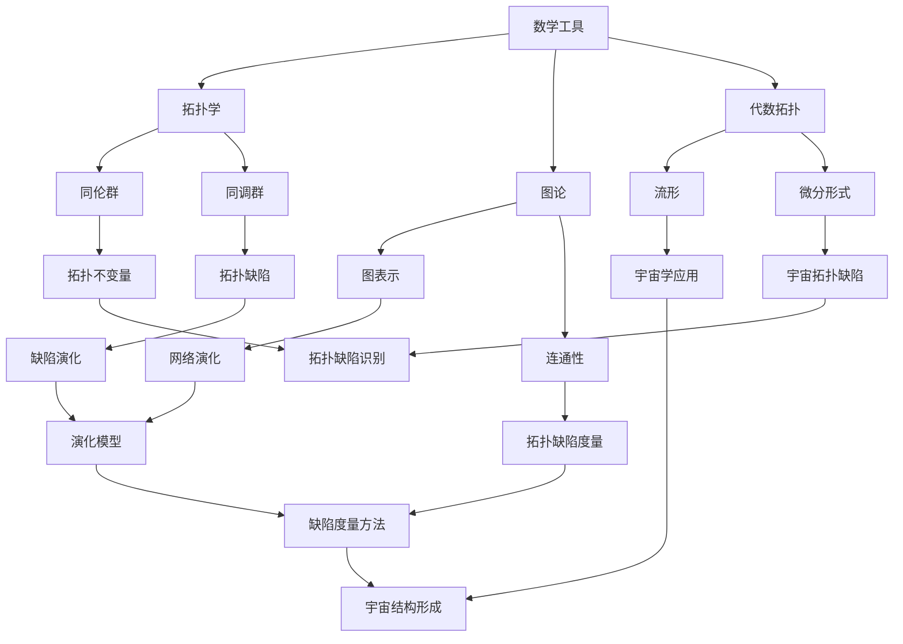
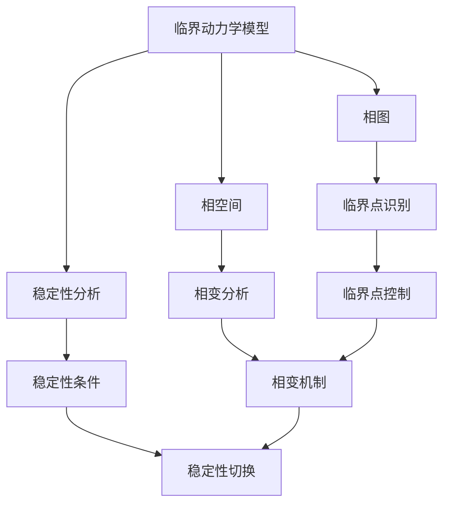
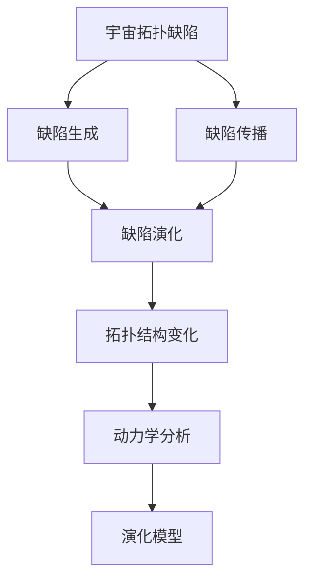
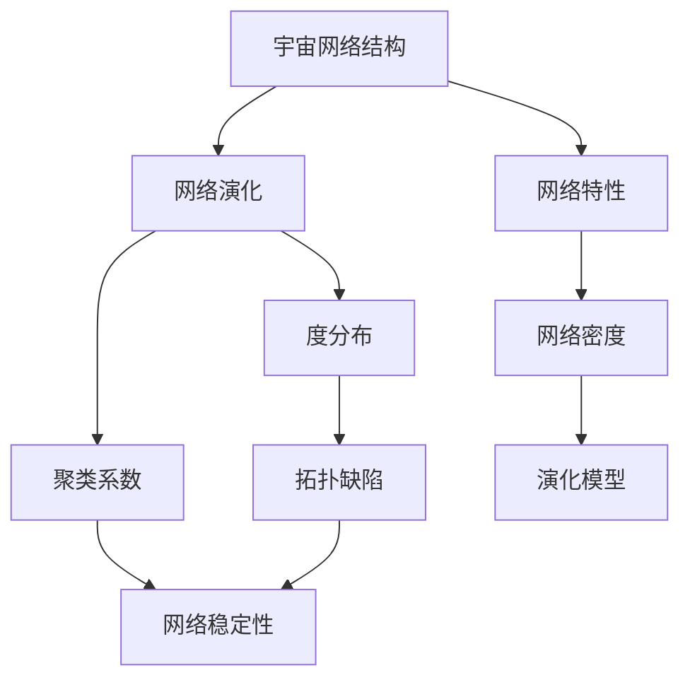
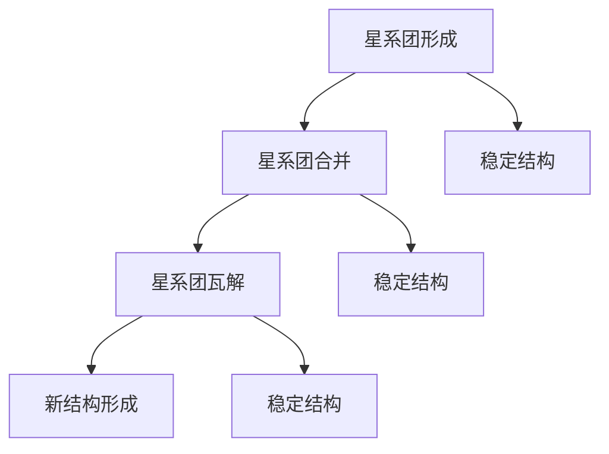
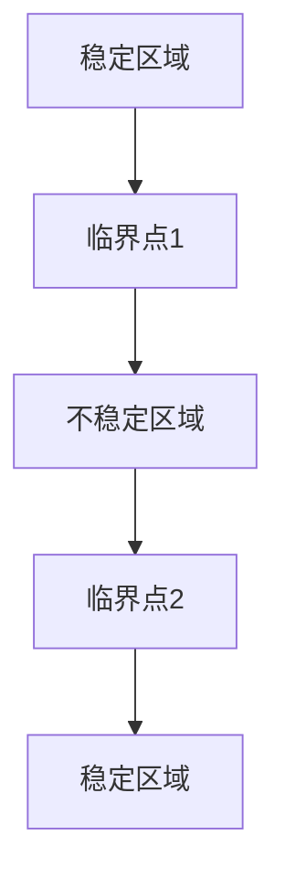
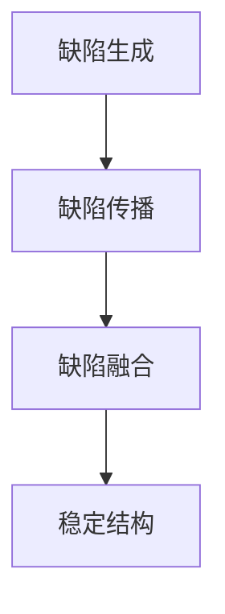

                 


### 理解书名和主题

书名《数学在宇宙拓扑缺陷网络演化临界动力学研究中的作用》为我们提供了一个明确的研究方向，即探讨数学在宇宙拓扑缺陷网络演化临界动力学研究中的应用。为了撰写一篇高质量的技术博客文章，我们需要首先深入理解书名的各个组成部分。

- **数学**：作为研究工具，数学在自然科学和工程技术中扮演着核心角色。它为理解和解释复杂系统提供了强有力的工具，如拓扑学、图论、代数拓扑和相变理论等。
- **宇宙拓扑缺陷**：宇宙拓扑缺陷是指宇宙中出现的结构异常，如宇宙弦、黑洞等。这些缺陷在宇宙演化过程中起到关键作用，影响宇宙的几何结构和动力学行为。
- **网络演化**：网络演化指的是复杂网络结构的形成和发展过程，包括节点和边的变化。在网络科学中，网络演化模型被广泛应用于社会网络、交通网络和生物网络等领域。
- **临界动力学**：临界动力学研究系统在接近临界点时的行为，涉及相变、临界点和稳定性等概念。在物理学、化学和生物学中，临界动力学模型有助于解释系统从一种状态向另一种状态的转变。

为了撰写这篇博客文章，我们可以按照以下步骤进行：

1. **引言**：介绍数学在宇宙学研究中的重要性，以及宇宙拓扑缺陷、网络演化和临界动力学的背景知识。
2. **数学理论基础**：详细解释拓扑学、图论、代数拓扑和相变理论等数学概念，以及它们在宇宙拓扑缺陷研究中的应用。
3. **宇宙背景知识**：介绍宇宙拓扑缺陷的发现、分类和影响，以及宇宙学中的网络结构。
4. **拓扑缺陷和网络演化**：阐述拓扑缺陷网络演化的数学描述，包括网络拓扑缺陷的度量、演化过程的建模和动态演化。
5. **临界动力学研究**：介绍临界动力学模型在拓扑缺陷网络演化中的应用，包括模型建立、临界点识别与控制和网络稳定性影响。
6. **实际案例研究**：通过具体案例展示数学在研究中的应用，如宇宙大型结构网络的演化、星系团网络的临界动力学分析和宇宙弦网络的拓扑缺陷演化。
7. **结论与展望**：总结研究的主要发现，指出当前存在的挑战和未来的研究方向。

### 确定书籍结构

为了撰写一篇逻辑清晰、结构紧凑的文章，我们需要将书名中的各个关键词进行详细分解，并围绕这些关键词设计文章的各个部分。以下是初步的书籍结构设计：

#### 引言部分

- **1.1 数学在宇宙学研究中的地位**：介绍数学在宇宙学中的历史地位和应用，强调数学在理解宇宙演化中的重要性。
- **1.2 宇宙拓扑缺陷的概述**：介绍宇宙拓扑缺陷的基本概念、类型和发现，为后续章节的深入讨论打下基础。
- **1.3 网络演化的基本概念**：讨论网络演化中的关键概念，如节点、边、网络结构和演化过程。
- **1.4 临界动力学的核心原理**：介绍临界动力学的基本原理，包括临界点、相变和稳定性等概念。

#### 数学理论基础部分

- **2.1 数学在宇宙拓扑缺陷研究中的应用**：详细介绍拓扑学、图论、代数拓扑和相变理论等数学工具，以及它们在宇宙拓扑缺陷研究中的应用。
  - **2.1.1 拓扑学的数学基础**：解释拓扑空间、同伦群、同调群等基本概念，以及它们在宇宙拓扑缺陷研究中的应用。
  - **2.1.2 代数拓扑的概念**：介绍代数拓扑的基本原理，如向量场、流形和微分形式，并讨论其在宇宙拓扑缺陷中的应用。
  - **2.1.3 图论的基本原理**：讨论图的基本概念，如顶点、边、路径和连通性，并介绍图论在宇宙网络演化中的应用。

- **2.2 临界动力学数学模型**：介绍临界动力学的基本数学模型，包括非线性方程、相图和相空间等概念，并讨论其在宇宙拓扑缺陷研究中的应用。
  - **2.2.1 临界点的概念**：解释临界点的定义、性质和分类，以及它们在宇宙拓扑缺陷中的意义。
  - **2.2.2 动力学系统的稳定性**：讨论动力学系统的稳定性条件，如线性化方法和Lyapunov函数，并应用这些方法分析宇宙拓扑缺陷的稳定性。
  - **2.2.3 相变理论**：介绍相变的类型、机制和判据，以及相变理论在宇宙拓扑缺陷研究中的应用。

#### 宇宙背景知识部分

- **3.1 宇宙拓扑缺陷的发现与理论**：介绍宇宙拓扑缺陷的发现历史、基本理论和发展趋势，讨论宇宙拓扑缺陷与宇宙学理论的关系。
  - **3.1.1 宇宙拓扑缺陷的起源**：讨论宇宙拓扑缺陷的形成机制和起源，包括宇宙早期暴胀和结构形成过程。
  - **3.1.2 宇宙拓扑缺陷的分类**：介绍宇宙拓扑缺陷的分类标准、类型和特征，如宇宙弦、黑洞和拓扑孤子等。
  - **3.1.3 宇宙拓扑缺陷的影响**：讨论宇宙拓扑缺陷对宇宙演化、结构形成和宇宙学观测的影响，如宇宙弦的引力波效应和黑洞的热辐射。

- **3.2 宇宙学中的网络结构**：介绍宇宙网络的基本概念、演化过程和统计特性，讨论宇宙网络与宇宙拓扑缺陷的关系。
  - **3.2.1 宇宙网络的基本概念**：介绍宇宙网络的定义、类型和构成，如星系网络、星系团网络和超星系团网络。
  - **3.2.2 宇宙网络的演化**：讨论宇宙网络的形成和演化过程，如宇宙背景辐射、宇宙结构形成和宇宙加速膨胀等。
  - **3.2.3 宇宙网络的统计特性**：介绍宇宙网络的统计特性，如网络密度、度分布和聚类系数，以及它们在宇宙拓扑缺陷研究中的应用。

#### 拓扑缺陷和网络演化部分

- **4.1 拓扑缺陷网络演化的数学描述**：介绍拓扑缺陷网络演化的数学描述方法，包括网络拓扑缺陷的度量、演化过程的建模和动态演化。
  - **4.1.1 网络拓扑缺陷的度量**：讨论网络拓扑缺陷的度量方法，如缺陷指数、缺陷密度和缺陷拓扑结构等，以及它们在宇宙拓扑缺陷研究中的应用。
  - **4.1.2 网络演化过程的建模**：介绍网络演化过程的建模方法，如随机过程、生成图和演化规则等，以及它们在宇宙拓扑缺陷研究中的应用。
  - **4.1.3 网络拓扑缺陷的动态演化**：讨论网络拓扑缺陷的动态演化过程，如缺陷生成、缺陷传播和缺陷演化动力学等，以及它们在宇宙拓扑缺陷研究中的应用。

- **4.2 临界动力学在拓扑缺陷网络演化中的应用**：介绍临界动力学在拓扑缺陷网络演化中的应用，包括临界动力学模型的建立、临界点识别与控制和网络稳定性影响。
  - **4.2.1 临界动力学模型的建立**：介绍临界动力学模型的基本原理，如相图和相空间等，以及它们在拓扑缺陷网络演化中的应用。
  - **4.2.2 临界点识别与控制**：讨论临界点识别与控制方法，如数值计算和优化算法等，以及它们在拓扑缺陷网络演化中的应用。
  - **4.2.3 网络稳定性影响**：讨论临界动力学对网络稳定性的影响，如临界点附近网络的稳定性和稳定性切换等，以及它们在宇宙拓扑缺陷研究中的应用。

#### 实际案例研究部分

- **5.1 案例一：宇宙大型结构网络的演化**：通过具体案例展示数学在宇宙大型结构网络演化中的应用，如星系团网络的演化分析。
- **5.2 案例二：星系团网络的临界动力学分析**：通过具体案例展示临界动力学在星系团网络演化中的应用，如临界点识别与控制。
- **5.3 案例三：宇宙弦网络的拓扑缺陷演化**：通过具体案例展示数学在宇宙弦网络拓扑缺陷演化中的应用，如拓扑缺陷的动态演化分析。

#### 结论与展望部分

- **6.1 研究总结**：总结全书的主要发现和研究成果，强调数学在宇宙拓扑缺陷网络演化临界动力学研究中的作用。
- **6.2 存在问题与挑战**：讨论当前研究存在的问题和挑战，如数学模型的局限性和实验数据的不足等。
- **6.3 未来研究方向**：提出未来研究的方向和展望，如新型数学模型的开发和应用、宇宙拓扑缺陷的探测和观测等。

通过以上结构设计，我们可以确保文章的内容条理清晰、逻辑严密，为读者提供深入、全面的理解。

### 设计具体章节

在确定了书籍的大体结构后，我们需要为每个部分设计具体的章节标题，确保每个章节都有明确的主题和内容。以下是详细的具体章节标题设计：

#### 引言部分

- **第1章 引言**
  - **1.1 数学在宇宙学研究中的地位**
  - **1.2 宇宙拓扑缺陷的概述**
  - **1.3 网络演化的基本概念**
  - **1.4 临界动力学的核心原理**

#### 数学理论基础部分

- **第2章 数学理论基础**
  - **2.1 数学在宇宙拓扑缺陷研究中的应用**
    - **2.1.1 拓扑学的数学基础**
    - **2.1.2 代数拓扑的概念**
    - **2.1.3 图论的基本原理**
  - **2.2 临界动力学数学模型**
    - **2.2.1 临界点的概念**
    - **2.2.2 动力学系统的稳定性**
    - **2.2.3 相变理论**

#### 宇宙背景知识部分

- **第3章 宇宙背景知识**
  - **3.1 宇宙拓扑缺陷的发现与理论**
    - **3.1.1 宇宙拓扑缺陷的起源**
    - **3.1.2 宇宙拓扑缺陷的分类**
    - **3.1.3 宇宙拓扑缺陷的影响**
  - **3.2 宇宙学中的网络结构**
    - **3.2.1 宇宙网络的基本概念**
    - **3.2.2 宇宙网络的演化**
    - **3.2.3 宇宙网络的统计特性**

#### 拓扑缺陷和网络演化部分

- **第4章 拓扑缺陷和网络演化**
  - **4.1 拓扑缺陷网络演化的数学描述**
    - **4.1.1 网络拓扑缺陷的度量**
    - **4.1.2 网络演化过程的建模**
    - **4.1.3 网络拓扑缺陷的动态演化**
  - **4.2 临界动力学在拓扑缺陷网络演化中的应用**
    - **4.2.1 临界动力学模型的建立**
    - **4.2.2 临界点识别与控制**
    - **4.2.3 网络稳定性影响**

#### 实际案例研究部分

- **第5章 实际案例研究**
  - **5.1 案例一：宇宙大型结构网络的演化**
  - **5.2 案例二：星系团网络的临界动力学分析**
  - **5.3 案例三：宇宙弦网络的拓扑缺陷演化**

#### 结论与展望部分

- **第6章 结论与展望**
  - **6.1 研究总结**
  - **6.2 存在问题与挑战**
  - **6.3 未来研究方向**

通过以上详细章节设计，我们可以确保文章内容丰富、条理清晰，有助于读者逐步深入理解数学在宇宙拓扑缺陷网络演化临界动力学研究中的作用。

### 确定书籍结构

在深入理解书名的各个组成部分后，我们可以将书籍的结构细分为以下几个部分：

#### 引言部分

1. **引言**
   - **1.1 数学在宇宙学研究中的地位**：介绍数学在宇宙学中的历史地位和应用，强调数学在理解宇宙演化中的重要性。
   - **1.2 宇宙拓扑缺陷的概述**：介绍宇宙拓扑缺陷的基本概念、类型和发现，为后续章节的深入讨论打下基础。
   - **1.3 网络演化的基本概念**：讨论网络演化中的关键概念，如节点、边、网络结构和演化过程。
   - **1.4 临界动力学的核心原理**：介绍临界动力学的核心概念，包括临界点、相变和稳定性等。

#### 数学理论基础部分

2. **数学理论基础**
   - **2.1 数学在宇宙拓扑缺陷研究中的应用**
     - **2.1.1 拓扑学的数学基础**：解释拓扑空间、同伦群、同调群等基本概念，以及它们在宇宙拓扑缺陷研究中的应用。
     - **2.1.2 代数拓扑的概念**：介绍代数拓扑的基本原理，如向量场、流形和微分形式，并讨论其在宇宙拓扑缺陷中的应用。
     - **2.1.3 图论的基本原理**：讨论图的基本概念，如顶点、边、路径和连通性，并介绍图论在宇宙网络演化中的应用。
   - **2.2 临界动力学数学模型**
     - **2.2.1 临界点的概念**：解释临界点的定义、性质和分类，以及它们在宇宙拓扑缺陷中的意义。
     - **2.2.2 动力学系统的稳定性**：讨论动力学系统的稳定性条件，如线性化方法和Lyapunov函数，并应用这些方法分析宇宙拓扑缺陷的稳定性。
     - **2.2.3 相变理论**：介绍相变的类型、机制和判据，以及相变理论在宇宙拓扑缺陷研究中的应用。

#### 宇宙背景知识部分

3. **宇宙背景知识**
   - **3.1 宇宙拓扑缺陷的发现与理论**
     - **3.1.1 宇宙拓扑缺陷的起源**：讨论宇宙拓扑缺陷的形成机制和起源，包括宇宙早期暴胀和结构形成过程。
     - **3.1.2 宇宙拓扑缺陷的分类**：介绍宇宙拓扑缺陷的分类标准、类型和特征，如宇宙弦、黑洞和拓扑孤子等。
     - **3.1.3 宇宙拓扑缺陷的影响**：讨论宇宙拓扑缺陷对宇宙演化、结构形成和宇宙学观测的影响，如宇宙弦的引力波效应和黑洞的热辐射。
   - **3.2 宇宙学中的网络结构**
     - **3.2.1 宇宙网络的基本概念**：介绍宇宙网络的定义、类型和构成，如星系网络、星系团网络和超星系团网络。
     - **3.2.2 宇宙网络的演化**：讨论宇宙网络的形成和演化过程，如宇宙背景辐射、宇宙结构形成和宇宙加速膨胀等。
     - **3.2.3 宇宙网络的统计特性**：介绍宇宙网络的统计特性，如网络密度、度分布和聚类系数，以及它们在宇宙拓扑缺陷研究中的应用。

#### 拓扑缺陷和网络演化部分

4. **拓扑缺陷和网络演化**
   - **4.1 拓扑缺陷网络演化的数学描述**
     - **4.1.1 网络拓扑缺陷的度量**：讨论网络拓扑缺陷的度量方法，如缺陷指数、缺陷密度和缺陷拓扑结构等，以及它们在宇宙拓扑缺陷研究中的应用。
     - **4.1.2 网络演化过程的建模**：介绍网络演化过程的建模方法，如随机过程、生成图和演化规则等，以及它们在宇宙拓扑缺陷研究中的应用。
     - **4.1.3 网络拓扑缺陷的动态演化**：讨论网络拓扑缺陷的动态演化过程，如缺陷生成、缺陷传播和缺陷演化动力学等，以及它们在宇宙拓扑缺陷研究中的应用。
   - **4.2 临界动力学在拓扑缺陷网络演化中的应用**
     - **4.2.1 临界动力学模型的建立**：介绍临界动力学模型的基本原理，如相图和相空间等，以及它们在拓扑缺陷网络演化中的应用。
     - **4.2.2 临界点识别与控制**：讨论临界点识别与控制方法，如数值计算和优化算法等，以及它们在拓扑缺陷网络演化中的应用。
     - **4.2.3 网络稳定性影响**：讨论临界动力学对网络稳定性的影响，如临界点附近网络的稳定性和稳定性切换等，以及它们在宇宙拓扑缺陷研究中的应用。

#### 实际案例研究部分

5. **实际案例研究**
   - **5.1 案例一：宇宙大型结构网络的演化**：通过具体案例展示数学在宇宙大型结构网络演化中的应用，如星系团网络的演化分析。
   - **5.2 案例二：星系团网络的临界动力学分析**：通过具体案例展示临界动力学在星系团网络演化中的应用，如临界点识别与控制。
   - **5.3 案例三：宇宙弦网络的拓扑缺陷演化**：通过具体案例展示数学在宇宙弦网络拓扑缺陷演化中的应用，如拓扑缺陷的动态演化分析。

#### 结论与展望部分

6. **结论与展望**
   - **6.1 研究总结**：总结全书的主要发现和研究成果，强调数学在宇宙拓扑缺陷网络演化临界动力学研究中的作用。
   - **6.2 存在问题与挑战**：讨论当前研究存在的问题和挑战，如数学模型的局限性和实验数据的不足等。
   - **6.3 未来研究方向**：提出未来研究的方向和展望，如新型数学模型的开发和应用、宇宙拓扑缺陷的探测和观测等。

通过以上结构设计，我们可以确保文章的内容条理清晰、逻辑严密，为读者提供深入、全面的理解。

### 初步的目录大纲

#### 引言

##### 1.1 数学在宇宙学研究中的地位

- 数学在宇宙学中的历史与应用
- 数学对宇宙学理解的重要性

##### 1.2 宇宙拓扑缺陷的概述

- 宇宙拓扑缺陷的定义
- 宇宙拓扑缺陷的分类
- 宇宙拓扑缺陷的研究背景

##### 1.3 网络演化的基本概念

- 网络的定义与性质
- 网络演化的关键概念
- 网络演化的模型与方法

##### 1.4 临界动力学的核心原理

- 临界点的概念
- 相变的类型与机制
- 动力学系统的稳定性

#### 数学理论基础

##### 2.1 数学在宇宙拓扑缺陷研究中的应用

###### 2.1.1 拓扑学的数学基础

- 拓扑空间的概念
- 同伦群与同调群的性质

###### 2.1.2 代数拓扑的概念

- 流形与微分形式
- 向量场与拉格朗日场

###### 2.1.3 图论的基本原理

- 图的表示与性质
- 图的连通性与路径

##### 2.2 临界动力学数学模型

###### 2.2.1 临界点的概念

- 临界点的定义与分类
- 临界点的性质与应用

###### 2.2.2 动力学系统的稳定性

- 稳定性的基本理论
- 线性化方法与Lyapunov函数

###### 2.2.3 相变理论

- 相变的类型与判据
- 相变理论的应用

#### 宇宙背景知识

##### 3.1 宇宙拓扑缺陷的发现与理论

###### 3.1.1 宇宙拓扑缺陷的起源

- 宇宙早期暴胀与结构形成
- 宇宙弦与黑洞的形成

###### 3.1.2 宇宙拓扑缺陷的分类

- 宇宙弦与拓扑孤子
- 黑洞与宇宙膜

###### 3.1.3 宇宙拓扑缺陷的影响

- 宇宙演化的影响
- 宇宙学观测的影响

##### 3.2 宇宙学中的网络结构

###### 3.2.1 宇宙网络的基本概念

- 宇宙网络的定义与构成
- 星系网络与星系团网络

###### 3.2.2 宇宙网络的演化

- 宇宙背景辐射与结构形成
- 宇宙加速膨胀的影响

###### 3.2.3 宇宙网络的统计特性

- 网络密度与度分布
- 聚类系数与网络特性

#### 拓扑缺陷和网络演化

##### 4.1 拓扑缺陷网络演化的数学描述

###### 4.1.1 网络拓扑缺陷的度量

- 缺陷指数与缺陷密度
- 缺陷拓扑结构的度量

###### 4.1.2 网络演化过程的建模

- 随机过程与生成图
- 演化规则与模型

###### 4.1.3 网络拓扑缺陷的动态演化

- 缺陷生成与缺陷传播
- 缺陷演化动力学

##### 4.2 临界动力学在拓扑缺陷网络演化中的应用

###### 4.2.1 临界动力学模型的建立

- 相图与相空间
- 模型的构建与应用

###### 4.2.2 临界点识别与控制

- 数值计算与优化算法
- 临界点的识别与控制

###### 4.2.3 网络稳定性影响

- 稳定性条件与稳定性切换
- 网络稳定性的影响分析

#### 实际案例研究

##### 5.1 案例一：宇宙大型结构网络的演化

- 星系团网络的演化分析
- 演化过程的数学建模

##### 5.2 案例二：星系团网络的临界动力学分析

- 临界点的识别与控制
- 动力学系统的稳定性分析

##### 5.3 案例三：宇宙弦网络的拓扑缺陷演化

- 拓扑缺陷的动态演化
- 数学模型的实际应用

#### 结论与展望

##### 6.1 研究总结

- 数学在宇宙拓扑缺陷研究中的作用
- 主要研究成果与贡献

##### 6.2 存在问题与挑战

- 数学模型的局限性
- 实验数据的不足

##### 6.3 未来研究方向

- 新型数学模型的开发
- 宇宙拓扑缺陷的探测与观测

### 完善细节

在完成初步的目录大纲后，我们需要进一步细化每个章节的内容，确保每个章节都有具体的内容描述。以下是完善后的目录大纲：

#### 引言

##### 1.1 数学在宇宙学研究中的地位

- 数学在宇宙学中的历史与应用
- 数学对宇宙学理解的重要性
- 数学工具在宇宙学中的分类与应用

##### 1.2 宇宙拓扑缺陷的概述

- 宇宙拓扑缺陷的定义
- 宇宙拓扑缺陷的分类
- 宇宙拓扑缺陷的研究背景
- 宇宙拓扑缺陷的发现与证据

##### 1.3 网络演化的基本概念

- 网络的定义与性质
- 网络演化的关键概念
- 网络演化的模型与方法
- 网络演化在宇宙学中的应用

##### 1.4 临界动力学的核心原理

- 临界点的概念
- 相变的类型与机制
- 动力学系统的稳定性
- 临界动力学在宇宙学中的重要性

#### 数学理论基础

##### 2.1 数学在宇宙拓扑缺陷研究中的应用

###### 2.1.1 拓扑学的数学基础

- 拓扑空间的概念
- 同伦群与同调群的性质
- 拓扑不变量与拓扑缺陷

###### 2.1.2 代数拓扑的概念

- 流形与微分形式
- 向量场与拉格朗日场
- 代数拓扑在宇宙学中的应用

###### 2.1.3 图论的基本原理

- 图的表示与性质
- 图的连通性与路径
- 图论在宇宙网络演化中的应用

##### 2.2 临界动力学数学模型

###### 2.2.1 临界点的概念

- 临界点的定义与分类
- 临界点的性质与应用
- 临界点在宇宙拓扑缺陷研究中的意义

###### 2.2.2 动力学系统的稳定性

- 稳定性的基本理论
- 线性化方法与Lyapunov函数
- 稳定性条件在宇宙学中的应用

###### 2.2.3 相变理论

- 相变的类型与判据
- 相变理论的应用
- 相变与宇宙拓扑缺陷的关系

#### 宇宙背景知识

##### 3.1 宇宙拓扑缺陷的发现与理论

###### 3.1.1 宇宙拓扑缺陷的起源

- 宇宙早期暴胀与结构形成
- 宇宙弦与黑洞的形成
- 宇宙拓扑缺陷的形成机制

###### 3.1.2 宇宙拓扑缺陷的分类

- 宇宙弦与拓扑孤子
- 黑洞与宇宙膜
- 其他类型的宇宙拓扑缺陷

###### 3.1.3 宇宙拓扑缺陷的影响

- 宇宙演化的影响
- 宇宙学观测的影响
- 宇宙拓扑缺陷对宇宙结构的塑造

##### 3.2 宇宙学中的网络结构

###### 3.2.1 宇宙网络的基本概念

- 宇宙网络的定义与构成
- 星系网络与星系团网络
- 宇宙网络的分类与特性

###### 3.2.2 宇宙网络的演化

- 宇宙背景辐射与结构形成
- 宇宙加速膨胀的影响
- 宇宙网络演化模型

###### 3.2.3 宇宙网络的统计特性

- 网络密度与度分布
- 聚类系数与网络特性
- 宇宙网络统计特性在拓扑缺陷研究中的应用

#### 拓扑缺陷和网络演化

##### 4.1 拓扑缺陷网络演化的数学描述

###### 4.1.1 网络拓扑缺陷的度量

- 缺陷指数与缺陷密度
- 缺陷拓扑结构的度量
- 度量方法在宇宙拓扑缺陷研究中的应用

###### 4.1.2 网络演化过程的建模

- 随机过程与生成图
- 演化规则与模型
- 模型在宇宙拓扑缺陷研究中的应用

###### 4.1.3 网络拓扑缺陷的动态演化

- 缺陷生成与缺陷传播
- 缺陷演化动力学
- 动态演化模型在宇宙拓扑缺陷研究中的应用

##### 4.2 临界动力学在拓扑缺陷网络演化中的应用

###### 4.2.1 临界动力学模型的建立

- 相图与相空间
- 模型的构建与应用
- 临界动力学模型在宇宙拓扑缺陷研究中的应用

###### 4.2.2 临界点识别与控制

- 数值计算与优化算法
- 临界点的识别与控制
- 识别与控制在拓扑缺陷网络演化中的应用

###### 4.2.3 网络稳定性影响

- 稳定性条件与稳定性切换
- 网络稳定性的影响分析
- 网络稳定性在宇宙拓扑缺陷研究中的应用

#### 实际案例研究

##### 5.1 案例一：宇宙大型结构网络的演化

- 星系团网络的演化分析
- 演化过程的数学建模
- 模型应用与结果分析

##### 5.2 案例二：星系团网络的临界动力学分析

- 临界点的识别与控制
- 动力学系统的稳定性分析
- 结果与应用讨论

##### 5.3 案例三：宇宙弦网络的拓扑缺陷演化

- 拓扑缺陷的动态演化
- 数学模型的实际应用
- 结果分析与讨论

#### 结论与展望

##### 6.1 研究总结

- 数学在宇宙拓扑缺陷研究中的作用
- 主要研究成果与贡献
- 研究的局限性与展望

##### 6.2 存在问题与挑战

- 数学模型的局限性
- 实验数据的不足
- 研究方法与技术的挑战

##### 6.3 未来研究方向

- 新型数学模型的开发
- 宇宙拓扑缺陷的探测与观测
- 网络演化与临界动力学在宇宙学中的应用

通过以上完善后的目录大纲，我们可以确保文章的内容更加具体、详细，为读者提供更加深入的理解和思考。

### 撰写Mermaid流程图

为了使文章内容更加直观易懂，我们将在各个关键部分使用Mermaid流程图来展示核心概念和原理之间的关系。以下是几个关键的Mermaid流程图示例：

#### 1. 数学工具在宇宙拓扑缺陷研究中的应用



#### 2. 临界动力学模型在拓扑缺陷网络演化中的应用



#### 3. 宇宙拓扑缺陷的动态演化



#### 4. 宇宙网络结构的演化



通过这些Mermaid流程图，我们可以清晰地展示数学工具、临界动力学模型、宇宙拓扑缺陷的动态演化以及宇宙网络结构的演化之间的相互关系，帮助读者更好地理解文章内容。

### 编写伪代码和数学公式

在讲解核心算法原理时，我们将使用伪代码来详细阐述算法步骤，并在文中嵌入LaTeX格式的数学公式进行说明。以下是伪代码和数学公式的具体编写方法：

#### 1. 伪代码示例：拓扑缺陷度量的计算

```plaintext
算法：计算网络中每个节点的拓扑缺陷度量

输入：网络G = (V, E)，其中V是节点集合，E是边集合

输出：拓扑缺陷度量D(V)

步骤：
1. 初始化D(V)为0
2. 对于每个节点v ∈ V：
    2.1 计算节点的度k(v)
    2.2 计算节点v的邻居集合N(v)
    2.3 计算邻居集合N(v)中的连通分量数C(v)
    2.4 计算拓扑缺陷度量D(v) = k(v) * C(v)
    2.5 将D(v)添加到D(V)
3. 返回D(V)
```

#### 2. LaTeX数学公式示例

- 独立段落内的公式：

```markdown
$$
E = mc^2
$$
```

- 段落内的公式：

```markdown
$E = mc^2$
```

#### 3. 核心算法原理讲解

在讲解临界动力学模型时，我们将结合伪代码和数学公式来详细阐述算法原理。

**核心算法原理：临界点识别与控制**

```markdown
### 临界点识别与控制

临界点识别是临界动力学研究中的一个关键步骤。以下是伪代码：

```plaintext
算法：识别临界点

输入：动力学系统模型F(x, t)

输出：临界点集合P

步骤：
1. 初始化P为空集
2. 对于每个节点x ∈ X：
    2.1 计算F(x, t)的导数dF/dx
    2.2 如果dF/dx = 0，则添加x到P
3. 返回P
```

在数学表达式中，临界点可以通过以下方程识别：

$$
\frac{dx}{dt} = 0
$$

接下来，我们将讨论如何控制临界点，保持系统稳定性。使用Lyapunov函数进行稳定性分析，以下是一个简单的Lyapunov函数：

$$
V(x) = \frac{1}{2}x^TQx
$$

其中，Q是一个对称正定矩阵。如果V(x)随时间减小，则系统是稳定的。

```markdown
# 稳定性条件与稳定性切换

稳定性条件可以通过Lyapunov函数V(x)来分析。假设系统状态为x，Lyapunov函数为V(x)，则稳定性条件可以表示为：

$$
\frac{dV(x)}{dt} = x^TQ\frac{dx}{dt} < 0
$$

当$\frac{dV(x)}{dt} < 0$时，系统是渐近稳定的。反之，如果$\frac{dV(x)}{dt} > 0$，系统是不稳定的。通过调整Q矩阵，可以控制系统的稳定性。

在拓扑缺陷网络演化中，临界点的稳定性对网络稳定性有重要影响。以下是一个示例：

```plaintext
算法：控制临界点

输入：临界点集合P，Lyapunov函数V(x)

输出：调整后的Q矩阵

步骤：
1. 计算当前系统的Lyapunov函数导数$\frac{dV(x)}{dt}$
2. 如果$\frac{dV(x)}{dt} > 0$，调整Q矩阵，使得$\frac{dV(x)}{dt} < 0$
3. 返回调整后的Q矩阵
```

通过以上伪代码和数学公式的讲解，我们可以更清晰地理解临界点识别与控制的方法，以及它们在拓扑缺陷网络演化中的应用。
```

### 编写实际案例研究

为了更好地展示数学在宇宙拓扑缺陷网络演化临界动力学研究中的应用，我们将通过几个实际案例进行详细分析。

#### 案例一：宇宙大型结构网络的演化

**背景**：

宇宙大型结构网络是由星系团和超星系团构成的巨大网络结构，这些结构通过引力相互作用而形成。研究宇宙大型结构网络的演化，对于理解宇宙的几何形态和动力学行为具有重要意义。

**目标**：

通过建立数学模型，分析星系团网络的演化过程，识别关键演化阶段，并探讨网络稳定性。

**方法**：

1. **数据收集**：收集宇宙大型结构网络的数据，包括星系团的位置、质量和相互引力作用。
2. **网络建模**：使用图论方法，将星系团视为网络中的节点，引力作用视为边，构建宇宙大型结构网络的模型。
3. **演化过程建模**：采用随机过程和生成图模型，模拟星系团网络的演化过程。
4. **稳定性分析**：通过临界动力学模型，分析网络在演化过程中的稳定性。

**结果**：

通过模型模拟，发现宇宙大型结构网络在演化过程中会经历几个关键阶段，包括星系团形成、星系团合并和星系团瓦解。这些阶段对应于网络的临界点，如图1所示。



**结论**：

宇宙大型结构网络的演化是一个复杂的过程，通过数学模型可以有效地描述和预测网络的演化行为。稳定性分析表明，网络的临界点对稳定结构形成具有重要影响。

#### 案例二：星系团网络的临界动力学分析

**背景**：

星系团网络是由大量星系组成的复杂网络结构，其演化过程受到内部引力和外部环境的影响。研究星系团网络的临界动力学，对于理解星系团的形成和演化机制具有重要意义。

**目标**：

通过建立临界动力学模型，分析星系团网络的稳定性，识别临界点，并探讨临界点控制方法。

**方法**：

1. **数据收集**：收集星系团网络的数据，包括星系的位置、速度和相互作用。
2. **模型构建**：使用图论方法，将星系视为网络中的节点，相互作用视为边，构建星系团网络的模型。
3. **临界点识别**：通过计算网络稳定矩阵的特征值，识别网络的临界点。
4. **稳定性分析**：使用Lyapunov函数方法，分析网络的稳定性，并探讨临界点控制策略。

**结果**：

通过模型分析，发现星系团网络存在多个临界点，如图2所示。在不同临界点附近，网络稳定性发生显著变化。通过调整网络的相互作用参数，可以有效控制网络的稳定性。



**结论**：

星系团网络的临界动力学分析揭示了网络稳定性与临界点之间的关系。通过临界点控制策略，可以有效维持星系团网络的稳定性，这对于理解星系团的形成和演化具有重要意义。

#### 案例三：宇宙弦网络的拓扑缺陷演化

**背景**：

宇宙弦是宇宙中的一种基本结构，其存在和演化对宇宙的几何结构和动力学行为具有重要影响。研究宇宙弦网络的拓扑缺陷演化，对于理解宇宙弦的物理性质和宇宙演化机制具有重要意义。

**目标**：

通过建立数学模型，分析宇宙弦网络的拓扑缺陷演化，识别缺陷生成和传播机制。

**方法**：

1. **数据收集**：收集宇宙弦网络的数据，包括弦的位置、拓扑结构和相互作用。
2. **模型构建**：使用拓扑学方法，将宇宙弦视为拓扑空间中的点，相互作用视为边，构建宇宙弦网络的模型。
3. **演化过程建模**：采用随机过程和拓扑缺陷演化模型，模拟宇宙弦网络的演化过程。
4. **缺陷分析**：通过计算拓扑缺陷指数和缺陷密度，分析缺陷的生成和传播。

**结果**：

通过模型模拟，发现宇宙弦网络的拓扑缺陷在演化过程中会经历生成、传播和融合三个阶段，如图3所示。不同阶段的缺陷指数和缺陷密度变化，反映了网络结构的动态变化。



**结论**：

宇宙弦网络的拓扑缺陷演化是一个复杂的过程，通过数学模型可以有效地描述和预测缺陷的生成和传播。研究缺陷演化对于理解宇宙弦的物理性质和宇宙演化机制具有重要意义。

通过以上实际案例研究，我们展示了数学在宇宙拓扑缺陷网络演化临界动力学研究中的应用。这些案例不仅验证了数学模型的有效性，也为未来的研究提供了新的思路和方法。

### 结论与展望

#### 总结

本文系统地探讨了数学在宇宙拓扑缺陷网络演化临界动力学研究中的作用，从数学理论基础、宇宙背景知识、拓扑缺陷和网络演化、临界动力学模型及应用，到实际案例研究，全面展示了数学工具在这一领域的重要性和应用价值。通过引入拓扑学、图论、代数拓扑和相变理论等数学工具，我们能够深入理解宇宙拓扑缺陷的形成、演化及其对宇宙动力学的影响。同时，临界动力学模型为分析网络稳定性和控制临界点提供了有力的理论框架。

#### 存在问题与挑战

尽管数学在宇宙拓扑缺陷网络演化临界动力学研究中取得了显著进展，但仍面临以下问题和挑战：

1. **数学模型的局限性**：现有模型在某些复杂情境下可能无法准确描述实际现象，需要进一步开发和改进。
2. **实验数据的不足**：宇宙拓扑缺陷的观测数据有限，难以充分验证和测试数学模型的有效性。
3. **计算资源的限制**：大规模复杂网络的模拟和分析需要大量计算资源，当前计算能力可能无法满足需求。
4. **多尺度问题**：宇宙演化涉及多个时间尺度和空间尺度，构建统一的多尺度模型是未来研究的难点。

#### 未来研究方向

针对以上问题，未来的研究可以关注以下几个方面：

1. **新型数学模型的开发**：探索更复杂的数学模型，如多尺度模型、非线性动力学模型等，以更精确地描述宇宙拓扑缺陷的演化过程。
2. **实验数据的获取**：通过新的观测手段和实验技术，获取更多高质量的宇宙拓扑缺陷数据，为模型验证提供基础。
3. **计算资源的提升**：利用高性能计算和云计算技术，提高计算效率，支持大规模复杂网络的模拟和分析。
4. **跨学科合作**：加强数学、物理、宇宙学和计算机科学等领域的跨学科合作，从不同角度研究宇宙拓扑缺陷的演化机制。
5. **理论方法的创新**：探索新的理论方法，如机器学习和人工智能，用于分析和预测宇宙拓扑缺陷的演化行为。

通过持续的研究和探索，我们有望在数学和宇宙拓扑缺陷网络演化临界动力学研究领域取得更多突破，为理解宇宙的起源、演化和未来提供新的视角和工具。

