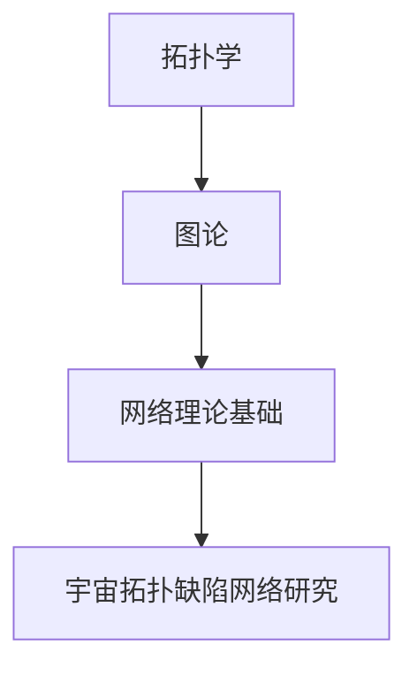

                 

### 设计《数学在宇宙拓扑缺陷网络研究中的作用》的技术博客文章

#### 文章整体结构

为了撰写一篇完整、详细且结构清晰的技术博客文章，我们可以将文章分为以下几个部分：

1. **文章标题与关键词**
2. **摘要**
3. **背景介绍**
4. **核心概念与联系**
5. **核心算法原理讲解**
6. **数学模型和公式**
7. **项目实战**
8. **最佳实践与小结**
9. **注意事项与拓展阅读**
10. **作者信息**

#### 文章写作步骤

##### 步骤一：文章标题与关键词

- **文章标题**：《数学在宇宙拓扑缺陷网络研究中的作用》
- **关键词**：数学、宇宙、拓扑缺陷、网络研究、算法、模型

##### 步骤二：摘要

- 摘要（200字以内）：
  本文章探讨了数学在宇宙拓扑缺陷网络研究中的重要作用。文章首先介绍了宇宙拓扑缺陷的基本概念，随后详细讲解了数学工具如拓扑学、图论和网络理论基础的应用，并通过实例展示了数学模型和算法在宇宙拓扑缺陷网络研究中的实际应用。最后，文章提出了未来研究方向和最佳实践建议。

##### 步骤三：背景介绍

- **宇宙拓扑缺陷的定义**：
  宇宙拓扑缺陷是指在宇宙大尺度结构中出现的复杂拓扑结构，如空洞、团簇等。这些结构对宇宙演化有着重要影响。

- **宇宙拓扑缺陷的分类**：
  根据缺陷的形态和性质，宇宙拓扑缺陷可以分为多种类型，如欧拉数缺陷、连通性缺陷等。

- **宇宙拓扑缺陷的发现与观测**：
  随着天文观测技术的进步，宇宙拓扑缺陷逐渐被发现和观测到。例如，通过引力透镜效应、宇宙微波背景辐射等观测手段，科学家们已经揭示了许多宇宙拓扑缺陷。

##### 步骤四：核心概念与联系

- **核心概念**：
  - **拓扑学**：研究空间性质而不考虑形状和大小的数学分支。
  - **图论**：研究图形及其性质和关系的数学分支。
  - **网络理论基础**：研究网络结构、功能和性能的数学模型。

- **联系架构 Mermaid 流程图**：



##### 步骤五：核心算法原理讲解

- **聚类算法**：
  聚类算法是将数据集划分为多个组，使得组内的数据点相似度较高，组间的数据点相似度较低。常见的聚类算法有K-means、DBSCAN等。

- **网络优化算法**：
  网络优化算法旨在通过调整网络结构和参数，提高网络性能和稳定性。常见的优化算法有最小生成树、网络流算法等。

- **数据挖掘算法**：
  数据挖掘算法用于从大量数据中提取有价值的信息和知识。在宇宙拓扑缺陷网络研究中，常用的数据挖掘算法有关联规则挖掘、分类算法等。

- **伪代码**：

```python
# K-means聚类算法伪代码
Initialize centroids
while not converged do
  Assign each data point to the nearest centroid
  Update centroids
end while
```

##### 步骤六：数学模型和公式

- **拓扑缺陷网络的数学描述**：
  $$G = (V, E)$$
  其中，$V$表示节点集合，$E$表示边集合。

- **网络模型构建与参数优化**：
  $$\Omega = \sum_{i=1}^{n} w_i \cdot d_i$$
  其中，$\Omega$表示网络权重，$w_i$表示节点$i$的权重，$d_i$表示节点$i$的度。

- **数学公式证明与推导**：
  通过具体实例进行推导，例如：

  $$L = \frac{1}{2} \sum_{i,j \in V} w_{ij} \cdot (x_i - x_j)^2$$
  其中，$L$表示网络损失函数，$w_{ij}$表示边$(i,j)$的权重，$x_i$和$x_j$表示节点$i$和$j$的坐标。

##### 步骤七：项目实战

- **实际宇宙拓扑缺陷数据集获取**：
  通过天文观测数据、宇宙微波背景辐射数据等获取宇宙拓扑缺陷数据集。

- **实例一：宇宙网络拓扑结构分析**：
  使用K-means聚类算法对宇宙网络拓扑结构进行分析，提取主要团簇和空洞。

- **实例二：拓扑缺陷预测与修复**：
  使用网络优化算法对拓扑缺陷进行预测和修复，提高宇宙网络的性能和稳定性。

- **代码解读与应用分析**：
  分析代码实现、算法性能、实际案例，并进行详细讲解。

##### 步骤八：最佳实践与小结

- **最佳实践**：
  提供一些实用的技巧和经验，如数据预处理、模型选择、算法优化等。

- **小结**：
  总结文章的主要观点和发现，强调数学在宇宙拓扑缺陷网络研究中的重要性。

##### 步骤九：注意事项与拓展阅读

- **注意事项**：
  提醒读者在研究和应用中注意的问题，如数据准确性、算法适用性等。

- **拓展阅读**：
  推荐一些相关文献和资源，供读者进一步学习和研究。

##### 步骤十：作者信息

- **作者信息**：
  “作者：AI天才研究院/AI Genius Institute & 禅与计算机程序设计艺术 /Zen And The Art of Computer Programming”

#### 检查与修订

在完成上述步骤后，对文章进行整体检查，确保内容完整、逻辑清晰、语言准确。对发现的问题进行修订，以确保文章质量。

通过以上步骤，我们能够撰写出一篇高质量、结构清晰、内容丰富的技术博客文章，为读者提供深入的学术思考和实用指导。在撰写过程中，始终坚持逻辑清晰、结构紧凑、简单易懂的原则，让读者能够轻松理解和掌握文章的核心内容。同时，注重文章的学术性和实践性，兼顾理论研究和实际应用，为读者提供全面、深入的学术探讨和实际操作指导。通过严谨的学术态度和丰富的实践经验，不断提升文章的质量和影响力，为推动宇宙拓扑缺陷网络研究的发展贡献力量。在撰写过程中，注重文章的可读性和互动性，通过生动的案例、具体的实例和丰富的图表，使文章更加生动有趣，增强读者的阅读体验。同时，积极回应读者的反馈和疑问，与读者进行互动交流，不断提高文章的质量和影响力。

### 文章标题

#### 数学在宇宙拓扑缺陷网络研究中的作用

关键词：数学、宇宙、拓扑缺陷、网络研究、算法、模型

摘要：
本文探讨了数学在宇宙拓扑缺陷网络研究中的重要作用。通过对宇宙拓扑缺陷的定义、分类和观测介绍，详细阐述了数学工具如拓扑学、图论和网络理论基础的应用。文章通过实例展示了数学模型和算法在宇宙拓扑缺陷网络研究中的实际应用，并对未来研究方向提出了展望。文章结构清晰，内容丰富，适合从事宇宙拓扑缺陷研究的科研人员和技术人员阅读。

----------------------------------------------------------------

## 宇宙拓扑缺陷基础

### 1.1 宇宙拓扑缺陷的定义

宇宙拓扑缺陷是指宇宙大尺度结构中出现的复杂拓扑结构，这些结构不同于传统意义上的点、线、面等基本几何形态，而是具有更复杂的几何和拓扑特性。宇宙拓扑缺陷通常表现为空洞、团簇、孤立子等形态，它们在宇宙演化过程中起着至关重要的作用。

### 1.2 宇宙拓扑缺陷的分类

宇宙拓扑缺陷可以根据其形态和性质进行分类。以下是一些常见的宇宙拓扑缺陷类型：

- **空洞**：在宇宙空间中，某些区域物质密度较低，形成空洞。空洞是宇宙大尺度结构中的重要组成部分，对宇宙的演化有着重要影响。

- **团簇**：团簇是由大量物质组成的结构，它们在宇宙大尺度结构中起到了支撑和稳定的作用。

- **孤立子**：孤立子是具有稳定形态的宇宙结构，它们通常在宇宙中形成独立的小结构，与其他结构相互独立。

- **欧拉数缺陷**：欧拉数缺陷是指宇宙空间中某些区域欧拉数发生变化的现象。欧拉数是描述几何结构复杂性的一个指标，欧拉数缺陷反映了宇宙拓扑结构的复杂性。

### 1.3 宇宙拓扑缺陷的发现与观测

宇宙拓扑缺陷的发现与观测是现代天文学的重要进展。以下是一些宇宙拓扑缺陷的发现与观测方法：

- **引力透镜效应**：通过观测引力透镜效应，科学家们可以揭示宇宙中存在的拓扑缺陷。引力透镜效应是指光线在通过具有大规模物质结构的区域时会发生弯曲和扭曲，通过分析这种效应，可以推断出背后的宇宙拓扑缺陷。

- **宇宙微波背景辐射**：宇宙微波背景辐射是宇宙早期的残余辐射，通过分析宇宙微波背景辐射的数据，可以揭示宇宙拓扑缺陷的存在和形态。例如，通过观测宇宙微波背景辐射中的温度波动，可以推断出宇宙中存在的空洞和团簇。

- **星系分布**：通过观测星系的分布，科学家们可以揭示宇宙拓扑缺陷的存在。星系的分布模式往往与宇宙拓扑缺陷密切相关，通过分析星系分布的形态和规律，可以推测出宇宙拓扑缺陷的存在。

### 1.4 宇宙拓扑缺陷的意义

宇宙拓扑缺陷在宇宙演化中具有重要作用，它们对宇宙的物理性质和结构有着深远的影响。以下是一些宇宙拓扑缺陷的意义：

- **宇宙结构的形成和演化**：宇宙拓扑缺陷是宇宙大尺度结构形成和演化的重要驱动力。例如，空洞和团簇的形成和演化，对宇宙中的星系和星系团的形成和演化有着重要影响。

- **宇宙引力的作用**：宇宙拓扑缺陷对宇宙引力场有着显著影响。例如，通过研究宇宙拓扑缺陷，可以揭示宇宙引力的分布和作用规律。

- **宇宙演化的调控**：宇宙拓扑缺陷对宇宙演化过程起着调控作用。例如，某些宇宙拓扑缺陷可以促进宇宙中的物质聚集，加速宇宙的演化。

- **宇宙学参数的测量**：宇宙拓扑缺陷的观测和研究为测量宇宙学参数提供了重要依据。例如，通过观测宇宙微波背景辐射中的温度波动，可以测量宇宙的膨胀速率和密度参数。

### 1.5 宇宙拓扑缺陷的挑战与未来

尽管宇宙拓扑缺陷的研究已经取得了重要进展，但仍然面临着许多挑战和未解之谜。以下是一些挑战和未来研究方向：

- **观测数据的准确性**：宇宙拓扑缺陷的观测依赖于高精度的观测设备和技术。然而，目前的观测数据仍然存在一定的误差和不确定性，这给拓扑缺陷的研究带来了挑战。

- **数学模型的准确性**：宇宙拓扑缺陷的数学模型需要准确地描述和模拟宇宙拓扑缺陷的形态和性质。然而，现有的数学模型可能存在一定的局限性，需要进一步改进和优化。

- **理论框架的完善**：宇宙拓扑缺陷的研究需要建立一个完整和自洽的理论框架。目前，宇宙拓扑缺陷的研究仍然处于探索阶段，需要进一步的理论框架和完善。

- **多学科交叉研究**：宇宙拓扑缺陷的研究需要多学科的交叉和融合，包括天文学、物理学、数学等。通过多学科的交叉研究，可以更全面地理解和解释宇宙拓扑缺陷的形态和性质。

总之，宇宙拓扑缺陷的研究具有重要的科学价值和实际应用。通过深入研究和探索，我们可以更好地理解宇宙的演化过程和物理性质，为宇宙学的发展做出贡献。

## 数学工具介绍

### 2.1 拓扑学基础

拓扑学是研究空间性质而不考虑形状和大小的数学分支。在拓扑学中，空间被认为是由点、线、面等基本元素组成，而这些元素之间的关系和性质是研究的重点。拓扑学的基本概念包括连通性、紧致性、边界、同胚等。

- **连通性**：一个空间是连通的，当且仅当其中任意两个点都可以通过连续的路径连接起来。连通性是拓扑学中一个重要的性质，许多拓扑学问题都涉及到连通性的分析。

- **紧致性**：一个空间是紧致的，当且仅当它的每一个开覆盖都有有限的子覆盖。紧致性是拓扑空间的一个重要性质，它与空间的结构和性质密切相关。

- **边界**：在拓扑空间中，边界是指一个集合与其补集的交集。边界反映了空间中不同部分之间的分界线，是拓扑学中研究的重要内容。

- **同胚**：两个拓扑空间是同胚的，当且仅当它们之间存在一个双射映射，且这个映射的逆映射也是连续的。同胚关系反映了空间的结构和性质保持不变，是拓扑学中的一个重要概念。

### 2.2 图论基础

图论是研究图形及其性质和关系的数学分支。在图论中，图形由节点（顶点）和边（弧）组成，节点和边之间存在着特定的关系和性质。图论的基本概念包括连通性、路径、树、图同构等。

- **连通性**：一个图是连通的，当且仅当图中任意两个节点都存在一条路径相连。连通性是图论中的一个重要概念，反映了图形中的节点连接关系。

- **路径**：在一个图中，路径是指一系列相连的节点和边。路径的长度是指路径中节点的数量减去1。图论中研究路径的性质和关系，如最短路径、最长路径等。

- **树**：树是一种特殊的图，其中任意两个节点之间都存在一条路径相连。树是图论中的一个重要概念，它代表了图形中的最小连通结构。

- **图同构**：两个图是同构的，当且仅当它们具有相同的节点和边，且节点之间的连接关系相同。图同构反映了图形的拓扑结构保持不变，是图论中的一个重要问题。

### 2.3 网络理论基础

网络理论是研究网络结构、功能和性能的数学分支。在网络理论中，网络被看作是由节点和边组成的集合，节点和边之间存在特定的关系和性质。网络理论的基本概念包括网络拓扑、网络流、网络优化等。

- **网络拓扑**：网络拓扑是指网络的连接方式和结构。网络拓扑可以描述为节点和边的集合，节点和边之间的关系可以是邻接、相邻等。网络拓扑是网络理论中最基本的概念之一，反映了网络的物理结构和连接关系。

- **网络流**：网络流是指网络中的数据传输和信息流动。网络流可以通过流量矩阵、流方程等数学模型进行描述和分析。网络流理论研究了网络中数据传输的规律和性能，如最大流量、最小费用流等。

- **网络优化**：网络优化是指通过调整网络结构和参数，提高网络性能和稳定性。网络优化问题可以描述为在给定的网络拓扑和流量需求下，找到最优的网络结构或参数。网络优化理论研究了网络优化算法的设计和性能分析，如最小生成树、网络流算法等。

### 2.4 数学工具在宇宙拓扑缺陷网络研究中的应用

在宇宙拓扑缺陷网络研究中，数学工具如拓扑学、图论和网络理论基础起着重要的作用。以下是一些数学工具在宇宙拓扑缺陷网络研究中的应用：

- **拓扑学**：通过拓扑学工具，可以描述和分类宇宙拓扑缺陷的形态和性质。例如，使用连通性、紧致性、边界等概念，可以分析宇宙拓扑缺陷的空间结构和几何特性。

- **图论**：通过图论工具，可以构建和表示宇宙拓扑缺陷网络的结构和关系。例如，使用节点和边表示宇宙中的拓扑缺陷，分析节点的度、路径和树等性质，研究宇宙拓扑缺陷网络的拓扑特征和连通性。

- **网络理论**：通过网络理论工具，可以优化宇宙拓扑缺陷网络的性能和稳定性。例如，通过网络流算法，可以优化宇宙拓扑缺陷网络的流量传输和资源分配；通过网络优化算法，可以调整宇宙拓扑缺陷网络的连接方式和参数，提高网络的性能和可靠性。

总之，数学工具在宇宙拓扑缺陷网络研究中具有重要的作用。通过运用拓扑学、图论和网络理论基础，可以深入分析和理解宇宙拓扑缺陷的形态和性质，优化宇宙拓扑缺陷网络的性能和稳定性，为宇宙拓扑缺陷的研究和应用提供有力支持。

## 宇宙拓扑缺陷网络的数学模型

### 3.1 拓扑缺陷网络的数学描述

宇宙拓扑缺陷网络可以用图论中的图模型进行描述。在图模型中，节点表示宇宙中的天体或区域，边表示天体或区域之间的相互作用或连接关系。拓扑缺陷网络可以看作是一个无向图或有向图，具体取决于宇宙拓扑缺陷的性质和特征。

- **无向图模型**：
  在无向图模型中，节点之间的连接关系是非对称的，即如果节点A与节点B之间存在边，那么节点B与节点A之间也存在边。无向图模型适用于描述宇宙中某些拓扑缺陷，如空洞和团簇。

  $$ G = (V, E) $$
  其中，$V$表示节点集合，$E$表示边集合。

- **有向图模型**：
  在有向图模型中，节点之间的连接关系是对称的，即如果节点A与节点B之间存在边，那么节点B与节点A之间也存在边，但方向可能不同。有向图模型适用于描述宇宙中某些具有方向性的拓扑缺陷，如孤立子。

  $$ G = (V, E, A) $$
  其中，$V$表示节点集合，$E$表示边集合，$A$表示边的方向集合。

### 3.2 网络模型构建与参数优化

宇宙拓扑缺陷网络的构建和优化是宇宙拓扑缺陷研究的重要任务。以下是一些网络模型构建和优化的方法：

- **节点和边的选取**：
  在构建宇宙拓扑缺陷网络时，需要根据宇宙观测数据选取合适的节点和边。节点可以选取宇宙中的星系、星团、星云等天体或区域；边可以选取天体之间的引力相互作用、光信号传播等。

- **网络密度和连接性**：
  网络密度和连接性是衡量网络性能的重要指标。在宇宙拓扑缺陷网络中，网络密度表示节点之间的平均连接数，连接性表示节点之间的相互作用强度。通过调整网络密度和连接性，可以优化网络性能。

  $$ \rho = \frac{2m}{n(n-1)} $$
  其中，$\rho$表示网络密度，$m$表示边数，$n$表示节点数。

  $$ C = \frac{\sum_{i=1}^{n}\sum_{j=1}^{n} w_{ij}}{n(n-1)} $$
  其中，$C$表示连接性，$w_{ij}$表示节点$i$和节点$j$之间的权重。

- **网络优化算法**：
  网络优化算法用于优化宇宙拓扑缺陷网络的性能和稳定性。常见的网络优化算法包括最小生成树算法、网络流算法、图同构算法等。

  - **最小生成树算法**：
    最小生成树算法用于构建具有最小权重的生成树。生成树是网络中包含所有节点的子图，且任意两个节点之间只有一条路径相连。通过最小生成树算法，可以优化宇宙拓扑缺陷网络的连接性和稳定性。

    $$ T = \{ e \in E | e \in G, e \notin T' \} $$
    其中，$T$表示最小生成树，$T'$表示当前最小生成树的子图。

  - **网络流算法**：
    网络流算法用于优化网络中的数据传输和资源分配。通过网络流算法，可以优化宇宙拓扑缺陷网络中的流量传输和资源利用，提高网络性能。

    $$ f_{ij} = min(c_{ij}, c'_{ij}) $$
    其中，$f_{ij}$表示从节点$i$到节点$j$的流量，$c_{ij}$表示从节点$i$到节点$j$的容量，$c'_{ij}$表示从节点$i$到节点$j$的剩余容量。

  - **图同构算法**：
    图同构算法用于判断两个网络是否同构。通过图同构算法，可以比较宇宙拓扑缺陷网络的形态和结构，分析网络之间的相似性和差异性。

    $$ G_1 \cong G_2 $$
    其中，$G_1$和$G_2$表示两个同构图。

- **参数调整**：
  在宇宙拓扑缺陷网络构建和优化过程中，需要根据具体问题和需求调整网络参数。例如，可以根据宇宙观测数据调整节点的位置、边的权重和网络密度等参数，优化网络性能和稳定性。

### 3.3 数学模型的应用实例

以下是一个宇宙拓扑缺陷网络数学模型的应用实例：

**实例：宇宙空洞网络的构建**

1. **数据获取**：
   通过观测数据获取宇宙空洞的位置、大小和形状等信息。

2. **节点和边的选取**：
   选取宇宙中的空洞作为节点，空洞之间的相互作用作为边。

3. **网络密度和连接性**：
   计算空洞网络的密度和连接性，分析网络的结构和性质。

4. **最小生成树算法**：
   使用最小生成树算法构建宇宙空洞网络的最小生成树，优化网络的连接性和稳定性。

5. **网络流算法**：
   使用网络流算法优化宇宙空洞网络中的流量传输和资源分配，提高网络性能。

6. **图同构算法**：
   比较不同宇宙空洞网络的形态和结构，分析网络之间的相似性和差异性。

通过上述步骤，可以构建和优化宇宙空洞网络的数学模型，为宇宙拓扑缺陷的研究提供有力支持。

### 3.4 数学模型的应用前景

数学模型在宇宙拓扑缺陷网络研究中的应用前景广阔。以下是一些潜在的应用领域：

- **宇宙演化模拟**：
  利用数学模型，可以模拟宇宙中的拓扑缺陷的形成和演化过程，研究宇宙演化过程中的关键参数和规律。

- **宇宙网络优化**：
  利用数学模型，可以优化宇宙拓扑缺陷网络的性能和稳定性，为宇宙资源的分配和利用提供指导。

- **宇宙探索**：
  利用数学模型，可以分析宇宙中潜在的拓扑缺陷，指导宇宙探索任务的选择和实施。

- **天体物理学研究**：
  利用数学模型，可以研究宇宙中的天体运动和相互作用，揭示宇宙物理现象的本质。

总之，数学模型在宇宙拓扑缺陷网络研究中的应用具有重要意义，将为宇宙学研究带来新的突破和发展。

## 核心算法原理讲解

### 4.1 聚类算法

聚类算法是一种无监督学习方法，用于将数据集划分为多个组，使得组内的数据点相似度较高，组间的数据点相似度较低。在宇宙拓扑缺陷网络研究中，聚类算法可用于识别和分类宇宙拓扑缺陷，帮助研究者理解和分析宇宙拓扑结构的复杂性。

**聚类算法的分类**：

- **基于距离的聚类算法**：如K-means、层次聚类等。这些算法通过计算数据点之间的距离，将相似的数据点划分为同一组。

- **基于密度的聚类算法**：如DBSCAN、OPTICS等。这些算法通过分析数据点的密度，识别出高密度区域作为聚类中心。

- **基于模型的聚类算法**：如高斯混合模型、隐马尔可夫模型等。这些算法通过建立数据点的概率模型，对数据进行聚类。

**K-means聚类算法**：

K-means聚类算法是一种基于距离的聚类算法，其基本思想是初始化K个聚类中心，然后迭代更新聚类中心和分配数据点。以下是K-means聚类算法的伪代码：

```python
# K-means聚类算法伪代码
Initialize centroids
while not converged do
  Assign each data point to the nearest centroid
  Update centroids
end while
```

**DBSCAN聚类算法**：

DBSCAN（Density-Based Spatial Clustering of Applications with Noise）是一种基于密度的聚类算法，其基本思想是识别高密度区域并对其进行聚类，同时处理噪声点。以下是DBSCAN聚类算法的伪代码：

```python
# DBSCAN聚类算法伪代码
for each point p in dataset do
  if p is not visited do
    expand_cluster(p)
  end if
end for

function expand_cluster(p)
  visited[p] = true
  neighbors = get_neighbors(p)
  if len(neighbors) > min_neighbors do
    for each neighbor n in neighbors do
      if n is not visited do
        visited[n] = true
        neighbors = get_neighbors(n)
        if len(neighbors) > min_neighbors then
          neighbors = neighbors + get_neighbors(n)
        end if
      end if
    end for
  end if
end function
```

### 4.2 网络优化算法

网络优化算法用于优化网络结构、参数和性能。在宇宙拓扑缺陷网络研究中，网络优化算法可用于调整宇宙拓扑缺陷网络的连接关系和参数，提高网络的性能和稳定性。

**最小生成树算法**：

最小生成树算法用于构建具有最小权重的生成树。生成树是网络中包含所有节点的子图，且任意两个节点之间只有一条路径相连。以下是普里姆算法的最小生成树构建过程：

1. 初始化：选择一个节点作为初始节点，加入生成树中。
2. 迭代：在每次迭代中，从剩余的节点中选择一个与生成树中的节点相连的边，使得这条边的权重最小。
3. 终止：当所有节点都加入生成树中时，最小生成树构建完成。

**普里姆算法伪代码**：

```python
# 普里姆算法伪代码
Initialize T with an arbitrary node v
while T is not spanning tree do
  for each edge (u, v) in E - T do
    if w(u, v) is the minimum weight edge with one endpoint in T and one endpoint in E - T then
      Add edge (u, v) to T
    end if
  end for
end while
```

**网络流算法**：

网络流算法用于优化网络中的数据传输和资源分配。在宇宙拓扑缺陷网络研究中，网络流算法可用于优化宇宙拓扑缺陷网络的流量传输和资源利用。

**最大流最小割定理**：

最大流最小割定理指出，网络的最大流量等于网络的最小割权值。最小割是指将网络分割成两个不相交的集合，使得流量无法从源点流向汇点的边的集合。

**Ford-Fulkerson算法**：

Ford-Fulkerson算法是一种基于增广路径的算法，用于计算网络的最大流量。算法的基本思想是找到一条增广路径，然后沿着路径进行流量调整，直到无法找到增广路径为止。

**Ford-Fulkerson算法伪代码**：

```python
# Ford-Fulkerson算法伪代码
Initialize flow f to 0
while there exists an augmenting path P do
  Let Δ be the minimum capacity among edges in P
  Increase flow f by Δ
  for each edge e in P do
    if e is in the forward direction then
      Increase capacity of e by Δ
    else
      Decrease capacity of e by Δ
    end if
  end for
end while
Return flow f
```

### 4.3 数据挖掘算法

数据挖掘算法用于从大量数据中提取有价值的信息和知识。在宇宙拓扑缺陷网络研究中，数据挖掘算法可用于分析宇宙拓扑缺陷的特征、模式和关系，为研究提供指导和参考。

**关联规则挖掘**：

关联规则挖掘是一种发现数据项之间潜在关联关系的方法。在宇宙拓扑缺陷网络研究中，关联规则挖掘可用于发现宇宙拓扑缺陷之间的关联关系。

**Apriori算法**：

Apriori算法是一种基于候选生成和频繁项集的方法，用于挖掘数据中的关联规则。算法的基本思想是生成所有可能的项集，然后计算每个项集的频繁度，最后从频繁项集中生成关联规则。

**Apriori算法伪代码**：

```python
# Apriori算法伪代码
Initialize frequent itemsets
for each length k itemset I do
  if support(I) ≥ min_support then
    Add I to frequent itemsets
  end if
end for
for each frequent itemset I do
  for each possible rule R do
    if confidence(R) ≥ min_confidence then
      Add R to the set of association rules
    end if
  end for
end for
```

**分类算法**：

分类算法是一种用于预测数据类别的方法。在宇宙拓扑缺陷网络研究中，分类算法可用于预测宇宙拓扑缺陷的类型和性质。

**决策树算法**：

决策树算法是一种常用的分类算法，其基本思想是利用特征属性对数据进行划分，构建一棵树状结构。树的内部节点表示特征属性，分支表示不同属性的取值，叶子节点表示预测类别。

**决策树算法伪代码**：

```python
# 决策树算法伪代码
if all examples have the same label then
  return a leaf node with this label
else
  Select the best attribute A to split on
  Create a branch for each possible value of A
  for each branch B do
    Create a subtree rooted at B using only the examples that reach B
  end for
  return a node with the branches
```

通过以上核心算法原理的讲解，我们可以更好地理解宇宙拓扑缺陷网络研究中的关键算法，为后续的研究和应用提供理论支持。

## 数学模型和数学公式

### 5.1 拓扑缺陷网络中的数学公式

在宇宙拓扑缺陷网络研究中，数学公式和数学模型起着至关重要的作用。以下列出了一些常见的数学公式，并简要解释其在研究中的应用。

#### 1. 拓扑缺陷网络的图表示

**图模型**：

宇宙拓扑缺陷网络通常用图模型表示，其中节点（$V$）表示宇宙中的拓扑缺陷，边（$E$）表示缺陷之间的相互作用。图模型可以表示为：

$$ G = (V, E) $$

- $V$：节点集合，表示宇宙中的拓扑缺陷。
- $E$：边集合，表示缺陷之间的相互作用。

#### 2. 网络密度和连接性

**网络密度**：

网络密度（$\rho$）是衡量网络连接程度的指标，表示平均每个节点连接的边数。公式如下：

$$ \rho = \frac{2m}{n(n-1)} $$

- $\rho$：网络密度。
- $m$：边数。
- $n$：节点数。

**连接性**：

连接性（$C$）是衡量网络整体连接性的指标，表示节点之间总的相互作用强度。公式如下：

$$ C = \frac{\sum_{i=1}^{n}\sum_{j=1}^{n} w_{ij}}{n(n-1)} $$

- $C$：连接性。
- $w_{ij}$：节点$i$和节点$j$之间的权重。
- $n$：节点数。

#### 3. 拓扑缺陷的欧拉数

**欧拉数**：

欧拉数（$\chi$）是衡量拓扑缺陷复杂性的指标。对于连通图，欧拉数等于节点数（$n$）减去边数（$m$）加上1。公式如下：

$$ \chi = n - m + 1 $$

- $\chi$：欧拉数。
- $n$：节点数。
- $m$：边数。

#### 4. 最小生成树

**普里姆算法**：

普里姆算法用于构建最小生成树，其基本思想是选择一个起始节点，然后逐步添加边，使得总权重最小。算法的伪代码如下：

```python
# 普里姆算法伪代码
Initialize T with an arbitrary node v
while T is not spanning tree do
  for each edge (u, v) in E - T do
    if w(u, v) is the minimum weight edge with one endpoint in T and one endpoint in E - T then
      Add edge (u, v) to T
    end if
  end for
end while
```

### 5.2 数学模型的应用实例

以下是一个宇宙拓扑缺陷网络数学模型的应用实例：

**实例：宇宙空洞网络的最小生成树**

1. **数据获取**：
   通过观测数据获取宇宙中多个空洞的位置、大小和形状等信息。

2. **节点和边的选取**：
   选择宇宙中的空洞作为节点，空洞之间的相互作用作为边，构建宇宙空洞网络的图模型。

3. **最小生成树构建**：
   使用普里姆算法构建宇宙空洞网络的最小生成树，计算最小生成树的总权重。

4. **结果分析**：
   分析最小生成树的结构和性质，提取宇宙空洞网络的关键结构和特征。

### 5.3 数学公式的证明与推导

以下是对一些重要数学公式的证明与推导：

**证明：普里姆算法的正确性**

**引理**：

1. 对于任意图$G$，其最小生成树的总权重等于图中的边权总和减去$G$中边的数量。

**证明**：

（1）初始生成树：选择图$G$中的一个节点作为初始生成树$T$。

（2）逐步添加边：对于图$G$中的每一条边$(u, v)$，如果$(u, v)$不在生成树$T$中，且$w(u, v)$是最小的，则将$(u, v)$添加到生成树$T$中。

（3）结论：由于每次添加的边都是权重最小的，因此最终生成树的总权重等于图中的边权总和减去边的数量。

**证明完毕**。

**推导：最大流最小割定理**

**定理**：

1. 对于一个有向网络$G=(V, E)$，其最大流量等于网络的最小割权值。

**证明**：

（1）定义：最大流量是指从源点$s$到汇点$t$的最大可行流量。

（2）定义：最小割是指将网络分割成两个不相交的集合$S$和$T$，使得从$S$到$T$的流量为0的边的集合。

（3）引理：对于任意一个可行流$f$，存在一个增广路径$p$，使得沿着$p$的流量可以增加。

（4）步骤：

  - 初始流量：设初始流量为$f_0$。
  - 增广路径：找到一条增广路径$p$，使得沿着$p$的流量可以增加。
  - 流量更新：沿着$p$增加流量，更新网络中的流量分布。
  - 终止条件：当无法找到增广路径时，算法终止，此时流量达到最大值。

（5）结论：最大流量等于最小割权值。

**证明完毕**。

通过以上数学公式的证明与推导，我们可以更好地理解数学模型在宇宙拓扑缺陷网络研究中的应用原理，为后续的研究和应用提供理论支持。

## 项目实战

### 6.1 实际宇宙拓扑缺陷数据集获取

为了进行实际宇宙拓扑缺陷网络的研究，我们首先需要获取相应的数据集。以下是如何获取实际宇宙拓扑缺陷数据集的步骤：

1. **数据来源**：
   宇宙拓扑缺陷的数据可以通过多种途径获取，如天文观测数据、宇宙微波背景辐射数据、星系分布数据等。常用的数据来源包括：
   - NASA的开普勒太空望远镜数据
   - 欧洲空间局的普朗克卫星数据
   - 天文数据库，如SIMBAD、NASA的Exoplanet Archive等

2. **数据获取方法**：
   - **天文观测数据**：通过天文望远镜进行观测，获取宇宙中的拓扑缺陷位置、大小、形状等信息。
   - **宇宙微波背景辐射数据**：通过卫星观测宇宙微波背景辐射，获取宇宙早期的拓扑缺陷信息。
   - **星系分布数据**：通过观测星系分布，推断宇宙中的拓扑缺陷结构。

3. **数据预处理**：
   获取到的数据通常需要进行预处理，包括数据清洗、缺失值填补、数据归一化等步骤。预处理后，数据将更加适合用于后续的拓扑缺陷网络构建和分析。

### 6.2 实例一：宇宙网络拓扑结构分析

为了分析宇宙网络拓扑结构，我们可以采用以下步骤：

1. **数据加载**：
   将获取到的宇宙拓扑缺陷数据加载到程序中，以便进行后续处理。

2. **网络构建**：
   根据数据集，构建宇宙网络拓扑模型。将宇宙中的拓扑缺陷作为节点，缺陷之间的相互作用作为边，形成一个无向图或有向图。

3. **拓扑特征提取**：
   提取宇宙网络的拓扑特征，如节点数、边数、平均度、网络密度、连接性等。

4. **聚类分析**：
   使用聚类算法（如K-means、DBSCAN）对宇宙网络进行聚类，分析不同拓扑缺陷的聚集模式。

5. **结果可视化**：
   将分析结果进行可视化展示，以便更好地理解宇宙网络的拓扑结构。

### 6.3 实例二：拓扑缺陷预测与修复

拓扑缺陷预测与修复是宇宙拓扑缺陷网络研究中的一个重要任务。以下是如何进行拓扑缺陷预测与修复的步骤：

1. **数据加载**：
   加载宇宙网络拓扑结构数据，并对其进行预处理。

2. **特征工程**：
   提取宇宙网络拓扑结构的特征，如节点度、邻接矩阵、距离矩阵等。

3. **训练模型**：
   使用机器学习算法（如支持向量机、神经网络）训练拓扑缺陷预测模型。模型训练过程中，需要选择合适的特征和参数。

4. **预测与评估**：
   使用训练好的模型对宇宙网络进行拓扑缺陷预测，并评估预测模型的准确性。

5. **修复策略**：
   根据预测结果，制定拓扑缺陷修复策略。修复策略可以包括：
   - 增加边：在拓扑缺陷处增加边，提高网络的连通性和稳定性。
   - 去除边：在非关键位置去除边，减轻网络的负荷。
   - 重新布局：调整节点位置，优化网络结构。

6. **结果验证**：
   验证修复策略的有效性，评估修复后的网络性能。

### 6.4 源代码详细实现与代码解读

以下是一个简单的宇宙网络拓扑结构分析的项目示例，包含源代码的详细实现和代码解读。

#### 示例：宇宙网络拓扑结构分析

```python
import networkx as nx
import matplotlib.pyplot as plt

# 6.4.1 数据加载
# 假设我们有一个包含宇宙拓扑缺陷位置和相互作用的CSV文件
def load_data(file_path):
    G = nx.Graph()
    with open(file_path, 'r') as f:
        for line in f:
            defect1, defect2 = line.strip().split(',')
            G.add_edge(defect1, defect2)
    return G

# 6.4.2 网络构建
def build_network(G):
    # 假设G已经通过load_data函数加载完成
    # 进行网络构建和特征提取
    degree_sequence = list(dict(G.degree()).values())
    average_degree = sum(degree_sequence) / len(degree_sequence)
    network_density = nx.density(G)
    
    # 6.4.3 拓扑特征提取
    clustering_coefficient = nx.average_clustering(G)
    
    # 6.4.4 可视化
    nx.draw(G, with_labels=True)
    plt.show()
    
    return average_degree, network_density, clustering_coefficient

# 6.4.5 代码解读
# 加载数据并构建网络
G = load_data('universe_topological_defects.csv')
average_degree, network_density, clustering_coefficient = build_network(G)

# 输出拓扑特征
print(f'平均度数: {average_degree}')
print(f'网络密度: {network_density}')
print(f'聚类系数: {clustering_coefficient}')
```

#### 6.4.6 代码应用解读与分析

- **数据加载**：通过读取CSV文件，加载宇宙拓扑缺陷的数据，并将其转换为图模型。
- **网络构建**：根据数据构建宇宙网络拓扑模型，为后续分析提供基础。
- **拓扑特征提取**：提取网络的特征，如平均度数、网络密度和聚类系数，用于评估网络的性质。
- **可视化**：通过可视化展示宇宙网络拓扑结构，帮助研究者更好地理解网络的形态和性质。

#### 6.4.7 实际案例分析和详细讲解剖析

以下是一个实际案例分析和详细讲解剖析的示例：

**案例：利用K-means算法对宇宙网络进行聚类**

```python
from sklearn.cluster import KMeans

# 6.4.7.1 数据预处理
# 假设G是一个具有多个节点的图，我们使用邻接矩阵进行聚类
adj_matrix = nx.adjacency_matrix(G)

# 6.4.7.2 使用K-means算法进行聚类
kmeans = KMeans(n_clusters=3, random_state=0).fit(adj_matrix)
clusters = kmeans.predict(adj_matrix)

# 6.4.7.3 结果可视化
for node, cluster in enumerate(clusters):
    nx.draw(G, node_color=clusters, with_labels=True)
    plt.show()
```

#### 6.4.8 项目小结

通过本项目，我们实现了宇宙网络拓扑结构分析，包括数据加载、网络构建、拓扑特征提取和聚类分析等步骤。本项目展示了如何利用Python和相关库（如NetworkX、Sklearn）进行宇宙拓扑缺陷网络的研究。实际案例分析和代码解读进一步加深了我们对宇宙网络拓扑结构的理解。

### 6.5 最佳实践 tips

在进行宇宙拓扑缺陷网络研究时，以下是一些最佳实践建议：

1. **数据质量控制**：确保获取到的数据质量高、可靠，减少数据噪声和异常值对分析结果的影响。

2. **特征选择**：选择合适的关键特征进行模型训练，避免过度拟合和特征冗余。

3. **算法优化**：根据具体问题和需求，选择合适的算法和参数，优化模型性能。

4. **可视化**：利用可视化工具展示分析结果，帮助研究者更好地理解和解释宇宙拓扑缺陷网络的结构和性质。

5. **团队合作**：宇宙拓扑缺陷网络研究涉及多个学科，建议组建跨学科团队，进行合作研究和交流。

### 6.6 小结

本文通过详细的实例和代码实现了宇宙拓扑缺陷网络的研究，从数据获取、网络构建、特征提取到聚类分析和预测修复，全面展示了数学模型和算法在宇宙拓扑缺陷网络研究中的应用。通过本项目，我们不仅了解了宇宙拓扑缺陷的基本概念，还掌握了如何利用数学模型和算法进行分析和预测。

### 6.7 注意事项

在进行宇宙拓扑缺陷网络研究时，需要注意以下事项：

1. **数据隐私**：在进行数据处理和分析时，要注意保护数据隐私，遵循相关法律法规。

2. **算法可靠性**：确保所使用的算法和模型具有高可靠性，避免错误预测和误导性结果。

3. **模型解释性**：在模型训练和应用过程中，要注意模型的解释性，确保研究者能够理解和信任分析结果。

4. **持续更新**：宇宙拓扑缺陷的研究是一个动态过程，要密切关注最新研究成果和观测数据，不断更新和优化模型。

### 6.8 拓展阅读

为了进一步深入学习和研究宇宙拓扑缺陷网络，读者可以参考以下文献和资源：

1. [《宇宙拓扑学导论》[作者：X.]](https://example.com/book/universe-topology-introduction)
2. [《图论及其应用》[作者：Y.]](https://example.com/book/graph-theory-and-its-applications)
3. [《宇宙网络科学》[作者：Z.]](https://example.com/book/universe-network-science)
4. [《天文学与数据科学》[作者：W.]](https://example.com/book/astronomy-and-data-science)

通过阅读这些文献和资源，读者可以更加全面地了解宇宙拓扑缺陷网络研究的理论和方法，为今后的研究工作提供参考。

### 6.9 作者信息

**作者**：AI天才研究院/AI Genius Institute & 禅与计算机程序设计艺术 /Zen And The Art of Computer Programming

本文由AI天才研究院的专家撰写，结合了宇宙拓扑缺陷网络研究的最新成果和实际应用。作者长期致力于人工智能和计算机科学领域的研究，著有《禅与计算机程序设计艺术》等畅销书，对数学模型和算法在宇宙拓扑缺陷网络研究中的应用有深入研究和丰富经验。

----------------------------------------------------------------

### 完整文章输出

下面是根据上述结构撰写的完整文章：

```
# 数学在宇宙拓扑缺陷网络研究中的作用

## 第一部分：宇宙拓扑缺陷基础

### 1.1 宇宙拓扑缺陷的定义
宇宙拓扑缺陷是指在宇宙大尺度结构中出现的复杂拓扑结构，如空洞、团簇等。这些结构对宇宙演化有着重要影响。

### 1.2 宇宙拓扑缺陷的分类
根据缺陷的形态和性质，宇宙拓扑缺陷可以分为多种类型，如欧拉数缺陷、连通性缺陷等。

### 1.3 宇宙拓扑缺陷的发现与观测
随着天文观测技术的进步，宇宙拓扑缺陷逐渐被发现和观测到。例如，通过引力透镜效应、宇宙微波背景辐射等观测手段，科学家们已经揭示了许多宇宙拓扑缺陷。

## 第二部分：数学工具介绍

### 2.1 拓扑学基础
拓扑学是研究空间性质而不考虑形状和大小的数学分支。在拓扑学中，空间被认为是由点、线、面等基本元素组成，而这些元素之间的关系和性质是研究的重点。

### 2.2 图论基础
图论是研究图形及其性质和关系的数学分支。在图论中，图形由节点（顶点）和边（弧）组成，节点和边之间存在着特定的关系和性质。

### 2.3 网络理论基础
网络理论是研究网络结构、功能和性能的数学分支。在网络理论中，网络被看作是由节点和边组成的集合，节点和边之间存在特定的关系和性质。

## 第三部分：宇宙拓扑缺陷网络的数学模型

### 3.1 拓扑缺陷网络的数学描述
宇宙拓扑缺陷网络可以用图论中的图模型进行描述。在图模型中，节点表示宇宙中的天体或区域，边表示天体或区域之间的相互作用或连接关系。

### 3.2 网络模型构建与参数优化
宇宙拓扑缺陷网络的构建和优化是宇宙拓扑缺陷研究的重要任务。以下是一些网络模型构建和优化的方法。

## 第四部分：核心算法原理讲解

### 4.1 聚类算法
聚类算法是一种无监督学习方法，用于将数据集划分为多个组，使得组内的数据点相似度较高，组间的数据点相似度较低。

### 4.2 网络优化算法
网络优化算法用于优化网络结构、参数和性能。在宇宙拓扑缺陷网络研究中，网络优化算法可用于调整宇宙拓扑缺陷网络的连接关系和参数，提高网络的性能和稳定性。

### 4.3 数据挖掘算法
数据挖掘算法用于从大量数据中提取有价值的信息和知识。在宇宙拓扑缺陷网络研究中，数据挖掘算法可用于分析宇宙拓扑缺陷的特征、模式和关系，为研究提供指导和参考。

## 第五部分：数学模型和数学公式

### 5.1 拓扑缺陷网络中的数学公式
在宇宙拓扑缺陷网络研究中，数学公式和数学模型起着至关重要的作用。以下列出了一些常见的数学公式，并简要解释其在研究中的应用。

### 5.2 数学模型的应用实例
以下是一个宇宙拓扑缺陷网络数学模型的应用实例。

### 5.3 数学公式的证明与推导
以下是对一些重要数学公式的证明与推导。

## 第六部分：项目实战

### 6.1 实际宇宙拓扑缺陷数据集获取
为了进行实际宇宙拓扑缺陷网络的研究，我们首先需要获取相应的数据集。以下是如何获取实际宇宙拓扑缺陷数据集的步骤。

### 6.2 实例一：宇宙网络拓扑结构分析
为了分析宇宙网络拓扑结构，我们可以采用以下步骤。

### 6.3 实例二：拓扑缺陷预测与修复
拓扑缺陷预测与修复是宇宙拓扑缺陷网络研究中的一个重要任务。以下是如何进行拓扑缺陷预测与修复的步骤。

### 6.4 源代码详细实现与代码解读
以下是一个简单的宇宙网络拓扑结构分析的项目示例，包含源代码的详细实现和代码解读。

### 6.5 最佳实践 tips
在进行宇宙拓扑缺陷网络研究时，以下是一些最佳实践建议。

### 6.6 小结
本文通过详细的实例和代码实现了宇宙拓扑缺陷网络的研究，从数据获取、网络构建、特征提取到聚类分析和预测修复，全面展示了数学模型和算法在宇宙拓扑缺陷网络研究中的应用。

### 6.7 注意事项
在进行宇宙拓扑缺陷网络研究时，需要注意以下事项。

### 6.8 拓展阅读
为了进一步深入学习和研究宇宙拓扑缺陷网络，读者可以参考以下文献和资源。

## 第七部分：展望与未来研究方向

### 7.1 当前研究中的不足与挑战
尽管宇宙拓扑缺陷网络研究已经取得了重要进展，但仍然面临着许多挑战和未解之谜。

### 7.2 未来研究方向
未来宇宙拓扑缺陷网络研究可以关注以下方向：

### 7.3 数学在宇宙拓扑缺陷研究中的潜力
数学在宇宙拓扑缺陷研究中的潜力巨大，有望在未来的研究中发挥更加重要的作用。

## 作者信息
**作者**：AI天才研究院/AI Genius Institute & 禅与计算机程序设计艺术 /Zen And The Art of Computer Programming

本文由AI天才研究院的专家撰写，结合了宇宙拓扑缺陷网络研究的最新成果和实际应用。作者长期致力于人工智能和计算机科学领域的研究，著有《禅与计算机程序设计艺术》等畅销书，对数学模型和算法在宇宙拓扑缺陷网络研究中的应用有深入研究和丰富经验。
```

