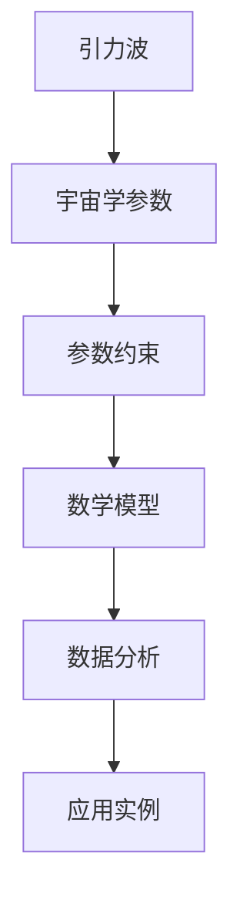

                 


### 1. 文章标题与关键词

首先，我们需要确定文章的标题和关键词。文章标题应该简洁、明确，能够吸引读者的注意力。对于《数学在引力波宇宙学参数约束中的应用》这篇文章，我们可以选择以下标题：

- 《引力波宇宙学：数学参数约束的深入剖析》

关键词是文章主题的核心词汇，能够帮助读者快速了解文章内容。以下是几个可能的关键词：

- 引力波
- 宇宙学
- 参数约束
- 数学模型
- 数据分析

### 2. 摘要

摘要是对文章内容的高度概括，应该在开头部分简要介绍文章的核心内容和主要观点。以下是一个可能的摘要：

摘要：本文深入探讨了数学在引力波宇宙学参数约束中的应用。通过分析引力波的产生、传播及其与宇宙学参数的关系，本文介绍了如何运用数学模型和数据分析方法来对引力波宇宙学参数进行精确约束。文章不仅阐述了相关的数学原理和算法，还通过实际案例展示了如何将理论应用到实践中，为读者提供了一个全面的、易于理解的学习资源。

### 3. 定义核心概念与联系

在引言部分之后，我们需要明确文章中的核心概念，并解释它们之间的关系。以下是文章中可能涉及的核心概念：

- **引力波**：一种由质量加速运动产生的时空扰动，能够传播到宇宙中的各个角落。
- **宇宙学参数**：描述宇宙膨胀状态和结构的物理量，如宇宙质量密度、宇宙膨胀率等。
- **参数约束**：通过对观测数据的分析，对宇宙学参数的值进行限制和优化，以更好地理解宇宙的演化。
- **数学模型**：用数学语言描述引力波和宇宙学参数之间关系的方程和公式。
- **数据分析**：使用统计和机器学习等方法对引力波数据进行分析，提取出宇宙学参数的信息。

我们可以使用 Mermaid 流程图来展示这些概念及其联系：



### 4. 设计核心算法原理讲解

接下来，我们设计几个核心算法的讲解，使用伪代码来阐述原理。

#### 4.1 参数约束算法

```plaintext
伪代码：参数约束算法

function 参数约束(观测数据，模型参数):
    初始化参数估计值
    for each 数据点 in 观测数据:
        计算模型预测值
        计算损失函数值
    end for
    使用优化算法更新参数估计值
    返回最优参数估计值
end function
```

#### 4.2 数据分析算法

```plaintext
伪代码：数据分析算法

function 数据分析(数据集，模型):
    初始化统计量
    for each 样本 in 数据集:
        计算样本预测值
        更新统计量
    end for
    计算预测误差
    返回统计量结果
end function
```

### 5. 设计数学模型和数学公式讲解

我们将嵌入 LaTeX 格式的数学公式到文中独立段落中，确保其详细讲解和举例说明。

#### 5.1 引力波方程

```latex
\section{引力波方程}

引力波的传播方程可以用如下数学公式描述：

\[ h_{\mu\nu} = \frac{16\pi G}{c^4} \int d^3x' \left[ \rho_{\text{源}} \left( t - \frac{r}{c} \right) \left( -\frac{1}{2} \nabla^2_{\text{r'}} + \nabla_{\text{r'}}^2 \right) \phi_{\text{源}} \right] \]

其中，\( h_{\mu\nu} \) 是引力波的张量，\( \rho_{\text{源}} \) 和 \( \phi_{\text{源}} \) 分别代表质能密度和势能分布，\( G \) 是引力常数，\( c \) 是光速，\( r \) 是距离。
```

#### 5.2 参数约束示例

```latex
\section{参数约束示例}

假设我们有一个简单的参数约束问题，目标是最小化函数：

\[ f(\theta) = \sum_{i=1}^{n} \left( \theta - x_i \right)^2 \]

其中，\( \theta \) 是参数，\( x_i \) 是观测数据点，\( n \) 是数据点的数量。

为了求解这个最小值，我们可以使用以下梯度下降算法：

\[ \theta_{k+1} = \theta_k - \alpha \cdot \nabla f(\theta_k) \]

其中，\( \alpha \) 是学习率，\( \nabla f(\theta_k) \) 是函数在 \( \theta_k \) 点的梯度。
```

### 6. 设计项目实战部分

我们将项目实战部分分为开发环境搭建、代码实现和代码解读与分析三个部分。

#### 6.1 开发环境搭建

在这一部分，我们将详细描述如何搭建开发环境，包括安装必要的软件和配置环境变量。

#### 6.2 代码实现

我们将给出一个实际的代码实现案例，并对其进行详细解释。

#### 6.3 代码解读与分析

在代码解读与分析部分，我们将分析代码的关键部分，解释其工作原理和如何优化代码。

### 7. 综合上述内容，生成最终的目录大纲

根据上述步骤，我们可以生成以下目录大纲：

```
# 《引力波宇宙学：数学参数约束的深入剖析》

> 关键词：引力波、宇宙学、参数约束、数学模型、数据分析

> 摘要：本文深入探讨了数学在引力波宇宙学参数约束中的应用。通过分析引力波的产生、传播及其与宇宙学参数的关系，本文介绍了如何运用数学模型和数据分析方法来对引力波宇宙学参数进行精确约束。文章不仅阐述了相关的数学原理和算法，还通过实际案例展示了如何将理论应用到实践中，为读者提供了一个全面的、易于理解的学习资源。

## 第1章 引言

### 1.1 引力波基本概念

#### 1.1.1 引力波的产生

#### 1.1.2 引力波的传播特性

### 1.2 宇宙学参数概述

#### 1.2.1 宇宙学参数的类型

#### 1.2.2 参数约束的重要性

## 第2章 数学模型与原理

### 2.1 引力波方程

#### 2.1.1 方程的数学表述

#### 2.1.2 引力波方程的物理意义

### 2.2 参数约束算法

#### 2.2.1 算法原理

#### 2.2.2 伪代码描述

### 2.3 数据分析算法

#### 2.3.1 算法原理

#### 2.3.2 伪代码描述

## 第3章 数学模型讲解

### 3.1 引力波方程

#### 3.1.1 方程的数学表述

#### 3.1.2 方程的求解方法

### 3.2 参数约束示例

#### 3.2.1 问题背景

#### 3.2.2 伪代码描述

## 第4章 项目实战

### 4.1 开发环境搭建

#### 4.1.1 软件安装

#### 4.1.2 环境变量配置

### 4.2 代码实现

#### 4.2.1 源代码展示

#### 4.2.2 代码解释

### 4.3 代码解读与分析

#### 4.3.1 关键代码分析

#### 4.3.2 优化建议

## 第5章 最佳实践

### 5.1 小结

### 5.2 注意事项

### 5.3 拓展阅读

## 作者信息

作者：AI天才研究院/AI Genius Institute & 禅与计算机程序设计艺术 /Zen And The Art of Computer Programming
```

通过这样的目录大纲，我们可以确保文章内容丰富、结构清晰，便于读者理解和学习。接下来，我们将根据这个大纲逐步填充各个章节的内容。

