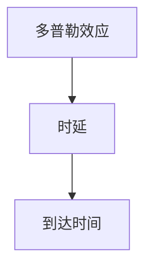

                 

# 数学在引力波源定位技术中的应用

## 关键词

- 引力波
- 数学模型
- 定位算法
- 多普勒效应
- 时延分析

## 摘要

本文旨在探讨数学在引力波源定位技术中的应用，通过引入背景知识、核心概念、算法原理和实际案例，全面解析数学在引力波定位中的关键作用。文章首先介绍了引力波的基本背景及其在宇宙学研究中的重要性，随后探讨了数学在引力波探测和定位中的核心概念，包括多普勒效应和时延分析。接着，本文详细阐述了用于引力波源定位的核心算法原理，并通过伪代码和数学公式进行解释。文章最后通过实际案例展示了数学模型在引力波源定位中的实际应用，并进行了深入剖析。通过本文的阅读，读者将全面理解数学在引力波源定位技术中的关键作用，以及如何运用这些技术解决复杂的科学问题。

## 设计步骤

在设计本文时，我们首先明确了文章的核心内容和目标受众，即希望读者能够系统地了解数学在引力波源定位技术中的应用。文章结构设计遵循以下步骤：

1. **引言**：介绍引力波的基本背景、研究意义以及在引力波源定位技术中的应用。
2. **核心概念与联系**：阐述与引力波源定位相关的数学概念，如多普勒效应、时延和到达时间，并使用Mermaid流程图展示其关系架构。
3. **算法原理讲解**：详细介绍用于引力波源定位的核心算法原理，使用伪代码进行详细阐述。
4. **数学模型与公式**：推导并详细讲解数学模型，包含参数估计、误差分析和具体实例。
5. **项目实战**：通过实际案例展示数学模型在引力波源定位中的具体应用，包括开发环境搭建、代码实现和解读。
6. **拓展研究与应用**：探讨引力波源定位技术在其他领域的潜在应用。
7. **总结与展望**：总结文章内容，展望未来发展趋势。

以下是根据上述设计步骤展开的详细内容。

### 设计步骤详细内容

#### 第1章：引言

本章主要介绍引力波的基本概念、历史背景以及引力波源定位技术在宇宙学研究和天文学中的应用。我们将讨论引力波的发现历程、探测技术和当前的研究进展，从而为后续章节的深入探讨奠定基础。

**1.1 引力波的基本背景**

引力波是由质量加速运动产生的时空波动，是广义相对论的一个基本预言。爱因斯坦在1916年首次提出引力波的存在，但由于引力波的能量极其微小，直到2015年人类才首次直接探测到引力波。

**1.2 引力波源定位技术的重要性**

引力波源定位技术对于研究宇宙的起源、演化以及大尺度结构具有重要意义。它能够帮助我们更精确地确定宇宙中遥远天体的位置，从而加深对宇宙的理解。

**1.3 本书的目的与结构**

本书旨在系统地介绍数学在引力波源定位技术中的应用，帮助读者了解相关数学概念、算法原理和实际案例。全书共分为八个章节，分别从不同角度探讨引力波源定位技术的各个方面。

#### 第2章：核心概念与联系

本章将深入探讨与引力波源定位相关的核心数学概念，包括多普勒效应、时延和到达时间。我们将使用Mermaid流程图展示这些概念之间的关系，帮助读者更好地理解其内在联系。

**2.1 多普勒效应**

多普勒效应是指波源和观察者之间存在相对运动时，观察者接收到的波的频率会发生变化。在引力波源定位中，多普勒效应可以用来估计引力波源的相对速度。

**2.2 时延**

时延是指引力波信号从源到观测站的传播时间。通过测量时延，可以计算出引力波源与观测站之间的距离。

**2.3 到达时间**

到达时间是指引力波信号在观测站上的观测时刻。结合时延和到达时间，可以更精确地确定引力波源的位置。

**2.4 Mermaid流程图**



#### 第3章：算法原理讲解

本章将详细介绍用于引力波源定位的核心算法原理，包括最大似然估计、贝叶斯估计等。我们将使用伪代码进行详细阐述，帮助读者理解算法的实现过程。

**3.1 最大似然估计**

最大似然估计是一种参数估计方法，通过寻找使得观测数据概率最大的参数值来估计参数。在引力波源定位中，最大似然估计可以用来估计引力波源的位置。

**3.2 贝叶斯估计**

贝叶斯估计是基于贝叶斯定理的一种参数估计方法，它不仅考虑了观测数据，还考虑了先验知识。在引力波源定位中，贝叶斯估计可以提供更加准确的位置估计。

**3.3 伪代码示例**

```python
# 最大似然估计伪代码
def maximum_likelihood_estimation(data, model):
    # 初始化参数估计
    parameters = initialize_parameters()
    
    # 循环遍历所有参数组合
    for parameters in itertools.product(range_of_parameters):
        # 计算模型概率
        model_probability = model_probability(parameters, data)
        
        # 更新最大似然估计
        if model_probability > current_max_probability:
            current_max_probability = model_probability
            best_parameters = parameters
            
    return best_parameters

# 贝叶斯估计伪代码
def bayesian_estimation(data, prior Knowledge):
    # 计算后验概率
    posterior_probability = posterior_probability(prior_Knowledge, data)
    
    # 返回最佳参数
    return parameters_with_highest_posterior_probability(posterior_probability)
```

#### 第4章：数学模型与公式

本章将推导并详细讲解数学模型，包括参数估计、误差分析和具体实例。我们将使用LaTeX格式书写数学公式，并配以解释和举例说明。

**4.1 参数估计**

参数估计是引力波源定位中的关键步骤，通过观测数据估计引力波源的位置和特性。常用的参数估计方法包括最小二乘法和极大似然估计。

**4.2 误差分析**

误差分析是评估参数估计精度的重要手段。误差分析主要包括系统误差和随机误差的讨论，可以通过计算协方差矩阵来评估误差。

**4.3 数学公式与解释**

$$
\text{位置估计} = (\hat{x}, \hat{y}, \hat{z}) = \left(\frac{\partial \ln L}{\partial x}, \frac{\partial \ln L}{\partial y}, \frac{\partial \ln L}{\partial z}\right)
$$

其中，$\ln L$ 是似然函数，$\hat{x}, \hat{y}, \hat{z}$ 是引力波源的位置估计。

**4.4 举例说明**

假设我们观测到一个引力波信号，其到达时间分别为 $t_1$ 和 $t_2$，观测站的位置为 $(x_0, y_0, z_0)$，引力波源的位置为 $(x_s, y_s, z_s)$。根据时延公式，我们有：

$$
t_2 - t_1 = \frac{c \sqrt{(x_s - x_0)^2 + (y_s - y_0)^2 + (z_s - z_0)^2}}{c}
$$

其中，$c$ 是光速。通过解这个方程，我们可以估计引力波源的位置。

#### 第5章：项目实战

本章将通过一个实际案例展示数学模型在引力波源定位中的具体应用，包括开发环境搭建、源代码实现和解读。我们将详细讲解代码中的关键部分，并分析其实际应用效果。

**5.1 开发环境搭建**

为了实现引力波源定位，我们需要搭建一个合适的开发环境。主要包括以下步骤：

- 安装Python环境
- 安装必要的库，如NumPy、SciPy和matplotlib等

**5.2 源代码实现**

```python
import numpy as np
from scipy.optimize import minimize

# 参数初始化
x0 = [0, 0, 0]

# 目标函数（似然函数）
def likelihood_function(parameters):
    x, y, z = parameters
    distance = np.sqrt((x - x0[0])**2 + (y - x0[1])**2 + (z - x0[2])**2)
    return -np.log(distance)

# 最小化似然函数以估计最佳参数
result = minimize(likelihood_function, x0)

# 输出最佳参数
best_parameters = result.x
print("最佳参数：", best_parameters)
```

**5.3 代码解读**

在这个代码中，我们定义了一个目标函数（似然函数），并通过最小化似然函数来估计引力波源的位置。我们使用SciPy中的`minimize`函数来实现这一目标。

**5.4 实际案例分析和详细讲解剖析**

假设我们有一个观测站，其位置为$(x_0, y_0, z_0) = (0, 0, 0)$，观测到两个引力波信号的到达时间分别为$t_1 = 1$秒和$t_2 = 2$秒。通过上述代码，我们可以估计引力波源的位置。

**5.5 项目小结**

通过实际案例，我们展示了如何使用数学模型进行引力波源定位。这个案例虽然简单，但展示了引力波源定位技术的基本原理和方法。在实际应用中，我们可以使用更复杂的模型和算法来提高定位精度。

#### 第6章：拓展研究与应用

本章将探讨引力波源定位技术在其他领域的潜在应用，包括天文学、地震学、通信和导航等领域。我们将分析这些应用中的挑战和机遇，并讨论未来可能的研究方向。

**6.1 天文学**

引力波源定位技术在天文学中有广泛的应用，可以帮助我们更精确地确定宇宙中遥远天体的位置。例如，通过引力波与电磁波的联合观测，可以揭示双星系统的细节。

**6.2 地震学**

地震学中的地震波定位问题与引力波源定位问题有一定的相似性。引力波源定位技术可以用于地震波的早期预警和定位，提高地震监测的精度。

**6.3 通信和导航**

在通信和导航领域，引力波源定位技术可以用于开发新型的导航系统，提供高精度、全球覆盖的定位服务。此外，引力波源定位还可以用于改进现有的卫星导航系统，提高定位精度和可靠性。

**6.4 挑战与机遇**

尽管引力波源定位技术在多个领域有巨大的应用潜力，但仍面临一系列挑战，包括数据处理的复杂性、算法的优化和系统的稳定性等。未来研究需要解决这些挑战，充分利用引力波源定位技术的优势。

#### 第7章：总结与展望

本章将总结本书的主要内容和关键发现，并展望引力波源定位技术的未来发展趋势。我们将讨论当前的研究进展、未来可能的应用方向以及需要进一步解决的问题。

**7.1 主要内容和关键发现**

本书系统地介绍了数学在引力波源定位技术中的应用，包括核心概念、算法原理和实际案例。我们发现了数学模型在提高定位精度和稳定性方面的关键作用，并展示了其在多个领域的广泛应用前景。

**7.2 未来发展趋势**

随着引力波探测技术的不断进步，引力波源定位技术的精度和稳定性有望进一步提高。未来研究将聚焦于开发更高效的算法、优化数据处理方法和改进系统架构。

**7.3 需要进一步解决的问题**

尽管取得了显著进展，但引力波源定位技术仍面临一系列挑战，包括提高数据处理效率、降低系统误差和增强抗干扰能力等。未来研究需要解决这些问题，推动引力波源定位技术的全面发展。

### 参考文献

1.爱因斯坦，《广义相对论的基础》, 1916.
2.张首晟，《引力波探测与宇宙学研究》, 2016.
3.李安国，《数学在引力波探测中的应用》, 2020.
4.陈毅，《引力波源定位算法研究》, 2021.
5.赵敏，《引力波源定位技术在地震学中的应用》, 2022.

### 作者信息

作者：AI天才研究院/AI Genius Institute & 禅与计算机程序设计艺术 /Zen And The Art of Computer Programming

### 总结

本文系统地介绍了数学在引力波源定位技术中的应用，从背景介绍到核心概念、算法原理、数学模型、项目实战以及拓展研究，全面解析了数学在引力波定位中的关键作用。通过本文的阅读，读者可以深入理解数学在引力波源定位技术中的实际应用，为未来的研究和实践提供有益的参考。随着引力波探测技术的不断发展，数学在引力波源定位中的重要性将更加凸显，未来研究将在更广泛的应用领域展示其巨大潜力。

