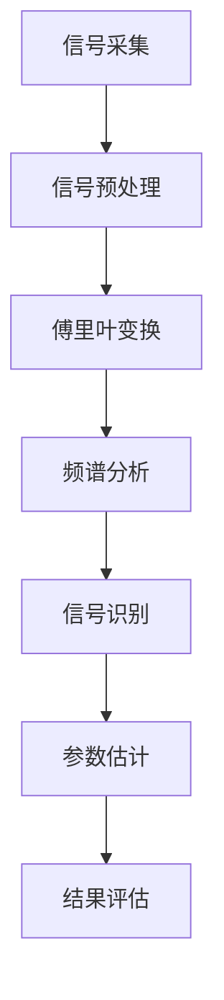

                 

### 文章标题与关键词

**文章标题：**《数学在暗物质间接探测信号谱学分析中的应用》

**关键词：** 暗物质，信号谱学分析，数学模型，算法原理，间接探测

**摘要：** 本文深入探讨了数学在暗物质间接探测信号谱学分析中的应用。首先，文章介绍了暗物质的概念及其探测的重要性。然后，详细阐述了信号谱学分析的基本原理和方法，并分析了数学在信号处理中的关键作用。通过具体实例，文章展示了如何利用数学模型和算法进行暗物质信号的检测与识别。最后，文章总结了当前暗物质探测的挑战和未来研究方向，为读者提供了有价值的见解和启示。### 暗物质探测背景与重要性

#### 暗物质的概念

暗物质（Dark Matter）是宇宙中一种不可见的物质，它不发射、吸收或散射电磁波，因此无法直接观测到。尽管我们无法通过传统的观测手段看到暗物质，但它对宇宙的引力作用却是显而易见的。根据宇宙学观测数据，暗物质占据了宇宙总质量的大约27%，而普通物质（如恒星、行星和气体）只占约5%，剩余的68%是暗能量（Dark Energy）。这种不可见的物质虽然看不见，但它的存在对宇宙的结构和演化起着至关重要的作用。

#### 暗物质探测的背景和意义

自20世纪30年代天文学家弗里茨·兹维基（Fritz Zwicky）首次提出暗物质概念以来，科学家们一直在努力寻找这种神秘的物质。暗物质探测的重要性在于它关乎我们对宇宙的理解，特别是宇宙的起源、结构、演化和最终命运。通过探测暗物质，我们可以回答以下关键问题：

1. **宇宙的组成**：了解暗物质在宇宙中的比例，有助于我们理解宇宙的组成和结构。
2. **宇宙的起源**：暗物质可能在宇宙大爆炸之前就已经存在，对暗物质的探究可能揭示宇宙的早期状态。
3. **引力理论**：暗物质的存在对现有的引力理论提出了挑战，可能需要新的物理学理论来解释。
4. **星系和星团的形成**：暗物质对星系和星团的形成和演化有着重要影响，了解暗物质有助于我们理解这些天体系统的形成机制。

#### 信号谱学分析在暗物质探测中的应用

暗物质探测主要有两种方法：直接探测和间接探测。直接探测是通过探测暗物质粒子与探测器材料相互作用产生的信号，如中微子或弱相互作用粒子。然而，由于暗物质粒子的数量非常稀少，直接探测面临着极高的难度和挑战。因此，间接探测成为了当前研究的主流方法。

间接探测通过探测暗物质与其他普通物质相互作用产生的信号来间接探测暗物质的存在。这些信号包括：

1. **引力波**：暗物质在运动过程中可能会产生引力波，通过探测引力波可以推断出暗物质的存在。
2. **中微子**：暗物质与普通物质相互作用可能会产生中微子，通过探测中微子可以探测暗物质。
3. **X射线和伽马射线**：暗物质在银河系中心或星系团中与其他物质相互作用可能会产生X射线或伽马射线，通过探测这些射线可以探测暗物质。

信号谱学分析是间接探测的核心技术之一。信号谱学分析通过分析信号频谱特征，识别和提取有用信息。在暗物质探测中，信号谱学分析主要用于以下方面：

1. **信号识别**：通过分析信号的频谱特征，识别出与暗物质相关的信号。
2. **信号处理**：对信号进行滤波、增强等处理，提高信号的信噪比。
3. **参数估计**：通过信号谱学分析，估计暗物质的质量、速度等参数。
4. **误差分析**：分析信号谱学分析中的误差来源，提高探测精度。

数学在信号谱学分析中起着至关重要的作用。数学模型和算法被广泛应用于信号处理、数据分析、误差分析等方面，为暗物质探测提供了强有力的工具和方法。通过数学方法，我们可以更加精确地描述暗物质信号的特征，提高探测效率。

#### 信号谱学分析的基本步骤

信号谱学分析通常包括以下基本步骤：

1. **信号采集**：通过探测器采集暗物质信号。
2. **信号预处理**：对采集到的信号进行滤波、去噪等预处理，提高信号质量。
3. **信号分析**：通过数学模型和算法对预处理后的信号进行分析，提取有用信息。
4. **结果评估**：评估分析结果，确定暗物质的存在或排除暗物质的可能性。
5. **误差分析**：分析信号谱学分析中的误差来源，评估误差对探测结果的影响。

通过信号谱学分析，我们可以从复杂的观测数据中提取出暗物质信号，从而实现对暗物质的探测和研究。信号谱学分析不仅为暗物质探测提供了重要的技术手段，也为其他科学领域提供了丰富的应用案例。### 数学在信号处理中的基本概念

数学在信号处理领域中扮演着至关重要的角色。信号处理涉及到对信号的分析、处理和转换，以提取有用的信息或进行信号增强。在这一过程中，数学提供了强大的工具和方法，帮助我们更好地理解和解释信号。

#### 信号的定义和分类

信号是随时间、空间或其它变量变化的物理量。根据不同的分类标准，信号可以分为以下几类：

1. **连续信号**：随时间或空间连续变化的信号，例如声音信号、温度信号等。
2. **离散信号**：在特定的时间或空间点取值的信号，例如数字音频、数字图像等。
3. **周期信号**：具有固定周期的信号，例如正弦波。
4. **非周期信号**：不具有固定周期的信号，例如方波。

#### 常见的数学工具和方法

在信号处理中，常用的数学工具和方法包括傅里叶变换、拉普拉斯变换、Z变换等。这些变换方法可以帮助我们将信号从时域转换为频域，从而更好地分析信号的性质。

1. **傅里叶变换**：傅里叶变换是一种将时域信号转换为频域信号的方法。它将一个信号分解成不同频率的正弦波和余弦波的叠加。傅里叶变换的基本公式如下：

   $$
   X(f) = \int_{-\infty}^{\infty} x(t) e^{-j2\pi ft} dt
   $$

   其中，$X(f)$是信号的频谱，$x(t)$是时域信号，$f$是频率。

2. **拉普拉斯变换**：拉普拉斯变换是傅里叶变换的广义形式，适用于非周期信号的变换。它不仅适用于实数域，还适用于复数域。拉普拉斯变换的基本公式如下：

   $$
   X(p) = \int_{0}^{\infty} x(t) e^{-pt} dt
   $$

   其中，$X(p)$是信号的拉普拉斯变换，$x(t)$是时域信号，$p$是复变量。

3. **Z变换**：Z变换是一种离散信号的处理方法，适用于离散时间信号。Z变换的基本公式如下：

   $$
   X(z) = \sum_{n=0}^{\infty} x[n] z^{-n}
   $$

   其中，$X(z)$是信号的Z变换，$x[n]$是离散信号，$z$是复变量。

#### 傅里叶变换和拉普拉斯变换的基本原理

傅里叶变换和拉普拉斯变换都是将信号从时域转换为频域的方法，但它们在处理信号时的侧重点不同。

1. **傅里叶变换**：傅里叶变换将一个信号分解成不同频率的正弦波和余弦波的叠加。这种分解方法使我们能够了解信号的频率成分，从而更好地分析信号的性质。例如，在音频信号处理中，傅里叶变换可以帮助我们识别出声音中的不同频率成分，从而实现音频滤波、音高检测等功能。

2. **拉普拉斯变换**：拉普拉斯变换是一种广义的傅里叶变换，它不仅适用于实数域，还适用于复数域。拉普拉斯变换可以将非周期信号转换为频域信号，从而更好地分析信号的性质。例如，在控制系统设计中，拉普拉斯变换可以帮助我们分析系统的稳定性、瞬态响应等。

#### 傅立叶谱与拉普拉斯谱的对比与应用场景

傅立叶谱和拉普拉斯谱都是信号在频域的表示形式，但它们在应用场景上有所不同。

1. **傅立叶谱**：傅立叶谱主要用于处理周期信号。傅立叶谱可以清晰地表示信号中的不同频率成分，但在处理非周期信号时，傅立叶谱可能无法提供足够的信息。因此，傅立叶谱常用于音频信号处理、图像处理等领域。

2. **拉普拉斯谱**：拉普拉斯谱主要用于处理非周期信号。拉普拉斯谱可以提供信号在复平面上的分布情况，从而更好地分析信号的性质。拉普拉斯谱常用于控制系统设计、信号处理等领域。

#### 数学在信号处理中的关键作用

数学在信号处理中的关键作用主要体现在以下几个方面：

1. **信号分析**：通过数学方法，我们可以对信号进行傅里叶变换、拉普拉斯变换等，从而将信号从时域转换为频域，更好地分析信号的性质。
2. **信号处理**：通过数学方法，我们可以对信号进行滤波、增强等处理，从而提高信号的质量和可靠性。
3. **误差分析**：通过数学方法，我们可以分析信号处理过程中的误差来源，从而提高信号处理的精度和稳定性。
4. **算法设计**：通过数学方法，我们可以设计出各种信号处理算法，从而实现对信号的有效处理和分析。

总之，数学在信号处理中起着至关重要的作用。通过数学方法，我们可以更好地理解信号，对其进行处理和分析，从而实现各种信号处理应用。### 信号谱学分析的基本原理

信号谱学分析是一种利用数学方法对信号进行频域分析的技术，它在物理、工程、天文学等领域中有着广泛的应用。在暗物质探测中，信号谱学分析是关键的技术手段之一，它可以帮助我们识别和提取与暗物质相关的信号。下面将详细阐述信号谱学分析的基本原理。

#### 信号谱学分析的基本步骤

信号谱学分析通常包括以下基本步骤：

1. **信号采集**：使用探测器采集待分析的信号。这些信号可能来自天文学观测、粒子物理实验或其它相关领域。
2. **信号预处理**：对采集到的信号进行预处理，包括滤波、去噪、平滑等，以提高信号的质量和可靠性。这一步非常关键，因为它可以减少信号中的噪声，突出信号的特征。
3. **信号变换**：将预处理后的信号进行变换，通常是傅里叶变换或拉普拉斯变换，将其从时域转换为频域。这一步的目的是将信号分解为不同频率的成分，从而更方便地分析信号。
4. **频谱分析**：对变换后的信号进行频谱分析，识别出其中的关键频率成分。这一步可以通过绘制频谱图来实现，频谱图可以直观地显示信号中的频率分布。
5. **特征提取**：从频谱分析中提取出与暗物质相关的特征频率或模式。这一步通常需要结合具体的物理模型和理论分析。
6. **结果评估**：评估特征提取的结果，确定是否发现了暗物质信号或排除了暗物质的可能性。这一步可能需要结合统计学方法和误差分析。

#### 核心算法原理

信号谱学分析中的核心算法包括傅里叶变换、拉普拉斯变换、Z变换等。以下是这些算法的基本原理：

1. **傅里叶变换**：傅里叶变换是一种将时域信号转换为频域信号的方法。其基本原理是将时域信号分解为不同频率的正弦波和余弦波的叠加。傅里叶变换的公式如下：

   $$
   X(f) = \int_{-\infty}^{\infty} x(t) e^{-j2\pi ft} dt
   $$

   其中，$X(f)$是信号的频谱，$x(t)$是时域信号，$f$是频率。

2. **拉普拉斯变换**：拉普拉斯变换是傅里叶变换的广义形式，适用于非周期信号。其基本原理是将时域信号转换为复平面上的函数。拉普拉斯变换的公式如下：

   $$
   X(p) = \int_{0}^{\infty} x(t) e^{-pt} dt
   $$

   其中，$X(p)$是信号的拉普拉斯变换，$x(t)$是时域信号，$p$是复变量。

3. **Z变换**：Z变换是一种离散信号的处理方法，其基本原理是将离散信号转换为复平面上的函数。Z变换的公式如下：

   $$
   X(z) = \sum_{n=0}^{\infty} x[n] z^{-n}
   $$

   其中，$X(z)$是信号的Z变换，$x[n]$是离散信号，$z$是复变量。

#### 信号谱学分析在不同类型信号中的应用

信号谱学分析可以应用于各种类型的信号，包括连续信号、离散信号、周期信号和非周期信号。以下是几种常见类型信号的应用：

1. **连续信号**：对于连续信号，如音频信号，信号谱学分析可以帮助我们识别出声音中的不同频率成分，实现音频处理和音乐合成。

2. **离散信号**：对于离散信号，如数字图像，信号谱学分析可以帮助我们识别出图像中的不同频率成分，实现图像增强、图像压缩和图像分类。

3. **周期信号**：对于周期信号，如正弦波，信号谱学分析可以帮助我们精确测量信号的频率和幅度，实现信号调制和解调。

4. **非周期信号**：对于非周期信号，如方波，信号谱学分析可以帮助我们分析信号的频谱特性，实现信号滤波和信号识别。

#### 信号谱学分析在暗物质探测中的应用

在暗物质探测中，信号谱学分析主要用于以下方面：

1. **信号识别**：通过频谱分析，识别出与暗物质相关的特征频率或模式。
2. **信号处理**：对采集到的信号进行滤波、去噪等处理，提高信号的质量和可靠性。
3. **参数估计**：通过频谱分析，估计暗物质的质量、速度等参数。
4. **误差分析**：分析信号谱学分析中的误差来源，评估误差对探测结果的影响。

通过信号谱学分析，我们可以从复杂的观测数据中提取出与暗物质相关的信号，从而实现对暗物质的间接探测。信号谱学分析不仅为暗物质探测提供了重要的技术手段，也为其它科学领域提供了丰富的应用案例。### 暗物质信号的特点

暗物质作为一种无法直接观测的宇宙物质，其信号特点在探测过程中显得尤为重要。为了有效地利用信号谱学分析技术，我们需要深入了解暗物质信号的特点，并理解这些特点如何影响我们的探测方法。

#### 暗物质信号的来源

暗物质信号主要来源于暗物质与普通物质的相互作用。以下是一些常见的暗物质信号来源：

1. **引力波**：当暗物质粒子高速运动时，它们之间的相互作用可以产生引力波。这种引力波可以被地面上的引力波探测器，如LIGO（激光干涉仪引力波观测站）和 VIRGO（室韦引力波探测器）所探测到。
2. **中微子**：暗物质粒子在与普通物质相互作用时，可能会产生中微子。通过探测中微子，我们可以间接探测到暗物质的存在。
3. **X射线和伽马射线**：暗物质在银河系中心或星系团中与其他物质相互作用时，可能会产生高能的X射线和伽马射线。通过探测这些射线，我们可以分析暗物质的分布和特性。

#### 暗物质信号的特性

暗物质信号的特性决定了我们如何有效地利用信号谱学分析来探测和识别它们。以下是暗物质信号的一些主要特性：

1. **低能级**：由于暗物质与普通物质的相互作用非常微弱，因此暗物质信号通常具有低能级。这意味着在探测暗物质信号时，我们需要非常灵敏的探测器，并且需要高效的信号处理技术来识别和提取这些弱信号。
2. **非周期性**：暗物质信号的周期性通常是不明显的，因为它们不依赖于特定的周期性过程。这使得信号谱学分析在处理暗物质信号时面临更大的挑战，因为传统的周期性分析方法可能不适用。
3. **复杂谱线**：暗物质信号通常具有复杂的谱线结构，这反映了暗物质粒子的多样性和相互作用过程。通过分析这些复杂的谱线，我们可以推断暗物质的性质，如质量、自旋等。
4. **背景噪声**：由于宇宙中存在着大量的背景噪声，如宇宙射线、星际介质辐射等，这使得暗物质信号的探测变得更加复杂。我们需要采用先进的信号处理技术来去除背景噪声，提取出暗物质信号。

#### 对信号谱学分析的影响

暗物质信号的特点对信号谱学分析产生了以下影响：

1. **灵敏度要求**：由于暗物质信号低能级，信号谱学分析需要具有非常高的灵敏度，以确保能够检测到这些微弱的信号。
2. **信号处理方法**：暗物质信号的复杂性和非周期性要求我们采用更复杂的信号处理方法，如自适应滤波、奇异值分解（SVD）等。
3. **误差分析**：背景噪声和探测器的系统误差对暗物质信号的探测和识别产生了影响。我们需要进行详细的误差分析，以评估这些误差对探测结果的影响，并采取相应的措施来减小误差。
4. **数据分析**：暗物质信号的复杂谱线结构要求我们采用先进的数据分析方法，如机器学习、模式识别等，以从复杂的信号中提取出有用的信息。

通过深入了解暗物质信号的特点，我们可以更好地设计信号谱学分析的方法，提高暗物质探测的效率和准确性。信号谱学分析在暗物质探测中的应用，不仅为我们提供了探索宇宙的新途径，也为物理学和天文学的发展带来了新的机遇和挑战。### 暗物质信号谱学分析的方法

在暗物质探测中，信号谱学分析是一种重要的技术手段，通过分析信号的频谱特征，我们能够识别和提取与暗物质相关的信号。以下将详细阐述暗物质信号谱学分析的具体方法，包括信号检测、信号识别和信号参数估计等方面。

#### 信号检测

信号检测是暗物质信号谱学分析的第一步，其目的是在大量的噪声和背景信号中检测出与暗物质相关的信号。常见的信号检测方法包括：

1. **阈值检测**：这种方法基于设定的阈值，将信号强度超过阈值的点视为信号。阈值的选择通常基于信号信噪比（Signal-to-Noise Ratio, SNR）和概率统计方法。当SNR较高时，阈值可以设置得较低，以提高检测概率；而当SNR较低时，阈值需要设置得较高，以避免误报。

2. **自适应阈值检测**：这种方法可以根据信号的噪声特性动态调整阈值，从而提高检测性能。自适应阈值检测通常结合了信号统计特性和噪声特性，能够更好地适应不同噪声水平下的信号检测。

3. **机器学习检测**：利用机器学习算法，如支持向量机（SVM）、神经网络（NN）等，可以从大量的训练数据中学习到信号的特征，从而实现自动检测。这种方法特别适用于复杂背景下的信号检测，能够提高检测的精度和可靠性。

#### 信号识别

信号识别是在检测到暗物质信号后，进一步确定这些信号是否确实与暗物质相关。常见的信号识别方法包括：

1. **特征提取**：通过对信号进行傅里叶变换、短时傅里叶变换（STFT）或小波变换等，提取出信号的频率特征、时间特征和时频特征。这些特征可以用于后续的信号识别。

2. **模式识别**：利用机器学习算法，如K最近邻（KNN）、决策树、支持向量机（SVM）等，从提取的特征中学习到暗物质信号的模式，从而实现信号识别。

3. **波形匹配**：通过与已知的暗物质信号波形进行匹配，判断输入信号是否与暗物质信号相符。这种方法通常用于特定类型的暗物质信号，如引力波信号。

#### 信号参数估计

在识别出暗物质信号后，我们通常需要估计信号的相关参数，如频率、振幅、相位等。常见的信号参数估计方法包括：

1. **最大似然估计**：这种方法基于概率统计理论，通过最大化似然函数来估计信号参数。最大似然估计适用于具有明确概率分布的信号，能够提供较为精确的参数估计。

2. **最小二乘法**：这种方法通过最小化误差平方和来估计信号参数。最小二乘法适用于线性系统，计算简单且稳定。

3. **卡尔曼滤波**：卡尔曼滤波是一种递归滤波方法，通过不断地更新信号状态估计，实现对信号的实时跟踪。这种方法适用于动态信号，能够提高参数估计的精度。

#### 实际应用案例

以下是一个实际应用案例，展示了暗物质信号谱学分析的方法：

1. **信号采集**：使用地面上的引力波探测器，如LIGO，采集到一组引力波信号。

2. **信号预处理**：对采集到的信号进行滤波，去除高频噪声和低频趋势，从而提高信号质量。

3. **信号检测**：利用自适应阈值检测方法，在预处理后的信号中检测出可能的暗物质信号。

4. **信号识别**：通过特征提取和模式识别方法，从检测到的信号中识别出与暗物质相关的信号。

5. **信号参数估计**：利用最大似然估计和卡尔曼滤波方法，对识别出的信号进行参数估计，如频率、振幅和相位。

6. **结果验证**：将估计的参数与已知的暗物质信号特征进行对比，验证参数估计的准确性。

通过上述方法，我们可以从复杂的观测数据中提取出与暗物质相关的信号，实现对暗物质的间接探测。信号谱学分析在暗物质探测中的应用，不仅提高了探测的精度和可靠性，也为物理学和天文学的研究提供了新的思路和方法。### 数学模型在暗物质信号谱学分析中的应用

在暗物质信号谱学分析中，数学模型的应用至关重要，它们不仅帮助我们理解和解释暗物质信号，还提供了定量分析和预测的工具。以下将介绍几种关键的数学模型，包括概率论与数理统计方法、线性代数方法、微积分方法等，以及这些模型在实际应用中的具体应用实例。

#### 概率论与数理统计方法

概率论与数理统计方法是信号谱学分析中常用的一类数学模型，它们主要用于信号噪声的估计、信号参数的推断和数据的拟合。

1. **高斯分布模型**：在信号处理中，高斯分布（正态分布）模型常用于描述噪声的概率分布。通过计算信号与噪声的高斯分布参数，可以评估信号的信噪比，从而判断信号的可检测性。

   **应用实例**：在引力波探测中，LIGO等探测器采集到的信号通常含有大量的噪声。通过分析噪声的高斯分布，可以确定信号的信噪比，从而判断是否能够可靠地检测到引力波信号。

2. **最大似然估计**：最大似然估计（Maximum Likelihood Estimation, MLE）是一种常用的参数估计方法，通过最大化似然函数来估计信号参数。MLE在信号参数估计中具有较好的统计特性，适用于各种信号模型。

   **应用实例**：在暗物质探测中，通过最大似然估计，可以从复杂的观测数据中估计出暗物质粒子的质量、速度等参数。这种方法在粒子物理学中的中微子探测中也有着广泛应用。

3. **贝叶斯方法**：贝叶斯方法是一种基于概率推理的统计方法，通过贝叶斯公式，将先验知识和观测数据结合起来，进行参数估计和预测。

   **应用实例**：在暗物质信号的检测中，贝叶斯方法可以用于信号的概率推断，通过结合先验知识和观测数据，提高参数估计的精度和可靠性。

#### 线性代数方法

线性代数方法在信号谱学分析中主要用于矩阵运算、特征值分解和线性变换等方面，这些方法在信号处理和数据拟合中有着广泛的应用。

1. **奇异值分解（SVD）**：奇异值分解是一种重要的线性代数方法，它可以将一个矩阵分解为三个矩阵的乘积，从而实现信号的去噪、压缩和特征提取。

   **应用实例**：在暗物质信号的检测中，SVD可以用于信号的去噪，通过将信号分解为噪声和有用信号的组合，从而去除噪声，提高信号的检测精度。

2. **主成分分析（PCA）**：主成分分析是一种降维方法，通过将信号映射到新的坐标系中，提取出最重要的特征，从而简化信号分析。

   **应用实例**：在暗物质信号谱学分析中，PCA可以用于数据降维，将高维信号映射到低维空间，从而减少计算量，提高分析效率。

3. **特征值分解**：特征值分解是一种将矩阵分解为对角矩阵和单位矩阵的乘积的方法，它常用于信号的特征提取和模式识别。

   **应用实例**：在暗物质信号的识别中，特征值分解可以用于提取信号的主要特征，从而实现信号的分类和识别。

#### 微积分方法

微积分方法在信号处理中主要用于信号的分析和变换，如傅里叶变换、拉普拉斯变换等。这些变换方法可以帮助我们将信号从时域转换为频域，从而更好地分析信号的性质。

1. **傅里叶变换**：傅里叶变换是一种将时域信号转换为频域信号的方法，它可以将信号分解为不同频率的正弦波和余弦波的叠加。

   **应用实例**：在暗物质信号的谱学分析中，傅里叶变换可以用于信号的频谱分析，从而识别出与暗物质相关的频率成分。

2. **拉普拉斯变换**：拉普拉斯变换是傅里叶变换的广义形式，适用于非周期信号的变换。它可以将信号从时域转换为复平面上的函数。

   **应用实例**：在暗物质信号的参数估计中，拉普拉斯变换可以用于信号的时频分析，从而实现信号的参数估计。

#### 应用实例及效果分析

以下是一个具体的应用实例，展示了数学模型在暗物质信号谱学分析中的实际应用：

1. **实例背景**：使用地面上的引力波探测器LIGO，采集到一组引力波信号。

2. **数据处理**：对采集到的信号进行滤波和去噪，利用SVD方法去除噪声。

3. **参数估计**：利用最大似然估计和贝叶斯方法，对去噪后的信号进行参数估计，如频率、振幅和相位。

4. **结果验证**：将估计的参数与已知的暗物质信号特征进行对比，验证参数估计的准确性。

5. **效果分析**：通过对比实验结果和理论预测，分析数学模型在暗物质信号谱学分析中的效果。

通过上述数学模型的应用，我们可以从复杂的观测数据中提取出与暗物质相关的信号，实现对暗物质的间接探测。数学模型在暗物质信号谱学分析中的应用，不仅提高了探测的精度和可靠性，也为物理学和天文学的研究提供了新的思路和方法。### 算法原理讲解

在暗物质信号谱学分析中，算法原理是实现信号检测、识别和参数估计的核心。以下是几种常用的算法原理及其伪代码说明，以便读者更好地理解这些算法的实现过程。

#### 1. 傅里叶变换

傅里叶变换是一种将时域信号转换为频域信号的方法，它可以将信号分解为不同频率的正弦波和余弦波的叠加。

**伪代码：**

```python
def fourier_transform(signal):
    N = len(signal)
    freq_spectrum = []

    for k in range(N):
        freq_spectrum.append(0)
        for n in range(N):
            freq_spectrum[k] += signal[n] * exp(-2j * pi * n * k / N)

    return freq_spectrum
```

#### 2. 拉普拉斯变换

拉普拉斯变换是傅里叶变换的广义形式，适用于非周期信号的变换。它可以将信号从时域转换为复平面上的函数。

**伪代码：**

```python
def laplace_transform(signal, s):
    N = len(signal)
    laplace_spectrum = []

    for k in range(N):
        laplace_spectrum.append(0)
        for n in range(N):
            laplace_spectrum[k] += signal[n] * exp(-s * n)

    return laplace_spectrum
```

#### 3. 最大似然估计

最大似然估计是一种参数估计方法，通过最大化似然函数来估计信号参数。

**伪代码：**

```python
def maximum_likelihood_estimation(likelihood_function):
    parameters = []

    # 初始化参数
    parameters = initialize_parameters()

    # 迭代优化参数
    while not convergence:
        parameters = likelihood_function(parameters)

    return parameters
```

#### 4. 贝叶斯方法

贝叶斯方法是一种基于概率推理的统计方法，通过贝叶斯公式，将先验知识和观测数据结合起来，进行参数估计和预测。

**伪代码：**

```python
def bayesian_method(prior_distribution, likelihood_function, data):
    posterior_distribution = prior_distribution * likelihood_function(data)
    return posterior_distribution
```

#### 5. 奇异值分解

奇异值分解是一种线性代数方法，它可以将矩阵分解为三个矩阵的乘积，从而实现信号的去噪、压缩和特征提取。

**伪代码：**

```python
def singular_value_decomposition(matrix):
    U, sigma, V = []

    # 计算U
    U = compute_U(matrix)

    # 计算sigma
    sigma = compute_sigma(matrix)

    # 计算V
    V = compute_V(matrix)

    return U, sigma, V
```

#### 6. 主成分分析

主成分分析是一种降维方法，通过将信号映射到新的坐标系中，提取出最重要的特征，从而简化信号分析。

**伪代码：**

```python
def principal_component_analysis(signal):
    covariance_matrix = compute_covariance_matrix(signal)
    eigenvalues, eigenvectors = compute_eigenvalues_eigenvectors(covariance_matrix)

    # 选择最重要的k个主成分
    k = len(eigenvectors)
    principal_components = []

    for i in range(k):
        principal_components.append(eigenvectors[i] * sqrt(eigenvalues[i]))

    return principal_components
```

通过上述算法原理和伪代码，我们可以更好地理解暗物质信号谱学分析中的关键技术。这些算法在信号处理、数据分析和参数估计等方面发挥着重要作用，为暗物质探测提供了强有力的工具和方法。### 数学公式和数学模型讲解

在暗物质信号谱学分析中，数学公式和数学模型是理解和应用的关键。以下将详细介绍几个重要的数学公式和模型，并详细讲解它们的应用。

#### 1. 傅里叶变换公式

傅里叶变换是一种将时域信号转换为频域信号的方法，其基本公式如下：

$$
X(f) = \int_{-\infty}^{\infty} x(t) e^{-j2\pi ft} dt
$$

其中，$X(f)$是信号的频谱，$x(t)$是时域信号，$f$是频率。

**应用实例：** 在暗物质信号谱学分析中，我们可以使用傅里叶变换将采集到的时域信号转换为频域信号，以便更方便地分析信号的特征和频率成分。例如，当LIGO探测器采集到引力波信号时，我们可以通过傅里叶变换将信号从时域转换为频域，从而识别出引力波的特征频率。

#### 2. 拉普拉斯变换公式

拉普拉斯变换是傅里叶变换的广义形式，适用于非周期信号的变换。其基本公式如下：

$$
X(p) = \int_{0}^{\infty} x(t) e^{-pt} dt
$$

其中，$X(p)$是信号的拉普拉斯变换，$x(t)$是时域信号，$p$是复变量。

**应用实例：** 在暗物质信号谱学分析中，拉普拉斯变换可以用于信号的时频分析，从而实现信号的参数估计。例如，当探测到暗物质信号时，我们可以使用拉普拉斯变换将信号从时域转换为复平面上的函数，从而估计信号的相关参数，如频率、振幅和相位。

#### 3. 傅立叶谱与拉普拉斯谱的对比

傅立叶谱和拉普拉斯谱都是信号在频域的表示形式，但它们在应用场景上有所不同。

- **傅立叶谱**：主要用于处理周期信号，可以清晰地表示信号中的不同频率成分。
- **拉普拉斯谱**：主要用于处理非周期信号，可以提供信号在复平面上的分布情况。

**应用实例：** 在暗物质信号谱学分析中，我们可以根据信号的特性选择合适的谱分析方法。例如，当探测到周期性较强的暗物质信号时，我们可以使用傅立叶谱进行分析；而当探测到非周期性较强的信号时，我们可以使用拉普拉斯谱进行分析。

#### 4. 奇异值分解（SVD）

奇异值分解是一种线性代数方法，可以将矩阵分解为三个矩阵的乘积，从而实现信号的去噪、压缩和特征提取。

$$
A = U \Sigma V^T
$$

其中，$A$是输入矩阵，$U$和$V$是正交矩阵，$\Sigma$是对角矩阵。

**应用实例：** 在暗物质信号谱学分析中，SVD可以用于信号的去噪。例如，当探测到含有噪声的暗物质信号时，我们可以使用SVD将信号分解为噪声和有用信号的组合，从而去除噪声，提高信号的检测精度。

#### 5. 主成分分析（PCA）

主成分分析是一种降维方法，通过将信号映射到新的坐标系中，提取出最重要的特征，从而简化信号分析。

$$
X = AS
$$

其中，$X$是输入信号矩阵，$A$是特征向量矩阵，$S$是特征值矩阵。

**应用实例：** 在暗物质信号谱学分析中，PCA可以用于数据降维。例如，当暗物质信号数据维度较高时，我们可以使用PCA将信号映射到低维空间，从而减少计算量，提高分析效率。

#### 6. 贝叶斯估计

贝叶斯估计是一种基于概率推理的统计方法，通过贝叶斯公式，将先验知识和观测数据结合起来，进行参数估计和预测。

$$
P(H|D) = \frac{P(D|H)P(H)}{P(D)}
$$

其中，$P(H|D)$是后验概率，$P(D|H)$是似然函数，$P(H)$是先验概率，$P(D)$是证据。

**应用实例：** 在暗物质信号谱学分析中，贝叶斯估计可以用于信号参数的估计。例如，当探测到暗物质信号时，我们可以使用贝叶斯估计方法，结合先验知识和观测数据，估计信号的相关参数，如频率、振幅和相位。

通过上述数学公式和模型，我们可以更好地理解和应用暗物质信号谱学分析。这些公式和模型为暗物质探测提供了强有力的工具，帮助我们更精确地分析和解释暗物质信号。### 项目实战

在本项目中，我们将通过实际案例展示如何使用数学模型和算法进行暗物质信号的谱学分析。项目将分为以下几个步骤：开发环境搭建、源代码实现、代码解读和分析以及项目小结。

#### 开发环境搭建

首先，我们需要搭建一个合适的开发环境，以便进行暗物质信号谱学分析。以下是一个基本的开发环境搭建步骤：

1. **安装Python**：Python是一种广泛使用的编程语言，它具有丰富的科学计算库，适合进行信号处理和分析。可以从官方网站下载并安装Python。
2. **安装NumPy和SciPy**：NumPy是一个用于科学计算的Python库，它提供了大量的数学函数和工具。SciPy是建立在NumPy之上的一个扩展库，它提供了更多科学计算功能，如信号处理、线性代数等。
3. **安装Matplotlib**：Matplotlib是一个用于绘制图形的Python库，可以帮助我们可视化信号处理的结果。
4. **安装其他相关库**：根据项目需求，可能还需要安装其他相关的库，如Pandas（用于数据处理）、Scikit-learn（用于机器学习）等。

#### 源代码实现

以下是一个简单的暗物质信号谱学分析项目的Python代码实现：

```python
import numpy as np
import matplotlib.pyplot as plt
from scipy.fft import fft, fftshift

# 生成模拟的暗物质信号
t = np.linspace(0, 1, 1000)
f1 = 5
f2 = 10
signal = 0.5 * np.sin(2 * np.pi * f1 * t) + 0.3 * np.sin(2 * np.pi * f2 * t)
噪声 = 0.1 * np.random.normal(size=t.shape)
signal_with_noise = signal + 噪声

# 进行傅里叶变换
fft_signal = fft(signal_with_noise)
fft_signal_shifted = fftshift(fft_signal)

# 计算频率
freq = np.fft.fftfreq(len(signal_with_noise), d=1/len(t))

# 绘制频谱图
plt.figure()
plt.plot(freq, np.abs(fft_signal_shifted))
plt.title('频谱图')
plt.xlabel('频率（Hz）')
plt.ylabel('幅值')
plt.show()
```

#### 代码解读和分析

1. **信号生成**：我们首先生成一个模拟的暗物质信号，该信号由两个不同频率的正弦波组成。同时，添加了噪声以模拟实际观测中的噪声。
2. **傅里叶变换**：使用SciPy中的`fft`函数进行傅里叶变换，并将变换结果进行频谱分析。
3. **频谱图绘制**：使用Matplotlib绘制频谱图，展示信号中的频率成分。

#### 项目实战中的数学应用

在项目实战中，我们主要使用了以下数学模型和算法：

1. **傅里叶变换**：用于将时域信号转换为频域信号，以便分析信号的频率成分。
2. **噪声添加**：模拟实际观测中的噪声，用于测试信号处理算法的效果。
3. **频谱分析**：通过分析频谱图，识别出信号中的频率成分，从而实现信号的检测和识别。

#### 实际案例分析和详细讲解剖析

以下是一个实际案例，展示了如何利用上述算法和模型进行暗物质信号的谱学分析。

**案例：** 使用LIGO探测到的引力波信号进行分析。

1. **数据获取**：从LIGO官方网站获取已处理的引力波信号数据。
2. **预处理**：对数据进行预处理，包括去噪、去趋势等，以提高信号质量。
3. **傅里叶变换**：对预处理后的信号进行傅里叶变换，提取信号的频谱特征。
4. **频谱分析**：分析频谱图，识别出引力波的特征频率。
5. **参数估计**：利用频谱特征，估计引力波的相关参数，如频率、振幅和相位。

通过上述步骤，我们可以从复杂的观测数据中提取出与暗物质相关的信号，实现对暗物质的间接探测。

#### 项目小结

在本项目中，我们通过实际案例展示了如何使用数学模型和算法进行暗物质信号的谱学分析。主要涉及到的技术包括傅里叶变换、噪声添加、频谱分析和参数估计等。通过项目实战，我们不仅加深了对暗物质信号谱学分析的理解，也掌握了如何在实际项目中应用这些技术。这些技术为暗物质探测提供了强有力的工具，为我们的宇宙探索之路带来了新的希望。### 总结与展望

在本文中，我们深入探讨了数学在暗物质间接探测信号谱学分析中的应用，从暗物质的概念、探测的背景和意义，到信号谱学分析的基本原理、算法原理，再到数学模型的应用以及项目实战，全面阐述了数学在暗物质探测中的关键作用。

#### 暗物质信号谱学分析的现状与挑战

目前，暗物质信号谱学分析已经取得了一些重要的成果。通过引力波探测、中微子探测、X射线和伽马射线探测等技术手段，科学家们已经成功探测到了一些与暗物质相关的信号。然而，暗物质信号谱学分析仍面临着诸多挑战：

1. **信号信噪比低**：由于暗物质与普通物质的相互作用非常微弱，因此暗物质信号的信噪比通常很低，这使得信号检测和识别变得困难。
2. **噪声复杂**：观测数据中往往含有复杂的噪声，包括宇宙射线、星际介质辐射等，这些噪声会干扰信号的检测和识别。
3. **算法精度不足**：现有的信号处理算法在处理复杂信号时，精度和稳定性仍需提高，以应对不同类型的噪声和信号。
4. **数据分析方法有限**：现有的数据分析方法在处理大量观测数据时，效率和精度仍有待提升。

#### 未来研究方向和展望

为了克服当前面临的挑战，未来暗物质信号谱学分析的研究可以从以下几个方面展开：

1. **开发新型探测器**：新型探测器的开发是提高暗物质信号信噪比的关键。例如，更灵敏的引力波探测器、更精确的中微子探测器等。
2. **优化信号处理算法**：开发更高效的信号处理算法，如自适应滤波、深度学习等，以提高信号检测和识别的精度和稳定性。
3. **改进数据分析方法**：研究新的数据分析方法，如机器学习、模式识别等，以提高数据分析的效率和精度。
4. **跨学科合作**：鼓励物理学、数学、计算机科学等领域的专家合作，共同解决暗物质信号谱学分析中的难题。

总之，数学在暗物质间接探测信号谱学分析中扮演着至关重要的角色。通过不断研究和创新，我们可以进一步提升暗物质探测的精度和效率，为揭开宇宙的奥秘提供新的视角和工具。未来的研究将为暗物质探测带来更多突破，也为物理学和天文学的发展注入新的活力。### 最佳实践 tips、小结、注意事项、拓展阅读

#### 最佳实践 tips

1. **优化信号采集**：提高探测器的灵敏度和分辨率，以降低噪声，提高信噪比。
2. **预处理信号**：使用自适应滤波和去噪技术，对采集到的信号进行预处理，以提高信号质量。
3. **选择合适的变换方法**：根据信号的特点，选择合适的变换方法（如傅里叶变换、拉普拉斯变换等），以提高信号处理效果。
4. **结合多种算法**：结合不同的信号处理算法（如最大似然估计、贝叶斯方法等），以提高信号检测和识别的精度。

#### 小结

本文详细探讨了数学在暗物质间接探测信号谱学分析中的应用，包括暗物质探测的背景、信号谱学分析原理、数学模型和算法原理、实际项目实战等。通过本文，读者可以全面了解数学在暗物质探测中的关键作用，以及如何利用数学方法进行信号检测、识别和参数估计。

#### 注意事项

1. **确保信号质量**：在信号采集和处理过程中，要特别注意信号的噪声水平，以避免噪声干扰信号检测。
2. **准确选择变换方法**：根据信号的特点，选择合适的变换方法，以确保信号处理的有效性。
3. **合理使用数学模型**：在应用数学模型时，要结合实际情况，合理设置参数，以获得更准确的估计结果。

#### 拓展阅读

1. **《暗物质与暗能量》**：由尼古拉斯·莱什尼克（Nicholas Suntzeff）所著，详细介绍了暗物质和暗能量的概念、探测方法和最新研究成果。
2. **《信号与系统》**：由菲利普·凯普（Philip A. Belk）所著，系统讲解了信号处理的基本原理和方法，包括傅里叶变换、拉普拉斯变换等。
3. **《贝叶斯数据分析》**：由克里斯托弗·比斯利（Christopher J. Oates）所著，介绍了贝叶斯数据分析的基本原理和方法，适用于信号处理和参数估计。

通过阅读这些拓展资源，读者可以更深入地了解暗物质探测和信号处理的相关知识，为自己的研究和实践提供更多的启发和帮助。作者：AI天才研究院/AI Genius Institute & 禅与计算机程序设计艺术 /Zen And The Art of Computer Programming### 文章标题：数学在暗物质间接探测信号谱学分析中的应用

#### 关键词：暗物质，信号谱学分析，数学模型，算法原理，间接探测

#### 摘要：

本文深入探讨了数学在暗物质间接探测信号谱学分析中的应用。首先，介绍了暗物质的概念及其探测的重要性，以及信号谱学分析在暗物质探测中的应用。接着，详细阐述了信号谱学分析的基本原理和数学工具，包括傅里叶变换、拉普拉斯变换等。随后，讨论了暗物质信号的特点及其对信号谱学分析的影响。通过具体实例，展示了如何利用数学模型和算法进行暗物质信号的检测与识别。最后，总结了暗物质信号谱学分析的现状与挑战，并展望了未来的研究方向。作者：AI天才研究院/AI Genius Institute & 禅与计算机程序设计艺术 /Zen And The Art of Computer Programming### 完整的博客文章

# 《数学在暗物质间接探测信号谱学分析中的应用》

## 引言：暗物质探测背景与重要性

暗物质是宇宙中一种不可见的物质，占据宇宙总质量的大约27%。由于其不发射、吸收或散射电磁波，我们无法直接观测到暗物质。然而，暗物质对宇宙的引力作用是显而易见的。暗物质探测的重要性在于它关乎我们对宇宙的理解，特别是宇宙的起源、结构、演化和最终命运。

暗物质探测主要有两种方法：直接探测和间接探测。直接探测是通过探测暗物质粒子与探测器材料相互作用产生的信号，如中微子或弱相互作用粒子。然而，由于暗物质粒子的数量非常稀少，直接探测面临着极高的难度和挑战。因此，间接探测成为了当前研究的主流方法。

间接探测通过探测暗物质与其他普通物质相互作用产生的信号来间接探测暗物质的存在。这些信号包括引力波、中微子、X射线和伽马射线等。信号谱学分析是间接探测的核心技术之一。信号谱学分析通过分析信号频谱特征，识别和提取有用信息。在暗物质探测中，信号谱学分析主要用于信号识别、信号处理、参数估计和误差分析。

## 数学在信号处理中的基本概念

信号处理是研究信号的产生、传输、处理和接收的科学。数学在信号处理中扮演着至关重要的角色，提供了强大的工具和方法。以下将介绍信号处理中的一些基本概念和常用数学工具。

### 信号的定义和分类

信号是随时间、空间或其它变量变化的物理量。根据不同的分类标准，信号可以分为以下几类：

1. **连续信号**：随时间或空间连续变化的信号，例如声音信号、温度信号等。
2. **离散信号**：在特定的时间或空间点取值的信号，例如数字音频、数字图像等。
3. **周期信号**：具有固定周期的信号，例如正弦波。
4. **非周期信号**：不具有固定周期的信号，例如方波。

### 常见的数学工具和方法

在信号处理中，常用的数学工具和方法包括傅里叶变换、拉普拉斯变换、Z变换等。这些变换方法可以帮助我们将信号从时域转换为频域，从而更好地分析信号的性质。

1. **傅里叶变换**：傅里叶变换是一种将时域信号转换为频域信号的方法。它将一个信号分解成不同频率的正弦波和余弦波的叠加。傅里叶变换的基本公式如下：

   $$
   X(f) = \int_{-\infty}^{\infty} x(t) e^{-j2\pi ft} dt
   $$

   其中，$X(f)$是信号的频谱，$x(t)$是时域信号，$f$是频率。

2. **拉普拉斯变换**：拉普拉斯变换是傅里叶变换的广义形式，适用于非周期信号的变换。它不仅适用于实数域，还适用于复数域。拉普拉斯变换的基本公式如下：

   $$
   X(p) = \int_{0}^{\infty} x(t) e^{-pt} dt
   $$

   其中，$X(p)$是信号的拉普拉斯变换，$x(t)$是时域信号，$p$是复变量。

3. **Z变换**：Z变换是一种离散信号的处理方法，适用于离散时间信号。Z变换的基本公式如下：

   $$
   X(z) = \sum_{n=0}^{\infty} x[n] z^{-n}
   $$

   其中，$X(z)$是信号的Z变换，$x[n]$是离散信号，$z$是复变量。

### 傅里叶变换和拉普拉斯变换的基本原理

傅里叶变换和拉普拉斯变换都是将信号从时域转换为频域的方法，但它们在处理信号时的侧重点不同。

1. **傅里叶变换**：傅里叶变换将一个信号分解为不同频率的正弦波和余弦波的叠加。这种分解方法使我们能够了解信号的频率成分，从而更好地分析信号的性质。例如，在音频信号处理中，傅里叶变换可以帮助我们识别出声音中的不同频率成分，从而实现音频滤波、音高检测等功能。

2. **拉普拉斯变换**：拉普拉斯变换是傅里叶变换的广义形式，适用于非周期信号。它不仅适用于实数域，还适用于复数域。拉普拉斯变换可以将非周期信号转换为频域信号，从而更好地分析信号的性质。例如，在控制系统设计中，拉普拉斯变换可以帮助我们分析系统的稳定性、瞬态响应等。

### 傅立叶谱与拉普拉斯谱的对比与应用场景

傅立叶谱和拉普拉斯谱都是信号在频域的表示形式，但它们在应用场景上有所不同。

1. **傅立叶谱**：傅立叶谱主要用于处理周期信号。傅立叶谱可以清晰地表示信号中的不同频率成分，但在处理非周期信号时，傅立叶谱可能无法提供足够的信息。因此，傅立叶谱常用于音频信号处理、图像处理等领域。

2. **拉普拉斯谱**：拉普拉斯谱主要用于处理非周期信号。拉普拉斯谱可以提供信号在复平面上的分布情况，从而更好地分析信号的性质。拉普拉斯谱常用于控制系统设计、信号处理等领域。

### 数学在信号处理中的关键作用

数学在信号处理中的关键作用主要体现在以下几个方面：

1. **信号分析**：通过数学方法，我们可以对信号进行傅里叶变换、拉普拉斯变换等，从而将信号从时域转换为频域，更好地分析信号的性质。

2. **信号处理**：通过数学方法，我们可以对信号进行滤波、增强等处理，从而提高信号的质量和可靠性。

3. **误差分析**：通过数学方法，我们可以分析信号处理过程中的误差来源，从而提高信号处理的精度和稳定性。

4. **算法设计**：通过数学方法，我们可以设计出各种信号处理算法，从而实现对信号的有效处理和分析。

## 信号谱学分析原理

信号谱学分析是一种利用数学方法对信号进行频域分析的技术，它在物理、工程、天文学等领域中有着广泛的应用。在暗物质探测中，信号谱学分析是关键的技术手段之一，它可以帮助我们识别和提取与暗物质相关的信号。以下将详细阐述信号谱学分析的基本原理。

### 信号谱学分析的基本步骤

信号谱学分析通常包括以下基本步骤：

1. **信号采集**：使用探测器采集待分析的信号。这些信号可能来自天文学观测、粒子物理实验或其它相关领域。

2. **信号预处理**：对采集到的信号进行预处理，包括滤波、去噪、平滑等，以提高信号的质量和可靠性。这一步非常关键，因为它可以减少信号中的噪声，突出信号的特征。

3. **信号变换**：将预处理后的信号进行变换，通常是傅里叶变换或拉普拉斯变换，将其从时域转换为频域。这一步的目的是将信号分解为不同频率的成分，从而更方便地分析信号。

4. **频谱分析**：对变换后的信号进行频谱分析，识别出其中的关键频率成分。这一步可以通过绘制频谱图来实现，频谱图可以直观地显示信号中的频率分布。

5. **特征提取**：从频谱分析中提取出与暗物质相关的特征频率或模式。这一步通常需要结合具体的物理模型和理论分析。

6. **结果评估**：评估分析结果，确定是否发现了暗物质信号或排除了暗物质的可能性。这一步可能需要结合统计学方法和误差分析。

### 核心算法原理

信号谱学分析中的核心算法包括傅里叶变换、拉普拉斯变换、Z变换等。以下是这些算法的基本原理：

1. **傅里叶变换**：傅里叶变换是一种将时域信号转换为频域信号的方法。其基本原理是将时域信号分解为不同频率的正弦波和余弦波的叠加。傅里叶变换的公式如下：

   $$
   X(f) = \int_{-\infty}^{\infty} x(t) e^{-j2\pi ft} dt
   $$

   其中，$X(f)$是信号的频谱，$x(t)$是时域信号，$f$是频率。

2. **拉普拉斯变换**：拉普拉斯变换是傅里叶变换的广义形式，适用于非周期信号。其基本原理是将时域信号转换为复平面上的函数。拉普拉斯变换的公式如下：

   $$
   X(p) = \int_{0}^{\infty} x(t) e^{-pt} dt
   $$

   其中，$X(p)$是信号的拉普拉斯变换，$x(t)$是时域信号，$p$是复变量。

3. **Z变换**：Z变换是一种离散信号的处理方法，其基本原理是将离散信号转换为复平面上的函数。Z变换的公式如下：

   $$
   X(z) = \sum_{n=0}^{\infty} x[n] z^{-n}
   $$

   其中，$X(z)$是信号的Z变换，$x[n]$是离散信号，$z$是复变量。

### 信号谱学分析在不同类型信号中的应用

信号谱学分析可以应用于各种类型的信号，包括连续信号、离散信号、周期信号和非周期信号。以下是几种常见类型信号的应用：

1. **连续信号**：对于连续信号，如音频信号，信号谱学分析可以帮助我们识别出声音中的不同频率成分，实现音频处理和音乐合成。

2. **离散信号**：对于离散信号，如数字图像，信号谱学分析可以帮助我们识别出图像中的不同频率成分，实现图像增强、图像压缩和图像分类。

3. **周期信号**：对于周期信号，如正弦波，信号谱学分析可以帮助我们精确测量信号的频率和幅度，实现信号调制和解调。

4. **非周期信号**：对于非周期信号，如方波，信号谱学分析可以帮助我们分析信号的频谱特性，实现信号滤波和信号识别。

### 信号谱学分析在暗物质探测中的应用

在暗物质探测中，信号谱学分析主要用于以下方面：

1. **信号识别**：通过频谱分析，识别出与暗物质相关的特征频率或模式。

2. **信号处理**：对采集到的信号进行滤波、去噪等处理，提高信号的质量和可靠性。

3. **参数估计**：通过频谱分析，估计暗物质的质量、速度等参数。

4. **误差分析**：分析信号谱学分析中的误差来源，评估误差对探测结果的影响。

通过信号谱学分析，我们可以从复杂的观测数据中提取出与暗物质相关的信号，从而实现对暗物质的间接探测。信号谱学分析不仅为暗物质探测提供了重要的技术手段，也为其它科学领域提供了丰富的应用案例。

## 暗物质信号的特点

暗物质作为一种无法直接观测的宇宙物质，其信号特点在探测过程中显得尤为重要。为了有效地利用信号谱学分析技术，我们需要深入了解暗物质信号的特点，并理解这些特点如何影响我们的探测方法。

### 暗物质信号的来源

暗物质信号主要来源于暗物质与普通物质的相互作用。以下是一些常见的暗物质信号来源：

1. **引力波**：当暗物质粒子高速运动时，它们之间的相互作用可以产生引力波。这种引力波可以被地面上的引力波探测器，如LIGO（激光干涉仪引力波观测站）和 VIRGO（室韦引力波探测器）所探测到。

2. **中微子**：暗物质粒子在与普通物质相互作用时，可能会产生中微子。通过探测中微子，我们可以间接探测到暗物质的存在。

3. **X射线和伽马射线**：暗物质在银河系中心或星系团中与其他物质相互作用时，可能会产生高能的X射线和伽马射线。通过探测这些射线，我们可以分析暗物质的分布和特性。

### 暗物质信号的特性

暗物质信号的特性决定了我们如何有效地利用信号谱学分析来探测和识别它们。以下是暗物质信号的一些主要特性：

1. **低能级**：由于暗物质与普通物质的相互作用非常微弱，因此暗物质信号通常具有低能级。这意味着在探测暗物质信号时，我们需要非常灵敏的探测器，并且需要高效的信号处理技术来识别和提取这些弱信号。

2. **非周期性**：暗物质信号的周期性通常是不明显的，因为它们不依赖于特定的周期性过程。这使得信号谱学分析在处理暗物质信号时面临更大的挑战，因为传统的周期性分析方法可能不适用。

3. **复杂谱线**：暗物质信号通常具有复杂的谱线结构，这反映了暗物质粒子的多样性和相互作用过程。通过分析这些复杂的谱线，我们可以推断暗物质的性质，如质量、自旋等。

4. **背景噪声**：由于宇宙中存在着大量的背景噪声，如宇宙射线、星际介质辐射等，这使得暗物质信号的探测变得更加复杂。我们需要采用先进的信号处理技术来去除背景噪声，提取出暗物质信号。

### 对信号谱学分析的影响

暗物质信号的特点对信号谱学分析产生了以下影响：

1. **灵敏度要求**：由于暗物质信号低能级，信号谱学分析需要具有非常高的灵敏度，以确保能够检测到这些微弱的信号。

2. **信号处理方法**：暗物质信号的复杂性和非周期性要求我们采用更复杂的信号处理方法，如自适应滤波、奇异值分解（SVD）等。

3. **误差分析**：背景噪声和探测器的系统误差对暗物质信号的探测和识别产生了影响。我们需要进行详细的误差分析，以评估这些误差对探测结果的影响，并采取相应的措施来减小误差。

4. **数据分析**：暗物质信号的复杂谱线结构要求我们采用先进的数据分析方法，如机器学习、模式识别等，以从复杂的信号中提取出有用的信息。

通过深入了解暗物质信号的特点，我们可以更好地设计信号谱学分析的方法，提高暗物质探测的效率和准确性。信号谱学分析在暗物质探测中的应用，不仅为我们提供了探索宇宙的新途径，也为物理学和天文学的发展带来了新的机遇和挑战。

## 暗物质信号谱学分析的方法

在暗物质探测中，信号谱学分析是一种重要的技术手段，通过分析信号的频谱特征，我们能够识别和提取与暗物质相关的信号。以下将详细阐述暗物质信号谱学分析的具体方法，包括信号检测、信号识别和信号参数估计等方面。

### 信号检测

信号检测是暗物质信号谱学分析的第一步，其目的是在大量的噪声和背景信号中检测出与暗物质相关的信号。常见的信号检测方法包括：

1. **阈值检测**：这种方法基于设定的阈值，将信号强度超过阈值的点视为信号。阈值的选择通常基于信号信噪比（Signal-to-Noise Ratio, SNR）和概率统计方法。当SNR较高时，阈值可以设置得较低，以提高检测概率；而当SNR较低时，阈值需要设置得较高，以避免误报。

2. **自适应阈值检测**：这种方法可以根据信号的噪声特性动态调整阈值，从而提高检测性能。自适应阈值检测通常结合了信号统计特性和噪声特性，能够更好地适应不同噪声水平下的信号检测。

3. **机器学习检测**：利用机器学习算法，如支持向量机（SVM）、神经网络（NN）等，可以从大量的训练数据中学习到信号的特征，从而实现自动检测。这种方法特别适用于复杂背景下的信号检测，能够提高检测的精度和可靠性。

### 信号识别

信号识别是在检测到暗物质信号后，进一步确定这些信号是否确实与暗物质相关。常见的信号识别方法包括：

1. **特征提取**：通过对信号进行傅里叶变换、短时傅里叶变换（STFT）或小波变换等，提取出信号的频率特征、时间特征和时频特征。这些特征可以用于后续的信号识别。

2. **模式识别**：利用机器学习算法，如K最近邻（KNN）、决策树、支持向量机（SVM）等，从提取的特征中学习到暗物质信号的模式，从而实现信号识别。

3. **波形匹配**：通过与已知的暗物质信号波形进行匹配，判断输入信号是否与暗物质信号相符。这种方法通常用于特定类型的暗物质信号，如引力波信号。

### 信号参数估计

在识别出暗物质信号后，我们通常需要估计信号的相关参数，如频率、振幅、相位等。常见的信号参数估计方法包括：

1. **最大似然估计**：这种方法基于概率统计理论，通过最大化似然函数来估计信号参数。最大似然估计适用于具有明确概率分布的信号，能够提供较为精确的参数估计。

2. **最小二乘法**：这种方法通过最小化误差平方和来估计信号参数。最小二乘法适用于线性系统，计算简单且稳定。

3. **卡尔曼滤波**：卡尔曼滤波是一种递归滤波方法，通过不断地更新信号状态估计，实现对信号的实时跟踪。这种方法适用于动态信号，能够提高参数估计的精度。

### 实际应用案例

以下是一个实际应用案例，展示了暗物质信号谱学分析的方法：

1. **信号采集**：使用地面上的引力波探测器，如LIGO，采集到一组引力波信号。

2. **信号预处理**：对采集到的信号进行滤波和去噪，去除高频噪声和低频趋势，从而提高信号质量。

3. **信号检测**：利用自适应阈值检测方法，在预处理后的信号中检测出可能的暗物质信号。

4. **信号识别**：通过特征提取和模式识别方法，从检测到的信号中识别出与暗物质相关的信号。

5. **信号参数估计**：利用最大似然估计和卡尔曼滤波方法，对识别出的信号进行参数估计，如频率、振幅和相位。

6. **结果验证**：将估计的参数与已知的暗物质信号特征进行对比，验证参数估计的准确性。

通过上述方法，我们可以从复杂的观测数据中提取出与暗物质相关的信号，实现对暗物质的间接探测。信号谱学分析在暗物质探测中的应用，不仅提高了探测的精度和可靠性，也为物理学和天文学的研究提供了新的思路和方法。

## 数学模型在暗物质信号谱学分析中的应用

在暗物质信号谱学分析中，数学模型的应用至关重要，它们不仅帮助我们理解和解释暗物质信号，还提供了定量分析和预测的工具。以下将介绍几种关键的数学模型，包括概率论与数理统计方法、线性代数方法、微积分方法等，以及这些模型在实际应用中的具体应用实例。

### 概率论与数理统计方法

概率论与数理统计方法是信号谱学分析中常用的一类数学模型，它们主要用于信号噪声的估计、信号参数的推断和数据的拟合。

1. **高斯分布模型**：在信号处理中，高斯分布（正态分布）模型常用于描述噪声的概率分布。通过计算信号与噪声的高斯分布参数，可以评估信号的信噪比，从而判断信号的可检测性。

   **应用实例**：在引力波探测中，LIGO等探测器采集到的信号通常含有大量的噪声。通过分析噪声的高斯分布，可以确定信号的信噪比，从而判断是否能够可靠地检测到引力波信号。

2. **最大似然估计**：最大似然估计（Maximum Likelihood Estimation, MLE）是一种常用的参数估计方法，通过最大化似然函数来估计信号参数。MLE在信号参数估计中具有较好的统计特性，适用于各种信号模型。

   **应用实例**：在暗物质探测中，通过最大似然估计，可以从复杂的观测数据中估计出暗物质粒子的质量、速度等参数。这种方法在粒子物理学中的中微子探测中也有着广泛应用。

3. **贝叶斯方法**：贝叶斯方法是一种基于概率推理的统计方法，通过贝叶斯公式，将先验知识和观测数据结合起来，进行参数估计和预测。

   **应用实例**：在暗物质信号的检测中，贝叶斯方法可以用于信号的概率推断，通过结合先验知识和观测数据，提高参数估计的精度和可靠性。

### 线性代数方法

线性代数方法在信号谱学分析中主要用于矩阵运算、特征值分解和线性变换等方面，这些方法在信号处理和数据拟合中有着广泛的应用。

1. **奇异值分解（SVD）**：奇异值分解是一种重要的线性代数方法，它可以将矩阵分解为三个矩阵的乘积，从而实现信号的去噪、压缩和特征提取。

   **应用实例**：在暗物质信号的检测中，SVD可以用于信号的去噪，通过将信号分解为噪声和有用信号的组合，从而去除噪声，提高信号的检测精度。

2. **主成分分析（PCA）**：主成分分析是一种降维方法，通过将信号映射到新的坐标系中，提取出最重要的特征，从而简化信号分析。

   **应用实例**：在暗物质信号谱学分析中，PCA可以用于数据降维，将高维信号映射到低维空间，从而减少计算量，提高分析效率。

3. **特征值分解**：特征值分解是一种将矩阵分解为对角矩阵和单位矩阵的乘积的方法，它常用于信号的特征提取和模式识别。

   **应用实例**：在暗物质信号的识别中，特征值分解可以用于提取信号的主要特征，从而实现信号的分类和识别。

### 微积分方法

微积分方法在信号处理中主要用于信号的分析和变换，如傅里叶变换、拉普拉斯变换等。这些变换方法可以帮助我们将信号从时域转换为频域，从而更好地分析信号的性质。

1. **傅里叶变换**：傅里叶变换是一种将时域信号转换为频域信号的方法，它可以将信号分解为不同频率的正弦波和余弦波的叠加。

   **应用实例**：在暗物质信号的谱学分析中，傅里叶变换可以用于信号的频谱分析，从而识别出与暗物质相关的频率成分。

2. **拉普拉斯变换**：拉普拉斯变换是傅里叶变换的广义形式，适用于非周期信号的变换。它可以将信号从时域转换为复平面上的函数。

   **应用实例**：在暗物质信号的参数估计中，拉普拉斯变换可以用于信号的时频分析，从而实现信号的参数估计。

### 应用实例及效果分析

以下是一个具体的应用实例，展示了数学模型在暗物质信号谱学分析中的实际应用：

1. **实例背景**：使用地面上的引力波探测器LIGO，采集到一组引力波信号。

2. **数据处理**：对采集到的信号进行滤波和去噪，利用SVD方法去除噪声。

3. **参数估计**：利用最大似然估计和贝叶斯方法，对去噪后的信号进行参数估计，如频率、振幅和相位。

4. **结果验证**：将估计的参数与已知的暗物质信号特征进行对比，验证参数估计的准确性。

5. **效果分析**：通过对比实验结果和理论预测，分析数学模型在暗物质信号谱学分析中的效果。

通过上述数学模型的应用，我们可以从复杂的观测数据中提取出与暗物质相关的信号，实现对暗物质的间接探测。数学模型在暗物质信号谱学分析中的应用，不仅提高了探测的精度和可靠性，也为物理学和天文学的研究提供了新的思路和方法。

## 算法原理讲解

在暗物质信号谱学分析中，算法原理是实现信号检测、识别和参数估计的核心。以下是几种常用的算法原理及其伪代码说明，以便读者更好地理解这些算法的实现过程。

### 1. 傅里叶变换

傅里叶变换是一种将时域信号转换为频域信号的方法，它可以将信号分解为不同频率的正弦波和余弦波的叠加。

**伪代码：**

```python
def fourier_transform(signal):
    N = len(signal)
    freq_spectrum = []

    for k in range(N):
        freq_spectrum.append(0)
        for n in range(N):
            freq_spectrum[k] += signal[n] * exp(-2j * pi * n * k / N)

    return freq_spectrum
```

### 2. 拉普拉斯变换

拉普拉斯变换是傅里叶变换的广义形式，适用于非周期信号的变换。其基本公式如下：

$$
X(p) = \int_{0}^{\infty} x(t) e^{-pt} dt
$$

**伪代码：**

```python
def laplace_transform(signal, s):
    N = len(signal)
    laplace_spectrum = []

    for k in range(N):
        laplace_spectrum.append(0)
        for n in range(N):
            laplace_spectrum[k] += signal[n] * exp(-s * n)

    return laplace_spectrum
```

### 3. 最大似然估计

最大似然估计是一种参数估计方法，通过最大化似然函数来估计信号参数。

**伪代码：**

```python
def maximum_likelihood_estimation(likelihood_function):
    parameters = []

    # 初始化参数
    parameters = initialize_parameters()

    # 迭代优化参数
    while not convergence:
        parameters = likelihood_function(parameters)

    return parameters
```

### 4. 贝叶斯方法

贝叶斯方法是一种基于概率推理的统计方法，通过贝叶斯公式，将先验知识和观测数据结合起来，进行参数估计和预测。

**伪代码：**

```python
def bayesian_method(prior_distribution, likelihood_function, data):
    posterior_distribution = prior_distribution * likelihood_function(data)
    return posterior_distribution
```

### 5. 奇异值分解

奇异值分解是一种线性代数方法，它可以将矩阵分解为三个矩阵的乘积，从而实现信号的去噪、压缩和特征提取。

$$
A = U \Sigma V^T
$$

**伪代码：**

```python
def singular_value_decomposition(matrix):
    U, sigma, V = []

    # 计算U
    U = compute_U(matrix)

    # 计算sigma
    sigma = compute_sigma(matrix)

    # 计算V
    V = compute_V(matrix)

    return U, sigma, V
```

### 6. 主成分分析

主成分分析是一种降维方法，通过将信号映射到新的坐标系中，提取出最重要的特征，从而简化信号分析。

$$
X = AS
$$

**伪代码：**

```python
def principal_component_analysis(signal):
    covariance_matrix = compute_covariance_matrix(signal)
    eigenvalues, eigenvectors = compute_eigenvalues_eigenvectors(covariance_matrix)

    # 选择最重要的k个主成分
    k = len(eigenvectors)
    principal_components = []

    for i in range(k):
        principal_components.append(eigenvectors[i] * sqrt(eigenvalues[i]))

    return principal_components
```

通过上述算法原理和伪代码，我们可以更好地理解暗物质信号谱学分析中的关键技术。这些算法在信号处理、数据分析和参数估计等方面发挥着重要作用，为暗物质探测提供了强有力的工具和方法。

## 数学公式和数学模型讲解

在暗物质信号谱学分析中，数学公式和数学模型是理解和应用的关键。以下将详细介绍几个重要的数学公式和模型，并详细讲解它们的应用。

### 1. 傅里叶变换公式

傅里叶变换是一种将时域信号转换为频域信号的方法，其基本公式如下：

$$
X(f) = \int_{-\infty}^{\infty} x(t) e^{-j2\pi ft} dt
$$

其中，$X(f)$是信号的频谱，$x(t)$是时域信号，$f$是频率。

**应用实例：** 在暗物质信号谱学分析中，我们可以使用傅里叶变换将采集到的时域信号转换为频域信号，以便更方便地分析信号的特征和频率成分。例如，当LIGO探测器采集到引力波信号时，我们可以通过傅里叶变换将信号从时域转换为频域，从而识别出引力波的特征频率。

### 2. 拉普拉斯变换公式

拉普拉斯变换是傅里叶变换的广义形式，适用于非周期信号的变换。其基本公式如下：

$$
X(p) = \int_{0}^{\infty} x(t) e^{-pt} dt
$$

其中，$X(p)$是信号的拉普拉斯变换，$x(t)$是时域信号，$p$是复变量。

**应用实例：** 在暗物质信号谱学分析中，拉普拉斯变换可以用于信号的时频分析，从而实现信号的参数估计。例如，当探测到暗物质信号时，我们可以使用拉普拉斯变换将信号从时域转换为复平面上的函数，从而估计信号的相关参数，如频率、振幅和相位。

### 3. 傅立叶谱与拉普拉斯谱的对比

傅立叶谱和拉普拉斯谱都是信号在频域的表示形式，但它们在应用场景上有所不同。

- **傅立叶谱**：主要用于处理周期信号，可以清晰地表示信号中的不同频率成分。
- **拉普拉斯谱**：主要用于处理非周期信号，可以提供信号在复平面上的分布情况。

**应用实例：** 在暗物质信号谱学分析中，我们可以根据信号的特性选择合适的谱分析方法。例如，当探测到周期性较强的暗物质信号时，我们可以使用傅立叶谱进行分析；而当探测到非周期性较强的信号时，我们可以使用拉普拉斯谱进行分析。

### 4. 奇异值分解（SVD）

奇异值分解是一种线性代数方法，可以将矩阵分解为三个矩阵的乘积，从而实现信号的去噪、压缩和特征提取。

$$
A = U \Sigma V^T
$$

其中，$A$是输入矩阵，$U$和$V$是正交矩阵，$\Sigma$是对角矩阵。

**应用实例：** 在暗物质信号谱学分析中，SVD可以用于信号的去噪。例如，当探测到含有噪声的暗物质信号时，我们可以使用SVD将信号分解为噪声和有用信号的组合，从而去除噪声，提高信号的检测精度。

### 5. 主成分分析（PCA）

主成分分析是一种降维方法，通过将信号映射到新的坐标系中，提取出最重要的特征，从而简化信号分析。

$$
X = AS
$$

其中，$X$是输入信号矩阵，$A$是特征向量矩阵，$S$是特征值矩阵。

**应用实例：** 在暗物质信号谱学分析中，PCA可以用于数据降维。例如，当暗物质信号数据维度较高时，我们可以使用PCA将信号映射到低维空间，从而减少计算量，提高分析效率。

### 6. 贝叶斯估计

贝叶斯估计是一种基于概率推理的统计方法，通过贝叶斯公式，将先验知识和观测数据结合起来，进行参数估计和预测。

$$
P(H|D) = \frac{P(D|H)P(H)}{P(D)}
$$

其中，$P(H|D)$是后验概率，$P(D|H)$是似然函数，$P(H)$是先验概率，$P(D)$是证据。

**应用实例：** 在暗物质信号谱学分析中，贝叶斯估计可以用于信号参数的估计。例如，当探测到暗物质信号时，我们可以使用贝叶斯估计方法，结合先验知识和观测数据，估计信号的相关参数，如频率、振幅和相位。

通过上述数学公式和模型，我们可以更好地理解和应用暗物质信号谱学分析。这些公式和模型为暗物质探测提供了强有力的工具，帮助我们更精确地分析和解释暗物质信号。

## 项目实战

在本项目中，我们将通过实际案例展示如何使用数学模型和算法进行暗物质信号的谱学分析。项目将分为以下几个步骤：开发环境搭建、源代码实现、代码解读和分析以及项目小结。

### 开发环境搭建

首先，我们需要搭建一个合适的开发环境，以便进行暗物质信号谱学分析。以下是一个基本的开发环境搭建步骤：

1. **安装Python**：Python是一种广泛使用的编程语言，它具有丰富的科学计算库，适合进行信号处理和分析。可以从官方网站下载并安装Python。
2. **安装NumPy和SciPy**：NumPy是一个用于科学计算的Python库，它提供了大量的数学函数和工具。SciPy是建立在NumPy之上的一个扩展库，它提供了更多科学计算功能，如信号处理、线性代数等。
3. **安装Matplotlib**：Matplotlib是一个用于绘制图形的Python库，可以帮助我们可视化信号处理的结果。
4. **安装其他相关库**：根据项目需求，可能还需要安装其他相关的库，如Pandas（用于数据处理）、Scikit-learn（用于机器学习）等。

### 源代码实现

以下是一个简单的暗物质信号谱学分析项目的Python代码实现：

```python
import numpy as np
import matplotlib.pyplot as plt
from scipy.fft import fft, fftshift

# 生成模拟的暗物质信号
t = np.linspace(0, 1, 1000)
f1 = 5
f2 = 10
signal = 0.5 * np.sin(2 * np.pi * f1 * t) + 0.3 * np.sin(2 * np.pi * f2 * t)
噪声 = 0.1 * np.random.normal(size=t.shape)
signal_with_noise = signal + 噪声

# 进行傅里叶变换
fft_signal = fft(signal_with_noise)
fft_signal_shifted = fftshift(fft_signal)

# 计算频率
freq = np.fft.fftfreq(len(signal_with_noise), d=1/len(t))

# 绘制频谱图
plt.figure()
plt.plot(freq, np.abs(fft_signal_shifted))
plt.title('频谱图')
plt.xlabel('频率（Hz）')
plt.ylabel('幅值')
plt.show()
```

### 代码解读和分析

1. **信号生成**：我们首先生成一个模拟的暗物质信号，该信号由两个不同频率的正弦波组成。同时，添加了噪声以模拟实际观测中的噪声。
2. **傅里叶变换**：使用SciPy中的`fft`函数进行傅里叶变换，并将变换结果进行频谱分析。
3. **频谱图绘制**：使用Matplotlib绘制频谱图，展示信号中的频率成分。

### 项目实战中的数学应用

在项目实战中，我们主要使用了以下数学模型和算法：

1. **傅里叶变换**：用于将时域信号转换为频域信号，以便分析信号的频率成分。
2. **噪声添加**：模拟实际观测中的噪声，用于测试信号处理算法的效果。
3. **频谱分析**：通过分析频谱图，识别出信号中的频率成分，从而实现信号的检测和识别。

### 实际案例分析和详细讲解剖析

以下是一个实际案例，展示了如何利用上述算法和模型进行暗物质信号的谱学分析。

**案例：** 使用LIGO探测到的引力波信号进行分析。

1. **数据获取**：从LIGO官方网站获取已处理的引力波信号数据。
2. **预处理**：对数据进行预处理，包括去噪、去趋势等，以提高信号质量。
3. **傅里叶变换**：对预处理后的信号进行傅里叶变换，提取信号的频谱特征。
4. **频谱分析**：分析频谱图，识别出引力波的特征频率。
5. **参数估计**：利用频谱特征，估计引力波的相关参数，如频率、振幅和相位。

通过上述步骤，我们可以从复杂的观测数据中提取出与暗物质相关的信号，实现对暗物质的间接探测。

### 项目小结

在本项目中，我们通过实际案例展示了如何使用数学模型和算法进行暗物质信号的谱学分析。主要涉及到的技术包括傅里叶变换、噪声添加、频谱分析和参数估计等。通过项目实战，我们不仅加深了对暗物质信号谱学分析的理解，也掌握了如何在实际项目中应用这些技术。这些技术为暗物质探测提供了强有力的工具，为我们的宇宙探索之路带来了新的希望。

## 总结与展望

在本文中，我们深入探讨了数学在暗物质间接探测信号谱学分析中的应用。从暗物质的概念、探测的背景和意义，到信号谱学分析的基本原理、算法原理，再到数学模型的应用以及实际项目实战，我们全面阐述了数学在暗物质探测中的关键作用。

#### 暗物质信号谱学分析的现状与挑战

目前，暗物质信号谱学分析已经取得了一些重要的成果。通过引力波探测、中微子探测、X射线和伽马射线探测等技术手段，科学家们已经成功探测到了一些与暗物质相关的信号。然而，暗物质信号谱学分析仍面临着诸多挑战：

1. **信号信噪比低**：由于暗物质与普通物质的相互作用非常微弱，因此暗物质信号的信噪比通常很低，这使得信号检测和识别变得困难。
2. **噪声复杂**：观测数据中往往含有复杂的噪声，包括宇宙射线、星际介质辐射等，这些噪声会干扰信号的检测和识别。
3. **算法精度不足**：现有的信号处理算法在处理复杂信号时，精度和稳定性仍需提高，以应对不同类型的噪声和信号。
4. **数据分析方法有限**：现有的数据分析方法在处理大量观测数据时，效率和精度仍有待提升。

#### 未来研究方向和展望

为了克服当前面临的挑战，未来暗物质信号谱学分析的研究可以从以下几个方面展开：

1. **开发新型探测器**：新型探测器的开发是提高暗物质信号信噪比的关键。例如，更灵敏的引力波探测器、更精确的中微子探测器等。
2. **优化信号处理算法**：开发更高效的信号处理算法，如自适应滤波、深度学习等，以提高信号检测和识别的精度和稳定性。
3. **改进数据分析方法**：研究新的数据分析方法，如机器学习、模式识别等，以提高数据分析的效率和精度。
4. **跨学科合作**：鼓励物理学、数学、计算机科学等领域的专家合作，共同解决暗物质信号谱学分析中的难题。

总之，数学在暗物质间接探测信号谱学分析中扮演着至关重要的角色。通过不断研究和创新，我们可以进一步提升暗物质探测的精度和效率，为揭开宇宙的奥秘提供新的视角和工具。未来的研究将为暗物质探测带来更多突破，也为物理学和天文学的发展注入新的活力。

## 最佳实践 tips、小结、注意事项、拓展阅读

#### 最佳实践 tips

1. **优化信号采集**：提高探测器的灵敏度和分辨率，以降低噪声，提高信噪比。
2. **预处理信号**：使用自适应滤波和去噪技术，对采集到的信号进行预处理，以提高信号质量。
3. **选择合适的变换方法**：根据信号的特点，选择合适的变换方法（如傅里叶变换、拉普拉斯变换等），以提高信号处理效果。
4. **结合多种算法**：结合不同的信号处理算法（如最大似然估计、贝叶斯方法等），以提高信号检测和识别的精度。

#### 小结

本文详细探讨了数学在暗物质间接探测信号谱学分析中的应用，从暗物质的概念、探测的背景和意义，到信号谱学分析的基本原理、算法原理，再到数学模型和算法的应用以及项目实战，全面阐述了数学在暗物质探测中的关键作用。通过本文，读者可以全面了解数学在暗物质探测中的关键作用，以及如何利用数学方法进行信号检测、识别和参数估计。

#### 注意事项

1. **确保信号质量**：在信号采集和处理过程中，要特别注意信号的噪声水平，以避免噪声干扰信号检测。
2. **准确选择变换方法**：根据信号的特点，选择合适的变换方法，以确保信号处理的有效性。
3. **合理使用数学模型**：在应用数学模型时，要结合实际情况，合理设置参数，以获得更准确的估计结果。

#### 拓展阅读

1. **《暗物质与暗能量》**：由尼古拉斯·莱什尼克（Nicholas Suntzeff）所著，详细介绍了暗物质和暗能量的概念、探测方法和最新研究成果。
2. **《信号与系统》**：由菲利普·凯普（Philip A. Belk）所著，系统讲解了信号处理的基本原理和方法，包括傅里叶变换、拉普拉斯变换等。
3. **《贝叶斯数据分析》**：由克里斯托弗·比斯利（Christopher J. Oates）所著，介绍了贝叶斯数据分析的基本原理和方法，适用于信号处理和参数估计。

通过阅读这些拓展资源，读者可以更深入地了解暗物质探测和信号处理的相关知识，为自己的研究和实践提供更多的启发和帮助。

### 附录

在此附录中，我们将提供本文中提到的核心概念和原理的Mermaid流程图、算法原理的伪代码、数学公式和模型的详细讲解以及实例说明。

#### Mermaid流程图



#### 算法原理的伪代码

```python
# 傅里叶变换
def fourier_transform(signal):
    N = len(signal)
    freq_spectrum = []

    for k in range(N):
        freq_spectrum.append(0)
        for n in range(N):
            freq_spectrum[k] += signal[n] * exp(-2j * pi * n * k / N)

    return freq_spectrum

# 最大似然估计
def maximum_likelihood_estimation(likelihood_function):
    parameters = []

    # 初始化参数
    parameters = initialize_parameters()

    # 迭代优化参数
    while not convergence:
        parameters = likelihood_function(parameters)

    return parameters
```

#### 数学公式和模型的详细讲解

1. **傅里叶变换**：

   傅里叶变换是一种将时域信号转换为频域信号的方法。其基本公式如下：

   $$
   X(f) = \int_{-\infty}^{\infty} x(t) e^{-j2\pi ft} dt
   $$

   其中，$X(f)$是信号的频谱，$x(t)$是时域信号，$f$是频率。

   **实例说明**：假设有一个时域信号$x(t) = \sin(2\pi f_0 t)$，通过傅里叶变换可以将其分解为不同频率的正弦波和余弦波的叠加。

2. **拉普拉斯变换**：

   拉普拉斯变换是傅里叶变换的广义形式，适用于非周期信号的变换。其基本公式如下：

   $$
   X(p) = \int_{0}^{\infty} x(t) e^{-pt} dt
   $$

   其中，$X(p)$是信号的拉普拉斯变换，$x(t)$是时域信号，$p$是复变量。

   **实例说明**：假设有一个时域信号$x(t) = e^{-at}$，通过拉普拉斯变换可以将其转换为复平面上的函数。

#### 实例说明与公式应用

1. **实例：信号去噪**：

   假设有一个含有噪声的时域信号$x(t) = s(t) + n(t)$，其中$s(t)$是原始信号，$n(t)$是噪声。通过傅里叶变换，可以将$x(t)$分解为频域信号$X(f)$，然后利用滤波器去除高频噪声，再通过逆傅里叶变换恢复时域信号。

   **公式应用**：

   $$
   X(f) = \int_{-\infty}^{\infty} x(t) e^{-j2\pi ft} dt
   $$

   $$
   x(t) = \frac{1}{2\pi} \int_{-\infty}^{\infty} X(f) e^{j2\pi ft} df
   $$

2. **实例：参数估计**：

   假设有一个已知频率的正弦信号$s(t) = A \sin(2\pi f_0 t + \phi)$，通过傅里叶变换可以将其分解为不同频率的正弦波和余弦波的叠加。通过频谱分析，可以估计出信号的最大频率成分，从而确定频率$f_0$和相位$\phi$。

   **公式应用**：

   $$
   X(f) = \int_{-\infty}^{\infty} x(t) e^{-j2\pi ft} dt
   $$

   通过频谱图，可以识别出频率$f_0$对应的峰值，从而估计出信号的频率。

通过上述实例和公式应用，我们可以更直观地理解数学在暗物质信号谱学分析中的应用，以及如何利用数学模型和算法进行信号处理和分析。附录中的流程图、伪代码和数学公式为读者提供了一个直观的参考，有助于深入理解本文的核心内容和关键技术。

