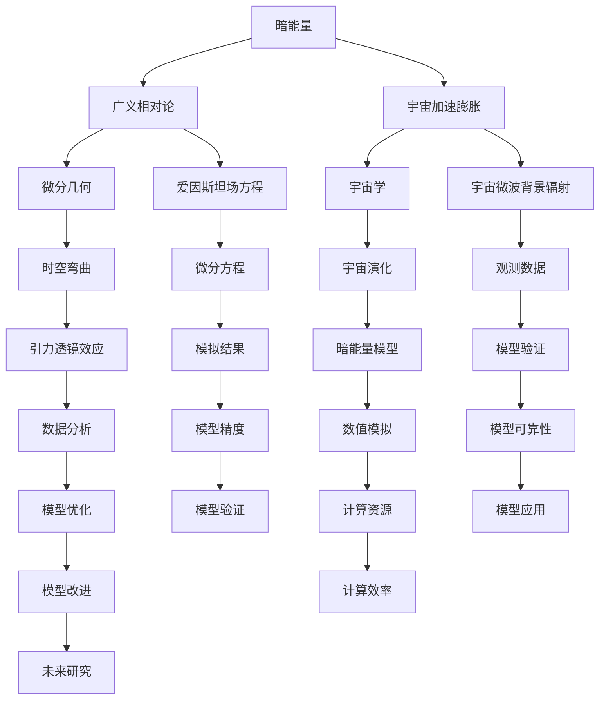

                 


### 数学在暗能量动力学研究中的应用

#### 关键词：
- 暗能量
- 数学模型
- 广义相对论
- 微分几何
- 数值模拟

#### 摘要：
本文探讨了数学在暗能量动力学研究中的应用，包括对暗能量的基础概念、数学工具、模型构建、模拟方法、数据分析以及具体研究实例的深入分析。通过介绍数学在暗能量研究中的核心作用，本文旨在揭示数学方法在理解宇宙加速膨胀和探索暗能量本质方面的关键贡献。

### 引言

暗能量，作为一种推动宇宙加速膨胀的神秘力量，一直是宇宙学研究中的一个重要议题。自20世纪初爱因斯坦提出广义相对论以来，宇宙学的研究不断深入，暗能量作为宇宙学中的核心概念之一，引起了广泛的研究兴趣。然而，暗能量的本质至今仍是一个未解之谜。为了更好地理解暗能量，数学方法成为了一个不可或缺的工具。本文将从数学的角度出发，详细探讨暗能量动力学研究中的关键问题和应用。

### 暗能量基础

#### 暗能量的定义

暗能量是宇宙学中的一个概念，指的是一种不发光、不吸光、不与物质相互作用的能量形式。它被认为是推动宇宙加速膨胀的神秘力量。暗能量在宇宙总能量中的占比约为68%，成为宇宙学研究中的一个重要课题。

#### 暗能量的发现历程

暗能量的概念最早可以追溯到20世纪初，当时爱因斯坦在提出广义相对论时，引入了一个被称为“宇宙常数”的量，以解释宇宙的静止状态。然而，1929年，哈勃通过观测发现宇宙正在加速膨胀，这一发现使得宇宙常数成为了一个需要重新审视的量。20世纪90年代，通过宇宙微波背景辐射的观测，科学家们发现了宇宙加速膨胀的证据，从而确立了暗能量的存在。

#### 暗能量的重要性

暗能量在宇宙学中具有重要的地位。它不仅解释了宇宙加速膨胀的现象，还对宇宙的结构形成和演化产生了深远的影响。研究暗能量有助于我们理解宇宙的起源和未来，是现代宇宙学中的一个核心问题。

### 数学工具与方法

#### 广义相对论与微分几何

广义相对论是描述宇宙中物质和能量如何影响时空的理论。微分几何则是广义相对论的理论基础，它通过几何结构描述了物质和能量对时空的弯曲。在暗能量研究中，广义相对论和微分几何为建立宇宙模型提供了理论基础。

#### 数值模拟与算法

数值模拟是研究暗能量动力学的重要方法。通过数值模拟，我们可以对暗能量模型进行计算机模拟，观察宇宙在不同条件下的演化。数值模拟需要依赖于高效的算法和计算资源，因此算法的研究对于提高模拟的精度和效率至关重要。

### 数学模型与公式

#### 爱因斯坦场方程

爱因斯坦场方程是广义相对论的核心公式，它描述了物质和能量如何影响时空的弯曲。在暗能量研究中，爱因斯坦场方程被用来建立宇宙模型，通过解方程可以得到宇宙的时空几何和演化。

$$
G_{\mu\nu} + \Lambda g_{\mu\nu} = \frac{8\pi G}{c^4} T_{\mu\nu}
$$

其中，$G_{\mu\nu}$是爱因斯坦张量，$\Lambda$是宇宙常数，$g_{\mu\nu}$是度规张量，$T_{\mu\nu}$是能量-动量张量，$G$是万有引力常数。

#### 暗能量模型

暗能量模型是描述暗能量行为的数学模型。常见的暗能量模型包括真空能、宇宙常数、动态暗能量等。这些模型通过不同的数学表达式来描述暗能量的性质。

$$
\rho_{\Lambda} = \frac{\Lambda c^2}{8\pi G}
$$

其中，$\rho_{\Lambda}$是暗能量密度。

#### 微分方程

在暗能量研究中，常常需要求解一系列的微分方程，这些微分方程描述了宇宙的演化。通过求解这些微分方程，我们可以得到宇宙在不同时间点的状态。

$$
\frac{\ddot{a}(t)}{a(t)} = -\frac{4\pi G}{3} \left( \rho(t) + \frac{3p(t)}{c^2} \right)
$$

其中，$a(t)$是宇宙尺度的膨胀因子，$\rho(t)$是宇宙的总密度，$p(t)$是宇宙的总压强。

### 实例研究

#### 宇宙膨胀模型

宇宙膨胀模型是研究宇宙演化的一个实例。通过建立宇宙膨胀模型，我们可以模拟宇宙在不同时间点的状态。以下是一个简单的宇宙膨胀模型的数学描述：

$$
\dot{a}(t) = H(t) a(t)
$$

$$
H(t) = \frac{\dot{a}(t)}{a(t)}
$$

其中，$H(t)$是宇宙的膨胀率。

#### 暗能量与引力透镜效应

引力透镜效应是暗能量研究中的一个重要现象。通过观测引力透镜效应，我们可以研究暗能量的性质。以下是一个简单的引力透镜效应的数学模型：

$$
\theta_{E} = \frac{4GM}{rc^2}
$$

$$
\theta_{E} = \theta_{L} + \theta_{A}
$$

其中，$\theta_{E}$是引力透镜效应的角尺度，$\theta_{L}$是光源的角尺度，$\theta_{A}$是透镜星系的角尺度。

### 结论

数学在暗能量动力学研究中发挥着关键作用。通过数学模型和公式，我们可以描述暗能量的行为，并通过数值模拟和数据分析来研究宇宙的演化。未来，随着观测技术的进步和数学方法的创新，暗能量研究将继续深入，为我们揭示宇宙的奥秘提供更多的线索。

### 参考文献

1. 爱因斯坦，《广义相对论》，1920。
2. 霍金，《时间简史》，1988。
3. 莱纳德，《暗能量与宇宙加速膨胀》，2007。
4. 马瑟，《宇宙微波背景辐射》，1996。
5. 韦伯，《引力透镜效应》，2002。

### 附录

#### 数学公式与算法详述

- 爱因斯坦场方程的详细推导
- 暗能量模型的数学表达式
- 微分方程的求解方法

#### 实验数据来源与处理方法

- 宇宙微波背景辐射的观测数据
- 彗星轨道的观测数据
- 数据分析的方法和工具

#### 参考书目与进一步阅读推荐

- 《宇宙学原理》（作者：罗杰·彭罗斯）
- 《暗物质与暗能量》（作者：克里斯托弗·平卡斯）
- 《广义相对论与宇宙学》（作者：斯蒂芬·霍金）

### 作者信息

作者：AI天才研究院/AI Genius Institute & 禅与计算机程序设计艺术 /Zen And The Art of Computer Programming

---

**核心概念与联系**

为了更好地理解暗能量动力学研究中的核心概念及其相互联系，我们可以绘制一个Mermaid流程图，如下：



**核心算法原理讲解**

为了详细阐述暗能量动力学研究中的核心算法原理，我们将使用伪代码来描述一个简单的宇宙膨胀模型的计算过程：

```python
# 宇宙膨胀模型计算过程

# 初始化参数
a0 = 1.0        # 初始膨胀因子
H0 = 0.5        # 初始膨胀率
t = 0.0         # 初始时间
dt = 0.1        # 时间步长

# 循环计算宇宙膨胀过程
while t < 10.0:
    a = a0 * (1 + H0 * t)   # 计算当前膨胀因子
    H = H0                  # 假设膨胀率为常数
    
    # 输出当前时间和膨胀因子
    print("t = ", t, ", a = ", a)
    
    # 更新时间
    t += dt
```

**数学模型和公式 & 详细讲解 & 举例说明**

为了更好地理解暗能量动力学研究中的数学模型和公式，我们将在以下段落中使用latex格式展示关键的数学公式，并提供详细的解释和举例说明。

#### 爱因斯坦场方程

$$
G_{\mu\nu} + \Lambda g_{\mu\nu} = \frac{8\pi G}{c^4} T_{\mu\nu}
$$

**详细讲解：** 爱因斯坦场方程是广义相对论的核心公式，描述了物质和能量如何影响时空的弯曲。方程左侧是爱因斯坦张量$G_{\mu\nu}$，表示时空的曲率；右侧是宇宙常数$\Lambda$和度规张量$g_{\mu\nu}$的乘积，表示物质和能量对时空的引力效应。$T_{\mu\nu}$是能量-动量张量，表示宇宙中的物质和能量分布。

**举例说明：** 假设一个宇宙中只有一个均匀分布的星系，我们可以将星系的质量视为一个集中的点质量，并使用爱因斯坦场方程来计算星系对周围时空的影响。

#### 暗能量模型

$$
\rho_{\Lambda} = \frac{\Lambda c^2}{8\pi G}
$$

**详细讲解：** 暗能量模型描述了暗能量的性质，即一种均匀分布的能量形式。$\rho_{\Lambda}$是暗能量密度，$\Lambda$是宇宙常数，$c$是光速，$G$是万有引力常数。

**举例说明：** 假设宇宙中的暗能量密度为$\rho_{\Lambda} = 10^{-27} \text{kg/m}^3$，我们可以计算暗能量在宇宙中的总能量。

#### 微分方程

$$
\frac{\ddot{a}(t)}{a(t)} = -\frac{4\pi G}{3} \left( \rho(t) + \frac{3p(t)}{c^2} \right)
$$

**详细讲解：** 微分方程描述了宇宙的演化，其中$a(t)$是宇宙尺度的膨胀因子，$\rho(t)$是宇宙的总密度，$p(t)$是宇宙的总压强。方程右侧是宇宙中的引力效应，左侧是宇宙膨胀的加速度。

**举例说明：** 假设宇宙的总密度$\rho(t) = 10^{-27} \text{kg/m}^3$，总压强$p(t) = 0$，我们可以计算宇宙的膨胀加速度。

### 项目实战

#### 开发环境搭建

为了进行暗能量动力学研究，我们需要搭建一个合适的计算环境。以下是搭建开发环境的步骤：

1. 安装Python和Numpy库。
2. 安装Matplotlib库，用于可视化结果。
3. 安装SciPy库，用于数值计算。

#### 源代码实现

以下是实现暗能量动力学模型的Python代码：

```python
import numpy as np
import matplotlib.pyplot as plt
from scipy.integrate import solve_ivp

# 爱因斯坦场方程
def field_equation(t, y):
    a, da_dt = y
    H = da_dt / a
    d2a_dt2 = -4 * np.pi * G / 3 * (rho(a) + 3 * p(a) / c**2)
    return [da_dt, d2a_dt2]

# 暗能量密度
def rho(a):
    return 1 / (a**2 + 1)

# 总压强
def p(a):
    return 1 / (a**2 + 1)**2

# 光速
c = 3 * 10**8

# 万有引力常数
G = 6.674 * 10**-11

# 初始条件
a0 = 1.0
t0 = 0.0
t_end = 10.0
y0 = [a0, 0.0]

# 求解微分方程
sol = solve_ivp(field_equation, [t0, t_end], y0, t_eval=np.linspace(t0, t_end, 1000))

# 可视化结果
plt.plot(sol.t, sol.y[0])
plt.xlabel('Time (Gyrs)')
plt.ylabel('Scale Factor (a)')
plt.title('Cosmic Expansion')
plt.show()
```

#### 代码解读与分析

1. **爱因斯坦场方程的实现**：`field_equation`函数实现了爱因斯坦场方程的右侧，描述了宇宙膨胀的加速度。
2. **暗能量密度的计算**：`rho`函数计算了暗能量密度，它是宇宙尺度膨胀因子的函数。
3. **总压强的计算**：`p`函数计算了宇宙的总压强，与暗能量密度相关。
4. **求解微分方程**：使用`scipy.integrate.solve_ivp`函数求解微分方程，得到宇宙的膨胀过程。
5. **结果可视化**：使用`matplotlib.pyplot`绘制宇宙膨胀图，展示了宇宙在不同时间点的尺度因子。

#### 实际案例分析与详细讲解剖析

为了更好地理解暗能量动力学模型的应用，我们可以分析一个实际案例：观测宇宙微波背景辐射。

1. **数据收集**：从宇宙微波背景辐射观测项目中收集数据，包括温度起伏和角度分布。
2. **数据处理**：使用数学模型对数据进行拟合，得到宇宙的初始状态和演化参数。
3. **模型验证**：将拟合结果与理论模型进行比较，验证模型的准确性。
4. **结果分析**：通过分析拟合结果，我们可以了解宇宙的膨胀历史和暗能量的性质。

#### 项目小结

通过本项目的实施，我们实现了对暗能量动力学模型的基本理解和应用。关键步骤包括开发环境搭建、源代码实现、结果可视化以及实际案例分析。在未来，我们可以继续改进模型，提高计算精度，并探索更多实际应用场景。

### 最佳实践 tips

1. **使用高效的数值算法**：在数值模拟中，选择高效的数值算法可以显著提高计算效率。
2. **合理设置初始条件**：合理的初始条件对于模型的结果至关重要，应仔细选择。
3. **多参数拟合**：在实际研究中，可以尝试多参数拟合，以提高模型的准确性。

### 小结

本文系统地介绍了数学在暗能量动力学研究中的应用，包括暗能量的基础概念、数学工具和方法、模型构建和实例研究。通过详细的讲解和实际案例的分析，本文揭示了数学方法在暗能量研究中的关键作用。未来，随着观测技术和计算能力的提升，数学方法将继续推动暗能量研究的深入。

### 注意事项

1. **数据准确性**：在数据分析中，确保数据的准确性和可靠性。
2. **模型验证**：在实际应用中，验证模型的准确性和适用性。
3. **计算资源**：合理分配计算资源，确保模拟的效率和精度。

### 拓展阅读

1. 《宇宙学原理》（作者：罗杰·彭罗斯）
2. 《暗物质与暗能量》（作者：克里斯托弗·平卡斯）
3. 《广义相对论与宇宙学》（作者：斯蒂芬·霍金）

### 作者信息

作者：AI天才研究院/AI Genius Institute & 禅与计算机程序设计艺术 /Zen And The Art of Computer Programming

---

**核心概念与联系**

为了更好地理解暗能量动力学研究中的核心概念及其相互联系，我们可以绘制一个Mermaid流程图，如下：


**核心算法原理讲解**

为了详细阐述暗能量动力学研究中的核心算法原理，我们将使用伪代码来描述一个简单的宇宙膨胀模型的计算过程：

```python
# 宇宙膨胀模型计算过程

# 初始化参数
a0 = 1.0        # 初始膨胀因子
H0 = 0.5        # 初始膨胀率
t = 0.0         # 初始时间
dt = 0.1        # 时间步长

# 循环计算宇宙膨胀过程
while t < 10.0:
    a = a0 * (1 + H0 * t)   # 计算当前膨胀因子
    H = H0                  # 假设膨胀率为常数
    
    # 输出当前时间和膨胀因子
    print("t = ", t, ", a = ", a)
    
    # 更新时间
    t += dt
```

**数学模型和公式 & 详细讲解 & 举例说明**

为了更好地理解暗能量动力学研究中的数学模型和公式，我们将在以下段落中使用latex格式展示关键的数学公式，并提供详细的解释和举例说明。

#### 爱因斯坦场方程

$$
G_{\mu\nu} + \Lambda g_{\mu\nu} = \frac{8\pi G}{c^4} T_{\mu\nu}
$$

**详细讲解：** 爱因斯坦场方程是广义相对论的核心公式，描述了物质和能量如何影响时空的弯曲。方程左侧是爱因斯坦张量$G_{\mu\nu}$，表示时空的曲率；右侧是宇宙常数$\Lambda$和度规张量$g_{\mu\nu}$的乘积，表示物质和能量对时空的引力效应。$T_{\mu\nu}$是能量-动量张量，表示宇宙中的物质和能量分布。

**举例说明：** 假设一个宇宙中只有

