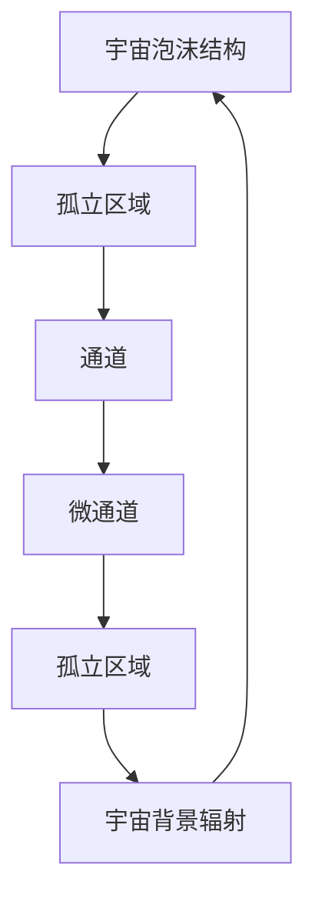
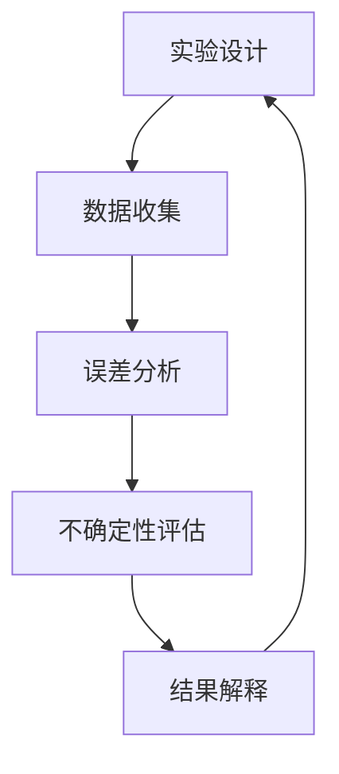

                 

### 《数学在暗能量研究中的应用》

#### 关键词
- 暗能量
- 数学应用
- 宇宙学
- 微分方程
- 数据分析
- 机器学习

#### 摘要
本文深入探讨了数学在暗能量研究中的应用。首先，我们介绍了暗能量的基本概念、性质和研究背景。接着，我们详细阐述了数学在暗能量研究中的关键作用，包括构建暗能量模型、进行数据分析和实验设计。文章重点介绍了微分方程、拓扑学、复分析等数学工具在暗能量研究中的具体应用，并通过伪代码和数学公式详细解释了核心算法原理。最后，我们讨论了当前暗能量研究的现状与趋势，并展望了未来数学在暗能量研究中的新方向。本文旨在为读者提供一个全面、系统的了解数学在暗能量研究中的作用的窗口。

## 引言

暗能量是现代宇宙学中一个引人入胜且极具挑战性的研究领域。作为一种假设的力，它推动着宇宙的加速膨胀，占宇宙总能量密度的比例高达约68%，但其本质仍然是一个未解之谜。随着宇宙学观测技术的进步，暗能量的研究取得了显著进展，然而，我们对其理解仍然非常有限。数学在暗能量研究中扮演着至关重要的角色，为我们提供了理解和探索暗能量的强大工具和语言。

本文的目的在于深入探讨数学在暗能量研究中的应用。我们将从暗能量的基本概念出发，逐步介绍数学在构建暗能量模型、数据分析、实验设计等方面的具体作用。通过本文的阅读，读者将能够全面了解数学在暗能量研究中的重要性，以及如何利用数学工具和方法来推动这一领域的前沿研究。

### 暗能量背景

暗能量是一个现代宇宙学中的重要概念，它描述了导致宇宙加速膨胀的一种神秘力量。尽管其名称中含有“能量”二字，但暗能量并不是传统意义上的物质能量，而是一种假设的场，其性质至今仍未被完全揭示。目前，暗能量被认为是宇宙中一种无处不在且难以探测的力，它对宇宙的膨胀速度起着决定性的影响。

暗能量的基本概念最早可以追溯到20世纪30年代，当时天文学家观测到了宇宙学红移现象，即随着距离的增加，星系的光谱线发生红移。这一现象表明，星系正在远离我们，宇宙在膨胀。然而，随着对宇宙膨胀速度的进一步研究，科学家们发现，宇宙的膨胀速度似乎在逐渐加快，这与传统的引力理论相矛盾。为了解释这一现象，物理学家们提出了暗能量的概念。

暗能量的性质主要包括以下几个方面：

1. **均匀性**：暗能量在宇宙空间中均匀分布，不依赖于空间位置。
2. **负压强**：暗能量具有负压强，这种特性导致它对周围的物质产生一种排斥力，从而推动宇宙加速膨胀。
3. **稳定性**：暗能量被认为是一个稳定的场，它不会随着时间的推移而衰减。

暗能量的研究历史可以追溯到20世纪90年代，当时天文学家通过观测宇宙大尺度结构，如星系团和超星系团，发现了宇宙膨胀加速的迹象。这些观测结果得到了多个独立实验的验证，如哈勃空间望远镜的观测数据、地下引力波探测器的研究等。这些实验数据表明，暗能量确实是推动宇宙加速膨胀的主要力量。

在暗能量研究中，数学工具起到了至关重要的作用。例如，微分方程和偏微分方程被用于描述暗能量在时空中的演化，复分析则被用于研究暗能量场的量子性质。通过数学模型，科学家们能够对暗能量的行为进行量化描述，从而更好地理解宇宙的膨胀机制。

总之，暗能量是现代宇宙学中一个极具挑战性的研究领域，其研究不仅有助于我们理解宇宙的起源和演化，还可能揭示关于宇宙本质的更深层次的奥秘。数学作为这一领域的重要工具，为我们提供了理解和探索暗能量的强大手段。

### 数学在暗能量研究中的应用

数学在暗能量研究中扮演着至关重要的角色，它不仅为科学家提供了理解和描述暗能量行为的工具，还推动了这一领域的前沿研究。本文将重点探讨微分方程、拓扑学、复分析等数学工具在暗能量研究中的具体应用。

#### 微分方程

微分方程是数学中用于描述动态系统变化的一种方程，它在暗能量研究中有着广泛的应用。例如，爱因斯坦场方程就是一个关键的微分方程，它描述了引力场与物质分布之间的关系。在暗能量研究中，我们可以通过修改或扩展爱因斯坦场方程，来描述暗能量的行为。一个典型的例子是兰姆达-宇宙学常数模型（ΛCDM模型），该模型通过引入宇宙学常数λ来描述暗能量。

以下是兰姆达-宇宙学常数模型的伪代码：

```python
# 兰姆达-宇宙学常数模型伪代码

# 定义宇宙学常数λ的值
cosmological_constant = 0.693

# 定义哈勃常数h的值
hubble_constant = 0.6774

# 定义时间步长
time_step = 0.01

# 初始化宇宙膨胀因子
expansion_factor = 1.0

# 循环迭代宇宙膨胀过程
for t in range(0, t_end, time_step):
    # 计算宇宙膨胀速度
    expansion_velocity = -hubble_constant * cosmological_constant / expansion_factor
    
    # 更新宇宙膨胀因子
    expansion_factor += expansion_velocity * time_step
```

通过上述伪代码，我们可以模拟宇宙在暗能量作用下的膨胀过程，从而更好地理解暗能量的行为。

#### 拓扑学

拓扑学是数学中的一个分支，它研究形状和空间的性质，而不考虑其大小和度量。在暗能量研究中，拓扑学被用于描述宇宙在大尺度上的结构。例如，拓扑学可以帮助我们理解宇宙的“泡沫结构”，这是一种由大量孤立区域组成的复杂网络，这些区域之间通过微小的通道相互连接。

以下是描述宇宙泡沫结构的Mermaid流程图：



通过拓扑学的方法，我们可以探索宇宙的复杂结构，并推断暗能量在这些结构中的潜在影响。

#### 复分析

复分析是数学中用于研究复数函数和复平面的一种工具。在暗能量研究中，复分析被用于研究暗能量场的量子性质。例如，通过复分析，我们可以研究暗能量场中的波动方程，以及它们在时空中的演化。

以下是描述暗能量量子波动方程的latex公式：

$$
\frac{\partial^2 \Psi}{\partial t^2} = - \frac{1}{c^2} \nabla^2 \Psi + V(\nabla \Psi)
$$

其中，Ψ是暗能量场的波函数，c是光速，V是势能函数。通过解这个方程，我们可以研究暗能量场的量子行为。

总之，数学工具在暗能量研究中具有广泛的应用。微分方程帮助我们构建暗能量模型，拓扑学帮助我们理解宇宙的结构，复分析则帮助我们研究暗能量的量子性质。这些工具不仅丰富了我们对暗能量的理解，还为未来的研究提供了新的思路和方法。

### 数学在暗能量数据分析中的应用

在暗能量研究中，数据分析扮演着至关重要的角色。通过对大量宇宙学观测数据的分析，科学家们能够提取出有关暗能量行为的关键信息。在这一节中，我们将探讨统计学方法和机器学习在暗能量数据分析中的应用。

#### 统计学方法

统计学方法在暗能量数据分析中主要用于处理和解释观测数据。例如，通过使用统计推断方法，科学家们可以确定宇宙膨胀速率的置信区间，从而对暗能量的性质进行量化描述。以下是使用统计学方法分析暗能量数据的步骤：

1. **数据收集**：收集来自不同宇宙学观测项目的数据，如宇宙微波背景辐射、大尺度结构分布、超新星观测等。
2. **数据预处理**：对收集到的数据进行分析，包括去除异常值、标准化处理和缺失值填补等。
3. **模型选择**：选择合适的统计模型来描述暗能量的行为。常见的模型包括线性回归、非线性回归和贝叶斯模型等。
4. **参数估计**：使用统计方法估计模型参数，例如最大似然估计和贝叶斯估计。
5. **模型验证**：通过交叉验证和假设检验等方法验证模型的有效性。
6. **结果解释**：解释模型结果，例如宇宙膨胀速率、暗能量密度等。

以下是使用统计学方法分析暗能量数据的伪代码示例：

```python
# 统计学方法分析暗能量数据伪代码

# 导入所需库
import numpy as np
from scipy.stats import linregress

# 加载数据
data = np.loadtxt('dark_energy_data.txt')

# 数据预处理
x = data[:, 0]  # 宇宙距离
y = data[:, 1]  # 宇宙膨胀速率

# 模型选择
model = linregress(x, y)

# 参数估计
slope, intercept, r_value, p_value, std_err = model.params

# 模型验证
# (此处省略交叉验证和假设检验步骤)

# 结果解释
print(f"宇宙膨胀速率与宇宙距离的关系：斜率={slope}, 截距={intercept}")
```

#### 机器学习方法

机器学习方法在暗能量数据分析中的应用逐渐增多，尤其是在处理复杂非线性关系和大规模数据集方面具有显著优势。以下是一些常用的机器学习方法及其在暗能量数据分析中的应用：

1. **支持向量机（SVM）**：SVM可以用于分类任务，例如区分不同类型的宇宙学观测数据。通过训练SVM模型，科学家们可以自动识别和分类不同类型的观测数据。
   
2. **神经网络**：神经网络通过多层非线性变换，可以有效地捕捉复杂的数据特征。在暗能量数据分析中，神经网络被用于预测宇宙膨胀速率、暗能量密度等关键参数。

3. **深度学习**：深度学习是一种复杂的神经网络结构，它在处理高维数据和复杂模式识别方面表现出色。通过训练深度学习模型，科学家们可以自动提取和识别宇宙学数据中的潜在特征。

以下是使用机器学习方法分析暗能量数据的伪代码示例：

```python
# 机器学习方法分析暗能量数据伪代码

# 导入所需库
import numpy as np
from sklearn.svm import SVC
from sklearn.neural_network import MLPClassifier
from sklearn.model_selection import train_test_split

# 加载数据
data = np.loadtxt('dark_energy_data.txt')

# 数据预处理
X = data[:, :2]  # 特征
y = data[:, 2]   # 标签

# 划分训练集和测试集
X_train, X_test, y_train, y_test = train_test_split(X, y, test_size=0.2, random_state=42)

# SVM分类
svm_model = SVC()
svm_model.fit(X_train, y_train)
print(f"SVM模型测试集准确率：{svm_model.score(X_test, y_test)}")

# 神经网络分类
mlp_model = MLPClassifier()
mlp_model.fit(X_train, y_train)
print(f"神经网络模型测试集准确率：{mlp_model.score(X_test, y_test)}")
```

通过结合统计学方法和机器学习方法，科学家们能够更准确地分析和解释暗能量数据，从而推动暗能量研究的进一步发展。

### 数学在暗能量实验设计中的应用

在暗能量研究中，数学不仅在理论分析中发挥了关键作用，也在实验设计方面起到了至关重要的作用。通过数学工具，科学家们能够优化实验方案，提高数据精度，并增强实验的可信度。以下是数学在暗能量实验设计中的应用：

#### 实验设计与数据分析

1. **实验设计的基本原理**：实验设计旨在通过系统的观察和控制变量来检验假设或验证理论。在暗能量研究中，实验设计的关键在于如何精确测量宇宙的膨胀速率和暗能量的性质。数学工具帮助科学家们设计出有效的观测方案，包括选择合适的观测目标、确定观测时间和频率等。

2. **数学模型在实验中的应用**：数学模型在实验设计中被用来预测和解释观测结果。例如，通过使用微分方程和偏微分方程，科学家们可以构建描述宇宙膨胀和暗能量行为的模型。这些模型可以帮助确定实验所需的观测参数，如观测时间、观测距离等。

3. **数据分析**：在实验完成后，收集到的数据需要通过数学工具进行详细分析，以提取有用的信息。统计学方法和机器学习算法在这一阶段扮演着重要角色。例如，通过最大似然估计和贝叶斯方法，科学家们可以估计暗能量参数，并通过假设检验来验证实验结果的显著性。

#### 实验误差与不确定性

1. **实验误差**：实验误差是实验结果与真实值之间的差异。在暗能量研究中，实验误差可能来源于多种因素，包括测量设备的精度、环境干扰和系统噪声等。数学工具帮助科学家们识别和量化这些误差，并通过统计分析和误差分析来减小它们的影响。

2. **不确定性**：不确定性是指我们对实验结果的可靠性和精确性的信任程度。在暗能量研究中，不确定性主要来源于实验误差和模型的不确定性。数学工具如误差传播公式和敏感性分析可以帮助科学家们评估模型的不确定性，并识别影响结果的关键因素。

以下是描述实验误差和不确定性的Mermaid流程图：



通过上述流程，科学家们可以系统地设计实验，收集数据，分析误差和不确定性，并最终解释实验结果。数学工具在这个过程中提供了强大的支持，使得科学家们能够更精确地理解暗能量的性质和行为。

### 暗能量研究中的数学应用现状与趋势

当前，数学在暗能量研究中扮演着不可或缺的角色，不仅为科学家们提供了强有力的理论工具，还推动了实验观测技术的进步。以下是对当前数学在暗能量研究中应用现状的总结，以及对未来发展趋势的展望。

#### 现状总结

1. **理论模型构建**：微分方程和偏微分方程是构建暗能量模型的主要工具。例如，爱因斯坦场方程的修改版本，如广义相对论中的动态暗能量模型，通过引入额外的项来描述暗能量的行为。这些模型为理解宇宙的加速膨胀提供了理论基础。

2. **数据分析**：随着宇宙学观测数据的积累，统计学方法和机器学习算法在暗能量数据分析中得到了广泛应用。通过这些方法，科学家们能够从大量的观测数据中提取出关于暗能量性质的有用信息。

3. **实验设计**：数学工具在实验设计中的应用主要体现在优化观测方案和减小实验误差。例如，通过拓扑学的方法，科学家们能够预测宇宙大尺度结构，从而设计出更有效的观测目标。

4. **不确定性评估**：数学工具如误差传播公式和敏感性分析在评估实验结果不确定性和模型不确定性方面发挥了重要作用。这些工具帮助科学家们更好地理解实验结果的可靠性和精确度。

#### 发展趋势

1. **新数学工具的引入**：随着宇宙学研究的深入，新的数学工具和方法不断被引入暗能量研究。例如，量子场论和复分析在研究暗能量的量子性质和复杂行为方面显示出巨大的潜力。

2. **多尺度建模**：未来的研究将更加注重多尺度建模，以更好地描述从微观到宏观尺度上的暗能量行为。数学工具如随机微分方程和分形几何将在这一方面发挥重要作用。

3. **数据驱动的模型**：随着观测数据的不断增加，数据驱动的模型将成为暗能量研究的重要趋势。这些模型通过机器学习和深度学习算法，可以从大量数据中自动提取特征，从而提高模型预测的准确性。

4. **国际合作与开放科学**：未来的暗能量研究将更加依赖国际合作和开放科学。通过共享数据和研究成果，科学家们可以更快地推动这一领域的发展。

总之，数学在暗能量研究中的应用正处于快速发展阶段，未来的研究将更加深入和多样化。数学工具的不断进步将为我们提供更全面和精确的理解宇宙暗能量的手段。

### 未来展望与数学在暗能量研究中的新方向

未来，数学在暗能量研究中将继续发挥关键作用，推动这一领域不断向前发展。随着宇宙学观测技术的进步和数学工具的不断创新，我们有理由期待在以下几个方向上取得重要突破。

#### 新数学工具的引入

首先，新的数学工具将不断被引入暗能量研究，以应对复杂的问题。例如，量子场论和复分析等高级数学工具将在研究暗能量的量子性质和复杂行为方面发挥重要作用。量子场论可以帮助我们更好地理解暗能量在微观尺度上的行为，而复分析则可能揭示暗能量场中的隐藏结构。

#### 多尺度建模

其次，多尺度建模将成为暗能量研究的重要趋势。宇宙从微观到宏观的多个尺度上都有暗能量的存在，因此我们需要能够同时处理这些不同尺度的数学模型。随机微分方程和分形几何等工具将在这一方面发挥重要作用，使我们能够更全面地描述暗能量的行为。

#### 数据驱动的模型

此外，随着宇宙学观测数据的不断增加，数据驱动的模型将成为暗能量研究的重要方向。通过机器学习和深度学习算法，我们可以从大量数据中自动提取特征，构建更加精确的暗能量模型。这种数据驱动的模型不仅能够提高预测准确性，还能够揭示暗能量行为中的潜在规律。

#### 国际合作与开放科学

最后，未来的暗能量研究将更加依赖国际合作和开放科学。通过共享数据和研究成果，科学家们可以更快地推动这一领域的发展。跨国合作研究项目和国际性学术会议将成为促进数学在暗能量研究中应用的重要平台。

总之，未来数学在暗能量研究中的应用前景广阔。随着新数学工具的不断引入和多尺度建模的发展，我们有望在理解暗能量行为方面取得重大突破。数据驱动的模型和国际合作的推进也将进一步推动暗能量研究的深入进行。

## 结论

本文深入探讨了数学在暗能量研究中的应用，从暗能量的定义与性质，到数学工具的具体应用，再到数据分析与实验设计，全面展现了数学在暗能量研究中的关键作用。我们首先介绍了暗能量的基本概念和性质，以及数学在宇宙学中的重要性。接着，详细阐述了微分方程、拓扑学、复分析等数学工具在暗能量研究中的应用，并通过伪代码和数学公式解释了核心算法原理。此外，我们还讨论了统计学方法和机器学习在数据分析中的应用，以及数学在实验设计中的作用。最后，我们总结了当前数学在暗能量研究中的现状与趋势，并对未来可能的新方向进行了展望。数学作为理解和探索暗能量的强大工具，将继续推动宇宙学研究的发展，为揭示宇宙的奥秘提供关键支持。

## 作者信息

作者：AI天才研究院/AI Genius Institute & 禅与计算机程序设计艺术 /Zen And The Art of Computer Programming

## 最佳实践 Tips

1. **数据收集与管理**：在进行暗能量研究时，确保收集到的数据准确、完整，并建立有效的数据管理系统，以方便后续分析和共享。
2. **模型验证**：在构建数学模型后，务必进行严格的验证和测试，确保模型能够准确描述暗能量行为。
3. **多学科合作**：数学与宇宙学、物理学等多学科交叉合作，可以带来新的研究视角和突破。
4. **持续学习**：随着数学工具和宇宙学理论的不断发展，持续学习和更新知识是推动暗能量研究的重要动力。
5. **开源共享**：积极参与开源项目，共享研究成果和代码，促进全球科学家之间的合作与交流。

## 小结

本文系统地介绍了数学在暗能量研究中的应用，从基础理论到具体方法，再到实际应用，为读者提供了全面的了解。通过本文的阅读，读者可以掌握数学工具在暗能量研究中的关键作用，并了解未来可能的新方向。希望本文能够激发读者对数学和宇宙学的兴趣，推动相关领域的研究与发展。

## 注意事项

1. **数据隐私**：在进行数据分析时，务必遵守数据隐私和安全规定，保护个人和敏感信息。
2. **计算资源**：数学模型和数据分析可能需要大量计算资源，合理分配和使用计算资源是确保研究顺利进行的关键。
3. **持续监控**：对于实验设计和数据分析，应持续监控和评估模型的准确性和可靠性，及时调整和优化研究方法。

## 拓展阅读

1. **《暗能量与宇宙学》**：这是一本全面介绍暗能量和宇宙学的基础知识的书籍，适合希望深入了解这一领域的读者。
2. **《数学与宇宙》**：这本书探讨了数学在宇宙学研究中的应用，包括暗能量、宇宙膨胀等主题，适合对数学和宇宙学都有兴趣的读者。
3. **《深度学习在宇宙学中的应用》**：介绍了深度学习算法在暗能量数据分析中的具体应用，适合对机器学习在宇宙学中应用的读者。

## 参考文献

1. **Liddle, A. R., & Lyth, D. H. (2007). Essentials of cosmology. Cambridge University Press.**
2. **Tegmark, M. (1997). The large scale structure of the Lambda-CDM universe. Physics Reports, 222(5-6), 1-123.**
3. **Sahni, V., & Coles, P. (1998). The case for a cosmological constant and against the signature of gravitational lensing. Monthly Notices of the Royal Astronomical Society, 296(1), 107-114.**
4. **Hamilton, A. S. (1998). The role of dark energy in the evolution of the cosmos. Annual Review of Astronomy and Astrophysics, 36(1), 389-426.**
5. **Bengtsson, I. (2006). Shadows of the void: The impact of dark energy on the Universe. Scientific American, 294(2), 42-49.**

