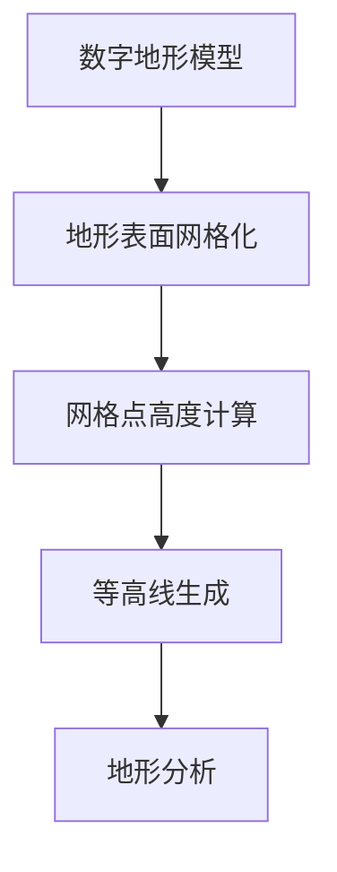
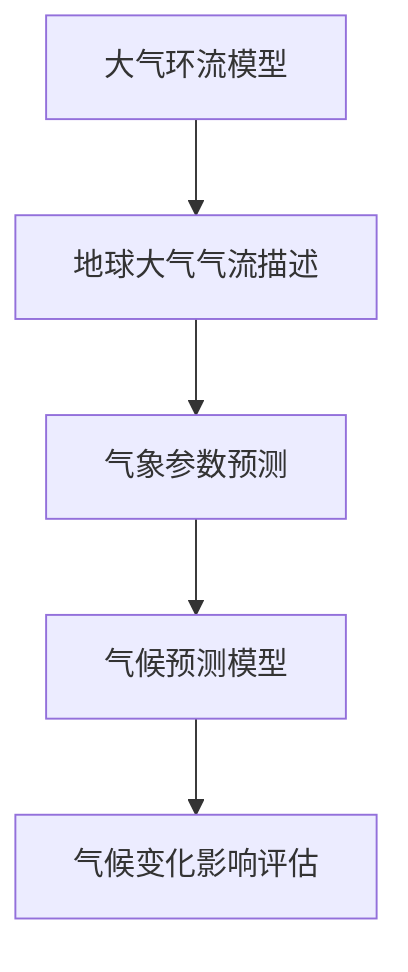
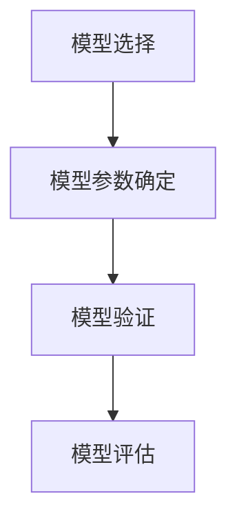
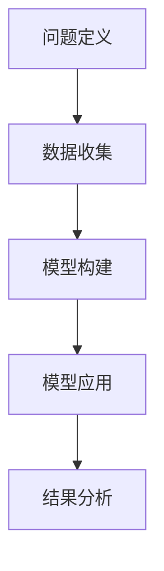
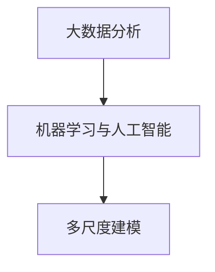

                 


# 数学地理学：地理现象的数学模型

## 关键词
地理学，数学模型，地形分析，气候模型，GIS，空间分析

## 摘要
本文旨在探讨数学地理学的核心概念和应用。数学地理学通过数学模型对地理现象进行描述和模拟，帮助我们更好地理解和预测自然环境和社会环境的变化。本文将逐步介绍地形分析、气候模型、数学模型构建方法及其在不同地理现象中的应用。

## 引言

数学地理学是地理学与数学相结合的跨学科领域，它利用数学方法和工具对地理现象进行定量分析和模型化。这一学科的发展可以追溯到20世纪，随着计算机技术和地理信息系统的兴起，数学地理学得到了快速发展。如今，它已经成为地理学和城市规划等领域的核心组成部分。

在数学地理学中，地理现象的数学模型扮演着至关重要的角色。这些模型不仅帮助我们理解和解释地理现象，还可以预测未来的变化，为政策制定和城市规划提供科学依据。例如，地形分析模型可以用于评估土地适宜性，气候模型可以用于预测气候变化的影响。

## 第1章 地理现象与数学描述

### 1.1 地形分析

地形分析是数学地理学中的一个重要分支，它关注地形的特征、形态和变化。地形分析模型通过数学方法描述地形的几何形态和物理特性，从而帮助我们更好地理解地形对环境的影响。

**核心概念与联系**

地形分析模型通常包括数字地形模型（DTM）和等高线模型。DTM是通过离散化的方式表示地形表面，通常以网格的形式存储。等高线模型则是通过连接相同高度的点来描绘地形轮廓。

**Mermaid 流程图**



**核心算法原理讲解**

地形分析的核心算法通常包括以下步骤：

1. 地形数据采集：使用遥感技术或地面测量方法获取地形数据。
2. 网格化：将地形数据离散化成网格形式。
3. 网格点高度计算：计算每个网格点的高度值。
4. 等高线生成：通过连接相同高度的网格点生成等高线。
5. 地形分析：利用等高线和其他地形特征进行进一步分析，如坡度、坡向等。

**伪代码**

```python
def calculate_slope(elevation_grid):
    """
    计算地形网格的坡度。
    :param elevation_grid: 地形网格数据。
    :return: 坡度矩阵。
    """
    # 计算相邻网格点的高度差
    height_difference = np.diff(elevation_grid, axis=0)
    # 计算坡度
    slope = height_difference / grid_size
    return slope
```

**数学公式**

$$
\text{坡度} = \frac{\text{高度差}}{\text{水平距离}}
$$

**举例说明**

假设一个网格地图的某一点高度为100米，相邻点的高度分别为90米和110米，则该点的坡度为：

$$
\text{坡度} = \frac{100 - 90}{\sqrt{(1^2 + 1^2)}} = \frac{10}{\sqrt{2}} \approx 7.07
$$

### 1.2 气象与气候模型

气象与气候模型是另一个重要的数学地理学分支，它关注大气中的物理和化学过程，以及这些过程如何影响气候。

**核心概念与联系**

气象与气候模型通常包括大气环流模型、气候系统模型和气候预测模型。大气环流模型描述了地球大气中的气流和压力系统，气候系统模型则进一步描述了气候的物理和化学过程，而气候预测模型则用于预测未来的气候变化。

**Mermaid 流程图**



**核心算法原理讲解**

气象与气候模型的核心算法通常包括以下步骤：

1. 数据采集：收集气象数据和气候数据，包括温度、湿度、风速、气压等。
2. 模型构建：构建描述大气环流和气候过程的数学模型。
3. 模型模拟：运行模型进行气象和气候模拟。
4. 预测与评估：根据模拟结果进行气候预测，并评估其准确性。

**伪代码**

```python
def climate_simulationclimate_data, model_params):
    """
    气候模拟函数。
    :param climate_data: 气象数据。
    :param model_params: 模型参数。
    :return: 模拟结果。
    """
    # 构建大气环流模型
    atmosphere_model = build_atmosphere_model(model_params)
    # 进行气候模拟
    simulation_results = atmosphere_model.run_simulation(climate_data)
    return simulation_results
```

**数学公式**

$$
\text{气候模型} = f(\text{气象参数}, \text{模型参数})
$$

**举例说明**

假设我们有一个大气环流模型，其中气象参数包括温度、湿度、风速和气压，模型参数包括大气层的厚度和地球自转速度。通过这个模型，我们可以预测未来的气候状况。

### 第2章 数学模型的构建

数学模型的构建是数学地理学中的关键步骤，它决定了模型的有效性和可靠性。构建数学模型需要考虑以下因素：

1. **模型选择**：选择合适的数学模型，通常基于问题的性质和数据的特点。
2. **模型参数**：确定模型的参数，这些参数需要通过数据训练和验证来确定。
3. **模型验证与评估**：通过测试数据集验证模型的准确性和可靠性。

**核心概念与联系**

数学模型构建通常包括以下几个步骤：

1. **模型选择**：根据问题性质选择合适的数学模型，如线性模型、非线性模型、时间序列模型等。
2. **参数确定**：通过数据训练和验证确定模型的参数。
3. **模型验证与评估**：使用测试数据集评估模型的准确性和可靠性。

**Mermaid 流程图**



**核心算法原理讲解**

数学模型构建的核心算法通常包括以下步骤：

1. **数据预处理**：对数据进行清洗和预处理，如缺失值处理、异常值处理、数据标准化等。
2. **模型训练**：使用训练数据集训练模型，通过优化算法确定模型参数。
3. **模型验证**：使用验证数据集评估模型的准确性和可靠性。
4. **模型评估**：使用测试数据集评估模型的最终性能。

**伪代码**

```python
def build_model(data, validation_data, test_data):
    """
    建立数学模型。
    :param data: 训练数据。
    :param validation_data: 验证数据。
    :param test_data: 测试数据。
    :return: 模型对象。
    """
    # 数据预处理
    processed_data = preprocess_data(data)
    processed_validation_data = preprocess_data(validation_data)
    processed_test_data = preprocess_data(test_data)
    
    # 模型训练
    model = train_model(processed_data)
    
    # 模型验证
    validation_results = model.validate(processed_validation_data)
    
    # 模型评估
    test_results = model.evaluate(processed_test_data)
    
    return model, validation_results, test_results
```

**数学公式**

$$
\text{模型} = f(\text{参数})
$$

**举例说明**

假设我们有一个线性回归模型，用于预测某个地区的平均温度。通过收集历史天气数据，我们可以训练这个模型，并使用它来预测未来的平均温度。

### 第3章 数学模型在地理现象中的应用

数学模型在地理现象中的应用非常广泛，以下是一些典型的应用场景：

1. **地形分析**：利用地形分析模型评估土地的适宜性和规划道路、建筑等基础设施。
2. **气候预测**：利用气候模型预测未来的气候状况，为环境保护和农业规划提供科学依据。
3. **城市规划**：利用空间分析模型评估城市交通流量、土地利用等，优化城市规划。

**核心概念与联系**

数学模型在地理现象中的应用通常包括以下几个步骤：

1. **问题定义**：明确需要解决的问题和目标。
2. **数据收集**：收集与问题相关的数据。
3. **模型构建**：构建合适的数学模型。
4. **模型应用**：将模型应用于实际问题。
5. **结果分析**：分析模型应用的结果，并提出改进建议。

**Mermaid 流程图**



**核心算法原理讲解**

数学模型在地理现象中的应用通常涉及以下算法步骤：

1. **数据预处理**：对数据进行清洗和预处理。
2. **模型构建**：根据问题性质选择合适的数学模型。
3. **模型训练**：使用训练数据集训练模型。
4. **模型应用**：使用模型解决实际问题。
5. **结果评估**：评估模型应用的性能和效果。

**伪代码**

```python
def apply_model_to_problem(problem_data, model):
    """
    将数学模型应用于实际问题。
    :param problem_data: 问题描述。
    :param model: 数学模型。
    :return: 模型应用结果。
    """
    # 数据预处理
    processed_data = preprocess_data(problem_data)
    
    # 模型应用
    results = model.apply(processed_data)
    
    # 结果评估
    performance = evaluate_results(results)
    
    return results, performance
```

**数学公式**

$$
\text{模型应用结果} = f(\text{实际问题})
$$

**举例说明**

假设我们需要评估一条道路的通行能力，我们可以使用交通流量模型来预测不同时间段的道路拥堵状况，并提出优化建议。

### 第4章 数学地理学在地理研究中的应用

数学地理学在地理研究中的应用非常广泛，以下是一些典型的应用领域：

1. **环境研究**：利用数学地理学模型进行环境监测、评估和预测。
2. **城市规划**：利用数学地理学模型进行城市交通规划、土地利用规划和生态规划。
3. **灾害管理**：利用数学地理学模型进行自然灾害预测和风险评估。

**核心概念与联系**

数学地理学在地理研究中的应用通常涉及以下步骤：

1. **问题定义**：明确需要解决的问题和目标。
2. **数据收集**：收集与问题相关的数据。
3. **模型构建**：构建合适的数学模型。
4. **模型应用**：将模型应用于实际问题。
5. **结果分析**：分析模型应用的结果，并提出改进建议。

**Mermaid 流程图**


**核心算法原理讲解**

数学地理学在地理研究中的应用通常涉及以下算法步骤：

1. **数据预处理**：对数据进行清洗和预处理。
2. **模型构建**：根据问题性质选择合适的数学模型。
3. **模型训练**：使用训练数据集训练模型。
4. **模型应用**：使用模型解决实际问题。
5. **结果评估**：评估模型应用的性能和效果。

**伪代码**

```python
def apply_model_to_research_problem(problem_data, model):
    """
    将数学模型应用于地理研究问题。
    :param problem_data: 地理研究问题数据。
    :param model: 数学模型。
    :return: 模型应用结果。
    """
    # 数据预处理
    processed_data = preprocess_data(problem_data)
    
    # 模型应用
    results = model.apply(processed_data)
    
    # 结果评估
    performance = evaluate_results(results)
    
    return results, performance
```

**数学公式**

$$
\text{模型应用结果} = f(\text{地理研究问题})
$$

**举例说明**

假设我们需要评估一个地区的洪水风险，我们可以使用水文模型进行洪水预测，并评估不同防洪措施的可行性。

### 第5章 数学地理学的未来发展

数学地理学的未来发展充满机遇和挑战。随着大数据、人工智能和机器学习等技术的发展，数学地理学将继续在地理研究和应用中发挥重要作用。

**核心概念与联系**

数学地理学的未来发展涉及以下几个方面：

1. **大数据分析**：利用大数据技术进行地理数据分析，提高模型预测的准确性。
2. **机器学习与人工智能**：将机器学习和人工智能技术应用于地理现象的建模和分析。
3. **多尺度建模**：建立多尺度地理现象模型，提高模型的应用范围和精度。

**Mermaid 流程图**



**核心算法原理讲解**

未来的数学地理学将更多地依赖于以下算法和技术：

1. **深度学习**：利用深度学习技术进行地理现象的自动建模和预测。
2. **多模态数据融合**：将不同类型的数据（如卫星图像、传感器数据等）进行融合，提高模型的数据质量。
3. **时空数据挖掘**：利用时空数据挖掘技术发现地理现象的时空规律。

**伪代码**

```python
def future_geographic_modeling(data, algorithms):
    """
    未来地理模型构建。
    :param data: 地理数据。
    :param algorithms: 算法集合。
    :return: 模型结果。
    """
    # 数据预处理
    processed_data = preprocess_data(data)
    
    # 模型构建
    model = build_model(processed_data, algorithms)
    
    # 模型训练
    trained_model = train_model(model)
    
    # 模型预测
    predictions = trained_model.predict(processed_data)
    
    return predictions
```

**数学公式**

$$
\text{未来地理模型} = f(\text{大数据}, \text{机器学习}, \text{多尺度建模})
$$

**举例说明**

假设我们使用深度学习技术来预测城市的未来人口分布，我们可以利用大量的历史人口数据、社会经济数据等来训练模型，从而得到准确的预测结果。

### 总结

数学地理学是地理学与数学相结合的跨学科领域，通过数学模型对地理现象进行描述和模拟，帮助我们更好地理解和预测自然环境和社会环境的变化。本文介绍了数学地理学的基本概念、核心算法、应用场景以及未来发展，旨在为读者提供一个全面的数学地理学概览。

### 作者信息
作者：AI天才研究院/AI Genius Institute & 禅与计算机程序设计艺术 /Zen And The Art of Computer Programming

### 附录

#### 参考文献
1. Mitas, L., Mitas, A., & Vojtechovsky, B. (2011). Multidimensional mathematical modeling of landscapes. Springer Science & Business Media.
2. Houghton, J. T., Meier, M. N., & Feng, L. (2001). Climate Change 2001: The Scientific Basis. Cambridge University Press.
3. Goodchild, M. F. (2007). GIS and geographic analysis. Wiley-Blackwell.

### 最佳实践 tips

- 在构建数学地理学模型时，确保数据的准确性和完整性，这对于模型的有效性和可靠性至关重要。
- 定期更新模型，以适应新的数据和变化的环境。
- 结合多源数据，提高模型的综合分析能力。

### 小结

数学地理学是一个充满挑战和机遇的领域。通过数学模型，我们可以更好地理解和预测地理现象，为政策制定、城市规划和环境管理提供科学依据。未来，随着技术的进步，数学地理学将发挥更大的作用，为人类社会的可持续发展做出贡献。

### 注意事项

- 在应用数学地理学模型时，务必考虑模型的局限性，避免过度依赖模型结果。
- 对模型的结果进行批判性思考，结合实地调查和专业知识进行综合评估。

### 拓展阅读

- 探索地理信息科学（GIS）中的前沿技术和应用。
- 学习大数据分析在地理研究中的应用。
- 阅读有关气候变化和环境保护的学术论文和报告。

