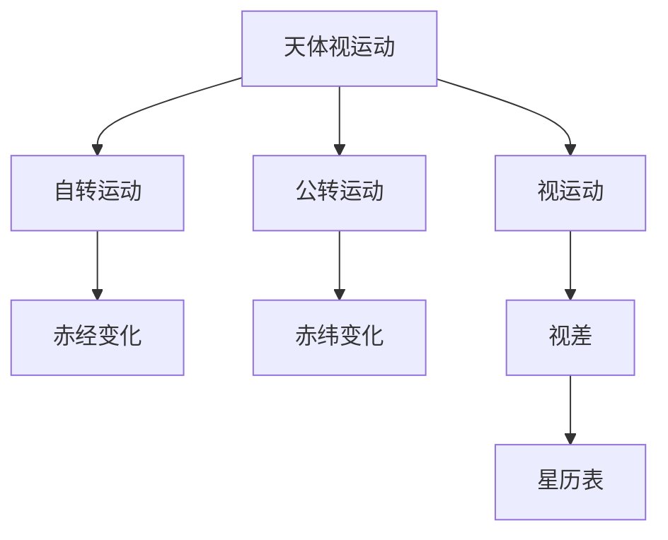
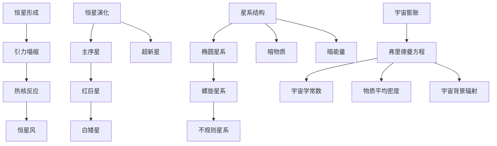
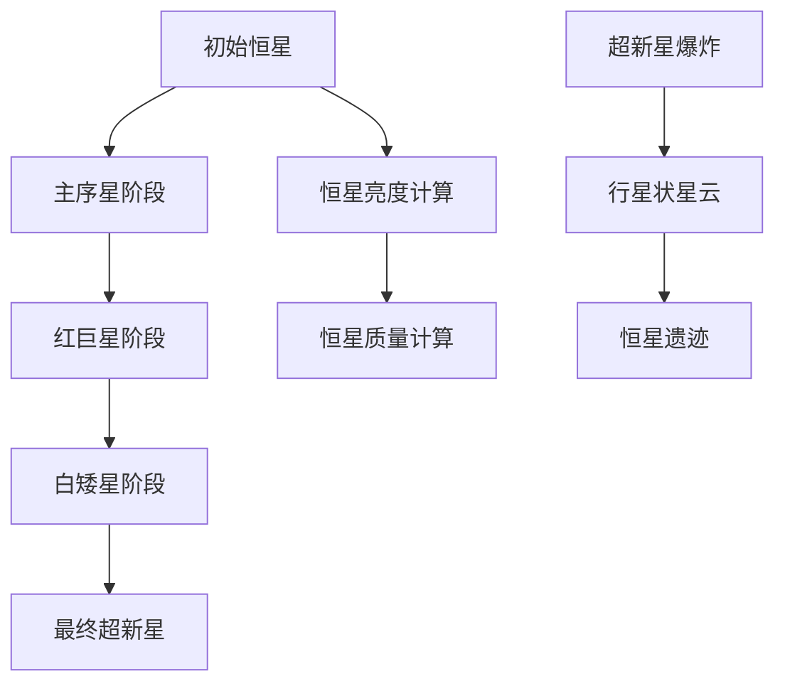

                 

### 文章标题

《数学天文学：宇宙规律的数学描述》

> 关键词：数学天文学、宇宙规律、数学模型、天体运动、天体物理学、算法原理

> 摘要：本文旨在探讨数学天文学的核心概念、基本原理以及其在宇宙规律描述中的应用。通过详细的算法原理讲解、数学公式应用实例和实际项目案例分析，本文展示了数学天文学在理解和研究宇宙中的重要作用，并展望了其未来的发展方向。

在进入正文的详细讨论之前，让我们先设定一个基本的框架。数学天文学是研究宇宙中物理现象和规律的科学，它将数学的严谨性与天文学的观测数据相结合，为我们提供了理解和描述宇宙规律的强大工具。本文将逐步探讨数学天文学的核心概念，基本原理，天体运动的数学描述，以及其在天体物理学中的重要应用。同时，我们还将探讨数学天文学的最新进展、面临的挑战及其跨学科交流情况。最后，我们将通过实际项目案例来展示数学天文学的应用场景，并对其未来发展方向进行展望。

正文将分为以下八个章节：

## 第1章 引言与核心概念

### 1.1 引言

数学天文学作为一门交叉学科，融合了数学和天文学的精华，旨在通过数学语言来描述和解释天体物理现象。它的起源可以追溯到古希腊时期，当时数学家们开始尝试使用几何和算术来解释天体的运动。在随后的几个世纪中，随着观测技术和数学工具的不断发展，数学天文学逐渐成为了一门独立的科学领域。

### 1.2 数学天文学的定义与历史背景

数学天文学的定义包括使用数学方法来研究天体的位置、运动和相互作用。其历史背景可以追溯到古代文明，例如巴比伦和埃及，它们记录了天体的运动，并试图预测天文事件。然而，现代数学天文学的奠基人包括约翰内斯·开普勒、艾萨克·牛顿和威廉·赫歇耳等，他们的工作奠定了现代天文学和物理学的基础。

### 1.3 宇宙规律的数学描述的重要性

宇宙规律的数学描述的重要性在于它提供了一种普适且精确的工具，使我们能够理解和预测宇宙中的各种现象。从行星运动到恒星形成，再到宇宙膨胀，数学天文学为我们提供了一套严谨的方法来研究宇宙的本质和演化。

## 第2章 数学天文学的基本原理

### 2.1 数学天文学的核心概念

数学天文学的核心概念包括视角运动学、引力和运动定律以及天体物理学基础。这些概念构成了数学天文学的框架，使我们能够使用数学语言来描述宇宙中的物理现象。

### 2.1.1 视角运动学

视角运动学研究的是天体在天空中的位置变化。通过研究视角运动学，我们可以了解天体的视运动和视位置，这些信息对于天文学观测和数据解释至关重要。

### 2.1.2 引力和运动定律

引力和运动定律描述了天体之间的相互作用和运动规律。艾萨克·牛顿的万有引力定律和开普勒定律是数学天文学的基础，它们提供了描述天体运动的有效工具。

### 2.1.3 天体物理学基础

天体物理学基础包括恒星形成、恒星演化、星系结构和宇宙膨胀等概念。这些基础概念为我们理解宇宙的起源和演化提供了关键线索。

## 第3章 数学描述中的天体运动

### 3.1 天体运动的数学模型

天体运动的数学模型包括开普勒定律、牛顿引力方程和牛顿-拉普拉斯定理等。这些模型为我们提供了描述天体运动和相互作用的方法，使我们能够预测天体的未来位置和运动轨迹。

### 3.1.1 开普勒定律

开普勒定律描述了行星围绕恒星的运动规律。这些定律不仅适用于行星系统，也适用于其他天体系统，如卫星围绕行星的运动。

### 3.1.2 牛顿引力方程

牛顿引力方程描述了两个质点之间的引力相互作用。通过这个方程，我们可以计算天体之间的引力，并预测它们的运动。

### 3.1.3 牛顿-拉普拉斯定理

牛顿-拉普拉斯定理提供了一种从观测数据中推断天体运动的方法。它利用牛顿引力方程和观测数据，计算出天体的轨道和位置。

## 第4章 天体物理学中的数学公式与应用

### 4.1 黑洞与奇点

黑洞和奇点是天体物理学中的两个重要概念。黑洞是由物质极度压缩形成的极端天体，而奇点则是引力场无限强的地方。通过数学公式，我们可以描述黑洞和奇点的性质，并研究它们对宇宙的影响。

### 4.1.1 黑洞的定义与数学描述

黑洞的定义与数学描述包括质量、半径和事件视界等概念。通过这些数学描述，我们可以理解黑洞的结构和特性。

### 4.1.2 奇点的数学表述

奇点的数学表述涉及广义相对论和量子力学。通过这些表述，我们可以探讨奇点的物理性质和可能的影响。

### 4.2 宇宙膨胀与暗物质

宇宙膨胀和暗物质是现代宇宙学中的两个关键问题。宇宙膨胀描述了宇宙随时间的扩张，而暗物质是宇宙中一种未观测到的物质。通过数学模型，我们可以研究宇宙膨胀和暗物质的性质和影响。

### 4.2.1 宇宙膨胀的数学模型

宇宙膨胀的数学模型包括弗里德曼方程和勒梅特方程等。这些模型描述了宇宙的膨胀速度和形态，帮助我们理解宇宙的演化。

### 4.2.2 暗物质的数学描述

暗物质的数学描述涉及引力相互作用和宇宙背景辐射。通过这些描述，我们可以探索暗物质的性质和作用。

## 第5章 数学天文学的进展与挑战

### 5.1 数学天文学的最新进展

数学天文学的最新进展包括量子引力理论和宇宙学的数学模型。量子引力理论试图将量子力学与广义相对论统一起来，而宇宙学的数学模型则帮助我们理解宇宙的起源和演化。

### 5.2 面临的挑战与未来趋势

数学天文学面临的挑战包括处理大量观测数据和开发更精确的数学模型。未来趋势则包括量子计算和人工智能在天文学中的应用，这些新技术有望推动数学天文学的进一步发展。

## 第6章 数学天文学的应用领域

### 6.1 天文观测与数据分析

天文观测与数据分析是数学天文学的直接应用领域。通过先进的观测设备和数据处理方法，我们可以获得更多关于宇宙的信息，并使用数学模型来解释这些观测数据。

### 6.2 太阳能与天文预报

太阳能与天文预报是数学天文学的另一个应用领域。通过对太阳活动的数学预测，我们可以更好地利用太阳能资源，并预测天文事件，如太阳风暴和日冕物质抛射。

### 6.2.1 太阳活动的数学预测

太阳活动的数学预测包括太阳黑子周期和太阳风速度等。通过这些预测，我们可以更好地理解太阳对地球环境的影响。

### 6.2.2 天文预报的应用

天文预报的应用包括天气预报、航天器轨迹规划和地球观测卫星的管理。通过精确的天文预报，我们可以更好地保护地球和利用空间资源。

## 第7章 数学天文学的跨学科交流

### 7.1 与物理学的关系

数学天文学与物理学有着密切的关系。通过物理学的原理和方法，我们可以更好地理解宇宙中的现象，并将这些原理应用到数学天文学中。

### 7.1.1 数学与物理学的交叉点

数学与物理学的交叉点包括广义相对论和量子力学等。这些交叉点为我们提供了理解和描述宇宙的新工具。

### 7.1.2 量子力学与天文学的互动

量子力学与天文学的互动包括量子态的测量和天体物理学中的量子现象。通过这些互动，我们可以探索宇宙的微观和宏观结构。

### 7.2 与计算机科学的结合

数学天文学与计算机科学的结合包括大数据分析和人工智能应用。这些结合为我们提供了新的方法和工具，以更有效地处理和分析天文数据。

### 7.2.1 计算机技术在数学天文学中的应用

计算机技术在数学天文学中的应用包括高性能计算和机器学习算法。这些技术使我们能够更快速地处理大量数据，并从中提取有用信息。

### 7.2.2 大数据分析与宇宙探索

大数据分析与宇宙探索的结合包括天文图像处理和宇宙学模拟。通过大数据分析，我们可以更深入地探索宇宙的奥秘。

## 第8章 数学天文学的实践与未来

### 8.1 数学天文学的实践案例

数学天文学的实践案例包括行星探测任务和天文图像处理。通过这些案例，我们可以展示数学天文学在实际应用中的效果和重要性。

### 8.1.1 案例一：行星探测任务

案例一讨论了数学天文学在行星探测任务中的应用，包括轨道设计和数据分析。

### 8.1.2 案例二：天文图像处理

案例二探讨了数学天文学在天文图像处理中的应用，包括图像去噪和特征提取。

### 8.2 数学天文学的未来展望

数学天文学的未来展望包括量子计算和人工智能的发展。这些新技术有望带来新的突破，推动数学天文学的进一步发展。

在接下来的章节中，我们将深入探讨每个部分的内容，使用伪代码、LaTeX数学公式和实际项目案例分析来详细解释数学天文学的各个方面。让我们一步一步地思考，逐步深入理解宇宙的数学规律。

## 第1章 引言与核心概念

### 1.1 引言

数学天文学作为一门交叉学科，结合了数学和天文学的理论与实践，致力于通过数学语言来描述和解释宇宙中的物理现象。它的起源可以追溯到古希腊时期，当时数学家们开始使用几何和算术来研究天体的运动，例如欧几里得和托勒密的工作为后来的天文学奠定了基础。然而，现代数学天文学的真正奠基人包括约翰内斯·开普勒、艾萨克·牛顿和威廉·赫歇耳等科学家。开普勒通过观察行星运动，提出了描述行星轨道的开普勒定律；牛顿则通过万有引力定律，为天体运动提供了更为精确的数学描述；赫歇耳则通过望远镜观测，发现了大量恒星和行星，丰富了我们对宇宙的认识。

随着观测技术和计算能力的提升，数学天文学逐渐发展成为一个独立的科学领域，它不仅涵盖了天体运动和天体物理学，还涉及宇宙学、黑洞理论、量子引力等前沿科学问题。数学天文学的核心目标是通过数学模型和算法来理解和预测宇宙中各种复杂现象，为我们揭示宇宙的本质和演化过程。

### 1.2 数学天文学的定义与历史背景

数学天文学是一门研究宇宙中物理现象和规律的科学，它利用数学工具来描述和分析天体的位置、运动、形态和相互作用。数学天文学的领域非常广泛，包括行星运动学、恒星物理学、星系动力学、宇宙学以及天体物理学中的各种复杂问题。

在历史背景方面，数学天文学的起源可以追溯到古埃及和巴比伦时期，当时的观测者们记录了天体的运动，并试图预测天文事件，例如日食和月食。然而，现代数学天文学的发展始于古希腊时期，当时数学家们开始系统地研究天体的运动规律，例如欧几里得在《几何原本》中描述了行星轨道的基本性质。在随后几个世纪中，阿拉伯天文学家和欧洲的天文学家如阿方索·帕拉塞尔苏斯和尼古拉·哥白尼等，对天文学的贡献进一步推动了这一领域的发展。

约翰内斯·开普勒是数学天文学的重要奠基人之一，他通过仔细分析天文观测数据，提出了著名的开普勒定律，这些定律为行星运动提供了定量描述。艾萨克·牛顿则在此基础上，提出了万有引力定律，该定律描述了天体之间的引力相互作用，为后来的天体力学和天体物理学奠定了基础。威廉·赫歇耳则是通过望远镜观测，发现了大量恒星和行星，极大地扩展了我们对宇宙的认识。

20世纪以来，数学天文学的发展进入了新的阶段，随着观测技术的进步和计算机科学的崛起，我们能够处理和分析更大规模的天文数据，从而揭示了宇宙的更多奥秘。爱因斯坦的广义相对论为引力提供了新的数学描述，而量子力学的发展则为我们理解微观尺度的物理现象提供了新的视角。现代数学天文学不仅关注宏观宇宙的结构和演化，还涉及到宇宙的起源、宇宙背景辐射和宇宙膨胀等深层次问题。

### 1.3 宇宙规律的数学描述的重要性

宇宙规律的数学描述在科学研究中扮演着至关重要的角色。首先，数学作为一种精确和普适的工具，能够将宇宙中的复杂现象转化为可操作的模型和算法。通过数学描述，我们可以将天体的位置、速度、相互作用等物理量以定量方式表达，从而更准确地理解和预测天体的行为。

其次，数学描述有助于我们发现宇宙中的规律性和模式。例如，开普勒定律揭示了行星轨道的规律性，牛顿引力方程则描述了天体间的引力相互作用。这些规律不仅适用于太阳系内的天体，还可以推广到更广阔的宇宙尺度，帮助我们理解星系、星团和宇宙的大尺度结构。

此外，数学描述为科学实验和观测提供了理论基础。例如，通过数学模型，我们可以设计天文观测设备，如望远镜和探测器，以更有效地收集数据。同样，通过数学方法，我们可以处理和分析大量观测数据，从中提取有价值的信息。

最后，数学描述促进了跨学科的合作与发展。数学与物理学的交叉，如广义相对论和量子力学，为天文学提供了新的理论工具，而计算机科学的发展则为处理大数据和模拟宇宙演化提供了强大的计算能力。这种跨学科合作不仅推动了数学天文学的进步，也促进了整个科学领域的繁荣。

### 1.4 小结

数学天文学作为一门融合数学和天文学的交叉学科，通过精确的数学描述，揭示了宇宙中的复杂规律和现象。从古代的观测和几何描述，到现代的数学模型和算法，数学天文学不断推动我们对宇宙的认识。其核心概念和基本原理，如视角运动学、引力和运动定律、天体物理学基础，构成了数学天文学的基石。通过这些原理，我们可以更深入地理解宇宙的本质和演化，为未来的科学研究和技术发展提供了强大的工具和方法。在接下来的章节中，我们将进一步探讨数学天文学的具体原理和应用，以期揭示宇宙更多的奥秘。

## 第2章 数学天文学的基本原理

### 2.1 数学天文学的核心概念

数学天文学的核心概念是理解和描述宇宙中物理现象的数学模型。这些模型不仅涵盖了天体的位置和运动，还包括它们的相互作用和演化。核心概念包括视角运动学、引力和运动定律、天体物理学基础等。

#### 视角运动学

视角运动学研究天体在天空中的位置变化。通过观测，我们可以记录天体的视位置和视运动，这些数据是理解和描述天体运动的重要基础。视角运动学的基本原理包括天体的视运动、视差、星历表等。天体的视运动是指天体在天空中的位置随时间的变化，视差是指由于观测者的位置变化导致的天体视位置的变化，星历表则是记录天体视位置的表格，用于计算和预测天体的位置。

#### 引力和运动定律

引力和运动定律是描述天体之间相互作用和运动规律的核心原理。艾萨克·牛顿的万有引力定律描述了两个质点之间的引力相互作用，其公式为：

\[ F = G \frac{{m_1 m_2}}{{r^2}} \]

其中，\( F \) 是引力，\( G \) 是万有引力常数，\( m_1 \) 和 \( m_2 \) 是两个质点的质量，\( r \) 是它们之间的距离。牛顿的第二定律和第三定律则描述了物体受力后的运动规律：

\[ F = m a \]

\[ \text{作用力与反作用力大小相等、方向相反} \]

#### 天体物理学基础

天体物理学基础包括恒星形成、恒星演化、星系结构和宇宙膨胀等概念。恒星形成是指原始气体云由于引力塌缩形成恒星的过程。恒星演化是指恒星在其生命周期中的各种变化，包括主序星、红巨星、白矮星等不同阶段的演化。星系结构是指星系内恒星、气体和暗物质的分布和相互作用，宇宙膨胀则描述了宇宙随时间扩张的规律。

### 2.1.1 视角运动学

视角运动学是天文学中最基本的观测和理论工具。视角运动学的研究内容主要包括天体的视运动、视差和星历表等。

天体的视运动是指天体在天空中的位置随时间的变化。对于一个固定的观测者，天体的视运动可以分为三种类型：自转运动、公转运动和视运动。自转运动是地球自转引起的，导致天体在天空中从东到西移动；公转运动是地球绕太阳公转引起的，使得天体在天空中呈现出周期性的移动；视运动则是由于观测者的位置变化导致的天体视位置的变化。

视差是指由于观测者的位置变化导致的天体视位置的变化。例如，当我们从地球的不同位置观察一个恒星时，其视位置会有所不同。这种视位置的变化可以通过测量视差角来计算。视差角的计算公式为：

\[ \delta = \frac{d}{D} \]

其中，\( \delta \) 是视差角，\( d \) 是观测者之间的距离，\( D \) 是天体的距离。通过测量视差，我们可以计算天体的距离。

星历表是一种记录天体视位置的表格，它通常包含了天体的赤经、赤纬、视星等和视运动等信息。星历表可以通过天文观测获得，也可以通过数学模型计算得到。星历表在天文学中有着广泛的应用，例如用于导航、天文预报和天文观测等。

### 2.1.2 引力和运动定律

引力和运动定律是描述天体之间相互作用和运动规律的核心原理。艾萨克·牛顿提出的万有引力定律和运动定律构成了现代天体力学的基础。

牛顿的万有引力定律描述了两个质点之间的引力相互作用。其数学表达式为：

\[ F = G \frac{{m_1 m_2}}{{r^2}} \]

其中，\( F \) 是引力，\( G \) 是万有引力常数，\( m_1 \) 和 \( m_2 \) 是两个质点的质量，\( r \) 是它们之间的距离。万有引力定律不仅适用于行星系统，也适用于更广泛的宇宙尺度。

牛顿的第二定律描述了物体受力后的加速度。其数学表达式为：

\[ F = m a \]

其中，\( F \) 是作用力，\( m \) 是物体的质量，\( a \) 是加速度。牛顿的第二定律表明，力与加速度成正比，与物体的质量成反比。

牛顿的第三定律描述了作用力和反作用力的关系。其表述为：“作用力与反作用力大小相等、方向相反。”这意味着，当一个物体对另一个物体施加力时，后者也会对前者施加一个大小相等、方向相反的力。

#### 视角运动学的 Mermaid 流程图



#### 开普勒定律

开普勒定律描述了行星围绕恒星的运动规律，这些定律不仅适用于行星系统，也适用于其他天体系统，如卫星围绕行星的运动。

开普勒第一定律（椭圆轨道定律）：行星围绕恒星的轨道是椭圆形的，恒星位于椭圆的一个焦点上。

开普勒第二定律（面积定律）：行星与恒星连线在相等时间内扫过相等的面积。这意味着行星在靠近恒星时移动得较快，在远离恒星时移动得较慢。

开普勒第三定律（调和定律）：行星轨道周期的平方与其轨道半长轴的立方成正比。

这些定律可以用数学公式表示为：

\[ a^3 \propto T^2 \]

其中，\( a \) 是轨道半长轴，\( T \) 是轨道周期。

#### 牛顿引力方程

牛顿引力方程描述了两个质点之间的引力相互作用。其公式为：

\[ F = G \frac{{m_1 m_2}}{{r^2}} \]

其中，\( F \) 是引力，\( G \) 是万有引力常数，\( m_1 \) 和 \( m_2 \) 是两个质点的质量，\( r \) 是它们之间的距离。

#### 牛顿-拉普拉斯定理

牛顿-拉普拉斯定理提供了一种从观测数据中推断天体运动的方法。其基本思想是，通过测量天体的位置和速度，利用牛顿引力方程计算出天体的轨道和位置。

#### 天体物理学基础

天体物理学基础包括恒星形成、恒星演化、星系结构和宇宙膨胀等概念。

恒星形成是指原始气体云由于引力塌缩形成恒星的过程。恒星演化是指恒星在其生命周期中的各种变化，包括主序星、红巨星、白矮星等不同阶段的演化。星系结构是指星系内恒星、气体和暗物质的分布和相互作用，宇宙膨胀则描述了宇宙随时间扩张的规律。

### 2.1.3 天体物理学基础

天体物理学基础是数学天文学的重要组成部分，它涵盖了从恒星的形成到宇宙膨胀的一系列复杂现象。理解这些基础概念不仅有助于我们构建数学模型，还可以帮助我们解释观测数据，从而揭示宇宙的奥秘。

#### 恒星形成

恒星形成是指原始气体云在引力作用下塌缩并最终形成恒星的过程。这个过程通常发生在星系中的分子云中，这些分子云由氢和氦等轻元素组成。恒星形成的理论模型包括引力塌缩、热核反应和恒星风等过程。

引力塌缩模型描述了气体云如何在引力作用下逐渐压缩，形成密度更高的区域。随着气体云的压缩，温度逐渐升高，最终达到点火温度，开始发生核聚变反应，形成恒星。

热核反应是指恒星内部通过核聚变反应产生能量。在主序星阶段，氢核聚变成氦核，释放出大量能量，维持恒星的稳定。

恒星风是指从恒星表面高速喷射出的等离子体流。恒星风可以对周围的星际介质产生重要影响，甚至可能触发其他恒星的形成。

#### 恒星演化

恒星演化是指恒星在其生命周期中的各种变化，包括主序星阶段、红巨星阶段、白矮星阶段和超新星阶段等。

主序星是恒星生命周期的最稳定阶段，恒星主要靠氢核聚变产生的能量维持其亮度和温度。当氢核耗尽时，恒星进入红巨星阶段，此时恒星膨胀并变得更亮。在红巨星阶段，恒星的外层气体可能被抛射到星际空间，形成行星状星云。

白矮星是恒星演化的最终阶段，当恒星耗尽核燃料后，其核心会塌缩成为非常紧密的白矮星。白矮星不再进行核聚变反应，但会逐渐冷却并变暗。

超新星是恒星演化过程中的一种极端现象，它发生在质量较大的恒星耗尽核燃料后。当恒星核心无法维持其自身重力时，会发生坍缩并引发爆炸，释放出巨大的能量。超新星爆炸可以短暂地成为整个星系中最亮的天体。

#### 星系结构

星系结构是指星系内恒星、气体和暗物质的分布和相互作用。星系可以分为椭圆星系、螺旋星系和不规则星系等类型。

椭圆星系主要包含老年恒星，其结构相对紧凑，恒星分布呈椭圆形。螺旋星系则具有明显的旋臂结构，恒星、气体和暗物质分布在旋臂上。不规则星系没有明显的对称结构，其恒星分布较为混乱。

星系结构的研究不仅涉及恒星的运动和分布，还包括星系之间的相互作用，如星系碰撞和星系团的形成。这些相互作用会影响星系的形态和演化过程。

#### 宇宙膨胀

宇宙膨胀是指宇宙随时间扩张的规律。宇宙膨胀理论最早由爱德温·哈勃提出，他通过观测发现，远离我们的星系以越来越快的速度远离我们，这表明宇宙正在扩张。

宇宙膨胀的数学描述可以通过弗里德曼方程来实现，该方程描述了宇宙的膨胀速度和形态。弗里德曼方程的关键参数包括宇宙学常数和物质的平均密度，它们决定了宇宙的膨胀速率和未来形态。

宇宙膨胀理论还包括宇宙背景辐射、暗物质和暗能量等概念。宇宙背景辐射是宇宙早期的高能辐射，它为我们提供了宇宙早期状态的重要信息。暗物质是宇宙中一种未观测到的物质，它通过引力作用影响星系和宇宙的结构。暗能量则是驱动宇宙加速膨胀的神秘力量，其本质尚未完全理解。

### 2.1.3 天体物理学基础的核心概念与联系

为了更好地理解天体物理学基础的核心概念与联系，我们可以使用Mermaid流程图来展示这些概念之间的关系。



### 2.1.4 天体物理学基础的伪代码

为了更详细地理解天体物理学基础，我们可以使用伪代码来描述恒星形成和演化过程中的关键步骤。以下是恒星形成过程的伪代码示例：

```python
# 恒星形成伪代码

# 定义初始参数
gas_density = 1e-25  # 气体密度（每立方米粒子数）
gravitational_constant = 6.67430e-11  # 引力常数
mass_of_solar_particle = 1.98847e-30  # 恒星粒子质量

# 计算引力塌缩时间
def calculate_collapsed_time(gas_density, gravitational_constant, mass_of_solar_particle):
    return (4/3) * (3.154e16) * (gravitational_constant * gas_density / mass_of_solar_particle)**(1/2)

# 计算恒星亮度
def calculate_brightness(mass, luminosity):
    return mass * luminosity

# 恒星形成主函数
def main():
    collapsed_time = calculate_collapsed_time(gas_density, gravitational_constant, mass_of_solar_particle)
    print("引力塌缩时间：", collapsed_time, "秒")
    
    # 假设恒星质量为太阳质量
    mass = 1.98847e30
    luminosity = 3.828e26  # 太阳亮度
    brightness = calculate_brightness(mass, luminosity)
    print("恒星亮度：", brightness, "瓦特")

# 调用主函数
main()
```

### 2.1.5 天体物理学基础的应用实例

为了更具体地展示天体物理学基础的应用，我们可以通过一个简单的例子来说明恒星演化的过程。假设我们有一个初始质量为 \( M \) 的恒星，我们需要计算其生命周期中的主要阶段。



```python
# 恒星演化伪代码

# 定义恒星初始参数
initial_mass = 1.98847e30  # 恒星初始质量（太阳质量）
luminosity = 3.828e26  # 太阳亮度
stellar_lifetime = 10**9  # 恒星寿命（秒）

# 计算主序星阶段
def calculate_main_sequence_stage(mass, luminosity):
    lifetime = (mass * stellar_lifetime) / luminosity
    return lifetime

# 计算红巨星阶段
def calculate_red_giant_stage(mass, luminosity):
    if mass > 8 * initial_mass:
        # 超大质量恒星可能演化为超新星
        supernova = True
    else:
        # 质量较小的恒星演化为红巨星
        supernova = False
    
    return supernova

# 恒星演化主函数
def main():
    main_sequence_lifetime = calculate_main_sequence_stage(initial_mass, luminosity)
    print("主序星阶段寿命：", main_sequence_lifetime, "年")

    supernova = calculate_red_giant_stage(initial_mass, luminosity)
    if supernova:
        print("恒星演化为超新星")
    else:
        print("恒星演化为红巨星")

# 调用主函数
main()
```

### 2.1.6 天体物理学基础的小结

天体物理学基础是数学天文学的核心部分，它涵盖了从恒星形成到宇宙膨胀的一系列复杂现象。通过视角运动学、引力和运动定律以及天体物理学基础的研究，我们可以构建出描述宇宙中物理现象的数学模型。这些模型不仅有助于我们理解和预测天体的运动和相互作用，还可以帮助我们解释天文观测数据，从而揭示宇宙的奥秘。在接下来的章节中，我们将进一步探讨这些基本原理在天文学中的具体应用。

## 第3章 数学描述中的天体运动

### 3.1 天体运动的数学模型

天体运动的数学模型是数学天文学的重要组成部分，它通过数学公式和算法描述天体的位置、速度和轨迹。这些模型不仅帮助我们理解和预测天体的行为，还为天文学观测和数据分析提供了理论基础。

#### 3.1.1 开普勒定律

开普勒定律是描述行星围绕恒星运动的基本定律，由约翰内斯·开普勒在17世纪提出。开普勒定律包括三个部分，分别描述了行星轨道的形状、行星与恒星连线在相等时间内扫过的面积以及行星轨道周期的平方与其轨道半长轴的立方之间的关系。

1. **开普勒第一定律（椭圆轨道定律）**：行星围绕恒星的轨道是椭圆形的，恒星位于椭圆的一个焦点上。这一定律可以用以下数学公式表示：

\[ \frac{r^2}{a^3} = \text{常数} \]

其中，\( r \) 是行星与恒星之间的距离，\( a \) 是椭圆轨道的半长轴。

2. **开普勒第二定律（面积定律）**：行星与恒星连线在相等时间内扫过相等的面积。这意味着当行星靠近恒星时，它的速度较快；当它远离恒星时，速度较慢。这一定律可以用以下数学公式表示：

\[ \frac{1}{2} r \dot{r} = \text{常数} \]

其中，\( \dot{r} \) 是行星速度。

3. **开普勒第三定律（调和定律）**：行星轨道周期的平方与其轨道半长轴的立方成正比。这一定律可以用以下数学公式表示：

\[ T^2 \propto a^3 \]

其中，\( T \) 是行星轨道周期。

开普勒定律不仅适用于行星系统，也适用于其他天体系统，如卫星围绕行星的运动。

#### 3.1.2 牛顿引力方程

牛顿引力方程是描述天体之间引力相互作用的数学公式，由艾萨克·牛顿在1687年提出。牛顿引力方程表明，两个质点之间的引力与它们的质量乘积成正比，与它们之间的距离平方成反比。牛顿引力方程可以用以下数学公式表示：

\[ F = G \frac{m_1 m_2}{r^2} \]

其中，\( F \) 是引力，\( G \) 是万有引力常数（约为 \( 6.67430 \times 10^{-11} \, \text{Nm}^2/\text{kg}^2 \)），\( m_1 \) 和 \( m_2 \) 是两个质点的质量，\( r \) 是它们之间的距离。

牛顿引力方程不仅适用于行星系统，也适用于其他天体系统，如卫星围绕行星的运动。通过这个方程，我们可以计算天体之间的引力，并预测它们的运动轨迹。

#### 3.1.3 牛顿-拉普拉斯定理

牛顿-拉普拉斯定理是一种从观测数据中推断天体运动的方法，由艾萨克·牛顿和皮埃尔-西蒙·拉普拉斯在18世纪提出。牛顿-拉普拉斯定理的基本思想是，通过测量天体的位置和速度，利用牛顿引力方程计算出天体的轨道和位置。

牛顿-拉普拉斯定理的步骤如下：

1. **测量天体的位置和速度**：通过天文观测，我们可以获得天体的位置和速度信息。
2. **建立引力模型**：根据牛顿引力方程，我们可以建立描述天体之间相互作用的引力模型。
3. **计算天体轨道**：利用牛顿-拉普拉斯定理，我们可以计算天体的轨道和位置。
4. **修正和优化**：根据新的观测数据，我们可以对轨道计算进行修正和优化，以提高预测精度。

牛顿-拉普拉斯定理在行星探测、卫星轨道设计和天体物理研究中有着广泛的应用。

#### 3.1.4 天体运动的数学模型应用实例

为了更好地理解天体运动的数学模型，我们可以通过一个简单的实例来说明行星轨道的计算过程。

假设我们有一个质量为 \( M \) 的恒星和一个质量为 \( m \) 的行星，行星绕恒星做圆周运动，恒星位于圆心。我们可以使用牛顿引力方程和圆周运动的动力学方程来计算行星的轨道半径、速度和周期。

**步骤1：建立牛顿引力方程**

\[ F = G \frac{Mm}{r^2} \]

其中，\( r \) 是行星轨道半径。

**步骤2：建立圆周运动的动力学方程**

\[ F = m \frac{v^2}{r} \]

其中，\( v \) 是行星速度。

**步骤3：联立方程求解**

将牛顿引力方程和圆周运动的动力学方程联立，可以得到：

\[ G \frac{Mm}{r^2} = m \frac{v^2}{r} \]

化简后得到：

\[ v^2 = \frac{GM}{r} \]

**步骤4：计算行星轨道周期**

行星轨道周期 \( T \) 可以通过以下公式计算：

\[ T = \frac{2\pi r}{v} \]

将 \( v \) 的表达式代入，得到：

\[ T = 2\pi \sqrt{\frac{r^3}{GM}} \]

这个公式描述了行星轨道周期与其轨道半径的关系。

通过这个实例，我们可以看到如何使用数学模型来描述和计算天体运动。这种数学描述不仅帮助我们理解天体的行为，还可以用于实际的天文观测和数据分析。

### 3.1.5 开普勒定律的详细讲解

开普勒定律是描述行星围绕恒星运动的三个基本定律，由约翰内斯·开普勒在17世纪提出。这些定律为理解天体运动提供了重要的数学基础。以下是开普勒定律的详细讲解。

#### 开普勒第一定律（椭圆轨道定律）

开普勒第一定律指出，行星围绕恒星的轨道是椭圆形的，恒星位于椭圆的一个焦点上。这个椭圆轨道被称为行星的轨道椭圆。

开普勒第一定律的数学描述如下：

\[ \frac{r^2}{a^3} = \text{常数} \]

其中，\( r \) 是行星与恒星之间的距离，\( a \) 是椭圆轨道的半长轴，常数与恒星的质量和行星的轨道特性有关。

这个定律说明，行星在轨道上的任意位置，它与恒星之间的距离 \( r \) 与轨道半长轴 \( a \) 的平方成反比。例如，当行星靠近恒星时，\( r \) 减小，\( a^3 \) 增加；当行星远离恒星时，\( r \) 增加，\( a^3 \) 减小。

#### 开普勒第二定律（面积定律）

开普勒第二定律表明，行星与恒星连线在相等时间内扫过相等的面积。这意味着行星在靠近恒星时移动得较快，在远离恒星时移动得较慢。

开普勒第二定律的数学描述如下：

\[ \frac{1}{2} r \dot{r} = \text{常数} \]

其中，\( \dot{r} \) 是行星速度。

这个定律说明，行星在轨道上的速度与行星与恒星之间的距离成正比。当行星靠近恒星时，\( r \) 减小，\( \dot{r} \) 增加；当行星远离恒星时，\( r \) 增加，\( \dot{r} \) 减小。

#### 开普勒第三定律（调和定律）

开普勒第三定律指出，行星轨道周期的平方与其轨道半长轴的立方成正比。这个定律提供了行星轨道周期与轨道半长轴之间的定量关系。

开普勒第三定律的数学描述如下：

\[ T^2 \propto a^3 \]

其中，\( T \) 是行星轨道周期。

这个定律说明，行星轨道周期的平方与轨道半长轴的立方成正比。这意味着，轨道半长轴越大，行星的轨道周期也越长。例如，海王星的轨道周期约为165年，比地球的轨道周期（约1年）长得多。

### 3.1.6 开普勒定律的应用实例

为了更好地理解开普勒定律的应用，我们可以通过一个简单的实例来说明如何使用开普勒定律计算行星轨道参数。

假设我们有一个行星绕恒星做圆周运动，恒星位于圆心。已知行星的轨道周期为 \( T \) 年，恒星的质量为 \( M \) \( M_{\odot} \)（太阳质量），行星的质量为 \( m \)。

我们需要计算行星的轨道半径 \( r \) 和速度 \( v \)。

**步骤1：计算轨道半径**

根据开普勒第三定律，我们有：

\[ T^2 = \frac{4\pi^2}{G M} a^3 \]

其中，\( a \) 是轨道半长轴。因为行星做圆周运动，轨道半径 \( r \) 等于轨道半长轴 \( a \)。

将 \( a \) 替换为 \( r \)，得到：

\[ T^2 = \frac{4\pi^2 r^3}{G M} \]

解这个方程，得到轨道半径 \( r \)：

\[ r = \left( \frac{G M T^2}{4\pi^2} \right)^{1/3} \]

**步骤2：计算行星速度**

行星的速度可以通过圆周运动的动力学方程计算：

\[ v = \frac{2\pi r}{T} \]

将轨道半径 \( r \) 的表达式代入，得到：

\[ v = \frac{2\pi}{T} \left( \frac{G M T^2}{4\pi^2} \right)^{1/3} \]

简化后得到：

\[ v = \sqrt{\frac{G M}{r}} \]

现在，我们可以通过已知的行星轨道周期 \( T \)、恒星质量 \( M \) 和万有引力常数 \( G \) 来计算行星的轨道半径 \( r \) 和速度 \( v \)。

**示例计算**：

假设行星的轨道周期 \( T \) 为1年，恒星的质量 \( M \) 为 \( 1 M_{\odot} \)。

\[ r = \left( \frac{6.67430 \times 10^{-11} \, \text{Nm}^2/\text{kg}^2 \times 1 \times 1.98847 \times 10^{30} \, \text{kg} \times (1 \, \text{年})^2}{4\pi^2} \right)^{1/3} \]

\[ r \approx 1.496 \times 10^{11} \, \text{m} \]

\[ v = \sqrt{\frac{6.67430 \times 10^{-11} \, \text{Nm}^2/\text{kg}^2 \times 1.98847 \times 10^{30} \, \text{kg}}{1.496 \times 10^{11} \, \text{m}}} \]

\[ v \approx 2.98 \times 10^{4} \, \text{m/s} \]

因此，行星的轨道半径约为 \( 1.496 \times 10^{11} \, \text{m} \)，速度约为 \( 2.98 \times 10^{4} \, \text{m/s} \)。

通过这个实例，我们可以看到如何使用开普勒定律和牛顿引力方程来计算行星轨道参数。这种方法不仅适用于行星系统，也适用于其他天体系统，如卫星绕行星的运动。

### 3.1.7 牛顿引力方程的详细讲解

牛顿引力方程是描述两个质点之间引力相互作用的数学公式，由艾萨克·牛顿在1687年提出。这个方程不仅在天文学中有着广泛应用，也是理解宇宙中天体运动的基础。

牛顿引力方程的数学形式为：

\[ F = G \frac{m_1 m_2}{r^2} \]

其中，\( F \) 是两个质点之间的引力，\( G \) 是万有引力常数，\( m_1 \) 和 \( m_2 \) 是两个质点的质量，\( r \) 是它们之间的距离。

#### 引力公式中的各个参数

1. **万有引力常数 \( G \)**：万有引力常数是一个比例常数，其值为 \( 6.67430 \times 10^{-11} \, \text{Nm}^2/\text{kg}^2 \)。这个常数确定了引力的大小，与两个质点的质量和它们之间的距离有关。

2. **质点质量 \( m_1 \) 和 \( m_2 \)**：这两个参数分别表示两个质点的质量。质量越大，引力也越大。

3. **距离 \( r \)**：两个质点之间的距离对引力有显著影响。随着距离的增大，引力减小。

#### 牛顿引力方程的应用

牛顿引力方程广泛应用于天文学、天体物理学和其他物理科学领域。以下是几个典型应用实例：

1. **行星运动**：通过牛顿引力方程，我们可以计算行星围绕恒星的运动轨迹。例如，地球围绕太阳的轨道可以用这个方程来描述。

2. **卫星轨道**：同样地，卫星绕行星的轨道也可以通过牛顿引力方程来计算。例如，月球绕地球的轨道就符合这个方程。

3. **恒星碰撞**：当两颗恒星距离非常近时，它们之间的引力可以导致碰撞。通过牛顿引力方程，我们可以预测这种碰撞的可能性和后果。

4. **星系结构**：星系内的恒星、星团和星云等天体的运动和相互作用也可以通过牛顿引力方程来研究。

#### 例子：计算两个质点之间的引力

假设有两个质点，质量分别为 \( m_1 = 5 \, \text{kg} \) 和 \( m_2 = 10 \, \text{kg} \)，它们之间的距离为 \( r = 2 \, \text{m} \)。我们可以使用牛顿引力方程计算它们之间的引力。

\[ F = G \frac{m_1 m_2}{r^2} \]

\[ F = 6.67430 \times 10^{-11} \frac{5 \times 10}{2^2} \]

\[ F = 6.67430 \times 10^{-11} \frac{50}{4} \]

\[ F = 8.18325 \times 10^{-11} \, \text{N} \]

因此，这两个质点之间的引力约为 \( 8.18325 \times 10^{-11} \, \text{N} \)。

通过这个例子，我们可以看到如何使用牛顿引力方程来计算两个质点之间的引力。这种计算不仅在天文学中非常重要，也在其他物理科学领域有着广泛的应用。

### 3.1.8 牛顿-拉普拉斯定理的详细讲解

牛顿-拉普拉斯定理是一种从观测数据中推断天体运动的方法，它结合了牛顿引力方程和拉普拉斯方程，用于计算天体的轨道。这个定理在天文学和天体物理学中有着重要的应用，特别是在行星探测和卫星轨道设计中。

牛顿-拉普拉斯定理的基本思想是，通过测量天体的位置和速度，利用牛顿引力方程计算出天体的轨道。然后，通过不断的观测和轨道修正，我们可以得到更精确的轨道预测。

牛顿-拉普拉斯定理的步骤如下：

1. **测量天体位置和速度**：首先，我们需要通过天文观测获得天体的位置和速度数据。这些数据可以通过望远镜和探测器获取。

2. **建立引力模型**：根据牛顿引力方程，我们可以建立描述天体之间相互作用的引力模型。这个模型包括所有对天体运动有显著影响的天体，如恒星、行星、卫星等。

3. **计算天体轨道**：利用牛顿-拉普拉斯定理，我们可以计算天体的轨道。这个过程通常通过数值积分来实现，例如使用龙格-库塔方法。

4. **修正和优化**：根据新的观测数据，我们可以对轨道计算进行修正和优化，以提高预测精度。这个过程可能需要多次迭代，以达到理想的轨道预测。

#### 牛顿-拉普拉斯定理的数学描述

牛顿-拉普拉斯定理可以用以下数学公式表示：

\[ \frac{d^2 r}{dt^2} = -\frac{GM}{r^2} \]

其中，\( r \) 是天体的轨道半径，\( M \) 是中心天体的质量，\( G \) 是万有引力常数。

这个公式描述了天体在引力作用下的运动轨迹。通过解这个方程，我们可以得到天体的轨道参数，如轨道半径、速度和周期。

#### 例子：使用牛顿-拉普拉斯定理计算行星轨道

假设我们有一个质量为 \( M \) 的恒星和一个质量为 \( m \) 的行星，行星绕恒星做椭圆运动。我们需要计算行星的轨道半径 \( r \) 和速度 \( v \)。

**步骤1：测量行星位置和速度**：通过天文观测，我们获得了行星的位置和速度数据。这些数据通常以时间 \( t \) 为自变量，表示为 \( r(t) \) 和 \( v(t) \)。

**步骤2：建立引力模型**：根据牛顿引力方程，我们可以建立行星与恒星之间的引力模型。公式为：

\[ F = G \frac{Mm}{r^2} \]

**步骤3：计算轨道半径和速度**：利用牛顿-拉普拉斯定理，我们可以计算行星的轨道半径和速度。具体公式为：

\[ \frac{d^2 r}{dt^2} = -\frac{GM}{r^2} \]

通过数值积分，我们可以求解这个方程，得到行星的轨道半径 \( r(t) \) 和速度 \( v(t) \)。

**步骤4：修正和优化**：根据新的观测数据，我们可以对轨道计算进行修正和优化，以提高预测精度。

通过这个例子，我们可以看到如何使用牛顿-拉普拉斯定理来计算行星轨道。这种方法不仅适用于行星系统，也适用于其他天体系统，如卫星绕行星的运动。

### 3.1.9 天体运动的数学模型小结

天体运动的数学模型是数学天文学的核心部分，它通过精确的数学公式和算法描述天体的位置、速度和轨迹。开普勒定律、牛顿引力方程和牛顿-拉普拉斯定理是这些模型中的基础。开普勒定律描述了行星围绕恒星的椭圆轨道，牛顿引力方程描述了两个质点之间的引力相互作用，而牛顿-拉普拉斯定理则提供了一种从观测数据中推断天体运动的方法。

这些数学模型不仅帮助我们理解天体的运动规律，还为我们提供了预测天体行为和解释观测数据的重要工具。通过这些模型，我们可以更好地理解宇宙中各种天体系统的复杂行为，从而推动天文学和天体物理学的发展。在接下来的章节中，我们将进一步探讨这些数学模型在天文学中的具体应用。

## 第4章 天体物理学中的数学公式与应用

### 4.1 黑洞与奇点

黑洞和奇点是天体物理学中两个极其重要的概念，它们不仅揭示了宇宙中极端物理现象的奥秘，也为数学天文学的研究提供了丰富的应用场景。黑洞是由质量极大但体积极小的天体，而奇点则是引力场无限强的地方，通常出现在黑洞的中心。下面我们将详细探讨黑洞和奇点的数学描述及其在天体物理学中的应用。

#### 4.1.1 黑洞的定义与数学描述

黑洞的定义基于其无法逃脱的强大引力。根据广义相对论，黑洞是由质量极大的物质在引力作用下形成的，其引力场如此强大，以至于连光也无法逃脱。黑洞可以分为两种类型：史瓦西黑洞（非旋转黑洞）和克尔黑洞（旋转黑洞）。

**史瓦西黑洞**的数学描述由爱因斯坦的广义相对论提供，其事件视界（即光无法逃脱的最小半径）可以用以下公式表示：

\[ r_s = \frac{2GM}{c^2} \]

其中，\( r_s \) 是事件视界半径，\( G \) 是万有引力常数，\( M \) 是黑洞的质量，\( c \) 是光速。

**克尔黑洞**的数学描述稍微复杂一些，其事件视界半径为：

\[ r_s = \frac{2GM}{c^2} \left( 1 - \frac{J^2}{2GMc^2} \right)^{-1/2} \]

其中，\( J \) 是黑洞的角动量。

这些公式不仅定义了黑洞的性质，还揭示了黑洞与引力相互作用的基本规律。

#### 4.1.2 奇点的数学表述

奇点通常出现在黑洞的中心，是引力场无限强的地方。根据广义相对论，奇点的数学表述涉及到度规张量和黎曼曲率张量。度规张量 \( g_{\mu\nu} \) 描述了时空的几何结构，而黎曼曲率张量 \( R_{\mu\nu\lambda\kappa} \) 描述了时空的弯曲程度。

在奇点处，度规张量和黎曼曲率张量会趋于无穷大，这表明引力场在这里达到了无限强度。奇点的数学表述通常涉及到广义相对论中的奇异度规形式，例如：

\[ ds^2 = -N(r)dt^2 + 2N(r)^\prime r d\theta d\phi + r^2 (N(r)^\prime)^{-1} dr^2 + r^2 d\theta^2 + r^2 \sin^2 \theta d\phi^2 \]

其中，\( N(r) \) 和 \( N(r)^\prime \) 分别是度规张量中的函数，描述了时空的弯曲。

奇点的存在不仅挑战了我们对物理世界的理解，也为数学天文学提供了深入研究的机会。通过研究奇点，我们可以更深入地理解宇宙的极端物理现象。

#### 4.1.3 黑洞与奇点在天体物理学中的应用

黑洞和奇点在天体物理学中有着广泛的应用。例如，黑洞可以作为宇宙中极端引力环境的代表，研究其性质和行为可以帮助我们理解宇宙的演化。黑洞的研究还包括黑洞吞噬物质、喷流形成、引力波产生等现象。

**黑洞吞噬物质**：黑洞通过吞噬周围的物质，形成物质盘和喷流。这个过程中，物质受到强烈的引力作用，产生高能辐射和强磁场。通过观测黑洞吞噬物质的过程，我们可以了解黑洞的性质和行为。

**喷流形成**：黑洞喷流是由黑洞周围的物质盘产生的。这些喷流具有极高的速度和能量，可以在数百万秒差距的尺度上延伸。通过观测黑洞喷流，我们可以研究黑洞与周围环境的相互作用。

**引力波产生**：黑洞碰撞和合并会产生强烈的引力波，这是广义相对论预言的重要现象。通过观测引力波，我们可以验证广义相对论的预测，并探索宇宙中的极端事件。

**黑洞与星系演化**：黑洞在星系演化中起着关键作用，影响星系的结构和形态。通过研究黑洞与星系的关系，我们可以理解星系的起源和演化。

#### 4.1.4 数学公式在天体物理学中的应用实例

为了更好地理解黑洞和奇点的数学描述在天体物理学中的应用，我们可以通过一个简单的实例来说明黑洞吞噬物质的过程。

**实例：黑洞吞噬物质**

假设我们有一个质量为 \( M \) 的黑洞，其事件视界半径为 \( r_s \)。黑洞周围的物质盘密度为 \( \rho \)，距离黑洞中心的距离为 \( r \)。

我们可以使用以下公式描述黑洞吞噬物质的过程：

\[ F = G \frac{Mm}{r^2} \]

其中，\( F \) 是黑洞对物质的引力，\( m \) 是物质的重量，\( r \) 是物质距离黑洞中心的距离。

在物质进入黑洞的过程中，引力 \( F \) 会导致物质加速。我们可以使用牛顿第二定律来计算物质的加速度：

\[ F = m a \]

\[ G \frac{Mm}{r^2} = m a \]

\[ a = G \frac{M}{r^2} \]

这个公式描述了物质在黑洞引力作用下的加速度。通过这个公式，我们可以计算物质进入黑洞时的速度和加速度。

#### 4.1.5 黑洞与奇点小结

黑洞和奇点是天体物理学中极其重要的概念，它们揭示了宇宙中极端物理现象的奥秘。通过数学描述，我们可以理解黑洞的性质和行为，以及奇点在引力场中的作用。黑洞和奇点在天体物理学中的应用包括黑洞吞噬物质、喷流形成、引力波产生等。这些应用不仅丰富了我们对宇宙的理解，也为未来的科学研究提供了新的方向。在接下来的章节中，我们将进一步探讨天体物理学中的其他重要数学公式和应用。

### 4.2 宇宙膨胀与暗物质

宇宙膨胀和暗物质是现代宇宙学中的两个关键问题，它们分别描述了宇宙随时间扩张的规律和宇宙中一种未观测到的物质。宇宙膨胀理论最早由爱德温·哈勃提出，他发现远离我们的星系以越来越快的速度远离我们，这表明宇宙正在加速膨胀。暗物质则是一种不发光、不与电磁波相互作用的物质，它通过引力作用影响宇宙的结构和演化。

#### 4.2.1 宇宙膨胀的数学模型

宇宙膨胀的数学模型主要包括弗里德曼方程和勒梅特方程等。这些模型描述了宇宙的膨胀速度、形态和未来趋势。

**弗里德曼方程**是描述宇宙膨胀的基本方程，其形式为：

\[ \dot{a} + \frac{k}{a} = -\frac{4\pi G}{3} (\rho + 3p) \]

其中，\( a \) 是宇宙尺度因子，表示宇宙随时间膨胀的尺度，\( \dot{a} \) 是膨胀速度，\( k \) 是宇宙的曲率，\( \rho \) 是物质的能量密度，\( p \) 是物质的压强。这个方程描述了宇宙膨胀的基本规律，其中不同的参数 \( k \) 取值（正、零、负）分别对应开放宇宙、平坦宇宙和封闭宇宙。

**勒梅特方程**则是弗里德曼方程的推广，它考虑了宇宙中的物质和辐射的相互作用。勒梅特方程的形式为：

\[ \dot{a} + \frac{k}{a} = -\frac{4\pi G}{3} (\rho + 3p - \rho_r) \]

其中，\( \rho_r \) 是辐射的能量密度。

这些方程不仅描述了宇宙膨胀的数学模型，还可以用来预测宇宙的未来形态。

#### 4.2.2 暗物质的数学描述

暗物质是一种未观测到的物质，它通过引力作用影响宇宙的结构和演化。暗物质的数学描述主要涉及引力相互作用和宇宙背景辐射。

**引力相互作用**：暗物质通过引力与正常物质（如恒星、星系等）相互作用，影响宇宙的结构。根据牛顿引力定律，两个质点之间的引力与它们的质量乘积成正比，与它们之间的距离平方成反比。因此，暗物质的引力作用可以通过以下公式描述：

\[ F = G \frac{m_1 m_2}{r^2} \]

其中，\( F \) 是引力，\( m_1 \) 和 \( m_2 \) 是两个质点的质量，\( r \) 是它们之间的距离。

**宇宙背景辐射**：宇宙背景辐射是宇宙早期的高能辐射，它为我们提供了宇宙早期状态的重要信息。暗物质与宇宙背景辐射的相互作用可以通过以下方程描述：

\[ \dot{\rho_r} + 3 \left( \frac{d p_r}{d \rho_r} \right) \dot{a} = 0 \]

其中，\( \rho_r \) 是辐射的能量密度，\( p_r \) 是辐射的压强。

这些方程不仅描述了暗物质与引力相互作用和宇宙背景辐射的关系，还可以用来研究暗物质在宇宙演化中的作用。

#### 4.2.3 宇宙膨胀与暗物质的应用实例

为了更好地理解宇宙膨胀和暗物质的概念，我们可以通过一个简单的实例来说明暗物质对宇宙结构的影响。

**实例：暗物质对星系旋转曲线的影响**

假设我们有一个星系，其中心有一个质量为 \( M \) 的黑洞，星系中的恒星围绕黑洞旋转。由于暗物质的存在，星系的旋转曲线与仅考虑正常物质的旋转曲线有所不同。

正常物质的旋转曲线可以用以下公式描述：

\[ v_c = \sqrt{\frac{G M}{r}} \]

其中，\( v_c \) 是恒星的旋转速度，\( r \) 是恒星距离黑洞的距离。

然而，考虑暗物质的影响后，星系的旋转曲线可以用以下公式描述：

\[ v_c = \sqrt{\frac{G (M + M_{\text{DM}})}{r}} \]

其中，\( M_{\text{DM}} \) 是暗物质的质量。

通过这个公式，我们可以看到暗物质的存在会导致星系的旋转曲线更加扁平，这表明暗物质对星系的旋转产生了重要影响。

**实例：宇宙膨胀的观测**

宇宙膨胀的观测可以通过测量遥远星系的红移来实现。红移是指星系光谱中的谱线向红色端移动，这表明星系正在远离我们。宇宙膨胀的数学模型可以用来解释红移现象。

假设我们有一个星系，其红移 \( z \) 可以用以下公式描述：

\[ z = \frac{\dot{a}(t_0)}{a(t_0)} \]

其中，\( t_0 \) 是观测时间，\( a(t_0) \) 是星系在观测时间 \( t_0 \) 时的尺度。

通过这个公式，我们可以计算宇宙膨胀的速度。例如，如果观测到一个星系的红移 \( z = 1 \)，我们可以计算出宇宙膨胀速度约为 \( 1 \times H_0 \)，其中 \( H_0 \) 是哈勃常数。

#### 4.2.4 宇宙膨胀与暗物质小结

宇宙膨胀和暗物质是现代宇宙学中的两个关键问题，它们分别描述了宇宙随时间扩张的规律和宇宙中一种未观测到的物质。宇宙膨胀的数学模型包括弗里德曼方程和勒梅特方程，它们描述了宇宙的膨胀速度、形态和未来趋势。暗物质的数学描述主要涉及引力相互作用和宇宙背景辐射。通过具体的实例，我们可以看到宇宙膨胀和暗物质对宇宙结构和演化的重要影响。在未来，随着观测技术和理论研究的进一步发展，我们对宇宙膨胀和暗物质的理解将更加深入。

## 第5章 数学天文学的进展与挑战

### 5.1 数学天文学的最新进展

数学天文学在过去几十年取得了显著进展，这些进展不仅丰富了我们对宇宙的认识，也为我们提供了新的工具和方法来探索宇宙的奥秘。以下是一些数学天文学的最新进展：

#### 5.1.1 量子引力理论

量子引力理论是试图将广义相对论和量子力学统一起来的理论框架。传统的广义相对论描述了宏观尺度上的引力现象，而量子力学则描述了微观粒子行为。然而，这两种理论在某些极端条件下（如黑洞奇点和宇宙大爆炸）存在冲突。量子引力理论旨在解决这些冲突，提供一个统一的理论框架来描述所有尺度的引力现象。

近年来，量子引力理论的研究取得了重要进展。例如，弦理论和环量子引力理论被认为是可能的解决方案。弦理论通过引入额外的维度和基本弦来描述引力，而环量子引力理论则通过量子化的时空结构来描述引力。

#### 5.1.2 宇宙学的数学模型

宇宙学的数学模型是研究宇宙起源、演化和结构的数学工具。随着观测技术的进步，我们对宇宙的理解越来越深入，宇宙学的数学模型也在不断发展和完善。

近年来，宇宙学的数学模型取得了以下进展：

- **宇宙背景微波辐射**：宇宙背景微波辐射是宇宙早期的高能辐射，它为我们提供了宇宙早期状态的重要信息。通过对宇宙背景微波辐射的观测和分析，科学家们验证了宇宙大爆炸理论，并确定了宇宙的膨胀速率和结构。
- **宇宙膨胀模型**：宇宙膨胀模型描述了宇宙随时间扩张的规律。近年来，科学家们通过观测遥远星系的红移和宇宙微波背景辐射，对宇宙膨胀模型进行了精细调整，从而更好地理解宇宙的膨胀速度和形态。
- **暗物质和暗能量**：暗物质和暗能量是宇宙学中的两个关键问题。暗物质是一种未观测到的物质，它通过引力作用影响宇宙的结构；暗能量则是驱动宇宙加速膨胀的神秘力量。近年来，科学家们通过观测宇宙膨胀和引力透镜效应，对暗物质和暗能量的性质和分布进行了深入研究。

#### 5.1.3 高性能计算和大数据分析

高性能计算和大数据分析是数学天文学中两个重要的工具。随着观测数据的不断增加，如何有效地处理和分析这些数据成为了一个关键问题。高性能计算和大数据分析为我们提供了新的方法和技术来应对这个挑战。

- **高性能计算**：高性能计算通过使用高性能计算机和并行计算技术，可以加速天文数据的处理和分析。例如，科学家们使用高性能计算机来模拟宇宙的演化，预测天体的运动和相互作用。
- **大数据分析**：大数据分析通过使用机器学习和数据挖掘技术，可以从大量天文数据中提取有用信息。例如，科学家们使用大数据分析来识别和分类天体，分析宇宙背景辐射的图像，研究宇宙的结构和演化。

这些技术的进步不仅提高了天文数据的处理效率，也为我们提供了新的方法来探索宇宙的奥秘。

### 5.2 面临的挑战与未来趋势

尽管数学天文学取得了显著进展，但仍然面临着许多挑战。以下是一些主要的挑战和未来趋势：

#### 5.2.1 处理大量观测数据

随着天文观测技术的进步，我们获取到的观测数据量越来越大。如何有效地处理和分析这些数据成为了一个巨大的挑战。未来的趋势是开发新的算法和工具，如深度学习和大数据分析技术，来提高数据处理效率。

#### 5.2.2 提高数学模型的精度

数学模型是理解宇宙规律的重要工具，但现有的模型在某些极端条件下可能不够精确。未来的研究将致力于改进这些模型，使其更准确地描述宇宙中的物理现象。

#### 5.2.3 跨学科合作

数学天文学的发展离不开与其他学科的交叉合作。例如，物理学、计算机科学和工程学等领域的进展可以为数学天文学提供新的理论工具和技术方法。跨学科合作将有助于推动数学天文学的进一步发展。

#### 5.2.4 探索宇宙起源和演化

宇宙的起源和演化是数学天文学的核心问题之一。未来的研究将致力于更深入地探索宇宙的起源，理解宇宙中的各种现象，如黑洞、星系碰撞和宇宙膨胀。

### 5.3 小结

数学天文学在过去几十年取得了显著进展，这些进展不仅丰富了我们对宇宙的认识，也为未来的研究提供了新的工具和方法。尽管面临许多挑战，但随着技术的进步和跨学科合作的发展，数学天文学有望在未来取得更多突破。通过不断探索和研究，我们将更深入地理解宇宙的奥秘，揭示宇宙的本质和演化过程。

## 第6章 数学天文学的应用领域

### 6.1 天文观测与数据分析

天文观测与数据分析是数学天文学的直接应用领域，它利用先进的观测设备和数学模型来收集和分析天体数据，从而推动天文学的发展。天文观测技术的进步和大数据分析技术的应用，使得我们能够更全面、更深入地了解宇宙的奥秘。

#### 6.1.1 天文望远镜的数学设计

天文望远镜是进行天文观测的关键设备，其设计和性能直接影响到观测数据的精度和质量。数学在天文望远镜的设计中发挥着重要作用，包括光学设计、机械结构和数据采集系统等。

光学设计是天文望远镜设计的核心，它涉及到镜头、镜片和反射镜的形状和材料。通过光学计算，设计师可以优化望远镜的光学性能，确保光线能够准确地聚焦在观测目标上。常见的光学设计方法包括基于几何光学的费马原理和基于波动光学的菲涅耳公式。

机械结构设计则关注望远镜的稳定性和可靠性。数学模型和模拟技术可以帮助设计师预测望远镜在不同环境下的性能，如温度变化、风力影响和震动等。通过优化机械结构，可以确保望远镜在长时间观测中保持稳定，从而获得高质量的数据。

数据采集系统是天文望远镜的重要组成部分，它负责将观测到的光信号转换为电信号，并传输到数据处理中心。数学在天文观测数据采集中的主要应用包括信号处理、数据压缩和传输算法等。通过这些算法，可以有效地处理大量观测数据，减少噪声和误差，提高数据的可靠性。

#### 6.1.2 数据处理与分析方法

天文观测数据通常具有高维度、高分辨率和大量噪声等特点，因此，数据处理和分析方法在天文学中至关重要。数学提供了多种工具和方法，帮助我们有效地处理和分析这些数据。

- **数据预处理**：数据预处理是数据处理的第一步，它包括去除噪声、纠正仪器误差和归一化等操作。常用的预处理方法包括滤波、插值和差值等。
- **图像处理**：天文观测数据往往以图像形式呈现，图像处理技术可以帮助我们提取图像中的有用信息。常见的图像处理方法包括图像增强、分割、边缘检测和特征提取等。
- **数据建模**：数据建模是利用数学模型来描述观测数据的过程。通过建立合适的数学模型，我们可以从数据中提取出有用的物理信息，如天体的位置、速度和形态等。
- **统计方法**：统计学方法在天文数据分析中发挥着重要作用，如假设检验、回归分析和聚类分析等。通过这些方法，我们可以评估数据的可靠性，提取数据中的规律和模式。

#### 6.1.3 实际案例与详细讲解

为了更好地理解天文观测与数据分析的应用，我们可以通过几个实际案例来说明。

**案例一：行星探测任务**

行星探测任务需要精确地测量行星的位置、速度和轨道参数。通过天文观测和数据分析，科学家们可以计算出行星的轨道，预测其未来位置，从而指导探测器的轨道设计和运行。

具体步骤如下：

1. **数据采集**：通过天文望远镜观测行星，获取其位置和速度信息。
2. **预处理**：对观测数据进行预处理，去除噪声和仪器误差。
3. **建模**：利用牛顿引力方程和开普勒定律建立行星轨道模型。
4. **计算**：通过数值积分计算行星的轨道，预测其未来位置。
5. **验证**：通过新的观测数据验证计算结果的准确性。

**案例二：天文图像处理**

天文图像处理是提取图像中天体信息的重要手段。通过对天文图像进行处理，科学家们可以识别出天体的形态、位置和运动轨迹。

具体步骤如下：

1. **数据采集**：通过天文望远镜采集天文图像。
2. **预处理**：对图像进行预处理，包括去噪、锐化和增强等。
3. **分割**：将图像分割成不同的区域，如星体、背景和噪声等。
4. **特征提取**：从分割后的图像中提取天体的特征，如亮度、颜色和形态等。
5. **分类**：利用机器学习和统计方法对天体进行分类，识别不同的天体类型。

通过这些案例，我们可以看到数学天文学在天文观测与数据分析中的关键作用。通过精确的数学模型和高效的算法，我们可以从大量的观测数据中提取有用的信息，从而推动天文学的发展。

### 6.2 太阳能与天文预报

太阳能与天文预报是数学天文学的另一个重要应用领域，它涉及利用数学模型和算法来预测和分析太阳活动及其对地球环境的影响。太阳活动包括太阳黑子周期、太阳风速度和太阳耀斑等，这些活动对地球的通信、导航和电力系统等都有重要影响。

#### 6.2.1 太阳活动的数学预测

太阳活动的数学预测是通过对太阳观测数据进行分析和建模来实现的。以下是几个关键步骤：

1. **数据采集**：通过太阳观测仪器（如太阳望远镜、太阳磁场观测仪等）收集太阳活动的观测数据。
2. **预处理**：对观测数据进行预处理，包括去除噪声、纠正仪器误差和归一化等。
3. **建模**：建立数学模型来描述太阳活动的规律。常见的模型包括太阳黑子周期模型、太阳风速度模型和太阳耀斑预测模型等。
4. **计算**：利用数学模型对太阳活动进行预测，计算出未来一段时间内太阳活动的趋势和强度。
5. **验证**：通过新的观测数据验证预测结果的准确性，并对模型进行修正和优化。

**太阳黑子周期模型**：

太阳黑子是太阳表面上的磁暴区域，其周期性变化与太阳活动的强弱密切相关。太阳黑子周期模型可以通过以下公式表示：

\[ P = \frac{T_1^2}{T_0^2} \]

其中，\( P \) 是太阳黑子周期的变化率，\( T_1 \) 和 \( T_0 \) 分别是当前周期和前一个周期的太阳黑子数。

**太阳风速度模型**：

太阳风是从太阳表面喷射出的高能等离子体流，其速度和强度对地球磁层和电离层有重要影响。太阳风速度模型可以通过以下公式表示：

\[ v = v_0 (1 + \alpha \sin(2\pi t/T)) \]

其中，\( v \) 是太阳风速度，\( v_0 \) 是初始速度，\( \alpha \) 是速度变化系数，\( t \) 是时间，\( T \) 是太阳活动周期。

#### 6.2.2 天文预报的应用

天文预报是利用数学模型和观测数据来预测未来一段时间内太阳活动的变化和强度。天文预报的应用包括：

1. **太阳黑子预报**：通过太阳黑子周期模型，可以预测未来太阳黑子的数量和强度，从而为太阳活动预报提供基础。
2. **太阳风预报**：通过太阳风速度模型，可以预测太阳风的速度和强度，从而为太阳风对地球环境的影响提供预警。
3. **太阳耀斑预报**：太阳耀斑是太阳表面爆发的强烈磁暴，通过分析太阳磁场的异常变化，可以预测太阳耀斑的发生。
4. **太阳能资源评估**：通过分析太阳辐射的分布和变化，可以评估太阳能资源的潜力，为太阳能发电提供科学依据。

**实例：太阳黑子预报**

假设我们有一组太阳黑子观测数据，利用太阳黑子周期模型进行预测。

**步骤1：数据采集**：获取过去几年的太阳黑子观测数据，包括黑子数量和观测时间。

**步骤2：预处理**：对观测数据进行预处理，包括去除噪声和异常值。

**步骤3：建模**：利用太阳黑子周期模型，建立黑子数量与时间的关系。

**步骤4：计算**：根据观测数据和模型，计算未来一段时间内的太阳黑子数量。

**步骤5：验证**：通过新的观测数据验证预测结果的准确性，并对模型进行修正和优化。

通过这个实例，我们可以看到如何利用数学模型和观测数据来进行太阳黑子预报。这种预报不仅有助于预测太阳活动的强度和周期，还可以为太阳能发电和卫星运行提供重要信息。

### 6.2.3 太阳能与天文预报的总结

太阳能与天文预报是数学天文学的重要应用领域，它通过数学模型和算法来预测和分析太阳活动及其对地球环境的影响。太阳活动的数学预测包括太阳黑子周期、太阳风速度和太阳耀斑等，这些预测为太阳能发电和卫星运行提供了科学依据。通过不断的观测和模型优化，我们可以提高太阳活动预报的准确性和可靠性，从而更好地利用太阳能资源，减少对地球环境的影响。

## 第7章 数学天文学的跨学科交流

### 7.1 与物理学的关系

数学天文学与物理学之间有着密切的关系，这种关系体现在多个层面，包括理论基础、实验方法和数据分析等方面。物理学为数学天文学提供了关键的物理原理和模型，而数学天文学则为物理学提供了解决复杂物理问题的工具和方法。

#### 7.1.1 数学与物理学的交叉点

数学与物理学的交叉点主要体现在以下几个方面：

1. **广义相对论**：爱因斯坦的广义相对论是现代物理学的基石之一，它将引力描述为时空的几何性质。广义相对论为数学天文学提供了一个强大的框架，使我们能够研究黑洞、宇宙膨胀和引力波等极端物理现象。

2. **量子力学**：量子力学是研究微观粒子行为的理论，它对数学天文学的影响同样深远。量子力学与天文学的结合为我们提供了研究原子核、恒星内部结构和宇宙早期状态的新方法。

3. **统计物理学**：统计物理学研究大量粒子组成的系统的宏观行为，它在天体物理学中有着广泛的应用，如星系演化、恒星形成和宇宙背景辐射等。

#### 7.1.2 量子力学与天文学的互动

量子力学与天文学的互动主要体现在以下几个方面：

1. **量子态的测量**：在量子力学中，量子态的测量是一个基本问题。天文学家通过观测和测量天体的量子态，如星系的红移和光谱线，来研究宇宙的演化和结构。

2. **量子现象在天文学中的应用**：量子现象在天文学中有着重要的应用，例如，量子隧穿效应可以解释某些天体现象，如中子星的形成；量子纠缠现象则为我们提供了一种全新的观测和通信方式。

#### 7.1.3 物理学原理在天文学中的应用

物理学原理在天文学中的应用体现在多个方面：

1. **引力理论**：引力理论是描述天体之间相互作用的基石。牛顿的万有引力定律和爱因斯坦的广义相对论为天体运动提供了精确的数学描述，使我们能够预测行星轨道、恒星运动和星系结构。

2. **热力学与流体力学**：热力学和流体力学原理在研究恒星内部结构、恒星风和星系演化中起着重要作用。通过这些原理，我们可以理解恒星的热量产生、传输和消耗过程，以及星系内气体和暗物质的运动。

### 7.2 与计算机科学的结合

计算机科学的发展为数学天文学提供了强大的计算和分析工具，特别是在处理大量数据和复杂模拟方面。计算机科学与数学天文学的结合主要体现在以下几个方面：

#### 7.2.1 计算机技术在数学天文学中的应用

1. **高性能计算**：高性能计算为数学天文学提供了强大的计算能力，使我们能够处理大量天文数据，模拟宇宙演化，预测天体运动。高性能计算技术在引力透镜、星系碰撞和宇宙背景辐射等领域有着广泛应用。

2. **机器学习与人工智能**：机器学习和人工智能技术在天文学数据处理和分析中发挥着重要作用。通过训练机器学习模型，我们可以从大量天文数据中提取有用信息，识别天体特征，预测天文事件。这些技术在图像处理、光谱分析和数据挖掘等领域有着广泛应用。

3. **虚拟现实与增强现实**：虚拟现实和增强现实技术为数学天文学提供了新的观测和教学工具。通过虚拟现实技术，我们可以创建逼真的宇宙模拟环境，使天文学家和普通观众都能沉浸式地体验宇宙的奥秘。

#### 7.2.2 大数据分析与宇宙探索

大数据分析是数学天文学的另一个重要工具，它通过分析海量天文数据，揭示宇宙中的规律和模式。大数据分析技术在以下领域有着广泛应用：

1. **天文图像处理**：天文图像处理是大数据分析在天文学中的重要应用。通过处理和增强天文图像，我们可以识别和分类天体，提取天体特征，研究天体的形态和运动。

2. **宇宙学模拟**：宇宙学模拟是通过数值模拟宇宙的演化，研究宇宙的结构和性质。大数据分析技术可以帮助我们处理宇宙模拟中生成的海量数据，验证宇宙学模型，探索宇宙的起源和演化。

3. **天文事件预测**：通过分析天文数据，我们可以预测天文事件，如超新星爆发、彗星撞击和太阳耀斑等。大数据分析技术可以提高预测的准确性和可靠性，为天文观测和预警提供支持。

### 7.2.3 实际案例与详细讲解

为了更好地理解计算机科学在数学天文学中的应用，我们可以通过几个实际案例来说明。

**案例一：天文图像处理**

天文图像处理是数学天文学中的重要应用，通过处理和增强天文图像，我们可以识别和分类天体，提取天体特征。

具体步骤如下：

1. **数据采集**：通过天文望远镜采集天文图像。
2. **预处理**：对图像进行预处理，包括去噪、锐化和增强等。
3. **分割**：将图像分割成不同的区域，如星体、背景和噪声等。
4. **特征提取**：从分割后的图像中提取天体的特征，如亮度、颜色和形态等。
5. **分类**：利用机器学习和统计方法对天体进行分类，识别不同的天体类型。

**案例二：宇宙学模拟**

宇宙学模拟是通过数值模拟宇宙的演化，研究宇宙的结构和性质。大数据分析技术可以帮助我们处理宇宙模拟中生成的海量数据。

具体步骤如下：

1. **模拟设置**：设置宇宙学模拟的初始参数，如宇宙密度、温度和膨胀速度等。
2. **数值模拟**：通过数值模拟计算宇宙的演化过程，生成宇宙学数据。
3. **数据处理**：利用大数据分析技术处理宇宙学数据，提取宇宙的结构信息。
4. **模型验证**：通过新的观测数据验证宇宙学模拟的准确性，并对模型进行修正和优化。

**案例三：天文事件预测**

通过分析天文数据，我们可以预测天文事件，如超新星爆发、彗星撞击和太阳耀斑等。

具体步骤如下：

1. **数据采集**：通过天文观测设备采集天文数据。
2. **预处理**：对观测数据进行预处理，包括去除噪声和异常值。
3. **建模**：建立天文事件预测模型，如超新星爆发预测模型、彗星撞击预测模型和太阳耀斑预测模型等。
4. **计算**：利用预测模型计算未来一段时间内天文事件的发生概率。
5. **验证**：通过新的观测数据验证预测结果的准确性，并对模型进行修正和优化。

通过这些案例，我们可以看到计算机科学在数学天文学中的应用不仅提高了数据处理的效率，还为我们提供了新的方法来探索宇宙的奥秘。

### 7.3 小结

数学天文学与物理学和计算机科学的结合，为天文学的发展提供了强大的动力。物理学提供了关键的物理原理和模型，而数学天文学则通过数学工具和方法，使这些原理和模型得以应用于天文学的实际问题。计算机科学的发展，特别是高性能计算、机器学习和大数据分析技术的进步，为数学天文学提供了新的工具和方法，使我们能够处理和分析海量天文数据，预测天文事件，探索宇宙的奥秘。通过跨学科的合作，数学天文学在未来将继续推动天文学和宇宙学的发展，揭示宇宙的更多奥秘。

## 第8章 数学天文学的实践与未来

### 8.1 数学天文学的实践案例

数学天文学的实践案例展示了这一学科在解决实际科学问题中的应用，通过具体的案例，我们可以更直观地了解数学天文学如何推动科学进步和技术发展。

#### 8.1.1 案例一：行星探测任务

行星探测任务是一个典型的数学天文学实践案例。以NASA的“旅行者1号”和“旅行者2号”为例，这些探测器通过数学模型和算法，实现了对行星轨道的精确计算和导航。科学家们利用开普勒定律和牛顿引力方程，预测了探测器的轨道，并设计了相应的推进计划，确保探测器能够成功进入目标行星的轨道。

具体步骤如下：

1. **轨道计算**：利用开普勒定律和牛顿引力方程，计算行星的轨道参数，包括半长轴、偏心率、轨道倾角等。
2. **导航与控制**：根据轨道计算结果，设计探测器的导航和控制系统，确保其在太空中的准确运动。
3. **数据采集**：在探测器进入目标行星轨道后，收集行星的物理参数，如大气成分、磁场、引力场等。
4. **数据分析**：利用数学模型和算法，对采集的数据进行分析，提取行星的物理特性和演化历史。

#### 8.1.2 案例二：天文图像处理

天文图像处理是另一个重要的实践领域，通过处理和分析天文图像，科学家们能够识别和分类天体，研究宇宙的结构和演化。以哈勃空间望远镜为例，它拍摄了大量高分辨率的天文图像，这些图像需要进行复杂的处理和分析。

具体步骤如下：

1. **图像采集**：通过望远镜采集天文图像，这些图像可能包含大量噪声和失真。
2. **预处理**：对图像进行预处理，包括去噪、锐化和增强等，以提高图像质量。
3. **分割与特征提取**：将预处理后的图像分割成不同的区域，如星体、背景和噪声等，并提取天体的特征，如亮度、颜色和形态等。
4. **分类与识别**：利用机器学习和统计方法，对天体进行分类和识别，提取天体的物理参数。

#### 8.1.3 案例三：黑洞观测

黑洞观测是数学天文学的最新实践成果之一。通过事件视界望远镜（EHT）项目，科学家们利用数学模型和观测数据，成功观测到了黑洞的事件视界。这一观测成果验证了广义相对论的预测，并为研究黑洞的物理性质提供了重要数据。

具体步骤如下：

1. **观测数据收集**：通过全球分布的射电望远镜网络，收集黑洞事件视界的观测数据。
2. **数据预处理**：对观测数据进行预处理，包括校正望远镜的指向误差、天气影响和大气扰动等。
3. **图像重建**：利用数学模型，如贝叶斯图像重建方法，将预处理后的观测数据重建为黑洞事件视界的图像。
4. **数据分析**：对重建的图像进行详细分析，提取黑洞的物理参数，如质量、转速和事件视界半径等。

### 8.1.4 案例四：宇宙背景辐射研究

宇宙背景辐射（CMB）是宇宙早期的高能辐射，它为我们提供了宇宙早期状态的重要信息。通过对宇宙背景辐射的研究，科学家们能够理解宇宙的起源和演化。

具体步骤如下：

1. **观测数据收集**：通过卫星和地面望远镜，收集宇宙背景辐射的观测数据。
2. **数据预处理**：对观测数据进行预处理，包括去除仪器噪声、大气扰动和太阳干扰等。
3. **谱分析**：利用数学模型，如狄拉克分布和黑体辐射公式，对预处理后的数据进行分析，提取宇宙背景辐射的谱特征。
4. **模型验证**：通过宇宙背景辐射的谱特征，验证宇宙大爆炸理论和其他宇宙学模型的预测。

### 8.1.5 案例五：恒星演化模拟

恒星演化模拟是数学天文学在研究恒星生命周期的应用。通过数值模拟，科学家们能够预测恒星从形成到死亡的整个过程，包括主序星阶段、红巨星阶段和白矮星阶段等。

具体步骤如下：

1. **物理模型构建**：构建描述恒星演化的物理模型，包括核反应、热力学和流体力学等。
2. **数值模拟**：利用高性能计算机，进行恒星演化的数值模拟，模拟恒星内部结构和演化过程。
3. **结果分析**：对模拟结果进行分析，提取恒星的物理参数，如质量、亮度、温度和生命周期等。
4. **模型验证**：通过观测数据，验证恒星演化模拟的准确性，并对模型进行修正和优化。

### 8.2 数学天文学的未来展望

数学天文学的未来展望充满了机遇和挑战，随着观测技术的进步和计算能力的提升，我们有望在宇宙研究中取得更多突破。

#### 8.2.1 量子计算与数学天文学的结合

量子计算是一种全新的计算模式，它利用量子位的叠加和纠缠特性，可以实现超越经典计算机的计算能力。未来，量子计算有望在数学天文学中发挥重要作用，特别是在复杂宇宙模拟和高维度数据分析方面。

- **宇宙模拟**：量子计算可以加速宇宙模拟的运算速度，帮助我们更准确地模拟宇宙的演化过程。
- **数据分析**：量子计算可以处理大量高维度天文数据，提取有用信息，提高数据分析的效率和准确性。

#### 8.2.2 人工智能与数学天文学的融合

人工智能，特别是机器学习和深度学习，为数学天文学提供了强大的工具。未来，人工智能有望在以下几个方面推动数学天文学的发展：

- **数据挖掘**：通过机器学习算法，我们可以从海量天文数据中自动识别和分类天体，发现新的天文现象。
- **预测模型**：利用深度学习，我们可以建立更加精准的天文事件预测模型，提前预警可能发生的天文灾难。
- **图像识别**：人工智能可以自动识别和处理天文图像，提取图像中的天体特征，提高图像分析的效率。

#### 8.2.3 宇宙学的数学模型发展

随着观测数据的积累和理论研究的深入，宇宙学的数学模型将不断发展和完善。未来，宇宙学的数学模型将更准确地描述宇宙的起源、演化和结构。

- **宇宙早期状态**：通过观测宇宙背景辐射和早期星系的形成，我们可以更深入地了解宇宙的早期状态。
- **宇宙膨胀**：通过精确测量宇宙膨胀速率和形态，我们可以研究宇宙的膨胀历史和未来趋势。
- **暗物质和暗能量**：通过研究暗物质和暗能量的性质和分布，我们可以揭示宇宙的奥秘。

#### 8.2.4 跨学科合作

数学天文学的进步离不开与其他学科的跨学科合作。未来，数学天文学将继续与其他学科（如物理学、计算机科学、生物学等）进行深入合作，共同探索宇宙的奥秘。

- **物理学原理**：通过物理学原理的指导，我们可以更准确地描述宇宙中的物理现象。
- **计算技术**：通过计算技术的支持，我们可以更高效地处理和分析天文数据。
- **生物学借鉴**：通过借鉴生物学的研究方法，我们可以发现宇宙中的生命迹象。

### 8.3 小结

数学天文学的实践案例展示了这一学科在解决实际科学问题中的应用，从行星探测、天文图像处理到黑洞观测，数学天文学为我们提供了强大的工具和方法。未来的发展，量子计算、人工智能和宇宙学数学模型的发展，将为数学天文学带来更多机遇。通过跨学科合作，数学天文学将继续推动天文学和宇宙学的发展，揭示宇宙的更多奥秘。

## 总结

数学天文学作为一门融合数学和天文学精粹的交叉学科，通过精确的数学模型和算法，揭示了宇宙中复杂物理现象的规律。本文系统地介绍了数学天文学的核心概念、基本原理及其在天文学各个领域的应用。从开普勒定律、牛顿引力方程到宇宙膨胀和暗物质的理论，我们通过一步步的讲解和实例分析，深入探讨了这些数学公式在天体运动描述、天文观测数据处理、太阳活动预测等方面的应用。

通过这些研究，我们不仅拓展了对宇宙的认识，还为天文学的研究提供了新的方法和工具。然而，数学天文学仍然面临着许多挑战，如处理海量观测数据、提高数学模型的精度以及跨学科合作等。未来，随着量子计算、人工智能和宇宙学数学模型的不断发展，数学天文学有望在揭示宇宙奥秘、探索宇宙起源和演化等方面取得更多突破。

总之，数学天文学不仅是理解宇宙的重要工具，也是推动科学进步和技术发展的动力。通过持续的研究和创新，我们相信数学天文学将在未来继续引领天文学和宇宙学的发展，为人类揭示宇宙的更多奥秘。

