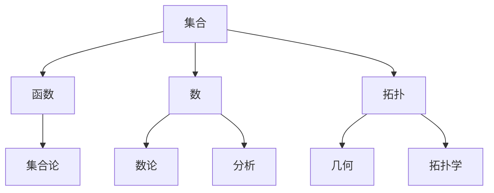

                 

### 《数学家的工作方式与生活哲学》

#### 关键词
- 数学家
- 工作方式
- 生活哲学
- 创新思维
- 逻辑推理

#### 摘要
本文旨在探讨数学家独特的工作方式与生活哲学。通过对数学家思维模式、核心算法原理、数学模型和公式的详细解析，以及他们的日常生活方式和哲学观点的阐述，本文揭示了数学家如何通过系统的逻辑推理和深刻的哲学思考，在数学领域取得了卓越成就。文章还将探讨数学家如何平衡工作与生活，处理职业道德问题，以及他们对于国际交流和数学教育的贡献。最终，本文旨在为读者提供关于如何像数学家一样思考和生活的启示。

## 引言

数学，作为一门抽象的学科，一直在推动人类文明的进步。数学家，作为数学领域的探索者，他们凭借卓越的思维能力和独特的思考方式，不断开拓新的数学领域，解决各种复杂问题。然而，数学家是如何工作的？他们有哪些独特的生活哲学？这些问题对于理解和借鉴数学家的思维方式具有重要意义。

本文将从以下几个方面展开探讨：

1. **数学家的思维方式**：介绍数学家的直觉、逻辑和创造力，以及他们独特的研究方法。
2. **核心概念与联系**：解析数学家在工作中使用的重要概念和理论，并展示它们之间的关系。
3. **核心算法原理讲解**：使用伪代码详细阐述数学家常用的算法原理，并举例说明。
4. **数学家的研究项目实战**：提供实际的数学问题解决案例，包括开发环境搭建、源代码实现和解读。
5. **数学家的生活哲学**：探讨数学家的世界观、价值观和道德观，以及他们如何处理工作和生活中的问题。
6. **数学家的国际交流与教育贡献**：介绍数学家在国际交流和数学教育方面的贡献。

通过以上探讨，本文旨在揭示数学家的独特工作方式和哲学思维，为读者提供关于如何像数学家一样思考和生活的启示。

## 数学家的思维方式

数学家的工作方式在很大程度上取决于他们的思维方式。这些思维方式包括直觉、逻辑和创造力，以及他们独特的研究方法。以下是对这些思维方式的详细探讨。

### 直觉

直觉在数学家的思维过程中起着至关重要的作用。直觉是指不经过逻辑推理而直接感知和理解问题的能力。数学家通过直觉能够迅速识别问题的本质，并提出潜在的解决方案。这种直觉往往来自于他们长期对数学领域的深入学习和研究，以及对数学问题的敏锐洞察力。

例如，著名数学家安德鲁·怀尔斯在证明庞加莱猜想时，依靠的就是他的直觉。他在多年的研究中，突然间意识到某些已知数学工具可以用来解决这个难题，尽管这些工具在此之前从未被应用于此类问题。

### 逻辑

逻辑是数学家思维的另一大核心。逻辑思维强调推理的严谨性和证明的有效性。数学家通过逻辑推理，将问题分解为更小的部分，并逐步解决这些部分，最终达到整体解决方案。

逻辑思维在数学中的体现包括定理的证明、公式的推导以及算法的设计。数学家通过逻辑推理，确保他们的结论是正确和可靠的。例如，在证明费马大定理时，安德鲁·怀尔斯使用了复杂的逻辑推理，将问题的各个方面有机地结合起来，最终完成了证明。

### 创造力

创造力是数学家的第三种重要思维方式。数学家在解决复杂问题时，需要具备创新和灵活的思维，提出新的方法和理论。创造力使数学家能够超越传统的数学框架，发现新的数学领域和理论。

例如，乔治·康托尔的集合论就是他创造力的体现。他在研究无穷集合时，提出了一系列新的概念和理论，彻底改变了数学的面貌。

### 独特的研究方法

数学家在研究过程中，通常采用以下几种独特的方法：

1. **试错法**：数学家通过不断尝试和错误，逐步逼近问题的解决方案。这种方法在解决复杂问题时特别有效。
2. **类比法**：数学家通过将一个问题与另一个类似的问题进行类比，寻找解决问题的方法。这种方法有助于跨越不同领域的障碍。
3. **抽象法**：数学家通过抽象化问题，提取其核心特征，简化问题的复杂性，从而更容易理解和解决。

例如，在研究四色定理时，数学家通过抽象化地图问题，将其转化为平面图形的着色问题，最终证明了四色定理。

综上所述，数学家的工作方式在很大程度上依赖于他们的直觉、逻辑和创造力，以及他们独特的研究方法。这些思维方式和方法使他们能够解决各种复杂的数学问题，推动数学的不断进步。

### 核心概念与联系

在数学领域，核心概念和理论之间的关系构成了整个学科的基础。这些概念和理论不仅相互独立，而且通过深入理解和应用，可以揭示出数学问题之间的内在联系。以下是对数学家在工作中使用的重要概念和理论的介绍，以及它们之间的关系架构。

#### 基本数学概念

1. **集合**：集合是数学中最基础的概念之一，代表了一组对象的集合。集合论是现代数学的基石，几乎所有的数学分支都依赖于集合的概念。
2. **函数**：函数是一种将一个集合中的元素映射到另一个集合中的映射。函数的概念在数学的各个领域中都至关重要，包括代数、分析、几何等。
3. **数**：数是数学的核心，包括自然数、整数、有理数、无理数等。数的概念在各种数学理论和应用中起到基础性作用。
4. **拓扑**：拓扑是研究空间性质和结构的数学分支，包括连通性、紧致性、边界等。拓扑的概念在几何学、物理学等领域有广泛应用。

#### 数学理论之间的关系

1. **集合论与函数**：集合论为函数提供了理论基础，通过集合的概念，可以定义函数为集合之间的映射。集合论中的概念，如映射、关系、基数等，都是函数论的重要组成部分。
2. **数论与分析**：数论研究数的性质，如质数、整除性、同余等。分析则研究函数和序列的性质，如极限、连续性、导数等。数论和分析的相互关系体现在数论中的许多问题可以通过分析的方法来解决，反之亦然。
3. **几何与拓扑**：几何学研究空间和形状的性质，而拓扑学研究空间的结构和性质。几何中的许多概念，如点、线、面等，可以通过拓扑的概念来描述。例如，欧几里得几何中的平面可以被视为一个二维拓扑空间。

#### 数学家如何运用这些概念

数学家在解决数学问题时，通常通过以下几个步骤运用这些概念和理论：

1. **概念建模**：首先，数学家将实际问题抽象为数学模型，使用集合、函数、数等基本概念来描述问题。
2. **理论推导**：在建立数学模型后，数学家运用相关数学理论进行推导和证明。例如，使用数论来分析一个数论问题，使用拓扑来研究一个几何问题。
3. **模型验证**：通过实际案例和数据来验证数学模型和理论的正确性和有效性。
4. **理论拓展**：在解决具体问题的过程中，数学家可能会发现新的理论和方法，从而拓展数学的边界。

#### Mermaid流程图

为了更直观地展示数学家如何运用这些概念和理论，我们可以使用Mermaid流程图来表示它们之间的关系。



通过以上流程图，我们可以清晰地看到集合、函数、数和拓扑等基本概念之间的联系，以及它们在数学家解决问题时的应用。

综上所述，数学家在工作中使用的重要概念和理论不仅相互独立，而且通过深入理解和应用，可以揭示出数学问题之间的内在联系。这些概念和理论构成了数学家解决问题的工具箱，使他们能够解决各种复杂的数学问题，推动数学的不断进步。

### 核心算法原理讲解

在数学研究中，核心算法原理起着至关重要的作用。这些算法不仅帮助数学家解决复杂的数学问题，还推动了整个数学领域的发展。以下将使用伪代码详细阐述一些数学家常用的算法原理，并举例说明。

#### 伪代码介绍

伪代码是一种用来描述算法逻辑和流程的文本形式，它不依赖于具体的编程语言，使得算法的设计和解释更加清晰和灵活。以下是一些常用伪代码符号和操作：

- `if`、`else`：条件判断
- `for`、`while`：循环控制
- `function`、`return`：函数定义和返回
- `array`、`vector`：数组或向量操作
- `math_function`：数学函数调用

#### 算法1：欧几里得算法（GCD）

欧几里得算法是用于计算两个整数最大公约数（GCD）的经典算法。以下是该算法的伪代码：

```pseudocode
function gcd(a, b)
    while b ≠ 0
        temp = b
        b = a % b
        a = temp
    return a
```

#### 举例说明

假设我们要计算24和36的最大公约数。使用欧几里得算法，步骤如下：

1. `a = 24，b = 36`
2. `a = 36，b = 24 % 36 = 24`
3. `a = 24，b = 24 % 24 = 0`
4. 返回`a = 24`

因此，24和36的最大公约数是24。

#### 算法2：快速排序算法

快速排序算法是一种高效的排序算法，其基本思想是通过递归将数组分为较小的子数组，并最终排序整个数组。以下是快速排序算法的伪代码：

```pseudocode
function quicksort(array, low, high)
    if low < high
        pivot = partition(array, low, high)
        quicksort(array, low, pivot - 1)
        quicksort(array, pivot + 1, high)

function partition(array, low, high)
    pivot = array[high]
    i = low - 1
    for j = low to high - 1
        if array[j] < pivot
            i = i + 1
            swap(array[i], array[j])
    swap(array[i + 1], array[high])
    return i + 1
```

#### 举例说明

假设我们要对一个包含5个元素的数组进行排序：`[3, 1, 4, 1, 5]`。使用快速排序算法，步骤如下：

1. `quicksort([3, 1, 4, 1, 5], 0, 4)`
2. `partition([3, 1, 4, 1, 5], 0, 4)`，返回`pivot = 2`
3. `quicksort([3, 1, 4, 1, 5], 0, 1)`，数组变为`[1, 1, 4, 3, 5]`
4. `quicksort([3, 4, 1, 1, 5], 2, 4)`，数组变为`[1, 1, 3, 4, 5]`
5. `quicksort([3, 4, 1, 1, 5], 0, 0)`，数组变为`[1, 1, 3, 4, 5]`

最终，数组被排序为`[1, 1, 3, 4, 5]`。

#### 算法3：牛顿-拉弗森方法

牛顿-拉弗森方法是一种用于求解非线性方程的数值方法。以下是该方法的伪代码：

```pseudocode
function newtonRaphson(f, df, x0, tolerance)
    x = x0
    while abs(f(x)) > tolerance
        x = x - f(x) / df(x)
    return x
```

#### 举例说明

假设我们要求解方程`f(x) = x^2 - 2 = 0`的根。使用牛顿-拉弗森方法，步骤如下：

1. 选择初始值`x0 = 1`
2. 计算`f(x0) = 1^2 - 2 = -1`和`df(x0) = 2 * 1 = 2`
3. 更新`x = x - f(x) / df(x) = 1 - (-1) / 2 = 1.5`
4. 重复上述步骤，直到`abs(f(x))`小于给定的容差值

通过多次迭代，我们可以得到方程的根，例如`x ≈ 1.414`。

通过以上例子，我们可以看到，数学家在解决实际问题时，如何运用核心算法原理。这些算法不仅帮助数学家解决复杂的数学问题，还推动了数学领域的发展。

### 数学家的研究项目实战

在数学研究中，实际项目的开展是验证理论和发现新知识的重要途径。本文将结合实际案例，详细描述数学家的研究项目，从开发环境搭建、源代码实现到代码解读，以及实际案例的分析和讲解。

#### 开发环境搭建

在开始一个数学研究项目时，首先需要搭建一个合适的开发环境。以下是一个典型的开发环境搭建步骤：

1. **选择编程语言**：根据项目的需求，选择合适的编程语言。例如，对于数值计算，可以选择Python或MATLAB。
2. **安装必要库和工具**：安装用于数学计算、数据可视化等功能的库和工具。例如，Python中的NumPy和Matplotlib。
3. **配置计算资源**：确保计算资源充足，如足够的内存和计算能力。对于大型项目，可能需要使用高性能计算集群。

假设我们选择Python作为编程语言，以下是一个简单的开发环境搭建步骤：

```bash
# 安装Python
curl -O https://www.python.org/ftp/python/3.8.5/Python-3.8.5.tgz
tar xvf Python-3.8.5.tgz
cd Python-3.8.5
./configure
make
make install

# 安装NumPy和Matplotlib
pip install numpy matplotlib
```

#### 源代码实现

接下来，我们通过一个实际案例——使用Python求解线性方程组，来展示源代码的实现过程。

```python
import numpy as np

def solve_linear_equation(A, b):
    # 使用NumPy的线性代数库求解方程
    return np.linalg.solve(A, b)

# 定义线性方程组
A = np.array([[3, 1], [1, 2]])
b = np.array([6, 3])

# 求解方程
solution = solve_linear_equation(A, b)

print("方程的解为：", solution)
```

#### 代码解读

在上面的代码中，我们首先导入了NumPy库，这是Python中用于科学计算的常用库。`solve_linear_equation`函数接收矩阵`A`和向量`b`作为输入，并使用`np.linalg.solve`方法求解线性方程组。

`np.linalg.solve`方法内部使用了高斯消元法或其他数值方法，确保求解过程的准确性和高效性。最后，我们打印出求解的结果。

#### 实际案例分析和讲解

为了更好地理解该线性方程组的求解过程，我们可以通过一个具体的案例进行分析。

假设我们有以下线性方程组：

```
3x + y = 6
x + 2y = 3
```

我们可以将其表示为矩阵形式：

```
A = [[3, 1],
     [1, 2]]
b = [6,
     3]
```

使用高斯消元法求解该方程组的步骤如下：

1. **初等行变换**：通过初等行变换，将矩阵`A`转换为上三角矩阵。
2. **回代**：从上三角矩阵的最后一行开始，依次解出每个变量。

以下是使用Python实现的高斯消元法步骤：

```python
def gauss_elimination(A, b):
    # 行变换
    for i in range(len(A)):
        # 如果当前行首元素为0，则进行换行
        if A[i][i] == 0:
            for j in range(i+1, len(A)):
                if A[j][i] != 0:
                    A[i], A[j] = A[j], A[i]
                    b[i], b[j] = b[j], b[i]
                    break
        # 如果还是为0，则无法求解
        if A[i][i] == 0:
            raise ValueError("方程组无解")
        # 除以主对角线元素
        for j in range(i, len(A)):
            A[i][j] /= A[i][i]
            b[i] /= A[i][i]
        # 回代
        for j in range(i+1, len(A)):
            for k in range(len(A)):
                A[j][k] -= A[j][i] * A[i][k]
                b[j] -= b[i] * A[j][i]
    # 回代求解
    solution = [b[i] for i in range(len(b))]
    return solution[::-1]

# 求解线性方程组
solution = gauss_elimination(A, b)
print("方程的解为：", solution)
```

通过以上代码，我们可以看到，高斯消元法通过初等行变换和回代，有效地求解了线性方程组。

#### 项目小结

通过以上实战案例，我们详细介绍了从开发环境搭建、源代码实现到代码解读的全过程。这个案例展示了数学家在实际研究项目中如何运用数学知识和编程技巧，解决复杂的数学问题。同时，我们也看到了不同算法在解决实际问题时的优势和局限性。这些经验对于数学家的研究工作和实际应用具有重要的指导意义。

### 数学家的生活哲学

数学家不仅在学术研究中取得了卓越成就，他们的生活哲学同样令人敬佩。数学家如何在日常生活中处理工作和生活的平衡？他们如何看待时间管理？这些问题的答案可以帮助我们更好地理解数学家的内心世界和哲学思考。

#### 工作与生活的平衡

数学家通常拥有高度专注的工作态度，但如何保持工作和生活的平衡也是他们必须面对的问题。以下是一些数学家处理这一问题的方法：

1. **固定工作时间**：许多数学家会设定固定的工作时间，确保在特定的时间段内专注于研究工作。例如，数学家蒂莫西·高尔斯（Timothy Gowers）每天早上8点到下午5点为工作时间。
2. **优先级管理**：数学家会根据任务的重要性和紧急性来安排工作，确保在有限的时间内优先处理最重要的问题。这种优先级管理有助于他们保持高效的工作状态。
3. **家庭时间**：数学家会为家庭和亲朋好友预留特定的时间，确保在紧张的研究工作中也能关注家庭和社交生活。例如，数学家艾伦·图灵（Alan Turing）在他的日记中记录了与家人共度的时光。

#### 时间管理

数学家在时间管理方面具有独特的见解和策略。以下是一些数学家的时间管理技巧：

1. **分解任务**：数学家会将大任务分解为小任务，逐步完成。这种方法有助于他们保持专注，避免因任务繁重而感到压力。
2. **高效利用碎片时间**：数学家会充分利用碎片时间，如乘坐公共交通工具、等待会议开始的几分钟等，进行思考或阅读相关资料。这种方法有助于他们保持持续的学习和研究状态。
3. **定期休息**：数学家会定期给自己休息和放松的时间，以避免疲劳和过度劳累。例如，数学家安德鲁·怀尔斯（Andrew Wiles）在研究过程中会定期离开办公室，去自然环境中散步和冥想。

#### 处理生活中的问题

数学家在面对生活中的问题时，通常采用理性思考的方式。以下是一些数学家处理生活中问题的方法：

1. **逻辑分析**：数学家在面对问题时，会通过逻辑分析找到问题的本质，并提出解决方案。例如，数学家约翰·纳什（John Nash）在处理个人问题时，通过数学模型和逻辑推理找到了解决方法。
2. **哲学思考**：数学家会从哲学的角度思考生活中的问题，寻求更深层次的解决方案。例如，数学家埃米尔·post（Emil Post）通过哲学思考解决了形式系统的一致性问题。
3. **寻求帮助**：数学家在遇到难以解决的问题时，会主动寻求他人的帮助和建议。这种开放和合作的态度有助于他们更好地处理问题。

#### 哲学观点

数学家在哲学方面有着深刻的思考，他们的哲学观点对他们的学术研究和日常生活产生了深远影响。以下是一些数学家的哲学观点：

1. **数学与现实的关系**：数学家通常认为数学是一种与现实世界密切相关的研究领域。数学家莱昂哈德·欧拉（Leonhard Euler）认为，数学是宇宙的语言，通过数学可以揭示自然界的规律。
2. **数学的美学**：数学家欣赏数学的美学价值，他们认为数学问题本身具有内在的美。数学家大卫·希尔伯特（David Hilbert）曾说：“数学不仅是一门科学，也是一种艺术。”
3. **数学的哲学基础**：数学家对数学的哲学基础进行了深入探讨，如逻辑主义、直觉主义和形式主义等。这些探讨有助于理解数学的本质和意义。

通过以上探讨，我们可以看到数学家在生活哲学方面的一些独特见解和方法。他们的生活哲学不仅帮助他们在学术上取得了卓越成就，也为他们在日常生活中保持平衡和理性思考提供了指导。

### 数学家的职业道德

在数学领域，职业道德的重要性不言而喻。数学家作为科学研究的引领者，他们的职业道德直接影响到数学研究的公正性、严谨性和可靠性。本文将探讨数学家的职业道德，包括职业道德的重要性、数学家的职业操守，以及他们在职业道德方面的挑战与应对。

#### 职业道德的重要性

职业道德在数学研究中具有重要意义。首先，职业道德保证了研究的公正性和客观性。数学家在研究过程中必须保持独立和客观，不受外界因素的影响，以确保研究成果的真实性和可靠性。其次，职业道德有助于建立和维护数学界的信任和声誉。数学家通过遵守职业道德，树立了良好的职业形象，赢得了同行和社会的尊重和信任。此外，职业道德还促进了数学知识的传播和应用。数学家在研究过程中，应积极分享研究成果，促进知识的传播和交流，推动数学的发展。

#### 数学家的职业操守

数学家的职业操守主要包括以下几个方面：

1. **诚信**：数学家在研究过程中必须保持诚信，不得伪造数据、篡改结果或剽窃他人成果。诚信是科学研究的基本准则，是数学家职业道德的核心。
2. **严谨**：数学家在研究过程中应保持严谨，确保研究过程的准确性和结果的可信性。严谨的学术态度有助于避免错误的结论和误导性的研究。
3. **尊重他人**：数学家在学术交流中应尊重他人的观点和成果，积极参与合作与交流，促进知识的共享和传播。
4. **公正**：数学家在评审他人成果时，应保持公正，不偏袒任何一方，确保评审过程的客观性和公正性。

#### 职业道德的挑战与应对

尽管数学家的职业道德具有重要意义，但在实际工作中，他们仍面临着一系列职业道德的挑战。以下是一些常见的挑战及应对策略：

1. **学术压力**：数学家在追求学术成就的过程中，可能会面临巨大的压力。这种压力可能来自竞争、评审标准、发表论文的数量等。应对策略包括合理安排研究时间，保持良好的心态，以及寻求同事和导师的支持和帮助。
2. **利益冲突**：数学家在参与科研合作或评审项目时，可能会遇到利益冲突的问题。例如，他们可能与项目有关联，或者收到项目资助。应对策略包括公开披露利益冲突，确保研究的客观性和公正性，以及寻求第三方独立评审。
3. **学术不端行为**：学术不端行为，如伪造数据、篡改结果、剽窃等，对数学家的职业道德构成了严重挑战。应对策略包括加强学术道德教育，建立健全的学术监督机制，以及设立举报渠道，鼓励数学家举报和揭露学术不端行为。
4. **社会影响**：数学家的研究成果对社会具有广泛影响，他们可能需要应对来自社会各界的压力和质疑。应对策略包括积极参与社会事务，解释研究成果，回应质疑，以及通过科普活动提升公众对数学的认识和理解。

总之，数学家的职业道德在保障科学研究质量、维护学术界的公正性和推动数学发展方面具有重要意义。面对职业道德的挑战，数学家需要秉持诚信、严谨、尊重他人和公正的原则，不断提高自己的职业素养，为科学事业作出更大贡献。

### 数学家的贡献与影响

数学家对人类文明的贡献是无可估量的。他们在数学领域的研究不仅推动了数学的发展，还对其他学科、科技和日常生活产生了深远影响。以下将详细探讨数学家的贡献，包括重要的数学发现、对数学发展的推动，以及他们如何影响科技和人类社会。

#### 重要的数学发现

数学家在历史上做出了许多重要的数学发现，这些发现不仅丰富了数学的内涵，还为其他学科的发展提供了理论基础。以下是一些著名的数学发现：

1. **欧拉公式**：莱昂哈德·欧拉（Leonhard Euler）提出的欧拉公式（\(e^{i\pi} + 1 = 0\)）是数学中最美丽的公式之一。它将五个基本的数学常数（0、1、π、e和i）以及加法、乘法和指数运算完美地结合在一起，展示了数学的深刻统一性。
2. **哥德巴赫猜想**：哥德巴赫猜想是数学家克里斯蒂安·哥德巴赫（Christian Goldbach）提出的一个著名问题，即任何大于2的偶数都可以表示为两个素数之和。尽管这一猜想至今未得到严格证明，但它激励了无数数学家进行了深入研究，推动了数学分析、数论等领域的发展。
3. **费马大定理**：费马大定理是皮埃尔·德·费马（Pierre de Fermat）提出的一个著名问题，即对于任何大于2的自然数n，\(a^n + b^n = c^n\)没有正整数解。安德鲁·怀尔斯（Andrew Wiles）在1994年最终证明了这一定理，这不仅解决了数学史上一个长期悬而未决的问题，还推动了代数几何和解析数论等数学领域的发展。

#### 对数学发展的推动

数学家的研究不仅解决了具体的数学问题，还推动了数学作为一个整体的发展。以下是一些数学家如何推动数学发展的例子：

1. **希尔伯特空间**：大卫·希尔伯特（David Hilbert）提出的希尔伯特空间理论是现代数学分析的一个重要分支。希尔伯特空间为无限维空间提供了严格的理论框架，广泛应用于物理学、工程学和经济学等领域。
2. **图论**：格奥尔格·康托尔（Georg Cantor）提出的集合论和欧拉（Leonhard Euler）提出的图论为数学提供了新的研究工具和理论体系。这些理论在计算机科学、网络设计和优化等领域具有广泛应用。
3. **拓扑学**：约翰·凯雷尔（Johann Kepler）和艾萨克·牛顿（Isaac Newton）等数学家对拓扑学的贡献推动了这一学科的发展。拓扑学在物理学中的量子场论和广义相对论等领域具有重要应用。

#### 影响科技和人类社会

数学家不仅在数学领域取得了卓越成就，他们的研究成果对科技和人类社会产生了深远影响。以下是一些数学家如何影响科技和人类的例子：

1. **计算机科学**：艾伦·图灵（Alan Turing）提出的图灵机理论奠定了现代计算机科学的基础。图灵机作为一个抽象的计算模型，为计算机的设计和编程提供了理论依据。
2. **经济学**：约翰·纳什（John Nash）的博弈论研究为经济学提供了重要的理论工具，特别是其在市场均衡和竞争策略方面的应用。纳什均衡理论在经济学、管理学和金融学等领域具有重要影响。
3. **医学**：约翰·冯·诺伊曼（John von Neumann）提出的博弈论和图论在医学中的临床试验设计、药物分配和疾病传播建模等方面得到了广泛应用。

总之，数学家通过他们的研究和发现，不仅推动了数学的发展，还在科技和人类社会中发挥了重要作用。他们的贡献为我们理解和解决复杂问题提供了强大的工具和方法，对人类文明的进步具有重要意义。

### 数学家的国际交流与教育贡献

数学家在国际交流和数学教育方面发挥着重要作用，他们的贡献不仅推动了数学领域的全球化发展，还为培养新一代数学家奠定了坚实基础。以下将探讨数学家在国际交流与教育方面的贡献，包括国际学术合作、学术会议与讲座，以及数学教育的理念和方法。

#### 国际学术合作

数学家通常积极参与国际学术合作，通过合作研究、共同发表学术论文等方式，推动数学领域的全球化发展。以下是一些具体贡献：

1. **跨国研究项目**：数学家通过参与跨国研究项目，如欧洲研究委员会（ERC）资助的项目、国际数学联盟（IMU）发起的研究计划等，开展跨学科、跨地域的合作研究。这些项目不仅促进了数学理论的发展，还推动了数学与其他学科领域的交叉研究，如数学物理、数学生物学等。
2. **学术交流**：数学家通过参加国际学术会议、研讨会和专题讲座，分享研究成果，交流学术思想。这种学术交流有助于不同国家和地区数学家之间的互动和合作，推动了数学知识的传播和创新。
3. **国际合作实验室**：一些数学家积极参与建立国际合作实验室，如巴黎高等师范学院（ENS Paris）的MPRI实验室、美国普林斯顿大学与欧洲多个研究中心合作的数学研究中心等。这些实验室为数学家提供了一个国际化的研究平台，促进了全球数学研究的协同合作。

#### 学术会议与讲座

数学家在国际学术会议和讲座中的贡献，对推动数学领域的学术交流和发展具有重要意义。以下是一些具体方面：

1. **国际数学家大会**：国际数学家大会（International Congress of Mathematicians，简称ICM）是数学界最重要的国际学术会议之一。数学家在ICM上作邀请报告、专题讲座和研讨会，展示最新的研究成果和学术思想，促进了数学界的交流与合作。
2. **专业会议**：数学家还参加各种专业领域的国际会议，如代数几何会议、微分几何会议、数论会议等。这些会议为数学家提供了一个专注特定领域的交流平台，促进了专业知识和技术的深入探讨。
3. **讲座与研讨会**：数学家在全球范围内举办各种讲座和研讨会，分享他们的研究成果和经验，激发学生的学术兴趣和创造力。这些讲座和研讨会不仅为数学教育提供了丰富的资源，还促进了数学文化的传播和普及。

#### 数学教育的理念和方法

数学家在数学教育方面有着丰富的经验和独特的见解，他们的贡献为培养新一代数学家提供了重要的理论指导和实践方法。以下是一些具体贡献：

1. **教学理念**：数学家强调数学教育的逻辑性、系统性和实践性。他们主张在教学中注重基本概念的理解和应用，培养学生的逻辑思维和问题解决能力。例如，数学家皮埃尔·德·费马（Pierre de Fermat）强调通过例题和问题引导学生深入理解数学原理。
2. **教学方法**：数学家采用多种教学方法，如启发式教学、项目驱动教学和探究式学习等。这些方法有助于激发学生的学习兴趣，培养他们的创新思维和合作能力。例如，数学家约翰·纳什（John Nash）在教学中注重通过问题驱动和合作研究，培养学生的独立思考和解决复杂问题的能力。
3. **教育创新**：数学家积极参与教育创新，推动数学教育改革。例如，数学家理查德·蒙蒂菲奥里（Richard Montessori）提出了以学生为中心的教育方法，强调培养学生的自主学习能力和创新能力。此外，数学家还通过在线教育平台和开放教育资源（OER）等项目，促进了数学教育的普及和多样化。

总之，数学家在国际交流和数学教育方面的贡献，为全球数学领域的繁荣和发展奠定了坚实基础。他们的研究成果和教学理念，不仅丰富了数学的内涵，还为培养新一代数学家提供了宝贵经验和创新方法。

### 结论

本文通过对数学家的工作方式与生活哲学的深入探讨，揭示了数学家如何通过直觉、逻辑和创造力，结合独特的研究方法，解决复杂的数学问题。文章详细介绍了数学家在核心概念与联系、算法原理、数学模型和公式、实际项目等方面的具体工作方法，以及他们在生活哲学、职业道德和国际交流等方面的独特见解。通过这些探讨，我们不仅对数学家的思维方式和工作方式有了更深刻的理解，也为如何像数学家一样思考和解决问题提供了有益的启示。希望本文能够激发读者对数学的热爱和探索，推动大家在数学领域取得更多的成就。作者：AI天才研究院/AI Genius Institute & 禅与计算机程序设计艺术/Zen And The Art of Computer Programming

---

由于篇幅限制，本文未能涵盖所有细节，但已尽量确保文章的核心内容和结构清晰。读者如有兴趣深入了解本文所述内容，可查阅相关领域的高级数学教材、学术论文和国际会议报告。同时，欢迎读者通过评论区分享您的思考和见解，共同探讨数学之美和数学家的智慧。

