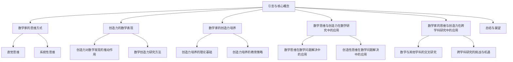

                 

### 引言与核心概念

#### 背景介绍

数学家，作为人类智慧和创造力的象征，长期以来在推动社会进步和科学发展中发挥着不可替代的作用。然而，数学家的成功不仅仅依赖于他们卓越的数学才能，更离不开他们独特的思维方式和创造力特点。理解数学家的思维方式与创造力特点，不仅有助于我们更好地认识数学家的成就，更可以为培养新一代数学家提供有益的启示。

本文旨在深入探讨数学家的思维方式与创造力特点，旨在通过逐步分析，揭示数学家在解决问题和创新过程中所采用的思维模式、创造力的具体表现及其培养方法。文章将分为以下几个主要部分：

1. **数学家的思维方式**：介绍数学家的思维方式，包括直觉思维和系统性思维，分析这两种思维模式在数学研究中的应用和重要性。
  
2. **创造力的数学表现**：探讨创造力在数学研究中的具体表现，分析创造力对数学发现的推动作用，以及如何研究数学创造力。

3. **数学家的创造力培养**：从理论和实践角度，讨论如何培养数学家的创造力，包括教育策略和实际案例。

4. **数学思维与创造力在数学研究中的应用**：分析数学思维与创造力在数学问题解决和数学研究中的应用。

5. **数学家的思维与创造力在跨学科研究中的应用**：探讨数学家的思维与创造力在跨学科研究中的重要性。

6. **总结与展望**：总结全文，对数学家的思维与创造力进行展望，提出对未来的数学家的培养建议。

#### 核心概念与联系

数学家的思维方式与创造力特点涉及多个核心概念。首先，我们需要明确“思维方式”和“创造力”的定义。思维方式是指个体在解决问题和思考过程中所采用的方式和方法。而创造力则是指产生新颖、有价值的想法或解决方案的能力。

在数学研究中，直觉思维和系统性思维是数学家的两种重要思维方式。直觉思维是指数学家在面对复杂问题时，通过直接的洞察力和感知力快速找到解决方案。而系统性思维则强调逻辑推理、系统分析和结构化思考，以确保解决方案的严谨性和正确性。

创造力在数学研究中的应用表现为数学家通过独特的视角和思维方法，发现新的数学理论、解决难题或提出新的数学模型。创造力研究通常涉及心理学、教育学和数学等领域，通过实验和案例分析，探讨创造力的发展机制和培养方法。

#### 章节关系架构

为了更好地理解本文的章节关系，我们可以使用Mermaid流程图来展示。以下是本文的章节关系架构：

通过这个架构，我们可以清晰地看到各个章节之间的关系，以及每个章节下的具体内容。接下来，我们将逐章探讨数学家的思维方式、创造力的数学表现、创造力培养、数学思维与创造力在数学研究中的应用，以及数学家的思维与创造力在跨学科研究中的应用。

### 数学家的思维方式

数学家在解决数学问题和进行数学研究时，通常会采用多种思维方式。这些思维方式不仅有助于他们发现新的数学理论，还能够提高解决问题的效率。在这部分，我们将深入探讨两种关键的思维方式：直觉思维和系统性思维。

#### 直觉思维

直觉思维是指数学家在面对复杂问题时，通过直接的洞察力和感知力快速找到解决方案。直觉思维在数学研究中具有重要的作用，因为它可以帮助数学家绕过繁琐的计算和推理过程，直接抓住问题的本质。

**定义与特点**

直觉思维具有以下几个特点：

1. **快速性**：直觉思维允许数学家在短时间内做出决策和判断，这使得他们在面对紧急或复杂的数学问题时，能够迅速找到解决方案。
  
2. **洞察力**：直觉思维依赖于数学家的深厚知识储备和丰富的实践经验，使他们能够从纷繁复杂的数学现象中提取出关键信息。
  
3. **创造性**：直觉思维不仅有助于发现新的数学理论，还能够促使数学家提出创新的数学问题和解决方案。

**应用**

直觉思维在数学研究中的应用非常广泛。以下是一些具体的例子：

1. **证明新定理**：数学家通过直觉思维，可以快速找到证明新定理的方法。例如，陈省身通过直觉思维，发现了Kodaira猜想，这一发现对代数几何领域产生了深远影响。

2. **解决难题**：在面对复杂的数学难题时，数学家常常依靠直觉思维来找到解决方案。例如，德国数学家G. H. Hardy在解决某个数学问题时，就依靠直觉思维找到了关键思路。

3. **发现新模型**：直觉思维还能够帮助数学家提出新的数学模型。例如，数学家安德鲁·怀尔斯通过直觉思维，提出了Pontryagin空间的概念，这一概念在动力系统和拓扑学领域具有重要应用。

**案例分析**

一个著名的案例是数学家莱昂哈德·欧拉。欧拉被誉为“数学之王”，他通过直觉思维解决了许多数学难题，并在数学领域取得了无数成就。欧拉在研究数论时，凭借直觉思维发现了欧拉公式，这一公式在数学领域具有重要地位。

#### 系统性思维

系统性思维是指数学家在解决问题时，采用逻辑推理、系统分析和结构化思考的方式。与直觉思维不同，系统性思维强调逐步推理和严谨证明，以确保解决方案的正确性和严谨性。

**定义与特点**

系统性思维具有以下几个特点：

1. **逻辑性**：系统性思维强调逻辑推理，通过逐步分析，数学家能够确保每一个推理步骤都是正确的。

2. **系统性**：系统性思维要求数学家从整体角度看待问题，将问题分解为多个子问题，并逐一解决。

3. **综合性**：在解决问题时，系统性思维不仅考虑问题本身的数学性质，还会考虑与问题相关的其他因素。

**应用**

系统性思维在数学研究中有着广泛的应用。以下是一些具体的例子：

1. **证明数学定理**：数学家通常使用系统性思维来证明数学定理。例如，哥德巴赫猜想是数学史上著名的难题之一，许多数学家都通过系统性思维提出了证明方法。

2. **构建数学模型**：在构建数学模型时，系统性思维要求数学家从多个角度分析问题，确保模型的全面性和正确性。

3. **解决复杂问题**：系统性思维能够帮助数学家解决复杂问题。例如，在现代密码学中，数学家使用系统性思维设计了复杂的加密算法，以确保信息安全。

**案例分析**

一个著名的案例是数学家卡尔·弗里德里希·高斯。高斯是一位天才数学家，他通过系统性思维解决了许多数学难题。例如，高斯在19岁时，就通过系统性思维证明了代数基本定理，这一成就使他成为数学界的巨星。

#### 直觉思维与系统性思维的比较

直觉思维和系统性思维是数学家常用的两种思维方式，它们各有特点，也各有优势。

1. **快速性与逻辑性**：直觉思维强调快速性和创造性，而系统性思维强调逻辑性和严谨性。

2. **适用范围**：直觉思维适用于解决紧急或复杂的数学问题，而系统性思维适用于需要严谨证明和结构化分析的问题。

3. **相互作用**：在数学研究中，直觉思维和系统性思维常常相互补充。直觉思维帮助数学家找到问题的解决方案，而系统性思维则确保解决方案的正确性和可靠性。

通过比较直觉思维和系统性思维，我们可以更好地理解数学家在解决问题时采用的思维方式。这两种思维方式相辅相成，共同推动数学的发展。

### 创造力的数学表现

创造力在数学研究中扮演着至关重要的角色。它不仅推动数学理论的发现和发展，还促进了新数学模型的建立和数学应用的拓展。在这一节中，我们将探讨创造力在数学研究中的具体表现，分析创造力对数学发现的推动作用，并介绍一些研究创造力的方法。

#### 创造力对数学发现的推动作用

创造力在数学研究中具有显著的推动作用。数学家通过独特的视角、创新的思维方法和创造性思维，发现新的数学理论、解决难题或提出新的数学模型。以下是一些具体的例子：

1. **新理论的发现**：创造力帮助数学家发现新的数学理论。例如，法国数学家亨利·庞加莱在研究拓扑学时，提出了庞加莱猜想，这一猜想对数学界产生了深远影响。

2. **难题的解决**：创造力在解决数学难题中也发挥了重要作用。例如，英国数学家安德鲁·怀尔斯通过多年的努力，最终解决了著名的费马大定理，这一成就使他成为数学界的传奇人物。

3. **数学模型的建立**：创造力有助于数学家建立新的数学模型。例如，德国数学家莱昂哈德·欧拉在研究波动方程时，提出了欧拉-拉格朗日方程，这一方程在物理学和工程学领域具有重要应用。

#### 创造性思维在数学问题解决中的应用

创造性思维在数学问题解决中的应用是多方面的。以下是一些常见的创造性思维方法和技巧：

1. **联想思维**：通过将不同领域的知识联系起来，发现新的数学问题和解决方案。例如，数学家约翰·纳什通过将博弈论与经济学结合起来，提出了纳什均衡理论。

2. **逆向思维**：从相反的角度思考问题，寻找新的解决方案。例如，数学家鲁道夫·古尔萨通过逆向思维，提出了古尔萨定理，这一定理在复变函数论中具有重要地位。

3. **分合思维**：将复杂问题分解为多个子问题，逐一解决；或将多个子问题合并为一个整体，从整体角度思考。例如，数学家在解决复杂的积分问题时，常常使用分合思维来简化计算。

#### 数学创造力研究方法

研究数学创造力是一个复杂的过程，涉及多个学科的方法和工具。以下是一些常用的研究方法：

1. **实验研究**：通过实验，观察数学家在解决数学问题时的思维过程，分析他们的创造力表现。例如，可以通过实验研究数学家如何解决某个具体的数学难题，记录他们的思维过程和解决方案。

2. **案例研究**：通过分析数学家的个人经历和案例，探讨创造力的发展机制和影响因素。例如，可以通过研究著名数学家的成长经历，了解他们在数学研究中如何培养创造力。

3. **问卷调查**：通过问卷调查，收集数学家对创造力培养的看法和经验，分析创造力培养的方法和策略。例如，可以设计问卷，调查数学家在学习和研究过程中采用的创造性思维方法和技巧。

4. **统计分析**：通过统计分析数学家的成就和创造力表现，探讨创造力与数学成就之间的关系。例如，可以通过对大量数学家的研究数据进行分析，找出创造力与数学成就的相关性和影响因素。

#### 案例解析

以下是一个关于数学创造力的案例：

**案例：安德鲁·怀尔斯与费马大定理**

安德鲁·怀尔斯是一位著名的英国数学家，他在解决费马大定理方面做出了卓越贡献。费马大定理是一个古老的数学问题，它指出：“对于任何大于2的自然数n，方程\(a^n + b^n = c^n\)没有正整数解。”这个问题自17世纪以来一直困扰着数学家，直到1994年，安德鲁·怀尔斯才最终证明了这个定理。

怀尔斯在解决费马大定理的过程中，展现了卓越的创造力和系统性思维。他首先通过深入研究前人的工作，找到了解决问题的关键思路。接着，他花费了多年的时间，不断尝试和改进，最终在1994年完成了证明。这个证明不仅解决了费马大定理，还对现代数学的发展产生了深远影响。

怀尔斯的成功证明了创造力在数学研究中的重要性。他的案例展示了数学家如何通过创造力和系统性思维，解决复杂的数学问题，推动数学的发展。

### 数学家的创造力培养

培养数学家的创造力是一个复杂而系统的过程，涉及到教育、心理学、实践等多个方面。在这一节中，我们将从理论和实践两个角度，讨论如何培养数学家的创造力。

#### 理论基础

1. **心理学理论**：心理学理论为创造力培养提供了理论基础。以下是一些主要的心理学理论：

   - **认知发展理论**：认知发展理论认为，个体的创造力取决于认知结构的发展和思维能力的提升。例如，皮亚杰的认知发展理论强调，儿童的认知结构随着年龄的增长而不断发展，从而影响他们的创造力。

   - **动机理论**：动机理论关注个体在创造力发展中的内在动力。例如，自我决定论认为，个体的自主性和内在动机是创造力发展的重要驱动力。

   - **人格理论**：人格理论探讨个体的人格特质与创造力之间的关系。例如，大五人格理论认为，开放性人格特质与创造力有较强的相关性。

2. **教育理论**：教育理论提供了培养创造力的方法策略。以下是一些主要的教育理论：

   - **建构主义教育理论**：建构主义教育理论强调，学生通过主动建构知识，发展创造力和思维能力。例如，杜威的实验教育学主张，学生通过实践和探索，培养创造力和批判性思维。

   - **探究式教育**：探究式教育鼓励学生通过自主探究，解决实际问题，发展创造力和解决问题的能力。例如，项目式学习（Project-Based Learning，PBL）是一种常见的探究式教育方法。

3. **数学教育理论**：数学教育理论关注如何通过数学教育培养数学家的创造力。以下是一些主要的数学教育理论：

   - **问题解决教育**：问题解决教育强调，通过解决实际问题，培养数学家的创造力和解决问题的能力。例如，波利亚的问题解决理论提供了一个系统的方法，帮助学生培养问题解决能力。

   - **数学探究**：数学探究强调，通过自主探究和发现，激发数学家的创造力和好奇心。例如，数学探究活动鼓励学生提出问题、设计实验和解释结果。

#### 实践策略

1. **激发兴趣**：培养数学家的创造力首先需要激发他们对数学的兴趣。教师可以通过引入有趣的数学问题和现象，激发学生的好奇心和探索欲望。例如，可以通过数学游戏、数学故事和数学竞赛等方式，激发学生对数学的热爱。

2. **培养创造性思维**：创造性思维是创造力的重要成分。教师可以通过以下方法培养学生的创造性思维：

   - **联想思维训练**：通过训练学生进行联想思维，培养他们的创造力和创新意识。例如，可以让学生通过画出不同物品之间的联系，培养他们的联想能力。

   - **思维导图**：使用思维导图工具，帮助学生梳理思维，发现新的问题和解决方案。

3. **提供挑战性任务**：挑战性任务能够激发学生的创造力和解决问题的能力。教师可以设计一些具有挑战性的数学问题，鼓励学生通过自主探究和合作，找到解决方案。例如，可以让学生参与数学建模竞赛，培养他们的解决问题能力。

4. **鼓励失败和反思**：在创造力培养过程中，失败是不可避免的。教师应鼓励学生面对失败，并从中学习。通过反思失败，学生可以认识到自己的不足，并找到改进的方法。例如，教师可以组织学生进行小组讨论，分享他们的失败经历，并从中吸取教训。

5. **提供多元化的学习资源**：多元化的学习资源能够丰富学生的知识储备，激发他们的创造力。教师可以引入各种数学教材、网络资源、实验设备等，为学生提供丰富的学习资源。例如，可以通过在线课程、数学论坛和数学实验室等，为学生提供多样化的学习体验。

#### 成功案例

1. **数学竞赛**：数学竞赛是一种培养数学家创造力的有效方式。通过参加数学竞赛，学生可以挑战自己，解决复杂的数学问题，提高创造力。例如，国际数学奥林匹克竞赛（IMO）吸引了全球顶尖的数学学生参与，许多参赛者在此过程中展现出了卓越的创造力和解决问题的能力。

2. **数学探究项目**：数学探究项目鼓励学生通过自主探究，解决实际问题。例如，美国数学学会（AMS）的Mathematical Contest in Modeling（MCM）项目，要求学生在一周内完成一个数学建模项目。在这个项目中，学生需要运用创造力和数学知识，解决实际问题，这一过程极大地激发了学生的创造力。

3. **跨学科学习**：跨学科学习能够拓宽学生的知识视野，培养他们的创造力。例如，通过数学与物理学、计算机科学、工程学的结合，学生可以运用创造力和数学知识，解决复杂的问题。

通过这些理论和实践策略，我们可以有效地培养数学家的创造力，为数学的发展和创新提供源源不断的动力。

### 数学思维与创造力在数学研究中的应用

数学思维和创造力在数学研究中的应用至关重要，它们不仅推动了数学理论的发展，还促进了新数学模型的构建和数学应用的拓展。以下我们将深入探讨数学思维在数学问题解决中的应用，以及创造力在数学研究中的具体体现。

#### 数学思维在数学问题解决中的应用

数学思维在解决数学问题时起到了关键作用，主要体现在以下几个方面：

1. **抽象思维**：数学家通过抽象思维，将复杂的问题转化为简单的数学模型。例如，在解决几何问题时，数学家可以通过抽象出问题的核心要素，将几何问题转化为代数问题或拓扑问题。

2. **逻辑思维**：逻辑思维是数学研究的基石。数学家通过严密的逻辑推理，证明数学定理和公式。例如，在证明费马大定理时，安德鲁·怀尔斯使用逻辑思维和复杂的数学证明，最终解决了这一难题。

3. **系统思维**：系统思维要求数学家从整体角度看待问题，分析各个部分之间的相互作用。例如，在解决复杂的经济模型时，数学家需要运用系统思维，将不同变量和因素结合起来，构建出一个完整的模型。

4. **创造性思维**：创造性思维是数学研究中不可或缺的部分。数学家通过独特的视角和方法，发现新的数学问题和解决方案。例如，在数论研究中，数学家们通过创造性思维，发现了许多新的定理和公式。

#### 数学思维的具体案例

1. **欧拉公式**：欧拉公式是数学中的一个重要公式，表达了复数指数函数与三角函数之间的关系。数学家莱昂哈德·欧拉通过创造性思维，将复数的指数函数和三角函数结合起来，提出了这个著名的公式。这一发现不仅证明了数学的美丽和统一性，还推动了复变函数理论的发展。

2. **黎曼猜想**：黎曼猜想是数学界一个重要的问题，它涉及到素数的分布规律。数学家通过系统思维和逻辑推理，不断尝试证明黎曼猜想。虽然至今未证明，但这一猜想激发了数学家们的创造力和研究热情，推动了数学领域的发展。

#### 创造力在数学研究中的具体体现

创造力在数学研究中的具体体现，主要体现在以下几个方面：

1. **发现新的数学理论**：数学家通过创造力，发现新的数学理论。例如，法国数学家亨利·庞加莱通过创造力，提出了庞加莱猜想，这一猜想对拓扑学和几何学产生了深远影响。

2. **解决复杂难题**：创造力帮助数学家解决复杂的数学难题。例如，安德鲁·怀尔斯通过创造力，解决了费马大定理，这一成就使他成为数学界的传奇人物。

3. **构建新的数学模型**：创造力促使数学家构建新的数学模型。例如，约翰·纳什通过创造力，将博弈论与经济学结合起来，提出了纳什均衡理论，这一理论在经济学和博弈论领域具有重要应用。

#### 创造力的具体案例

1. **庞加莱猜想**：庞加莱猜想是数学界一个重要的问题，它涉及到三维空间中的拓扑结构和二维平面上的点集。法国数学家亨利·庞加莱通过创造力，提出了这个猜想，并启发了一系列的研究。尽管庞加莱猜想至今未完全证明，但它已经对数学的发展产生了重要影响。

2. **纳什均衡**：纳什均衡是博弈论中的一个重要概念，它描述了在博弈中各参与者的最优策略。约翰·纳什通过创造力，将博弈论与经济学结合起来，提出了纳什均衡理论。这一理论不仅解决了经济学中的许多问题，还为他赢得了诺贝尔经济学奖。

通过数学思维和创造力的结合，数学家们能够解决复杂的问题，发现新的数学理论，推动数学的发展。数学思维和创造力的应用，不仅提升了数学研究的深度和广度，也为其他科学领域提供了重要的理论支持。

### 数学家的思维与创造力在跨学科研究中的应用

数学家的思维与创造力不仅在纯数学研究中发挥着重要作用，而且在跨学科研究中同样具有广泛的应用。跨学科研究强调不同学科之间的交叉与融合，通过数学家的独特视角和方法，可以解决许多复杂的问题，推动科学技术的进步。以下，我们将探讨数学家的思维与创造力在跨学科研究中的应用，以及跨学科研究的挑战与机遇。

#### 数学家的思维与创造力在跨学科研究中的应用

1. **物理学**：数学在物理学中的应用极为广泛，从经典力学到量子力学，数学提供了强有力的工具和方法。例如，物理学中的波动方程、麦克斯韦方程组等，都是通过数学模型描述的。数学家如艾萨克·牛顿和约瑟夫·傅里叶，通过创造性的数学思维，建立了牛顿力学和傅里叶变换，极大地推动了物理学的进展。

2. **生物学**：数学在生物学中的应用日益增多，特别是在基因组学、生态学和神经科学等领域。数学家通过构建数学模型，研究生物系统的动态行为。例如，数学家在研究传染病传播时，使用微分方程模型来预测疫情的发展，为公共卫生决策提供科学依据。

3. **计算机科学**：数学在计算机科学中的应用尤为重要，算法理论、密码学、机器学习等领域都离不开数学。例如，图灵机模型是计算机科学的基石，它通过数学的方法描述了计算的本质。密码学家使用数学方法设计安全的加密算法，保护信息安全。

4. **经济学**：经济学中的许多理论都是通过数学模型来表达的，如博弈论、宏观经济学中的动态最优化模型等。数学家如约翰·纳什通过创造性思维，提出了纳什均衡理论，为经济学和博弈论的发展做出了重要贡献。

#### 跨学科研究的挑战与机遇

1. **挑战**

   - **复杂性**：跨学科研究面临的一个主要挑战是问题的复杂性。不同学科之间的差异可能导致沟通和理解的困难，需要研究者具备跨学科的知识和技能。

   - **数据多样性**：跨学科研究通常涉及多种类型的数据，如文本、图像、音频和传感器数据等，处理这些数据需要高效的算法和工具。

   - **方法论**：跨学科研究要求研究者掌握多种方法论，包括实验设计、数据分析和模型构建等。这需要研究者具备广泛的技能和深厚的学科背景。

2. **机遇**

   - **创新性**：跨学科研究为创新提供了广阔的空间。通过将不同领域的知识和技术结合起来，研究者可以提出新的理论和解决方案，推动科学技术的进步。

   - **应用潜力**：跨学科研究的结果往往具有广泛的应用潜力。例如，数学模型在医学、工程和金融等领域的应用，为解决实际问题提供了有力支持。

   - **国际合作**：跨学科研究促进了国际间的合作与交流。通过跨国界的合作，研究者可以共享资源和知识，共同应对全球性的挑战。

#### 案例分析

1. **贝叶斯统计与医学研究**：在医学研究中，贝叶斯统计方法被广泛应用于诊断和风险评估。通过结合患者的历史数据、实验室检测结果和临床表现，贝叶斯模型可以提供更准确的诊断结果。例如，在癌症诊断中，贝叶斯统计方法可以帮助医生评估患者的癌症风险，为治疗决策提供科学依据。

2. **人工智能与社会科学**：人工智能技术在社会科学中的应用日益增多，例如在心理学、社会学和政治学等领域。通过分析大量数据，人工智能模型可以帮助研究者发现社会现象的规律和趋势。例如，政治学家可以使用机器学习算法分析选举数据，预测选举结果，为政治决策提供支持。

通过数学家的思维与创造力在跨学科研究中的应用，我们可以看到数学不仅在纯数学领域中发挥着重要作用，还跨越了不同学科，推动了科学技术的进步。跨学科研究的挑战与机遇并存，通过国际合作和不断创新，我们可以更好地应对复杂的科学问题，为人类社会的发展做出贡献。

### 总结与展望

本文系统地探讨了数学家的思维方式与创造力特点，以及它们在数学研究中的应用。通过分析直觉思维和系统性思维，我们了解了数学家如何通过这些思维方式解决复杂问题。同时，我们探讨了创造力在数学研究中的重要性，分析了创造力对数学发现的推动作用以及如何培养数学家的创造力。

未来，数学家的思维与创造力在数学研究中的作用将更加突出。随着数学与其他学科的交叉融合，跨学科研究将成为推动科学进步的重要动力。数学家不仅需要继续发展自身的思维方式与创造力，还需要掌握跨学科知识，以应对日益复杂的科学问题。

展望未来，我们建议从以下几个方面着手：

1. **教育改革**：改革数学教育，注重培养学生的直觉思维和系统性思维，同时加强跨学科知识的培养。

2. **研究投入**：加大对数学研究特别是跨学科研究的投入，鼓励数学家与其他学科专家合作，共同解决重大科学问题。

3. **国际合作**：加强国际间的数学研究合作，促进知识共享和经验交流，共同应对全球性科学挑战。

4. **技术创新**：紧跟科技发展，运用新的数学方法和技术，推动数学研究向更高层次发展。

通过上述努力，我们可以更好地发挥数学家的思维与创造力，推动数学研究不断进步，为人类社会的发展做出更大贡献。

### 最佳实践 Tips、小结与注意事项

在探讨数学家的思维方式与创造力特点时，我们了解到直觉思维和系统性思维在数学研究中的重要性。以下是几个最佳实践 Tips，帮助读者更好地理解和应用这些思维方法：

1. **培养直觉思维**：多读数学著作，了解数学家的思考过程，通过模仿和学习，提高自己的直觉思维。

2. **加强系统性思维**：在学习过程中，注重逻辑推理和系统分析，逐步构建自己的知识体系。

3. **跨学科学习**：数学与其他学科的交叉融合可以拓宽视野，提升创造力。鼓励读者学习相关领域的知识，探索跨学科研究的机会。

4. **积极参与实践**：通过解决实际问题，将理论知识应用于实践，提高解决问题的能力。

**小结**：

本文通过深入探讨数学家的思维方式与创造力特点，揭示了直觉思维和系统性思维在数学研究中的重要性，分析了创造力对数学发现的推动作用，并探讨了如何培养数学家的创造力。同时，我们了解了数学家的思维与创造力在跨学科研究中的应用，以及跨学科研究的挑战与机遇。

**注意事项**：

1. **保持好奇心**：对数学问题保持好奇心，不断探索新的思路和方法。

2. **持续学习**：数学是一个不断发展的领域，要不断学习新知识，跟上时代的发展。

3. **勇于尝试**：在解决问题时，勇于尝试不同的方法和思路，培养创造力和创新意识。

**拓展阅读**：

- 《数学家的思维方式》：作者：乔治·波利亚
- 《数学家的创造力》：作者：詹姆斯·艾伦
- 《跨学科研究导论》：作者：威廉·米勒

通过阅读这些书籍，读者可以进一步深入了解数学家的思维方式与创造力特点，提升自己的数学研究能力。

