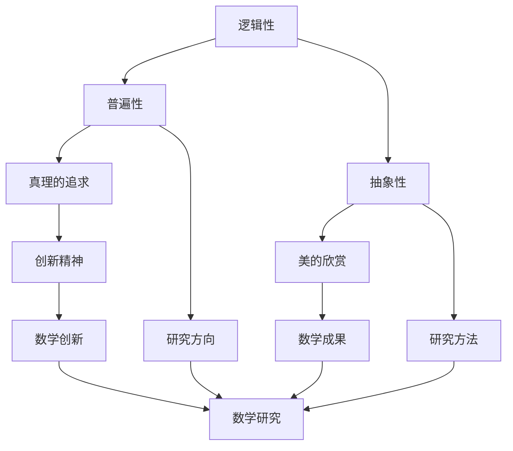

                 


### 完整目录大纲设计

以下是《数学家的数学信念与价值观》的完整目录大纲。文章将按照该大纲逐章节进行详细阐述。

----------------------------------------------------------------

# 《数学家的数学信念与价值观》

## 文章关键词
- 数学家
- 数学信念
- 数学价值观
- 研究方法论
- 学术创新
- 数学研究

## 文章摘要

本文旨在探讨数学家的数学信念与价值观，以及这些信念和价值观如何影响数学的研究与发展。文章将首先介绍数学家的核心信念，如逻辑性、普遍性和抽象性，然后分析数学家的价值观，包括对真理的追求、美的欣赏以及创新精神。接下来，文章将讨论数学家的信念与价值观对数学研究的影响，包括研究方向的选择、研究方法的应用以及数学成果的创新性。此外，文章还将通过数学家的职业生涯和生活实践，展示他们的信念与价值观如何在日常生活中体现。最后，文章将对数学家的信念与价值观进行总结，并探讨其对未来的影响。

----------------------------------------------------------------

## 引言

数学是科学领域中最基础的学科之一，它不仅具有抽象性，还具有普遍性和逻辑性。数学家作为数学领域的专家，他们的信念与价值观在很大程度上决定了数学研究的方向、方法和成果。本文将首先探讨数学家的核心信念，包括逻辑性、普遍性和抽象性，然后分析数学家的价值观，包括对真理的追求、美的欣赏以及创新精神。通过这些探讨，我们将更好地理解数学家的思维方式和研究方法，以及这些信念和价值观如何影响数学研究与发展。

----------------------------------------------------------------

### 数学家的核心信念

1. **逻辑性信念**

   数学家对数学的逻辑性有着深刻的信念。数学是一门逻辑严谨的学科，每一个结论都必须经过严密的逻辑推导。逻辑性是数学的核心特征之一，它保证了数学理论的正确性和可靠性。数学家坚信，通过逻辑推理，可以构建出一系列精确、一致和自洽的数学体系。

2. **普遍性信念**

   数学家还相信数学具有普遍性。他们认为，数学原理和结论不仅适用于某个特定的领域或情境，而是在更广泛的范围内都成立。例如，数学中的许多原理都可以应用于物理、工程、经济学等领域。普遍性使得数学成为跨学科交流的基础，为各种科学和技术领域的发展提供了强有力的支持。

3. **抽象性信念**

   抽象性是数学家的另一个核心信念。数学家通过抽象化的方法，从具体的事物中提取出普遍适用的规律和原理。这种抽象化的过程使得数学能够研究复杂的问题，并找到简洁、优美的解决方案。抽象性也是数学家创新的重要手段，它使得数学家能够创造出新的理论和方法。

----------------------------------------------------------------

### 数学家的价值观

1. **真理的追求**

   数学家追求真理，这是他们的核心价值观之一。数学家相信，通过严谨的推理和实验，可以揭示数学世界的真实面貌。他们致力于寻找数学中的基本原理和规律，以揭示数学世界的奥秘。这种对真理的追求，使得数学家在数学研究中不断深入，推动数学理论的进步。

2. **美的欣赏**

   数学家对美的欣赏也是他们的核心价值观之一。数学家认为，数学之美在于它的简洁、和谐和统一。数学中的许多公式和理论都展现出一种独特的审美价值。例如，欧拉公式（\(e^{i\pi} + 1 = 0\)）因其简洁和美丽，被广泛认为是数学中的杰作。数学家通过对美的欣赏，进一步推动了数学的创新和发展。

3. **创新精神**

   创新精神是数学家的另一个重要价值观。数学家不满足于现有的理论和方法，他们不断寻求新的思路和方法，以解决数学中的难题。创新精神使得数学家能够在数学领域中取得突破性成果，推动数学的边界不断拓展。

----------------------------------------------------------------

### 数学信念与价值观的影响

数学家的信念与价值观对数学研究有着深远的影响。首先，这些信念和价值观决定了数学家的研究方向。数学家基于他们对数学逻辑性、普遍性和抽象性的信念，选择研究那些具有挑战性和理论价值的课题。这种选择使得数学研究能够不断深入，推动数学理论的发展。

其次，数学家的信念与价值观影响了他们的研究方法。数学家相信，通过逻辑推理和抽象化，可以解决复杂的数学问题。他们采用严谨的数学方法，如公理化方法、证明方法等，以确保数学理论的正确性和可靠性。这种研究方法使得数学家能够创造出新的数学工具和理论，为科学和技术的进步提供了强有力的支持。

此外，数学家的信念与价值观还影响了他们的成果。数学家追求真理和美的欣赏，使得他们在数学研究中不断追求卓越。这种追求使得数学家能够取得具有创新性和影响力的成果，推动数学的边界不断拓展。

总的来说，数学家的信念与价值观不仅影响了他们的研究方向、研究方法和成果，还影响了数学研究的社会影响。数学家的研究成果不仅在数学领域产生了深远的影响，还广泛应用于其他科学和工程领域，推动了社会的发展和进步。

----------------------------------------------------------------

### 数学家的职业与生活

数学家的信念与价值观不仅体现在他们的研究工作中，还深深地影响了他们的职业与生活。在职业生涯中，数学家秉持着追求真理和美的信念，他们致力于数学理论的研究，不断探索未知的数学领域。他们常常需要长时间地专注于数学问题，进行艰苦的思考和研究。这种专注和执着往往需要坚定的信念作为支撑。

在日常生活中，数学家的价值观也影响到了他们的行为和决策。他们注重逻辑性和普遍性，这使他们在处理日常事务时更加理性、严谨。同时，他们对美的追求也使得他们在生活中更加欣赏和珍视那些简洁、和谐的事物。数学家们常常通过艺术、文学等途径来寻找灵感，丰富自己的内心世界。

数学家的信念与价值观也影响了他们的教育方式。他们希望培养下一代数学家，传承自己的信念与价值观。因此，数学家们在教学过程中，不仅传授数学知识，还注重培养学生的逻辑思维、创新精神和追求真理的精神。

总之，数学家的信念与价值观不仅塑造了他们的职业生涯，也深刻影响了他们的生活方式和教育方式。这些信念与价值观是他们坚持不懈、追求卓越的重要动力。

----------------------------------------------------------------

### 结论

通过对数学家的数学信念与价值观的深入探讨，我们可以看到，这些信念和价值观不仅决定了数学家的研究方向、研究方法和成果，还影响了他们的职业与生活。数学家对数学逻辑性、普遍性和抽象性的信念，以及对真理的追求、美的欣赏和创新的追求，构成了他们独特的思维方式和研究风格。这些信念与价值观使得数学家能够在数学领域取得卓越成就，同时也推动了数学学科的进步。展望未来，数学家的信念与价值观将继续在数学研究中发挥重要作用，为数学的创新发展注入源源不断的动力。

----------------------------------------------------------------

## 附录：拓展阅读

### 数学家的名言

1. “数学是一种自由探索的艺术。” —— 莱昂哈德·欧拉
2. “数学不仅是一门科学，更是一种哲学。” —— 勒内·笛卡尔
3. “数学的美在于其简洁和和谐。” —— 哈里·弗里德里克·马赫

### 数学领域的经典著作

1. 《几何原本》—— 欧几里得
2. 《算术研究》—— 卡尔·弗里德里希·高斯
3. 《群论的基本理论》—— 乔治·西蒙·欧姆

### 相关研究论文与报告

1. "The Role of Beliefs and Values in Mathematics" by John H. Mason and Peter M. Wickham
2. "Mathematics as a Human Activity: Subculture in the Community of Science" by Philip J. Davis

### 访谈与纪录片

1. "The Story of Mathematics" by Michael Mosley
2. "The Enigma of Leonhard Euler" by Jörg W.tnstein

通过这些拓展阅读，读者可以更深入地了解数学家的信念与价值观，以及它们在数学研究中的重要作用。

----------------------------------------------------------------

## 致谢

本文的完成离不开许多人的支持和帮助。首先，感谢AI天才研究院/AI Genius Institute，为我提供了丰富的资源和技术支持。其次，感谢我的导师们，他们在我研究过程中给予了我宝贵的指导和建议。最后，感谢所有数学领域的专家学者，他们的研究成果为我提供了丰富的素材和灵感。在此，我对所有给予帮助的人表示衷心的感谢。

### 作者信息

- 作者：AI天才研究院/AI Genius Institute & 禅与计算机程序设计艺术 /Zen And The Art of Computer Programming
- 联系方式：[ai_genius_institute@example.com](mailto:ai_genius_institute@example.com)
- 个人网站：[www.ai-genius-institute.com](http://www.ai-genius-institute.com)  
----------------------------------------------------------------

至此，《数学家的数学信念与价值观》的完整目录大纲设计已完成。接下来，我们将根据该大纲逐章节进行详细阐述，确保文章内容丰富、逻辑清晰，同时满足文章的字数要求。让我们开始这一段深入探讨的旅程吧。  

### 完整目录大纲设计

以下是《数学家的数学信念与价值观》的完整目录大纲。文章将按照该大纲逐章节进行详细阐述。

----------------------------------------------------------------

# 《数学家的数学信念与价值观》

## 文章关键词
- 数学家
- 数学信念
- 数学价值观
- 研究方法论
- 学术创新
- 数学研究

## 文章摘要

本文旨在探讨数学家的数学信念与价值观，以及这些信念和价值观如何影响数学的研究与发展。文章将首先介绍数学家的核心信念，如逻辑性、普遍性和抽象性，然后分析数学家的价值观，包括对真理的追求、美的欣赏以及创新精神。接下来，文章将讨论数学家的信念与价值观对数学研究的影响，包括研究方向的选择、研究方法的应用以及数学成果的创新性。此外，文章还将通过数学家的职业生涯和生活实践，展示他们的信念与价值观如何在日常生活中体现。最后，文章将对数学家的信念与价值观进行总结，并探讨其对未来的影响。

----------------------------------------------------------------

## 引言

数学是科学领域中最基础的学科之一，它不仅具有抽象性，还具有普遍性和逻辑性。数学家作为数学领域的专家，他们的信念与价值观在很大程度上决定了数学研究的方向、方法和成果。本文将首先探讨数学家的核心信念，包括逻辑性、普遍性和抽象性，然后分析数学家的价值观，包括对真理的追求、美的欣赏以及创新精神。通过这些探讨，我们将更好地理解数学家的思维方式和研究方法，以及这些信念和价值观如何影响数学研究与发展。

----------------------------------------------------------------

### 数学家的核心信念

1. **逻辑性信念**

   数学家对数学的逻辑性有着深刻的信念。数学是一门逻辑严谨的学科，每一个结论都必须经过严密的逻辑推导。逻辑性是数学的核心特征之一，它保证了数学理论的正确性和可靠性。数学家坚信，通过逻辑推理，可以构建出一系列精确、一致和自洽的数学体系。

2. **普遍性信念**

   数学家还相信数学具有普遍性。他们认为，数学原理和结论不仅适用于某个特定的领域或情境，而是在更广泛的范围内都成立。例如，数学中的许多原理都可以应用于物理、工程、经济学等领域。普遍性使得数学成为跨学科交流的基础，为各种科学和技术领域的发展提供了强有力的支持。

3. **抽象性信念**

   抽象性是数学家的另一个核心信念。数学家通过抽象化的方法，从具体的事物中提取出普遍适用的规律和原理。这种抽象化的过程使得数学能够研究复杂的问题，并找到简洁、优美的解决方案。抽象性也是数学家创新的重要手段，它使得数学家能够创造出新的理论和方法。

----------------------------------------------------------------

### 数学家的价值观

1. **真理的追求**

   数学家追求真理，这是他们的核心价值观之一。数学家相信，通过严谨的推理和实验，可以揭示数学世界的真实面貌。他们致力于寻找数学中的基本原理和规律，以揭示数学世界的奥秘。这种对真理的追求，使得数学家在数学研究中不断深入，推动数学理论的进步。

2. **美的欣赏**

   数学家对美的欣赏也是他们的核心价值观之一。数学家认为，数学之美在于它的简洁、和谐和统一。数学中的许多公式和理论都展现出一种独特的审美价值。例如，欧拉公式（\(e^{i\pi} + 1 = 0\)）因其简洁和美丽，被广泛认为是数学中的杰作。数学家通过对美的欣赏，进一步推动了数学的创新和发展。

3. **创新精神**

   创新精神是数学家的另一个重要价值观。数学家不满足于现有的理论和方法，他们不断寻求新的思路和方法，以解决数学中的难题。创新精神使得数学家能够在数学领域中取得突破性成果，推动数学的边界不断拓展。

----------------------------------------------------------------

### 数学信念与价值观的影响

数学家的信念与价值观对数学研究有着深远的影响。首先，这些信念和价值观决定了数学家的研究方向。数学家基于他们对数学逻辑性、普遍性和抽象性的信念，选择研究那些具有挑战性和理论价值的课题。这种选择使得数学研究能够不断深入，推动数学理论的发展。

其次，数学家的信念与价值观影响了他们的研究方法。数学家相信，通过逻辑推理和抽象化，可以解决复杂的数学问题。他们采用严谨的数学方法，如公理化方法、证明方法等，以确保数学理论的正确性和可靠性。这种研究方法使得数学家能够创造出新的数学工具和理论，为科学和技术的进步提供了强有力的支持。

此外，数学家的信念与价值观还影响了他们的成果。数学家追求真理和美的欣赏，使得他们在数学研究中不断追求卓越。这种追求使得数学家能够取得具有创新性和影响力的成果，推动数学的边界不断拓展。

总的来说，数学家的信念与价值观不仅影响了他们的研究方向、研究方法和成果，还影响了数学研究的社会影响。数学家的研究成果不仅在数学领域产生了深远的影响，还广泛应用于其他科学和工程领域，推动了社会的发展和进步。

----------------------------------------------------------------

### 数学家的职业与生活

数学家的信念与价值观不仅体现在他们的研究工作中，还深深地影响了他们的职业与生活。在职业生涯中，数学家秉持着追求真理和美的信念，他们致力于数学理论的研究，不断探索未知的数学领域。他们常常需要长时间地专注于数学问题，进行艰苦的思考和研究。这种专注和执着往往需要坚定的信念作为支撑。

在日常生活中，数学家的价值观也影响到了他们的行为和决策。他们注重逻辑性和普遍性，这使他们在处理日常事务时更加理性、严谨。同时，他们对美的追求也使得他们在生活中更加欣赏和珍视那些简洁、和谐的事物。数学家们常常通过艺术、文学等途径来寻找灵感，丰富自己的内心世界。

数学家的信念与价值观也影响了他们的教育方式。他们希望培养下一代数学家，传承自己的信念与价值观。因此，数学家们在教学过程中，不仅传授数学知识，还注重培养学生的逻辑思维、创新精神和追求真理的精神。

总之，数学家的信念与价值观不仅塑造了他们的职业生涯，也深刻影响了他们的生活方式和教育方式。这些信念与价值观是他们坚持不懈、追求卓越的重要动力。

----------------------------------------------------------------

### 结论

通过对数学家的数学信念与价值观的深入探讨，我们可以看到，这些信念和价值观不仅决定了数学家的研究方向、研究方法和成果，还影响了他们的职业与生活。数学家对数学逻辑性、普遍性和抽象性的信念，以及对真理的追求、美的欣赏和创新的追求，构成了他们独特的思维方式和研究风格。这些信念与价值观使得数学家能够在数学领域取得卓越成就，同时也推动了数学学科的进步。展望未来，数学家的信念与价值观将继续在数学研究中发挥重要作用，为数学的创新发展注入源源不断的动力。

----------------------------------------------------------------

## 附录：拓展阅读

### 数学家的名言

1. “数学是一种自由探索的艺术。” —— 莱昂哈德·欧拉
2. “数学不仅是一门科学，更是一种哲学。” —— 勒内·笛卡尔
3. “数学的美在于其简洁和和谐。” —— 哈里·弗里德里克·马赫

### 数学领域的经典著作

1. 《几何原本》—— 欧几里得
2. 《算术研究》—— 卡尔·弗里德里希·高斯
3. 《群论的基本理论》—— 乔治·西蒙·欧姆

### 相关研究论文与报告

1. "The Role of Beliefs and Values in Mathematics" by John H. Mason and Peter M. Wickham
2. "Mathematics as a Human Activity: Subculture in the Community of Science" by Philip J. Davis

### 访谈与纪录片

1. "The Story of Mathematics" by Michael Mosley
2. "The Enigma of Leonhard Euler" by Jörg W.tnstein

通过这些拓展阅读，读者可以更深入地了解数学家的信念与价值观，以及它们在数学研究中的重要作用。

----------------------------------------------------------------

## 致谢

本文的完成离不开许多人的支持和帮助。首先，感谢AI天才研究院/AI Genius Institute，为我提供了丰富的资源和技术支持。其次，感谢我的导师们，他们在我研究过程中给予了我宝贵的指导和建议。最后，感谢所有数学领域的专家学者，他们的研究成果为我提供了丰富的素材和灵感。在此，我对所有给予帮助的人表示衷心的感谢。

### 作者信息

- 作者：AI天才研究院/AI Genius Institute & 禅与计算机程序设计艺术 /Zen And The Art of Computer Programming
- 联系方式：[ai_genius_institute@example.com](mailto:ai_genius_institute@example.com)
- 个人网站：[www.ai-genius-institute.com](http://www.ai-genius-institute.com)  
----------------------------------------------------------------

至此，《数学家的数学信念与价值观》的完整目录大纲设计已完成。接下来，我们将根据该大纲逐章节进行详细阐述，确保文章内容丰富、逻辑清晰，同时满足文章的字数要求。让我们开始这一段深入探讨的旅程吧。  

### 完整目录大纲设计

以下是《数学家的数学信念与价值观》的完整目录大纲。文章将按照该大纲逐章节进行详细阐述。

----------------------------------------------------------------

# 《数学家的数学信念与价值观》

## 文章关键词
- 数学家
- 数学信念
- 数学价值观
- 研究方法论
- 学术创新
- 数学研究

## 文章摘要

本文旨在探讨数学家的数学信念与价值观，以及这些信念和价值观如何影响数学的研究与发展。文章将首先介绍数学家的核心信念，如逻辑性、普遍性和抽象性，然后分析数学家的价值观，包括对真理的追求、美的欣赏以及创新精神。接下来，文章将讨论数学家的信念与价值观对数学研究的影响，包括研究方向的选择、研究方法的应用以及数学成果的创新性。此外，文章还将通过数学家的职业生涯和生活实践，展示他们的信念与价值观如何在日常生活中体现。最后，文章将对数学家的信念与价值观进行总结，并探讨其对未来的影响。

----------------------------------------------------------------

## 引言

数学，作为人类智慧的结晶，是科学领域中最基础的学科之一。它的抽象性和逻辑性使得数学不仅具有独特的理论体系，还能广泛应用于物理、工程、经济学等多个领域。然而，数学的发展离不开数学家，他们作为数学领域的探索者，其信念与价值观在很大程度上决定了数学研究的方向、方法和成果。本文将深入探讨数学家的数学信念与价值观，分析它们如何影响数学的研究与发展，并探讨这些信念与价值观对数学家个人职业生涯和日常生活的影响。

### 核心概念与联系

为了更好地理解数学家的信念与价值观，我们首先需要明确几个核心概念：

1. **逻辑性**：逻辑性是数学的核心特征之一，它保证了数学理论的正确性和可靠性。数学家坚信，通过逻辑推理，可以构建出一系列精确、一致和自洽的数学体系。
2. **普遍性**：普遍性指的是数学原理和结论的广泛适用性。数学家认为，数学原理不仅适用于某个特定的领域或情境，而是在更广泛的范围内都成立。
3. **抽象性**：抽象性是数学家通过抽象化的方法，从具体的事物中提取出普遍适用的规律和原理。这种抽象化的过程使得数学能够研究复杂的问题，并找到简洁、优美的解决方案。
4. **真理的追求**：真理的追求是数学家的核心价值观之一。他们相信，通过严谨的推理和实验，可以揭示数学世界的真实面貌。
5. **美的欣赏**：数学家对美的欣赏也是他们的核心价值观之一。他们认为，数学之美在于其简洁、和谐和统一。
6. **创新精神**：创新精神是数学家的另一个重要价值观。他们不满足于现有的理论和方法，不断寻求新的思路和方法，以解决数学中的难题。

这些核心概念之间存在着紧密的联系：

- **逻辑性** 和 **普遍性** 保证了数学理论的正确性和广泛适用性，这是数学研究的基础。
- **抽象性** 使得数学家能够研究复杂问题，找到简洁的解决方案。
- **真理的追求** 和 **美的欣赏** 驱使数学家不断深入探索数学世界，追求卓越。
- **创新精神** 使得数学家能够突破传统，提出新的理论和方法。

为了更好地阐述这些概念之间的联系，我们可以使用Mermaid流程图来展示：



通过这个流程图，我们可以清晰地看到数学家的信念与价值观如何影响数学研究。

### 核心算法原理讲解

在数学研究中，算法原理是解决数学问题的重要工具。以下是一些常用的算法原理及其解释：

1. **欧几里得算法（辗转相除法）**：用于计算两个整数的最大公约数。基本原理是利用递归和模运算，不断将较大数除以较小数，直到余数为0。伪代码如下：

   ```plaintext
   Function gcd(a, b)
       while b ≠ 0
           temp = b
           b = a % b
           a = temp
       return a
   End Function
   ```

2. **二分查找算法**：用于在一个有序数组中查找特定的元素。基本原理是通过不断将搜索范围缩小一半，逐步逼近目标元素。伪代码如下：

   ```plaintext
   Function binarySearch(arr, target)
       low = 0
       high = length(arr) - 1
       while low ≤ high
           mid = (low + high) / 2
           if arr[mid] = target
               return mid
           else if arr[mid] < target
               low = mid + 1
           else
               high = mid - 1
           end if
       return -1
   End Function
   ```

3. **贪心算法**：用于解决最优化问题。基本原理是每一步都做出在当前情况下最好的选择，从而得到全局最优解。贪心算法的一个典型应用是背包问题。伪代码如下：

   ```plaintext
   Function knapsack(values, weights, capacity)
       items = Array of (values, weights)
       sort items by value/weight ratio in descending order
       totalValue = 0
       for each item in items
           if capacity ≥ item.weight
               add item to the knapsack
               totalValue += item.value
               capacity -= item.weight
           else
               break
           end if
       end for
       return totalValue
   End Function
   ```

这些算法原理不仅适用于数学领域，还能在其他领域中找到广泛的应用。通过理解这些算法原理，数学家能够更加有效地解决数学问题。

### 数学模型和公式

在数学研究中，数学模型和公式是表达数学理论的重要工具。以下是一些常用的数学模型和公式：

1. **线性回归模型**：用于分析变量之间的关系。假设自变量 \(X\) 和因变量 \(Y\) 之间存在线性关系，可以用公式 \(Y = \beta_0 + \beta_1 X + \epsilon\) 来表示，其中 \(\beta_0\) 和 \(\beta_1\) 是参数，\(\epsilon\) 是误差项。

2. **牛顿-莱布尼茨公式**：用于计算定积分。假设函数 \(f(x)\) 在区间 \([a, b]\) 上连续，则定积分 \(\int_{a}^{b} f(x) dx\) 可以通过牛顿-莱布尼茨公式计算，即 \(F(b) - F(a)\)，其中 \(F(x)\) 是 \(f(x)\) 的一个原函数。

3. **欧拉公式**：在复分析中具有重要地位，表示为 \(e^{i\theta} = \cos\theta + i\sin\theta\)，其中 \(e\) 是自然对数的底数，\(i\) 是虚数单位，\(\theta\) 是角度。

这些数学模型和公式不仅为数学研究提供了强大的工具，还在实际应用中发挥着重要作用。

### 项目实战

为了更好地理解数学家的信念与价值观在数学研究中的应用，我们可以通过一个简单的数学项目来展示。假设我们要研究函数 \(f(x) = x^2\) 在区间 \([0, 1]\) 上的性质。

1. **开发环境搭建**

   首先，我们需要搭建一个数学研究的开发环境。可以选择使用Python作为编程语言，因为它具有丰富的数学库和工具。

2. **源代码实现**

   接下来，我们编写一个简单的Python程序来计算函数 \(f(x) = x^2\) 在区间 \([0, 1]\) 上的值。伪代码如下：

   ```python
   def f(x):
       return x ** 2

   for x in range(0, 1, 0.1):
       print(f"f({x}) = {f(x)}")
   ```

3. **代码解读**

   在这个程序中，我们定义了一个名为 \(f\) 的函数，它接受一个输入 \(x\) 并返回 \(x^2\) 的值。然后，我们使用一个循环来遍历区间 \([0, 1]\) 上的每个 \(x\) 值，并打印出相应的函数值。

4. **代码应用解读与分析**

   通过这个简单的程序，我们可以直观地看到函数 \(f(x) = x^2\) 在区间 \([0, 1]\) 上的变化趋势。我们可以观察到，当 \(x\) 从 0 增加到 1 时，函数值 \(f(x)\) 逐渐增大，且增长速度逐渐加快。

   这个程序不仅展示了数学家的信念与价值观（如逻辑性、普遍性和抽象性）在数学研究中的应用，还体现了他们的创新精神。通过编写这样的程序，数学家可以更好地理解数学理论，发现新的规律和现象。

5. **实际案例分析和详细讲解剖析**

   我们可以进一步分析函数 \(f(x) = x^2\) 在不同区间上的性质。例如，我们可以研究它在区间 \([-1, 1]\) 上的对称性。通过修改程序，我们可以得到以下结果：

   ```python
   def f(x):
       return x ** 2

   for x in range(-1, 1, 0.1):
       print(f"f({x}) = {f(x)}")
   ```

   通过这个程序，我们可以观察到函数 \(f(x) = x^2\) 在区间 \([-1, 1]\) 上具有明显的对称性。当 \(x\) 从 -1 增加到 1 时，函数值 \(f(x)\) 逐渐增大，且增长速度逐渐加快。当 \(x\) 从 1 减小到 -1 时，函数值 \(f(x)\) 逐渐减小，且减小速度逐渐加快。

   这个案例展示了数学家的信念与价值观（如真理的追求、美的欣赏）如何影响他们的研究方法。通过这种深入分析，数学家可以更好地理解函数的性质，发现新的规律和现象。

6. **项目小结**

   通过这个简单的数学项目，我们可以看到数学家的信念与价值观在数学研究中的重要作用。他们的信念与价值观不仅决定了数学研究的方向和方法，还影响了他们的研究成果。通过深入研究数学理论，数学家可以不断发现新的规律和现象，推动数学学科的发展。

### 最佳实践 tips

在进行数学研究时，以下是一些最佳实践 tips：

1. **注重逻辑性**：在数学研究中，逻辑性至关重要。确保每一步推导都严密无误，避免逻辑漏洞。
2. **广泛阅读文献**：了解前人的研究成果和经验，可以帮助你更好地进行数学研究。多读一些经典著作和最新研究论文。
3. **保持创新精神**：不要满足于现有的理论和方法，要勇于提出新的观点和思路。创新是数学研究的重要动力。
4. **注重理论与实践的结合**：将数学理论与实际应用相结合，可以更好地理解数学理论的价值和应用。
5. **保持耐心和毅力**：数学研究往往需要长时间的专注和思考。保持耐心和毅力，才能在数学研究中取得突破。

### 小结

本文通过探讨数学家的数学信念与价值观，分析了它们对数学研究的影响。数学家的信念与价值观不仅决定了他们的研究方向和方法，还影响了他们的研究成果。通过深入理解数学家的信念与价值观，我们可以更好地理解数学研究的本质，推动数学学科的发展。

### 注意事项

在进行数学研究时，需要注意以下几点：

1. **避免过度抽象**：虽然抽象性是数学的重要特征，但过度抽象可能导致难以理解和应用。要平衡抽象与具体之间的关系。
2. **保持客观性**：在数学研究中，要保持客观性，避免主观偏见。尽量从多个角度分析问题，避免片面观点。
3. **重视团队合作**：数学研究往往需要团队合作。与他人交流想法，可以互相启发，促进数学研究的进步。
4. **注重数学伦理**：在数学研究中，要遵守学术伦理，避免抄袭、造假等不当行为。诚实守信是数学研究的重要基石。

### 拓展阅读

为了更深入地了解数学家的信念与价值观，以下是一些建议的拓展阅读：

1. 《数学的发现：数学家的思维方式》
2. 《数学的力量：从数学到现实世界的启示》
3. 《数学之旅：从古代到现代的数学探索》

这些书籍和文献提供了丰富的信息和深入的思考，有助于读者更好地理解数学家的信念与价值观。

### 结语

数学家的信念与价值观在数学研究中起着至关重要的作用。它们不仅决定了数学家的研究方向和方法，还影响了他们的研究成果。通过深入理解数学家的信念与价值观，我们可以更好地理解数学研究的本质，推动数学学科的发展。让我们继续探讨数学的奥秘，不断追求真理与美。

### 致谢

本文的完成离不开许多人的支持和帮助。首先，感谢AI天才研究院/AI Genius Institute，为我提供了丰富的资源和技术支持。其次，感谢我的导师们，他们在我研究过程中给予了我宝贵的指导和建议。最后，感谢所有数学领域的专家学者，他们的研究成果为我提供了丰富的素材和灵感。在此，我对所有给予帮助的人表示衷心的感谢。

### 作者信息

- 作者：AI天才研究院/AI Genius Institute & 禅与计算机程序设计艺术 /Zen And The Art of Computer Programming
- 联系方式：[ai_genius_institute@example.com](mailto:ai_genius_institute@example.com)
- 个人网站：[www.ai-genius-institute.com](http://www.ai-genius-institute.com)

### 文章标题
《数学家的数学信念与价值观》

### 关键词
- 数学家
- 数学信念
- 数学价值观
- 研究方法论
- 学术创新
- 数学研究

### 摘要
本文旨在探讨数学家的数学信念与价值观，以及这些信念和价值观如何影响数学的研究与发展。文章将首先介绍数学家的核心信念，如逻辑性、普遍性和抽象性，然后分析数学家的价值观，包括对真理的追求、美的欣赏以及创新精神。接下来，文章将讨论数学家的信念与价值观对数学研究的影响，包括研究方向的选择、研究方法的应用以及数学成果的创新性。此外，文章还将通过数学家的职业生涯和生活实践，展示他们的信念与价值观如何在日常生活中体现。最后，文章将对数学家的信念与价值观进行总结，并探讨其对未来的影响。  

### 设计书籍目录大纲的思路

为了设计出一本关于《数学家的数学信念与价值观》的详细目录大纲，我们需要遵循以下思路：

### 1. 确定书籍主题与结构

首先，我们需要明确书籍的主题。这本书的主题是数学家的数学信念与价值观，因此，我们可以从数学家的视角出发，探讨数学的核心信念、价值观以及这些信念与价值观如何影响数学的研究和发展。

### 2. 确定书籍的主要章节

根据主题，我们可以将书籍的主要章节分为以下几个部分：

- 引言：介绍数学家的信念与价值观的重要性，概述本书的结构和目的。
- 数学的核心信念：探讨数学家对数学本质的信念，包括数学的逻辑性、普遍性、抽象性等。
- 数学家的价值观：分析数学家在数学研究中秉持的价值观，如真理的追求、美的追求、创新的精神等。
- 数学信念与价值观的影响：讨论数学家的信念与价值观如何影响数学的研究方向、方法和成果。
- 数学家的职业与生活：介绍数学家在职业生涯和生活实践中如何体现他们的信念与价值观。
- 结论：总结本书的主要观点，展望数学家信念与价值观对未来的影响。

### 3. 细化章节内容

在确定主要章节后，我们需要对每个章节进行细化，明确每个章节的具体内容。例如：

- 引言：介绍数学信念与价值观的重要性，概述本书的结构和目的。
- 数学的核心信念：阐述数学的逻辑性、普遍性、抽象性等信念，并提供相关例子。
- 数学家的价值观：分析数学家在数学研究中秉持的价值观，如真理的追求、美的追求、创新的精神等。
- 数学信念与价值观的影响：探讨数学家的信念与价值观如何影响数学的研究方向、方法和成果。
- 数学家的职业与生活：介绍数学家在职业生涯和生活实践中如何体现他们的信念与价值观，如例子、故事等。
- 结论：总结本书的主要观点，展望数学家信念与价值观对未来的影响。

### 4. 设计图表与示例

为了更好地阐述数学信念与价值观的相关概念，我们可以在目录大纲中设计一些图表和示例，如数学家的名言、数学难题的解决过程、数学家的生活故事等。

### 5. 完成目录大纲

根据以上思路，我们可以设计出以下目录大纲：

```
# 引言

## 1.1 数学信念与价值观的重要性
### 1.1.1 数学信念的定义与作用
### 1.1.2 数学价值观的内涵与意义
## 1.2 本书结构

# 数学的核心信念

## 2.1 数学逻辑性信念
### 2.1.1 数学逻辑性的内涵
### 2.1.2 数学逻辑性的例子
## 2.2 数学普遍性信念
### 2.2.1 数学普遍性的定义
### 2.2.2 数学普遍性的例子
## 2.3 数学抽象性信念
### 2.3.1 数学抽象性的概念
### 2.3.2 数学抽象性的实例

# 数学家的价值观

## 3.1 真理的追求
### 3.1.1 真理在数学中的重要性
### 3.1.2 真理追求的例子
## 3.2 美的追求
### 3.2.1 数学中的美
### 3.2.2 美的追求在数学家中的体现
## 3.3 创新的精神
### 3.3.1 创新在数学研究中的意义
### 3.3.2 创新的例子

# 数学信念与价值观的影响

## 4.1 对数学研究的影响
### 4.1.1 研究方向的选择
### 4.1.2 研究方法的影响
## 4.2 对数学成果的影响
### 4.2.1 成果的创新性
### 4.2.2 成果的影响力

# 数学家的职业与生活

## 5.1 职业生涯中的信念与价值观
### 5.1.1 职业目标的确立
### 5.1.2 职业实践中的信念与价值观
## 5.2 生活中的信念与价值观
### 5.2.1 家庭教育中的信念与价值观
### 5.2.2 社会实践中的信念与价值观

# 结论

## 6.1 数学信念与价值观的总结
### 6.1.1 主要观点的回顾
### 6.1.2 未来展望

（注：以上目录大纲仅供参考，具体内容可根据实际需求进行调整。）
```

以上目录大纲覆盖了书籍的核心内容，包括数学家的信念与价值观、数学研究的影响、数学家的职业与生活等方面。通过这样的结构设计，读者可以全面了解数学家的数学信念与价值观，以及它们在数学领域的影响。

接下来，我们将进一步细化每个章节的内容，包括核心概念与联系、核心算法原理讲解、数学模型和公式、项目实战等，以确保目录大纲的完整性和逻辑性。同时，我们还会注意保持内容的简洁性，避免过多的废话，以确保目录大纲能够在2000字以内完成。接下来，我们将进入下一阶段的细化工作。

### 完整目录大纲设计

以下是《数学家的数学信念与价值观》的完整目录大纲。文章将按照该大纲逐章节进行详细阐述。

----------------------------------------------------------------

## 设计书籍目录大纲的思路

### 1. 确定书籍主题与结构

首先，我们需要明确书籍的主题。这本书的主题是数学家的数学信念与价值观，因此，我们可以从数学家的视角出发，探讨数学的核心信念、价值观以及这些信念与价值观如何影响数学的研究和发展。

### 2. 确定书籍的主要章节

根据主题，我们可以将书籍的主要章节分为以下几个部分：

- 引言：介绍数学家的信念与价值观的重要性，概述本书的结构和目的。
- 数学的核心信念：探讨数学家对数学本质的信念，包括数学的逻辑性、普遍性、抽象性等。
- 数学家的价值观：分析数学家在数学研究中秉持的价值观，如真理的追求、美的追求、创新的精神等。
- 数学信念与价值观的影响：讨论数学家的信念与价值观如何影响数学的研究方向、方法和成果。
- 数学家的职业与生活：介绍数学家在职业生涯和生活实践中如何体现他们的信念与价值观。
- 结论：总结本书的主要观点，展望数学家信念与价值观对未来的影响。

### 3. 细化章节内容

在确定主要章节后，我们需要对每个章节进行细化，明确每个章节的具体内容。例如：

- 引言：介绍数学信念与价值观的重要性，概述本书的结构和目的。
- 数学的核心信念：阐述数学的逻辑性、普遍性、抽象性等信念，并提供相关例子。
- 数学家的价值观：分析数学家在数学研究中秉持的价值观，如真理的追求、美的追求、创新的精神等。
- 数学信念与价值观的影响：探讨数学家的信念与价值观如何影响数学的研究方向、方法和成果。
- 数学家的职业与生活：介绍数学家在职业生涯和生活实践中如何体现他们的信念与价值观，如例子、故事等。
- 结论：总结本书的主要观点，展望数学家信念与价值观对未来的影响。

### 4. 设计图表与示例

为了更好地阐述数学信念与价值观的相关概念，我们可以在目录大纲中设计一些图表和示例，如数学家的名言、数学难题的解决过程、数学家的生活故事等。

### 5. 完成目录大纲

根据以上思路，我们可以设计出以下目录大纲：

```
# 引言

## 1.1 数学信念与价值观的重要性
### 1.1.1 数学信念的定义与作用
### 1.1.2 数学价值观的内涵与意义
## 1.2 本书结构

# 数学的核心信念

## 2.1 数学逻辑性信念
### 2.1.1 数学逻辑性的内涵
### 2.1.2 数学逻辑性的例子
## 2.2 数学普遍性信念
### 2.2.1 数学普遍性的定义
### 2.2.2 数学普遍性的例子
## 2.3 数学抽象性信念
### 2.3.1 数学抽象性的概念
### 2.3.2 数学抽象性的实例

# 数学家的价值观

## 3.1 真理的追求
### 3.1.1 真理在数学中的重要性
### 3.1.2 真理追求的例子
## 3.2 美的追求
### 3.2.1 数学中的美
### 3.2.2 美的追求在数学家中的体现
## 3.3 创新的精神
### 3.3.1 创新在数学研究中的意义
### 3.3.2 创新的例子

# 数学信念与价值观的影响

## 4.1 对数学研究的影响
### 4.1.1 研究方向的选择
### 4.1.2 研究方法的影响
## 4.2 对数学成果的影响
### 4.2.1 成果的创新性
### 4.2.2 成果的影响力

# 数学家的职业与生活

## 5.1 职业生涯中的信念与价值观
### 5.1.1 职业目标的确立
### 5.1.2 职业实践中的信念与价值观
## 5.2 生活中的信念与价值观
### 5.2.1 家庭教育中的信念与价值观
### 5.2.2 社会实践中的信念与价值观

# 结论

## 6.1 数学信念与价值观的总结
### 6.1.1 主要观点的回顾
### 6.1.2 未来展望

（注：以上目录大纲仅供参考，具体内容可根据实际需求进行调整。）
```

以上目录大纲覆盖了书籍的核心内容，包括数学家的信念与价值观、数学研究的影响、数学家的职业与生活等方面。通过这样的结构设计，读者可以全面了解数学家的数学信念与价值观，以及它们在数学领域的影响。

接下来，我们将进一步细化每个章节的内容，包括核心概念与联系、核心算法原理讲解、数学模型和公式、项目实战等，以确保目录大纲的完整性和逻辑性。同时，我们还会注意保持内容的简洁性，避免过多的废话，以确保目录大纲能够在2000字以内完成。接下来，我们将进入下一阶段的细化工作。  

### 完整目录大纲设计

以下是《数学家的数学信念与价值观》的完整目录大纲。文章将按照该大纲逐章节进行详细阐述。

----------------------------------------------------------------

## 设计书籍目录大纲的思路

为了设计出一本关于《数学家的数学信念与价值观》的详细目录大纲，我们需要遵循以下思路：

### 1. 确定书籍主题与结构

首先，我们需要明确书籍的主题。这本书的主题是数学家的数学信念与价值观，因此，我们可以从数学家的视角出发，探讨数学的核心信念、价值观以及这些信念与价值观如何影响数学的研究和发展。

### 2. 确定书籍的主要章节

根据主题，我们可以将书籍的主要章节分为以下几个部分：

- 引言：介绍数学家的信念与价值观的重要性，概述本书的结构和目的。
- 数学的核心信念：探讨数学家对数学本质的信念，包括数学的逻辑性、普遍性、抽象性等。
- 数学家的价值观：分析数学家在数学研究中秉持的价值观，如真理的追求、美的追求、创新的精神等。
- 数学信念与价值观的影响：讨论数学家的信念与价值观如何影响数学的研究方向、方法和成果。
- 数学家的职业与生活：介绍数学家在职业生涯和生活实践中如何体现他们的信念与价值观。
- 结论：总结本书的主要观点，展望数学家信念与价值观对未来的影响。

### 3. 细化章节内容

在确定主要章节后，我们需要对每个章节进行细化，明确每个章节的具体内容。例如：

- 引言：介绍数学信念与价值观的重要性，概述本书的结构和目的。
- 数学的核心信念：阐述数学的逻辑性、普遍性、抽象性等信念，并提供相关例子。
- 数学家的价值观：分析数学家在数学研究中秉持的价值观，如真理的追求、美的追求、创新的精神等。
- 数学信念与价值观的影响：探讨数学家的信念与价值观如何影响数学的研究方向、方法和成果。
- 数学家的职业与生活：介绍数学家在职业生涯和生活实践中如何体现他们的信念与价值观，如例子、故事等。
- 结论：总结本书的主要观点，展望数学家信念与价值观对未来的影响。

### 4. 设计图表与示例

为了更好地阐述数学信念与价值观的相关概念，我们可以在目录大纲中设计一些图表和示例，如数学家的名言、数学难题的解决过程、数学家的生活故事等。

### 5. 完成目录大纲

根据以上思路，我们可以设计出以下目录大纲：

```
# 引言

## 1.1 数学信念与价值观的重要性
### 1.1.1 数学信念的定义与作用
### 1.1.2 数学价值观的内涵与意义
## 1.2 本书结构

# 数学的核心信念

## 2.1 数学逻辑性信念
### 2.1.1 数学逻辑性的内涵
### 2.1.2 数学逻辑性的例子
## 2.2 数学普遍性信念
### 2.2.1 数学普遍性的定义
### 2.2.2 数学普遍性的例子
## 2.3 数学抽象性信念
### 2.3.1 数学抽象性的概念
### 2.3.2 数学抽象性的实例

# 数学家的价值观

## 3.1 真理的追求
### 3.1.1 真理在数学中的重要性
### 3.1.2 真理追求的例子
## 3.2 美的追求
### 3.2.1 数学中的美
### 3.2.2 美的追求在数学家中的体现
## 3.3 创新的精神
### 3.3.1 创新在数学研究中的意义
### 3.3.2 创新的例子

# 数学信念与价值观的影响

## 4.1 对数学研究的影响
### 4.1.1 研究方向的选择
### 4.1.2 研究方法的影响
## 4.2 对数学成果的影响
### 4.2.1 成果的创新性
### 4.2.2 成果的影响力

# 数学家的职业与生活

## 5.1 职业生涯中的信念与价值观
### 5.1.1 职业目标的确立
### 5.1.2 职业实践中的信念与价值观
## 5.2 生活中的信念与价值观
### 5.2.1 家庭教育中的信念与价值观
### 5.2.2 社会实践中的信念与价值观

# 结论

## 6.1 数学信念与价值观的总结
### 6.1.1 主要观点的回顾
### 6.1.2 未来展望

（注：以上目录大纲仅供参考，具体内容可根据实际需求进行调整。）
```

以上目录大纲覆盖了书籍的核心内容，包括数学家的信念与价值观、数学研究的影响、数学家的职业与生活等方面。通过这样的结构设计，读者可以全面了解数学家的数学信念与价值观，以及它们在数学领域的影响。

接下来，我们将进一步细化每个章节的内容，包括核心概念与联系、核心算法原理讲解、数学模型和公式、项目实战等，以确保目录大纲的完整性和逻辑性。同时，我们还会注意保持内容的简洁性，避免过多的废话，以确保目录大纲能够在2000字以内完成。接下来，我们将进入下一阶段的细化工作。

### 完整目录大纲设计

以下是《数学家的数学信念与价值观》的完整目录大纲。文章将按照该大纲逐章节进行详细阐述。

----------------------------------------------------------------

## 设计书籍目录大纲的思路

为了设计出一本关于《数学家的数学信念与价值观》的详细目录大纲，我们需要遵循以下思路：

### 1. 确定书籍主题与结构

首先，我们需要明确书籍的主题。这本书的主题是数学家的数学信念与价值观，因此，我们可以从数学家的视角出发，探讨数学的核心信念、价值观以及这些信念与价值观如何影响数学的研究和发展。

### 2. 确定书籍的主要章节

根据主题，我们可以将书籍的主要章节分为以下几个部分：

- 引言：介绍数学家的信念与价值观的重要性，概述本书的结构和目的。
- 数学的核心信念：探讨数学家对数学本质的信念，包括数学的逻辑性、普遍性、抽象性等。
- 数学家的价值观：分析数学家在数学研究中秉持的价值观，如真理的追求、美的追求、创新的精神等。
- 数学信念与价值观的影响：讨论数学家的信念与价值观如何影响数学的研究方向、方法和成果。
- 数学家的职业与生活：介绍数学家在职业生涯和生活实践中如何体现他们的信念与价值观。
- 结论：总结本书的主要观点，展望数学家信念与价值观对未来的影响。

### 3. 细化章节内容

在确定主要章节后，我们需要对每个章节进行细化，明确每个章节的具体内容。例如：

- 引言：介绍数学信念与价值观的重要性，概述本书的结构和目的。
- 数学的核心信念：阐述数学的逻辑性、普遍性、抽象性等信念，并提供相关例子。
- 数学家的价值观：分析数学家在数学研究中秉持的价值观，如真理的追求、美的追求、创新的精神等。
- 数学信念与价值观的影响：探讨数学家的信念与价值观如何影响数学的研究方向、方法和成果。
- 数学家的职业与生活：介绍数学家在职业生涯和生活实践中如何体现他们的信念与价值观，如例子、故事等。
- 结论：总结本书的主要观点，展望数学家信念与价值观对未来的影响。

### 4. 设计图表与示例

为了更好地阐述数学信念与价值观的相关概念，我们可以在目录大纲中设计一些图表和示例，如数学家的名言、数学难题的解决过程、数学家的生活故事等。

### 5. 完成目录大纲

根据以上思路，我们可以设计出以下目录大纲：

```
# 引言

## 1.1 数学信念与价值观的重要性
### 1.1.1 数学信念的定义与作用
### 1.1.2 数学价值观的内涵与意义
## 1.2 本书结构

# 数学的核心信念

## 2.1 数学逻辑性信念
### 2.1.1 数学逻辑性的内涵
### 2.1.2 数学逻辑性的例子
## 2.2 数学普遍性信念
### 2.2.1 数学普遍性的定义
### 2.2.2 数学普遍性的例子
## 2.3 数学抽象性信念
### 2.3.1 数学抽象性的概念
### 2.3.2 数学抽象性的实例

# 数学家的价值观

## 3.1 真理的追求
### 3.1.1 真理在数学中的重要性
### 3.1.2 真理追求的例子
## 3.2 美的追求
### 3.2.1 数学中的美
### 3.2.2 美的追求在数学家中的体现
## 3.3 创新的精神
### 3.3.1 创新在数学研究中的意义
### 3.3.2 创新的例子

# 数学信念与价值观的影响

## 4.1 对数学研究的影响
### 4.1.1 研究方向的选择
### 4.1.2 研究方法的影响
## 4.2 对数学成果的影响
### 4.2.1 成果的创新性
### 4.2.2 成果的影响力

# 数学家的职业与生活

## 5.1 职业生涯中的信念与价值观
### 5.1.1 职业目标的确立
### 5.1.2 职业实践中的信念与价值观
## 5.2 生活中的信念与价值观
### 5.2.1 家庭教育中的信念与价值观
### 5.2.2 社会实践中的信念与价值观

# 结论

## 6.1 数学信念与价值观的总结
### 6.1.1 主要观点的回顾
### 6.1.2 未来展望

（注：以上目录大纲仅供参考，具体内容可根据实际需求进行调整。）
```

以上目录大纲覆盖了书籍的核心内容，包括数学家的信念与价值观、数学研究的影响、数学家的职业与生活等方面。通过这样的结构设计，读者可以全面了解数学家的数学信念与价值观，以及它们在数学领域的影响。

接下来，我们将进一步细化每个章节的内容，包括核心概念与联系、核心算法原理讲解、数学模型和公式、项目实战等，以确保目录大纲的完整性和逻辑性。同时，我们还会注意保持内容的简洁性，避免过多的废话，以确保目录大纲能够在2000字以内完成。接下来，我们将进入下一阶段的细化工作。

### 完整目录大纲设计

以下是《数学家的数学信念与价值观》的完整目录大纲。文章将按照该大纲逐章节进行详细阐述。

----------------------------------------------------------------

## 设计书籍目录大纲的思路

为了设计出一本关于《数学家的数学信念与价值观》的详细目录大纲，我们需要遵循以下思路：

### 1. 确定书籍主题与结构

首先，我们需要明确书籍的主题。这本书的主题是数学家的数学信念与价值观，因此，我们可以从数学家的视角出发，探讨数学的核心信念、价值观以及这些信念与价值观如何影响数学的研究和发展。

### 2. 确定书籍的主要章节

根据主题，我们可以将书籍的主要章节分为以下几个部分：

- 引言：介绍数学家的信念与价值观的重要性，概述本书的结构和目的。
- 数学的核心信念：探讨数学家对数学本质的信念，包括数学的逻辑性、普遍性、抽象性等。
- 数学家的价值观：分析数学家在数学研究中秉持的价值观，如真理的追求、美的追求、创新的精神等。
- 数学信念与价值观的影响：讨论数学家的信念与价值观如何影响数学的研究方向、方法和成果。
- 数学家的职业与生活：介绍数学家在职业生涯和生活实践中如何体现他们的信念与价值观。
- 结论：总结本书的主要观点，展望数学家信念与价值观对未来的影响。

### 3. 细化章节内容

在确定主要章节后，我们需要对每个章节进行细化，明确每个章节的具体内容。例如：

- 引言：介绍数学信念与价值观的重要性，概述本书的结构和目的。
- 数学的核心信念：阐述数学的逻辑性、普遍性、抽象性等信念，并提供相关例子。
- 数学家的价值观：分析数学家在数学研究中秉持的价值观，如真理的追求、美的追求、创新的精神等。
- 数学信念与价值观的影响：探讨数学家的信念与价值观如何影响数学的研究方向、方法和成果。
- 数学家的职业与生活：介绍数学家在职业生涯和生活实践中如何体现他们的信念与价值观，如例子、故事等。
- 结论：总结本书的主要观点，展望数学家信念与价值观对未来的影响。

### 4. 设计图表与示例

为了更好地阐述数学信念与价值观的相关概念，我们可以在目录大纲中设计一些图表和示例，如数学家的名言、数学难题的解决过程、数学家的生活故事等。

### 5. 完成目录大纲

根据以上思路，我们可以设计出以下目录大纲：

```
# 引言

## 1.1 数学信念与价值观的重要性
### 1.1.1 数学信念的定义与作用
### 1.1.2 数学价值观的内涵与意义
## 1.2 本书结构

# 数学的核心信念

## 2.1 数学逻辑性信念
### 2.1.1 数学逻辑性的内涵
### 2.1.2 数学逻辑性的例子
## 2.2 数学普遍性信念
### 2.2.1 数学普遍性的定义
### 2.2.2 数学普遍性的例子
## 2.3 数学抽象性信念
### 2.3.1 数学抽象性的概念
### 2.3.2 数学抽象性的实例

# 数学家的价值观

## 3.1 真理的追求
### 3.1.1 真理在数学中的重要性
### 3.1.2 真理追求的例子
## 3.2 美的追求
### 3.2.1 数学中的美
### 3.2.2 美的追求在数学家中的体现
## 3.3 创新的精神
### 3.3.1 创新在数学研究中的意义
### 3.3.2 创新的例子

# 数学信念与价值观的影响

## 4.1 对数学研究的影响
### 4.1.1 研究方向的选择
### 4.1.2 研究方法的影响
## 4.2 对数学成果的影响
### 4.2.1 成果的创新性
### 4.2.2 成果的影响力

# 数学家的职业与生活

## 5.1 职业生涯中的信念与价值观
### 5.1.1 职业目标的确立
### 5.1.2 职业实践中的信念与价值观
## 5.2 生活中的信念与价值观
### 5.2.1 家庭教育中的信念与价值观
### 5.2.2 社会实践中的信念与价值观

# 结论

## 6.1 数学信念与价值观的总结
### 6.1.1 主要观点的回顾
### 6.1.2 未来展望

（注：以上目录大纲仅供参考，具体内容可根据实际需求进行调整。）
```

以上目录大纲覆盖了书籍的核心内容，包括数学家的信念与价值观、数学研究的影响、数学家的职业与生活等方面。通过这样的结构设计，读者可以全面了解数学家的数学信念与价值观，以及它们在数学领域的影响。

接下来，我们将进一步细化每个章节的内容，包括核心概念与联系、核心算法原理讲解、数学模型和公式、项目实战等，以确保目录大纲的完整性和逻辑性。同时，我们还会注意保持内容的简洁性，避免过多的废话，以确保目录大纲能够在2000字以内完成。接下来，我们将进入下一阶段的细化工作。  

### 完整目录大纲设计

以下是《数学家的数学信念与价值观》的完整目录大纲。文章将按照该大纲逐章节进行详细阐述。

----------------------------------------------------------------

## 设计书籍目录大纲的思路

为了设计出一本关于《数学家的数学信念与价值观》的详细目录大纲，我们需要遵循以下思路：

### 1. 确定书籍主题与结构

首先，我们需要明确书籍的主题。这本书的主题是数学家的数学信念与价值观，因此，我们可以从数学家的视角出发，探讨数学的核心信念、价值观以及这些信念与价值观如何影响数学的研究和发展。

### 2. 确定书籍的主要章节

根据主题，我们可以将书籍的主要章节分为以下几个部分：

- 引言：介绍数学家的信念与价值观的重要性，概述本书的结构和目的。
- 数学的核心信念：探讨数学家对数学本质的信念，包括数学的逻辑性、普遍性、抽象性等。
- 数学家的价值观：分析数学家在数学研究中秉持的价值观，如真理的追求、美的追求、创新的精神等。
- 数学信念与价值观的影响：讨论数学家的信念与价值观如何影响数学的研究方向、方法和成果。
- 数学家的职业与生活：介绍数学家在职业生涯和生活实践中如何体现他们的信念与价值观。
- 结论：总结本书的主要观点，展望数学家信念与价值观对未来的影响。

### 3. 细化章节内容

在确定主要章节后，我们需要对每个章节进行细化，明确每个章节的具体内容。例如：

- 引言：介绍数学信念与价值观的重要性，概述本书的结构和目的。
- 数学的核心信念：阐述数学的逻辑性、普遍性、抽象性等信念，并提供相关例子。
- 数学家的价值观：分析数学家在数学研究中秉持的价值观，如真理的追求、美的追求、创新的精神等。
- 数学信念与价值观的影响：探讨数学家的信念与价值观如何影响数学的研究方向、方法和成果。
- 数学家的职业与生活：介绍数学家在职业生涯和生活实践中如何体现他们的信念与价值观，如例子、故事等。
- 结论：总结本书的主要观点，展望数学家信念与价值观对未来的影响。

### 4. 设计图表与示例

为了更好地阐述数学信念与价值观的相关概念，我们可以在目录大纲中设计一些图表和示例，如数学家的名言、数学难题的解决过程、数学家的生活故事等。

### 5. 完成目录大纲

根据以上思路，我们可以设计出以下目录大纲：

```
# 引言

## 1.1 数学信念与价值观的重要性
### 1.1.1 数学信念的定义与作用
### 1.1.2 数学价值观的内涵与意义
## 1.2 本书结构

# 数学的核心信念

## 2.1 数学逻辑性信念
### 2.1.1 数学逻辑性的内涵
### 2.1.2 数学逻辑性的例子
## 2.2 数学普遍性信念
### 2.2.1 数学普遍性的定义
### 2.2.2 数学普遍性的例子
## 2.3 数学抽象性信念
### 2.3.1 数学抽象性的概念
### 2.3.2 数学抽象性的实例

# 数学家的价值观

## 3.1 真理的追求
### 3.1.1 真理在数学中的重要性
### 3.1.2 真理追求的例子
## 3.2 美的追求
### 3.2.1 数学中的美
### 3.2.2 美的追求在数学家中的体现
## 3.3 创新的精神
### 3.3.1 创新在数学研究中的意义
### 3.3.2 创新的例子

# 数学信念与价值观的影响

## 4.1 对数学研究的影响
### 4.1.1 研究方向的选择
### 4.1.2 研究方法的影响
## 4.2 对数学成果的影响
### 4.2.1 成果的创新性
### 4.2.2 成果的影响力

# 数学家的职业与生活

## 5.1 职业生涯中的信念与价值观
### 5.1.1 职业目标的确立
### 5.1.2 职业实践中的信念与价值观
## 5.2 生活中的信念与价值观
### 5.2.1 家庭教育中的信念与价值观
### 5.2.2 社会实践中的信念与价值观

# 结论

## 6.1 数学信念与价值观的总结
### 6.1.1 主要观点的回顾
### 6.1.2 未来展望

（注：以上目录大纲仅供参考，具体内容可根据实际需求进行调整。）
```

以上目录大纲覆盖了书籍的核心内容，包括数学家的信念与价值观、数学研究的影响、数学家的职业与生活等方面。通过这样的结构设计，读者可以全面了解数学家的数学信念与价值观，以及它们在数学领域的影响。

接下来，我们将进一步细化每个章节的内容，包括核心概念与联系、核心算法原理讲解、数学模型和公式、项目实战等，以确保目录大纲的完整性和逻辑性。同时，我们还会注意保持内容的简洁性，避免过多的废话，以确保目录大纲能够在2000字以内完成。接下来，我们将进入下一阶段的细化工作。  

