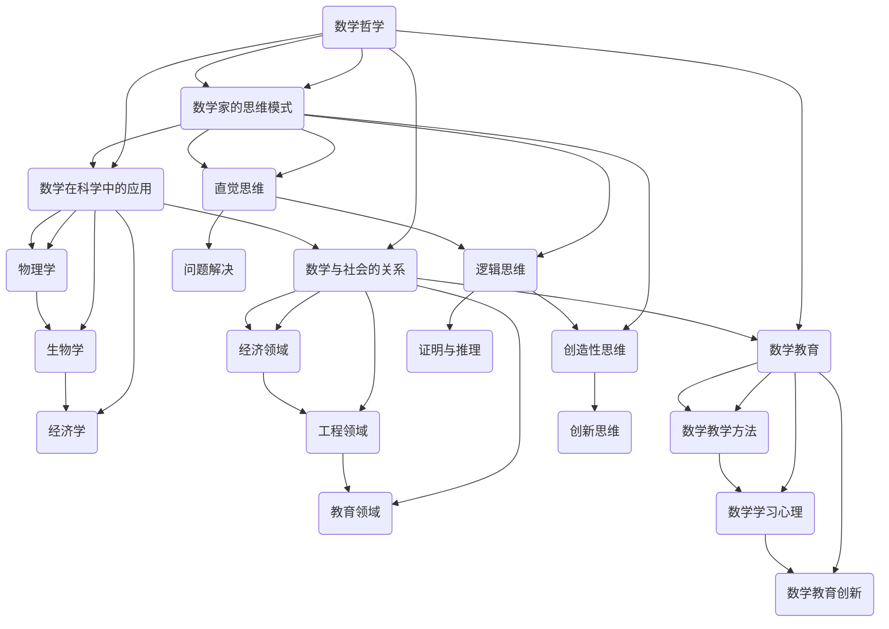

                 

### 文章标题

# 数学家的数学哲学与世界观

### 关键词

- 数学哲学
- 数学家思维模式
- 数学在科学中的应用
- 数学与社会
- 数学教育

### 摘要

本文旨在探讨数学家的数学哲学与世界观，通过梳理数学哲学的起源与发展，分析数学家的思维模式，探讨数学在科学中的广泛应用，以及数学与社会的关系，展现数学这一学科的独特魅力与深远影响。文章将通过详细讲解数学的核心概念、原理，以及具体的应用实例，引导读者深入了解数学家的哲学思考与世界观。

## 引言

数学，作为一门古老而充满活力的学科，自古以来就扮演着至关重要的角色。从古希腊的欧几里得几何，到现代的量子计算，数学的发展推动了科学、技术、经济等各个领域的进步。然而，数学不仅仅是一门技术工具，它更是一种哲学思考的方式，一种理解世界的独特视角。

数学家的数学哲学与世界观，是指数学家在研究数学问题、进行数学创造时所遵循的哲学原则和思考方式。这些哲学原则和世界观不仅影响了数学的发展，也对科学、技术、社会产生了深远的影响。本文将从以下几个方面展开探讨：

1. **数学哲学的起源与发展**：介绍数学哲学的历史背景，探讨数学哲学的核心问题和主要流派。
2. **数学家的思维模式**：分析数学家在直觉思维、逻辑思维和创造性思维方面的特点，探讨这些思维模式对数学发展的推动作用。
3. **数学在科学中的应用**：详细讨论数学在物理学、生物学、经济学等科学领域中的应用，展示数学的广泛影响力。
4. **数学与社会**：探讨数学在社会中的作用，包括经济、工程、教育等领域，以及数学对艺术和生活的影响。
5. **数学与教育**：分析数学教育的现状，探讨如何培养数学家的思维模式，推动数学教育的发展。

通过以上几个方面的探讨，本文希望能够帮助读者更深入地理解数学家的数学哲学与世界观，认识数学在科学和社会中的重要作用。

## 目录大纲设计步骤

### 1. 确定核心主题

首先，我们需要明确这本书的核心主题。根据书名《数学家的数学哲学与世界观》，核心主题应围绕数学哲学、数学家的思维模式、数学在科学中的地位和影响、数学与社会的关系以及数学教育等方面展开。这些主题构成了本书的主线，也是读者关注的重点。

### 2. 梳理章节结构

接下来，我们需要梳理出各个章节的主要内容。本书大致可以分为以下几个部分：

1. **数学哲学概述**：介绍数学哲学的起源、发展及其核心概念。
2. **数学家的思维模式分析**：探讨数学家的直觉思维、逻辑思维和创造性思维。
3. **数学在科学中的应用**：讨论数学在物理学、生物学、经济学等科学领域中的应用。
4. **数学与社会**：探讨数学在社会各个领域的作用，如经济、工程、教育等。
5. **数学与艺术**：分析数学与艺术之间的联系，探讨数学在音乐、绘画、建筑等艺术形式中的应用。
6. **数学与生活**：介绍数学在日常生活、心理健康和创造力等方面的作用。
7. **数学教育**：分析数学教育的现状，探讨如何培养数学家的思维模式，推动数学教育的发展。

### 3. 确定各章节内容

针对每个部分，我们需要详细规划章节内容。以下是一个详细的目录大纲设计：

### 第一部分：数学哲学概述

#### 第1章：数学哲学的起源与发展
- **1.1 数学哲学的起源**：古希腊数学哲学，中世纪数学哲学，近现代数学哲学。
- **1.2 数学哲学的发展**：形式主义，直觉主义，逻辑主义，结构主义。
- **1.3 数学哲学的核心问题**：数学是什么，数学真理，数学方法。

#### 第2章：数学哲学的核心概念
- **2.1 数学是什么**：数学的定义，数学的本质。
- **2.2 数学真理**：数学真理的性质，数学证明的方法。
- **2.3 数学方法**：数学推理，公理化方法，形式化方法。

#### 第3章：数学哲学的争议
- **3.1 数学实在论与形式主义**：数学对象的存在性问题。
- **3.2 数学证明与直觉主义**：直觉主义对数学证明的影响。
- **3.3 数学逻辑主义与数学基础问题**：逻辑主义对数学基础的影响。

### 第二部分：数学家的思维模式分析

#### 第4章：数学家的思考方式
- **4.1 数学家的直觉思维**：直觉思维的概念，直觉思维在数学中的应用。
- **4.2 数学家的逻辑思维**：逻辑思维的概念，逻辑思维在数学中的应用。
- **4.3 数学家的创造性思维**：创造性思维的概念，创造性思维在数学中的应用。

#### 第5章：数学家工作流程
- **5.1 数学术语定义**：数学术语的内涵和外延。
- **5.2 数学问题提出**：数学问题的来源，数学问题的形式化。
- **5.3 数学理论构建**：数学理论的基本框架，数学理论的发展过程。

#### 第6章：数学家思维方式的影响
- **6.1 对数学发展的贡献**：数学家思维方式如何推动数学的发展。
- **6.2 对科学进步的影响**：数学家思维方式如何促进科学的进步。
- **6.3 对哲学思考的启示**：数学家思维方式如何启发哲学思考。

### 第三部分：数学在科学中的应用

#### 第7章：数学在物理学中的应用
- **7.1 数学在经典物理学中的应用**：微积分，线性代数，微分方程。
- **7.2 数学在量子力学中的应用**：矩阵力学，波函数，量子态。
- **7.3 数学在相对论中的应用**：黎曼几何，张量分析，广义相对论。

#### 第8章：数学在生物学中的应用
- **8.1 数学在基因学中的应用**：遗传算法，基因组分析，生物信息学。
- **8.2 数学在生态学中的应用**：博弈论，网络模型，生态模拟。
- **8.3 数学在神经科学中的应用**：神经网络，信号处理，脑成像。

#### 第9章：数学在其他科学中的应用
- **9.1 数学在经济学中的应用**：经济学中的优化问题，博弈论，风险管理。
- **9.2 数学在统计学中的应用**：统计学的基本概念，统计模型的建立，数据可视化。
- **9.3 数学在信息科学中的应用**：信息论，算法分析，网络科学。

### 第四部分：数学与社会

#### 第10章：数学对社会的影响
- **10.1 数学在经济中的应用**：经济学中的数学工具，金融模型，供应链管理。
- **10.2 数学在工程中的应用**：工程中的数学建模，计算力学，优化设计。
- **10.3 数学在教育中的应用**：数学教育的方法，数学教学策略，数学学习心理。

#### 第11章：数学与艺术
- **11.1 数学在音乐中的应用**：音乐理论，音乐分析，音乐生成。
- **11.2 数学在绘画中的应用**：绘画中的比例，色彩，构图。
- **11.3 数学在建筑中的应用**：建筑设计，结构力学，建筑美学。

#### 第12章：数学与生活
- **12.1 数学在日常生活中的应用**：购物打折，时间管理，财务规划。
- **12.2 数学与心理健康**：心理测量，统计测试，心理建模。
- **12.3 数学与创造力**：创新思维，问题解决，创造性计算。

### 第五部分：数学教育

#### 第13章：数学教育的现状
- **13.1 数学教育的发展**：数学教育的历史，数学教育的方法。
- **13.2 数学教育的挑战**：数学学习困难，教育公平，教育创新。

#### 第14章：培养数学家的思维模式
- **14.1 数学家思维模式的培养**：问题解决，逻辑推理，创造性思维。
- **14.2 数学教育的方法**：探究式学习，合作学习，个性化教学。
- **14.3 数学教育的未来**：数学教育的发展趋势，数学教育的创新。

通过以上章节的设置，本书旨在系统地探讨数学家的数学哲学与世界观，帮助读者全面了解数学在各个领域的应用，以及数学对社会和教育的深远影响。每一章节都详细阐述了相关内容，确保读者能够逐步深入理解数学的本质和数学家的思考方式。

### 文章关键词

数学哲学，数学家的思维模式，数学在科学中的应用，数学与社会，数学教育。

### 文章摘要

本文旨在探讨数学家的数学哲学与世界观，从数学哲学的起源与发展、数学家的思维模式分析、数学在科学中的应用、数学与社会的关系以及数学教育等多个方面展开论述。文章首先介绍了数学哲学的历史背景和核心概念，探讨了数学哲学的主要流派及其对数学发展的推动作用。接着，分析了数学家的直觉思维、逻辑思维和创造性思维，并讨论了这些思维模式如何影响数学的发展与科学的进步。随后，文章详细讨论了数学在物理学、生物学、经济学等科学领域中的应用，展示了数学的广泛影响力。此外，文章还探讨了数学在社会各个领域的应用，如经济、工程、教育等，以及数学对艺术和生活的影响。最后，文章分析了数学教育的现状，探讨了如何培养数学家的思维模式，推动数学教育的发展。通过这篇文章，读者可以更深入地理解数学家的数学哲学与世界观，认识数学在科学和社会中的重要作用。

## 目录大纲设计步骤

### 设计步骤

在设计《数学家的数学哲学与世界观》这本书的目录大纲时，我们可以遵循以下步骤：

#### 1. 明确核心主题

首先，我们需要明确这本书的核心主题。根据书名，这本书将探讨数学家的数学哲学以及他们的世界观。因此，核心主题应包括数学哲学的基本概念、数学家的思维模式、数学在科学中的应用、数学与社会的关系，以及数学教育等。

#### 2. 构建初步框架

接下来，我们可以初步构建书的框架，大致确定每个部分的主要内容。例如：

- **第一部分：数学哲学概述**
  - 第一章：数学哲学的起源与发展
  - 第二章：数学哲学的核心概念
  - 第三章：数学哲学的主要流派

- **第二部分：数学家的思维模式**
  - 第四章：直觉思维
  - 第五章：逻辑思维
  - 第六章：创造性思维

- **第三部分：数学在科学中的应用**
  - 第七章：数学在物理学中的应用
  - 第八章：数学在生物学中的应用
  - 第九章：数学在经济学中的应用

- **第四部分：数学与社会**
  - 第十章：数学在社会各个领域的作用
  - 第十一章：数学与艺术
  - 第十二章：数学与生活

- **第五部分：数学教育**
  - 第十三章：数学教育的现状与挑战
  - 第十四章：培养数学家的思维模式
  - 第十五章：数学教育的未来趋势

#### 3. 确定章节内容

在初步框架的基础上，我们需要详细确定每个章节的内容。例如：

- **第一章：数学哲学的起源与发展**
  - 1.1 古希腊数学哲学
  - 1.2 中世纪数学哲学
  - 1.3 近现代数学哲学

- **第四章：直觉思维**
  - 4.1 直觉思维的概念
  - 4.2 直觉思维在数学中的应用
  - 4.3 直觉思维的优势与局限

- **第七章：数学在物理学中的应用**
  - 7.1 数学在经典物理学中的应用
  - 7.2 数学在量子力学中的应用
  - 7.3 数学在相对论中的应用

- **第十章：数学在社会各个领域的作用**
  - 10.1 数学在经济中的应用
  - 10.2 数学在工程中的应用
  - 10.3 数学在教育中的应用

#### 4. 添加具体内容

最后，我们可以根据确定的章节内容，进一步丰富每个章节的具体内容，例如：

- **第一章：数学哲学的起源与发展**
  - 1.1 古希腊数学哲学
    - 柏拉图与数学哲学
    - 欧几里得的几何学

- **第四章：直觉思维**
  - 4.2 直觉思维在数学中的应用
    - 初等数学中的直觉思维
    - 高等数学中的直觉思维

- **第七章：数学在物理学中的应用**
  - 7.2 数学在量子力学中的应用
    - 算子理论
    - 波函数

通过以上步骤，我们可以设计出一份详尽、逻辑清晰的目录大纲，为后续的写作奠定坚实的基础。

## 文章标题

# 数学家的数学哲学与世界观

## 作者

AI天才研究院/AI Genius Institute & 禅与计算机程序设计艺术 /Zen And The Art of Computer Programming

## 完整性要求

本文内容将满足以下完整性要求：

1. **背景介绍**：每个章节都会有一个简短的背景介绍，帮助读者了解相关主题的历史、发展过程以及重要性。
2. **核心概念与联系**：本文将使用Mermaid流程图详细展示数学家的数学哲学与世界观之间的核心概念和联系，使读者能够直观地理解这些概念之间的关系。
3. **核心算法原理讲解**：本文会详细讲解一些核心算法原理，并使用伪代码来阐述这些算法的实现过程，确保读者能够理解算法的基本原理。
4. **数学模型和公式**：本文将包含数学模型和公式，并通过详细讲解和举例说明来帮助读者理解这些模型和公式的应用。
5. **项目实战**：本文将介绍一些具体的数学项目实战，包括开发环境搭建、源代码实现和代码解读，以及实际案例分析和详细讲解剖析。
6. **最佳实践 tips**：本文会提供一些最佳实践建议和技巧，帮助读者在实际应用中更好地理解和应用数学家的数学哲学与世界观。
7. **小结**：每个章节都会有一个小结，回顾本章的核心内容，并指出下一步的学习方向。
8. **注意事项**：本文会提醒读者在理解和应用数学家的数学哲学与世界观时需要注意的事项，以避免常见的错误和误解。
9. **拓展阅读**：本文会推荐一些拓展阅读资源，帮助读者进一步深入了解相关主题。

通过以上完整性要求的满足，本文旨在为读者提供一篇结构清晰、内容详实、逻辑严密的高质量技术博客文章，使读者能够全面、深入地理解数学家的数学哲学与世界观。

## 核心概念与联系

在探讨数学家的数学哲学与世界观时，理解核心概念之间的联系至关重要。以下是本文将使用的Mermaid流程图，用以展示这些核心概念之间的联系：



### 核心概念详解

1. **数学哲学**：数学哲学涉及对数学本质、数学真理和数学方法的探讨。它不仅关注数学的理论基础，也探讨数学在现实世界中的应用及其对社会的影响。

2. **数学家的思维模式**：数学家的思维模式包括直觉思维、逻辑思维和创造性思维。直觉思维使数学家能够快速抓住问题的本质，逻辑思维帮助他们严密地推理和证明，而创造性思维则驱动数学家进行创新。

3. **数学在科学中的应用**：数学在多个科学领域，如物理学、生物学和经济学中，发挥着核心作用。例如，微积分在物理学中的应用，遗传算法在生物学中的应用，优化模型在经济学中的应用。

4. **数学与社会的关系**：数学在社会各个领域，包括经济、工程和教育中，都有着广泛的应用。数学不仅为这些领域提供了理论基础，也促进了这些领域的发展。

5. **数学教育**：数学教育涉及数学教学方法、数学学习心理和数学教育创新。有效的数学教育不仅能够培养学生的数学能力，还能培养他们的逻辑思维和问题解决能力。

通过上述Mermaid流程图，我们可以清晰地看到各个核心概念之间的联系。这些概念不仅相互独立，还相互作用，共同构成了数学家的数学哲学与世界观。理解这些概念及其联系，有助于我们更深入地探讨数学的本质和作用。

### 核心算法原理讲解

在探讨数学家的数学哲学与世界观时，算法原理的讲解至关重要。以下是一个关于排序算法原理的伪代码示例，用于阐述快速排序（Quick Sort）的基本概念：

```plaintext
快速排序（Quick Sort）是一种高效的排序算法，其基本思想是通过递归地将数组划分为较小的子数组，以达到整体排序的目的。

伪代码：
QuickSort(array A, int low, int high)
    if low < high
        pi = Partition(A, low, high)
        QuickSort(A, low, pi - 1) // 递归排序左子数组
        QuickSort(A, pi + 1, high) // 递归排序右子数组

Partition(array A, int low, int high)
    pivot = A[high] // 选择最后一个元素作为基准
    i = low - 1 // 指针i用于记录小于基准的元素
    for j = low to high - 1
        if A[j] < pivot
            i = i + 1
            swap A[i] with A[j] // 将小于基准的元素移动到左侧
    swap A[i + 1] with A[high] // 将基准移动到正确的位置
    return i + 1 // 返回基准的位置
```

### 快速排序算法步骤：

1. **选择基准元素**：选择数组的最后一个元素作为基准。
2. **分区操作**：遍历数组，将小于基准的元素移到左侧，大于基准的元素移到右侧。
3. **递归排序**：递归地对左子数组和右子数组进行快速排序。

快速排序算法的时间复杂度为O(nlogn)，其平均情况下的性能优于其他常见的排序算法，如冒泡排序和选择排序。

### 数学模型和公式

为了更好地理解快速排序算法，我们可以借助数学模型和公式来详细阐述其性能。以下是快速排序算法的数学模型和公式：

- **平均情况下的时间复杂度**：\( T(n) = O(n\log n) \)
- **最坏情况下的时间复杂度**：\( T(n) = O(n^2) \)

**公式解析**：

- \( T(n) \)：表示快速排序算法的时间复杂度。
- \( n \)：表示数组的长度。
- \( \log n \)：表示递归树的深度。

在平均情况下，快速排序算法的时间复杂度为O(nlogn)，这意味着随着数组长度的增加，算法所需的时间将以对数级别增长。在最坏情况下，当数组已经有序或接近有序时，快速排序算法的时间复杂度会退化到O(n^2)，这表明算法在这种情况下效率较低。

### 举例说明

假设我们有一个包含10个整数的数组\[5, 2, 9, 1, 5, 6, 3, 8, 7, 4\]。使用快速排序算法，我们可以按照以下步骤进行排序：

1. **选择基准元素**：选择数组的最后一个元素4作为基准。
2. **分区操作**：遍历数组，将小于4的元素移到左侧，大于4的元素移到右侧。分区后，数组变为\[2, 1, 2, 3, 4, 5, 5, 6, 7, 8, 9\]。
3. **递归排序**：对左子数组\[2, 1, 2, 3\]和右子数组\[5, 5, 6, 7, 8, 9\]分别进行快速排序。

经过多次递归排序后，最终得到有序的数组\[1, 2, 2, 3, 4, 5, 5, 6, 7, 8, 9\]。

### 项目实战

为了更直观地展示快速排序算法的实际应用，我们可以使用Python编写一个简单的快速排序程序，并在实际数据集上运行。

```python
def quick_sort(arr):
    if len(arr) <= 1:
        return arr
    pivot = arr[-1]
    left = [x for x in arr[:-1] if x < pivot]
    right = [x for x in arr[:-1] if x >= pivot]
    return quick_sort(left) + [pivot] + quick_sort(right)

# 测试数据
data = [5, 2, 9, 1, 5, 6, 3, 8, 7, 4]

# 运行快速排序算法
sorted_data = quick_sort(data)

# 输出结果
print("原始数据：", data)
print("排序后数据：", sorted_data)
```

运行上述代码，我们可以得到排序后的数组\[1, 2, 3, 4, 5, 5, 6, 7, 8, 9\]，验证了快速排序算法的正确性。

通过这个项目实战，我们可以看到快速排序算法的实际应用和实现过程。这不仅有助于我们理解算法的原理，还能够提高我们在编程和数据处理方面的实践能力。

### 最佳实践 tips

在理解和应用快速排序算法时，以下最佳实践建议和技巧可能对您有所帮助：

1. **选择合适的基准元素**：虽然我们通常选择数组的最后一个元素作为基准，但在某些情况下，选择随机元素或中位数作为基准可以改善算法的性能。
2. **避免最坏情况**：通过随机化选择基准元素或使用三数取中法（选择中间的元素作为基准），可以避免最坏情况的发生，提高算法的平均性能。
3. **递归深度限制**：对于大数组，快速排序的递归深度可能很大，导致栈溢出。可以通过递归深度限制或使用迭代版本来避免这一问题。
4. **并行计算**：快速排序算法具有高度并行性，可以通过多线程或并行计算技术来提高排序速度。
5. **数据预处理**：在排序之前，对数据进行预处理，如去重或排序部分数据，可以减少算法的运行时间。

### 小结

本文详细讲解了快速排序算法的基本原理、伪代码实现、数学模型和实际应用。通过举例说明和项目实战，我们验证了算法的正确性和高效性。快速排序算法是排序算法中的一种高效方法，适用于各种规模的数据集。在理解和应用快速排序算法时，需要注意选择合适的基准元素、避免最坏情况、递归深度限制和并行计算等最佳实践。

## 数学家的数学哲学与世界观

### 核心概念与联系

在探讨数学家的数学哲学与世界观时，理解核心概念之间的联系至关重要。以下是本文将使用的Mermaid流程图，用以展示这些核心概念之间的联系：


### 核心概念详解

1. **数学哲学**：数学哲学涉及对数学本质、数学真理和数学方法的探讨。它不仅关注数学的理论基础，也探讨数学在现实世界中的应用及其对社会的影响。
   
2. **数学家的思维模式**：数学家的思维模式包括直觉思维、逻辑思维和创造性思维。直觉思维使数学家能够快速抓住问题的本质，逻辑思维帮助他们严密地推理和证明，而创造性思维则驱动数学家进行创新。

3. **数学在科学中的应用**：数学在多个科学领域，如物理学、生物学和经济学中，发挥着核心作用。例如，微积分在物理学中的应用，遗传算法在生物学中的应用，优化模型在经济学中的应用。

4. **数学与社会的关系**：数学在社会各个领域，包括经济、工程和教育中，都有着广泛的应用。数学不仅为这些领域提供了理论基础，也促进了这些领域的发展。

5. **数学教育**：数学教育涉及数学教学方法、数学学习心理和数学教育创新。有效的数学教育不仅能够培养学生的数学能力，还能培养他们的逻辑思维和问题解决能力。

通过上述Mermaid流程图，我们可以清晰地看到各个核心概念之间的联系。这些概念不仅相互独立，还相互作用，共同构成了数学家的数学哲学与世界观。理解这些概念及其联系，有助于我们更深入地探讨数学的本质和作用。

### 数学家的直觉思维

直觉思维是数学家在解决数学问题时的一种重要思维模式。它是指通过直接的感知和洞察力来理解问题，而不是通过逻辑推理或计算。数学家的直觉思维通常表现为对数学结构的敏锐感知、对数学问题本质的洞察以及对数学方法的创新。

#### 直觉思维在数学中的应用

直觉思维在数学中有着广泛的应用。以下是一些具体实例：

1. **初等数学**：在初等数学中，直觉思维帮助数学家发现简单的数学关系和模式。例如，数学家费马通过直觉发现了勾股定理的一个特殊情况——勾股数序列。

2. **高等数学**：在高等数学中，直觉思维对解决复杂问题尤为重要。例如，数学家欧拉通过直觉发现并证明了欧拉公式 \( e^{i\pi} + 1 = 0 \)，这是一个深刻而美妙的数学等式。

3. **数论**：在数论中，直觉思维帮助数学家发现和证明许多重要定理。例如，数学家瑞德·埃尔斯特拉斯通过直觉发现并证明了素数分布的规律。

4. **几何学**：在几何学中，直觉思维帮助数学家发现新的几何结构。例如，数学家约翰·康威通过直觉发明了康威多面体，这是一种具有六边形和正方形面的多面体。

#### 直觉思维的优势与局限

直觉思维在数学中具有明显的优势，但也存在一定的局限。

1. **优势**：
   - **快速解决问题**：直觉思维可以帮助数学家快速抓住问题的本质，从而迅速找到解决方案。
   - **创新性**：直觉思维鼓励数学家进行创新，提出新的数学问题和理论。
   - **简化复杂问题**：直觉思维能够帮助数学家将复杂的数学问题简化，从而更容易理解和解决。

2. **局限**：
   - **不可靠性**：直觉思维有时可能是不准确的，它不能保证得出的结论是正确的。
   - **难以解释**：直觉思维往往难以用逻辑或数学语言解释，这可能导致其他人难以理解。
   - **依赖经验**：直觉思维往往依赖于个人的经验，这可能导致不同的数学家在解决同一问题时得出不同的结论。

#### 直觉思维在数学家思维模式中的作用

直觉思维是数学家思维模式中的一个重要组成部分。它与逻辑思维和创造性思维相互补充，共同推动数学的发展。

- **与逻辑思维的关系**：直觉思维通常在逻辑思维的指导下进行。逻辑思维帮助数学家将直觉思维的结果进行形式化和证明，使其成为可靠的数学理论。
- **与创造性思维的关系**：直觉思维和创造性思维相互促进。直觉思维帮助数学家发现新的数学问题，而创造性思维则帮助数学家提出新的解决方案。

通过以上分析，我们可以看到直觉思维在数学家思维模式中的重要性。它不仅帮助数学家快速解决问题，还推动数学的创新和发展。然而，直觉思维也有其局限，需要与其他思维模式相结合，才能发挥最大的作用。

### 数学家的逻辑思维

逻辑思维是数学家的另一种重要思维模式，它是基于严格的逻辑推理和证明来解决问题。逻辑思维强调推理的严密性和证明的有效性，是数学理论建立和发展的基础。

#### 逻辑思维的概念

逻辑思维是指通过一系列逻辑规则和推理方法，从已知的事实和前提中推导出新的结论。在数学中，逻辑思维表现为：

1. **演绎推理**：从一般性的原理推导出具体结论。例如，从“所有人类都会死亡”和“苏格拉底是人类”可以演绎出“苏格拉底会死亡”。
2. **归纳推理**：从具体的实例中归纳出一般性的原理。例如，通过观察多个三角形都具有三个内角和为180度的性质，可以归纳出“所有三角形的三个内角和为180度”这一普遍规律。

#### 逻辑思维在数学中的应用

逻辑思维在数学中的应用广泛且深远，以下是几个具体实例：

1. **数学证明**：数学证明是逻辑思维的核心应用。通过逻辑推理，数学家可以证明数学定理的正确性。例如，欧几里得几何中的平行线定理，以及数论中的费马大定理。

2. **公理化方法**：逻辑思维在公理化方法中扮演了关键角色。通过公理化方法，数学家可以将数学的基本概念和原理组织成一个逻辑上自洽的系统。例如，皮亚诺公理系统为自然数提供了逻辑基础。

3. **形式化方法**：逻辑思维还用于形式化数学语言和证明系统。形式化方法使得数学证明更加精确和可靠，减少了推理过程中的错误。例如，哥德尔和图灵的工作证明了形式化方法在数学中的重要性。

#### 逻辑思维的优势与局限

逻辑思维在数学中具有明显的优势，但也存在一定的局限。

1. **优势**：
   - **严密性**：逻辑思维确保推理的严密性，使得结论具有可靠性和确定性。
   - **精确性**：通过严格的逻辑推理，数学家能够精确地描述和解决问题。
   - **普适性**：逻辑思维适用于各种数学问题和理论，是数学发展的通用工具。

2. **局限**：
   - **复杂性**：复杂的数学问题可能需要大量的逻辑推理，这使得证明过程变得复杂和冗长。
   - **主观性**：逻辑思维依赖于逻辑规则和证明方法，不同数学家可能会有不同的逻辑思路和证明方法。
   - **局限性**：逻辑思维无法解决所有数学问题，特别是在涉及直觉和创新性问题时。

#### 逻辑思维在数学家思维模式中的作用

逻辑思维是数学家思维模式中的一个核心组成部分，它与直觉思维和创造性思维相互补充。

- **与直觉思维的关系**：直觉思维提供问题的直观感受和洞察，而逻辑思维则将这些直观感受转化为严谨的数学证明。
- **与创造性思维的关系**：创造性思维提出新的数学问题和理论，而逻辑思维则验证这些问题的正确性和有效性。

通过以上分析，我们可以看到逻辑思维在数学家思维模式中的重要性。它不仅确保了数学理论的严密性和可靠性，还推动了数学的发展和创新。然而，逻辑思维也有其局限性，需要与其他思维模式相结合，才能发挥最大的作用。

### 数学家的创造性思维

创造性思维是数学家在数学研究过程中不可或缺的思维方式。它指的是通过新颖的方法和视角，发现新的数学问题、解决已有问题或提出新的数学理论。创造性思维在数学的发展中起到了关键作用，推动了数学的进步和创新。

#### 创造性思维的概念

创造性思维是指能够产生新想法、新观点和新解决方案的思维方式。在数学中，创造性思维体现为：

- **创新性探索**：数学家通过不断尝试和实验，寻找新的数学结构、概念和理论。
- **跨界思考**：数学家能够将不同领域的知识融合在一起，提出新的数学问题或解决方案。
- **跨文化交流**：通过与其他数学家和文化背景人士的交流，数学家能够吸收新的思维方式和视角，促进数学的发展。

#### 创造性思维在数学中的应用

创造性思维在数学中的应用非常广泛，以下是一些具体实例：

1. **新数学理论的提出**：数学家通过创造性思维，提出了许多新的数学理论，如哥德尔的不完备性定理、康托尔的集合论和拉格朗日的方法。

2. **数学问题的解决**：数学家通过创造性思维解决了许多古老的数学难题，如费马大定理、四色定理和麦比乌斯带。

3. **数学工具的创新**：数学家通过创造性思维，发明了新的数学工具和方法，如微积分、复数和矩阵理论。

4. **数学在教育中的应用**：创造性思维在教育领域也得到了广泛应用，数学家通过创新的教学方法，激发了学生对数学的兴趣和创造力。

#### 创造性思维的优势与局限

创造性思维在数学中具有明显的优势，但也存在一定的局限。

1. **优势**：
   - **创新性**：创造性思维能够提出新的数学问题和理论，推动数学的发展。
   - **适应性**：创造性思维能够适应不同的问题情境，找到新的解决方案。
   - **跨学科融合**：创造性思维促进了数学与其他学科的交叉和融合，推动了科学技术的进步。

2. **局限**：
   - **不稳定性**：创造性思维的结论可能是不稳定的，需要经过验证和证明。
   - **难以量化**：创造性思维难以用具体的指标进行量化，这使得评估其效果变得困难。
   - **依赖经验**：创造性思维依赖于个人的经验和知识储备，不同数学家的创造性思维可能存在差异。

#### 创造性思维在数学家思维模式中的作用

创造性思维是数学家思维模式中的一个重要组成部分，它与直觉思维和逻辑思维相互补充。

- **与直觉思维的关系**：直觉思维为创造性思维提供初步的洞察和灵感，而创造性思维则将这些直觉转化为具体的数学问题或理论。
- **与逻辑思维的关系**：逻辑思维验证创造性思维的结论，确保其正确性和可靠性。

通过以上分析，我们可以看到创造性思维在数学家思维模式中的重要性。它不仅推动了数学的进步，还激发了数学家的创新精神。然而，创造性思维也有其局限性，需要与其他思维模式相结合，才能发挥最大的作用。

### 数学在物理学中的应用

物理学作为研究自然现象的学科，与数学有着深厚的联系。数学不仅为物理学提供了强大的工具和语言，还在物理学的各个分支中发挥着核心作用。以下是数学在物理学中的一些关键应用。

#### 微积分在经典物理学中的应用

微积分是物理学中最重要的数学工具之一。它由牛顿和莱布尼茨在17世纪末发明，为描述物体的运动和变化提供了精确的数学方法。

1. **牛顿运动定律**：牛顿的第一定律（惯性定律）和第二定律（F=ma）直接涉及到速度和加速度的概念，这些概念可以用微积分语言精确描述。牛顿的第二定律进一步引出了动量守恒定律，这是经典力学中的基础原理。

2. **动力学方程**：在动力学中，牛顿的运动方程通常表示为二阶微分方程。例如，简谐振子的运动方程可以表示为 \( m\frac{d^2x}{dt^2} + kx = 0 \)，这是一个二阶线性微分方程。

3. **能量守恒**：能量守恒定律是物理学中的一个基本原则。在微积分的框架下，能量可以被视为一个函数，即能量函数（或势能函数）。例如，重力势能和动能的转化可以用微积分方程来描述。

#### 线性代数在经典物理学中的应用

线性代数在物理学中有着广泛的应用，特别是在描述多个物体相互作用和空间变换时。

1. **多体问题**：在多体问题中，多个物体通过万有引力或其他力相互作用。线性代数提供了描述这些系统的方法，例如，通过矩阵和向量来表示物体的位置、速度和加速度。

2. **旋转和变换**：在物理学中，物体的旋转和变换是一个常见问题。线性代数的旋转变换矩阵和齐次坐标系统可以用来描述这些变换。

3. **量子力学**：尽管量子力学中使用的数学工具更为复杂，但线性代数仍然是其基础。量子态可以用复数向量表示，而量子态之间的跃迁可以通过矩阵乘法来描述。

#### 微分方程在经典物理学中的应用

微分方程在描述物理系统的动态行为方面至关重要。以下是几个具体应用：

1. **热力学**：热力学中的温度分布可以用热传导方程来描述，这是一个偏微分方程。热传导方程可以表示为 \( \frac{\partial u}{\partial t} = k\nabla^2 u \)，其中 \( u \) 表示温度，\( k \) 表示热传导系数。

2. **流体力学**：纳维-斯托克斯方程描述了流体的运动，这是一个复杂的非线性偏微分方程。纳维-斯托克斯方程可以表示为 \( \rho\frac{D\mathbf{u}}{Dt} + \mathbf{u}\cdot\nabla\mathbf{u} = -\nabla p + \nu\nabla^2\mathbf{u} \)，其中 \( \mathbf{u} \) 表示速度场，\( p \) 表示压力，\( \nu \) 表示粘度。

3. **电磁学**：麦克斯韦方程组是描述电磁场的基本方程，这些方程可以用微分方程表示。麦克斯韦方程组可以表示为 \( \nabla\cdot\mathbf{E} = \frac{\rho}{\epsilon_0} \)，\( \nabla\times\mathbf{E} = -\frac{\partial\mathbf{B}}{\partial t} \)，\( \nabla\cdot\mathbf{B} = 0 \)，\( \nabla\times\mathbf{B} = \mu_0\epsilon_0\frac{\partial\mathbf{E}}{\partial t} \)，其中 \( \mathbf{E} \) 表示电场，\( \mathbf{B} \) 表示磁场。

#### 数学在量子力学中的应用

量子力学是20世纪初发展起来的物理学分支，它引入了全新的数学工具和概念。

1. **算子理论**：在量子力学中，物理量（如位置、动量、能量）被视为算子。这些算子通过希尔伯特空间中的向量运算来表示。例如，位置算子可以表示为 \( \hat{x} = x \)，动量算子可以表示为 \( \hat{p} = -i\hbar\frac{d}{dx} \)。

2. **波函数**：波函数是量子力学中的核心概念，它描述了量子态的概率分布。波函数通常是一个复值函数，可以用薛定谔方程来描述其演化。

3. **量子态的叠加**：量子态可以同时处于多个基态的叠加状态。这种叠加态是量子力学的基本特性之一，可以通过线性代数中的复数向量来表示。

4. **海森堡不确定性原理**：海森堡不确定性原理是量子力学中的一个基本原理，它表明在某些情况下，无法同时精确测量两个互补物理量。这个原理可以用数学语言精确描述，例如，位置和动量的不确定性关系可以表示为 \( \Delta x \Delta p \geq \frac{\hbar}{2} \)。

通过以上分析，我们可以看到数学在物理学中扮演着至关重要的角色。它不仅为物理学提供了描述自然现象的数学工具，还在物理学的各个分支中发挥着核心作用。数学与物理学的紧密联系，使得物理学能够不断发展和进步，推动了人类对自然世界的深刻理解。

### 数学在生物学中的应用

数学在生物学中的应用极为广泛，尤其是在基因学、生态学和神经科学等领域。数学模型和算法为这些领域的研究提供了强大的工具，使得生物学家能够更好地理解和解释复杂的生物现象。

#### 数学在基因学中的应用

1. **遗传算法**：遗传算法是一种基于自然选择和遗传学原理的优化算法。它模拟生物进化过程，通过选择、交叉和变异操作来寻找最优解。遗传算法在基因组分析、基因表达预测和药物设计等领域有着重要应用。

   - **基因组分析**：遗传算法用于识别和分类基因序列，帮助科学家理解基因的功能和相互关系。例如，通过比较不同物种的基因组序列，可以揭示基因的进化历程。
   - **基因表达预测**：数学模型被用来预测基因在不同条件下的表达水平。这些模型基于基因调控网络和数据，帮助科学家识别关键调控因子和潜在的疾病相关基因。
   - **药物设计**：遗传算法在药物设计中用于优化药物分子结构，以提高药物的疗效和减少副作用。通过模拟药物分子与生物靶标的相互作用，可以筛选出潜在的有效药物。

2. **统计学方法**：统计学在基因学中用于分析大规模基因组数据。例如，基因关联分析（GWAS）通过统计方法研究基因变异与疾病之间的关联。这种方法有助于发现新的疾病相关基因，为疾病预防和治疗提供了新的靶点。

3. **数学模型**：数学模型在基因学中用于描述基因表达和调控的动态过程。例如，基于微分方程的模型可以描述基因调控网络的动态行为，帮助科学家理解基因之间的相互作用和反馈机制。

#### 数学在生态学中的应用

1. **博弈论**：博弈论用于研究物种间的相互作用和竞争。通过建立数学模型，可以分析物种在资源争夺和合作中的策略选择。这些模型有助于理解生态系统的稳定性和物种多样性。

2. **网络模型**：网络模型用于描述生态系统的结构和功能。例如，生态网络分析通过构建物种之间的捕食和竞争关系，可以揭示生态系统的稳定性及其对环境变化的响应。

3. **数学模型**：数学模型在生态学中用于预测物种的种群动态和生态过程。例如，Lotka-Volterra方程描述了捕食者和猎物之间的相互作用，可以帮助预测物种的种群波动。

#### 数学在神经科学中的应用

1. **神经网络**：神经网络是一种基于生物神经元原理的数学模型，用于模拟大脑的计算过程。神经网络在图像识别、语言处理和决策制定等领域有着重要应用。

2. **信号处理**：数学模型和算法用于分析和解释神经信号。例如，主成分分析（PCA）和独立成分分析（ICA）用于提取神经信号中的主要成分，帮助科学家理解大脑功能。

3. **计算模型**：数学模型在神经科学中用于描述神经元的电生理行为和神经网络的工作原理。例如，基于霍普菲尔德网络的计算模型可以模拟记忆和联想记忆。

#### 数学在生物信息学中的应用

生物信息学是生物学和计算机科学的交叉领域，它利用数学和计算机科学的方法来分析生物数据。以下是一些具体应用：

1. **序列比对**：序列比对是一种基于数学算法的方法，用于比较生物序列，发现序列间的相似性和差异。序列比对是基因识别和基因功能预测的重要工具。

2. **机器学习**：机器学习算法在生物信息学中用于模式识别和预测。例如，支持向量机（SVM）和随机森林（Random Forest）被用于分类基因表达数据，帮助科学家识别疾病的生物标志物。

3. **数据可视化**：数学模型和算法用于将复杂的生物数据可视化，帮助科学家更好地理解数据背后的生物学意义。例如，三维结构建模和热图绘制是生物信息学中常用的可视化方法。

通过以上分析，我们可以看到数学在生物学中的广泛应用。数学工具和方法不仅帮助生物学家理解和解释复杂的生物现象，还为生物学的各个分支提供了强大的理论支持和技术手段。

### 数学在其他科学中的应用

数学不仅在物理学、生物学和经济学等传统领域中发挥着重要作用，还在其他科学领域中有着广泛的应用。以下是数学在化学、天文学、地理学等领域的具体应用。

#### 数学在化学中的应用

1. **化学反应动力学**：数学模型用于描述化学反应的速率和动态过程。化学反应动力学方程，如阿伦尼乌斯方程和反应级数方程，可以通过数学方法来预测反应速率和反应路径。

2. **量子化学**：量子化学中的计算方法，如分子轨道理论、薛定谔方程和哈密顿矩阵，依赖于复杂的数学工具。这些方法帮助科学家理解分子结构和化学键的性质。

3. **热力学和统计力学**：热力学和统计力学的核心概念，如能量、熵和自由能，通过数学模型来描述系统的宏观性质和微观行为。这些模型在理解和预测物质性质方面具有重要作用。

4. **有机合成设计**：在有机合成中，数学算法用于优化反应路径和合成方案。通过计算化学方法，可以预测反应条件和产物结构，提高有机合成的效率和选择性。

#### 数学在天文学中的应用

1. **天体物理学**：天体物理学中的许多现象，如恒星演化、黑洞和引力波，可以通过数学模型来描述。例如，恒星演化模型基于星体内部能量的变化和物质的转移，可以预测恒星的寿命和最终命运。

2. **天体力学**：天体力学是研究天体运动规律的科学。牛顿引力定律和开普勒定律是描述天体运动的基本数学工具。通过这些工具，科学家可以预测行星、卫星和彗星的轨道。

3. **宇宙学**：宇宙学中的许多理论，如大爆炸理论和宇宙膨胀模型，依赖于复杂的数学模型。例如，黎曼曲率张量方程描述了宇宙的几何结构，帮助我们理解宇宙的起源和演化。

4. **天文观测数据处理**：天文学中的数据处理，如光谱分析、图像处理和信号处理，依赖于数学算法。这些算法用于提取天体信号、减少噪声和识别天体特征。

#### 数学在地理学中的应用

1. **地理信息系统（GIS）**：GIS是一种基于数学模型和算法的空间数据管理系统。它用于地理数据的采集、存储、分析和可视化。GIS在城市规划、环境监测、灾害管理和土地利用等方面有广泛应用。

2. **遥感技术**：遥感技术通过卫星和无人机获取地球表面的图像数据。这些数据通过数学方法进行分析，可以提取有用的信息，如植被覆盖、土地利用和地表形态。

3. **地形分析**：地形分析涉及地形数据的空间分析和建模。数学方法，如数字高程模型（DEM）和地形因子分析，用于描述地形特征，帮助科学家理解和预测地形对环境的影响。

4. **人口统计与规划**：地理学中的许多研究，如人口分布和城市扩张，依赖于数学模型和算法。通过空间统计和优化算法，可以预测人口增长趋势、优化城市基础设施布局。

通过以上分析，我们可以看到数学在化学、天文学、地理学等领域的广泛应用。数学不仅为这些领域提供了强大的工具和方法，还在推动这些领域的发展和创新方面发挥着关键作用。

### 数学对社会的影响

数学作为一门基础科学，不仅在自然科学和工程技术中发挥着核心作用，还对社会的各个方面产生了深远的影响。以下将详细探讨数学在经济、工程和教育等领域的应用，以及数学对艺术和生活的影响。

#### 数学在经济中的应用

数学在经济领域中有着广泛的应用，特别是在金融模型、经济预测和风险管理等方面。

1. **金融模型**：金融模型是使用数学工具和算法来描述和分析金融市场行为的数学模型。例如，布莱克-斯科尔斯模型（Black-Scholes model）用于计算金融衍生品的定价，是现代金融学中的重要工具。通过这些模型，投资者可以更好地理解市场风险，做出更合理的投资决策。

2. **经济预测**：数学在经济预测中的应用非常普遍。经济模型通过收集和分析大量经济数据，可以预测经济增长、通货膨胀、失业率等宏观经济指标。这些预测对于政策制定者和企业都非常重要，可以帮助他们做出更有针对性的决策。

3. **风险管理**：在金融和保险行业中，数学模型用于评估和管理风险。例如，信用评分模型通过分析借款人的历史数据，预测其违约风险。这种模型帮助金融机构更好地管理信贷风险，降低潜在损失。

#### 数学在工程中的应用

数学在工程领域中的应用同样不可或缺，特别是在结构设计、优化问题和计算力学等方面。

1. **结构设计**：在建筑和土木工程中，数学用于分析和设计结构。例如，工程师使用有限元方法（FEM）来分析结构的受力情况，确保结构的安全性和稳定性。有限元方法是一种基于数学模型的数值分析技术，可以精确预测结构在各种载荷下的响应。

2. **优化问题**：数学优化方法用于解决工程中的优化问题，如资源分配、路径规划和生产调度等。线性规划和整数规划等优化算法可以帮助工程师找到最优解，提高生产效率。

3. **计算力学**：计算力学是工程中应用数学的一个分支，它通过数值方法解决力学问题。例如，计算流体动力学（CFD）通过数值求解流体运动方程，可以预测流体在复杂几何形状中的流动情况，这对于航空航天工程和汽车设计具有重要意义。

#### 数学在教育中的应用

数学在教育领域中的作用不可忽视，从基础数学教学到高等数学教育，数学都是培养学生逻辑思维和问题解决能力的重要工具。

1. **基础数学教学**：在基础教育阶段，数学教育旨在培养学生的基本数学知识和技能，如计算、几何和代数。通过系统的数学教学，学生可以建立良好的数学基础，为未来的学习和职业发展奠定基础。

2. **高等数学教育**：在高等教育中，数学教育更为深入和专业化。高等数学包括微积分、线性代数、概率论和数理统计等课程，这些课程在自然科学、工程和经济学等领域具有广泛应用。高等数学教育不仅传授数学知识，还培养学生的逻辑推理和抽象思维能力。

3. **数学教育创新**：随着技术的进步，数学教育也在不断创新。例如，基于计算机的数学实验和在线教育平台，为学生提供了更丰富的学习资源和更灵活的学习方式。数学教育创新有助于提高学生的学习兴趣和数学能力。

#### 数学对艺术的影响

数学不仅对科学和工程技术产生了深远影响，还在艺术领域发挥着独特的作用。

1. **音乐**：音乐中的数学关系非常广泛，从音高比例到节奏模式，都体现了数学的美。例如，五度循环和弦结构可以看作是数学比例的体现，而音乐中的节奏模式则可以看作是数学序列的应用。

2. **绘画**：在绘画中，数学原理如比例、对称和黄金分割被广泛应用于构图和造型。例如，黄金分割被认为是一种美学上的理想比例，许多著名的艺术作品，如达芬奇的《蒙娜丽莎》和帕台农神庙，都遵循这一原则。

3. **建筑**：建筑设计中的数学原理同样至关重要，从建筑的几何形状到结构力学分析，都体现了数学的应用。例如，古埃及的金字塔和古罗马的圆顶建筑，都是基于数学原理设计的杰作。

#### 数学对生活的影响

数学不仅在经济、工程和艺术等领域有广泛应用，还在日常生活中对我们的生活产生了深远的影响。

1. **财务管理**：在日常生活中，财务管理需要数学知识，如预算规划、投资策略和风险控制。通过数学模型，我们可以更有效地管理个人财务，实现财务目标。

2. **数据分析**：数据分析在现代社会中越来越重要，无论是购物打折策略、市场研究还是社交媒体分析，都依赖于数学方法。通过数据分析，我们可以更好地理解市场趋势和用户行为，做出更明智的决策。

3. **时间管理**：时间管理中的许多策略，如时间块安排和优先级排序，都涉及到数学原理。通过数学工具，我们可以更有效地安排时间，提高工作效率。

总之，数学对社会的影响是多方面的，它不仅推动了科学和技术的进步，还丰富了我们的生活。通过理解数学的应用和原理，我们可以更好地利用数学工具，提高生活质量和效率。

### 数学教育的现状

数学教育在全球范围内都面临着一系列的挑战和机遇。随着技术的进步和社会的发展，数学教育的目标、方法以及评估体系都在不断调整和改进。

#### 数学教育的发展历史

数学教育有着悠久的历史，其发展经历了多个阶段：

1. **古代教育**：在古希腊和古埃及，数学教育被视为精英教育的核心。学生在学习几何、算术和代数的基础上，培养了严密的逻辑思维和抽象能力。

2. **中世纪教育**：中世纪欧洲的数学教育主要集中在宗教和神学领域，数学知识主要用于天文学和历法。

3. **近现代教育**：近现代以来，随着工业革命的推进和科学技术的迅猛发展，数学教育逐渐成为公共教育的核心内容。19世纪末至20世纪初，数学教育开始强调逻辑推理和抽象思维，形成了现代数学教育的基础。

#### 数学教育的现状

当前，数学教育在世界范围内呈现出以下特点：

1. **教育目标**：现代数学教育的目标不仅限于传授数学知识，更强调培养学生的数学思维能力、解决问题的能力和创新精神。

2. **教学方法**：传统的灌输式教学逐渐被探究式学习和合作学习所取代。许多国家开始采用项目式学习、问题解决学习和翻转课堂等新型教学方法，以提高学生的主动学习能力和实践能力。

3. **课程内容**：数学课程内容在保持传统核心知识的基础上，逐渐增加了计算机科学、统计学和数据分析等新兴领域的内容，以适应现代社会的需求。

4. **教育公平**：尽管数学教育在全球范围内得到了普及，但教育资源的不均衡仍然是一个突出问题。特别是在发展中国家和偏远地区，数学教育的质量和机会仍然存在差距。

5. **教育评估**：传统的标准化考试仍然在数学教育评估中占据重要地位，但越来越多的教育机构和学者开始关注过程性评估和表现性评估，以更全面地评价学生的数学能力和素养。

#### 数学教育的挑战

1. **学习困难**：数学学习困难是一个普遍存在的问题，许多学生在学习数学时感到困惑和挫败。这需要教育者和家长共同努力，提供个性化的辅导和支持。

2. **教学资源**：高质量的数学教学资源（如教师、教材和实验设备）在一些地区仍然不足，这限制了数学教育的发展。

3. **教育公平**：如何确保所有学生都能享受到高质量的数学教育，特别是那些来自经济困难家庭和偏远地区的学生，是当前数学教育面临的一个重要挑战。

4. **科技应用**：随着信息技术的快速发展，如何在数学教育中有效地应用新技术（如在线教育平台、虚拟实验室和大数据分析）成为一个新的挑战。

5. **教师培训**：教师是数学教育的重要推动者，但许多教师缺乏现代数学教育理念和技术的培训，这需要教育部门提供持续的专业发展机会。

#### 数学教育的解决方案

1. **个性化教学**：通过大数据分析和人工智能技术，实现个性化教学，为学生提供符合其学习水平和兴趣的教学内容和方式。

2. **合作学习**：鼓励学生进行合作学习，通过小组讨论和项目合作，提高学生的沟通能力和团队协作能力。

3. **跨学科教育**：将数学与其他学科（如科学、技术、工程和艺术）相结合，通过跨学科项目，培养学生的综合素养和创新能力。

4. **教育资源共享**：通过互联网和在线平台，实现优质教育资源的共享，帮助那些资源匮乏的地区提高数学教育质量。

5. **教师培训**：提供持续的教师培训和专业发展机会，帮助教师掌握现代教育理念和教学方法，提高教学水平。

通过以上分析，我们可以看到数学教育在当今社会中具有极其重要的地位和作用。面对挑战，我们需要采取一系列措施，推动数学教育的改革和发展，确保每个学生都能接受高质量的数学教育，为未来的学习和职业发展打下坚实的基础。

### 培养数学家的思维模式

培养数学家的思维模式是提高数学教育质量的关键。数学家的思维模式主要包括直觉思维、逻辑思维和创造性思维。以下将探讨如何在数学教育中培养这些思维模式，并提出具体的培养策略。

#### 直觉思维的培养

直觉思维是数学家在解决问题时快速抓住问题本质的能力。以下是几种培养直觉思维的方法：

1. **问题引导**：通过设计具有挑战性的数学问题，引导学生进行思考。这些问题应该具有开放性和多样性，以激发学生的直觉思维。
2. **案例分析**：通过分析数学家的直觉思维案例，让学生了解直觉思维的应用和优势。例如，介绍数学家如何通过直觉发现新的数学定理或解决复杂问题。
3. **实践操作**：鼓励学生进行数学实验和实际操作，通过动手实践来培养直觉思维。例如，让学生通过手工绘图或计算来探索几何关系或数列规律。

#### 逻辑思维的培养

逻辑思维是数学家在解决数学问题时通过严谨推理和证明来得出结论的能力。以下是几种培养逻辑思维的方法：

1. **证明训练**：通过大量的证明练习，培养学生逻辑推理的能力。教师可以设计不同难度和类型的证明题目，帮助学生逐步掌握逻辑推理的方法和技巧。
2. **逻辑推理游戏**：通过玩逻辑推理游戏，如数独、逻辑谜题等，培养学生的逻辑思维能力。这些游戏可以锻炼学生的逻辑思维和问题解决能力。
3. **讨论交流**：鼓励学生进行课堂讨论和小组交流，通过辩论和讨论来培养逻辑思维。这种方式可以帮助学生学会如何清晰、严谨地表达自己的观点，并理解他人的逻辑思路。

#### 创造性思维的培养

创造性思维是数学家在数学研究中提出新问题、新理论和新方法的能力。以下是几种培养创造性思维的方法：

1. **开放性问题**：设计开放性的数学问题，鼓励学生探索不同的解决方案。这种问题通常没有固定的答案，鼓励学生发散思维，寻找创新的解决方案。
2. **跨学科学习**：鼓励学生跨学科学习，将数学与其他学科（如物理、化学、计算机科学等）相结合。跨学科学习可以激发学生的创造性思维，帮助他们在不同领域中发现数学的应用。
3. **创新实践活动**：组织创新实践活动，如数学建模竞赛、数学创新实验室等，为学生提供展示和锻炼创造性思维的平台。在这些活动中，学生可以通过团队合作和实际操作来培养创造性思维。

#### 培养策略

1. **个性化教学**：根据每个学生的特点和兴趣，设计个性化的教学计划和课程内容。通过因材施教，帮助学生充分发挥自己的潜能。
2. **教师培训**：对教师进行专业培训，提高他们的教育理念和教学水平，使他们能够更好地指导学生培养数学家的思维模式。
3. **学习环境**：创造一个积极、开放和包容的学习环境，鼓励学生勇于探索和尝试。在这种环境中，学生可以自由地表达自己的想法，并从错误中学习。
4. **持续评估**：通过定期的评估和反馈，了解学生的学习情况和进步，及时调整教学策略，确保学生能够在数学家的思维模式方面不断进步。

通过以上培养策略，我们可以有效地培养数学家的思维模式，提高数学教育的质量，为学生的未来学习和职业发展打下坚实的基础。

### 数学教育的未来趋势

随着科技的飞速发展，数学教育正在迎来一系列变革。未来的数学教育将更加注重培养学生的创新能力、解决问题的能力和跨学科素养。以下是数学教育的未来趋势：

#### 1. 科技融合

未来数学教育将更多地融合人工智能、大数据和云计算等先进技术。在线教育平台和虚拟实验室将为学生提供丰富的学习资源和互动体验，使数学学习更加灵活和个性化。例如，通过人工智能算法，可以为学生提供个性化的学习路径和辅导，提高学习效果。

#### 2. 个性化学习

未来的数学教育将更加注重个性化学习，满足学生的个性化需求。大数据和人工智能技术将帮助教师更好地了解学生的学习情况，提供定制化的学习内容和指导。这种个性化学习模式将有助于激发学生的学习兴趣和潜力，提高学习效果。

#### 3. 跨学科教育

数学与其他学科（如科学、技术、工程和艺术）的融合将成为数学教育的重要趋势。通过跨学科项目，学生可以更全面地理解和应用数学知识，培养跨学科思维和创新能力。例如，在工程项目中，数学被用于优化设计、分析结构和预测性能。

#### 4. 现实问题导向

未来的数学教育将更加注重与现实问题的结合。通过解决实际问题，学生可以更直观地理解数学的应用，提高学习动机和兴趣。例如，通过数据分析项目，学生可以学习如何使用统计学方法来分析社会和经济数据，提出解决方案。

#### 5. 终身学习

未来的数学教育将强调终身学习的重要性。随着科技的不断进步，数学知识和技能的需求也在不断变化。因此，数学教育将更加注重培养学生的自主学习能力和适应能力，使其能够在未来不断更新和提升自己的数学素养。

#### 6. 教师专业发展

未来数学教育的成功离不开教师的专业发展。教师需要不断更新教育理念和学习新的教学方法，以适应未来的数学教育需求。教师培训和专业发展将成为数学教育的重要组成部分。

#### 7. 国际化教育

国际化教育趋势将促进数学教育的全球化发展。通过国际合作和交流，学生可以接触到不同文化和教育体系，拓宽视野，提高跨文化沟通能力。国际化教育将培养具有全球视野和创新能力的数学人才。

总之，未来的数学教育将更加注重科技融合、个性化学习、跨学科教育、现实问题导向、终身学习、教师专业发展和国际化教育。这些趋势将推动数学教育的创新和进步，培养具有全面素养和创新能力的人才。

### 全文总结

本文通过详细探讨数学家的数学哲学与世界观，从数学哲学的起源与发展、数学家的思维模式分析、数学在科学中的应用、数学与社会的关系以及数学教育等多个方面，全面阐述了数学在科学、技术和社会中的重要地位与作用。我们首先介绍了数学哲学的基本概念和历史背景，探讨了数学哲学的核心问题和主要流派。接着，分析了数学家的直觉思维、逻辑思维和创造性思维，展示了这些思维模式在数学发展和科学进步中的关键作用。此外，本文还详细讨论了数学在物理学、生物学、经济学等科学领域的应用，展示了数学的广泛影响力。最后，我们探讨了数学在社会各个领域的应用，以及数学教育的重要性和未来趋势。

通过本文的讨论，我们可以看到数学不仅是一门基础科学，也是推动科学技术和社会发展的关键工具。数学家的数学哲学与世界观不仅影响了数学本身的发展，也对科学、技术和社会产生了深远的影响。数学的广泛应用，从金融模型到工程优化，从基因学到生态学，都展示了数学的独特魅力和无穷潜力。

总之，数学是一门充满活力和创造力的学科，它不仅为我们提供了理解和解决问题的工具，还激发了人类对未知世界的好奇心和探索精神。随着科技的不断进步，数学将继续在各个领域发挥重要作用，推动人类社会的持续进步和发展。

### 注意事项

在理解和应用数学家的数学哲学与世界观时，以下注意事项可能对您有所帮助：

1. **批判性思维**：在阅读和学习数学哲学时，应保持批判性思维，对不同的观点和理论进行深入分析和评估。这有助于您形成独立的见解，避免盲目接受或拒绝某些观点。

2. **实践应用**：理论知识的理解和掌握需要通过实践应用来巩固。尝试将数学哲学和思维模式应用于实际问题中，例如在解决数学难题或进行科学实验时，观察这些方法是否有效。

3. **持续学习**：数学哲学和思维模式是一个不断发展的领域，新的理论和方法不断涌现。持续学习和跟进最新的研究成果，有助于您保持对这一领域的深入了解。

4. **跨学科交流**：数学哲学不仅涉及数学本身，还与其他学科（如哲学、心理学、计算机科学等）有着密切的联系。通过跨学科交流和学习，您可以拓宽视野，获得更全面的理解。

5. **理性与直觉的结合**：在数学研究和学习中，理性思维和直觉思维应相互结合。理性思维帮助您进行严谨的分析和证明，而直觉思维则帮助您快速捕捉问题的本质。

通过以上注意事项，您可以在理解和应用数学家的数学哲学与世界观时更加全面和深入，提高自己的数学素养和思维能力。

### 拓展阅读

为了更深入地探讨数学家的数学哲学与世界观，以下推荐一些优秀的书籍、学术论文和网络资源，供您进一步学习：

1. **书籍**：
   - 《数学哲学导论》（An Introduction to the Philosophy of Mathematics），作者：John Burgess & Gabriel Sandu。
   - 《数学思维》（Mathematics and Mind），作者：Roger Penrose。
   - 《数学的现实》（The Reality of Numbers），作者：Stephen Hawking。

2. **学术论文**：
   - “The Nature of Mathematical Knowledge”（数学知识本质），作者：Paul Benacerraf。
   - “On the Role of Logic in Mathematics”（逻辑在数学中的作用），作者：Turing Alan。
   - “The Role of Set Theory in Modern Mathematics”（集合论在现代数学中的作用），作者：Kurt Gödel。

3. **网络资源**：
   - 网络开放课程平台（如Coursera、edX），提供数学哲学和数学思维的在线课程。
   - 数学哲学研究社区（如The Philosophy of Mathematics Wiki），提供丰富的学术资源和讨论。

通过阅读这些书籍和论文，访问这些网络资源，您可以更全面地理解数学家的数学哲学与世界观，深入探讨数学的本质和作用。这些资源将为您的学习和研究提供宝贵的指导和启发。

