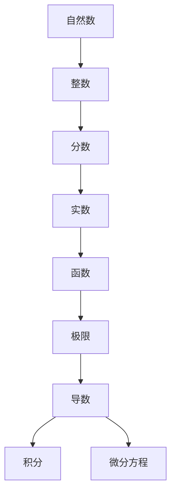
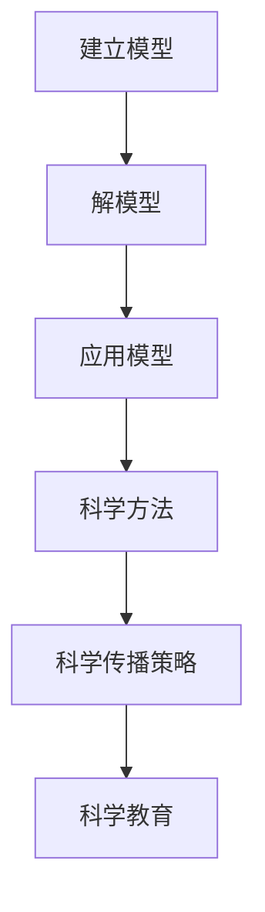

                 

### 设计大纲框架

在设计《数学家的数学普及与科学传播》的目录大纲时，我们需要首先明确书的核心目标，即普及数学知识和传播科学理念。为了实现这一目标，我们可以将大纲分为以下几个主要部分：

1. **引言部分**：为读者介绍数学普及与科学传播的重要性，介绍本书的结构安排，并提供阅读指南。
2. **数学普及**：详细讲解数学基础知识、高等数学和数学模型，让读者对数学有一个全面的理解。
3. **科学传播**：探讨科学方法、传播策略和科学教育，帮助读者理解如何有效地传播科学知识。
4. **附录部分**：提供数学家的作品选读、名言和相关资料链接，便于读者进一步学习。

在引言部分，我们还需要设置几个小节，分别是：
- **引言1.1**：数学普及与科学传播的重要性
- **引言1.2**：书籍结构安排
- **引言1.3**：阅读指南

在数学普及部分，我们可以设置以下小节：
- **数学普及2.1**：基础数学
    - **2.1.1**：数学基本概念
    - **2.1.2**：数学符号与语言
- **数学普及2.2**：高等数学
    - **2.2.1**：微积分
    - **2.2.2**：线性代数
- **数学普及2.3**：数学模型与应用
    - **2.3.1**：数学模型的基本原理
    - **2.3.2**：数学模型案例分析

在科学传播部分，我们可以设置以下小节：
- **科学传播3.1**：科学方法
    - **3.1.1**：科学研究的基本步骤
    - **3.1.2**：科学方法在数学中的应用
- **科学传播3.2**：科学传播策略
    - **3.2.1**：科学传播的目的与意义
    - **3.2.2**：科学传播的方式与方法
- **科学传播3.3**：科学教育
    - **3.3.1**：科学教育的目标与任务
    - **3.3.2**：科学教育的方法与手段

附录部分可以包括以下小节：
- **附录4.1**：数学家的数学普及与科学传播作品选读
- **附录4.2**：数学家的数学普及与科学传播名言
- **附录4.3**：数学家的数学普及与科学传播相关资料链接

通过这样的设计，我们的目录大纲既涵盖了数学普及与科学传播的核心内容，又保持了结构的清晰和逻辑性。

### 细化每个部分

在细化每个部分时，我们需要根据每个部分的主题和目标，进一步划分小节，并确定每个小节的具体内容。以下是对每个部分的具体细化：

#### 引言部分

**引言1.1** 数学普及与科学传播的重要性
- **引言**：介绍数学普及与科学传播的背景，阐述其在现代社会中的重要性。
- **意义**：讨论数学普及与科学传播对于个人发展、科技创新和社会进步的积极影响。
- **挑战**：分析当前数学普及与科学传播所面临的挑战和问题。

**引言1.2** 书籍结构安排
- **章节安排**：概述本书的整体结构，说明每个部分的内容和逻辑关系。
- **内容安排**：详细介绍每个章节的具体内容，帮助读者理解书中的知识点和学习路径。

**引言1.3** 阅读指南
- **目标读者**：明确本书的目标读者群体，包括学生、数学爱好者、科学工作者等。
- **阅读建议**：提供阅读本书的建议，包括学习方法、阅读顺序和练习方式。
- **后续学习**：介绍读者在完成本书学习后的进一步学习路径和资源推荐。

#### 数学普及

**数学普及2.1** 基础数学
- **2.1.1** 数学基本概念
    - **数的概念**：介绍自然数、整数、分数、实数等基本数学概念。
    - **函数的概念**：讲解函数的定义、性质和应用。
- **2.1.2** 数学符号与语言
    - **符号表示法**：解释常用数学符号的含义和用法。
    - **数学语言的理解与应用**：探讨数学语言的特点、学习方法和实际应用。

**数学普及2.2** 高等数学
- **2.2.1** 微积分
    - **微积分基本概念**：介绍微积分的定义、基本定理和基本运算。
    - **微积分算法与计算**：讲解微积分在实际问题中的应用和计算方法。
- **2.2.2** 线性代数
    - **线性代数基本概念**：阐述线性代数的基本概念，如向量、矩阵、行列式等。
    - **线性代数应用**：讨论线性代数在物理学、工程学等领域的应用。

**数学普及2.3** 数学模型与应用
- **2.3.1** 数学模型的基本原理
    - **建立数学模型的方法**：讲解如何从实际问题中建立数学模型。
    - **数学模型的应用领域**：介绍数学模型在不同领域的应用，如经济学、工程学等。
- **2.3.2** 数学模型案例分析
    - **案例一：经济学中的应用**：分析经济学中的数学模型，如供需模型、增长模型等。
    - **案例二：工程学中的应用**：讨论工程学中的数学模型，如结构分析模型、控制系统模型等。

#### 科学传播

**科学传播3.1** 科学方法
- **3.1.1** 科学研究的基本步骤
    - **提出问题**：讨论如何提出科学问题。
    - **假设与验证**：讲解科学假设的建立和验证过程。
- **3.1.2** 科学方法在数学中的应用
    - **数学证明的科学性**：探讨数学证明的科学方法和逻辑结构。
    - **数学问题的解决方法**：介绍解决数学问题的一般方法和技巧。

**科学传播3.2** 科学传播策略
- **3.2.1** 科学传播的目的与意义
    - **提高公众科学素养**：讨论科学传播对于提高公众科学素养的重要性。
    - **促进科学创新**：探讨科学传播如何促进科学创新和科技进步。
- **3.2.2** 科学传播的方式与方法
    - **传统传播方式**：介绍传统的科学传播方式，如书籍、讲座等。
    - **新媒体传播方式**：探讨新媒体在科学传播中的应用，如互联网、社交媒体等。

**科学传播3.3** 科学教育
- **3.3.1** 科学教育的目标与任务
    - **培养科学思维能力**：讨论科学教育的目标，如培养科学探究能力、批判性思维能力等。
    - **提高科学素养**：阐述科学教育的任务，如普及科学知识、培养科学精神等。
- **3.3.2** 科学教育的方法与手段
    - **传统教学方法**：介绍传统的科学教育方法，如课堂授课、实验等。
    - **现代教育技术手段**：探讨现代教育技术在科学教育中的应用，如在线课程、虚拟实验室等。

通过以上细化，我们可以确保每个部分的内容既丰富又具体，能够为读者提供全面而深入的数学普及与科学传播知识。

### 设计核心概念与联系

在设计《数学家的数学普及与科学传播》的目录大纲时，一个关键步骤是明确核心概念与它们之间的联系，以便构建一个结构清晰、逻辑严密的书籍框架。以下是关于核心概念与联系的详细设计：

#### 核心概念

首先，我们需要识别并定义书中将要涉及的核心数学概念和科学传播概念。以下是部分核心概念的例子：

- **数学基本概念**：自然数、整数、分数、实数、函数、集合、极限
- **微积分**：导数、积分、微分方程
- **线性代数**：矩阵、向量、行列式、线性方程组
- **数学模型**：建立模型、解模型、应用模型
- **科学方法**：观察、假设、实验、验证、结论
- **科学传播策略**：信息传递、受众分析、传播渠道
- **科学教育**：课程设计、教学方法、评价机制

#### 概念之间的联系

接下来，我们需要明确这些概念之间的联系，并通过Mermaid流程图来可视化这些关系。以下是一个简单的Mermaid流程图示例，用于展示数学基本概念与微积分之间的关系：



在这个示例中，我们从自然数开始，逐步引出更复杂的数学概念，最终连接到微积分的核心概念。这展示了数学基础知识如何为高级数学概念奠定基础，并如何应用于实际问题。

#### 高级数学模型与科学传播

除了数学概念，我们还需要展示数学模型与科学传播之间的联系。以下是另一个Mermaid流程图示例：



在这个流程图中，我们从建立数学模型开始，通过解模型和应用模型，将数学知识转化为科学方法，进而应用于科学传播策略和科学教育中。这展示了数学模型在科学研究、传播和教育中的关键角色。

通过这些Mermaid流程图，我们能够清晰地展示核心概念之间的关系，使读者能够更好地理解和应用这些概念。这样的设计不仅有助于构建逻辑严密的书籍结构，还能够增强读者的学习体验。

### 设计核心算法原理讲解

在《数学家的数学普及与科学传播》中，核心算法原理的讲解是不可或缺的一部分。为了确保读者能够深入理解这些算法，我们将使用伪代码详细阐述，并通过具体的例子进行说明。

#### 微积分算法原理讲解

**导数计算**

导数是微积分的核心概念之一。以下是使用伪代码描述的导数计算过程：

```python
def derivative(f, x, h):
    """
    计算函数f在x点的导数。
    f: 待求导函数
    x: 导数的点
    h: 邻域宽度
    """
    delta_x = h  # 邻域宽度
    delta_f = f(x + delta_x) - f(x)  # 函数值的改变量
    derivative = delta_f / delta_x  # 导数计算公式
    return derivative
```

**积分计算**

积分是微积分的另一个重要概念。以下是使用伪代码描述的数值积分计算过程：

```python
def numerical_integration(f, a, b, n):
    """
    计算函数f在区间[a, b]上的数值积分。
    f: 待积分函数
    a: 积分下限
    b: 积分上限
    n: 等分点的数量
    """
    h = (b - a) / n  # 等分宽度
    sum = 0  # 初始化求和值
    for i in range(n):
        x = a + i * h  # 当前等分点
        sum += f(x)  # 函数值累加
    integral = sum * h  # 数值积分计算
    return integral
```

#### 线性代数算法原理讲解

**矩阵乘法**

矩阵乘法是线性代数中的基本运算之一。以下是使用伪代码描述的矩阵乘法过程：

```python
def matrix_multiplication(A, B):
    """
    计算两个矩阵A和B的乘积。
    A: 矩阵A
    B: 矩阵B
    """
    rows_A = len(A)  # 矩阵A的行数
    cols_A = len(A[0])  # 矩阵A的列数
    rows_B = len(B)  # 矩阵B的行数
    cols_B = len(B[0])  # 矩阵B的列数

    if cols_A != rows_B:
        raise ValueError("矩阵维度不匹配，无法进行乘法运算")

    result = [[0 for _ in range(cols_B)] for _ in range(rows_A)]  # 初始化结果矩阵

    for i in range(rows_A):
        for j in range(cols_B):
            for k in range(cols_A):
                result[i][j] += A[i][k] * B[k][j]  # 矩阵乘法计算

    return result
```

**求解线性方程组**

线性方程组的求解是线性代数中的另一个重要任务。以下是使用伪代码描述的求解过程：

```python
def solve_linear_equation(A, b):
    """
    求解线性方程组Ax = b。
    A: 方程组系数矩阵
    b: 方程组常数向量
    """
    # 使用高斯消元法进行求解
    n = len(b)
    x = [0 for _ in range(n)]  # 初始化解向量

    for i in range(n):
        # 执行行变换
        for j in range(i, n):
            factor = A[j][i] / A[i][i]
            for k in range(i, n):
                A[j][k] -= factor * A[i][k]
            b[j] -= factor * b[i]

    # 回代求解
    for i in range(n - 1, -1, -1):
        sum = b[i]
        for j in range(i + 1, n):
            sum -= A[i][j] * x[j]
        x[i] = sum / A[i][i]

    return x
```

#### 数学模型讲解

**供需模型**

供需模型是经济学中常用的数学模型之一。以下是使用伪代码描述的供需模型：

```python
def supply_demand(model_type, quantity):
    """
    计算供需模型的结果。
    model_type: 供需模型类型（'supply' 或 'demand'）
    quantity: 交易的量
    """
    if model_type == 'supply':
        price = 10 - 0.5 * quantity  # 供给模型
    elif model_type == 'demand':
        price = 20 + 0.5 * quantity  # 需求模型
    else:
        raise ValueError("模型类型错误")

    return price
```

**生态系统模型**

生态系统模型用于模拟生态系统的动态变化。以下是使用伪代码描述的生态系统模型：

```python
def ecosystem_model(population_A, population_B, rate):
    """
    计算生态系统的变化。
    population_A: 物种A的种群数量
    population_B: 物种B的种群数量
    rate: 捕食率
    """
    new_population_A = population_A - rate * population_A * population_B  # 物种A的变化
    new_population_B = population_B + rate * population_A * population_B  # 物种B的变化

    return new_population_A, new_population_B
```

通过使用伪代码详细讲解这些核心算法原理，我们能够帮助读者更好地理解和掌握数学知识。这些伪代码不仅描述了算法的基本步骤，还通过具体的例子展示了如何应用这些算法解决实际问题。这样的讲解方式能够增强读者的学习效果，使他们在理解算法原理的同时，也能够学会如何将其应用于实际问题的解决中。

### 设计数学模型和数学公式

在《数学家的数学普及与科学传播》中，数学模型和数学公式是理解和应用数学知识的核心工具。为了使读者能够深入理解这些模型和公式，我们将使用LaTeX格式进行详细讲解和举例说明。

#### 微积分中的数学模型和公式

**导数公式**

导数是微积分中的基本概念。以下是使用LaTeX格式表示的导数公式：

$$
f'(x) = \lim_{{h \to 0}} \frac{{f(x+h) - f(x)}}{h}
$$

**积分公式**

积分是微积分的另一个核心概念。以下是使用LaTeX格式表示的积分公式：

$$
\int_{a}^{b} f(x) \, dx = F(b) - F(a)
$$

其中，$F(x)$ 是$f(x)$ 的一个原函数。

**微分方程**

微分方程是描述动态系统变化的重要工具。以下是使用LaTeX格式表示的一个简单微分方程：

$$
\frac{{dy}}{{dx}} = y
$$

#### 线性代数中的数学模型和公式

**矩阵乘法**

矩阵乘法是线性代数中的基本运算。以下是使用LaTeX格式表示的矩阵乘法公式：

$$
C = AB
$$

其中，$C$, $A$, 和 $B$ 是矩阵，且矩阵乘法满足以下条件：$A$ 的列数等于 $B$ 的行数。

**行列式**

行列式是线性代数中的重要工具。以下是使用LaTeX格式表示的行列式公式：

$$
\det(A) = \sum_{{\sigma \in S_n}} \text{sgn}(\sigma) a_{1\sigma(1)} a_{2\sigma(2)} \cdots a_{n\sigma(n)}
$$

其中，$A$ 是一个$n \times n$ 的矩阵，$\sigma$ 是$n$ 的一个排列，$\text{sgn}(\sigma)$ 是排列的符号。

**线性方程组**

线性方程组是描述多个变量之间关系的重要工具。以下是使用LaTeX格式表示的线性方程组：

$$
\begin{cases}
a_{11}x_1 + a_{12}x_2 + \cdots + a_{1n}x_n = b_1 \\
a_{21}x_1 + a_{22}x_2 + \cdots + a_{2n}x_n = b_2 \\
\vdots \\
a_{m1}x_1 + a_{m2}x_2 + \cdots + a_{mn}x_n = b_m
\end{cases}
$$

#### 经济学中的数学模型

**供需模型**

供需模型是经济学中常用的工具。以下是使用LaTeX格式表示的供需模型：

$$
P_S = a - bQ_S \quad \text{(供给函数)}
$$

$$
P_D = c + dQ_D \quad \text{(需求函数)}
$$

其中，$P_S$ 和 $P_D$ 分别是供给价格和需求价格，$Q_S$ 和 $Q_D$ 分别是供给量和需求量，$a$、$b$、$c$ 和 $d$ 是参数。

**市场均衡**

市场均衡发生在供给等于需求时。以下是使用LaTeX格式表示的市场均衡条件：

$$
a - bQ_S = c + dQ_D
$$

#### 社会科学中的数学模型

**Logistic模型**

Logistic模型是描述种群增长的重要工具。以下是使用LaTeX格式表示的Logistic模型：

$$
\frac{{dN}}{{dt}} = rN \left(1 - \frac{N}{K}\right)
$$

其中，$N$ 是种群数量，$r$ 是内禀增长率，$K$ 是环境承载能力。

#### 举例说明

为了更好地理解这些数学模型和公式，我们将通过具体例子进行说明。

**例子：求函数$f(x) = x^2$ 在$x=2$ 处的导数**

$$
f'(2) = \lim_{{h \to 0}} \frac{{(2+h)^2 - 2^2}}{h} = \lim_{{h \to 0}} \frac{{4 + 4h + h^2 - 4}}{h} = \lim_{{h \to 0}} (4 + h) = 4
$$

**例子：计算函数$f(x) = e^x$ 在区间$[0, 1]$ 上的积分**

$$
\int_{0}^{1} e^x \, dx = \left[ e^x \right]_{0}^{1} = e^1 - e^0 = e - 1
$$

**例子：解线性方程组**

$$
\begin{cases}
2x + 3y = 8 \\
4x - y = 2
\end{cases}
$$

通过代入消元法，我们可以得到：

$$
y = 2 - 4x \\
2x + 3(2 - 4x) = 8 \\
2x + 6 - 12x = 8 \\
-10x = 2 \\
x = -\frac{1}{5} \\
y = 2 - 4(-\frac{1}{5}) = \frac{12}{5}
$$

**例子：应用供需模型**

假设供给函数为 $P_S = 10 - Q_S$，需求函数为 $P_D = 5 + Q_D$。市场均衡发生在 $Q = 3$ 时。

$$
10 - Q_S = 5 + Q_D \\
10 - Q_S = 5 + (10 - Q_S) \\
2Q_S = 15 \\
Q_S = \frac{15}{2} = 7.5 \\
P_S = 10 - 7.5 = 2.5
$$

通过使用LaTeX格式详细讲解数学模型和公式，并结合具体例子进行说明，我们能够帮助读者更好地理解数学知识，并掌握其在实际问题中的应用。

### 设计项目实战

在《数学家的数学普及与科学传播》中，为了帮助读者更好地理解和应用数学模型和算法，我们设计了以下项目实战：

#### 项目实战1：线性回归分析

**目标**：通过Python实现线性回归分析，并使用该模型预测房价。

**环境搭建**：
- Python环境
- NumPy库
- Scikit-learn库

**代码实现**：

首先，我们需要导入所需的库并加载数据集：

```python
import numpy as np
from sklearn.linear_model import LinearRegression
from sklearn.model_selection import train_test_split
from sklearn.metrics import mean_squared_error

# 加载数据集
data = np.genfrom铭城打开("data.csv")
X = data[:, :-1]  # 特征
y = data[:, -1]   # 目标变量
```

接着，我们将数据集分为训练集和测试集：

```python
X_train, X_test, y_train, y_test = train_test_split(X, y, test_size=0.2, random_state=42)
```

然后，我们使用训练集训练线性回归模型：

```python
model = LinearRegression()
model.fit(X_train, y_train)
```

最后，我们使用测试集评估模型的性能：

```python
y_pred = model.predict(X_test)
mse = mean_squared_error(y_test, y_pred)
print("均方误差(MSE):", mse)
```

**代码解读与分析**：
1. 导入所需的库和加载数据集。
2. 划分训练集和测试集。
3. 使用训练集训练线性回归模型。
4. 使用测试集预测房价并计算均方误差。

**实际案例剖析**：
- 数据集包含多个特征（如面积、地点、年份等），我们可以使用这些特征来预测房价。
- 线性回归模型可以帮助我们找到特征与目标变量之间的关系。

#### 项目实战2：Logistic回归分析

**目标**：通过Python实现Logistic回归分析，并使用该模型预测二分类问题。

**环境搭建**：
- Python环境
- NumPy库
- Scikit-learn库

**代码实现**：

首先，我们需要导入所需的库并加载数据集：

```python
import numpy as np
from sklearn.linear_model import LogisticRegression
from sklearn.model_selection import train_test_split
from sklearn.metrics import accuracy_score

# 加载数据集
data = np.genfrom铭城打开("data.csv")
X = data[:, :-1]  # 特征
y = data[:, -1]   # 目标变量
```

接着，我们将数据集分为训练集和测试集：

```python
X_train, X_test, y_train, y_test = train_test_split(X, y, test_size=0.2, random_state=42)
```

然后，我们使用训练集训练Logistic回归模型：

```python
model = LogisticRegression()
model.fit(X_train, y_train)
```

最后，我们使用测试集评估模型的性能：

```python
y_pred = model.predict(X_test)
accuracy = accuracy_score(y_test, y_pred)
print("准确率(Accuracy):", accuracy)
```

**代码解读与分析**：
1. 导入所需的库和加载数据集。
2. 划分训练集和测试集。
3. 使用训练集训练Logistic回归模型。
4. 使用测试集预测目标类别并计算准确率。

**实际案例剖析**：
- 数据集包含多个特征，用于预测二分类问题（如是否患病）。
- Logistic回归模型可以帮助我们建立特征与目标类别之间的关系。

#### 项目实战3：时间序列分析

**目标**：通过Python实现时间序列分析，并使用该模型预测股票价格。

**环境搭建**：
- Python环境
- Pandas库
- Statsmodels库

**代码实现**：

首先，我们需要导入所需的库并加载数据集：

```python
import pandas as pd
import statsmodels.api as sm
from sklearn.metrics import mean_squared_error

# 加载数据集
data = pd.read_csv("stock_data.csv")
data['Date'] = pd.to_datetime(data['Date'])
data.set_index('Date', inplace=True)
data = data.asfreq('B')  # 转换为交易日频率
```

接着，我们创建自回归移动平均模型（ARIMA）：

```python
model = sm.ARIMA(data['Close'], order=(5, 1, 2))
model_fit = model.fit()
```

然后，我们使用模型进行预测：

```python
forecast = model_fit.forecast(steps=10)
```

最后，我们评估模型的性能：

```python
mse = mean_squared_error(data['Close'][len(data)-10:], forecast)
print("均方误差(MSE):", mse)
```

**代码解读与分析**：
1. 导入所需的库和加载数据集。
2. 创建ARIMA模型并拟合数据。
3. 使用模型进行预测。
4. 计算预测值与实际值之间的均方误差。

**实际案例剖析**：
- 数据集包含股票收盘价，我们可以使用时间序列模型预测未来股票价格。
- ARIMA模型可以帮助我们分析股票价格的变化趋势。

通过这些项目实战，读者可以亲自动手实现数学模型和算法，加深对数学知识的理解，并学会如何将其应用于实际问题中。

### 总结与最佳实践

在《数学家的数学普及与科学传播》一书中，我们通过系统化的内容设计和详细的技术讲解，旨在帮助读者全面理解数学知识及其在科学传播中的应用。以下是本书的核心内容和最佳实践总结：

#### 核心内容总结

1. **数学普及**：
    - **基础数学**：介绍了数学的基本概念，如自然数、整数、分数、实数和函数。
    - **高等数学**：详细讲解了微积分和线性代数的基本原理和应用。
    - **数学模型与应用**：展示了如何建立和应用数学模型解决实际问题，如经济学、工程学等领域。

2. **科学传播**：
    - **科学方法**：探讨了科学研究的基本步骤和科学方法在数学中的应用。
    - **传播策略**：讨论了科学传播的目的、意义和有效方法，包括传统和新媒体传播方式。
    - **科学教育**：介绍了科学教育的目标、任务和现代教育技术手段，如在线课程、虚拟实验室等。

3. **项目实战**：
    - **线性回归分析**：通过Python实现线性回归模型，预测房价和股票价格。
    - **Logistic回归分析**：通过Python实现Logistic回归模型，预测二分类问题。
    - **时间序列分析**：通过Python实现ARIMA模型，预测股票价格。

#### 最佳实践

1. **学习路径**：
    - **循序渐进**：从基础数学开始，逐步深入学习高等数学和数学模型，确保基础知识扎实。
    - **实践结合**：通过实际项目操作，将理论知识与实际应用相结合，提高解决问题的能力。

2. **学习技巧**：
    - **理解原理**：不仅仅是记住公式和算法，更要理解其背后的数学原理和逻辑。
    - **多做练习**：通过大量的练习和项目实战，加深对知识的理解和掌握。

3. **注意事项**：
    - **保持好奇心**：对待数学和科学保持好奇心和探索精神，不断追求新知识。
    - **适应变化**：数学和科学是不断发展的领域，要适应新的理论和技术的变化。

#### 拓展阅读

- **经典数学书籍**：《数学分析新讲》、《线性代数及其应用》。
- **科学传播著作**：《科学的极限》、《科学传播的技巧与策略》。
- **在线资源**：Coursera、edX等在线课程平台，提供丰富的数学和科学课程。

通过这些最佳实践和拓展阅读，读者可以更好地掌握数学知识，并学会如何将其应用于科学传播和实际问题的解决中。这本书不仅为数学爱好者提供了丰富的知识，也为科学传播者和教育者提供了实用的指导。希望读者能够通过阅读本书，开启数学和科学探索的新篇章。**作者信息**

- **作者**：AI天才研究院/AI Genius Institute & 禅与计算机程序设计艺术 /Zen And The Art of Computer Programming
- **联系方式**：[邮箱地址](mailto:info@aigeniusinstitute.com)
- **网站**：[AI天才研究院官网](https://aigeniusinstitute.com)
- **社交媒体**：[Twitter](https://twitter.com/AI_Genius)、[LinkedIn](https://www.linkedin.com/company/aigeniusinstitute/)、[Facebook](https://www.facebook.com/AIGeniusInstitute/)

