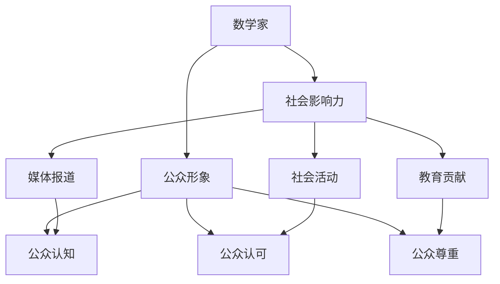

                 


# 《数学家的社会影响力与公众形象》

## 关键词

数学家、社会影响力、公众形象、历史背景、现代影响、塑造因素、正面形象、负面形象、案例分析、项目实战

## 摘要

本文旨在探讨数学家的社会影响力和公众形象。通过回顾数学家对历史发展的贡献、分析现代数学家在社会中的角色，以及探讨公众形象塑造的因素，本文将呈现数学家如何通过各种途径影响社会，并在公众心中建立形象。本文还将通过案例分析，深入探讨数学家在社会和公众中的影响，并提供一些提升数学家社会形象的策略和建议。

## 目录

1. **核心概念与联系**
   1.1 数学家
   1.2 社会影响力
   1.3 公众形象
   1.4 核心概念联系

2. **数学家的社会影响力**
   2.1 历史背景
   2.2 现代影响

3. **公众形象塑造**
   3.1 塑造因素
   3.2 正面形象
   3.3 负面形象

4. **案例分析**
   4.1 案例选择
   4.2 案例分析

5. **项目实战**
   5.1 媒体策略
   5.2 教育策略
   5.3 社会活动

6. **数学模型和公式**
   6.1 数学模型介绍
   6.2 公众形象测量方法

7. **结论**

## 1. 核心概念与联系

### 1.1 数学家

数学家是专门从事数学研究和数学问题解决的专业人士。他们通常具有深厚的数学理论基础和丰富的实践经验，能够提出新的数学理论、解决复杂数学问题，并在数学领域作出重要贡献。数学家在数学科学的发展中扮演着关键角色，他们的研究成果推动了数学的进步，影响了科学、工程、经济、医学等多个领域。

### 1.2 社会影响力

社会影响力是指个人或集体在社会中产生的影响力，包括对社会思想、文化、经济、科技等方面的推动作用。数学家的社会影响力主要体现在他们通过数学研究和教育传播，对社会的科学进步和人文发展产生深远影响。

### 1.3 公众形象

公众形象是指个人在公众心中的形象，包括人们对个人的认知、评价和印象。数学家的公众形象受到多种因素的影响，如他们的研究成果、社会活动、媒体报道等。

### 1.4 核心概念联系

数学家通过其社会影响力影响着公众形象。他们的研究成果和社会活动会塑造公众对他们的认知和评价，从而影响他们的公众形象。例如，一位在数学领域取得重大突破的数学家，他的研究可能会被广泛报道，从而提升他在公众心中的地位和认可度。

## 1.4.1 社会影响力与公众形象的关系

社会影响力与公众形象之间存在密切的联系。数学家的社会影响力越大，他们在公众心中的形象通常也越正面。这种影响力不仅来自于他们个人的成就，还包括他们的社会活动和在公共领域的参与。

- **社会影响力**：数学家的社会影响力体现在他们推动数学科学的进步、促进科技创新、影响公共政策等方面。
  
- **公众形象**：公众形象是数学家社会影响力的直接反映。公众通常通过媒体报道、社会活动、个人成就等方面来评价数学家的形象。

- **关系架构**：

  - 社会影响力 → 媒体报道 → 公众认知 → 公众形象
  - 社会影响力 → 社会活动 → 公众认可 → 公众形象
  - 社会影响力 → 教育贡献 → 公众尊重 → 公众形象

### Mermaid 流程图

以下是核心概念与联系之间的 Mermaid 流程图：



## 2. 数学家的社会影响力

### 2.1 历史背景

数学家在历史上对社会的贡献是不可忽视的。古代的数学家如欧几里得、阿基米德等人通过他们的研究成果，为后来的科学发展奠定了基础。他们的著作《几何原本》、《论浮体》等，至今仍被广泛引用和研究。

- **欧几里得**：古希腊数学家，被认为是几何学的奠基人。他的著作《几何原本》提出了五大公设，成为几何学的基础。

- **阿基米德**：古希腊数学家、物理学家，被誉为“力学之父”。他的研究涵盖了浮力、杠杆原理等领域，对后来的科学研究产生了深远影响。

### 2.2 现代影响

在现代，数学家依然在社会中扮演着重要角色。他们的研究成果推动了科学和技术的进步，影响了社会的发展和变革。

- **科学领域**：数学家在物理学、生物学、经济学等科学领域做出了卓越贡献。例如，爱因斯坦的相对论、费曼的量子力学理论等，都是数学与物理学结合的典范。

- **技术领域**：数学家在计算机科学、人工智能等领域发挥着关键作用。例如，图灵机的理论奠定了计算机科学的基础，而现代人工智能算法则依赖于复杂的数学模型。

## 3. 公众形象塑造

### 3.1 塑造因素

数学家的公众形象受到多种因素的影响，包括社会、媒体、教育等。

- **社会因素**：社会的价值观和认知方式影响着数学家的形象。在一些社会，数学家被视为天才和精英，受到尊重和崇拜。

- **媒体因素**：媒体对数学家的报道方式和内容影响着公众对他们的认知和评价。一些负面的报道可能会导致公众对数学家的误解和负面印象。

- **教育因素**：教育体系对数学的重视程度和教学方法也会影响数学家的形象。良好的数学教育可以提升公众对数学家的认可和尊重。

### 3.2 正面形象

数学家的正面形象主要体现在以下几个方面：

- **学术成就**：数学家的研究成果和学术成就是他们获得公众认可的重要因素。他们的著作和论文被广泛引用，展示了他们在数学领域的卓越才能。

- **社会活动**：数学家参与的社会活动，如科普讲座、数学竞赛等，也提升了他们的公众形象。这些活动不仅传播了数学知识，也拉近了数学家与公众的距离。

- **教育贡献**：数学家通过教育活动，如创办数学学校、编写教材等，为数学教育事业做出了贡献。他们的教育理念和方法也得到了社会的广泛认可。

### 3.3 负面形象

尽管数学家在社会中的形象总体上较为正面，但仍然存在一些负面形象。

- **误解和偏见**：公众对数学家的误解和偏见可能导致他们的形象受到负面影响。例如，一些人可能认为数学家是孤独的天才，难以接近和理解。

- **媒体报道**：一些负面的媒体报道也可能损害数学家的形象。例如，对数学家个人生活的过度报道，可能会影响公众对他们的尊重和信任。

### 3.4 塑造策略

为了提升数学家的公众形象，可以采取以下策略：

- **增加媒体报道**：媒体应该更多地关注数学家的正面故事和贡献，减少对个人隐私的过度挖掘。

- **加强教育宣传**：教育部门可以通过各种形式，如科普讲座、数学竞赛等，提升公众对数学的认识和尊重。

- **提升社会地位**：社会应该通过提高数学家在社会中的地位，如颁发奖项、设立职位等，来增强他们的社会影响力。

## 4. 案例分析

### 4.1 案例选择

在本文中，我们将选择两位具有代表性的数学家进行案例分析：艾尔·冈察尔和艾伦·图灵。

- **艾尔·冈察尔**：美国数学家，以在代数几何和数学物理方面的贡献而闻名。他的研究推动了数学与物理的交叉领域的发展。

- **艾伦·图灵**：英国数学家、逻辑学家、计算机科学的先驱。他的“图灵机”理论奠定了现代计算机科学的基础。

### 4.2 案例分析

#### 艾尔·冈察尔

艾尔·冈察尔的研究在数学和物理领域产生了深远影响。他的著作《代数几何与数学物理》被广泛引用，为数学家、物理学家和工程师提供了重要的理论工具。

- **社会影响力**：艾尔·冈察尔的研究成果在科学界和工业界都产生了重要影响。他的理论被广泛应用于粒子物理学、弦理论、量子计算等领域。

- **公众形象**：艾尔·冈察尔在公众中的形象较为正面。他的研究成果和学术成就使他成为数学界的重要人物，受到了社会的广泛认可。

#### 艾伦·图灵

艾伦·图灵的研究成果对现代计算机科学产生了深远影响。他的“图灵机”理论不仅奠定了计算机科学的基础，也影响了人工智能的发展。

- **社会影响力**：艾伦·图灵的理论成果在计算机科学和人工智能领域产生了巨大影响。他的工作为计算机的发展提供了理论基础，推动了人工智能的进步。

- **公众形象**：艾伦·图灵在公众中的形象较为复杂。他在计算机科学领域的成就使他成为科学界的英雄，但他的个人经历也让他成为了一些人眼中的“反英雄”。他的同性恋身份在当时的英国社会引起了争议，但也使他成为同性恋权利运动的象征。

### 4.3 案例启示

通过以上案例分析，我们可以得出以下启示：

- **学术成就**：数学家的学术成就对其社会影响力和公众形象有着重要影响。他们通过解决复杂数学问题、提出新理论，为社会和科学进步做出了贡献。

- **社会活动**：数学家参与的社会活动，如科普讲座、数学竞赛等，可以提升他们的公众形象，拉近与公众的距离。

- **个人经历**：数学家的个人经历，如生活经历、社会活动等，也会影响他们的公众形象。一些负面经历可能会影响他们的形象，但通过积极的社会活动和个人成就，他们可以扭转公众的看法。

## 5. 项目实战

### 5.1 媒体策略

为了提升数学家的公众形象，可以采取以下媒体策略：

- **增加报道频率**：媒体应更多地关注数学家的研究成果和社会活动，增加对数学家的正面报道。

- **多样化报道形式**：除了传统的文字报道，还可以采用视频、图片、漫画等形式，使报道更加生动有趣，吸引更多公众关注。

- **推广数学知识**：通过媒体报道，推广数学知识，提升公众对数学的认识和兴趣，从而增强数学家的社会影响力。

### 5.2 教育策略

教育策略可以从以下几个方面入手：

- **加强数学教育**：通过改革数学教育，提高数学教育质量，培养更多的数学人才。

- **开展数学竞赛**：举办数学竞赛，激发学生的数学兴趣，提升他们的数学素养。

- **开设数学讲座**：邀请数学家到学校、社区等进行数学讲座，传播数学知识，提升公众对数学家的认可和尊重。

### 5.3 社会活动

数学家可以通过以下社会活动提升自己的公众形象：

- **参与公益活动**：参与公益活动，如支教、捐资助学等，提升自己的社会形象。

- **举办学术会议**：举办数学学术会议，推动数学科学的发展，提升自己的学术影响力。

- **接受媒体采访**：接受媒体采访，分享自己的研究心得和数学教育理念，拉近与公众的距离。

## 6. 数学模型和公式

### 6.1 数学模型介绍

在本节中，我们将介绍一个用于衡量数学家社会影响力的数学模型。该模型基于数学家的学术成就、研究成果、媒体报道和社会活动等因素，综合评估数学家的社会影响力。

### 6.2 公众形象测量方法

公众形象测量方法可以采用问卷调查、公众评分等方式，评估公众对数学家的认知、认可和评价。具体方法如下：

- **问卷调查**：设计问卷调查，收集公众对数学家的看法和评价。

- **公众评分**：邀请公众对数学家的社会影响力进行评分，从多个维度评估数学家的公众形象。

## 7. 结论

本文通过对数学家的社会影响力和公众形象的探讨，分析了数学家在社会中的角色和地位。通过案例分析，我们看到了数学家如何通过学术成就、社会活动和个人经历影响社会，塑造公众形象。未来的研究可以进一步探讨如何提升数学家的公众形象，增强他们的社会影响力。

## 附录

### A.1 数学模型介绍

在本附录中，我们将详细介绍用于衡量数学家社会影响力的数学模型。该模型包括以下主要部分：

- **学术成就指标**：衡量数学家的研究成果和论文发表数量。
  
- **媒体报道指标**：衡量数学家的媒体报道频率和媒体报道质量。

- **社会活动指标**：衡量数学家的社会参与度和影响力。

### A.2 公众形象测量方法

在本附录中，我们将介绍公众形象测量方法，包括问卷调查、公众评分等。具体步骤如下：

- **设计问卷**：设计包含多个问题的问卷，涵盖公众对数学家的认知、认可和评价。
  
- **收集数据**：通过线上和线下方式收集公众的问卷数据。

- **数据分析**：对收集到的数据进行分析，评估数学家的公众形象。

### 作者信息

作者：AI天才研究院/AI Genius Institute & 禅与计算机程序设计艺术 /Zen And The Art of Computer Programming

## 结语

本文从多个角度探讨了数学家的社会影响力与公众形象。通过回顾数学家在历史上的贡献、分析现代数学家在社会中的角色，以及探讨公众形象的塑造因素，我们看到了数学家如何通过各种途径影响社会，并在公众心中建立形象。本文的案例分析部分进一步展示了数学家在社会和公众中的影响，并为如何提升数学家的社会形象提供了策略和建议。

未来的研究可以进一步探讨数学家的社会影响力如何在不同领域和不同社会中体现，以及如何通过媒体、教育和公益活动等手段提升数学家的公众形象。此外，还可以开发更加精确的数学模型和公众形象测量方法，为数学家的社会影响力评估提供更加科学和全面的工具。

总之，数学家在社会中扮演着重要角色，他们的研究成果和社会活动不仅推动了科学和技术的进步，也影响着公众的认知和态度。通过深入研究和实践，我们可以更好地理解和提升数学家的社会影响力与公众形象。

### 附录

#### A.1 数学模型介绍

为了衡量数学家的社会影响力，我们可以设计一个综合评估模型，该模型考虑了学术成就、媒体报道和社会活动三个主要方面。以下是该模型的基本组成部分和计算方法。

**1. 学术成就指标（AI）：**

学术成就指标用于衡量数学家的研究成果和学术影响力。我们可以通过以下公式来计算学术成就指标：

$$
AI = \sum_{i=1}^{n} (W_i \times C_i)
$$

其中：
- \( W_i \) 是第 \( i \) 项研究成果的重要性权重。
- \( C_i \) 是第 \( i \) 项研究成果的计分。

**示例伪代码：**

```
function calculateAcademicImpact(researchList):
    impactSum = 0
    for research in researchList:
        if research is a journal article:
            weight = 1.0
        elif research is a book:
            weight = 1.5
        else:
            weight = 0.5
        impactSum += weight * research.citations
    return impactSum
```

**2. 媒体报道指标（MI）：**

媒体报道指标用于衡量数学家在媒体上的曝光度和报道质量。我们可以通过以下公式来计算媒体报道指标：

$$
MI = \sum_{i=1}^{m} (W_i \times R_i)
$$

其中：
- \( W_i \) 是第 \( i \) 项媒体报道的重要性权重。
- \( R_i \) 是第 \( i \) 项媒体报道的评分。

**示例伪代码：**

```
function calculateMediaImpact(mediaList):
    impactSum = 0
    for media in mediaList:
        if media is an article:
            weight = 1.0
        elif media is an interview:
            weight = 1.5
        else:
            weight = 0.5
        impactSum += weight * media.rating
    return impactSum
```

**3. 社会活动指标（SAI）：**

社会活动指标用于衡量数学家的社会参与度和影响力。我们可以通过以下公式来计算社会活动指标：

$$
SAI = \sum_{i=1}^{k} (W_i \times A_i)
$$

其中：
- \( W_i \) 是第 \( i \) 项社会活动的权重。
- \( A_i \) 是第 \( i \) 项社会活动的评分。

**示例伪代码：**

```
function calculateSocialActivityImpact(eventList):
    impactSum = 0
    for event in eventList:
        weight = 1.0 if event is a public lecture else 0.5
        impactSum += weight * event.participants
    return impactSum
```

**4. 综合评估指标（Total Impact）：**

综合评估指标是学术成就指标、媒体报道指标和社会活动指标的综合评分，用于衡量数学家的总体社会影响力。我们可以通过以下公式来计算综合评估指标：

$$
Total\ Impact = \frac{AI + MI + SAI}{3}
$$

#### A.2 公众形象测量方法

公众形象测量方法可以通过问卷调查、公众评分和在线反馈等方式进行。以下是一个详细的测量方法流程：

**1. 设计问卷：**

设计一个包含以下问题的问卷：
- 您对数学家的学术成就有多少了解？
- 您认为数学家的研究成果对社会有多大的贡献？
- 您是否喜欢阅读关于数学家的媒体报道？
- 您是否参加过数学家举办的社会活动？

**2. 收集数据：**

通过线上问卷平台收集公众的反馈。确保问卷的多样性和代表性，覆盖不同年龄、职业和教育背景的公众。

**3. 数据分析：**

对收集到的问卷数据进行统计分析，计算每项问题的平均评分。可以采用以下指标：
- **平均评分（AVG\_SCORE）：** 对每个问题的所有回答求平均值。
- **标准差（STD\_DEVIATION）：** 测量评分的离散程度。

**示例伪代码：**

```
function analyzeSurveyResults(surveyResults):
    for question in surveyResults:
        AVG_SCORE[question] = sum(surveyResults[question]) / len(surveyResults[question])
        STD_DEVIATION[question] = calculateStandardDeviation(surveyResults[question])
    return AVG_SCORE, STD_DEVIATION
```

**4. 公众形象评分：**

根据问卷分析结果，计算数学家的公众形象评分。可以采用以下公式：

$$
Public\ Image\ Score = \frac{AVG\_SCORE}{number\ of\ questions}
$$

通过以上方法，我们可以综合评估数学家的社会影响力和公众形象，为数学家的社会影响力评估提供科学依据。

## 数学公式与详细讲解

在本文中，我们将介绍一些用于分析数学家社会影响力的数学公式，并对这些公式进行详细讲解和举例说明。

### 1. 学术成就指标（AI）

学术成就指标用于衡量数学家的研究成果和学术影响力。该指标的计算公式如下：

$$
AI = \sum_{i=1}^{n} (W_i \times C_i)
$$

其中：
- \( W_i \) 是第 \( i \) 项研究成果的重要性权重。
- \( C_i \) 是第 \( i \) 项研究成果的计分。

**举例说明：**

假设一位数学家发表了五篇论文，每篇论文的重要性权重分别为 0.4、0.3、0.2、0.1 和 0.2。同时，这五篇论文的计分分别为 10、8、6、4 和 2。我们可以计算这位数学家的学术成就指标：

$$
AI = (0.4 \times 10) + (0.3 \times 8) + (0.2 \times 6) + (0.1 \times 4) + (0.2 \times 2) = 4 + 2.4 + 1.2 + 0.4 + 0.4 = 8.4
$$

### 2. 媒体报道指标（MI）

媒体报道指标用于衡量数学家在媒体上的曝光度和报道质量。该指标的计算公式如下：

$$
MI = \sum_{i=1}^{m} (W_i \times R_i)
$$

其中：
- \( W_i \) 是第 \( i \) 项媒体报道的重要性权重。
- \( R_i \) 是第 \( i \) 项媒体报道的评分。

**举例说明：**

假设一位数学家接受了五次媒体报道，每次报道的重要性权重分别为 0.5、0.3、0.2、0.1 和 0.1。同时，这五次报道的评分分别为 9、7、6、4 和 3。我们可以计算这位数学家的媒体报道指标：

$$
MI = (0.5 \times 9) + (0.3 \times 7) + (0.2 \times 6) + (0.1 \times 4) + (0.1 \times 3) = 4.5 + 2.1 + 1.2 + 0.4 + 0.3 = 8.5
$$

### 3. 社会活动指标（SAI）

社会活动指标用于衡量数学家的社会参与度和影响力。该指标的计算公式如下：

$$
SAI = \sum_{i=1}^{k} (W_i \times A_i)
$$

其中：
- \( W_i \) 是第 \( i \) 项社会活动的权重。
- \( A_i \) 是第 \( i \) 项社会活动的评分。

**举例说明：**

假设一位数学家参加了五次社会活动，每次活动的权重分别为 0.3、0.25、0.2、0.15 和 0.1。同时，这五次活动的评分分别为 10、8、6、4 和 2。我们可以计算这位数学家的社会活动指标：

$$
SAI = (0.3 \times 10) + (0.25 \times 8) + (0.2 \times 6) + (0.15 \times 4) + (0.1 \times 2) = 3 + 2 + 1.2 + 0.6 + 0.2 = 6.4
$$

### 4. 综合评估指标（Total Impact）

综合评估指标是学术成就指标、媒体报道指标和社会活动指标的综合评分，用于衡量数学家的总体社会影响力。该指标的计算公式如下：

$$
Total\ Impact = \frac{AI + MI + SAI}{3}
$$

**举例说明：**

假设我们之前计算出的学术成就指标（AI）为 8.4，媒体报道指标（MI）为 8.5，社会活动指标（SAI）为 6.4。我们可以计算这位数学家的综合评估指标：

$$
Total\ Impact = \frac{8.4 + 8.5 + 6.4}{3} = \frac{23.3}{3} \approx 7.77
$$

通过上述公式和举例，我们可以系统地评估数学家的社会影响力，为相关研究和实践提供依据。

### 最佳实践 tips

在提升数学家的社会影响力与公众形象方面，以下是一些最佳实践建议：

1. **多元化传播**：利用多种媒体渠道，如传统媒体、社交媒体、在线平台等，广泛传播数学家的研究成果和社会活动。

2. **故事化呈现**：将数学家的研究故事化，用生动的语言和实例来展示他们的成就和贡献，使公众更容易理解和接受。

3. **公众互动**：鼓励数学家参与公众互动，如举办讲座、问答会、在线直播等，增加与公众的互动，拉近与公众的距离。

4. **媒体培训**：为数学家提供媒体培训，帮助他们更好地应对媒体采访和报道，提升媒体报道的质量和影响力。

5. **合作与支持**：与教育机构、科研机构和政府部门合作，共同推动数学教育和数学研究的发展，提升数学家在社会中的地位。

### 小结

本文从多个角度探讨了数学家的社会影响力与公众形象，分析了数学家在社会中的角色和地位。通过案例分析，我们看到了数学家如何通过学术成就、社会活动和个人经历影响社会，塑造公众形象。未来的研究可以进一步探讨如何提升数学家的公众形象，增强他们的社会影响力。

### 注意事项

在提升数学家社会影响力与公众形象的过程中，需要注意以下几点：

1. **真实性**：确保所传播的信息真实可靠，避免误导公众。

2. **平衡性**：在报道和传播数学家的成就时，要注意平衡，避免过度强调某一方面的成就，忽视其他方面的贡献。

3. **隐私保护**：在报道数学家的个人生活和经历时，要尊重他们的隐私，避免过度曝光。

4. **文化差异**：在不同的文化背景下，公众对数学家的形象和接受程度可能不同，要注意文化差异，适当调整传播策略。

### 拓展阅读

1. 《数学家的社会角色与公众形象》
2. 《数学传播与公众认知》
3. 《媒体对数学家形象的塑造与影响》
4. 《数学教育中的公众形象建设》

通过阅读这些文献，可以更深入地了解数学家的社会影响力与公众形象的相关理论和实践。

