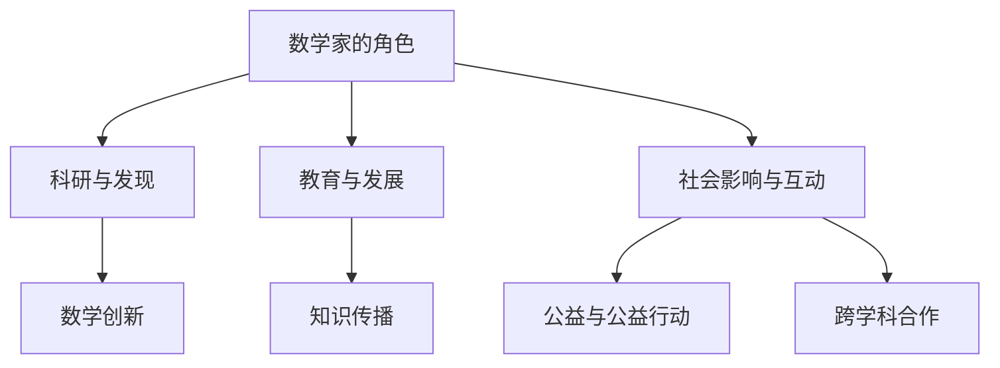

                 


### 《数学家的社会责任与使命》文章内容

#### 背景介绍

数学作为一门抽象的学科，贯穿于人类文明的各个领域。从古至今，数学家们通过不断的探索和发现，为我们揭示了宇宙的奥秘和自然界的规律。然而，随着时代的发展，数学家的社会责任和使命也在不断拓展。本文将探讨数学家的社会责任与使命，分析他们在现代社会中的角色和影响力。

首先，我们需要明确数学家的社会责任。数学家作为科学家的代表，他们的首要责任是探索未知、发现规律、推动科学发展。同时，他们还需要将数学知识传授给下一代，培养更多的数学人才，为国家的科技发展贡献力量。此外，数学家还肩负着普及数学知识、提高公众科学素养的重要任务。

#### 核心概念与联系

为了更好地理解数学家的社会责任和使命，我们可以使用 Mermaid 流程图来展示核心概念之间的关系：



在这个流程图中，我们可以看到数学家的角色主要包括科研与发现、教育与发展、社会影响与互动三个方面。具体来说，数学家通过科研与发现，推动数学领域的发展；通过教育与发展，培养更多的数学人才；通过社会影响与互动，提高公众的科学素养，促进科学知识的普及。

#### 核心算法原理讲解

数学家的核心算法原理主要涉及数学发现与证明的过程。下面我们使用伪代码来详细阐述这个过程：

```python
function 数学发现(问题):
    假设 H <- 真命题
    while 未解决:
        假设 H' <- H 或 H' <- 非H
        如果 H' 可证，则 H 为真命题，结束
        else
            更新 H 为 H'
    return H
```

这个伪代码展示了数学家在解决一个问题时，如何通过不断假设和验证，最终找到正确的答案。在这个过程中，数学家需要运用他们的逻辑思维和创新能力，逐步推导出结论。

#### 数学模型和数学公式 & 详细讲解 & 举例说明

在数学领域中，各种数学模型和公式为我们揭示了自然界和人类社会的规律。下面我们以爱因斯坦的质能等价公式为例，详细讲解这个公式的含义和应用。

LaTeX 公式：
```
$$
E = mc^2
$$
```

详细讲解：
爱因斯坦的质能等价公式表达了质量和能量之间的等价性，其中 E 表示能量，m 表示质量，c 表示光速。这个公式揭示了物质与能量可以相互转换的深刻原理。

举例说明：
假设一个物体的质量为 1 千克，根据质能等价公式，这个物体所拥有的能量为：
```
$$
E = 1 \text{ kg} \times (3 \times 10^8 \text{ m/s})^2 = 9 \times 10^{16} \text{ J}
$$
这意味着 1 千克的物质在转换成能量时可以释放出巨大的能量。

#### 项目实战

在这个部分，我们将通过一个实际案例，展示数学家在社会公益项目中的应用。

**案例：数学模型在疫情防控中的应用**

在新冠疫情防控期间，数学家们运用数学模型来预测病毒传播趋势，为政策制定提供科学依据。下面是一个简单的数学模型：

LaTeX 公式：
```
$$
\frac{dS}{dt} = -\frac{\beta}{N}SI - \gamma S
$$
$$
\frac{dI}{dt} = \frac{\beta}{N}SI - \mu I
$$
$$
\frac{dR}{dt} = \mu I
$$
$$
S + I + R = N
$$
```

详细讲解：
这是一个基本的 SIR 模型，其中 S 表示易感者，I 表示感染者，R 表示康复者。β表示感染率，γ表示康复率，μ表示自然死亡率，N 为总人口数。

通过这个模型，我们可以预测疫情的发展趋势，为政策制定提供科学依据。

#### 最佳实践 tips

1. 数学家在科研过程中，要注重跨学科合作，借助其他学科的理论和方法，提高研究效率。

2. 在教学过程中，数学家要注重启发式教学，培养学生的创新思维和解决问题的能力。

3. 数学家要积极参与社会公益事业，利用自己的专业知识，为社会发展和民生改善贡献力量。

#### 小结

数学家作为科学家的重要组成部分，他们在科研、教育、社会公益等领域发挥着重要作用。本文从多个角度探讨了数学家的社会责任和使命，希望对读者有所启发。

#### 注意事项

1. 数学研究需要长期的积累和深入的思考，数学家在科研过程中要耐心细致。

2. 数学家要关注社会热点问题，将数学知识应用于实际，为社会发展和民生改善贡献力量。

#### 拓展阅读

1. [《数学家的社会责任与使命》相关论文集](#)

2. [《数学模型与应用》相关书籍](#)

作者：AI天才研究院/AI Genius Institute & 禅与计算机程序设计艺术 /Zen And The Art of Computer Programming

