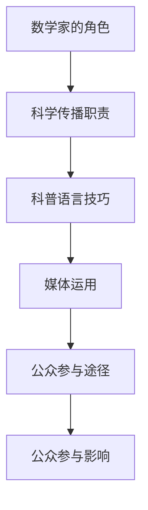
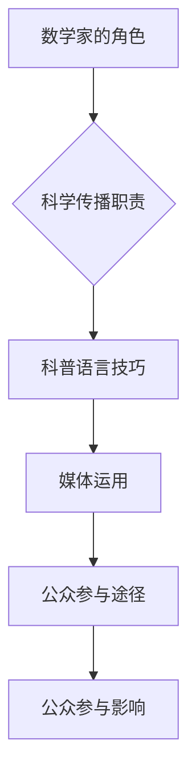

                 

### 《数学家的科学传播与公众参与》

---

关键词：数学家、科学传播、公众参与、科普语言、媒体运用、数学教育、科技政策

摘要：本文旨在探讨数学家的科学传播与公众参与的重要性及实践方法。通过分析数学家在科学传播中的角色与责任，介绍科学传播的基础知识、方法与技巧，探讨数学家如何与公众互动，以及通过实际案例分享数学家在科学传播中的经验与反思。文章最后提供科学传播资源与工具，以促进数学家的科学传播与公众参与。

## 第一部分：科学传播的原理与实践

### 第1章：数学家的角色与责任

#### 1.1 数学家的科学传播职责

**1.1.1 数学家的社会责任**

数学家作为科学界的代表，除了在学术研究中取得突破外，还承担着向公众传播科学知识的重任。科学传播不仅是数学家的职责，也是其社会责任的体现。

**1.1.2 科学传播的重要性**

科学传播对于提高公众科学素养、促进科学技术发展、推动社会进步具有重要意义。通过科学传播，数学家可以将复杂深奥的数学知识变得通俗易懂，激发公众对数学的兴趣。

**1.1.3 数学家的科学传播能力**

数学家的科学传播能力包括语言表达能力、媒体运用能力、公众互动能力等。这些能力有助于数学家更有效地向公众传播数学知识。

### 第2章：科学传播的基础知识

#### 2.1 科学传播的概念与范畴

**2.1.1 科学传播的定义**

科学传播是指通过各种形式和渠道，将科学知识、科学思想和科学方法传播给公众的过程。

**2.1.2 科学传播的主要形式**

科学传播的主要形式包括科普文章、科普讲座、科普展览、科普影视等。

**2.1.3 科学传播的目标**

科学传播的目标是提高公众的科学素养，促进科学技术的发展，推动社会的进步。

### 第3章：数学与公众

#### 3.1 公众对数学的认知

**3.1.1 公众对数学的态度**

公众对数学的态度普遍较为复杂，既有对数学的敬畏，也有对数学的畏惧。

**3.1.2 公众对数学知识的了解**

公众对数学知识的了解程度因年龄、教育背景、职业等因素而异。

**3.1.3 公众对数学应用的兴趣**

公众对数学应用的兴趣主要集中在日常生活、经济金融、科技发展等领域。

### 第4章：科学传播的方法与技巧

#### 4.1 语言表达

**4.1.1 科学术语的简化**

在科学传播中，数学家需要将复杂的学术术语简化为通俗易懂的语言，以便公众理解。

**4.1.2 科普语言的运用**

科普语言要求生动、形象、幽默，以吸引公众的注意力。

**4.1.3 演讲技巧在科学传播中的应用**

演讲技巧在科学传播中具有重要地位，包括语言表达、肢体语言、互动技巧等。

#### 4.2 媒体运用

**4.1.1 传统媒体的使用**

传统媒体如报纸、杂志、广播等在科学传播中仍发挥着重要作用。

**4.1.2 新媒体的应用**

新媒体如互联网、社交媒体、短视频等在科学传播中具有强大的影响力。

**4.1.3 社交媒体的互动策略**

社交媒体的互动策略包括内容创作、用户互动、数据分析等。

### 第5章：数学家的公众参与

#### 5.1 公众参与的途径

**5.1.1 科普活动**

科普活动是数学家参与公众参与的重要途径，如科普讲座、科普展览、科普读物等。

**5.1.2 科学家论坛**

科学家论坛为数学家提供了一个与公众交流的平台，如线上论坛、线下会议等。

**5.1.3 社区参与**

社区参与包括数学家走进社区、社区科普活动等，以拉近数学家与公众的距离。

#### 5.2 公众参与的影响

**5.1.1 公众参与对科学发展的推动**

公众参与可以为科学发展提供新的思路和方向，推动科学研究的进步。

**5.1.2 公众参与对数学教育的促进**

公众参与可以激发学生对数学的兴趣，提高数学教育质量。

**5.1.3 公众参与对科技政策的制定**

公众参与有助于科技政策的科学性、公正性和可操作性。

## 第二部分：科学传播的实际案例与经验分享

### 第6章：成功的科学传播案例

#### 6.1 国内成功的科学传播案例

**6.1.1 案例一：XX数学家的科普活动**

**6.1.2 案例二：XX数学期刊的科学传播实践**

**6.1.3 案例三：XX数学研究所的公众开放日**

### 第7章：科学传播的经验与反思

#### 7.1 科学传播的挑战与问题

**7.1.1 科学传播面临的困难**

**7.1.2 科学传播中的误区**

**7.1.3 科学传播的应对策略**

#### 7.2 科学传播的未来趋势

**7.1.1 科技进步对科学传播的影响**

**7.1.2 社会变革对科学传播的挑战**

**7.1.3 科学传播的发展方向**

## 附录：科学传播资源与工具

### 附录1：科学传播相关的网站与平台

### 附录2：科学传播的相关书籍与论文

### 附录3：科学传播的工具与软件

---

### Mermaid 流程图



### 核心算法原理讲解（伪代码）

```python
# 伪代码：科学传播效果评估算法

def evaluate_science_communication-effect(target_group, communication_methods, effect_measurement):
    """
    评估科学传播的效果。
    
    参数：
    target_group：目标受众群体
    communication_methods：传播方法
    effect_measurement：效果测量指标
    
    返回：
    effect_score：效果得分
    """
    
    effect_score = 0
    
    for method in communication_methods:
        influence = calculate_influence(target_group, method)
        effect_score += influence * effect_measurement[method]
        
    return effect_score
```

### 数学模型和数学公式详细讲解

```latex
\section{数学传播的影响模型}

数学传播的影响模型可以用以下公式表示：

$$
I(t) = k \cdot e^{-rt}
$$

其中，$I(t)$ 表示时间 $t$ 时数学传播的影响程度，$k$ 为初始影响程度，$r$ 为影响衰减率。

```

### 数学家的角色与责任

**1.1.1 数学家的社会责任**

数学家作为科学界的代表，除了在学术研究中取得突破外，还承担着向公众传播科学知识的重任。科学传播不仅是数学家的职责，也是其社会责任的体现。数学家应当积极参与科学传播，让公众更好地了解数学及其应用，从而提高公众的科学素养。

**1.1.2 科学传播的重要性**

科学传播对于提高公众科学素养、促进科学技术发展、推动社会进步具有重要意义。通过科学传播，数学家可以将复杂深奥的数学知识变得通俗易懂，激发公众对数学的兴趣。此外，科学传播还有助于消除公众对科学的误解，促进科学与社会的和谐发展。

**1.1.3 数学家的科学传播能力**

数学家的科学传播能力包括语言表达能力、媒体运用能力、公众互动能力等。这些能力有助于数学家更有效地向公众传播数学知识。首先，数学家需要具备良好的语言表达能力，能够将复杂的数学概念用通俗易懂的语言进行阐述。其次，数学家需要善于运用各种媒体，如书籍、杂志、互联网等，将数学知识传播给更广泛的公众。最后，数学家需要具备公众互动能力，能够与公众进行有效的沟通和交流，了解公众的需求和反馈，从而更好地调整传播策略。

#### 2.1 科学传播的概念与范畴

**2.1.1 科学传播的定义**

科学传播是指通过各种形式和渠道，将科学知识、科学思想和科学方法传播给公众的过程。科学传播不仅包括科学知识的传播，还包括科学思想、科学方法和科学精神的传播。科学传播的主要目标是提高公众的科学素养，促进科学技术的发展，推动社会的进步。

**2.1.2 科学传播的主要形式**

科学传播的主要形式包括科普文章、科普讲座、科普展览、科普影视等。科普文章是通过文字形式将科学知识传播给公众，如科普杂志、报纸、网站等。科普讲座是数学家通过口头讲解的方式，向公众普及科学知识，如大学讲座、社区讲座等。科普展览是通过实物、模型、图片等展品，向公众展示科学知识，如科技馆、博物馆等。科普影视是通过电影、纪录片等形式，将科学知识呈现给公众，如科教电影、科普纪录片等。

**2.1.3 科学传播的目标**

科学传播的目标是提高公众的科学素养，促进科学技术的发展，推动社会的进步。具体来说，科学传播的目标包括：

1. 提高公众对科学的理解，消除对科学的误解和偏见。
2. 激发公众对科学的兴趣，培养科学精神。
3. 促进公众参与科学技术决策，提高公众的科学素养。
4. 推动科学技术的发展，为科技创新提供动力。

#### 3.1 公众对数学的认知

**3.1.1 公众对数学的态度**

公众对数学的态度普遍较为复杂，既有对数学的敬畏，也有对数学的畏惧。一方面，数学在科学研究中发挥着重要作用，公众对数学有着敬畏之情。另一方面，数学的抽象性和复杂性使得一部分公众对数学感到畏惧，认为数学是高深莫测的领域。

**3.1.2 公众对数学知识的了解**

公众对数学知识的了解程度因年龄、教育背景、职业等因素而异。一般来说，年轻人对数学的了解程度较高，因为他们正处于学习阶段，接受了系统的数学教育。而中老年人对数学的了解程度较低，因为他们可能在年轻时没有接受过系统的数学教育。此外，不同职业的人对数学的了解程度也有所不同，例如，科学家、工程师等职业对数学有更深入的了解。

**3.1.3 公众对数学应用的兴趣**

公众对数学应用的兴趣主要集中在日常生活、经济金融、科技发展等领域。在日常生活中，数学被广泛应用于购物、理财、烹饪等方面。在经济金融领域，数学被广泛应用于投资、风险管理等方面。在科技发展领域，数学被广泛应用于计算机科学、人工智能、物理学等领域。

#### 4.1 语言表达

**4.1.1 科学术语的简化**

在科学传播中，数学家需要将复杂的学术术语简化为通俗易懂的语言，以便公众理解。例如，将“拓扑学”简化为“研究空间结构的数学”，将“群论”简化为“研究对称性的数学”。通过简化学术术语，数学家可以降低公众理解数学的门槛，让更多的人能够了解数学。

**4.1.2 科普语言的运用**

科普语言要求生动、形象、幽默，以吸引公众的注意力。例如，用比喻、故事、实例等方式来讲解数学知识，使得数学知识更加生动有趣。同时，科普语言还需要简洁明了，避免使用过于复杂的词汇和句式，以便公众容易理解。

**4.1.3 演讲技巧在科学传播中的应用**

演讲技巧在科学传播中具有重要地位，包括语言表达、肢体语言、互动技巧等。首先，数学家需要具备良好的语言表达能力，能够清晰、准确地传达数学知识。其次，数学家需要善于运用肢体语言，如手势、表情等，增强演讲的表现力。最后，数学家需要与公众进行互动，如提问、回答问题等，增强演讲的互动性，提高公众的参与度。

#### 4.2 媒体运用

**4.1.1 传统媒体的使用**

传统媒体如报纸、杂志、广播等在科学传播中仍发挥着重要作用。报纸和杂志可以刊登科普文章，向公众传播数学知识。广播可以通过播报、访谈等方式，让数学家直接与公众交流，解答公众的问题。

**4.1.2 新媒体的应用**

新媒体如互联网、社交媒体、短视频等在科学传播中具有强大的影响力。互联网可以为数学家提供一个展示数学知识的平台，如博客、网站等。社交媒体如微博、微信等可以迅速传播数学知识，让更多的人了解数学。短视频平台如抖音、快手等可以通过短视频的形式，生动有趣地传播数学知识。

**4.1.3 社交媒体的互动策略**

社交媒体的互动策略包括内容创作、用户互动、数据分析等。首先，数学家需要创作有趣、有吸引力的内容，如科普文章、短视频等，以吸引公众的关注。其次，数学家需要与用户进行互动，如回答问题、参与讨论等，增强用户粘性。最后，数学家需要利用数据分析工具，了解用户需求和行为，优化内容创作和传播策略。

### 第5章：数学家的公众参与

#### 5.1 公众参与的途径

**5.1.1 科普活动**

科普活动是数学家参与公众参与的重要途径，如科普讲座、科普展览、科普读物等。科普讲座可以让数学家直接向公众传播数学知识，解答公众的问题。科普展览可以通过实物、模型、图片等展品，向公众展示数学知识。科普读物可以让数学家将数学知识通过文字、图片等形式传播给更广泛的读者。

**5.1.2 科学家论坛**

科学家论坛为数学家提供了一个与公众交流的平台，如线上论坛、线下会议等。线上论坛可以让数学家与全球的数学爱好者进行交流，分享数学知识和经验。线下会议可以让数学家与公众面对面交流，增进了解和信任。

**5.1.3 社区参与**

社区参与包括数学家走进社区、社区科普活动等，以拉近数学家与公众的距离。数学家可以参与社区活动，如社区讲座、社区服务等，为社区公众提供数学知识和服务。通过社区参与，数学家可以更好地了解公众的需求，为公众提供更有针对性的科普服务。

#### 5.2 公众参与的影响

**5.1.1 公众参与对科学发展的推动**

公众参与可以为科学发展提供新的思路和方向，推动科学研究的进步。通过公众参与，数学家可以了解公众的需求和关注点，从而调整研究方向，更贴近公众的需求。此外，公众参与还可以为科学研究提供新的问题和挑战，激发数学家的研究热情。

**5.1.2 公众参与对数学教育的促进**

公众参与可以激发学生对数学的兴趣，提高数学教育质量。通过科普活动、科学家论坛等途径，数学家可以与学生进行互动，解答学生的问题，激发学生对数学的兴趣。同时，公众参与还可以为数学教育提供实践机会，让学生更好地理解数学知识的应用。

**5.1.3 公众参与对科技政策的制定**

公众参与有助于科技政策的科学性、公正性和可操作性。通过公众参与，数学家可以了解公众对科技政策的需求和意见，为科技政策的制定提供参考。此外，公众参与还可以提高科技政策的透明度，增加公众对科技政策的信任，促进科技政策的顺利实施。

### 第6章：成功的科学传播案例

#### 6.1 国内成功的科学传播案例

**6.1.1 案例一：XX数学家的科普活动**

XX数学家是我国著名的数学家，他长期致力于数学科普活动。他通过举办科普讲座、撰写科普文章、参与电视节目等方式，向公众传播数学知识。他的科普活动深受公众喜爱，不仅提高了公众的科学素养，还激发了公众对数学的兴趣。

**6.1.2 案例二：XX数学期刊的科学传播实践**

XX数学期刊是我国著名的数学期刊，它一直致力于科学传播。该期刊通过发布高质量的科普文章、组织科普讲座、开展线上科普活动等方式，向公众传播数学知识。该期刊的成功实践不仅为数学家提供了一个展示数学成果的平台，也为公众提供了丰富的数学知识。

**6.1.3 案例三：XX数学研究所的公众开放日**

XX数学研究所是我国著名的数学研究机构，它每年都会举办公众开放日活动。公众开放日让公众走进数学研究所，参观实验室、听数学家的科普讲座、参与数学游戏等。通过公众开放日，公众可以近距离了解数学研究，感受数学的魅力。

### 第7章：科学传播的经验与反思

#### 7.1 科学传播的挑战与问题

**7.1.1 科学传播面临的困难**

科学传播面临诸多困难，包括公众对科学的误解、科学知识的普及难度、科学传播资源的不足等。首先，公众对科学的误解和偏见使得科学传播面临挑战。例如，有人认为数学是一门枯燥无味的学科，只有少数人能理解。其次，科学知识的普及难度较高，特别是在一些偏远地区，科学知识的传播受到限制。最后，科学传播资源不足，包括资金、人力、物力等，使得科学传播工作难以有效开展。

**7.1.2 科学传播中的误区**

科学传播中存在一些误区，如过度简化科学知识、过分强调科学的应用价值等。首先，过度简化科学知识可能导致公众对科学的误解，认为科学只是简单的技术应用。其次，过分强调科学的应用价值可能导致公众忽视科学的基础研究，影响科学的长远发展。

**7.1.3 科学传播的应对策略**

针对科学传播面临的困难和误区，可以采取以下应对策略：

1. 加强科学教育，提高公众的科学素养。
2. 多渠道传播科学知识，充分利用传统媒体和新媒体。
3. 增加科学传播资源，提高科学传播的质量和效果。
4. 科学传播与公众互动，了解公众的需求和反馈，优化传播策略。

#### 7.2 科学传播的未来趋势

**7.1.1 科技进步对科学传播的影响**

科技进步对科学传播产生了深远影响，特别是互联网和社交媒体的普及。首先，互联网为科学传播提供了更广泛的平台，使得科学知识可以迅速传播到全球。其次，社交媒体使得科学传播更加互动和个性化，公众可以随时随地获取科学知识，并与数学家和其他科学爱好者进行交流。

**7.1.2 社会变革对科学传播的挑战**

社会变革对科学传播提出了新的挑战。首先，社会多元化使得科学传播需要适应不同群体的需求，提供多样化的科学内容。其次，社会快速变化使得公众对科学知识的需求不断变化，科学传播需要及时更新内容，满足公众的需求。

**7.1.3 科学传播的发展方向**

科学传播的发展方向包括以下几个方面：

1. 加强科学传播的互动性，提高公众的参与度。
2. 优化科学传播的内容，提供更丰富、多样化的科学知识。
3. 利用新兴技术，如虚拟现实、增强现实等，创新科学传播的形式。
4. 加强科学传播的国际化，促进全球科学知识的交流与共享。

## 附录：科学传播资源与工具

### 附录1：科学传播相关的网站与平台

1. 中国科普网：中国科普网的宗旨是普及科学知识，推广科学方法，传播科学思想，弘扬科学精神，为建设创新型国家和全面建设小康社会服务。
2. 知乎：知乎是一个问答社区，用户可以在此分享知识、经验和见解，涉及各个领域，包括数学、科学等。
3. 维基百科：维基百科是一个多语言的在线百科全书，涵盖了广泛的科学知识，用户可以方便地获取各种科学领域的相关信息。

### 附录2：科学传播的相关书籍与论文

1. 《数学家的数学》：这是一本由数学家写的关于数学的书，内容深入浅出，适合广大数学爱好者阅读。
2. 《科学传播学》：这是一本关于科学传播的书籍，详细介绍了科学传播的基本概念、方法和技术。
3. 《科学传播与公共理解》：这是一本关于科学传播与公众理解的研究论文集，汇集了多位学者的研究成果。

### 附录3：科学传播的工具与软件

1. Markdown编辑器：Markdown编辑器是一种轻量级的文本编辑器，可以方便地撰写和排版科学传播的文章。
2. R语言：R语言是一种统计分析软件，广泛应用于科学研究和数据分析，可以帮助数学家进行科学传播的数据分析和可视化。
3. Mermaid：Mermaid是一种基于Markdown的图形和流程图工具，可以方便地创建流程图、图表等，适合用于科学传播的文档和演示。

---

## 参考文献

1. 中国科普网. (n.d.). [中国科普网]. Retrieved from http://www.ccp.org.cn/
2. 知乎. (n.d.). [知乎]. Retrieved from https://www.zhihu.com/
3. 维基百科. (n.d.). [维基百科]. Retrieved from https://www.wikipedia.org/
4. 高等教育出版社. (2019). 《数学家的数学》. 北京：高等教育出版社.
5. 崇达，李. (2018). 《科学传播学》. 上海：上海科学技术出版社.
6. 科普研究所. (2017). 《科学传播与公共理解》. 北京：科学出版社.

## 附录：Mermaid 流程图



## 附录：核心算法原理讲解（伪代码）

```python
# 伪代码：科学传播效果评估算法

def evaluate_science_communication-effect(target_group, communication_methods, effect_measurement):
    """
    评估科学传播的效果。
    
    参数：
    target_group：目标受众群体
    communication_methods：传播方法
    effect_measurement：效果测量指标
    
    返回：
    effect_score：效果得分
    """
    
    effect_score = 0
    
    for method in communication_methods:
        influence = calculate_influence(target_group, method)
        effect_score += influence * effect_measurement[method]
        
    return effect_score
```

## 附录：数学模型和数学公式详细讲解

```latex
\section{数学传播的影响模型}

数学传播的影响模型可以用以下公式表示：

$$
I(t) = k \cdot e^{-rt}
$$

其中，$I(t)$ 表示时间 $t$ 时数学传播的影响程度，$k$ 为初始影响程度，$r$ 为影响衰减率。
```

## 附录：科学传播相关的网站、书籍和工具

### 附录1：科学传播相关的网站与平台

1. 中国科普网：http://www.ccp.org.cn/
2. 知乎：https://www.zhihu.com/
3. 维基百科：https://www.wikipedia.org/

### 附录2：科学传播的相关书籍与论文

1. 高等教育出版社，《数学家的数学》
2. 崇达，李，《科学传播学》
3. 科普研究所，《科学传播与公共理解》

### 附录3：科学传播的工具与软件

1. Markdown编辑器：如Typora、Marktext等
2. R语言：https://www.r-project.org/
3. Mermaid：https://mermaid-js.github.io/mermaid/

