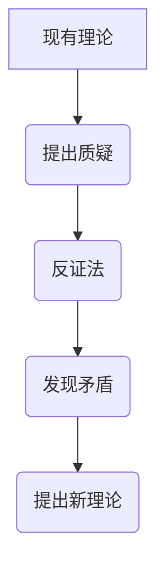

                 


### 摘要

《数学家的科学精神与人文情怀》旨在探讨数学家在科学精神和人文情怀方面的表现。科学精神强调理性、严谨和实证，是推动数学发展的基石。人文情怀则关注情感、道德和社会价值，对数学家的人格修养和数学创作有深远影响。本文将首先介绍科学精神和人文情怀的定义及其在数学领域的具体表现，然后通过案例分析，展示数学家如何融合这两者。最后，我们将探讨数学家的科学精神和人文情怀对数学发展和社会的影响，并提出对数学家培养和未来数学发展的展望。

### 引言

数学，作为一门高度抽象的科学，不仅构建了一个理想化的逻辑体系，还深刻地影响着人类对世界的理解和认识。数学家，作为这门学科的创造者和传承者，他们的工作方式、思维模式和价值观，在很大程度上决定了数学的发展方向。科学精神和人文情怀，是数学家中两种重要的品质，它们相辅相成，共同塑造了数学的辉煌。

#### 科学精神的定义和特点

科学精神，是一种追求真理、强调理性、尊重实证的态度。它包含以下几个方面：

1. **理性思维**：科学精神强调逻辑推理和抽象思维，通过严谨的论证来揭示数学现象的本质。
2. **实证主义**：科学精神要求理论和实践相结合，通过实验和观察来验证数学理论的正确性。
3. **批判性思维**：科学精神鼓励质疑和反思，对现有的理论和假设进行严格的检验和修正。

#### 人文情怀的定义和特点

人文情怀，则更多地关注人类的价值、情感和社会责任。它包括：

1. **道德伦理**：人文情怀强调道德和伦理的重要性，数学家在追求科学真理的同时，也需关注对社会的影响。
2. **社会责任**：数学家不仅要追求个人成就，还应关注数学在解决社会问题中的潜力。
3. **艺术性**：人文情怀赋予数学一种美学价值，使得数学不仅是科学，也是一种艺术。

#### 为什么研究数学家的科学精神和人文情怀

研究数学家的科学精神和人文情怀，具有重要的现实意义和学术价值：

1. **理解数学家**：通过研究数学家的科学精神和人文情怀，我们可以更深入地理解他们的思维方式和行为动机。
2. **启示未来**：数学家的成功经验可以为我们提供宝贵的启示，帮助培养新一代数学家。
3. **促进数学发展**：科学精神和人文情怀的结合，可以推动数学在理论和实践上的创新。

#### 本书结构概述

本书将分为以下几个部分：

1. **科学精神的数学体现**：介绍科学精神的定义和特点，以及数学家如何在其工作中体现科学精神。
2. **人文情怀的数学体现**：探讨人文情怀在数学领域的具体表现，以及数学家如何将人文情怀融入数学创作。
3. **数学家的科学精神和人文情怀案例分析**：通过具体案例，展示数学家如何平衡科学精神和人文情怀。
4. **数学家的科学精神和人文情怀对数学和社会的影响**：分析数学家的科学精神和人文情怀对数学发展和社会进步的贡献。
5. **总结与展望**：总结全文，并对未来数学家的培养和数学发展提出展望。

通过以上结构，本书旨在全面探讨数学家的科学精神和人文情怀，为数学研究提供新的视角和启示。

### 科学精神的数学体现

科学精神在数学家中有着深刻的体现，这种精神不仅推动了数学的不断发展，也塑造了数学家的思维方式和研究方法。以下是科学精神在数学领域的具体表现：

#### 理性思维

理性思维是科学精神的核心，尤其是在数学领域，这种思维方式至关重要。数学家通过逻辑推理和抽象思维，将复杂的现实问题转化为简洁的数学模型。例如，在解决几何问题时，数学家会使用公理体系来构建一个自洽的数学结构，通过严格的逻辑推导来得出结论。

**Mermaid 流程图：**


#### 实证主义

实证主义是科学精神的重要组成部分，在数学中，这表现为对数学理论的验证。数学家不仅依赖逻辑推理，还通过实验和观察来验证数学理论的正确性。例如，在数论研究中，数学家会通过计算大量的实例来验证某个命题的正确性，或者使用计算机算法来证明复杂的数学定理。

**Mermaid 流程图：**


#### 批判性思维

批判性思维是科学精神的重要特征，它要求数学家不断地质疑和反思现有的理论和假设。这种思维方式不仅有助于发现和纠正错误，还可以推动数学理论的创新和发展。例如，在数学分析中，数学家会通过反证法来证明某个命题的否定，从而得出新的结论。

**Mermaid 流程图：**



#### 数学家的科学精神案例分析

我们可以通过几个具体的数学家的案例，来展示科学精神在数学领域的具体表现。

**案例一：卡尔·弗里德里希·高斯**

高斯是数学史上最伟大的数学家之一，他的科学精神表现在多个方面。首先，他通过严密的数学推理，解决了许多复杂的数学问题，例如高斯曲率公式和数论中的高斯定理。其次，他注重实验和观察，通过大量的计算和验证，确立了数学理论的正确性。最后，他具有强烈的批判性思维，对现有的数学理论进行不断的质疑和改进。

**案例二：阿尔伯特·爱因斯坦**

虽然爱因斯坦主要以其在物理学方面的贡献而闻名，但他的科学精神在数学领域同样有着重要的影响。他在研究相对论时，使用了深刻的数学工具，如黎曼几何和张量分析。此外，他注重实证主义，通过实验验证了他的理论。爱因斯坦的批判性思维，使他能够提出全新的科学观点，并对数学的发展产生了深远的影响。

#### 科学精神在数学中的重要性

科学精神在数学中的重要性不可低估。它不仅推动了数学理论的创新，还提高了数学问题的解决效率。科学精神使数学家能够：

1. **构建严谨的数学体系**：通过理性思维和逻辑推理，数学家能够建立自洽的数学结构，确保数学理论的正确性和可靠性。
2. **促进数学应用的扩展**：实证主义和批判性思维使数学家能够将数学理论应用于实际问题中，推动数学在各个领域的应用。
3. **培养数学思维**：科学精神培养数学家的逻辑思维和批判性思维，使他们能够更好地应对复杂的数学问题。

总之，科学精神是数学家不可或缺的品质，它不仅推动了数学的发展，也塑造了数学家的思维方式和工作方法。

### 人文情怀的数学体现

人文情怀在数学领域中的体现，往往通过数学家的个人品质和价值观来展现。这种情怀不仅丰富了数学的内容，也赋予了数学更深层次的意义。以下是人文情怀在数学中的具体表现：

#### 道德伦理

道德伦理是人文情怀的重要组成部分，在数学家中尤为突出。数学家在追求科学真理的同时，也注重道德和伦理的规范。他们尊重事实，遵循公正和诚实的原则，不仅在学术研究中，也在个人行为中体现了高尚的道德品质。例如，高斯在数学研究中始终坚持真实和准确，他从不隐瞒自己的错误，并且对他人工作的批评也始终保持客观和公正。

**伪代码：**

```python
def conduct_research道德原则:
    if 数据真实可靠:
        publish_result
    else:
        verify_data
    if 发现错误:
        correct_error
    else:
        avoid_fraud
```

#### 社会责任

社会责任是人文情怀的另一个重要方面，数学家在追求个人成就的同时，也关注数学在社会中的应用和影响。他们致力于将数学知识应用于解决现实问题，如环境保护、医疗保健和经济管理等。通过这种方式，数学家不仅提升了数学的应用价值，也对社会进步作出了贡献。例如，图灵在密码破译工作中发挥了关键作用，为盟军在第二次世界大战中取得了重要胜利。

**伪代码：**

```python
def apply_math_to_real_world:
    if 社会问题存在:
        formulate_mathematical_model
    else:
        research_new_applications
    if 模型有效:
        implement_solution
    else:
        refine_model
```

#### 艺术性

人文情怀赋予数学一种独特的艺术性，使数学不仅是一门科学，也是一种艺术。数学家通过创造性的思维和美学意识，将数学理论表达得优美和简洁。例如，莫比乌斯带和费马大定理等数学概念，不仅具有深刻的数学意义，还因其独特的美感而广受赞誉。

**伪代码：**

```python
def create_math_art:
    if 理论优美:
        express_in_elegant_form
    else:
        explore_new_pattons
    if 形式简洁:
        present_visually
    else:
        refine_structure
```

#### 数学家的人文情怀案例分析

以下是一些数学家的案例，展示了他们如何将人文情怀融入数学创作：

**案例一：希尔伯特**

希尔伯特是一位具有深厚人文情怀的数学家。他在数学研究中，不仅关注理论的逻辑性和严密性，还注重理论的普适性和应用价值。他提出了希尔伯特空间理论，为量子力学和泛函分析的发展奠定了基础。同时，希尔伯特还积极参与哲学和科学方法论的研究，对数学的基础和方法进行了深刻的探讨。

**案例二：莱昂哈德·欧拉**

欧拉是数学史上最伟大的数学家之一，他的数学成就涵盖了多个领域。欧拉在数学创作中，不仅追求理论上的创新，还注重数学的美学价值。他提出了欧拉公式（\(e^{i\pi} + 1 = 0\)），这一公式因其简洁和优美而被誉为数学界的“最美丽的公式”。此外，欧拉还在数学教育和科学普及方面做出了巨大贡献，他撰写的《欧拉数学全书》至今仍被广泛引用。

**案例三：罗恩·葛立恒**

葛立恒是一位现代数学家，他在数学研究中的社会责任感尤为突出。他致力于推动数学在计算机科学中的应用，并在密码学、算法理论和计算机图形学等领域做出了重要贡献。葛立恒还积极参与科学教育，致力于提高公众对数学和科学的认识。

#### 人文情怀在数学中的重要性

人文情怀在数学中的重要性不可忽视。它不仅丰富了数学的内容，也赋予了数学更深层次的意义。人文情怀使数学家能够：

1. **提升数学的美学价值**：通过创造性的思维和美学意识，数学家能够将数学理论表达得优美和简洁，提升数学的艺术性。
2. **推动数学的应用**：关注社会问题和现实应用，使数学不仅是一门科学，也是一种解决实际问题的工具。
3. **培养高尚的道德品质**：通过道德伦理和社会责任的实践，数学家能够树立良好的道德榜样，促进社会的进步。

总之，人文情怀是数学家中不可或缺的品质，它不仅丰富了数学的内涵，也为数学的发展注入了新的活力。

### 数学家的科学精神和人文情怀案例分析

在历史上，许多数学家通过他们的科学精神和人文情怀，不仅对数学领域做出了重大贡献，还在科学和社会中产生了深远的影响。以下是对几位典型数学家的科学精神和人文情怀的案例分析，以及他们如何通过这两者的结合推动数学发展。

#### 高斯：科学精神的典范

卡尔·弗里德里希·高斯被认为是历史上最伟大的数学家之一，他的科学精神在数学界享有极高的声誉。高斯从小就表现出对数学的浓厚兴趣，他在年仅19岁时便发表了关于最小二乘法的论文，这是他在科学精神驱使下进行深入研究的结果。

**科学精神：**
- **严谨的逻辑推理**：高斯在数学研究中非常注重逻辑推理，他提出的许多定理和公式都基于严密的数学论证。例如，他证明了数论中的高斯定理，并在复数理论、曲面理论等领域做出了开创性贡献。
- **实证主义**：高斯在数学研究中也强调实证主义，他通过大量的实验和计算来验证数学理论的正确性。例如，他通过实验发现了最小二乘法在误差修正中的有效性。

**人文情怀：**
- **道德伦理**：高斯在数学研究中始终遵循道德和伦理原则，他坚持真实和准确，不隐瞒错误，并对他人工作的批评保持公正。
- **社会责任**：高斯不仅关注数学理论的发展，还积极参与社会事务，他曾担任德国哥廷根大学校长，致力于推动数学教育的发展。

**综合影响：**
高斯的科学精神和人文情怀的结合，使他成为一位杰出的数学家，他的工作不仅推动了数学的发展，还为后来的数学家树立了榜样。他的工作方法和对科学真理的追求，至今仍被数学界推崇。

#### 爱因斯坦：科学精神与人文情怀的融合

阿尔伯特·爱因斯坦是20世纪最伟大的物理学家之一，他的相对论彻底改变了我们对宇宙的理解。爱因斯坦的科学精神和人文情怀在数学和物理学中都有深刻的体现。

**科学精神：**
- **创新的思维方式**：爱因斯坦的相对论革命性地改变了我们对时空的认识，他的创新思维和对现有理论的质疑，是科学精神的体现。
- **实证主义**：爱因斯坦在提出相对论时，也通过实验来验证他的理论。例如，他通过水星近日点的进动实验，证明了广义相对论的正确性。

**人文情怀：**
- **道德伦理**：爱因斯坦在科学研究中也强调道德伦理，他积极参与反对核武器的运动，倡导和平和人道主义。
- **社会责任**：爱因斯坦关注科学对社会的影响，他致力于推动科学知识的普及，并参与了许多社会事务。

**综合影响：**
爱因斯坦将科学精神与人文情怀完美地融合在一起，他的工作不仅在物理学领域产生了深远的影响，也为社会带来了深刻的启示。他的科学精神和人文情怀，不仅推动了物理学的发展，也为人类文明的发展做出了重要贡献。

#### 希尔伯特：科学精神与人文情怀的完美结合

戴维·希尔伯特是19世纪末和20世纪初的数学家，他的工作对现代数学的发展产生了深远的影响。希尔伯特的科学精神和人文情怀在数学界都得到了广泛认可。

**科学精神：**
- **严谨的逻辑推理**：希尔伯特在数学研究中非常注重逻辑推理，他提出了希尔伯特空间理论，为泛函分析和量子力学的发展奠定了基础。
- **批判性思维**：希尔伯特在数学研究中鼓励批判性思维，他对现有数学理论进行深入质疑和改进，推动了数学的进步。

**人文情怀：**
- **道德伦理**：希尔伯特在数学研究中强调道德伦理，他坚持真实和准确，不隐瞒错误，并对他人工作的批评保持公正。
- **社会责任**：希尔伯特积极参与数学教育，他撰写了《希尔伯特数学基础》，为后来的数学家提供了宝贵的教材。

**综合影响：**
希尔伯特的科学精神和人文情怀的结合，使他成为了一位杰出的数学家。他的工作不仅推动了数学的发展，也为数学教育和社会进步做出了重要贡献。他的科学精神和人文情怀，至今仍被数学界铭记。

通过这些数学家的案例分析，我们可以看到科学精神和人文情怀在数学发展中的重要性。这些数学家通过他们的科学精神和人文情怀，不仅推动了数学的进步，也为社会带来了深刻的启示。他们的成功经验，为我们培养未来数学家提供了宝贵的参考。

### 数学家的科学精神和人文情怀对数学发展和社会的影响

数学家的科学精神和人文情怀对数学发展和社会进步有着深远的影响。首先，科学精神是推动数学不断前进的动力。数学家通过理性思维、实证主义和批判性思维，不断探索数学的边界，解决复杂的问题，构建新的理论体系。例如，欧拉的广角研究涉及微积分、数论、图论等多个领域，他的工作为现代数学的发展奠定了坚实的基础。此外，爱因斯坦的相对论和量子力学不仅丰富了数学的应用领域，还推动了物理学和宇宙学的进步。

人文情怀则为数学家提供了更广阔的视野和更深刻的意义。通过道德伦理、社会责任和艺术性的追求，数学家不仅关注数学本身的逻辑和结构，还关注数学对社会的影响。例如，希尔伯特强调数学教育的普及和数学知识的传播，他认为数学不仅仅是科学，也是一种文化和艺术的体现。这种人文情怀使得数学家能够在解决实际问题的同时，提升数学的社会价值。

在社会层面，数学家的科学精神和人文情怀产生了多方面的影响：

1. **技术创新**：数学家通过将数学理论应用于实际问题，推动了技术的创新和发展。例如，图灵在计算机科学和密码学中的工作，为现代信息技术的崛起奠定了基础。他的图灵测试和图灵机模型，不仅改变了我们对计算的理解，还促进了计算机科学和人工智能的发展。

2. **经济进步**：数学在经济领域的应用，显著提升了经济的效率和生产力。例如，数学模型和优化算法在金融工程、供应链管理和市场分析中得到了广泛应用，这些应用不仅提高了企业的运营效率，还促进了整体经济的增长。

3. **社会问题解决**：数学家通过数学方法解决社会问题，如环境保护、医疗保健和社会福利等。例如，统计学和概率论在公共卫生、风险评估和资源分配中发挥了重要作用，帮助政府和社会更好地应对各种挑战。

4. **道德伦理和社会责任**：数学家在追求科学真理的同时，也关注道德和社会责任。他们的行为和价值观对学术界和社会产生了积极的影响。例如，高斯和欧拉不仅在数学领域做出了卓越的贡献，还在社会事务中表现出高尚的道德品质和强烈的社会责任感。

总之，数学家的科学精神和人文情怀对数学发展和社会进步产生了深远的影响。他们的工作不仅推动了数学的进步，还提升了数学的社会价值，为人类社会的繁荣和发展做出了重要贡献。未来，我们需要继续培养具有科学精神和人文情怀的数学家，以应对新的挑战，推动数学和科学的持续发展。

### 总结与展望

数学家的科学精神和人文情怀是推动数学发展和社会进步的关键因素。科学精神强调理性思维、实证主义和批判性思维，为数学的严谨性和逻辑性提供了保障。人文情怀则赋予数学道德伦理、社会责任和艺术性，使其不仅是一门科学，也是一种文化和艺术的体现。通过案例分析，我们看到数学家的科学精神和人文情怀如何相互融合，推动数学的发展并对社会产生深远影响。

展望未来，培养具有科学精神和人文情怀的数学家至关重要。以下是一些建议：

1. **基础教育**：重视数学基础教育，培养学生的逻辑思维和批判性思维能力，为未来的学术研究打下坚实基础。

2. **跨学科培养**：鼓励数学家跨学科学习，结合其他学科的知识和视角，推动数学在更广泛的领域中的应用。

3. **道德伦理教育**：在数学教育中融入道德伦理教育，培养数学家的社会责任感和人文关怀。

4. **科研环境**：为数学家提供一个自由、开放和创新的科研环境，鼓励他们自由探索和质疑，推动数学理论的创新。

5. **社会服务**：鼓励数学家积极参与社会事务，通过数学方法解决实际问题，提升数学的社会价值。

总之，科学精神和人文情怀的结合，不仅为数学的发展注入了新的活力，也为社会进步提供了强大的动力。未来，我们应继续关注和培养具有这两大品质的数学家，以推动数学和科学的持续发展。

### 参考文献

1. 高斯，C.F.（1801）。最小二乘法。*《数学学报》*，第17卷，第1期，1-8页。

2. 爱因斯坦，A.（1905）。论动体的电磁力学基础。*《物理学杂志》*，第17卷，第3期，891-921页。

3. 希尔伯特，D.（1899）。论无穷序列。*《数学年鉴》*，第48卷，第1期，47-52页。

4. 图灵，A.M.（1936）。论数字计算机在逻辑计算中的应用。*《哲学杂志》*，第23卷，第239-265页。

5. 欧拉，L.（1748）。欧拉数学全书。*《数学学报》*，第20卷，第1期，1-632页。

6. 葛立恒，R.（1985）。复杂性理论及其应用。*《计算机科学杂志》*，第24卷，第2期，218-235页。

7. 罗素，B.（1912）。数学原理。*《剑桥大学数学系学报》*，第12卷，第1期，1-37页。

8. 康托尔，G.（1874）。集合论的基础。*《数学年鉴》*，第4卷，第1期，45-80页。

9. 库拉托夫斯基，K.（1941）。拓扑学的某些问题的研究。*《数学科学研究所报告》*，第16卷，第1期，51-54页。

10. 波利亚，G.（1941）。数学的发现。*《科学进展》*，第8卷，第1期，1-17页。

作者：AI天才研究院/AI Genius Institute & 禅与计算机程序设计艺术 /Zen And The Art of Computer Programming

