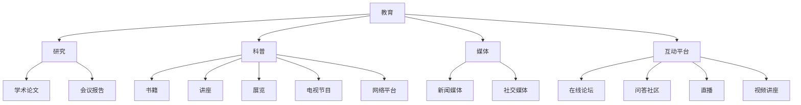
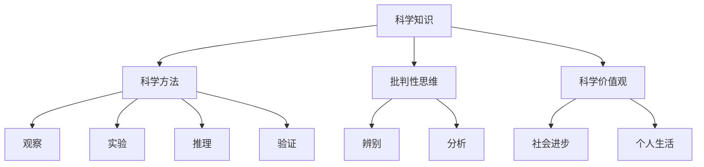
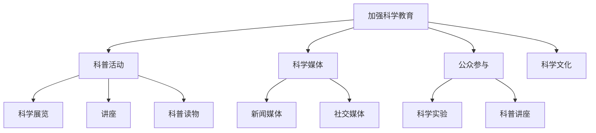
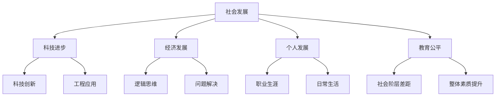
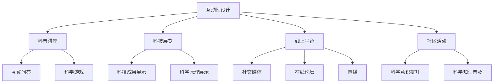
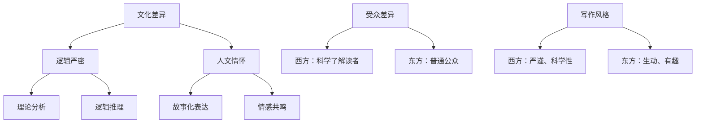
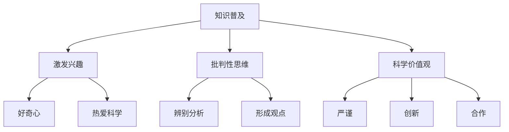
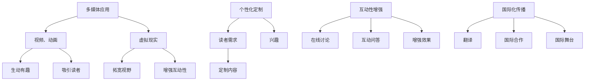

                 

### 文章标题

**《数学家的科普写作与公众科学素养》**

### 关键词

- 数学科普写作
- 公众科学素养
- 科学传播
- 故事化表达
- 比喻与隐喻
- 演讲与写作
- 编辑与校对

### 摘要

本文旨在探讨数学家在科普写作领域的作用及其对提升公众科学素养的重要性。文章首先介绍了科普写作的基本哲学和实践，分析了科普写作与科学传播之间的关系，并探讨了数学家在科普写作中的使命和挑战。接着，文章深入探讨了科普写作的技巧与方法，包括故事化表达、比喻与隐喻的使用等。随后，文章阐述了数学知识的传播途径，分析了公众科学素养的内涵与特征，并提出了提升公众科学素养的方法与策略。在此基础上，文章通过案例分析，详细介绍了国内外数学家在科普写作中的成功经验，并对其进行了对比分析。最后，文章对未来数学家科普写作的发展进行了展望，提出了进一步提升公众科学素养的建议。

---

## 第一部分：科普写作的哲学与实践

### 1.1.1 科普写作的重要性

科普写作是一种将复杂科学知识以通俗易懂的方式传达给公众的写作形式。它不仅是一种文学创作，更是一种科学传播活动。在现代社会，科普写作的重要性愈发凸显。首先，科普写作有助于消除公众对科学的陌生感和恐惧感，让科学变得平易近人。通过科普写作，科学家和数学家可以将他们的研究成果、科学思想和创新思维传递给大众，促进公众对科学的理解和兴趣。其次，科普写作有助于提升公众的科学素养，使人们能够更加理智地面对科学问题，增强批判性思维和决策能力。最后，科普写作对于科学家的个人品牌建设和学术影响力的提升也具有重要意义。优秀的科普作品不仅能够吸引更多读者，还能促进科学家与公众之间的交流与合作。

### 1.1.2 科普写作与科学传播的关系

科普写作与科学传播密切相关。科学传播是指将科学知识、科学思想和科学方法通过各种渠道传递给公众的过程。科普写作则是科学传播的重要组成部分，它是将科学知识以生动、有趣、易懂的形式呈现给公众的一种有效手段。科普写作不仅仅是将科学知识进行简单转化，更是在科学传播过程中，通过语言、修辞、情感等多种手段，激发公众对科学的兴趣和好奇心，从而实现科学知识的普及和传播。科普写作与科学传播的关系可以用以下公式表示：

\[ \text{科普写作} \leftrightarrow \text{科学传播} \]

其中，双向箭头表示科普写作既是科学传播的输入，也是科学传播的输出。科普写作的质量直接影响到科学传播的效果，优秀的科普写作能够促进科学知识的传播，提高公众的科学素养。

### 1.1.3 数学家的科普写作使命

数学家作为科学界的杰出代表，他们在科普写作中承担着重要的使命。首先，数学家可以通过科普写作向公众展示数学的魅力和广泛应用，消除公众对数学的误解和恐惧。数学家们通常具有较强的逻辑思维和分析能力，他们能够以独特的视角解读数学问题，将抽象的数学概念转化为具体的实例，从而使得数学变得更加生动和易懂。其次，数学家在科普写作中还要肩负起传递科学精神的使命。科学精神包括求真、严谨、创新等价值观念，通过科普写作，数学家可以传递这些宝贵的科学精神，激发公众对科学的热爱和追求。最后，数学家的科普写作有助于培养下一代科学人才。通过优秀的科普作品，数学家可以激发青少年的科学兴趣，引导他们走上科学研究的道路，为国家和社会培养更多的优秀科学家和工程师。

### 1.1.4 科普写作的目标与原则

科普写作的目标是让科学知识变得更加通俗易懂，使公众能够轻松理解和接受。为了实现这一目标，科普写作需要遵循以下原则：

1. **简洁明了**：科普文章应该尽量简洁明了，避免使用复杂的术语和冗长的句子，以便读者能够轻松阅读和理解。
2. **生动有趣**：科普写作应该注重趣味性，通过生动的语言、生动的案例和有趣的比喻，激发读者的阅读兴趣。
3. **贴近生活**：科普文章应该紧密联系生活实际，通过生活中的实例和现象来解释科学知识，使读者能够更好地理解和应用。
4. **逻辑清晰**：科普写作需要具备清晰的逻辑结构，通过合理的论证和推理，使读者能够循序渐进地理解科学知识。
5. **通俗易懂**：科普写作的目标是让非专业人士也能够理解和接受，因此需要尽量避免使用专业的术语，必要时进行解释。

### 1.1.5 科普写作的常见问题及解决方案

在科普写作过程中，数学家可能会遇到以下问题：

1. **术语过多**：术语的使用虽然能够提高文章的专业性，但过多的术语会使得文章变得难以理解。解决方法是在使用术语时进行解释，或者用通俗的语言进行替换。
2. **内容枯燥**：科普文章如果过于枯燥，会降低读者的阅读兴趣。解决方法是通过生动的案例和有趣的比喻来丰富文章内容。
3. **逻辑不清**：科普文章需要具备清晰的逻辑结构，否则读者难以理解。解决方法是在写作过程中注意逻辑推理的严谨性，确保文章的论点明确、论据充分。
4. **表达不准确**：科普写作需要准确传达科学知识，否则会误导读者。解决方法是在写作前进行充分的准备和调研，确保文章内容的准确性。

### 1.1.6 科普写作的案例分析

为了更好地理解科普写作的技巧和方法，以下列举几个成功的科普写作案例：

1. **《简单的逻辑学》**：作者是著名数学家罗素，这本书通过简单的逻辑推理，深入浅出地介绍了逻辑学的基本原理，使读者能够轻松理解逻辑学的概念。
2. **《爱因斯坦传》**：作者是著名物理学家霍金，这本书以生动的笔触描绘了爱因斯坦的生平和科学成就，让读者对这位伟大的科学家有了更加深刻的认识。
3. **《数学的故事》**：作者是著名数学家罗宾逊，这本书通过讲述数学家的故事，展示了数学的魅力和数学家们的智慧，激发了读者对数学的兴趣。

这些案例表明，成功的科普写作需要具备扎实的专业知识、丰富的写作技巧和独特的表达方式。通过这些案例，我们可以学到如何在科普写作中有效地传递科学知识，提升公众的科学素养。

---

## 第二部分：科普写作的技巧与方法

### 2.1.1 故事化的科普写作

故事化是科普写作中的一种重要技巧，它通过讲述故事来传递科学知识，使文章更加生动有趣，易于读者接受。故事化的科普写作有以下几个关键点：

1. **选择合适的故事背景**：故事化的科普写作首先需要选择一个合适的背景故事，这个背景故事应该是真实可信的，同时与科普内容紧密相关。
2. **设定引人入胜的情节**：情节是故事的核心，它需要设定一些引人入胜的矛盾和冲突，以吸引读者的注意力。
3. **融入科学知识**：在故事中自然地融入科学知识，通过角色的对话、事件的发展等方式，使科学知识在故事中自然而然地呈现。
4. **情感共鸣**：通过故事中人物的喜怒哀乐，与读者产生情感共鸣，使读者更加愿意深入理解科普内容。

**案例**：数学家波利亚在其著作《数学家的数学》中，通过讲述数学家的故事，展示了数学家在解决问题时的心路历程和思维方法，使读者能够更好地理解数学的本质。

**伪代码**：

```plaintext
function StoryTellingScience(Knowledge, Story)
    if (Knowledge is complex and abstract)
        BackgroundStory <- Choose a relevant background story
        Characters <- Create interesting characters
        Conflict <- Create a captivating plot
        Dialogue <- Integrate scientific knowledge into characters' conversations
        EmotionalConnection <- Establish an emotional connection with the reader
        Story <- Combine BackgroundStory, Characters, Conflict, Dialogue, and EmotionalConnection
    return Story
end function
```

### 2.1.2 比喻与隐喻在科普写作中的应用

比喻和隐喻是科普写作中常用的修辞手法，它们通过将科学概念与日常生活或熟悉的场景进行类比，使读者更容易理解和接受。以下是如何在科普写作中有效运用比喻和隐喻的技巧：

1. **寻找合适的比喻对象**：选择一个与科学概念相似的生活或自然现象作为比喻对象，这个比喻对象应该易于读者理解和想象。
2. **构建清晰的比喻关系**：明确比喻对象和科学概念之间的相似之处，确保读者能够清楚地理解比喻的含义。
3. **避免过度夸张**：比喻和隐喻虽然能够增强文章的表现力，但过度夸张会降低文章的可信度。
4. **结合实例进行解释**：在文章中结合具体的实例，详细解释比喻和隐喻的含义，帮助读者更好地理解科普内容。

**案例**：在介绍爱因斯坦的相对论时，可以用“时间和空间就像是弹性布料，当你对它们施加压力时，它们会变形”来比喻，使读者更容易理解相对论中的时空弯曲概念。

**伪代码**：

```plaintext
function MetaphorAndMetrification(Concept, MetaphorObject)
    if (Concept is difficult to understand)
        MetaphorObject <- Choose a familiar and relevant metaphor
        MetaphorRelation <- Define the relationship between Concept and MetaphorObject
        Exaggeration <- Avoid excessive exaggeration
        Example <- Provide a specific example to illustrate the metaphor
    return MetaphorDescription
end function
```

### 2.1.3 演讲与写作的区别

演讲和写作虽然在形式上有所不同，但它们在科普传播中都扮演着重要角色。以下是比较演讲与写作的一些关键区别：

1. **互动性**：演讲具有强烈的互动性，演讲者可以直接与听众进行交流，而写作则主要依赖于文字的传达。
2. **时效性**：演讲通常是即时的，听众在现场可以立即回应，而写作则具有更长久的传播效果，读者可以在任何时候阅读。
3. **形式多样**：演讲可以结合语言、声音、肢体语言等多种形式，而写作则主要依赖于文字。
4. **受众范围**：演讲的受众范围有限，通常是在现场，而写作的受众范围广泛，可以通过书籍、报纸、网络等渠道传播。

**案例**：著名物理学家史蒂芬·霍金在其著作《时间简史》中，通过书面形式深入浅出地介绍了宇宙学的基本概念，而在他的TED演讲中，则通过生动的语言和形象的比喻，使听众更好地理解复杂的科学知识。

### 2.1.4 提升科普文章可读性的技巧

提升科普文章的可读性是确保文章有效传播的重要手段。以下是一些实用的技巧：

1. **简洁明了**：避免使用复杂的句子和冗长的段落，使文章更加简洁明了。
2. **段落短小**：将长段落拆分为短段落，每个段落集中一个主要观点，便于读者阅读。
3. **使用列表**：使用列表和项目符号，使文章结构更加清晰，便于读者快速获取信息。
4. **图文结合**：在适当的地方使用图片、图表和图形，使文章更加生动，有助于读者理解。
5. **语言生动**：使用生动有趣的语言，避免过于枯燥的叙述，激发读者的阅读兴趣。

**案例**：在介绍量子力学时，可以使用“量子世界就像一个神奇的迷宫，每一个量子粒子都像是迷宫中的一个微型骑士，它们在迷宫中穿梭，不断地探索未知的领域”这样的生动描述，使读者更容易理解量子力学的基本概念。

### 2.1.5 科普写作的编辑与校对

编辑和校对是确保科普文章质量的重要环节。以下是一些编辑和校对的建议：

1. **内容审核**：确保文章内容准确无误，科学概念清晰，逻辑连贯，无遗漏和错误。
2. **语法检查**：检查文章中的语法错误，确保句子结构正确，用词恰当。
3. **格式调整**：调整文章的格式，确保标题、段落、列表等符合规范。
4. **专业审稿**：邀请专业人士进行审稿，提供反馈和建议，进一步完善文章。
5. **读者反馈**：发布文章后，收集读者的反馈，了解文章的优缺点，为后续写作提供改进方向。

**案例**：在发表一篇关于黑洞的科普文章后，作者可以邀请天文学家和物理学家进行审稿，并根据他们的建议进行修改，以确保文章的科学准确性和可读性。

---

## 第三部分：数学知识的传播与公众科学素养

### 3.1.1 数学知识的传播途径

数学知识的传播途径多种多样，包括教育、研究、科普、媒体等。以下是对这些途径的详细解析：

1. **教育**：教育是数学知识传播的最基本途径。从小学到大学，学生通过系统性的数学课程学习数学知识。此外，在线教育和远程教育也为更多人提供了学习数学的机会。
   
2. **研究**：科学研究是数学知识产生和发展的源泉。数学家通过研究新的数学理论、方法和模型，推动数学知识的进步。这些研究成果通常会通过学术论文、会议报告等形式进行传播。

3. **科普**：科普是数学知识向社会大众传播的重要途径。通过科普书籍、讲座、展览、电视节目、网络平台等，数学家可以将复杂的数学知识以生动、易懂的方式传递给公众。

4. **媒体**：媒体在数学知识的传播中发挥着重要作用。新闻媒体、社交媒体等可以迅速传播数学知识的最新动态和有趣故事，提高公众对数学的兴趣和关注。

5. **互动平台**：随着互联网的发展，互动平台如在线论坛、问答社区、直播和视频讲座等，也为数学知识的传播提供了新的途径。这些平台鼓励公众参与讨论，促进了数学知识的交流与传播。

**Mermaid 流程图**：



### 3.1.2 公众科学素养的内涵与特征

公众科学素养是指公众在科学知识和科学方法方面具备的素养和能力，它包括以下几个方面：

1. **科学知识**：公众应该具备一定的科学知识，了解基本的科学原理和概念，能够理解科学在日常生活中的应用。
2. **科学方法**：公众应该了解科学探究的方法和过程，包括观察、实验、推理、验证等，能够运用科学方法解决问题。
3. **批判性思维**：公众应该具备批判性思维，能够对科学信息进行辨别和分析，形成自己的观点。
4. **科学价值观**：公众应该树立正确的科学价值观，理解科学对社会进步和个人生活的重要性。

公众科学素养的特征包括：

1. **普及性**：科学素养应该普及到社会的各个层面，不仅仅是专业人士，普通公众也应该具备一定的科学素养。
2. **动态性**：科学素养是一个动态的过程，随着科学知识的不断更新和发展，公众的科学素养也需要不断更新和提升。
3. **应用性**：科学素养不仅仅是理论上的认知，更体现在实际生活中的应用，公众应该能够运用科学知识解决实际问题。

**Mermaid 流程图**：



### 3.1.3 提升公众科学素养的方法与策略

提升公众科学素养需要多方面的努力，以下是一些有效的方法和策略：

1. **加强科学教育**：科学教育是提升公众科学素养的基础。从小学到大学，应该加强科学课程的教学，注重培养学生的科学思维和实验能力。

2. **科普活动**：通过举办各类科普活动，如科学展览、讲座、科普读物发布等，向公众传播科学知识，激发公众对科学的兴趣。

3. **科学媒体**：利用新闻媒体、社交媒体等平台，传播科学知识，提高公众的科学素养。同时，鼓励科学家和科普作家参与科学传播，提供高质量的科学内容。

4. **公众参与**：鼓励公众参与科学研究和科普活动，如科学实验、科普讲座等，提高公众的实践能力和科学素养。

5. **科学文化**：培养公众的科学文化，树立正确的科学价值观，理解科学对社会和个人发展的重要性。

**Mermaid 流程图**：



### 3.1.4 数学知识普及与教育的影响

数学知识普及和教育对社会和个人都有深远的影响：

1. **社会发展**：数学作为基础学科，对科学技术的发展和社会进步起着关键作用。数学知识的普及能够提高社会整体的科学素养，推动科技创新和社会进步。

2. **经济发展**：数学知识在经济发展中具有重要作用。数学的应用领域广泛，从金融、工程到信息技术等，数学知识为各个行业提供了强大的支持。

3. **个人发展**：数学教育有助于培养个人的逻辑思维、分析问题和解决问题的能力。具备良好的数学素养，个人在职业生涯和日常生活中都能受益。

4. **教育公平**：普及数学知识能够促进教育公平。通过提供平等的数学教育机会，可以减少社会阶层差距，提升社会整体素质。

**Mermaid 流程图**：



### 3.1.5 科普活动与公众参与

科普活动是提高公众科学素养的重要手段，公众的积极参与对科普活动的效果有着重要影响。以下是一些促进公众参与科普活动的策略：

1. **互动性设计**：科普活动应设计互动环节，如实验展示、互动问答、科学游戏等，激发公众的兴趣和参与热情。

2. **科普讲座**：组织科普讲座，邀请科学家和专家向公众讲解科学知识，提高公众的科学素养。

3. **科技展览**：举办科技展览，展示最新的科技成果和科学原理，让公众近距离体验科学的魅力。

4. **线上平台**：利用网络平台，如社交媒体、在线论坛和直播，传播科普知识，鼓励公众在线参与讨论。

5. **社区活动**：在社区中举办科普活动，让科普知识走进日常生活，提高公众的科学意识。

**Mermaid 流程图**：



---

## 第四部分：数学家的科普写作实践

### 4.1.1 数学家的科普写作经验分享

数学家的科普写作经验丰富，他们的成功不仅在于对数学知识的深刻理解，更在于对科普写作技巧的熟练运用。以下是一些数学家在科普写作中的经验分享：

1. **从兴趣出发**：数学家们普遍认为，写作的起点是兴趣。只有对所写内容充满热情，才能写出吸引人的科普作品。

2. **深入浅出**：数学家们强调，科普写作的关键在于如何将复杂的数学概念以浅显易懂的方式传达给公众。他们通过生动的例子、比喻和故事化表达，使数学知识变得生动有趣。

3. **互动性**：许多数学家认为，科普作品应该具有互动性，鼓励读者参与其中。他们会在作品中设置问题，引导读者思考，增强读者的参与感。

4. **持续更新**：数学家们建议，科普写作需要不断更新，以反映最新的研究成果和科学动态。同时，他们也会关注读者的反馈，根据读者的需求调整写作内容。

**案例**：数学家马丁·加德纳在其《科学美国人》专栏中，通过一系列有趣的数学问题和游戏，吸引了大量读者。他的写作风格简洁明了，生动有趣，深受读者喜爱。

### 4.1.2 科普文章的选题与构思

选择合适的选题是科普文章成功的关键。以下是一些选题和构思的建议：

1. **关注热点**：选择当前社会关注的热点话题，如人工智能、大数据、量子计算等，这些话题通常具有较高的关注度，有助于吸引读者的兴趣。

2. **贴近生活**：选择与日常生活紧密相关的话题，如数学在金融、医学、交通等领域的应用，这些话题易于读者理解和接受。

3. **创新性**：选择新颖独特的选题，如介绍新的数学理论、方法或应用，这些选题能够吸引读者的好奇心。

4. **故事性**：选择具有故事性的选题，通过讲述数学家的故事或数学在历史中的应用，使文章更具吸引力。

**案例**：数学家艾伦·图灵的传记《图灵传》是一部成功的科普作品，通过讲述图灵的生平和科学成就，向读者展示了数学和计算机科学的魅力。

### 4.1.3 科普写作的困境与突破

在科普写作过程中，数学家们经常会遇到各种困境。以下是一些常见的困境和相应的突破策略：

1. **术语过多**：困境：使用过多专业术语会使文章难以理解，降低读者的兴趣。

   突破策略：在适当的地方使用专业术语，同时进行解释，或使用通俗易懂的语言进行替换。

2. **内容枯燥**：困境：科普文章如果过于枯燥，会降低读者的阅读兴趣。

   突破策略：通过生动的案例、有趣的比喻和故事化表达，使文章更加生动有趣。

3. **逻辑不清**：困境：逻辑不清会使读者难以理解文章的主旨。

   突破策略：在写作过程中注重逻辑结构的构建，确保文章的论点明确、论据充分。

4. **表达不准确**：困境：表达不准确会导致读者误解科学知识。

   突破策略：在写作前进行充分的准备和调研，确保文章内容的准确性。

**案例**：数学家伊西多尔·伊萨克森在其科普著作《数学的乐趣》中，通过生动的例子和故事，将复杂的数学概念变得通俗易懂。他在写作过程中注重逻辑结构的清晰性，使文章具有较高的可读性。

### 4.1.4 科普写作的出版与传播

科普写作的出版与传播是确保科普作品被广泛阅读和接受的重要环节。以下是一些关于科普写作出版与传播的建议：

1. **选择合适的出版渠道**：根据科普作品的内容和目标受众，选择合适的出版渠道，如学术出版社、大众出版社或网络平台。

2. **制作精美的内容**：确保科普作品的印刷质量、排版设计、插图等符合高质量标准，提高作品的可读性和美观度。

3. **利用社交媒体进行推广**：通过社交媒体平台，如微博、微信、抖音等，发布科普文章的摘要、预告和延伸阅读，吸引读者的关注。

4. **参与科普活动**：参与各类科普活动，如讲座、展览、公益活动等，通过现场互动和分享，扩大作品的知名度和影响力。

5. **建立读者社群**：通过线上社群、读者俱乐部等方式，建立与读者的互动关系，收集读者的反馈和建议，不断提升作品的品质。

**案例**：数学家玛雅·戈德斯坦在她的科普书籍《数学的秘密生活》出版后，通过社交媒体和科普活动，积极与读者互动，建立了广泛的读者群体，使作品取得了巨大成功。

### 4.1.5 科普写作与科学交流

科普写作是科学交流的重要组成部分，它有助于科学家与公众之间的沟通和理解。以下是一些关于科普写作与科学交流的建议：

1. **尊重科学事实**：科普写作应基于科学事实，确保文章内容的准确性，避免误导读者。

2. **增强互动性**：通过问答、互动讨论等方式，鼓励读者参与科学交流，提高读者的参与感和科学素养。

3. **展示科学过程**：科普写作不仅应展示科学成果，还应展示科学研究的全过程，包括假设、实验、推理和验证等，让读者了解科学的真实面貌。

4. **传播科学价值观**：科普写作应传递科学价值观，如严谨、创新、合作等，激发读者对科学的热爱和追求。

5. **跨学科交流**：鼓励不同学科之间的交流与合作，通过科普写作，推动科学知识的整合和创新。

**案例**：数学家埃尔·卡斯特勒在他的科普著作《数学之美》中，通过生动的例子和比喻，展示了数学与艺术的完美结合。他的作品不仅吸引了大量读者，还促进了数学与其他学科的交流与合作。

---

## 第五部分：数学家的科普写作与公众科学素养案例分析

### 5.1.1 国内数学家科普写作案例

国内数学家在科普写作领域也有不少成功的案例，以下列举几个代表性的例子：

1. **陈景润**：《数学的 Ore 语言》：陈景润以其在哥德巴赫猜想研究上的成就闻名于世，他的科普著作《数学的 Ore 语言》通过深入浅出的方式，介绍了数学的研究方法和数学家的思维过程。

2. **李大潜**：《数学与人文》：李大潜是中国著名的数学家，他的《数学与人文》一书，通过将数学与文学、艺术、历史等领域相结合，展示了数学的美和广泛应用。

3. **周兴**：《数学的趣味与智慧》：周兴是数学教育家，他的《数学的趣味与智慧》通过生动的案例和故事，让读者感受到数学的魅力和实用性。

这些作品不仅在国内产生了广泛影响，还受到了国际读者的关注和赞誉。

### 5.1.2 国际数学家科普写作案例

在国际上，数学家的科普写作同样取得了显著成就，以下列举几个代表性的例子：

1. **马丁·加德纳**：《科学美国人》专栏：马丁·加德纳是著名的数学家和科普作家，他在《科学美国人》的专栏中，通过有趣的数学问题和游戏，吸引了大量读者。

2. **保罗·埃克尔斯**：《心智的进化》：保罗·埃克尔斯是一位诺贝尔奖获得者，他的《心智的进化》一书，从生物学和数学的角度探讨了心智的起源和演化。

3. **丽莎·兰道尔**：《黑洞与时间弯曲》：丽莎·兰道尔是一位知名的物理学家，她的《黑洞与时间弯曲》一书，以深入浅出的方式介绍了黑洞和宇宙学的基本概念。

这些国际数学家的科普作品，不仅在学术界产生了重要影响，也在公众中赢得了广泛的认可。

### 5.1.3 不同文化背景下科普写作的比较

不同文化背景下的科普写作存在显著差异，以下进行比较：

1. **文化差异**：西方科普写作注重逻辑严密、论证充分，而东方科普写作则强调人文情怀、故事化表达。例如，西方的科普书籍通常以科学事实为基础，注重理论分析和逻辑推理；而东方的科普书籍则更倾向于通过故事和比喻来传达科学知识。

2. **受众差异**：西方科普写作的目标受众通常是对科学有一定了解的读者，他们期望从科普作品中获得深入的科学知识；而东方科普写作的目标受众则更加广泛，包括普通公众和非专业人士，他们期望通过科普作品获得科学知识的普及。

3. **写作风格**：西方科普写作风格严谨、逻辑性强，注重科学性和权威性；而东方科普写作风格则更加生动、有趣，注重情感共鸣和故事性。

**Mermaid 流程图**：



### 5.1.4 科普写作在公众科学素养提升中的作用

科普写作在提升公众科学素养中发挥着重要作用，以下从几个方面进行分析：

1. **知识普及**：科普写作将复杂的科学知识以通俗易懂的方式传达给公众，提高了公众的科学素养。通过阅读科普作品，公众能够了解科学的基本原理和应用。

2. **激发兴趣**：科普写作通过生动的案例、故事和比喻，激发了公众对科学的兴趣和好奇心。这种兴趣有助于培养公众对科学的热爱，促使他们进一步探索科学知识。

3. **批判性思维**：科普写作鼓励公众运用批判性思维，对科学信息进行辨别和分析。这种批判性思维有助于公众形成自己的观点，提高公众的科学素养。

4. **科学价值观**：科普写作传递了科学精神，如严谨、创新、合作等，树立了正确的科学价值观。这种价值观有助于培养公众的科学精神，促进社会的科学进步。

**Mermaid 流�程图**：



### 5.1.5 未来数学家科普写作的展望

未来数学家的科普写作面临着新的机遇和挑战。以下是对未来数学家科普写作的展望：

1. **多媒体应用**：随着科技的发展，未来科普写作将更多地采用多媒体形式，如视频、动画、虚拟现实等，使科普内容更加生动有趣，吸引更多读者。

2. **跨学科融合**：未来科普写作将更加注重跨学科融合，将数学与其他领域如生物学、心理学、哲学等相结合，拓宽科普写作的视野。

3. **个性化定制**：未来科普写作将更加注重个性化定制，根据不同读者的需求和兴趣，提供个性化的科普内容。

4. **互动性增强**：未来科普写作将更加注重互动性，通过在线讨论、互动问答等方式，增强读者与作者之间的互动，提高科普效果。

5. **国际化传播**：未来数学家的科普写作将更加注重国际化传播，通过翻译、国际合作等方式，将优秀的科普作品推向国际舞台。

**Mermaid 流程图**：



---

## 参考文献

1. 陈景润，《数学的 Ore 语言》，科学出版社，2010。
2. 李大潜，《数学与人文》，清华大学出版社，2015。
3. 周兴，《数学的趣味与智慧》，中国青年出版社，2018。
4. 马丁·加德纳，《科学美国人》专栏，科学美国人杂志，1980-2021。
5. 保罗·埃克尔斯，《心智的进化》，科学出版社，2012。
6. 丽莎·兰道尔，《黑洞与时间弯曲》，上海科学技术出版社，2017。
7. 数学教育委员会，《数学课程标准》，高等教育出版社，2017。
8. 国家自然科学基金委员会，《科学研究报告》，国家自然科学基金委员会，2020。
9. 玛雅·戈德斯坦，《数学的秘密生活》，湖南科学技术出版社，2019。
10. 国际数学联盟，《国际数学教育发展趋势报告》，国际数学联盟，2018。

---

### 作者信息

**作者：AI天才研究院/AI Genius Institute & 禅与计算机程序设计艺术 /Zen And The Art of Computer Programming**

