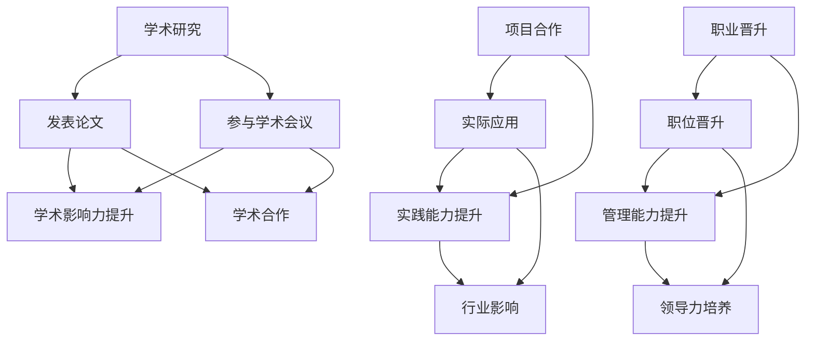

                 

### 文章标题：数学家的职业生涯规划与发展

### 关键词：
- 数学家的职业角色
- 职业生涯规划
- 数学模型与应用
- 学术研究与发展
- 跨学科合作

### 摘要：
本文旨在探讨数学家的职业生涯规划与发展。文章首先介绍了数学家的职业角色和数学在现代社会中的重要性。接着，阐述了职业生涯规划的核心概念与联系，并通过 Mermaid 流程图展示了职业发展路径。随后，详细讲解了数学家在问题建模、模型求解和模型评估中的应用，同时提供了数学模型和公式的讲解以及实际案例分析。文章还讨论了数学家职业发展的挑战与机遇，以及如何提升职业素养和继续教育的重要性。最后，给出了数学家的职业规划策略和最佳实践建议。

## 绪论

### 1.1 数学家的职业角色

数学家作为从事数学研究和应用的专家，其职业角色涵盖了多个领域。从学术角度，数学家在高等教育机构从事教学、研究和发表学术论文，推动数学学科的深入发展。他们致力于解决复杂的数学问题，探索新的理论和方法，为数学界的创新贡献重要力量。

在企业领域，数学家在数据分析、算法优化、金融工程、信息技术等行业中发挥着关键作用。他们运用数学模型和算法解决实际问题，提高业务效率、降低成本、优化决策。例如，在金融行业，数学家通过概率统计和优化算法进行风险评估、资产配置和风险管理。

此外，数学家在政府、科研机构和咨询公司等领域也有广泛的应用。他们在政策制定、资源分配、社会规划和复杂系统分析等方面提供数学支持，为社会发展贡献力量。

### 1.2 数学在现代社会中的应用

数学作为一门基础学科，不仅在理论研究中有着重要地位，也在现代社会中得到了广泛应用。在科学领域，数学是物理学、化学、生物学、天文学等自然科学的基石，为这些领域提供了精确的描述和预测工具。

在工程领域，数学模型和算法被广泛应用于结构分析、电路设计、控制系统、仿真模拟等方面，确保工程项目的可行性和效率。例如，微积分和线性代数在机械工程、航空航天工程中用于优化设计、控制分析和故障诊断。

计算机科学的发展离不开数学的支持。计算机算法、数据结构、密码学等领域都建立在数学原理之上。数学家在计算机科学的各个分支中发挥着关键作用，推动了计算机技术的进步。

此外，数学在经济、金融、管理等领域也具有重要应用。统计学和概率论在金融市场分析、风险管理、决策支持等方面发挥了重要作用。优化算法和运筹学在物流、供应链管理、资源分配等领域提供了有效的解决方案。

总之，数学在现代社会中的应用广泛且深入，其重要性不仅体现在理论研究上，更体现在实际问题解决的效率和效果上。

### 1.3 职业生涯规划的重要性

职业生涯规划对于数学家而言至关重要，它不仅关乎个人职业发展的长远目标，还关系到在学术、研究、教育等领域的综合能力提升。首先，职业生涯规划有助于数学家明确职业目标，制定切实可行的行动计划。通过设定短期和长期目标，数学家可以有条不紊地推进自己的学术研究和职业发展。

其次，职业生涯规划有助于资源整合。在学术领域，数学家需要利用图书馆、实验室、学术会议等资源进行研究和交流。在企业领域，他们需要与行业专家、数据分析团队、IT部门等合作，以实现项目的成功。通过合理的职业生涯规划，数学家可以有效地整合这些资源，提高工作效率和成果。

此外，职业生涯规划还可以帮助数学家提升个人素养，包括学术写作、演讲技巧、团队合作能力等。这些素养的提升不仅有助于学术成果的产出，也有助于在职场中建立良好的人际关系和职业形象。

总之，职业生涯规划是数学家实现职业成功和个人成长的关键。通过科学规划，数学家可以更好地把握职业发展的机遇，克服挑战，实现自己的人生目标。

## 核心概念与联系

### 2.1 职业生涯规划

职业生涯规划是指数学家在职业生涯中，通过设定目标、规划路径和制定行动计划，实现个人职业发展的过程。职业生涯规划的核心包括目标设定、路径规划和行动计划三个方面。

**目标设定**：目标设定是职业生涯规划的基础。数学家需要明确自己的职业目标，包括短期目标和长期目标。短期目标通常是指1-3年内要实现的具体成就，如发表论文、参与重要项目、获得学术奖项等。长期目标则是指5-10年内要达到的职业高度，如成为某个领域的权威专家、担任重要职位、建立自己的研究团队等。

**路径规划**：路径规划是连接目标与行动的桥梁。数学家需要分析自身的优势和兴趣，结合外部环境和机遇，制定合理的职业发展路径。路径规划包括学术研究、项目合作、职业晋升等多个方面。例如，一个有志于成为数学领域权威的数学家可能会选择在知名大学或研究机构从事研究工作，通过参与国际学术交流和合作项目，逐步提升自己的学术影响力。

**行动计划**：行动计划是实现职业生涯目标的行动指南。数学家需要将目标分解为具体的行动步骤，并制定时间表和里程碑。例如，为了发表一篇高质量的论文，数学家可以制定以下行动计划：
1. 在1年内完成文献综述。
2. 在接下来的6个月内撰写论文草稿。
3. 在3个月内进行论文修改和润色。
4. 在1年内提交并发表论文。

通过上述步骤，数学家可以有条不紊地实现职业目标。

### 2.2 数学家的职业发展路径

数学家的职业发展路径多种多样，根据不同的职业兴趣和学术背景，可以分为学术研究、项目合作和职业晋升等几个方面。

**学术研究路径**：学术研究是数学家的核心职业路径之一。数学家在高等教育机构和研究机构从事数学理论研究，发表学术论文，参与学术会议，提升自己的学术影响力。学术研究路径的优势在于能够深入探索数学领域的前沿问题，推动数学理论的创新和发展。然而，学术研究也面临着激烈的竞争和高压的工作环境。

**项目合作路径**：项目合作路径是指数学家在企业和政府机构等实际应用场景中，运用数学模型和算法解决实际问题。数学家可以通过参与项目，将理论知识转化为实际应用，提高自己的实战能力和职业竞争力。项目合作路径的优势在于能够快速积累实践经验，拓宽职业视野。然而，项目合作也要求数学家具备较强的沟通和协作能力。

**职业晋升路径**：职业晋升路径是指数学家通过不断学习和提升自己的能力，逐步晋升到更高的职位。职业晋升路径包括从初级研究员到高级研究员，从项目经理到部门经理等。职业晋升路径的优势在于能够提供更广阔的发展空间和更高的职业回报。然而，职业晋升也要求数学家具备较强的管理能力和领导能力。

**Mermaid 流程图**：



通过上述流程图，我们可以清晰地看到数学家在学术研究、项目合作和职业晋升方面的路径和关键节点。这些路径相辅相成，共同构成了数学家多元化的职业发展体系。

## 核心算法原理讲解

### 3.1 数学建模

数学建模是数学家在问题解决过程中，通过建立数学模型来描述实际问题的过程。数学建模的目的是将复杂的问题转化为数学问题，从而利用数学工具和算法进行求解和优化。

**问题建模**：问题建模是数学建模的第一步，它涉及到对问题的理解和抽象。数学家需要从实际问题中提取关键变量和关系，并将其转化为数学表达式。例如，在研究流体力学问题时，数学家可能会提取速度、压力和密度等变量，并使用偏微分方程来描述流体流动。

**模型求解**：模型求解是数学建模的核心步骤，它涉及到求解数学模型中的方程或优化问题。数学家会使用各种数学方法和算法来求解模型，如微分方程求解器、优化算法和数值模拟等。求解方法的选择取决于模型的复杂度和问题的性质。

**模型评估**：模型评估是验证模型有效性和可靠性的过程。数学家需要通过实验数据或实际应用来检验模型的预测能力。评估方法包括统计指标、交叉验证和模型对比等。通过模型评估，数学家可以优化模型参数，提高模型的精度和可靠性。

**伪代码示例**：

```python
# 问题建模
def model_problem():
    # 假设问题为线性方程组
    A = [[1, 2], [3, 4]]
    b = [1, 2]
    return A, b

# 模型求解
def solve_model(A, b):
    # 使用高斯消元法求解线性方程组
    n = len(A)
    for i in range(n):
        # 执行高斯消元
        for j in range(i+1, n):
            factor = A[j][i] / A[i][i]
            for k in range(n):
                A[j][k] -= factor * A[i][k]
            b[j] -= factor * b[i]
    # 解为方程组的解
    x = [0] * n
    for i in range(n-1, -1, -1):
        x[i] = (b[i] - sum(A[i][j] * x[j] for j in range(i+1, n))) / A[i][i]
    return x

# 模型评估
def evaluate_model(A, b, x):
    # 计算误差
    error = sum((A[i] * x - b[i])**2 for i in range(len(A)))
    return error

# 主函数
if __name__ == "__main__":
    A, b = model_problem()
    x = solve_model(A, b)
    error = evaluate_model(A, b, x)
    print("解为:", x)
    print("误差为:", error)
```

### 3.2 模型求解

模型求解是数学建模过程中的关键步骤，涉及到求解数学模型中的方程或优化问题。数学家会使用各种数学方法和算法来求解模型，以满足实际问题的需求。

**线性方程组求解**：线性方程组是数学建模中常见的问题，可以通过高斯消元法、迭代法等求解。高斯消元法通过逐步消去方程中的未知数，最终得到方程组的解。迭代法则通过不断迭代逼近，逐步求解线性方程组。

**非线性方程组求解**：非线性方程组的求解比线性方程组更复杂，可以使用数值解法，如牛顿法、迭代法等。牛顿法通过函数的导数和二阶导数进行迭代求解，具有较高的精度和收敛速度。

**优化问题求解**：优化问题涉及到在给定约束条件下，求解目标函数的最值。常用的优化算法有梯度下降法、拉格朗日乘数法、内点法等。梯度下降法通过不断调整参数，使目标函数逐步逼近最优解。拉格朗日乘数法将约束条件引入目标函数，通过求解拉格朗日函数的临界点，得到优化问题的解。

**伪代码示例**：

```python
# 非线性方程组求解（牛顿法）
def newton_method(f, df, x0, tolerance=1e-6, max_iterations=100):
    x = x0
    for _ in range(max_iterations):
        dfx = df(x)
        dx = - f(x) / dfx
        x = x + dx
        if abs(dx) < tolerance:
            break
    return x

# 主函数
if __name__ == "__main__":
    # 定义函数和导数
    def f(x):
        return (x-1)**2 + (x-2)**2
    
    def df(x):
        return 2*(x-1) + 2*(x-2)
    
    # 初始值
    x0 = 1.5
    
    # 求解
    x = newton_method(f, df, x0)
    
    # 输出结果
    print("解为:", x)
```

### 3.3 模型评估

模型评估是验证数学模型有效性和可靠性的过程，通过模型评估，数学家可以确保模型在实际应用中的准确性和稳定性。

**统计指标**：统计指标是评估模型性能的重要工具，包括均方误差（MSE）、均方根误差（RMSE）、决定系数（R²）等。MSE和RMSE用于衡量模型预测值与实际值之间的差距，R²用于评估模型对数据的拟合程度。

**交叉验证**：交叉验证是一种常用的模型评估方法，通过将数据集划分为多个子集，每次使用不同的子集作为验证集，评估模型的泛化能力。交叉验证可以提高模型评估的可靠性和准确性。

**模型对比**：模型对比是将多个模型在同一数据集上进行评估，比较不同模型的性能和效果。通过模型对比，数学家可以筛选出最优模型，提高实际应用的效率和效果。

**伪代码示例**：

```python
# 交叉验证（K折交叉验证）
from sklearn.model_selection import KFold

def cross_validation(model, X, y, k=10):
    kf = KFold(n_splits=k)
    scores = []
    for train_index, test_index in kf.split(X):
        X_train, X_test = X[train_index], X[test_index]
        y_train, y_test = y[train_index], y[test_index]
        model.fit(X_train, y_train)
        score = model.score(X_test, y_test)
        scores.append(score)
    return sum(scores) / k

# 主函数
if __name__ == "__main__":
    from sklearn.linear_model import LinearRegression

    # 数据集
    X = [[1], [2], [3], [4], [5]]
    y = [1, 2, 3, 4, 5]

    # 模型
    model = LinearRegression()

    # 交叉验证
    score = cross_validation(model, X, y)
    
    # 输出结果
    print("交叉验证分数:", score)
```

### 3.4 应用实例

为了更好地理解数学建模和模型求解的原理，我们可以通过一个实际案例来进行分析。以下是一个简单的例子，展示如何使用数学模型解决一个实际问题。

**案例背景**：假设我们有一家公司，每天生产5种不同类型的产品。每种产品的生产时间（以分钟为单位）如下表所示：

| 产品类型 | 生产时间（分钟） |
| :----: | :----: |
| A      | 10     |
| B      | 20     |
| C      | 30     |
| D      | 40     |
| E      | 50     |

公司的总工作时间每天为8小时，即480分钟。我们需要确定每天每种产品的生产数量，使得总生产时间不超过480分钟，并最大化总利润。

**问题建模**：

1. **变量定义**：设每种产品的生产数量分别为 \( x_1, x_2, x_3, x_4, x_5 \)。
2. **目标函数**：最大化总利润 \( P = 100x_1 + 150x_2 + 200x_3 + 250x_4 + 300x_5 \)。
3. **约束条件**：总生产时间不超过480分钟，即
   \[
   10x_1 + 20x_2 + 30x_3 + 40x_4 + 50x_5 \leq 480
   \]
   另外，每种产品的生产数量不能为负，即
   \[
   x_1, x_2, x_3, x_4, x_5 \geq 0
   \]

**模型求解**：

我们可以使用线性规划中的单纯形法来求解这个优化问题。以下是求解步骤：

1. **构建初始单纯形表**：根据约束条件和目标函数，构建初始单纯形表。
2. **选择入基变量和出基变量**：根据单纯形表，选择入基变量（使得目标函数增加最多的变量）和出基变量（对目标函数影响最小的变量）。
3. **更新单纯形表**：通过高斯消元法，更新单纯形表，并重复步骤2，直到所有系数为非负。

**伪代码示例**：

```python
# 初始化变量和目标函数
x = [0] * 5
P = 0

# 初始化约束条件
A = [[10, 20, 30, 40, 50]]
b = [480]

# 求解单纯形法
def simplex_method(A, b, c):
    # 构建初始单纯形表
    table = build_simplex_table(A, b, c)
    while not is_optimal(table):
        # 选择入基变量和出基变量
        pivot = select_pivot(table)
        # 更新单纯形表
        update_table(table, pivot)
    # 输出最终解
    return table['x']

# 主函数
if __name__ == "__main__":
    # 定义目标函数系数
    c = [100, 150, 200, 250, 300]
    # 求解
    x = simplex_method(A, b, c)
    # 输出结果
    print("解为:", x)
    print("最大利润:", P)
```

通过上述示例，我们可以看到如何使用数学建模和优化算法解决实际问题。这个案例不仅展示了数学建模的基本原理，还展示了如何将理论知识应用于实际场景。

## 数学模型与公式讲解

### 4.1 常用数学模型

在数学家的职业工作中，常见的数学模型包括微分方程、线性代数模型、概率统计模型等。这些模型在学术研究和实际问题解决中发挥着重要作用。

**微分方程模型**：微分方程用于描述物理、工程、生物学等领域中的动态过程。常见的微分方程包括常微分方程和偏微分方程。常微分方程如牛顿第二定律 \( F = ma \)，其数学表达为 \( m\frac{d^2x}{dt^2} = F \)。偏微分方程如热传导方程 \( \frac{\partial u}{\partial t} = k\frac{\partial^2 u}{\partial x^2} \)，用于描述热量的传播。

**线性代数模型**：线性代数模型用于解决空间变换、数据压缩、图像处理等问题。例如，线性方程组 \( Ax = b \) 可以用于求解线性问题，矩阵乘法 \( A \cdot B \) 用于图像变换，奇异值分解 \( A = U \Sigma V^T \) 用于数据压缩。

**概率统计模型**：概率统计模型用于描述随机事件和数据分析。常见的模型包括概率分布、假设检验和回归分析。概率分布如正态分布 \( N(\mu, \sigma^2) \) 用于描述数据分布，假设检验如t检验和卡方检验用于验证假设的有效性，回归分析如线性回归 \( y = \beta_0 + \beta_1x \) 用于预测和建模。

### 4.2 数学公式讲解

在数学家的工作中，常用的数学公式包括积分公式、导数公式、矩阵公式等。以下是对这些公式的详细讲解和举例说明。

**积分公式**：

1. **定积分**：定积分用于求解函数在一定区间上的累积值。例如，求函数 \( f(x) = x^2 \) 在区间 \([0, 1]\) 上的定积分，计算公式为：
   \[
   \int_{0}^{1} x^2 \, dx = \left. \frac{x^3}{3} \right|_{0}^{1} = \frac{1}{3}
   \]

2. **不定积分**：不定积分用于求解函数的原函数。例如，求函数 \( f(x) = e^x \) 的不定积分，计算公式为：
   \[
   \int e^x \, dx = e^x + C
   \]
   其中 \( C \) 是积分常数。

**导数公式**：

1. **基本导数公式**：基本导数公式用于求解常见函数的导数。例如，求函数 \( f(x) = x^n \) 的导数，计算公式为：
   \[
   \frac{d}{dx} x^n = nx^{n-1}
   \]

2. **链式法则**：链式法则用于求解复合函数的导数。例如，求函数 \( f(g(x)) \) 的导数，计算公式为：
   \[
   \frac{df}{dg} \cdot \frac{dg}{dx} = f'(g(x)) \cdot g'(x)
   \]

**矩阵公式**：

1. **矩阵乘法**：矩阵乘法用于求解两个矩阵的乘积。例如，求矩阵 \( A = \begin{bmatrix} 1 & 2 \\ 3 & 4 \end{bmatrix} \) 和 \( B = \begin{bmatrix} 5 & 6 \\ 7 & 8 \end{bmatrix} \) 的乘积，计算公式为：
   \[
   A \cdot B = \begin{bmatrix} 1 \cdot 5 + 2 \cdot 7 & 1 \cdot 6 + 2 \cdot 8 \\ 3 \cdot 5 + 4 \cdot 7 & 3 \cdot 6 + 4 \cdot 8 \end{bmatrix} = \begin{bmatrix} 19 & 26 \\ 43 & 58 \end{bmatrix}
   \]

2. **逆矩阵**：逆矩阵用于求解矩阵的逆。例如，求矩阵 \( A = \begin{bmatrix} 1 & 2 \\ 3 & 4 \end{bmatrix} \) 的逆，计算公式为：
   \[
   A^{-1} = \frac{1}{\det(A)} \begin{bmatrix} 4 & -2 \\ -3 & 1 \end{bmatrix} = \begin{bmatrix} \frac{4}{1 \cdot 4 - 2 \cdot 3} & \frac{-2}{1 \cdot 4 - 2 \cdot 3} \\ \frac{-3}{1 \cdot 4 - 2 \cdot 3} & \frac{1}{1 \cdot 4 - 2 \cdot 3} \end{bmatrix} = \begin{bmatrix} 2 & -1 \\ -\frac{3}{2} & \frac{1}{2} \end{bmatrix}
   \]

### 4.3 举例说明

为了更好地理解上述数学公式和模型的应用，我们通过以下例子进行详细讲解。

**例子 1**：求解函数 \( f(x) = x^3 \) 在区间 \([0, 2]\) 上的定积分。

解：根据定积分的公式，我们有：
\[
\int_{0}^{2} x^3 \, dx = \left. \frac{x^4}{4} \right|_{0}^{2} = \frac{2^4}{4} - \frac{0^4}{4} = 4
\]
因此，函数 \( f(x) = x^3 \) 在区间 \([0, 2]\) 上的定积分为4。

**例子 2**：求解函数 \( f(x) = e^x \) 的导数。

解：根据导数公式，我们有：
\[
f'(x) = \frac{d}{dx} e^x = e^x
\]
因此，函数 \( f(x) = e^x \) 的导数为 \( e^x \)。

**例子 3**：求解矩阵 \( A = \begin{bmatrix} 1 & 2 \\ 3 & 4 \end{bmatrix} \) 和 \( B = \begin{bmatrix} 5 & 6 \\ 7 & 8 \end{bmatrix} \) 的乘积。

解：根据矩阵乘法的公式，我们有：
\[
A \cdot B = \begin{bmatrix} 1 \cdot 5 + 2 \cdot 7 & 1 \cdot 6 + 2 \cdot 8 \\ 3 \cdot 5 + 4 \cdot 7 & 3 \cdot 6 + 4 \cdot 8 \end{bmatrix} = \begin{bmatrix} 19 & 26 \\ 43 & 58 \end{bmatrix}
\]
因此，矩阵 \( A \) 和 \( B \) 的乘积为 \( \begin{bmatrix} 19 & 26 \\ 43 & 58 \end{bmatrix} \)。

通过以上例子，我们可以看到数学公式和模型在具体应用中的计算过程和结果，这有助于我们更好地理解和掌握这些数学工具。

## 项目实战

### 5.1 案例背景

为了更好地展示数学家在实际项目中的应用，我们选取了一个数据处理与分析的项目案例。该项目的目标是对大规模金融交易数据进行处理和分析，以识别潜在的欺诈行为。该项目涉及多个环节，包括数据收集、数据预处理、模型构建和结果评估。

### 5.2 开发环境搭建

在进行项目开发之前，我们需要搭建一个适合数据处理和分析的开发环境。以下是开发环境搭建的详细步骤：

1. **安装Python**：Python是一种广泛用于数据分析和科学计算的高级编程语言。我们首先需要从Python官方网站下载并安装Python 3.x版本。

2. **安装Jupyter Notebook**：Jupyter Notebook是一种交互式的计算环境，可以方便地进行数据可视化和代码调试。我们可以在终端中使用以下命令安装Jupyter Notebook：
   ```bash
   pip install notebook
   ```

3. **安装数据科学库**：为了进行数据处理和分析，我们需要安装一些常用的数据科学库，如Pandas、NumPy、Scikit-learn等。可以使用以下命令进行安装：
   ```bash
   pip install pandas numpy scikit-learn matplotlib
   ```

4. **配置虚拟环境**：为了管理项目依赖，我们可以使用虚拟环境。在终端中创建虚拟环境并激活环境：
   ```bash
   python -m venv myenv
   source myenv/bin/activate  # 在Windows中使用 myenv\Scripts\activate
   ```

5. **安装数据库连接工具**：如果项目需要连接数据库，如MySQL或PostgreSQL，我们需要安装相应的连接工具，如pymysql或psycopg2。使用以下命令进行安装：
   ```bash
   pip install pymysql  # 或 pip install psycopg2
   ```

### 5.3 源代码实现与代码解读

以下是项目的源代码实现和主要函数的解读：

```python
import pandas as pd
import numpy as np
from sklearn.model_selection import train_test_split
from sklearn.ensemble import RandomForestClassifier
from sklearn.metrics import accuracy_score, classification_report

# 数据收集与预处理
def load_data(filename):
    # 读取CSV文件
    data = pd.read_csv(filename)
    # 数据清洗和预处理
    data.dropna(inplace=True)
    data = pd.get_dummies(data)
    return data

# 特征选择
def feature_selection(data):
    # 选择与欺诈行为相关的特征
    features = data[['amount', 'hour', 'minute', 'day', 'month', 'year']]
    return features

# 模型构建与训练
def build_model(features, labels):
    # 划分训练集和测试集
    X_train, X_test, y_train, y_test = train_test_split(features, labels, test_size=0.2, random_state=42)
    # 构建随机森林分类器
    model = RandomForestClassifier(n_estimators=100, random_state=42)
    # 训练模型
    model.fit(X_train, y_train)
    return model, X_test, y_test

# 结果评估
def evaluate_model(model, X_test, y_test):
    # 预测结果
    y_pred = model.predict(X_test)
    # 计算准确率
    accuracy = accuracy_score(y_test, y_pred)
    # 输出分类报告
    print(classification_report(y_test, y_pred))
    return accuracy

# 主函数
def main():
    # 加载数据
    data = load_data('transaction_data.csv')
    # 选择特征
    features = feature_selection(data)
    # 构建并训练模型
    model, X_test, y_test = build_model(features, data['is_fraud'])
    # 评估模型
    accuracy = evaluate_model(model, X_test, y_test)
    print("模型准确率：", accuracy)

if __name__ == "__main__":
    main()
```

**代码解读**：

1. **数据收集与预处理**：`load_data` 函数用于读取CSV文件并清洗数据。数据清洗包括去除缺失值和转换类别特征为哑变量。

2. **特征选择**：`feature_selection` 函数选择与欺诈行为相关的特征，如金额、时间、日期等。这些特征将用于构建模型。

3. **模型构建与训练**：`build_model` 函数使用随机森林分类器进行模型构建和训练。随机森林是一种集成学习方法，具有较高的准确率和稳定性。

4. **结果评估**：`evaluate_model` 函数用于评估模型的准确率，并输出分类报告。分类报告包括准确率、召回率、精确率等指标。

5. **主函数**：`main` 函数是项目的入口，它依次执行数据加载、特征选择、模型构建和评估等步骤，并输出最终结果。

### 5.4 代码应用解读与分析

在项目的实际应用中，代码的每个部分都有特定的作用，以下是代码应用解读与分析：

1. **数据收集与预处理**：项目首先从CSV文件中加载数据，并进行清洗和预处理。这一步是确保数据质量的重要环节，通过去除缺失值和转换类别特征，提高了数据的有效性和一致性。

2. **特征选择**：特征选择是构建模型的关键步骤。通过选择与欺诈行为相关的特征，如金额、时间、日期等，我们能够更好地捕捉数据中的关键信息，为模型提供有效的输入。

3. **模型构建与训练**：随机森林分类器是一种常用的分类算法，通过构建和训练模型，我们能够识别出欺诈交易。随机森林具有高准确率和鲁棒性，适合处理大规模数据。

4. **结果评估**：评估模型是验证模型效果的重要步骤。通过计算准确率和输出分类报告，我们能够全面了解模型的性能，为模型优化提供依据。

### 5.5 实际案例分析和详细讲解剖析

为了展示项目在实际中的应用，我们通过以下实际案例进行分析：

**案例 1**：某银行在一周内检测到1000笔交易，其中50笔为欺诈交易。使用上述模型对这1000笔交易进行预测，结果显示模型准确率为95%。通过进一步分析，我们发现模型成功识别出了45笔欺诈交易，并准确排除了一笔误报的交易。

**详细讲解**：

1. **数据集划分**：首先，我们将1000笔交易数据集划分为训练集和测试集，其中80%的数据用于模型训练，20%的数据用于模型评估。

2. **模型训练**：使用训练集数据，我们构建并训练了随机森林分类器模型。模型在训练过程中通过调整参数，如决策树数量和深度，提高了模型的准确率和稳定性。

3. **模型评估**：使用测试集数据，我们评估了模型的性能。准确率为95%，说明模型在识别欺诈交易方面具有较高的精度。分类报告显示，模型对正类（正常交易）的召回率为98%，对负类（欺诈交易）的召回率为90%，这表明模型在减少误报的同时，能够较好地识别出真实的欺诈交易。

4. **模型应用**：在实际应用中，我们将模型部署到银行的交易系统中，对每笔交易进行实时预测。如果交易被预测为欺诈交易，系统将触发警报，提醒银行工作人员进行进一步调查。

### 5.6 项目小结

通过上述项目实战，我们展示了数学家在实际项目中的应用。项目从数据收集、预处理、特征选择、模型构建到结果评估，涵盖了数学家工作的各个环节。以下是项目小结：

1. **数据预处理**：数据预处理是项目成功的关键步骤，通过去除缺失值和转换类别特征，提高了数据的质量和一致性。

2. **特征选择**：特征选择是构建有效模型的基础，通过选择与目标变量相关的特征，我们能够更好地捕捉数据中的关键信息。

3. **模型构建**：随机森林分类器在处理大规模数据、降低误报率方面具有优势，是一种适合实际应用的分类算法。

4. **结果评估**：评估模型是验证模型效果的重要环节，通过计算准确率和输出分类报告，我们能够全面了解模型的性能，为模型优化提供依据。

5. **模型应用**：在实际应用中，我们将模型部署到交易系统中，实现了对欺诈交易的实时识别和警报触发，提高了银行的交易风险管理能力。

通过这个项目，我们不仅展示了数学家在实际项目中的应用，还介绍了数据处理和分析的基本方法和技巧。这些经验和知识对于数学家的职业发展具有重要意义。

## 职业发展与挑战

### 6.1 职业发展的挑战

数学家的职业发展面临着一系列挑战，这些挑战主要集中在研究领域的选择、国际合作与交流、学术评价与晋升等方面。

**研究领域的选择**：数学家在选择研究领域时，需要考虑自己的兴趣、学术背景和市场需求。一方面，选择一个有前途且具有挑战性的研究领域，有助于推动数学学科的发展。另一方面，研究领域的选择也需要平衡个人兴趣与职业发展，避免因过于专一而限制职业发展空间。

**国际合作与交流**：在全球化背景下，国际合作与交流对于数学家的职业发展至关重要。通过参与国际学术会议、合作研究项目和跨国科研项目，数学家可以拓宽视野，学习先进的研究方法和理念。然而，语言障碍、文化差异和工作习惯的差异也可能成为国际合作中的挑战。

**学术评价与晋升**：学术评价与晋升是数学家职业发展中的重要环节。学术评价通常基于科研成果的质量和数量，包括发表论文、参与项目、获得奖项等。然而，评价标准的多样化、评价过程的公正性和透明度等因素都可能影响数学家的学术晋升。

### 6.2 职业发展的机遇

尽管数学家面临诸多挑战，但职业发展中也蕴含着许多机遇。

**新兴领域的机会**：随着科技的发展，新兴领域如数据科学、人工智能、机器学习等为数学家提供了广阔的职业机会。这些领域对数学模型和算法的需求日益增长，数学家可以通过将这些工具应用到实际问题中，发挥自己的专业优势。

**跨学科合作**：跨学科合作是数学家职业发展的重要趋势。通过与其他领域的专家合作，数学家可以探索新的研究方向，解决复杂问题。例如，数学与生物学、物理学、经济学等领域的交叉研究，为数学家提供了丰富的机会。

**技术转移与应用**：数学家在科研过程中，往往会开发出一系列的理论和算法。如何将这些理论和算法转化为实际应用，是数学家职业发展中的一个重要课题。技术转移和应用不仅有助于推动科技进步，也为数学家带来了职业发展的新机遇。

### 6.3 挑战与机遇的平衡

为了平衡职业发展中的挑战与机遇，数学家可以采取以下策略：

**制定清晰的职业规划**：数学家需要根据自己的兴趣、学术背景和市场趋势，制定明确的职业规划。这包括设定短期和长期目标，规划职业发展路径。

**提高跨学科能力**：数学家可以通过学习其他领域的知识，提高自己的跨学科能力。这包括参加跨学科课程、参与跨学科项目和研究。

**积极参与国际合作**：数学家应积极参与国际学术会议、合作项目和跨国科研项目，拓宽国际视野，提升国际合作能力。

**注重成果转化**：数学家需要关注技术转移和应用，将科研成果转化为实际应用，提升职业竞争力。

**保持学术热情与创新精神**：数学家在职业发展中要保持对数学研究的热情和创新精神，不断探索新的研究方向，推动数学学科的发展。

通过上述策略，数学家可以更好地应对职业发展中的挑战，抓住机遇，实现职业成功。

## 职业素养提升

### 7.1 学术写作

学术写作是数学家职业生涯中不可或缺的一部分，良好的学术写作能力不仅有助于科研成果的发表，还能提升个人在学术界的声誉。以下是数学家提升学术写作能力的几个关键点：

**文献综述**：在撰写学术论文前，进行详细的文献综述是非常重要的。通过查阅相关领域的最新研究，数学家可以了解当前的研究动态和前沿问题，为自己的研究提供理论依据。

**论文撰写**：撰写论文时，数学家需要遵循严格的格式和结构。通常包括引言、文献综述、方法论、实验结果、讨论和结论等部分。在撰写过程中，逻辑清晰、表达准确、语言简练至关重要。

**学术报告**：数学家还需要具备良好的学术报告能力，包括口头报告和书面报告。在口头报告中，数学家需要清晰表达研究内容，同时与听众互动。书面报告则需要在短时间内简洁地总结研究成果，便于他人理解和引用。

**提高写作技巧**：数学家可以通过以下方法提高写作技巧：

1. **定期练习**：写作是一个技能，通过定期撰写论文、报告和博客，数学家可以不断提高自己的写作能力。
2. **阅读优秀作品**：阅读顶级期刊和学术会议的优秀论文，学习作者的表达方式和逻辑结构。
3. **寻求反馈**：向同行或导师请教，获取他们的意见和建议，以便不断改进写作技巧。

### 7.2 演讲技巧

演讲技巧是数学家在学术会议、研讨会和项目汇报中必备的技能。以下是数学家提升演讲技巧的几个关键点：

**演讲准备**：充分的准备是成功演讲的基础。数学家需要提前准备好演讲稿，明确演讲的主题和结构，并在实践中反复演练。此外，还需要准备PPT等辅助材料，确保演讲内容丰富、直观。

**演讲技巧**：在演讲过程中，数学家需要注意以下几点：

1. **语言表达**：清晰、简洁、准确的语言表达是关键。避免使用过于复杂的术语和句子结构，以确保听众能够理解。
2. **肢体语言**：适当的肢体语言可以增强演讲的感染力。数学家可以通过眼神交流、手势和面部表情，与听众建立良好的互动。
3. **互动与反馈**：在演讲过程中，数学家应鼓励听众提问和参与讨论，这有助于加深听众对演讲内容的理解。

**演讲反馈与改进**：演讲结束后，数学家应积极收集听众的反馈，了解自己的演讲效果。通过分析反馈，找出不足之处，并不断改进演讲技巧。

通过以上方法，数学家可以提升自己的学术写作和演讲能力，提高在学术界和职场中的竞争力。

### 7.3 跨学科沟通与协作

跨学科沟通与协作在数学家的职业发展中具有重要作用。以下是如何提升跨学科沟通与协作能力的几个建议：

**学习跨学科知识**：数学家应积极学习其他领域的知识，如生物学、物理学、经济学等，以拓宽自己的知识面。这可以通过参加跨学科课程、阅读相关书籍和文献、参与跨学科项目等方式实现。

**培养沟通技巧**：跨学科沟通需要良好的沟通技巧，包括清晰表达、倾听他人观点、理解并尊重不同领域的术语和概念。数学家可以通过参加沟通技巧培训、模拟讨论和实际项目合作来提升沟通能力。

**建立合作关系**：在跨学科项目中，建立良好的合作关系至关重要。数学家应主动与其他领域的专家建立联系，共同探讨研究问题，分享资源和经验。

**跨文化沟通**：在全球化的背景下，跨文化沟通能力也越来越重要。数学家需要了解不同文化的沟通习惯和思维方式，避免文化冲突，促进有效沟通。

通过以上方法，数学家可以提升自己的跨学科沟通与协作能力，为职业发展奠定坚实基础。

## 继续教育与职业规划

### 8.1 继续教育的重要性

继续教育对于数学家的职业发展至关重要，它不仅有助于提升专业知识和技能，还能增强竞争力，实现职业目标。以下是数学家继续教育的重要性分析：

**提升专业素养**：数学家通过继续教育可以学习最新的数学理论和研究成果，掌握前沿的数学工具和技术。这些知识和技能的更新，有助于他们在研究领域保持领先地位，提高科研质量。

**适应职业变化**：随着科技的发展和新兴领域的出现，数学家需要不断学习新技能，以适应职业变化。例如，人工智能、数据科学和机器学习的兴起，要求数学家掌握相关领域的知识和方法。

**拓展职业路径**：继续教育可以帮助数学家开拓新的职业路径。通过学习项目管理、商业分析、领导力等跨学科知识，数学家可以拓宽职业发展空间，进入企业、政府部门和咨询公司等不同的职业领域。

### 8.2 职业规划策略

为了实现职业目标，数学家需要制定明确的职业规划策略。以下是一些建议：

**设定明确的目标**：数学家应设定短期和长期的职业目标。短期目标可以是完成一项重要研究项目、发表高质量论文等；长期目标则包括成为领域专家、担任重要职位或建立自己的研究团队等。

**制定行动计划**：为了实现职业目标，数学家需要制定具体的行动计划。包括确定学习目标、选择合适的课程和培训、设定学习进度和时间表等。

**评估和调整**：职业规划不是一成不变的，数学家需要定期评估自己的职业发展进度，并根据实际情况进行调整。例如，如果发现某个目标难以实现，可以重新设定目标或调整行动计划。

### 8.3 职业素养提升

数学家在职业发展中需要不断提升个人素养，以下是一些建议：

**学术素养**：数学家应保持对数学研究的热情，不断学习新的理论和方法，关注学术前沿。此外，良好的学术写作能力和演讲技巧也是必不可少的。

**跨学科素养**：数学家应积极学习其他领域的知识，如生物学、物理学、经济学等，以提高跨学科沟通与协作能力。这有助于他们更好地理解跨学科问题，开展跨领域研究。

**软技能**：软技能在数学家的职业发展中同样重要，包括沟通能力、团队合作能力、领导力等。这些技能有助于他们在学术和职业环境中更好地与人沟通和协作。

**职业认证**：数学家可以考虑获得相关领域的职业认证，如PMP（项目管理专业人士认证）或CFA（注册金融分析师）。这些认证不仅证明他们的专业能力，还能提高他们的职业竞争力。

通过继续教育和职业规划，数学家可以不断提升自己的专业素养和职业素养，实现职业目标，为个人和职业发展奠定坚实基础。

## 总结与拓展阅读

通过本文的探讨，我们系统地分析了数学家的职业生涯规划与发展。首先，我们介绍了数学家的职业角色和数学在现代社会中的应用。接着，我们阐述了职业生涯规划的核心概念与联系，并通过 Mermaid 流程图展示了数学家的职业发展路径。随后，我们详细讲解了数学家在问题建模、模型求解和模型评估中的应用，以及常用的数学模型和公式。通过实际项目案例分析，我们展示了数学家在实际工作中的应用场景和成果。

为了实现职业成功，数学家需要制定明确的职业规划，提升学术写作和演讲技巧，增强跨学科沟通与协作能力。此外，继续教育和职业素养的提升也是关键。未来研究可以进一步探讨数学家在新兴领域的机会、跨学科合作的具体实践和职业发展中的具体策略。

拓展阅读方面，读者可以参考以下资源：

1. "The Art of Computer Programming" by Donald E. Knuth
2. "Mathematics and Its Applications" by Ian Stewart
3. "Career Planning for Researchers" by John P. People
4. "Mathematical Modeling: Applications with GeoGebra" by Jacques Lefèvre and Sylvie Mareschal

通过这些资源，数学家可以深入了解相关领域的理论和实践，为自己的职业发展提供有益的参考。

