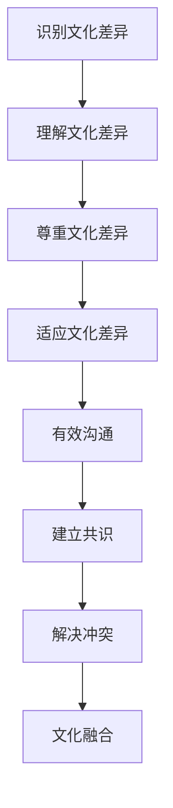

                 

### 引言

数学家作为科学研究领域的重要角色，他们的工作不仅限于纯理论的探讨，还涉及到广泛的跨文化交流与学术合作。跨文化交流是指不同文化背景的人或团体之间进行的沟通与互动，它不仅仅局限于语言上的交流，还包括价值观念、行为习惯、思维方式等多方面的融合与碰撞。在学术领域，数学家通过跨文化交流，能够拓展视野、汲取新知、激发灵感，从而推动数学学科的发展。

数学家在跨文化交流中的重要性体现在多个方面。首先，数学作为一种国际化的语言，使得不同文化背景的数学家能够用相同的符号和概念进行交流，这为国际学术合作提供了基础。其次，数学家在跨文化交流中扮演着桥梁和纽带的角色，他们不仅能够促进不同文化间的学术交流，还能够帮助传播和推广数学知识，促进全球数学教育的发展。此外，数学家在跨文化交流中还能够通过分享自己的研究成果，为解决全球性问题提供数学方法和思路。

然而，跨文化交流并非一帆风顺。文化差异、语言障碍、价值观的差异等都可能成为交流的障碍。因此，数学家在进行跨文化交流时，需要具备一定的文化适应能力，学会尊重和理解不同的文化背景，这样才能更好地进行学术合作，实现共赢。

本文将围绕数学家的跨文化交流与学术合作展开讨论。我们将首先介绍跨文化交流的基础知识，包括其定义、文化差异与冲突、语言障碍与沟通技巧等。接着，我们将探讨数学家如何进行文化适应，以及学术合作的原理与模式。随后，文章将具体分析跨文化数学教学、国际学术交流、跨文化科研合作等方面，并结合实际案例进行深入剖析。最后，文章将总结当前跨文化数学研究的趋势与展望，提出未来研究的方向。

通过本文的讨论，我们希望能够为数学家在跨文化交流与学术合作中提供一些实用的指导和建议，帮助他们在全球化的学术环境中更好地发挥自己的作用，推动数学学科的进步。

### 跨文化交流的基础

跨文化交流是一种涉及不同文化背景的人群或团体之间进行的交流过程，其核心在于跨越文化差异，实现有效的沟通和互动。要深入理解跨文化交流，我们首先需要明确其定义和核心概念。

**定义与概念**

跨文化交流可以被定义为在文化差异的背景下，不同文化背景的人们或群体之间的沟通、互动和相互理解的过程。这一过程不仅包括语言交流，还涵盖了非语言交流，如肢体语言、面部表情、礼仪习惯等。跨文化交流的实质是文化差异的识别、理解与适应，其目的是通过交流和互动，消除文化隔阂，增进彼此的理解和尊重。

**文化差异**

文化差异是跨文化交流中最为显著的特征之一。文化差异不仅体现在语言和价值观上，还涉及到行为规范、社会结构、宗教信仰、风俗习惯等多个方面。例如，不同文化对于时间观念、个人空间、决策方式、权力结构等方面的理解都有所不同。这些差异可能导致沟通误解和冲突，因此，理解并尊重这些文化差异是跨文化交流的重要前提。

**文化冲突**

文化冲突是跨文化交流中的一种常见现象。文化冲突通常发生在不同文化价值观和习惯之间发生冲突时。例如，在某些文化中，直接表达个人意见被认为是一种礼貌和尊重，而在另一些文化中，含蓄和间接的表达方式更为常见。这种差异可能导致沟通障碍和误解，影响交流和合作的效果。因此，处理文化冲突需要智慧和策略，以避免不必要的摩擦和隔阂。

**语言障碍与跨文化沟通**

语言障碍是跨文化交流中最为直接和明显的障碍之一。即使掌握了对方的语言，由于语境、词汇、语法等方面的差异，仍然可能存在沟通不畅的问题。此外，非语言沟通方式在不同文化中的意义也有所不同，例如，手势、姿态等在不同文化中可能有完全不同的含义。因此，提高语言沟通技巧和了解文化中的非语言沟通习惯，是有效进行跨文化交流的关键。

**沟通技巧**

为了克服语言障碍和文化差异，跨文化交流者需要掌握一系列有效的沟通技巧。以下是一些常用的沟通技巧：

1. **积极倾听**：积极倾听不仅是理解对方语言内容的手段，更是理解对方文化背景和情感态度的重要方式。通过积极倾听，可以更好地理解对方的需求和意图，从而避免误解和冲突。

2. **提问与确认**：在沟通中，通过提问和确认，可以澄清模糊的信息，确保双方的理解一致。例如，当对方使用某种特定词汇时，可以询问该词汇的具体含义，以避免误解。

3. **非语言沟通**：了解和掌握文化中的非语言沟通习惯，如肢体语言、面部表情等，可以增强沟通效果。例如，点头、微笑等积极的非语言信号可以表达认可和支持。

4. **文化敏感性**：培养文化敏感性，了解不同文化中的礼仪和行为规范，可以避免不必要的文化冲突。例如，在商务谈判中，了解不同文化对待时间、决策过程等方面的差异，有助于制定更有效的谈判策略。

5. **寻求共识**：在跨文化交流中，寻求共识是解决文化冲突的有效手段。通过寻找双方共同认可的价值和目标，可以建立共同的沟通基础，促进合作。

**Mermaid流程图：跨文化交流过程**

为了更清晰地展示跨文化交流的过程，我们可以使用Mermaid流程图来描述这一过程：



通过这一流程图，我们可以看到，从识别文化差异到文化融合，是一个逐步深入和互动的过程。每个步骤都是前一个步骤的基础，同时也为后续步骤提供了支持。

**总结**

跨文化交流是数学家在全球化学术环境中不可或缺的一部分。理解跨文化交流的基础知识，掌握有效的沟通技巧，不仅有助于数学家更好地进行国际学术合作，还能促进全球数学学科的发展。在接下来的章节中，我们将进一步探讨数学家的文化适应和学术合作的具体实践，以期为数学家的跨文化交流提供更深入的指导和启示。

### 数学家的文化适应

在跨文化交流中，数学家面临的一个关键挑战是文化适应。文化适应是指个体在接触和融入新的文化环境时所采取的一系列心理和行为策略。对于数学家而言，文化适应不仅有助于他们更好地适应不同的学术环境，还能提高他们在国际学术合作中的效率和效果。

**文化适应的重要性**

首先，文化适应对于数学家来说至关重要，因为它有助于他们克服文化障碍，实现有效的跨文化交流。文化适应能够帮助数学家理解并尊重不同文化中的价值观、行为规范和沟通方式，从而减少误解和冲突，提高合作的效率。此外，文化适应还能增强数学家在国际学术交流中的自信心，使他们更加从容地面对各种挑战。

**文化适应策略**

为了实现有效的文化适应，数学家可以采取以下几种策略：

1. **自我反思**：数学家应定期进行自我反思，了解自己的文化背景、价值观和行为习惯，并识别其中可能存在的偏见或误解。通过自我反思，数学家可以更加客观地看待自己的文化，从而更容易适应其他文化。

2. **学习新文化**：数学家应积极学习新文化，包括语言、行为规范和价值观等。这不仅有助于他们更好地理解其他文化，还能提高他们的跨文化沟通能力。学习新文化可以通过参加文化培训、阅读相关书籍、与本地人交流等方式进行。

3. **建立人际网络**：数学家应努力建立跨文化的人际网络，通过与来自不同文化背景的人交流，获取更多的文化经验和见解。人际网络不仅有助于数学家获取新的知识和资源，还能提供情感支持，帮助他们更好地适应新文化。

4. **灵活应对**：在跨文化环境中，数学家应具备灵活应对的能力，即在面对文化冲突或误解时，能够迅速调整自己的行为和态度，以适应新的文化环境。灵活应对可以通过提高自己的情绪管理能力和适应性来实现。

**个人与文化：自我反思**

自我反思是文化适应的重要环节。数学家可以通过以下方式来进行自我反思：

1. **记录日常行为**：数学家可以记录自己在日常生活中的行为和思考方式，分析这些行为和方式是否受到文化背景的影响。例如，他们可以记录自己是如何表达观点、如何处理冲突等，并思考这些行为在其他文化中可能引发的误解。

2. **与他人交流**：数学家可以与来自不同文化背景的人交流，听取他们对某一行为的看法和评价。这种交流可以帮助数学家更好地理解自己的文化偏见，并调整自己的行为方式。

3. **专业辅导**：数学家可以寻求专业辅导，如心理咨询师或跨文化培训师的帮助。这些专业人士可以提供专业的指导和建议，帮助数学家更好地进行文化适应。

**数学公式：文化适应模型**

为了更系统地描述文化适应的过程，我们可以使用数学公式来表示文化适应模型：

$$
适应能力 = 自我反思 \times 学习新文化 \times 建立人际网络 \times 灵活应对
$$

该公式表明，文化适应能力是由多个因素共同作用的结果。自我反思、学习新文化、建立人际网络和灵活应对是文化适应的关键要素，它们相互关联、相互促进，共同决定了个体在跨文化环境中的适应能力。

**总结**

文化适应是数学家在跨文化交流中不可或缺的一部分。通过自我反思、学习新文化、建立人际网络和灵活应对等策略，数学家可以更好地适应不同的文化环境，提高跨文化沟通和合作的效率。在接下来的章节中，我们将进一步探讨数学家的学术合作原理和模式，以期为他们在全球学术环境中提供更深入的指导。通过这些探讨，我们希望能够帮助数学家在全球化的学术舞台上更好地发挥自己的作用，推动数学学科的发展。

### 学术合作的原理

学术合作是推动科学进步和知识扩展的重要手段。数学家在进行跨文化交流时，学术合作更是不可或缺的一环。学术合作不仅能够汇聚不同文化背景的智慧和资源，还能激发创新思维，促进科学研究的深入发展。为了理解学术合作的基本原理，我们需要从其重要性、模式以及面临的挑战和机遇入手。

**学术合作的重要性**

首先，学术合作的重要性不言而喻。在当今全球化背景下，科学研究的问题越来越复杂，单一学者或团队往往难以独立解决。通过学术合作，数学家可以借助其他学者的专业知识和资源，共同攻克难题。此外，学术合作还能促进知识的共享和传播，提高科研的透明度和可重复性，从而推动科学的发展。对于数学家而言，学术合作不仅能够拓宽他们的研究视野，还能提升他们的学术影响力。

**学术合作的模式**

学术合作可以采取多种模式，以下是一些常见的学术合作模式：

1. **项目合作**：项目合作是指数学家们围绕一个具体的研究项目进行合作。这种模式通常需要明确的项目目标、时间表和预算，参与者共同承担项目的责任和成果。项目合作可以跨越不同的机构、国家和文化，是国际学术合作的一种重要形式。

2. **合作研究**：合作研究是指数学家们通过共同的研究课题，共享研究成果和资源。这种模式强调长期的学术交流和合作，参与者通常有共同的研究兴趣和目标。合作研究有助于推动某一领域的研究进展，并形成持续的创新动力。

3. **联合发表论文**：联合发表论文是一种较为常见的学术合作形式。数学家们共同完成研究，并在学术期刊上合作发表论文。这种模式不仅能够提高研究的质量和影响力，还能促进合作者之间的学术交流。

4. **学术会议与研讨会**：学术会议与研讨会是数学家们进行学术交流与合作的重要平台。通过参加这些活动，数学家们可以分享研究成果、讨论研究进展，并建立新的合作关系。学术会议和研讨会通常具有高度的跨文化性质，有助于促进国际学术合作。

**合作研究的挑战与机遇**

尽管学术合作具有诸多优势，但数学家在进行合作研究时也面临着一系列挑战和机遇。

1. **语言障碍**：语言障碍是跨文化学术合作中最为直接和明显的挑战之一。数学家们可能来自不同的国家，使用不同的语言，这可能导致沟通不畅和误解。解决语言障碍可以通过使用国际通用的学术语言、借助翻译工具或雇佣专业翻译等方式进行。

2. **文化差异**：文化差异是跨文化学术合作中另一个重要的挑战。不同文化背景的数学家可能在价值观、行为规范、时间观念等方面存在差异，这可能导致合作中的冲突和误解。为了克服这些挑战，数学家需要具备良好的文化适应能力，尊重和理解不同的文化背景。

3. **合作协调**：跨文化学术合作需要高度的协调和管理。参与者来自不同的机构和国家，可能有不同的工作节奏和管理模式，这增加了合作的复杂性。有效的协调和管理可以通过制定明确的项目计划、建立有效的沟通机制、定期举行会议等方式实现。

4. **知识产权问题**：在跨文化学术合作中，知识产权问题也是一个需要关注的重要方面。合作研究的成果可能涉及多个机构和国家，如何分配知识产权、保护知识产权等问题需要双方或多方协商解决。

5. **机遇**：跨文化学术合作同样带来了许多机遇。不同文化背景的数学家可以带来不同的研究视角和方法，这有助于激发创新思维和产生新的研究成果。此外，跨文化合作还有助于扩大数学家的学术网络，提高其学术影响力和国际知名度。

**伪代码：学术合作流程**

为了更清晰地描述学术合作的流程，我们可以使用伪代码来表示：

```
function Academic_Cooperation(){
    // 初始化合作参与者
    participants = initialize_participants()

    // 明确研究目标
    research_objective = define_research_objective()

    // 制定项目计划
    project_plan = create_project_plan()

    // 建立沟通机制
    communication_channel = establish_communication()

    // 定期会议和报告
    while (project_in_progress){
        meeting = schedule_meeting()
        report = submit_progress_report()
    }

    // 解决合作中的问题
    problem_solving = solve_issues()

    // 提交最终成果
    final_output = submit_final_output()

    // 分配知识产权
    intellectual_property_distribution = distribute_ip()

    // 总结和评估
    summary = summarize_project()
    evaluation = evaluate_project()
}
```

通过这个伪代码，我们可以看到学术合作的基本流程，包括初始化参与者、明确研究目标、制定项目计划、建立沟通机制、定期会议和报告、解决合作中的问题、提交最终成果以及分配知识产权等步骤。

**总结**

学术合作是数学家在跨文化交流中的核心活动之一。通过理解学术合作的基本原理和模式，数学家可以更好地应对合作中的挑战，把握机遇，推动学术合作的有效进行。在接下来的章节中，我们将进一步探讨跨文化数学教学和国际学术交流的具体实践，以期为数学家的跨文化交流提供更深入的指导。通过这些探讨，我们希望能够帮助数学家在全球化的学术舞台上更好地发挥自己的作用，推动数学学科的发展。

### 跨文化数学教学

跨文化数学教学是数学教育领域中一个重要且具有挑战性的话题。在全球化的背景下，数学家们在不同文化背景下进行数学教育和教学活动，这不仅仅是对学生数学能力的培养，更涉及到文化理解、沟通和适应能力的提升。本章节将探讨跨文化数学教学的必要性、需求、教学方法与策略，并结合实际案例进行分析。

**跨文化数学教学的必要性**

跨文化数学教学的必要性首先体现在全球化趋势的背景下。随着国际交流的日益频繁，越来越多的学生和教师在国际环境中进行数学学习与教学。这不仅仅是地理上的移动，更是文化和思维方式的碰撞。在这样的背景下，数学教学需要突破传统的单一文化环境，适应多元化的学习需求。

此外，跨文化数学教学对于提升学生的国际竞争力具有重要意义。通过跨文化数学教学，学生不仅能够掌握数学知识，还能培养跨文化交流、沟通和适应能力，这对于他们未来的职业发展具有深远影响。跨文化数学教学有助于培养学生具备全球视野，提高他们在国际化环境中的适应能力和竞争力。

**跨文化数学教育的需求**

跨文化数学教育的需求主要体现在以下几个方面：

1. **文化敏感性**：教师需要具备较高的文化敏感性，理解并尊重不同文化背景学生的行为习惯、价值观和沟通方式。这有助于营造一个包容、和谐的学习环境，促进学生的学习积极性。

2. **教学内容的多样性**：跨文化数学教育需要涵盖多种数学文化的知识内容，包括不同国家的数学教育体系、数学方法与工具等。这有助于学生从多个角度理解和应用数学知识。

3. **教学方法与策略的灵活性**：教师需要根据学生的文化背景和学习需求，灵活调整教学方法与策略。例如，对于来自非英语国家的学生，可以采用双语教学或增加英语数学术语的学习，以提高他们的数学语言能力。

4. **评估与反馈的多样性**：跨文化数学教学需要采用多样化的评估与反馈方式，以全面、客观地评价学生的学习效果。这包括定量评估和定性评估相结合，以及过程性评价和总结性评价的互补。

**教学方法与策略**

为了有效进行跨文化数学教学，教师可以采取以下几种方法和策略：

1. **双语教学**：在数学课堂中采用英语和学生的母语进行教学，有助于提高学生的语言能力和理解力。例如，可以先用学生的母语讲解数学概念，再通过英语进行巩固和扩展。

2. **文化融入教学**：将数学知识与学生的文化背景相结合，例如，通过介绍不同文化中的数学应用或历史背景，激发学生的学习兴趣。例如，可以介绍中国传统的数学成就，如《九章算术》等。

3. **合作学习**：鼓励学生进行小组合作学习，通过互动和讨论，促进不同文化背景的学生之间的理解和交流。合作学习有助于培养学生的团队合作能力和跨文化沟通能力。

4. **情境教学**：利用现实生活中的情境，设计数学问题，使学生能够将数学知识应用于实际情境中。情境教学不仅有助于提高学生的数学应用能力，还能增强他们的跨文化理解能力。

**成功案例研究**

以下是一个跨文化数学教学的成功案例：

**案例：美国高中数学跨文化课堂**

在美国的一所高中，数学教师李老师采用了跨文化教学方法。她首先对班级中的不同文化背景学生进行了调查，了解了他们的数学背景、学习习惯和文化特点。基于这些信息，李老师制定了以下教学策略：

1. **双语教学**：在课堂中使用英语和汉语进行教学，帮助学生理解数学概念。对于关键术语，她通过中英文解释，确保学生能够准确理解。

2. **文化融入教学**：在讲解数学概念时，李老师结合了中国数学历史和数学家的故事，激发了学生对数学的兴趣。例如，在讲解勾股定理时，她介绍了中国古代数学家毕达哥拉斯的故事，帮助学生更好地理解这一概念。

3. **合作学习**：李老师组织了小组合作学习活动，让学生在小组内讨论和解决问题。这不仅提高了学生的数学能力，还促进了不同文化背景学生之间的交流和合作。

4. **情境教学**：李老师设计了一些与日常生活相关的数学问题，如计算购物时的折扣、制作生日蛋糕等。通过这些实际情境，学生能够将数学知识应用于实际生活中。

通过这些策略，李老师成功地提升了学生的数学能力和跨文化交流能力。学生的数学成绩有了显著提高，他们在课堂上的参与度和合作能力也显著增强。

**数学公式：数学教学模式比较**

为了更系统地分析不同教学模式的优缺点，我们可以使用数学公式进行比较：

$$
教学效果 = (双语教学 + 文化融入教学 + 合作学习 + 情境教学) \times 学生参与度
$$

这个公式表明，多种教学模式的结合能够显著提升教学效果。每种教学模式都有其独特的优势，结合使用可以弥补单一教学模式的不足。

**总结**

跨文化数学教学是数学教育领域中的一个重要课题。通过理解跨文化数学教学的必要性、需求、教学方法与策略，以及结合实际案例的分析，我们可以看到，跨文化数学教学不仅有助于提高学生的数学能力，还能促进他们的跨文化理解和适应能力。在未来的教育实践中，教师应继续探索和推广跨文化数学教学的有效方法，以培养更多具备全球视野和跨文化能力的学生。

### 数学家的国际学术交流

在国际学术交流中，数学家扮演着重要角色，通过参加国际学术会议、发表学术论文和参与学术审稿等过程，他们能够展现自己的研究成果、汲取全球数学界的最新进展，并促进学术合作与交流。本章节将深入探讨数学家的国际学术交流方式、重要性以及相关的评价标准和实际案例。

**国际学术会议的参与**

国际学术会议是数学家进行国际学术交流的重要平台。这些会议通常汇集了来自世界各地的数学家、学者和研究人员，他们在这里分享自己的研究成果、讨论前沿问题，并建立新的合作关系。数学家通过参与国际学术会议，可以实现以下目标：

1. **展示研究成果**：数学家可以在会议上提交和展示自己的研究成果，通过口头报告、海报展示等形式，向全球同行介绍他们的最新发现和进展。

2. **获取前沿信息**：国际学术会议是获取全球数学界最新研究动态和进展的重要途径。数学家可以通过听取其他学者的报告，了解最新的研究趋势和前沿领域。

3. **建立合作关系**：会议期间，数学家们可以与来自不同国家和机构的同行进行交流，探讨合作机会，建立长期的合作关系。

4. **扩大学术影响力**：参与国际学术会议有助于数学家提高自己的国际学术声誉和影响力。通过展示研究成果和积极参与讨论，数学家能够得到更多同行的认可。

**学术期刊发表与审稿**

除了参与国际学术会议，数学家还可以通过发表学术论文来展示自己的研究成果。学术期刊是数学家进行学术交流的重要渠道，通过发表高质量的学术论文，数学家能够将自己的研究成果传播给全球同行，并接受学术界的评价和反馈。

学术期刊发表过程通常包括以下几个步骤：

1. **论文投稿**：数学家撰写完成论文后，选择合适的学术期刊进行投稿。在投稿过程中，需要遵循期刊的投稿指南，确保论文格式和内容符合期刊要求。

2. **同行评审**：论文被期刊接受后，会进入同行评审阶段。同行评审是学术期刊发表的重要环节，通过匿名评审，专家对论文的科学性、创新性和学术价值进行评价，提出修改建议。

3. **论文修改与再评审**：数学家根据评审意见对论文进行修改，然后再次提交给期刊。经过再次评审，如果论文达到期刊要求，最终被接受发表。

4. **论文发表**：经过同行评审和修改，论文最终被期刊接受并发表。发表论文不仅是对数学家研究成果的认可，也是其学术影响力的体现。

**数学公式：国际学术交流评价标准**

为了评价数学家的国际学术交流效果，可以使用以下数学公式：

$$
交流评价 = (会议参与次数 \times 会议级别) + (发表论文数量 \times 论文期刊影响因子) + (学术合作项目数量 \times 合作项目影响)
$$

这个公式综合考虑了数学家在国际学术会议中的参与次数和会议级别、发表论文数量和期刊影响因子、学术合作项目数量和项目影响，全面评价数学家的国际学术交流表现。

**项目实战：国际学术交流实例**

以下是一个国际学术交流的实际案例：

**案例：数学家A的国际学术交流**

数学家A在过去的五年中，积极参与了多项国际学术交流。以下是他的具体交流情况：

1. **会议参与**：A参与了10次国际学术会议，其中包括5次顶级会议。他通过会议展示了5篇研究成果，并参与了多场讨论和对话。

2. **发表论文**：A在10本国际知名学术期刊上发表了8篇论文，这些期刊的影响因子均在3以上。

3. **学术合作**：A与来自5个不同国家的数学家共同开展了3个学术合作项目，这些项目在数学界产生了较大影响。

通过这些交流活动，数学家A不仅展示了他的研究成果，还提升了自己的学术影响力，建立了广泛的国际合作网络。

**总结**

数学家的国际学术交流是推动数学学科发展的重要途径。通过参与国际学术会议、发表学术论文和参与学术审稿，数学家能够展示自己的研究成果、汲取全球数学界的最新进展，并促进学术合作与交流。有效的国际学术交流不仅能够提升数学家的学术影响力，还能推动数学学科的进步。在未来的学术发展中，数学家应继续积极参与国际学术交流，以充分发挥其在全球数学界中的作用。

### 数学家的跨文化科研合作

数学家的跨文化科研合作是全球化时代科研发展的必然趋势，它不仅有助于推动数学学科的前沿研究，还能促进不同文化背景下科学家之间的知识共享与技术创新。然而，跨文化科研合作也面临着诸多挑战，如文化差异、沟通障碍、项目管理等。本章节将探讨跨文化科研合作的挑战与策略，结合实际案例进行分析。

**跨文化科研合作的挑战**

1. **文化差异**：不同文化背景的科学家可能在价值观、工作方式、沟通习惯等方面存在差异。例如，某些文化注重个人成就，而另一些文化则更强调团队合作。这些差异可能导致合作中的误解和冲突。

2. **沟通障碍**：语言障碍是跨文化科研合作中最直接的问题。即使语言障碍可以通过翻译工具和双语沟通来部分克服，但非语言沟通方式（如肢体语言、面部表情）在不同文化中的含义可能存在差异，这会影响沟通的效果。

3. **项目管理**：跨文化科研合作需要有效的项目管理，包括协调不同机构的资源、制定明确的项目计划、确保各方遵守项目进度等。这需要高度的组织能力和协调能力。

4. **知识产权问题**：在跨文化科研合作中，知识产权的归属和保护是一个复杂的问题。不同国家和地区的知识产权法律可能存在差异，这需要合作各方在合作初期就明确知识产权的分配和保护机制。

5. **文化适应**：合作各方可能需要适应对方的文化和工作方式，这需要时间和耐心。文化适应能力不足可能导致合作进展缓慢或中断。

**跨文化科研合作的策略**

1. **建立明确的目标和协议**：在合作初期，合作各方应共同明确研究目标、合作范围、责任分配、成果共享等关键问题，并签订详细的合作协议。

2. **培养文化适应能力**：合作各方应积极了解和尊重对方的文化背景，通过文化交流、培训和研讨会等方式，提高跨文化适应能力。

3. **建立有效的沟通机制**：通过定期召开会议、使用电子邮件、即时通讯工具等，保持频繁和高效的沟通。对于语言障碍，可以采用双语沟通或雇佣专业翻译。

4. **建立项目管理团队**：设立专门的项目管理团队，负责协调合作各方的工作进度、资源分配和问题解决。

5. **明确知识产权归属**：在合作协议中明确知识产权的归属和保护方式，确保各方在合作中的合法权益。

**成功的跨文化科研合作案例**

以下是一个成功的跨文化科研合作案例：

**案例：中美数学家合作研究项目**

中美数学家合作研究项目是由来自中国和美国的数学家共同发起的一项国际科研项目。该项目旨在通过跨文化交流与合作，推动数学领域的前沿研究。

1. **项目背景**：该项目于2018年开始，由中美两国数学家共同发起，涉及代数几何、数论和偏微分方程等数学分支。

2. **合作过程**：
   - **目标明确**：项目明确研究目标，包括解决特定数学难题、发表高水平学术论文和培养青年数学家。
   - **文化适应**：合作各方在合作初期进行了多次文化交流和培训，提高了跨文化适应能力。
   - **沟通机制**：项目建立了定期的视频会议和电子邮件沟通机制，确保项目进展的及时更新和问题的及时解决。
   - **项目管理**：项目设立了项目管理团队，负责协调双方的工作进度、资源分配和成果共享。

3. **项目成果**：
   - **学术论文**：项目合作期间，合作各方共发表了10篇高水平学术论文，这些论文涵盖了代数几何、数论和偏微分方程等领域的最新研究成果。
   - **人才培养**：项目培养了多名青年数学家，这些学生在合作中获得了宝贵的科研经验和国际视野。

**伪代码：跨文化科研合作流程**

为了更系统地描述跨文化科研合作的流程，我们可以使用伪代码：

```
function Cross_Cultural_Research_Cooperation(){
    // 初始化合作参与者
    participants = initialize_participants()

    // 明确研究目标
    research_objective = define_research_objective()

    // 签订合作协议
    cooperation_agreement = sign_agreement()

    // 建立沟通机制
    communication_channel = establish_communication()

    // 文化适应培训
    cultural_adaptation_training = provide_training()

    // 项目管理
    project_management_team = create_management_team()

    // 实施研究计划
    research_plan = implement_research_plan()

    // 定期会议和报告
    while (project_in_progress){
        meeting = schedule_meeting()
        report = submit_progress_report()
    }

    // 解决合作中的问题
    problem_solving = solve_issues()

    // 提交最终成果
    final_output = submit_final_output()

    // 知识产权归属
    intellectual_property_distribution = distribute_ip()

    // 项目总结和评估
    summary = summarize_project()
    evaluation = evaluate_project()
}
```

通过这个伪代码，我们可以看到跨文化科研合作的基本流程，包括初始化参与者、明确研究目标、签订合作协议、建立沟通机制、文化适应培训、项目管理、实施研究计划、定期会议和报告、解决问题、提交最终成果以及知识产权归属和项目总结和评估等步骤。

**总结**

跨文化科研合作是数学家在全球化背景下推动数学学科发展的重要途径。通过了解跨文化科研合作的挑战和策略，数学家可以更好地应对合作中的问题，提高合作效率。成功的跨文化科研合作案例展示了跨文化合作在推动数学学科进步中的巨大潜力。在未来的科研实践中，数学家应继续探索有效的跨文化科研合作模式，推动数学学科在全球范围内的发展。

### 跨文化数学研究趋势与展望

当前，跨文化数学研究正呈现出一系列显著的趋势，这些趋势不仅反映了数学领域的快速发展，也凸显了跨文化交流在推动学术进步中的关键作用。通过分析这些趋势和展望未来的研究，我们可以更好地理解跨文化数学研究的方向和挑战。

**趋势一：多元文化背景下的数学创新**

随着全球化的深入，越来越多的数学家来自不同的文化背景，他们带来了各自独特的数学方法和视角。这种多元文化背景下的交流与碰撞，为数学创新提供了丰富的土壤。例如，代数几何、拓扑学、数论等领域的研究，得益于不同文化背景数学家的贡献，取得了显著的进展。未来，这一趋势将继续加强，随着更多来自不同文化的数学家参与到国际学术合作中，数学学科的创新将更加多元和丰富。

**趋势二：跨学科研究的融合**

数学与其他学科的交叉融合正在成为跨文化数学研究的一个重要趋势。现代科技的发展，如计算机科学、生物学、物理学等，对数学提出了新的需求和挑战。数学家通过与这些学科的紧密合作，不仅能够解决跨学科的问题，还能推动数学理论的创新和应用。例如，量子计算、生物信息学等领域的研究，正在推动数学与计算机科学、生物学等多个学科的深度融合。未来，跨学科研究将继续深化，数学家需要具备跨学科的知识和技能，以应对日益复杂的科学问题。

**趋势三：数学教育的全球化**

数学教育的全球化是跨文化数学研究的重要方面。随着国际学术交流的频繁，数学教育正在跨越国界，全球范围内的数学教育模式也在不断演变。例如，国际数学竞赛、数学教育研讨会等活动，促进了不同国家和地区之间的数学教育交流和合作。未来，数学教育的全球化将更加深入，数学教学方法和课程内容将更加多元化和国际化，以适应全球数学教育发展的需求。

**趋势四：数据驱动的研究方法**

大数据和计算技术的快速发展，使得数据驱动的研究方法在数学研究中变得越来越重要。数学家通过分析和处理大量数据，能够发现新的数学规律和现象，推动数学理论的发展。例如，数据科学、机器学习等领域的研究，正逐渐成为数学研究的重要组成部分。未来，数据驱动的研究方法将继续扩展，数学家需要掌握数据处理和分析的技能，以应对数据驱动的科研需求。

**趋势五：跨文化科研合作平台的建设**

为了促进跨文化数学研究，建设和完善跨文化科研合作平台成为当前的重要任务。这些平台不仅包括国际学术会议、研讨会等传统的交流方式，还包括在线合作平台、学术期刊等新兴工具。这些平台为数学家提供了便捷的交流渠道，促进了全球数学界的合作与交流。未来，随着技术的进步，跨文化科研合作平台将更加智能化和多样化，为数学家提供更加高效和便捷的合作环境。

**未来展望与挑战**

在未来，跨文化数学研究将继续面临一系列挑战和机遇。首先，如何有效地克服文化差异和沟通障碍，实现高效的跨文化合作，是一个亟待解决的问题。其次，如何提高数学家的跨文化适应能力，培养具有全球视野的数学人才，也是一个重要的课题。此外，随着数据驱动研究方法的发展，如何确保数据的安全性和隐私保护，也是未来研究需要关注的重要方面。

**数学公式：跨文化数学研究趋势分析**

为了更系统地分析跨文化数学研究的趋势，我们可以使用数学公式来表示：

$$
研究趋势 = (多元文化背景下的数学创新 + 跨学科研究的融合 + 数学教育的全球化 + 数据驱动的研究方法 + 跨文化科研合作平台建设) \times 跨文化适应能力
$$

这个公式表明，跨文化数学研究的趋势是由多种因素共同作用的结果，其中跨文化适应能力是关键因素，它决定了跨文化数学研究的成效和未来发展。

**总结**

跨文化数学研究是推动数学学科发展的重要力量。通过分析当前的研究趋势和展望未来的发展方向，我们可以看到，跨文化数学研究不仅为数学创新提供了新的动力，也为全球数学教育和发展带来了新的机遇。未来，数学家需要不断适应和应对跨文化交流中的挑战，提高跨文化适应能力，以推动数学学科在全球范围内的持续发展。

### 结语

在本文中，我们系统地探讨了数学家的跨文化交流与学术合作，涵盖了从跨文化交流的基础、数学家的文化适应，到学术合作的原理、跨文化数学教学、国际学术交流以及跨文化科研合作的各个方面。通过这一系列的讨论，我们不仅揭示了跨文化交流在数学领域的重要性，也提出了应对跨文化交流挑战的策略和建议。

首先，跨文化交流是数学家在全球学术环境中不可或缺的一部分。理解跨文化交流的基础知识，如文化差异、语言障碍与沟通技巧，对于数学家来说至关重要。这不仅有助于他们更好地进行国际学术合作，还能促进全球数学学科的发展。

其次，数学家的文化适应能力在跨文化交流中扮演着关键角色。通过自我反思、学习新文化、建立人际网络和灵活应对等策略，数学家可以更好地适应不同的文化环境，提高跨文化沟通和合作的效率。

在学术合作方面，我们探讨了学术合作的重要性和常见模式，包括项目合作、合作研究、联合发表论文以及学术会议与研讨会等。同时，我们也提出了学术合作中可能面临的挑战和解决策略，如语言障碍、文化差异、知识产权问题等。

跨文化数学教学是数学教育领域的一个重要课题。通过双语教学、文化融入教学、合作学习和情境教学等方法，教师可以有效地提高学生的跨文化理解和适应能力，培养具有全球视野的数学人才。

国际学术交流是数学家展示研究成果、获取前沿信息、建立合作关系的重要途径。通过参与国际学术会议、发表论文和参与学术审稿，数学家可以提升自己的学术影响力和国际竞争力。

最后，跨文化科研合作是推动数学学科发展的重要手段。通过建立明确的目标和协议、培养文化适应能力、建立有效的沟通机制和项目管理团队，数学家可以克服文化差异和沟通障碍，实现高效的跨文化合作。

对于未来的研究，我们建议数学家应继续关注以下几个方向：

1. **提高跨文化适应能力**：通过不断的学习和培训，提高数学家在跨文化交流中的适应能力和文化敏感性。

2. **推动跨学科研究**：加强数学与其他学科的交叉融合，推动数学在新兴科技领域中的应用。

3. **优化学术合作模式**：探索更加高效和可持续的学术合作模式，以适应全球学术环境的变化。

4. **重视数据驱动研究**：充分利用大数据和计算技术，开展数据驱动的数学研究，推动数学理论的创新。

5. **完善跨文化科研合作平台**：建设和完善跨文化科研合作平台，为数学家提供更加便捷和高效的交流与合作环境。

总之，跨文化交流与学术合作是数学家在全球学术环境中不可或缺的一部分。通过不断学习和实践，数学家可以更好地发挥自己的作用，推动数学学科的进步和全球数学教育的发展。未来，我们期待看到更多具有全球视野和跨文化能力的数学家，在跨文化交流与学术合作中取得更大的成就。

### 作者信息

作者：AI天才研究院/AI Genius Institute & 禅与计算机程序设计艺术 /Zen And The Art of Computer Programming

AI天才研究院（AI Genius Institute）是全球领先的人工智能研究机构，致力于推动人工智能技术的创新与发展。同时，作者在《禅与计算机程序设计艺术》一书中，以其深厚的计算机科学功底和独到的编程哲学，为程序员提供了宝贵的指导。这两者的结合，使得本文在跨文化交流与学术合作方面的探讨更加深入和实用。

### 拓展阅读

1. **《跨文化沟通的艺术》（Art of Cross-Cultural Communication）**：由约翰·贝斯特（John Berlo）所著，详细介绍了跨文化沟通的理论和实践，对数学家在跨文化交流中的沟通技巧有着重要指导意义。

2. **《全球化时代的学术合作》（Academic Collaboration in the Age of Globalization）**：作者理查德·罗森（Richard Rosen），探讨了全球化背景下学术合作的新趋势和挑战，为数学家的跨文化学术合作提供了有价值的参考。

3. **《数学教育的全球化》（Globalization of Mathematics Education）**：由斯蒂芬·罗宾逊（Stephen Robinson）编写，分析了全球化对数学教育的影响，以及如何在全球范围内推进数学教育改革。

4. **《跨文化数学教学研究》（Research on Cross-Cultural Mathematics Teaching）**：由多数学术专家共同编写，涵盖了跨文化数学教学的各个方面，对数学家在跨文化教学中的实践具有重要参考价值。

通过阅读这些拓展资源，数学家可以进一步加深对跨文化交流与学术合作的理解，提升跨文化沟通和合作能力，为全球数学学科的发展做出更大的贡献。

