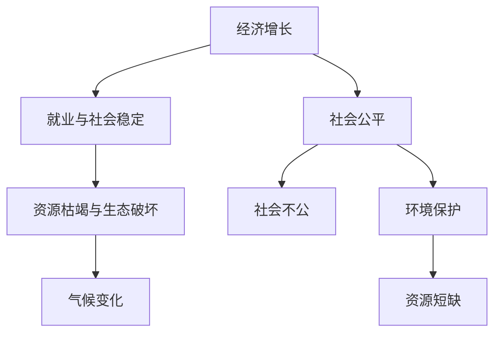
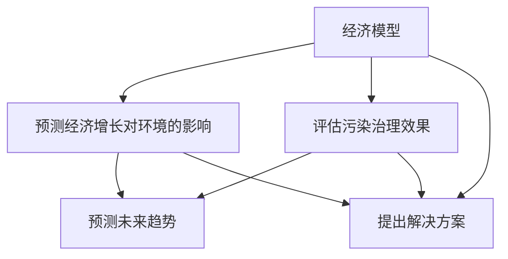
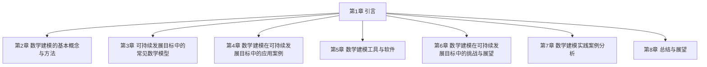

                 

### 数学建模在可持续发展目标中的应用

#### 引言

**关键词：** 数学建模，可持续发展目标，环境模型，经济模型，社会模型

**摘要：** 本文探讨了数学建模在实现可持续发展目标中的应用。随着全球环境问题的日益严重，可持续发展成为世界各国共同追求的目标。数学建模作为一种强大的工具，能够帮助我们理解和解决复杂的环境、经济和社会问题。本文首先介绍了可持续发展目标的重要性，然后详细阐述了数学建模的基本概念和方法，接着分析了在可持续发展目标中常用的经济模型、环境模型和社会模型，并列举了具体的应用案例，最后探讨了数学建模在可持续发展目标中的挑战与展望。

---

## 第1章 引言

### 1.1 可持续发展目标的重要性

#### 背景介绍

可持续发展目标（Sustainable Development Goals，简称SDGs）是由联合国在2015年通过的全球发展议程，旨在解决全球范围内的一系列经济、社会和环境问题。这些目标包括消除贫困、饥饿、不平等，以及保护环境和促进可持续发展等。可持续发展目标的提出，是为了应对全球面临的重大挑战，包括气候变化、环境污染、资源短缺和社会不公等。

#### 核心概念与联系

可持续发展目标涉及多个领域，包括经济增长、社会公平、环境保护等。这些目标之间存在紧密的联系，共同构成了一个复杂的系统。例如，经济增长可以带来就业和社会稳定，但如果不考虑环境和社会因素，可能会导致资源枯竭和生态破坏。因此，实现可持续发展目标需要综合考虑经济、社会和环境三个方面的平衡。

### 1.2 数学建模在可持续发展目标中的作用

#### 核心概念与联系

数学建模是一种运用数学方法来分析和解决实际问题的工具。在可持续发展目标中，数学建模能够帮助我们理解复杂的系统，预测未来的趋势，并提出有效的解决方案。例如，通过建立经济模型，我们可以预测经济增长对环境的影响，通过建立环境模型，我们可以评估污染治理的效果，通过建立社会模型，我们可以分析社会政策的效果。

### 1.3 本书结构和内容安排

本章介绍了可持续发展目标的重要性，以及数学建模在其中的作用。接下来的章节将详细探讨数学建模的基本概念和方法，以及在可持续发展目标中常用的经济模型、环境模型和社会模型。此外，本文还将列举具体的应用案例，探讨数学建模在可持续发展目标中的挑战与展望。

---

本文通过一步一步的分析推理，详细阐述了数学建模在可持续发展目标中的应用。在接下来的章节中，我们将进一步探讨数学建模的基本概念和方法，以及它在不同领域的具体应用。通过这些讨论，我们希望能够帮助读者更好地理解数学建模在实现可持续发展目标中的重要性。

