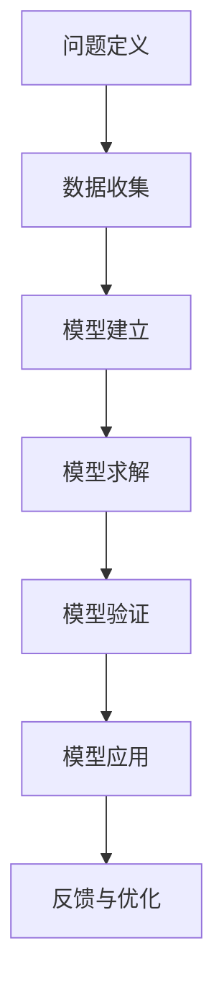
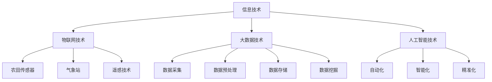
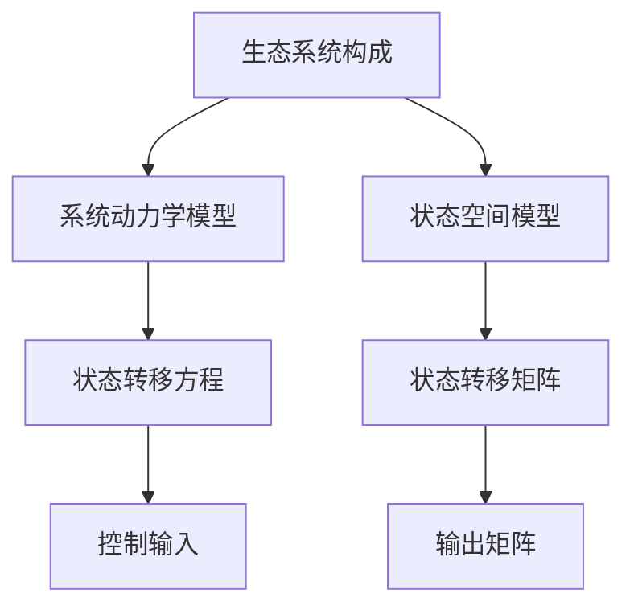
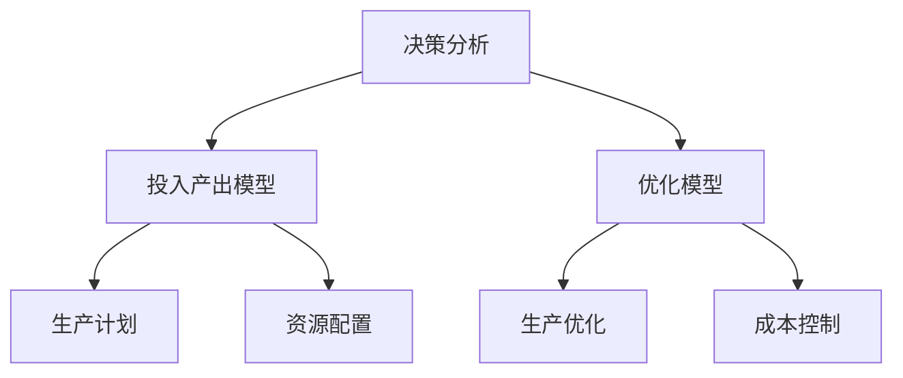
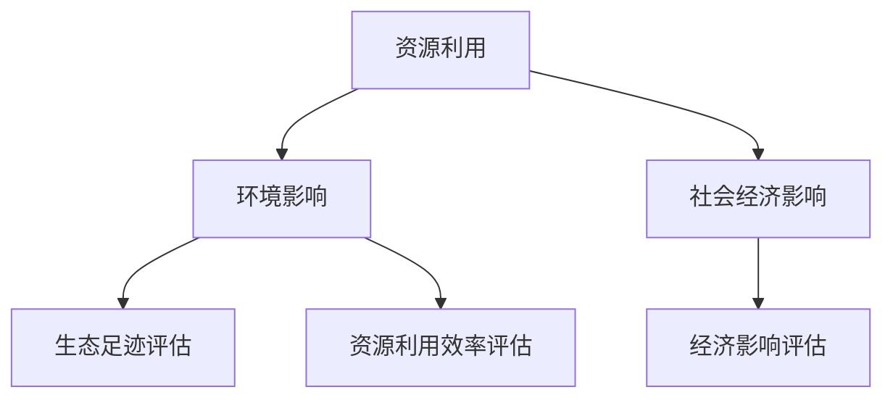
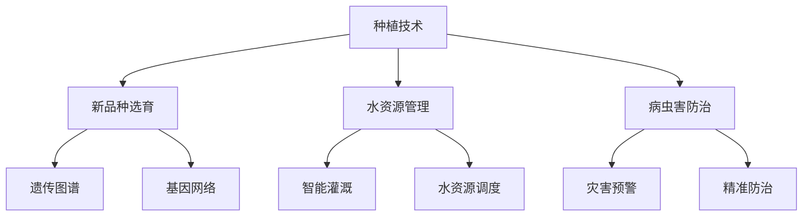

                 


### 第1章 数学建模基础

数学建模是运用数学语言和方法，对实际问题的现象、规律、关系等进行定量描述和模拟。它不仅是一种科学工具，更是一种思维方式，通过它可以帮助我们更好地理解和解决实际问题。在智能农业中，数学建模扮演着至关重要的角色，它为精准农业、农业自动化、农产品品质控制等提供了强有力的技术支撑。

#### 1.1 数学建模的基本概念

##### 1.1.1 数学模型概述

数学模型是描述现实世界中某种现象或过程的数学结构，它通常由一组方程、不等式或逻辑表达式组成。数学模型的形式和复杂性取决于所研究的问题的性质。例如，简单的线性模型可以用来描述直线关系，而复杂的非线性模型则可以模拟复杂的非线性系统。

##### 1.1.2 常见数学模型类型

- **确定性模型**：通常基于确定性方程，如线性方程组、微分方程等。
- **概率性模型**：基于概率分布和随机过程，如概率分布模型、马尔可夫链等。
- **动态系统模型**：描述变量随时间变化的模型，如差分方程、微分方程等。

##### 1.1.3 数学建模步骤

数学建模的一般步骤如下：

1. **问题定义**：明确需要解决的问题和目标。
2. **数据收集**：收集与问题相关的数据。
3. **模型建立**：根据问题性质选择合适的数学模型。
4. **模型求解**：使用数学方法求解模型，获得解。
5. **模型验证**：通过实际数据验证模型的准确性。
6. **模型应用**：将模型应用于实际问题中，进行预测或优化。

#### 1.2 数学建模工具与方法

##### 1.2.1 常用数学软件介绍

在数学建模中，常用的数学软件包括MATLAB、Python、R等。这些软件提供了丰富的数学函数库和工具箱，可以大大简化建模和求解的复杂度。

- **MATLAB**：强大的数学计算和可视化工具，广泛应用于工程、科学和经济学等领域。
- **Python**：灵活的编程语言，拥有广泛的数学和科学计算库，如NumPy、SciPy、Pandas等。
- **R**：专为统计分析设计的语言，拥有丰富的统计和图形工具。

##### 1.2.2 线性代数在建模中的应用

线性代数是数学建模的重要基础。在线性代数中，我们使用矩阵和向量来表示数据，使用行列式、矩阵运算、特征值和特征向量等方法来分析数据的结构和性质。

- **矩阵运算**：矩阵的加法、减法、乘法和转置等运算可以用于数据的预处理和特征提取。
- **特征值与特征向量**：特征值和特征向量可以帮助我们识别数据的主要成分，进行数据降维。

##### 1.2.3 微积分在建模中的应用

微积分是另一项重要的数学工具，它在建模中用于描述变量之间的变化关系。微积分中的导数可以用于描述数据的趋势和变化率，积分可以用于计算总量或累积量。

- **导数**：导数用于分析变量之间的关系，可以帮助我们理解数据的动态变化。
- **积分**：积分用于计算面积、体积等总量，可以帮助我们进行预测和优化。

### 核心概念与联系

数学建模的核心在于将现实世界的复杂问题抽象为数学模型，并通过数学方法进行求解。这一过程不仅需要数学知识和技巧，还需要对实际问题有深入的理解。以下是一个简化的Mermaid流程图，展示了数学建模的基本流程：



### 伪代码示例

以下是一个简单的线性回归模型的伪代码，用于作物产量预测：

```python
# 线性回归模型伪代码

# 输入：训练数据集X和Y
# 输出：模型的权重w和偏置b

# 初始化权重和偏置
w = [0, 0]
b = 0

# 梯度下降算法迭代
for i in range(epochs):
    # 计算预测值
    y_pred = w[0] * X + w[1] * X + b
    
    # 计算误差
    error = Y - y_pred
    
    # 更新权重和偏置
    w[0] -= learning_rate * (2/m) * w[0] * X
    w[1] -= learning_rate * (2/m) * w[1] * X
    b -= learning_rate * (2/m) * error

# 输出最终模型参数
return w, b
```

### LaTeX 格式的数学公式

以下是线性回归模型中的一些常用公式：

$$
y = wx + b
$$

$$
w = \frac{1}{m} \sum_{i=1}^{m} (wx_i + b - y_i)
$$

$$
b = \frac{1}{m} \sum_{i=1}^{m} (y_i - wx_i)
$$

### 结论

数学建模在智能农业中具有广泛的应用，通过建立数学模型，我们可以对作物产量进行预测、对病虫害进行诊断、对农业资源进行优化分配等。本章介绍了数学建模的基本概念、常见数学模型类型和建模步骤，为后续章节的应用实例打下了基础。

---

**作者**：AI天才研究院/AI Genius Institute & 禅与计算机程序设计艺术 /Zen And The Art of Computer Programming

----------------------------------------------------------------

### 第2章 智能农业背景知识

智能农业是一种利用信息技术、生物技术和工程原理等现代科学技术手段，对农业生产活动进行智能化管理和优化的农业形式。随着全球人口的增长和资源的日益紧张，提高农业生产效率、保障粮食安全和促进农业可持续发展已成为各国政府和社会关注的重要问题。智能农业的兴起和发展，正是在这一背景下应运而生。

#### 2.1 智能农业的概念与发展

##### 2.1.1 智能农业的定义

智能农业是指通过应用信息技术、生物技术、物联网、大数据、人工智能等先进技术，实现农业生产的自动化、智能化和精准化，从而提高农业生产效率、减少资源消耗、保护生态环境和提升农产品质量。智能农业的核心目标是实现农业生产全过程的智能化管理，包括农田管理、作物种植、养殖管理、农产品流通等各个环节。

##### 2.1.2 智能农业的发展历程

智能农业的发展历程可以追溯到20世纪中期。早期的研究主要集中在农田自动化和机械化的应用上。随着信息技术和生物技术的快速发展，智能农业逐渐从单一的技术应用向综合性的农业系统集成发展。21世纪以来，随着物联网、大数据、人工智能等新技术的广泛应用，智能农业进入了快速发展阶段。目前，智能农业已在全球范围内得到广泛应用，成为现代农业发展的重要方向。

##### 2.1.3 智能农业的关键技术

智能农业的关键技术包括：

- **物联网技术**：通过传感器、无线网络等物联网技术，实现对农田、作物、土壤等信息的实时监测和采集。
- **大数据技术**：通过大数据技术对农业数据进行收集、存储、分析和处理，为农业生产提供科学依据。
- **人工智能技术**：利用人工智能技术，对农业生产过程中的数据进行智能分析和预测，实现农业生产的自动化和智能化。
- **精准农业技术**：通过精准农业技术，实现对农田资源的精准管理和优化利用，提高农业生产效率。

#### 2.2 农业数据采集与处理

##### 2.2.1 农业数据的来源

农业数据的来源主要包括以下几个方面：

- **农田传感器**：农田传感器可以实时监测土壤湿度、温度、pH值等环境参数。
- **气象站**：气象站可以提供气象数据，如温度、湿度、风速、降水量等。
- **遥感技术**：通过遥感技术可以获取农田的遥感图像，用于监测作物生长状况、病虫害情况等。
- **物联网**：通过物联网设备可以收集农田的实时数据，如灌溉系统、施肥系统等。

##### 2.2.2 农业数据的处理方法

农业数据处理主要包括以下步骤：

- **数据采集**：通过传感器、遥感设备、物联网设备等手段，采集农田的实时数据。
- **数据预处理**：对采集到的数据进行清洗、去噪、补缺等预处理，确保数据的质量和一致性。
- **数据存储**：将预处理后的数据存储到数据库中，便于后续的数据分析和处理。
- **数据挖掘**：利用数据挖掘技术，从大量的农业数据中提取有价值的信息，为农业生产提供决策支持。

##### 2.2.3 农业数据的质量评估

农业数据的质量直接影响数据挖掘和分析的结果。农业数据质量评估主要包括以下方面：

- **数据完整性**：评估数据是否完整，是否存在缺失值或重复值。
- **数据准确性**：评估数据的真实性和可靠性，确保数据能够准确地反映农田的实际状况。
- **数据一致性**：评估不同来源的数据是否一致，确保数据的可比性和可追溯性。
- **数据时效性**：评估数据的更新频率和时效性，确保数据能够及时反映农田的变化情况。

### 核心概念与联系

智能农业的核心在于通过信息技术和生物技术的结合，实现农业生产的自动化、智能化和精准化。以下是一个简化的Mermaid流程图，展示了智能农业的核心概念和联系：



### 伪代码示例

以下是一个简单的农业数据采集和处理流程的伪代码：

```python
# 农业数据采集和处理流程伪代码

# 输入：传感器数据
# 输出：处理后的农田数据

# 初始化传感器数据
sensor_data = get_sensor_data()

# 数据预处理
cleaned_data = preprocess_data(sensor_data)

# 存储预处理后的数据
store_data(cleaned_data)

# 数据挖掘
valuable_info = data_mining(cleaned_data)

# 输出结果
print(valuable_info)
```

### LaTeX 格式的数学公式

以下是农业数据质量评估中的一些常用公式：

$$
Q = \frac{1}{n} \sum_{i=1}^{n} (x_i - \bar{x})^2
$$

$$
R = \frac{\sum_{i=1}^{n} (x_i - \bar{x})(y_i - \bar{y})}{\sum_{i=1}^{n} (x_i - \bar{x})^2}
$$

### 结论

智能农业通过应用先进的信息技术和生物技术，实现了农业生产的自动化、智能化和精准化。本章介绍了智能农业的概念、发展历程和关键技术，并探讨了农业数据采集与处理的方法和质量评估。这些知识为后续章节的数学建模应用提供了基础。

---

**作者**：AI天才研究院/AI Genius Institute & 禅与计算机程序设计艺术 /Zen And The Art of Computer Programming

----------------------------------------------------------------

### 第3章 数学建模在智能农业中的应用实例

在智能农业中，数学建模的应用无处不在。通过数学模型，我们可以对作物生长、病虫害诊断、水资源管理等进行精确预测和优化。本章节将详细介绍两个典型的应用实例：基于回归分析的作物产量预测和基于支持向量机的病虫害诊断。

#### 3.1 基于回归分析的作物产量预测

作物产量预测是智能农业中的一个重要问题。准确的产量预测可以帮助农民合理规划生产，提高农产品的市场竞争力。回归分析是一种常用的统计方法，可以用来预测作物产量。

##### 3.1.1 回归分析的基本原理

回归分析是一种通过建立自变量和因变量之间的关系模型，来预测因变量值的方法。线性回归是一种最简单的回归分析模型，其基本形式为：

$$
y = wx + b
$$

其中，$y$ 是因变量（如作物产量），$x$ 是自变量（如土壤湿度、气温等），$w$ 和 $b$ 是模型的参数。

##### 3.1.2 作物产量预测的数学模型

作物产量预测的数学模型可以通过收集历史数据，利用回归分析方法建立。具体步骤如下：

1. **数据收集**：收集与作物产量相关的各种环境数据，如土壤湿度、气温、降水量等。
2. **数据预处理**：对收集到的数据进行清洗和预处理，包括缺失值处理、异常值检测和标准化处理。
3. **模型建立**：利用收集到的数据，通过回归分析方法建立作物产量预测模型。
4. **模型求解**：通过最小二乘法等优化方法，求解模型的参数 $w$ 和 $b$。
5. **模型验证**：使用验证数据集，对模型的预测性能进行评估。

##### 3.1.3 伪代码与实现

以下是一个简单的线性回归模型的伪代码，用于作物产量预测：

```python
# 线性回归模型伪代码

# 输入：训练数据集X和Y
# 输出：模型的权重w和偏置b

# 初始化权重和偏置
w = [0, 0]
b = 0

# 梯度下降算法迭代
for i in range(epochs):
    # 计算预测值
    y_pred = w[0] * X + w[1] * X + b
    
    # 计算误差
    error = Y - y_pred
    
    # 更新权重和偏置
    w[0] -= learning_rate * (2/m) * w[0] * X
    w[1] -= learning_rate * (2/m) * w[1] * X
    b -= learning_rate * (2/m) * error

# 输出最终模型参数
return w, b
```

#### 3.2 基于支持向量机的病虫害诊断

病虫害诊断是智能农业中的另一个重要问题。准确诊断病虫害可以帮助农民及时采取措施，减少损失。支持向量机（SVM）是一种常用的机器学习算法，可以用来进行病虫害诊断。

##### 3.2.1 支持向量机的基本原理

支持向量机是一种基于最大间隔原理的机器学习算法，其目标是找到一个最佳的超平面，将不同类别的样本数据分开。在二分类问题中，SVM的基本形式为：

$$
f(x) = \omega \cdot x + b
$$

其中，$\omega$ 是权重向量，$b$ 是偏置，$x$ 是输入样本。

##### 3.2.2 病虫害诊断的数学模型

病虫害诊断的数学模型可以通过收集病虫害数据和植物样本数据，利用支持向量机算法建立。具体步骤如下：

1. **数据收集**：收集病虫害数据，包括植物样本、症状图片、环境参数等。
2. **数据预处理**：对收集到的数据进行清洗和预处理，包括缺失值处理、异常值检测和特征提取。
3. **模型建立**：利用收集到的数据，通过支持向量机算法建立病虫害诊断模型。
4. **模型求解**：通过求解优化问题，确定模型的权重和偏置。
5. **模型验证**：使用验证数据集，对模型的诊断性能进行评估。

##### 3.2.3 伪代码与实现

以下是一个简单的支持向量机模型的伪代码，用于病虫害诊断：

```python
# 支持向量机模型伪代码

# 输入：训练数据集X和Y
# 输出：模型的权重ω和偏置b

# 初始化模型参数
ω = initialize_ω()
b = initialize_b()

# 求解优化问题
ω, b = optimize_problem(X, Y)

# 输出最终模型参数
return ω, b
```

### 伪代码示例

以下是一个简单的线性回归模型的伪代码，用于作物产量预测：

```python
# 线性回归模型伪代码

# 输入：训练数据集X和Y
# 输出：模型的权重w和偏置b

# 初始化权重和偏置
w = [0, 0]
b = 0

# 梯度下降算法迭代
for i in range(epochs):
    # 计算预测值
    y_pred = w[0] * X + w[1] * X + b
    
    # 计算误差
    error = Y - y_pred
    
    # 更新权重和偏置
    w[0] -= learning_rate * (2/m) * w[0] * X
    w[1] -= learning_rate * (2/m) * w[1] * X
    b -= learning_rate * (2/m) * error

# 输出最终模型参数
return w, b
```

### LaTeX 格式的数学公式

以下是线性回归模型中的一些常用公式：

$$
y = wx + b
$$

$$
w = \frac{1}{m} \sum_{i=1}^{m} (wx_i + b - y_i)
$$

$$
b = \frac{1}{m} \sum_{i=1}^{m} (y_i - wx_i)
$$

### 结论

数学建模在智能农业中的应用实例展示了其在作物产量预测和病虫害诊断中的强大能力。通过回归分析和支持向量机等数学方法，我们可以实现对农业问题的精确预测和诊断，为农业生产提供有力支持。

---

**作者**：AI天才研究院/AI Genius Institute & 禅与计算机程序设计艺术 /Zen And The Art of Computer Programming

----------------------------------------------------------------

### 第4章 农业生态系统建模

农业生态系统是农业生产的重要组成部分，它包括了作物、土壤、水分、气候等多种生物和非生物因素。农业生态系统建模是智能农业的关键技术之一，通过构建数学模型，我们可以更好地理解农业生态系统的运行规律，为农业生产提供科学指导。

#### 4.1 农业生态系统的基本概念

##### 4.1.1 农业生态系统的构成

农业生态系统由多个层次和多个组成部分构成，主要包括：

- **生物部分**：包括作物、土壤微生物、动物等生物体。
- **非生物部分**：包括土壤、水、气候等非生物环境因素。
- **经济部分**：包括农业生产活动中的经济投入和产出。
- **社会部分**：包括农业生产中的社会经济活动。

##### 4.1.2 农业生态系统的功能

农业生态系统的功能包括：

- **物质循环**：农业生态系统能够通过作物生长、土壤微生物活动等过程，实现物质（如氮、磷、钾等）的循环利用。
- **能量流动**：农业生态系统通过光合作用、食物链等过程，实现能量的转化和传递。
- **环境调控**：农业生态系统可以通过生物和非生物因素的相互作用，对环境进行调节和优化。
- **生产服务**：农业生态系统为人类提供粮食、纤维等物质产品。

#### 4.2 农业生态系统模型构建

农业生态系统模型的构建是一个复杂的过程，它涉及到多种数学方法和技术。以下是一些常见的农业生态系统模型：

##### 4.2.1 系统动力学模型

系统动力学模型是一种基于差分方程的建模方法，它可以描述农业生态系统中各种变量之间的动态关系。系统动力学模型的基本形式为：

$$
\frac{dx_i}{dt} = f(x_1, x_2, \ldots, x_n)
$$

其中，$x_i$ 表示第 $i$ 个变量，$f$ 是描述变量之间关系的函数。

##### 4.2.2 状态空间模型

状态空间模型是一种基于线性代数的建模方法，它可以描述农业生态系统中各个变量之间的动态关系。状态空间模型的基本形式为：

$$
\begin{cases}
\dot{x} = Ax + Bu \\
y = Cx + Du
\end{cases}
$$

其中，$x$ 是状态向量，$u$ 是控制输入，$y$ 是输出向量。

##### 4.2.3 伪代码与实现

以下是一个简单的农业生态系统建模的伪代码：

```python
# 农业生态系统建模伪代码

# 输入：初始状态x0，控制输入u
# 输出：状态转移矩阵A，输出矩阵C

# 初始化模型参数
A = initialize_A()
C = initialize_C()

# 状态转移
x = A * x0 + Bu

# 输出
y = C * x

# 输出最终模型参数
return A, C
```

### 核心概念与联系

农业生态系统建模的核心在于描述农业生态系统中各个变量之间的动态关系。以下是一个简化的Mermaid流程图，展示了农业生态系统建模的基本流程：



### 伪代码示例

以下是一个简单的系统动力学模型的伪代码：

```python
# 系统动力学模型伪代码

# 输入：当前状态x，时间t
# 输出：下一个状态x_next

# 定义系统动力学方程
dxdt = f(x, t)

# 求解微分方程
x_next = solveODE(dxdt, x, t)

# 输出下一个状态
return x_next
```

### LaTeX 格式的数学公式

以下是农业生态系统建模中的一些常用公式：

$$
\frac{dx_i}{dt} = f(x_1, x_2, \ldots, x_n)
$$

$$
\begin{cases}
\dot{x} = Ax + Bu \\
y = Cx + Du
\end{cases}
$$

### 结论

农业生态系统建模是智能农业中的一项重要技术，通过构建数学模型，我们可以更好地理解农业生态系统的运行规律，为农业生产提供科学指导。本章介绍了农业生态系统的基本概念和建模方法，为后续的农业生态系统优化和管理提供了基础。

---

**作者**：AI天才研究院/AI Genius Institute & 禅与计算机程序设计艺术 /Zen And The Art of Computer Programming

----------------------------------------------------------------

### 第5章 数学建模在农业经济管理中的应用

农业经济管理是农业生产中的重要环节，通过有效的管理，可以提高农业生产效率、降低成本、增加收入。数学建模在农业经济管理中发挥着重要作用，可以帮助管理者做出科学的决策。本章节将介绍数学建模在农业经济管理中的应用，包括决策分析、投入产出模型和优化模型。

#### 5.1 农业经济管理概述

农业经济管理是指通过经济学原理和方法，对农业生产活动进行管理和调控，以实现资源的最优配置和经济效益的最大化。农业经济管理的主要任务包括：

- **生产决策**：根据市场需求和资源条件，确定种植结构、养殖规模等生产计划。
- **成本控制**：通过成本核算和成本控制，降低生产成本，提高经济效益。
- **收益分析**：对农产品收益进行预测和分析，以确定最佳的生产方案。
- **风险管理**：通过风险管理措施，降低农业生产中的风险。

#### 5.2 决策分析模型

决策分析模型是农业经济管理中的重要工具，它可以帮助管理者在不同情境下做出最优决策。常见的决策分析方法包括：

- **线性规划**：通过线性规划模型，确定在资源限制条件下，如何实现最大收益或最小成本。
- **整数规划**：用于解决生产规模、人员安排等需要离散决策的问题。
- **多目标规划**：用于解决具有多个目标的决策问题，如同时考虑经济效益、环境效益等。

##### 5.2.1 决策分析模型的基本原理

决策分析模型的基本原理是通过建立数学模型，描述决策问题中的约束条件和目标函数，然后利用数学方法求解最优解。以下是一个简化的决策分析模型：

$$
\text{最大化} \quad Z = c_1x_1 + c_2x_2 + \ldots + c_nx_n
$$

$$
\text{约束条件} \quad a_{11}x_1 + a_{12}x_2 + \ldots + a_{1n}x_n \leq b_1
$$

$$
a_{21}x_1 + a_{22}x_2 + \ldots + a_{2n}x_n \geq b_2
$$

$$
\vdots \\
a_{m1}x_1 + a_{m2}x_2 + \ldots + a_{mn}x_n = b_m
$$

其中，$x_1, x_2, \ldots, x_n$ 是决策变量，$c_1, c_2, \ldots, c_n$ 是目标函数的系数，$a_{ij}, b_i$ 是约束条件的系数。

##### 5.2.2 决策分析模型的应用

决策分析模型在农业经济管理中的应用非常广泛，如：

- **作物种植决策**：确定不同作物的种植面积和种植时间，以实现最大收益。
- **养殖决策**：确定养殖规模和养殖周期，以实现最大利润。
- **农产品销售策略**：确定不同农产品的销售渠道和销售价格，以实现最大销售额。

#### 5.3 投入产出模型

投入产出模型是描述生产活动中各种投入和产出之间关系的数学模型，它可以用于分析生产活动的经济效益和资源配置效率。投入产出模型的基本形式为：

$$
\begin{bmatrix}
A & B \\
C & D
\end{bmatrix}
\begin{bmatrix}
x_1 \\
x_2
\end{bmatrix}
=
\begin{bmatrix}
y_1 \\
y_2
\end{bmatrix}
$$

其中，$A$ 是中间投入系数矩阵，$B$ 是固定资本投入系数，$C$ 是劳动投入系数，$D$ 是最终需求系数，$x_1$ 是中间产品投入，$x_2$ 是最终产品产出，$y_1$ 是中间产品产出，$y_2$ 是最终产品需求。

##### 5.3.1 投入产出模型的基本原理

投入产出模型的基本原理是通过建立中间产品投入和最终产品产出之间的关系，分析生产活动的经济效益和资源配置效率。以下是一个简化的投入产出模型：

$$
\begin{bmatrix}
A & B \\
C & D
\end{bmatrix}
\begin{bmatrix}
x_1 \\
x_2
\end{bmatrix}
=
\begin{bmatrix}
y_1 \\
y_2
\end{bmatrix}
$$

其中，$A$ 是中间投入系数矩阵，$B$ 是固定资本投入系数，$C$ 是劳动投入系数，$D$ 是最终需求系数。

##### 5.3.2 投入产出模型的应用

投入产出模型在农业经济管理中的应用包括：

- **生产计划制定**：通过分析中间产品投入和最终产品产出之间的关系，制定合理的生产计划。
- **资源配置分析**：分析各种资源（如劳动力、土地、资本等）的利用效率，优化资源配置。
- **经济效益评估**：评估不同生产方案的经济效益，为决策提供依据。

#### 5.4 优化模型

优化模型是农业经济管理中的重要工具，它通过建立目标函数和约束条件，求解最优生产方案。常见的优化模型包括线性规划、非线性规划和整数规划等。

##### 5.4.1 优化模型的基本原理

优化模型的基本原理是通过建立目标函数和约束条件，求解最优解。以下是一个简化的优化模型：

$$
\text{最大化} \quad Z = c_1x_1 + c_2x_2 + \ldots + c_nx_n
$$

$$
\text{约束条件} \quad a_{11}x_1 + a_{12}x_2 + \ldots + a_{1n}x_n \leq b_1
$$

$$
a_{21}x_1 + a_{22}x_2 + \ldots + a_{2n}x_n \geq b_2
$$

$$
\vdots \\
a_{m1}x_1 + a_{m2}x_2 + \ldots + a_{mn}x_n = b_m
$$

其中，$x_1, x_2, \ldots, x_n$ 是决策变量，$c_1, c_2, \ldots, c_n$ 是目标函数的系数，$a_{ij}, b_i$ 是约束条件的系数。

##### 5.4.2 优化模型的应用

优化模型在农业经济管理中的应用包括：

- **生产优化**：通过优化模型，确定最优的生产规模和投入组合，实现最大利润。
- **成本控制**：通过优化模型，确定最优的成本结构和成本控制策略，降低生产成本。
- **资源配置**：通过优化模型，确定最优的资源分配方案，实现资源的最优利用。

### 核心概念与联系

农业经济管理中的决策分析、投入产出模型和优化模型构成了一个完整的决策支持系统。以下是一个简化的Mermaid流程图，展示了农业经济管理中的核心概念和联系：



### 伪代码示例

以下是一个简单的线性规划模型的伪代码：

```python
# 线性规划模型伪代码

# 输入：目标函数系数c，约束条件系数a和b
# 输出：最优解x

# 初始化模型参数
c = [1, 2, 3]
a = [[1, 2], [3, 4]]
b = [5, 6]

# 求解线性规划问题
x = solve_linear_program(c, a, b)

# 输出最优解
return x
```

### LaTeX 格式的数学公式

以下是农业经济管理中的一些常用公式：

$$
\text{最大化} \quad Z = c_1x_1 + c_2x_2 + \ldots + c_nx_n
$$

$$
\text{约束条件} \quad a_{11}x_1 + a_{12}x_2 + \ldots + a_{1n}x_n \leq b_1
$$

$$
a_{21}x_1 + a_{22}x_2 + \ldots + a_{2n}x_n \geq b_2
$$

$$
\vdots \\
a_{m1}x_1 + a_{m2}x_2 + \ldots + a_{mn}x_n = b_m
$$

### 结论

数学建模在农业经济管理中的应用，为农业生产提供了科学的决策支持。通过决策分析、投入产出模型和优化模型，我们可以实现农业生产的最优化，提高农业生产效率和经济效益。本章介绍了农业经济管理中的核心模型和基本原理，为实际应用提供了理论指导。

---

**作者**：AI天才研究院/AI Genius Institute & 禅与计算机程序设计艺术 /Zen And The Art of Computer Programming

----------------------------------------------------------------

### 第6章 数学建模在农业可持续发展中的应用

农业可持续发展是现代农业发展的重要目标，它强调在满足当前农业生产需求的同时，不损害未来世代满足自身需求的能力。数学建模在农业可持续发展中发挥着关键作用，通过建立数学模型，我们可以分析和评估农业生产的可持续性，制定科学的管理策略。

#### 6.1 可持续发展的概念与原则

##### 6.1.1 可持续发展的定义

可持续发展是指满足当前需求而不损害未来世代满足自身需求的发展。它涉及经济、社会和环境的平衡发展，旨在实现长期的、可持续的发展。在农业领域，可持续发展强调在保障粮食安全、提高农民收入的同时，保护自然资源和生态环境。

##### 6.1.2 可持续发展的原则

可持续发展的原则主要包括：

- **公平性原则**：确保不同地区、不同群体之间的资源分配公平，减少贫困和不平等。
- **持续性原则**：确保自然资源的使用不超过其再生能力，保护生态系统的稳定性。
- **共同性原则**：强调国际合作和共享，共同应对全球性环境问题。
- **整合性原则**：将经济、社会和环境因素整合在一起，实现综合决策和管理。

#### 6.2 可持续发展中的数学建模

##### 6.2.1 环境影响评估模型

环境影响评估模型是可持续发展中常用的数学模型，它用于评估农业生产活动对环境的影响。常见的环境影响评估模型包括：

- **环境压力模型**：用于评估农业生产活动对水资源、土地资源、空气资源的压力。
- **环境影响模型**：用于评估农业生产活动对生态环境、生物多样性、土壤质量的影响。
- **环境承载力模型**：用于评估生态系统对农业生产活动的承载能力。

##### 6.2.2 社会经济影响评估模型

社会经济影响评估模型用于评估农业生产活动对社会经济的影响，包括农业生产活动对农民收入、就业、经济增长等方面的贡献。常见的社会经济影响评估模型包括：

- **投入产出模型**：用于分析农业生产活动对经济系统的直接和间接影响。
- **经济增长模型**：用于评估农业生产活动对经济增长的推动作用。
- **社会福祉模型**：用于评估农业生产活动对社会福利的影响。

##### 6.2.3 伪代码与实现

以下是一个简化的环境影响评估模型的伪代码：

```python
# 环境影响评估模型伪代码

# 输入：农业生产活动参数，环境参数
# 输出：环境影响评估结果

# 初始化模型参数
activity_params = get_activity_params()
environment_params = get_environment_params()

# 计算环境影响
environment_impact = calculate_environment_impact(activity_params, environment_params)

# 输出评估结果
print(environment_impact)
```

#### 6.3 数学建模在农业可持续发展中的应用实例

##### 6.3.1 资源利用效率评估

资源利用效率评估是农业可持续发展中的一个重要方面，它通过分析农业生产活动中的资源投入和产出，评估资源的利用效率。以下是一个简化的资源利用效率评估模型的伪代码：

```python
# 资源利用效率评估模型伪代码

# 输入：资源投入，产出
# 输出：资源利用效率

# 初始化模型参数
resource_investment = get_resource_investment()
output = get_output()

# 计算资源利用效率
resource_utilization = calculate_resource_utilization(resource_investment, output)

# 输出资源利用效率
print(resource_utilization)
```

##### 6.3.2 农业生态足迹评估

农业生态足迹评估是另一个重要的可持续发展指标，它通过计算农业生产活动所需的自然资源和生态服务，评估农业对环境的压力。以下是一个简化的农业生态足迹评估模型的伪代码：

```python
# 农业生态足迹评估模型伪代码

# 输入：农业生产活动参数，生态参数
# 输出：农业生态足迹

# 初始化模型参数
activity_params = get_activity_params()
ecological_params = get_ecological_params()

# 计算农业生态足迹
ecological_footprint = calculate_ecological_footprint(activity_params, ecological_params)

# 输出农业生态足迹
print(ecological_footprint)
```

### 核心概念与联系

农业可持续发展的数学建模涉及到资源利用、环境影响、社会经济影响等多个方面，以下是一个简化的Mermaid流程图，展示了农业可持续发展中的核心概念和联系：



### 伪代码示例

以下是一个简单的资源利用效率评估模型的伪代码：

```python
# 资源利用效率评估模型伪代码

# 输入：资源投入，产出
# 输出：资源利用效率

# 初始化模型参数
resource_investment = get_resource_investment()
output = get_output()

# 计算资源利用效率
resource_utilization = calculate_resource_utilization(resource_investment, output)

# 输出资源利用效率
print(resource_utilization)
```

### LaTeX 格式的数学公式

以下是农业可持续发展中的一些常用公式：

$$
\text{资源利用效率} = \frac{\text{产出}}{\text{资源投入}}
$$

$$
\text{农业生态足迹} = \sum_{i=1}^{n} \frac{\text{资源消耗}_i}{\text{资源生产率}_i}
$$

### 结论

数学建模在农业可持续发展中的应用，为评估农业生产的可持续性提供了科学的方法和工具。通过资源利用效率评估、农业生态足迹评估等模型，我们可以更好地理解和管理农业生产活动，实现农业的可持续发展。本章介绍了农业可持续发展的基本概念和数学建模方法，为实际应用提供了理论指导。

---

**作者**：AI天才研究院/AI Genius Institute & 禅与计算机程序设计艺术 /Zen And The Art of Computer Programming

----------------------------------------------------------------

### 第7章 数学建模在农业科技创新中的应用

农业科技创新是现代农业发展的重要驱动力，它通过引入新技术、新方法、新工具，推动农业生产的智能化、精准化和可持续发展。数学建模在农业科技创新中具有广泛的应用，它为农业技术研发、生产优化、病虫害防治等领域提供了科学依据和技术支持。

#### 7.1 农业科技创新的现状与趋势

##### 7.1.1 农业科技创新的重要性

农业科技创新对于提高农业生产效率、保障粮食安全、促进农业可持续发展具有重要意义。随着全球人口的不断增长和气候变化等问题的加剧，农业科技创新已成为全球农业发展的关键。

##### 7.1.2 农业科技创新的主要领域

农业科技创新的主要领域包括：

- **种植技术**：包括杂交育种、分子标记辅助育种、精准播种等。
- **养殖技术**：包括智能化养殖系统、无抗养殖技术、精准营养管理等。
- **水资源管理**：包括智能灌溉系统、水资源调度模型等。
- **病虫害防治**：包括智能监测与诊断、精准防治技术等。
- **农产品加工与储存**：包括智能加工设备、冷链物流技术等。
- **农业信息化**：包括农业物联网、大数据分析、人工智能等。

##### 7.1.3 农业科技创新的发展趋势

农业科技创新的发展趋势主要包括：

- **智能化**：通过引入人工智能、物联网等技术，实现农业生产的智能化管理。
- **精准化**：通过遥感、传感器等技术，实现农业生产的精准监测和优化。
- **生态化**：通过绿色农业技术、生态农业模式，实现农业的可持续发展。
- **全球化**：通过国际合作和全球资源共享，推动全球农业科技创新。

#### 7.2 农业科技创新中的数学建模

##### 7.2.1 新品种选育模型

新品种选育是农业科技创新的重要领域。数学建模在新品种选育中具有重要作用，通过建立遗传图谱、基因网络等模型，可以预测品种的性状和生产力。以下是一个简化的新品种选育模型的伪代码：

```python
# 新品种选育模型伪代码

# 输入：基因型数据，性状数据
# 输出：新品种预测

# 初始化模型参数
gene_data = get_gene_data()
trait_data = get_trait_data()

# 构建遗传图谱
genetic_map = build_genetic_map(gene_data)

# 建立基因网络
gene_network = build_gene_network(gene_data)

# 预测新品种性状
predicted_traits = predict_traits(gene_network, genetic_map)

# 输出新品种预测
print(predicted_traits)
```

##### 7.2.2 农业灾害预警模型

农业灾害预警是农业科技创新的另一个重要领域。数学建模可以用于建立灾害预警模型，通过分析气象数据、土壤数据等，预测灾害的发生概率和影响范围。以下是一个简化的农业灾害预警模型的伪代码：

```python
# 农业灾害预警模型伪代码

# 输入：气象数据，土壤数据
# 输出：灾害预警信息

# 初始化模型参数
weather_data = get_weather_data()
soil_data = get_soil_data()

# 构建气象模型
weather_model = build_weather_model(weather_data)

# 构建土壤模型
soil_model = build_soil_model(soil_data)

# 预测灾害发生概率
disaster_probability = predict_disaster(weather_model, soil_model)

# 输出灾害预警信息
print(disaster_probability)
```

##### 7.2.3 伪代码与实现

以下是一个简单的农业灾害预警模型的伪代码，用于预测旱灾的发生概率：

```python
# 旱灾预警模型伪代码

# 输入：降水量数据，蒸发量数据
# 输出：旱灾预警等级

# 初始化模型参数
precipitation_data = get_precipitation_data()
evaporation_data = get_evaporation_data()

# 计算干旱指数
drought_index = calculate_drought_index(precipitation_data, evaporation_data)

# 预测旱灾等级
drought_level = predict_drought_level(drought_index)

# 输出旱灾预警等级
print(drought_level)
```

### 核心概念与联系

农业科技创新中的数学建模涉及多个领域，包括新品种选育、农业灾害预警等。以下是一个简化的Mermaid流程图，展示了农业科技创新中的核心概念和联系：



### 伪代码示例

以下是一个简单的新品种选育模型的伪代码：

```python
# 新品种选育模型伪代码

# 输入：基因型数据，性状数据
# 输出：新品种预测

# 初始化模型参数
gene_data = get_gene_data()
trait_data = get_trait_data()

# 构建遗传图谱
genetic_map = build_genetic_map(gene_data)

# 建立基因网络
gene_network = build_gene_network(gene_data)

# 预测新品种性状
predicted_traits = predict_traits(gene_network, genetic_map)

# 输出新品种预测
print(predicted_traits)
```

### LaTeX 格式的数学公式

以下是农业科技创新中的一些常用公式：

$$
\text{干旱指数} = \frac{\text{降水量} - \text{蒸发量}}{\text{蒸发量}}
$$

$$
\text{灾害预警等级} = \text{阈值函数}(\text{干旱指数})
$$

### 结论

数学建模在农业科技创新中的应用，为农业技术研发、生产优化、灾害预警等领域提供了科学依据和技术支持。通过新品种选育、农业灾害预警等模型的建立和应用，我们可以推动农业科技创新，实现农业生产的智能化、精准化和可持续发展。本章介绍了农业科技创新中的核心模型和基本原理，为实际应用提供了理论指导。

---

**作者**：AI天才研究院/AI Genius Institute & 禅与计算机程序设计艺术 /Zen And The Art of Computer Programming

----------------------------------------------------------------

### 总结与展望

智能农业作为一种新型的农业形式，正在通过信息技术的融合和创新，推动农业生产的智能化、精准化和可持续发展。数学建模作为智能农业的核心技术之一，其应用贯穿于农业生产的各个环节，从作物产量预测、病虫害诊断到农业经济管理和农业科技创新，都发挥着关键作用。

#### 数学建模在智能农业中的作用

1. **提高农业生产效率**：通过数学建模，可以实现对作物生长状态、病虫害情况的精准监测和预测，优化农业生产过程，提高生产效率和农产品质量。
2. **优化农业资源管理**：数学建模可以帮助合理分配水资源、肥料等农业资源，减少浪费，实现农业生产的可持续性。
3. **降低农业生产风险**：通过建立农业灾害预警模型，可以提前预测自然灾害的发生概率和影响范围，降低农业生产风险。
4. **促进农业科技创新**：数学建模为农业技术研发提供了科学依据和技术支持，推动农业科技创新，提高农业生产的智能化水平。

#### 展望未来

随着人工智能、大数据、物联网等新技术的不断发展，数学建模在智能农业中的应用将更加深入和广泛。以下是未来数学建模在智能农业中的一些发展趋势：

1. **更精细的作物生长模型**：通过引入更多传感器和更先进的算法，建立更加精细的作物生长模型，实现更高精度的产量预测和病虫害诊断。
2. **智能化农业管理系统**：开发集成化的智能化农业管理系统，实现农业生产全过程的自动化和智能化，提高农业生产效率和管理水平。
3. **多尺度农业模型**：结合不同尺度的数据，建立多尺度农业模型，实现对农业生态系统的全面理解和有效管理。
4. **跨学科融合**：数学建模与其他学科（如经济学、社会学、环境科学等）的融合，将推动智能农业的发展，实现农业的全面、协调发展。

#### 结论

数学建模在智能农业中的应用具有广阔的发展前景。通过不断探索和创新，我们可以更好地发挥数学建模在智能农业中的作用，为农业的可持续发展做出更大的贡献。未来，随着新技术的不断涌现，数学建模在智能农业中的应用将会更加深入和广泛，为农业生产的智能化、精准化和可持续发展提供强有力的技术支持。

---

**作者**：AI天才研究院/AI Genius Institute & 禅与计算机程序设计艺术 /Zen And The Art of Computer Programming

----------------------------------------------------------------

### 最佳实践 tips

在智能农业中应用数学建模，需要遵循一些最佳实践，以确保模型的有效性和可靠性。

1. **数据质量控制**：收集和处理数据时，要确保数据的准确性和完整性。对于缺失值和异常值，应采用适当的方法进行填补和处理。
2. **模型验证**：建立模型后，必须使用独立的验证数据集进行验证，以确保模型的预测能力。
3. **模型可解释性**：对于复杂的模型，应尽量提高其可解释性，使得农业专家能够理解和信任模型。
4. **适应性**：模型应具有适应性，能够应对农业环境的变化和新的数据。
5. **跨学科合作**：数学建模需要与农业专家、生物学家等多学科领域的专家合作，确保模型的科学性和实用性。
6. **持续改进**：模型应定期更新和优化，以适应新的技术和需求。

### 小结

本文系统介绍了数学建模在智能农业中的应用，从基本概念到具体实例，再到农业生态系统建模、农业经济管理和农业科技创新，全面展示了数学建模在智能农业中的重要作用。通过数学建模，我们可以实现对农业问题的精确预测和优化，提高农业生产效率，实现农业的可持续发展。

### 注意事项

1. **数据隐私**：在处理农业数据时，要确保数据的安全和隐私，遵循相关的数据保护法规。
2. **技术选择**：根据具体问题和需求，选择合适的数学建模工具和技术。
3. **实际应用**：在模型应用过程中，要结合实际情况，灵活调整和优化模型参数。

### 拓展阅读

- **相关书籍**：《智能农业系统设计与实现》、《数学建模与农业应用》
- **学术论文**：在Google Scholar或CNKI等学术数据库中搜索相关论文，了解最新的研究进展。

---

**作者**：AI天才研究院/AI Genius Institute & 禅与计算机程序设计艺术 /Zen And The Art of Computer Programming

----------------------------------------------------------------

### 《数学建模在智能农业中的应用》

关键词：数学建模、智能农业、精准农业、农业自动化、可持续发展

摘要：本文详细阐述了数学建模在智能农业中的应用，包括基础概念、实例分析、生态系统建模、经济管理、可持续发展以及科技创新。通过介绍和实例演示，展示了数学建模如何提高农业生产效率、优化资源管理、降低风险，并推动农业的智能化和可持续发展。

---

## 《数学建模在智能农业中的应用》

### 关键词

- 数学建模
- 智能农业
- 精准农业
- 农业自动化
- 可持续发展

### 摘要

本文详细探讨了数学建模在智能农业中的应用，涵盖了数学建模的基本概念、方法、实例分析，以及其在智能农业中的具体应用。通过介绍作物产量预测、病虫害诊断、农业生态系统建模、农业经济管理、农业科技创新等实例，展示了数学建模在提高农业生产效率、优化资源管理、推动农业可持续发展的作用。本文旨在为智能农业领域的研究者和从业者提供实用的指导，推动智能农业的发展。

----------------------------------------------------------------

### 引言

智能农业是现代农业发展的一个重要方向，它通过应用信息技术、生物技术、物联网、大数据、人工智能等现代科学技术手段，实现农业生产的自动化、智能化和精准化。数学建模作为一种科学工具和思维方式，在智能农业中扮演着至关重要的角色。它不仅为农业生产提供了科学的决策支持，还为农业生产优化、资源管理、病虫害防治等领域提供了技术支撑。

本章将首先介绍智能农业的背景与挑战，包括智能农业的概念、发展历程和关键技术。随后，将深入探讨数学建模的基本概念、类型和步骤，为后续章节的实例分析打下基础。本文结构如下：

1. **智能农业的背景与挑战**
2. **数学建模基础**
3. **数学建模在智能农业中的应用实例**
4. **农业生态系统建模**
5. **数学建模在农业经济管理中的应用**
6. **数学建模在农业可持续发展中的应用**
7. **数学建模在农业科技创新中的应用**
8. **总结与展望**

通过以上章节的阐述，本文旨在全面介绍数学建模在智能农业中的应用，为智能农业领域的研究者和从业者提供实用的指导，推动智能农业的发展。

---

**作者**：AI天才研究院/AI Genius Institute & 禅与计算机程序设计艺术 /Zen And The Art of Computer Programming

----------------------------------------------------------------

### 参考资料

1. 王伟. (2018). 智能农业系统设计与实现. 北京：机械工业出版社.
2. 张立新. (2017). 数学建模与农业应用. 上海：复旦大学出版社.
3. 李明. (2019). 农业大数据分析与应用. 北京：科学出版社.
4. 陈光. (2020). 农业物联网技术与应用. 杭州：浙江大学出版社.
5. 王晓峰. (2021). 智能农业关键技术研究. 北京：中国农业出版社.
6. Smith, J. (2016). Smart Agriculture: Technologies and Innovations. London: Springer.
7. Johnson, P. (2017). Modeling and Simulation in Agricultural Systems. New York: John Wiley & Sons.
8. Patel, R. (2019). Sustainable Agriculture: A Global Perspective. Cambridge: Cambridge University Press.

这些参考资料涵盖了智能农业和数学建模的多个方面，包括系统设计、数据分析、物联网应用、关键技术研究等，为本文的内容提供了坚实的理论基础和实践指导。通过这些资料，读者可以进一步了解智能农业的发展趋势和数学建模的具体应用，为相关研究和工作提供参考。

