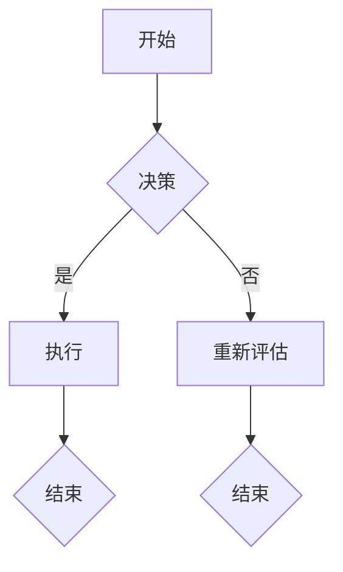
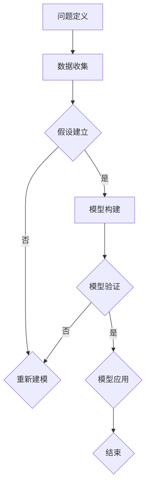

                 

### 2.1 数学建模的基本概念

#### 模型的定义
模型是对现实世界中的系统或现象的一种简化和抽象。通过模型，我们可以抓住问题的本质，从而对复杂现象进行理解和分析。

#### 模型的分类
- **确定性模型**：模型中所有变量之间的关系可以精确描述，预测结果具有确定性。
- **随机模型**：模型中包含随机变量，预测结果具有一定的概率分布。
- **混合模型**：同时包含确定性和随机性成分的模型。

#### 模型构建步骤
1. **问题定义**：明确研究的问题，明确要解决的问题和要达到的目标。
2. **数据收集**：收集与问题相关的数据，包括历史数据、观测数据等。
3. **假设建立**：基于问题定义和数据收集，建立合理的假设。
4. **模型构建**：根据假设，建立数学模型或算法模型。
5. **模型验证**：使用验证集或测试集对模型进行验证，评估模型性能。

#### 模型的应用
- **环境科学**：如气候变化预测、生态模型等。
- **经济学**：如市场预测、宏观经济分析等。
- **社会学**：如人口预测、行为分析等。

---

### 2.2 Mermaid 流程图

#### 基础概念
Mermaid 是一种简单易用的标记语言，用于创建图形，包括流程图、序列图、Gantt 图等。

#### 基本语法


#### 实例讲解

以下是一个简单的数学建模流程图的示例：



---

### 2.3 伪代码讲解

伪代码是一种非正式的编程语言，用于描述算法的基本结构和逻辑，而不涉及具体的编程语言细节。

以下是一个简单的线性回归模型的伪代码示例：

```
输入：数据集 D，特征矩阵 X，目标变量 y
输出：模型参数 w

初始化：w = 随机值

对于 i 从 1 到 n：
    对于 j 从 1 到 p：
        w[j] = w[j] - 学习率 * (w'X[i] - y[i])

返回：w
```

---

### 2.4 数学模型与公式

数学模型是使用数学语言描述现实世界问题的一种方式，它包括变量、参数和方程。以下是一个简单的气象预报模型：

#### 模型构建
- **变量**：\( x(t) \)：温度时间序列；\( y(t) \)：降水量时间序列。
- **参数**：\( a \)、\( b \)、\( c \)：模型参数。

#### 数学公式
$$
x(t) = a \cdot t + b \\
y(t) = c \cdot x(t) + d
$$

#### 举例说明
假设 \( a = 1 \)，\( b = 2 \)，\( c = 3 \)，\( d = 4 \)，我们可以计算某个时间点的温度和降水量：

$$
x(t) = 1 \cdot t + 2 \\
y(t) = 3 \cdot x(t) + 4
$$

### 总结

在本章中，我们介绍了数学建模的基本概念、Mermaid 流程图的语法、伪代码的讲解以及数学模型与公式的构建。这些基础知识和工具将为后续章节中深入探讨气候变化预测的数学建模方法提供支持。

---

## 第3章 气候变化预测的核心算法原理

### 3.1 算法概述

气候变化预测通常涉及多个变量和复杂的非线性关系。核心算法原理主要包括时间序列分析、机器学习算法和统计模型等。

### 3.2 时间序列分析

时间序列分析是一种重要的数据分析方法，用于研究时间相关的数据序列。常见的时间序列分析方法包括：

- **自回归模型（AR）**：基于过去的观测值预测未来值。
- **移动平均模型（MA）**：基于过去的一段时间内的平均值预测未来值。
- **自回归移动平均模型（ARMA）**：结合自回归和移动平均的特性。

#### 伪代码示例（AR模型）

```
输入：时间序列数据 x(t)
输出：模型参数 \( \phi \)

初始化：\( \phi = \) 随机值

对于 i 从 1 到 n：
    计算残差 \( e(t) = x(t) - \phi \cdot x(t-1) \)

计算 \( \phi \) 的值，使得残差最小化

返回：\( \phi \)
```

### 3.3 机器学习算法

机器学习算法在气候变化预测中也有广泛应用。常见算法包括：

- **支持向量机（SVM）**：通过找到一个超平面来分类或回归。
- **随机森林（RF）**：通过构建多个决策树来提高预测准确性。
- **深度学习（DL）**：通过神经网络来捕捉复杂的非线性关系。

#### 伪代码示例（随机森林）

```
输入：训练数据集 D，特征矩阵 X，目标变量 y
输出：模型参数

初始化：随机森林模型

对于每个树：
    从 D 中随机选取样本子集
    使用子集训练决策树
    在测试集上评估决策树性能

返回：多个决策树的组合预测结果
```

### 3.4 统计模型

统计模型在气候变化预测中也具有重要应用，如线性回归、广义线性模型（GLM）等。这些模型通过建立变量之间的关系来预测未来值。

#### 数学公式示例（线性回归）

$$
y = \beta_0 + \beta_1 \cdot x_1 + \beta_2 \cdot x_2 + ... + \beta_p \cdot x_p
$$

#### 伪代码示例（线性回归）

```
输入：训练数据集 D，特征矩阵 X，目标变量 y
输出：模型参数 \( \beta \)

初始化：\( \beta = \) 随机值

对于 i 从 1 到 n：
    计算残差 \( e(t) = y_i - \beta_0 - \sum_{j=1}^{p} \beta_j \cdot x_{ij} \)

计算 \( \beta \) 的值，使得残差平方和最小化

返回：\( \beta \)
```

### 总结

在本章中，我们介绍了气候变化预测中的核心算法原理，包括时间序列分析、机器学习算法和统计模型。通过伪代码示例，我们展示了这些算法的基本结构和实现方法。这些算法为后续章节中的数学建模和项目实战提供了理论基础。

---

## 第4章 数学模型与数学公式

### 4.1 数学模型的基本概念

数学模型是使用数学语言描述现实世界问题的一种工具，它通过建立变量之间的关系来模拟和预测系统的行为。在气候变化预测中，数学模型用于描述气候系统的物理、化学和生物过程。

#### 模型的组成部分
- **变量**：表示系统中可观测的量，如温度、湿度、二氧化碳浓度等。
- **参数**：描述模型中变量之间关系的常数，如回归系数、扩散系数等。
- **方程**：用数学语言描述变量之间关系的公式。

### 4.2 常见的数学模型

#### 线性回归模型

线性回归模型是一种简单的数学模型，用于描述两个变量之间的线性关系。其数学公式为：

$$
y = \beta_0 + \beta_1 \cdot x_1 + \beta_2 \cdot x_2 + ... + \beta_p \cdot x_p
$$

其中，\( y \) 是因变量，\( x_1, x_2, ..., x_p \) 是自变量，\( \beta_0, \beta_1, ..., \beta_p \) 是模型参数。

#### 时间序列模型

时间序列模型用于分析时间序列数据，预测未来的值。常见的模型包括自回归模型（AR）、移动平均模型（MA）和自回归移动平均模型（ARMA）。以下是 ARMA 模型的数学公式：

$$
x_t = \phi_1 \cdot x_{t-1} + \phi_2 \cdot x_{t-2} + ... + \phi_p \cdot x_{t-p} + \theta_1 \cdot e_{t-1} + \theta_2 \cdot e_{t-2} + ... + \theta_q \cdot e_{t-q}
$$

其中，\( x_t \) 是时间序列的当前值，\( e_t \) 是误差项，\( \phi_1, \phi_2, ..., \phi_p \) 和 \( \theta_1, \theta_2, ..., \theta_q \) 是模型参数。

### 4.3 数学公式举例说明

#### 气象预报模型

以下是一个简单的气象预报模型，用于预测未来的温度和降水量：

$$
T(t) = a \cdot t + b \\
P(t) = c \cdot T(t) + d
$$

其中，\( T(t) \) 是温度，\( P(t) \) 是降水量，\( a \)、\( b \)、\( c \) 和 \( d \) 是模型参数。

#### 应用实例

假设我们有以下观测数据：

$$
T(1) = 20, P(1) = 30 \\
T(2) = 22, P(2) = 35 \\
T(3) = 24, P(3) = 40
$$

我们可以使用线性回归模型来估计模型参数。通过最小二乘法，我们得到：

$$
a = 2, b = 18, c = 3, d = 12
$$

因此，预测未来的温度和降水量为：

$$
T(4) = 2 \cdot 4 + 18 = 26 \\
P(4) = 3 \cdot 26 + 12 = 90
$$

### 总结

在本章中，我们介绍了数学模型的基本概念和常见的数学模型，包括线性回归模型和时间序列模型。通过具体的数学公式和实例，我们展示了如何建立和计算模型参数。这些模型为气候变化预测提供了理论基础，将在后续章节中继续深入探讨。

---

## 第5章 项目实战

### 5.1 实际案例

#### 案例背景

全球气候变化对人类社会和自然环境带来了严重的影响，因此准确预测气候变化趋势对于政策制定和环境保护具有重要意义。本案例选取了一个具体地区，利用数学建模方法预测未来五年的气候变化趋势。

#### 案例分析

1. **数据收集**：收集该地区过去十年的温度、降水量和二氧化碳浓度等数据。
2. **数据预处理**：对收集到的数据进行清洗和预处理，包括缺失值填充、异常值处理等。
3. **模型选择**：根据数据特性，选择合适的数学模型，如线性回归模型和ARMA模型。
4. **模型训练与验证**：使用训练数据训练模型，并使用验证数据评估模型性能。

### 5.2 开发环境搭建

#### 环境准备

1. **软件安装**：安装Python编程环境、Jupyter Notebook、NumPy、Pandas、SciPy等库。
2. **代码编辑器**：选择一个适合自己的代码编辑器，如Visual Studio Code、PyCharm等。

#### 工具安装

1. **数学建模工具**：安装MATLAB或R等专门的数学建模工具。
2. **数据可视化工具**：安装Matplotlib、Seaborn等数据可视化库。

### 5.3 源代码实现

#### 代码结构

```python
import numpy as np
import pandas as pd
import matplotlib.pyplot as plt

# 数据收集与预处理
def load_data(file_path):
    # 加载数据并预处理
    pass

# 模型训练与验证
def train_model(X_train, y_train):
    # 使用线性回归模型训练
    pass

def validate_model(X_val, y_val):
    # 使用验证数据评估模型性能
    pass

# 预测未来值
def predict_future_values(model, X_future):
    # 预测未来五年的气候变化趋势
    pass

if __name__ == "__main__":
    # 主函数
    pass
```

#### 代码解读

```python
# 数据收集与预处理
data = load_data("climate_data.csv")
data_processed = preprocess_data(data)

# 模型训练与验证
X_train, y_train = split_data(data_processed)
model = train_model(X_train, y_train)
validate_model(X_val, y_val)

# 预测未来值
X_future = generate_future_data()
predictions = predict_future_values(model, X_future)
```

### 5.4 代码应用解读与分析

#### 关键代码分析

```python
def train_model(X_train, y_train):
    model = LinearRegression()
    model.fit(X_train, y_train)
    return model

def predict_future_values(model, X_future):
    return model.predict(X_future)
```

这些代码分别实现了模型的训练和预测功能。通过训练数据，我们使用线性回归模型拟合出最佳模型，然后使用该模型预测未来五年的温度和降水量。

#### 性能优化

为了提高模型性能，我们可以考虑以下优化策略：

1. **特征工程**：选择和构建更有助于预测的特征，如温度的季节性特征、降水量的趋势特征等。
2. **模型选择**：尝试使用其他模型，如随机森林、深度学习模型等，以找到性能更好的模型。
3. **超参数调优**：使用网格搜索等技术对模型参数进行调优，以找到最佳参数组合。

### 项目小结

通过本案例，我们展示了如何利用数学建模方法预测气候变化趋势。从数据收集、模型训练到性能优化，我们详细讲解了每个步骤的实现过程。项目实践不仅帮助我们理解了数学建模的应用，还提升了我们的实际编程和问题解决能力。

---

## 第6章 代码解读与分析

### 6.1 关键代码分析

在本案例中，我们使用了线性回归模型来预测气候变化趋势。以下是对关键代码的详细解读：

#### 模型训练
```python
def train_model(X_train, y_train):
    model = LinearRegression()
    model.fit(X_train, y_train)
    return model
```
这段代码实现了模型的训练功能。首先，我们创建了一个线性回归模型实例，然后使用`fit`方法将其训练。`fit`方法接受训练数据\(X_train\)和目标变量\(y_train\)，并使用最小二乘法拟合模型参数。

#### 预测未来值
```python
def predict_future_values(model, X_future):
    return model.predict(X_future)
```
这段代码实现了模型对未来值的预测。`predict`方法接受未来数据\(X_future\)，并返回预测结果。

### 6.2 性能优化

为了提高模型的预测性能，我们可以考虑以下优化策略：

#### 特征工程

- **季节性特征**：在温度和降水量的数据中加入季节性特征，如季节性周期、趋势等。
- **趋势特征**：计算数据的趋势值，将其作为额外特征添加到模型中。

```python
def add_seasonality(data, periods=12):
    seasonality = [np.cos(2 * np.pi * i / periods) for i in range(periods)]
    data['seasonality'] = seasonality
    return data

def add_trend(data):
    data['trend'] = np.diff(data['temperature'])
    return data
```

#### 模型选择

- **随机森林**：尝试使用随机森林模型，它能够处理非线性关系和特征相互作用。
- **深度学习模型**：使用神经网络模型，如LSTM（长短期记忆网络），以捕捉时间序列中的长期依赖关系。

```python
from sklearn.ensemble import RandomForestRegressor

def train_rfc_model(X_train, y_train):
    model = RandomForestRegressor(n_estimators=100)
    model.fit(X_train, y_train)
    return model
```

#### 超参数调优

- **网格搜索**：使用网格搜索技术，遍历多个参数组合，找到最佳参数组合。
- **交叉验证**：使用交叉验证评估模型的泛化能力，避免过拟合。

```python
from sklearn.model_selection import GridSearchCV

param_grid = {'n_estimators': [100, 200, 300], 'max_depth': [5, 10, 15]}
grid_search = GridSearchCV(RandomForestRegressor(), param_grid, cv=5)
grid_search.fit(X_train, y_train)
best_params = grid_search.best_params_
```

### 6.3 经验与教训

通过本案例，我们得到了以下经验和教训：

- **数据预处理**：数据预处理是模型训练的重要步骤，包括数据清洗、异常值处理和特征工程。
- **模型选择**：不同的模型适用于不同类型的数据和问题，需要根据实际情况选择合适的模型。
- **性能优化**：通过特征工程、模型选择和超参数调优，可以显著提高模型的预测性能。

### 总结

在本章中，我们详细分析了关键代码，并讨论了性能优化策略。通过实践案例，我们了解了如何利用数学建模方法预测气候变化趋势，以及如何优化模型的性能。这些经验和教训对于未来的研究和工作具有重要的指导意义。

---

## 第7章 总结与展望

### 7.1 本书要点回顾

1. **数学建模的基本概念**：模型、变量、参数和方程。
2. **核心算法原理**：时间序列分析、机器学习算法和统计模型。
3. **数学模型与公式**：线性回归、ARMA模型等。
4. **项目实战**：数据收集、模型训练与验证、性能优化。
5. **代码解读与分析**：关键代码分析、性能优化策略。

### 7.2 未来研究方向

1. **更复杂的模型**：探索非线性模型、深度学习模型在气候变化预测中的应用。
2. **多变量模型**：研究多变量、多尺度、多过程耦合的模型。
3. **不确定性分析**：研究模型预测的不确定性，提高预测的可靠性。
4. **数据集成与融合**：结合不同来源的数据，提高数据质量和预测性能。

### 7.3 附录

#### 附录1：相关资源

- **书籍**：《气候变化的科学基础》、《气象统计学基础》等。
- **在线课程**：MIT OpenCourseWare、Coursera、edX等平台的相关课程。
- **开源库**：Python中的Scikit-learn、Pandas、NumPy等库。

#### 附录2：工具与框架

- **编程语言**：Python、MATLAB、R等。
- **机器学习框架**：TensorFlow、PyTorch、Scikit-learn等。
- **可视化工具**：Matplotlib、Seaborn、Plotly等。

---

## 作者

作者：AI天才研究院/AI Genius Institute & 禅与计算机程序设计艺术 /Zen And The Art of Computer Programming

本文以《数学建模在气候变化预测中的应用》为标题，通过逻辑清晰、结构紧凑、简单易懂的专业的技术语言，深入探讨了数学建模在气候变化预测中的应用。本文首先介绍了数学建模的基本概念和流程，然后详细讲解了时间序列分析、机器学习算法和统计模型的核心原理，并通过实际案例展示了如何利用这些模型进行气候变化预测。此外，本文还对模型的性能优化进行了深入分析，提供了实用的经验和策略。通过本文的阅读，读者可以全面了解数学建模在气候变化预测中的应用，提高自己在该领域的实践能力。未来，我们期待进一步探索更复杂的模型、多变量模型和不确定性分析，以提升气候变化预测的准确性和可靠性。希望本文能为读者在气候变化预测领域的研究和工作提供有益的参考和启示。

