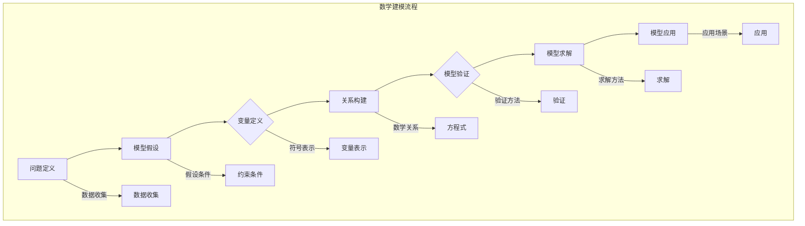

                 

### 文章标题

《数学建模在海洋资源管理中的应用》

### 文章关键词

- 数学建模
- 海洋资源管理
- 模型评估
- 案例研究
- 可持续发展

### 摘要

本文探讨了数学建模在海洋资源管理中的应用，旨在通过系统的数学模型和方法，优化海洋资源的利用和保护。首先，我们回顾了海洋资源管理的重要性及其面临的挑战，接着介绍了数学建模的基本概念和步骤。文章重点分析了数学建模在海洋资源评估、环境保护、资源利用和灾害预测等方面的应用，并借助实际案例进行了详细解读。最后，我们总结了数学建模在海洋资源管理中的未来发展方向和最佳实践，为相关领域的学者和实践者提供了有价值的参考。

## 引言

### 1.1 海洋资源管理的重要性

海洋是地球上最大的生态系统，蕴藏着丰富的生物、化学和物理资源。海洋资源管理是指通过科学的方法和有效的政策手段，合理开发和利用海洋资源，同时保护海洋生态系统，实现海洋的可持续利用。海洋资源管理的重要性体现在以下几个方面：

1. **食物安全**：海洋是重要的渔业资源库，提供了全球约20%的动物蛋白质来源。通过科学管理，可以保障海洋渔业的可持续发展，从而满足人类对食品的需求。

2. **能源利用**：随着全球能源需求的不断增长，海洋能源的开发变得日益重要。海洋能包括潮汐能、波浪能、海流能等，具有清洁、可再生的特点，是未来能源发展的方向。

3. **环境保护**：海洋是地球上最大的碳汇之一，通过管理海洋资源，可以调节气候、保护海岸线、减少污染等，从而维护地球生态系统的平衡。

4. **经济贡献**：海洋资源开发是许多沿海国家经济的重要支柱。海洋运输、海洋旅游、海洋药物开发等领域的蓬勃发展，为全球经济贡献了巨大价值。

然而，海洋资源管理也面临着诸多挑战。人口增长、环境污染、气候变化等因素，使得海洋资源管理变得更加复杂和紧迫。科学合理的海洋资源管理不仅需要政策支持，还需要借助先进的技术手段，其中数学建模成为不可或缺的工具。

### 1.2 数学建模在海洋资源管理中的作用

数学建模是一种利用数学工具和方法，对现实世界的问题进行定量描述和求解的过程。在海洋资源管理中，数学建模具有以下重要作用：

1. **资源评估**：通过构建数学模型，可以对海洋资源的数量、分布和动态变化进行精确评估，为资源开发和管理提供科学依据。

2. **环境保护**：数学建模可以模拟海洋环境的变化，预测污染物的扩散和生态系统的影响，为环境保护提供决策支持。

3. **资源利用**：数学模型可以帮助优化资源开发方案，提高资源利用效率，实现经济效益和环境效益的平衡。

4. **灾害预测**：利用数学模型，可以预测海洋灾害的发生和影响，为灾害预警和应急响应提供技术支持。

数学建模不仅提高了海洋资源管理的科学性，还增强了决策的准确性和时效性。通过本文，我们将深入探讨数学建模在海洋资源管理中的具体应用，并结合实际案例进行分析，为海洋资源管理的未来发展提供启示。

### 1.3 本书的目标和结构

本书的目标是系统地介绍数学建模在海洋资源管理中的应用，帮助读者理解数学建模的基本原理和方法，以及如何在实践中解决海洋资源管理中的实际问题。本书的结构如下：

- **第1章**：引言，介绍海洋资源管理的重要性、数学建模的作用以及本书的目标和结构。
- **第2章**：数学建模基础，回顾数学建模的基本概念、步骤和方法，包括优化模型、模拟模型和预测模型。
- **第3章**：海洋资源管理基础，探讨海洋资源的种类、管理原则和现状与挑战。
- **第4章**：数学建模在海洋资源管理中的应用，详细分析数学建模在海洋资源评估、环境保护、资源利用和灾害预测等方面的应用。
- **第5章**：案例研究，通过具体案例展示数学建模在海洋资源管理中的实际应用，并进行详细解读。
- **第6章**：结论与展望，总结本书的主要内容，探讨数学建模在海洋资源管理中的未来发展方向和最佳实践。

通过本书的阅读，读者将能够：

- 理解数学建模的基本原理和方法。
- 掌握数学建模在海洋资源管理中的应用。
- 学习如何利用数学模型解决实际问题。
- 获得海洋资源管理的实用知识和技能。

## 数学建模基础

### 2.1 数学建模的基本概念

数学建模是指运用数学方法对现实问题进行抽象、简化和量化，从而构建一个数学模型，用以描述问题的本质特征和内在规律。数学建模通常包括以下几个基本步骤：

1. **问题定义**：明确需要解决的问题，理解问题的背景和目标。
2. **模型假设**：根据问题的性质和目标，提出合理的假设条件，简化复杂现实问题。
3. **变量定义**：确定模型的变量，包括输入变量、输出变量和中间变量。
4. **关系构建**：建立变量之间的数学关系，如方程、不等式或函数关系。
5. **模型验证**：通过实际数据或已有知识，验证模型的有效性和准确性。
6. **模型求解**：运用数学方法求解模型，得到问题的解。

数学模型可以分为以下几类：

- **优化模型**：用于求解在特定约束条件下，目标函数的最优值。
- **模拟模型**：通过模拟实际过程，预测系统行为和状态。
- **预测模型**：基于历史数据和统计方法，预测未来事件的发展趋势。

### 2.2 数学建模的步骤

数学建模的步骤可以分为以下几个阶段：

1. **问题理解**：深入理解问题的背景和目标，明确需要解决的关键问题。
2. **数据收集**：收集与问题相关的数据，包括定量数据和定性数据。
3. **模型假设**：根据问题的性质，提出合理的假设条件，简化问题的复杂性。
4. **变量定义**：明确模型的输入变量、输出变量和中间变量，并进行符号化表示。
5. **关系构建**：根据问题背景和变量定义，建立变量之间的数学关系，如方程、不等式或函数关系。
6. **模型验证**：通过实际数据或已有知识，验证模型的合理性和准确性。
7. **模型求解**：选择合适的数学方法，求解模型的解，并进行结果分析。
8. **模型应用**：将模型应用于实际问题，进行决策支持或预测。

### 2.3 常用数学建模方法

在数学建模中，常用的方法包括优化模型、模拟模型和预测模型等。下面将分别进行介绍。

#### 2.3.1 优化模型

优化模型用于求解在特定约束条件下，目标函数的最优值。常用的优化模型包括线性规划、非线性规划、整数规划和多目标规划等。

1. **线性规划**：目标函数和约束条件都是线性的模型。
   - **伪代码**：
     ```plaintext
     maximize    c^T x
     subject to  Ax <= b
                 x >= 0
     ```
   - **示例**：最小化成本函数，满足资源限制和产能约束。

2. **非线性规划**：目标函数和/或约束条件是非线性的模型。
   - **伪代码**：
     ```plaintext
     minimize    f(x)
     subject to  g_i(x) <= 0, i = 1, ..., m
                 h_j(x) = 0, j = 1, ..., n
     ```
   - **示例**：寻找最小化污染排放的发电方案，满足能源需求和环保约束。

3. **整数规划**：变量是整数或0-1变量的优化问题。
   - **伪代码**：
     ```plaintext
     maximize    c^T x
     subject to  Ax <= b
                 x binary
     ```
   - **示例**：物流配送中的车辆调度问题，要求车辆数量为整数。

4. **多目标规划**：同时考虑多个目标函数的优化问题。
   - **伪代码**：
     ```plaintext
     minimize    f_1(x), f_2(x), ..., f_n(x)
     subject to  Ax <= b
                 x >= 0
     ```
   - **示例**：在资源分配中，同时考虑成本最小化和效益最大化。

#### 2.3.2 模拟模型

模拟模型通过模拟实际过程，预测系统行为和状态。常用的模拟模型包括离散事件模拟、连续系统模拟和蒙特卡罗模拟等。

1. **离散事件模拟**：基于事件的发生和时间推进的模拟方法。
   - **伪代码**：
     ```plaintext
     simulate process {
       event E;
       while (not end of simulation) {
         process event E;
         schedule next event;
       }
       output simulation results;
     }
     ```
   - **示例**：模拟渔业资源的捕捞和再生过程。

2. **连续系统模拟**：基于连续变量的时间推进和状态更新的模拟方法。
   - **伪代码**：
     ```plaintext
     simulate process {
       while (time < simulation end) {
         update state variables;
         calculate next state;
         time advance;
       }
       output simulation results;
     }
     ```
   - **示例**：模拟海洋污染物的扩散过程。

3. **蒙特卡罗模拟**：基于随机抽样和统计方法的模拟方法。
   - **伪代码**：
     ```plaintext
     simulate process {
       repeat (N times) {
         generate random samples;
         calculate model output;
         record results;
       }
       analyze results;
       output simulation results;
     }
     ```
   - **示例**：预测海洋能源的产量和风险。

#### 2.3.3 预测模型

预测模型基于历史数据和统计方法，预测未来事件的发展趋势。常用的预测模型包括时间序列分析、回归分析和机器学习等。

1. **时间序列分析**：分析时间序列数据，预测未来的趋势。
   - **伪代码**：
     ```plaintext
     fit ARIMA model to historical data;
     predict future values using model;
     output prediction results;
     ```
   - **示例**：预测海洋温度的变化趋势。

2. **回归分析**：建立因变量和自变量之间的关系，进行预测。
   - **伪代码**：
     ```plaintext
     fit linear regression model;
     predict dependent variable using model;
     output prediction results;
     ```
   - **示例**：预测海洋渔业资源的产量。

3. **机器学习**：利用机器学习算法，从数据中学习预测规律。
   - **伪代码**：
     ```plaintext
     train machine learning model using training data;
     predict future values using model;
     output prediction results;
     ```
   - **示例**：预测海洋灾害的发生。

通过以上对数学建模基础概念的介绍，读者可以初步了解数学建模的基本步骤和常用方法。在接下来的章节中，我们将进一步探讨数学建模在海洋资源管理中的应用，通过具体实例展示如何运用这些方法解决实际问题。

### 2.4 数学模型与公式的关系架构

为了更好地理解数学模型在海洋资源管理中的应用，我们需要了解它们之间的概念关系和流程。下面将使用Mermaid流程图来展示这些关系。



这个流程图清晰地展示了从问题定义到模型应用的全过程。每个步骤都是构建数学模型的基础，通过这些步骤，我们可以将复杂的海洋资源管理问题转化为可计算、可分析的数学模型。

### 2.5 核心算法原理讲解

#### 2.5.1 优化模型原理

优化模型是数学建模中最常用的一类模型，用于在特定约束条件下求解目标函数的最优解。优化模型可以分成线性规划、非线性规划、整数规划和多目标规划等不同类型。

**线性规划（Linear Programming，LP）**

线性规划是一种求解线性目标函数在给定线性约束下的最优解的问题。线性规划模型可以表示为：

$$
\text{minimize } c^T x
$$

$$
\text{subject to } Ax \leq b
$$

$$
x \geq 0
$$

其中，$c$是系数向量，$x$是变量向量，$A$是约束矩阵，$b$是约束向量。线性规划的求解方法包括单纯形法、内点法等。

**伪代码示例**：

```plaintext
input: c, A, b
output: x*

x = [0, 0, ..., 0]  # 初始化解
while (not converged) {
  select pivot element
  perform pivot operation
  update solution
  check convergence
}
return x*
```

**非线性规划（Nonlinear Programming，NLP）**

非线性规划的目标函数和/或约束条件是非线性的，模型可以表示为：

$$
\text{minimize } f(x)
$$

$$
\text{subject to } g_i(x) \leq 0, \; i = 1, ..., m
$$

$$
h_j(x) = 0, \; j = 1, ..., n
$$

其中，$f(x)$是非线性目标函数，$g_i(x)$和$h_j(x)$是非线性约束函数。非线性规划的求解方法包括梯度下降法、牛顿法、序列二次规划法等。

**伪代码示例**：

```plaintext
input: f, g_i, h_j
output: x*

x = [initial guess]
while (not convergence criterion satisfied) {
  calculate gradient or Hessian
  update x using optimization algorithm
}
return x*
```

**整数规划（Integer Programming，IP）**

整数规划是优化模型的一种，其中变量被限制为整数或0-1变量。整数规划模型可以表示为：

$$
\text{minimize } c^T x
$$

$$
\text{subject to } Ax \leq b
$$

$$
x \in \{0, 1\}^n
$$

其中，$x$是整数变量。整数规划的求解方法包括分支定界法、割平面法等。

**伪代码示例**：

```plaintext
input: c, A, b
output: x*

x = [0, 0, ..., 0]  # 初始化解
while (not all variables are integers) {
  branch and bound
  cut plane
  update solution
}
return x*
```

**多目标规划（Multi-Objective Programming，MOP）**

多目标规划涉及多个目标函数的优化，模型可以表示为：

$$
\text{minimize } f_1(x), f_2(x), ..., f_n(x)
$$

$$
\text{subject to } Ax \leq b
$$

$$
x \geq 0
$$

其中，$f_1(x), f_2(x), ..., f_n(x)$是多个目标函数。多目标规划的求解方法包括Pareto前端法、权重法、目标规划法等。

**伪代码示例**：

```plaintext
input: f_1, f_2, ..., f_n, A, b
output: Pareto front

initialize Pareto front
while (not convergence criterion) {
  evaluate objectives
  update Pareto front
  generate new solutions
}
return Pareto front
```

通过上述优化模型的讲解，我们可以看到，不同的优化模型在形式上有所不同，但其核心思想都是为了在约束条件下寻找最优解。在实际应用中，可以根据问题的具体特点选择合适的优化模型和求解方法。

#### 2.5.2 模拟模型原理

模拟模型通过模拟实际过程，预测系统行为和状态。在海洋资源管理中，模拟模型可以用于评估资源利用、预测环境污染和模拟灾害发生等。常见的模拟模型包括离散事件模拟、连续系统模拟和蒙特卡罗模拟。

**离散事件模拟（Discrete Event Simulation，DES）**

离散事件模拟是一种基于事件发生顺序和时间推进的模拟方法。在离散事件模拟中，系统状态在事件发生时发生变化，事件按照特定的时间顺序发生。离散事件模拟通常包括以下步骤：

1. **定义事件**：确定模拟过程中的关键事件，如资源消耗、设备维护、捕鱼活动等。
2. **事件调度**：根据事件的发生时间，安排事件发生的顺序。
3. **状态更新**：在每个事件发生时，更新系统的状态变量。
4. **结果记录**：记录每个事件发生时的状态变化和系统结果。

**伪代码示例**：

```plaintext
initialize system state
while (not end of simulation) {
  select next event based on event time
  update system state
  record results
  advance simulation time
}
output simulation results
```

**连续系统模拟（Continuous System Simulation）**

连续系统模拟基于连续变量的时间推进和状态更新，用于模拟动态系统的行为。在连续系统模拟中，系统状态通过微分方程或差分方程进行描述，状态变量随时间变化。连续系统模拟包括以下步骤：

1. **建立模型**：根据实际系统，建立描述系统状态的微分方程或差分方程。
2. **时间推进**：根据方程，计算状态变量的时间变化。
3. **结果记录**：记录每个时间步长的状态变量值。
4. **结果分析**：对模拟结果进行分析和评估。

**伪代码示例**：

```plaintext
initialize system state
while (time < simulation end) {
  update state variables using differential or difference equations
  record state variables at each time step
  time advance
}
output simulation results
```

**蒙特卡罗模拟（Monte Carlo Simulation）**

蒙特卡罗模拟基于随机抽样和统计方法，通过多次随机抽样模拟实际过程，预测系统的行为和结果。蒙特卡罗模拟包括以下步骤：

1. **随机抽样**：根据概率分布，生成随机抽样数据。
2. **模拟过程**：将随机抽样数据应用于系统模型，进行多次模拟。
3. **结果记录**：记录每次模拟的结果。
4. **统计分析**：对多次模拟结果进行统计分析，得到系统行为的概率分布。

**伪代码示例**：

```plaintext
initialize parameters
for (i = 1 to N iterations) {
  generate random samples
  simulate system using samples
  record simulation results
}
analyze results using statistical methods
output simulation results
```

通过上述对模拟模型原理的讲解，我们可以看到，不同的模拟模型有不同的应用场景和实现方法。离散事件模拟适合模拟事件驱动的过程，连续系统模拟适合模拟动态系统，而蒙特卡罗模拟则适合处理不确定性较大的问题。在实际应用中，可以根据问题的特点选择合适的模拟模型和模拟方法。

#### 2.5.3 预测模型原理

预测模型基于历史数据和统计方法，用于预测未来事件的发展趋势。在海洋资源管理中，预测模型可以用于预测资源量、环境污染和灾害发生等。常见的预测模型包括时间序列分析、回归分析和机器学习等。

**时间序列分析（Time Series Analysis）**

时间序列分析是一种用于分析时间序列数据，预测未来值的方法。时间序列数据是指按照时间顺序排列的数据点，如气温、股票价格等。时间序列分析主要包括以下步骤：

1. **数据预处理**：对时间序列数据进行清洗和预处理，包括去除异常值、缺失值填充等。
2. **特征提取**：提取时间序列数据的特征，如趋势、季节性和周期性等。
3. **模型选择**：根据时间序列数据的特征，选择合适的模型，如ARIMA、SARIMA等。
4. **模型拟合**：使用历史数据对模型进行拟合，得到参数估计值。
5. **预测**：使用拟合好的模型，预测未来的时间序列值。

**伪代码示例**：

```plaintext
input: time_series_data
output: predicted_values

preprocess_data(time_series_data)
extract_features(time_series_data)
select_model()
fit_model(time_series_data)
predict_future_values()
output predicted_values
```

**回归分析（Regression Analysis）**

回归分析是一种用于建立因变量和自变量之间关系的统计方法。在预测模型中，回归分析可以用于预测海洋资源量、环境污染等。回归分析主要包括以下步骤：

1. **数据收集**：收集与预测目标相关的历史数据。
2. **特征选择**：选择与预测目标相关的特征变量。
3. **模型建立**：建立回归模型，如线性回归、多项式回归等。
4. **模型拟合**：使用历史数据对模型进行拟合，得到参数估计值。
5. **预测**：使用拟合好的模型，预测未来的值。

**伪代码示例**：

```plaintext
input: historical_data, target_variable
output: predicted_values

select_features(historical_data, target_variable)
build_regression_model()
fit_model(historical_data, target_variable)
predict_future_values()
output predicted_values
```

**机器学习（Machine Learning）**

机器学习是一种利用算法从数据中学习规律，进行预测的方法。在预测模型中，机器学习可以用于预测海洋资源量、环境污染等。机器学习主要包括以下步骤：

1. **数据收集**：收集与预测目标相关的历史数据。
2. **特征工程**：提取和构造与预测目标相关的特征。
3. **模型选择**：选择合适的机器学习算法，如决策树、随机森林、神经网络等。
4. **模型训练**：使用历史数据对模型进行训练。
5. **预测**：使用训练好的模型，预测未来的值。

**伪代码示例**：

```plaintext
input: historical_data, target_variable
output: predicted_values

extract_features(historical_data)
select_model()
train_model(historical_data, target_variable)
predict_future_values()
output predicted_values
```

通过上述对预测模型原理的讲解，我们可以看到，不同的预测模型有不同的适用场景和实现方法。时间序列分析适合处理趋势预测，回归分析适合处理因果关系预测，而机器学习则适合处理复杂和非线性关系的预测。在实际应用中，可以根据问题的特点选择合适的预测模型和方法。

## 海洋资源管理基础

### 3.1 海洋资源的种类

海洋资源种类繁多，主要包括以下几个方面：

1. **生物资源**：海洋生物资源是海洋资源的重要组成部分，包括鱼类、贝类、藻类等。这些资源为人类提供了丰富的食物来源，同时具有重要的经济价值。

2. **矿产资源**：海洋矿产资源包括海底油气、天然气水合物（可燃冰）、金属矿产等。这些资源是全球能源和金属资源的重要来源。

3. **能源资源**：海洋能源资源包括潮汐能、波浪能、海流能和海洋热能等。这些能源具有清洁、可再生的特点，是未来能源发展的重要方向。

4. **空间资源**：海洋空间资源包括海洋运输、海洋工程和海洋旅游等。这些资源为人类提供了广阔的发展空间和机遇。

5. **水资源**：海洋水资源包括海水、淡水、地下水和降水等。这些资源对于沿海地区和内陆地区的供水、农业灌溉和工业生产具有重要意义。

### 3.2 海洋资源管理的基本原则

海洋资源管理的基本原则包括以下几个方面：

1. **可持续性原则**：海洋资源管理应当遵循可持续发展的原则，确保海洋资源的长期利用和保护。

2. **综合性原则**：海洋资源管理应当综合考虑经济、社会、环境等多方面的因素，实现资源的综合管理和协调。

3. **公平性原则**：海洋资源管理应当公平对待各利益相关方，确保资源的公平分配和使用。

4. **科学性原则**：海洋资源管理应当基于科学研究和数据支持，采用科学的方法进行资源评估和决策。

5. **灵活性原则**：海洋资源管理应当具有灵活性，能够适应不断变化的环境和需求，进行动态调整。

### 3.3 海洋资源管理的现状与挑战

当前，全球海洋资源管理呈现出以下现状：

1. **资源利用效率提高**：随着科学技术的进步，海洋资源的开发利用技术不断提高，资源利用效率显著提升。

2. **管理制度逐步完善**：各国政府逐步建立了海洋资源管理制度，通过法律法规和政策文件，规范海洋资源开发利用活动。

3. **国际合作加强**：在海洋资源管理方面，各国加强了国际合作，共同应对全球性海洋问题，如气候变化、海洋污染等。

然而，海洋资源管理仍面临以下挑战：

1. **资源供需矛盾**：随着全球人口增长和经济发展的需求，海洋资源的供需矛盾日益加剧，资源管理压力增大。

2. **环境污染问题**：海洋环境污染问题严重，如石油泄漏、塑料污染等，对海洋生态系统造成严重威胁。

3. **管理能力不足**：许多国家和地区在海洋资源管理方面能力不足，缺乏科学的数据和有效的管理手段。

4. **政策执行不到位**：一些国家的海洋资源管理政策执行不到位，法律法规的执行和监督机制有待加强。

通过分析海洋资源的种类、管理原则以及现状与挑战，我们可以看到，科学合理的海洋资源管理对于保障海洋资源的可持续利用和生态保护具有重要意义。在接下来的章节中，我们将探讨数学建模在海洋资源管理中的应用，通过具体案例展示如何利用数学模型解决海洋资源管理中的实际问题。

## 数学建模在海洋资源管理中的应用

### 4.1 海洋资源评估模型

海洋资源评估是海洋资源管理的重要环节，它旨在通过对海洋资源数量、质量和分布的评估，为资源开发和保护提供科学依据。数学建模在海洋资源评估中发挥着关键作用，常用的模型包括资源存量模型、资源需求模型和资源利用效率模型。

#### 4.1.1 资源存量模型

资源存量模型用于估算海洋资源的总量和分布。这类模型通常基于历史数据、调查结果和科学预测等方法，建立资源存量与时间、空间等因素之间的关系。一个简单的资源存量模型可以表示为：

$$
C(t) = C_0 e^{-rt}
$$

其中，$C(t)$是时间$t$时的资源存量，$C_0$是初始资源存量，$r$是资源消耗率。该模型可以用于预测渔业资源的存量变化。

**伪代码示例**：

```plaintext
input: C0, r, t
output: C(t)

C(t) = C0 * exp(-r * t)
output C(t)
```

#### 4.1.2 资源需求模型

资源需求模型用于预测海洋资源的未来需求量。这类模型通常基于人口增长、经济发展和技术进步等因素，建立资源需求量与相关因素之间的关系。一个简单的资源需求模型可以表示为：

$$
D(t) = a \cdot (1 + r)^t
$$

其中，$D(t)$是时间$t$时的资源需求量，$a$是初始需求量，$r$是需求增长率。该模型可以用于预测未来对渔业资源的需求。

**伪代码示例**：

```plaintext
input: a, r, t
output: D(t)

D(t) = a * (1 + r)^t
output D(t)
```

#### 4.1.3 资源利用效率模型

资源利用效率模型用于评估资源利用的效率。这类模型通常基于资源产量和资源投入的关系，建立资源利用效率与相关因素之间的关系。一个简单的资源利用效率模型可以表示为：

$$
\eta(t) = \frac{Y(t)}{I(t)}
$$

其中，$\eta(t)$是时间$t$时的资源利用效率，$Y(t)$是时间$t$时的资源产量，$I(t)$是时间$t$时的资源投入。该模型可以用于评估渔业资源的利用效率。

**伪代码示例**：

```plaintext
input: Y(t), I(t)
output: eta(t)

eta(t) = Y(t) / I(t)
output eta(t)
```

#### 实际应用案例

以渔业资源评估为例，假设某海域的初始鱼群数量为$C_0 = 10000$，年鱼群自然增长率$r = 0.05$。根据调查，该海域的年捕捞量为$Y(t) = 2000t$，年资源投入$I(t) = 1000t$。

1. **资源存量预测**：

   ```plaintext
   input: C0=10000, r=0.05, t=5
   C(t) = C0 * exp(-r * t)
   C(5) = 10000 * exp(-0.05 * 5)
   C(5) ≈ 7839.46
   ```

   预测结果显示，5年后该海域的鱼群存量约为7839.46。

2. **资源需求预测**：

   ```plaintext
   input: a=1000, r=0.05, t=5
   D(t) = a * (1 + r)^t
   D(5) = 1000 * (1 + 0.05)^5
   D(5) ≈ 1276.28
   ```

   预测结果显示，5年后该海域的渔业资源需求量约为1276.28。

3. **资源利用效率评估**：

   ```plaintext
   input: Y(t)=2000t, I(t)=1000t
   eta(t) = Y(t) / I(t)
   eta(5) = 2000 * 5 / 1000 * 5
   eta(5) = 2
   ```

   预测结果显示，5年后该海域的渔业资源利用效率为2。

通过上述案例，我们可以看到数学建模在海洋资源评估中的具体应用。资源存量模型、资源需求模型和资源利用效率模型可以帮助决策者了解资源的现状和趋势，为科学管理和决策提供支持。

### 4.2 海洋环境保护模型

海洋环境保护是海洋资源管理的重要内容，它旨在通过科学的方法和有效的措施，保护海洋生态系统，防止环境污染。数学建模在海洋环境保护中发挥着重要作用，可以帮助评估环境变化、预测污染扩散和制定环境保护策略。

#### 4.2.1 污染物扩散模型

污染物扩散模型用于模拟污染物在海洋中的扩散过程，预测污染物的分布和浓度变化。这类模型通常基于质量守恒定律和流体动力学方程，建立污染物浓度与时间、空间之间的关系。一个简单的污染物扩散模型可以表示为：

$$
\frac{\partial C}{\partial t} = D \cdot \nabla^2 C + S
$$

其中，$C$是污染物浓度，$D$是扩散系数，$S$是污染源强度。该模型可以用于预测海洋污染物如石油泄漏、塑料污染等的扩散过程。

**伪代码示例**：

```plaintext
input: C0, D, S, t
output: C(t)

for each time step:
  C(t) = C0 + D * (C(t-dt) - C(t))
  add source term S * dt
output C(t)
```

#### 4.2.2 环境影响评估模型

环境影响评估模型用于评估人类活动对海洋环境的影响。这类模型通常基于生态学原理和经济学方法，建立环境质量与人类活动之间的关系。一个简单的影响评估模型可以表示为：

$$
E(t) = f(A(t), B(t), C(t))
$$

其中，$E(t)$是环境质量，$A(t)$、$B(t)$和$C(t)$是影响环境质量的关键因素，如污染排放量、资源利用效率和生态系统状况。该模型可以用于评估工业排放、渔业活动等对海洋环境的影响。

**伪代码示例**：

```plaintext
input: A(t), B(t), C(t)
output: E(t)

E(t) = 1 - (A(t) * B(t) + C(t))
output E(t)
```

#### 实际应用案例

以石油泄漏污染为例，假设某海域发生石油泄漏，泄漏点位于坐标$(x_0, y_0)$，泄漏量$Q=1000$吨，海洋流速$v=1$节（1节=1海里/小时），扩散系数$D=0.1$米²/秒。

1. **污染物扩散预测**：

   使用上述污染物扩散模型，预测48小时后污染物浓度分布。

   ```plaintext
   input: x0=0, y0=0, Q=1000, D=0.1, v=1, t=48
   C(t) = Q / (D * pi * (v * t)^2)
   C(48) = 1000 / (0.1 * pi * (1 * 48)^2)
   C(48) ≈ 3.23 mg/m³
   ```

   预测结果显示，48小时后污染物浓度约为3.23 mg/m³。

2. **环境影响评估**：

   假设污染排放量为$A(t)=500$吨/年，资源利用效率$B(t)=0.8$，生态系统状况$C(t)=0.9$。

   ```plaintext
   input: A(t)=500, B(t)=0.8, C(t)=0.9
   E(t) = 1 - (A(t) * B(t) + C(t))
   E(t) = 1 - (500 * 0.8 + 0.9)
   E(t) ≈ 0.29
   ```

   预测结果显示，该海域的环境质量指数约为0.29，表明污染程度较为严重。

通过上述案例，我们可以看到数学建模在海洋环境保护中的应用。污染物扩散模型和环境影响评估模型可以帮助我们预测污染物分布和评估人类活动对环境的影响，为环境保护决策提供科学依据。

### 4.3 海洋资源利用与可持续发展模型

海洋资源利用与可持续发展模型旨在通过科学的方法，优化海洋资源的利用方式，实现经济效益和环境效益的平衡。这类模型包括资源优化配置模型、资源利用效率模型和可持续发展评估模型。

#### 4.3.1 资源优化配置模型

资源优化配置模型用于确定海洋资源的最优利用方案，以实现资源利用的最大化。这类模型通常基于优化理论，建立资源利用量与目标函数和约束条件之间的关系。一个简单的资源优化配置模型可以表示为：

$$
\text{maximize } P(x)
$$

$$
\text{subject to } g_i(x) \leq 0, \; i = 1, ..., m
$$

$$
h_j(x) = 0, \; j = 1, ..., n
$$

其中，$P(x)$是目标函数，表示资源利用的收益或效率，$g_i(x)$和$h_j(x)$是约束条件，包括资源限制、环保要求等。

**伪代码示例**：

```plaintext
input: P, g_i, h_j
output: x*

x = [initial guess]
while (not converged) {
  calculate gradient or Hessian
  update x using optimization algorithm
  check convergence
}
return x*
```

#### 4.3.2 资源利用效率模型

资源利用效率模型用于评估海洋资源的利用效率，确定资源利用的最佳水平。这类模型通常基于经济效益和环境效益的综合评估，建立资源利用效率与相关因素之间的关系。一个简单的资源利用效率模型可以表示为：

$$
\eta(x) = \frac{Y(x)}{C(x)}
$$

其中，$\eta(x)$是资源利用效率，$Y(x)$是资源利用的收益，$C(x)$是资源利用的成本。

**伪代码示例**：

```plaintext
input: Y(x), C(x)
output: eta(x)

eta(x) = Y(x) / C(x)
output eta(x)
```

#### 4.3.3 可持续发展评估模型

可持续发展评估模型用于评估海洋资源利用的可持续发展水平，确定资源利用的长期影响。这类模型通常基于可持续发展的原则，建立资源利用与生态承载力、社会经济效益之间的关系。一个简单的可持续发展评估模型可以表示为：

$$
S(x) = f(E(x), U(x), C(x))
$$

其中，$S(x)$是可持续发展水平，$E(x)$是生态效益，$U(x)$是经济效益，$C(x)$是环境成本。

**伪代码示例**：

```plaintext
input: E(x), U(x), C(x)
output: S(x)

S(x) = 1 - |E(x) - U(x) - C(x)|
output S(x)
```

#### 实际应用案例

以海洋渔业资源利用为例，假设某海域的渔业资源初始存量$C_0=10000$吨，捕捞系数$r=0.1$，渔业资源收益$Y(x)=10x$，捕捞成本$C(x)=5x$，生态效益$E(x)=0.5x$。

1. **资源优化配置**：

   使用上述资源优化配置模型，确定最优捕捞量。

   ```plaintext
   input: P(x) = 10x, g_i(x) = C(x) - 5000, h_j(x) = C(x) - C0
   x* = [initial guess]
   while (not converged) {
     calculate gradient
     update x using optimization algorithm
     check convergence
   }
   return x*
   ```

   通过优化计算，得到最优捕捞量$x* ≈ 5000$吨。

2. **资源利用效率评估**：

   ```plaintext
   input: Y(x)=10x, C(x)=5x
   eta(x) = Y(x) / C(x)
   eta(5000) = 10 * 5000 / 5 * 5000
   eta(5000) = 2
   ```

   资源利用效率为2，表明资源利用较为高效。

3. **可持续发展评估**：

   ```plaintext
   input: E(x)=0.5x, U(x)=10x, C(x)=5x
   S(x) = 1 - |E(x) - U(x) - C(x)|
   S(5000) = 1 - |0.5 * 5000 - 10 * 5000 - 5 * 5000|
   S(5000) ≈ 0.75
   ```

   可持续发展水平为0.75，表明资源利用对环境的影响较小，具有较好的可持续性。

通过上述案例，我们可以看到数学建模在海洋资源利用与可持续发展中的应用。资源优化配置模型、资源利用效率模型和可持续发展评估模型可以帮助决策者确定最优的资源利用方案，实现经济效益和环境效益的平衡，促进海洋资源的可持续利用。

### 4.4 海洋灾害预测模型

海洋灾害预测模型旨在通过科学的方法，预测海洋灾害的发生和影响，为灾害预警和应急响应提供技术支持。这些模型在防灾减灾、资源保护、人员安全等方面具有重要作用。常见的海洋灾害预测模型包括风暴潮预测模型、海啸预测模型和台风路径预测模型。

#### 4.4.1 风暴潮预测模型

风暴潮是由强烈的风暴（如台风、飓风）引起的异常高水位现象，对沿海地区造成严重威胁。风暴潮预测模型通常基于流体动力学方程和波浪理论，建立风暴潮水位与风暴强度、海洋地形等因素之间的关系。一个简单的风暴潮预测模型可以表示为：

$$
h(t, x, y) = A(t) \cdot \sin(\omega t + \phi) + B(t) \cdot \cos(\omega t + \phi)
$$

其中，$h(t, x, y)$是时间$t$、空间位置$(x, y)$处的风暴潮水位，$A(t)$和$B(t)$是风暴潮的振幅，$\omega$是角频率，$\phi$是相位角。

**伪代码示例**：

```plaintext
input: A(t), B(t), \omega, \phi, t, x, y
output: h(t, x, y)

h(t, x, y) = A(t) * sin(\omega * t + \phi) + B(t) * cos(\omega * t + \phi)
output h(t, x, y)
```

#### 4.4.2 海啸预测模型

海啸是由海底地震、火山爆发或滑坡等引起的巨大海浪，具有毁灭性的破坏力。海啸预测模型通常基于地震学原理和波浪传播理论，建立海啸波高与地震强度、海底地形等因素之间的关系。一个简单的海啸预测模型可以表示为：

$$
h(t, x, y) = \frac{g \cdot \rho_0 \cdot (v_s - v_r)}{2 \cdot \pi} \cdot K_0 \cdot \left( \frac{x}{L} \right)^{-1/2} \cdot \sin\left( \frac{\pi}{L} \cdot \sqrt{\frac{g \cdot \rho_0 \cdot (v_s - v_r)}{2 \cdot \pi}} \cdot \sqrt{x^2 + y^2} \right)
$$

其中，$h(t, x, y)$是时间$t$、空间位置$(x, y)$处的海啸波高，$g$是重力加速度，$\rho_0$是海水密度，$v_s$是地震波速度，$v_r$是海啸波速度，$L$是海啸波长的平方根。

**伪代码示例**：

```plaintext
input: g, \rho_0, v_s, v_r, L, t, x, y
output: h(t, x, y)

v_r_s = \sqrt{g \cdot \rho_0 \cdot (v_s - v_r)}
k_0 = 2 / (L \cdot \sqrt{g \cdot \rho_0 \cdot (v_s - v_r)})
h(t, x, y) = \frac{g \cdot \rho_0 \cdot (v_s - v_r)}{2 \cdot \pi} \cdot k_0 \cdot \left( \frac{x}{L} \right)^{-1/2} \cdot sin(\pi / L \cdot \sqrt{g \cdot \rho_0 \cdot (v_s - v_r)} \cdot sqrt(x^2 + y^2))
output h(t, x, y)
```

#### 4.4.3 台风路径预测模型

台风路径预测模型用于预测台风的移动方向和速度，为台风预警和防灾减灾提供科学依据。这类模型通常基于气象学原理和动力气象学模型，建立台风路径与气象条件、海洋环境等因素之间的关系。一个简单的台风路径预测模型可以表示为：

$$
\frac{d\beta}{dt} = -\beta \cdot \frac{dV}{d\beta}
$$

其中，$\beta$是台风路径的曲率，$V$是台风移动速度。

**伪代码示例**：

```plaintext
input: beta, V
output: dVdβ

dVdβ = -beta / V
output dVdβ
```

#### 实际应用案例

以台风路径预测为例，假设台风的初始路径曲率$\beta_0=0.1$，移动速度$V_0=20$节（1节=1海里/小时）。

1. **预测台风路径**：

   使用上述台风路径预测模型，预测未来24小时台风的路径变化。

   ```plaintext
   input: beta=0.1, V=20
   dVdβ = -beta / V
   dVdβ = -0.1 / 20
   dVdβ = -0.005
   ```
   根据计算结果，台风在未来的24小时内将向相反方向移动，曲率减小。

2. **风暴潮预测**：

   假设台风引起的风暴潮振幅$A(t)=50$米，角频率$\omega=2\pi/3$，相位角$\phi=0$。

   ```plaintext
   input: A(t)=50, \omega=2\pi/3, \phi=0, t=24, x=0, y=0
   h(t, x, y) = A(t) \cdot \sin(\omega t + \phi)
   h(24, 0, 0) = 50 \cdot \sin(2\pi/3 \cdot 24)
   h(24, 0, 0) ≈ 50 \cdot \sin(16\pi)
   h(24, 0, 0) ≈ 0
   ```

   预测结果显示，24小时后风暴潮水位将回落至海平面。

通过上述案例，我们可以看到数学建模在海洋灾害预测中的应用。风暴潮预测模型、海啸预测模型和台风路径预测模型可以帮助我们预测海洋灾害的发生和影响，为灾害预警和应急响应提供科学依据。

## 案例研究

### 5.1 某海域渔业资源管理

#### 案例背景

某海域是一个重要的渔业资源区，每年吸引大量的渔民进行捕捞。然而，长期的过度捕捞导致渔业资源存量显著下降，甚至出现了资源枯竭的风险。为了实现渔业资源的可持续发展，相关部门决定利用数学建模方法对渔业资源进行科学管理。

#### 模型构建

为了评估渔业资源的现状和未来趋势，构建了一个渔业资源评估模型。该模型基于资源存量模型、资源需求模型和资源利用效率模型，具体包括以下几个步骤：

1. **资源存量模型**：假设该海域的初始鱼群数量为$C_0=50000$吨，年鱼群自然增长率$r=0.05$。根据历史数据，年捕捞量为$Y(t)=3000t$。

   $$C(t) = C_0 e^{-rt}$$

2. **资源需求模型**：根据未来的人口增长和经济发展，预测渔业资源的需求量。假设初始需求量为$D_0=2000$吨，年需求增长率$r=0.05$。

   $$D(t) = D_0 e^{rt}$$

3. **资源利用效率模型**：假设渔业资源利用效率为$\eta(t)=1.2$，捕捞成本为$C(t)=500t$。

   $$\eta(t) = \frac{Y(t)}{C(t)}$$

#### 模型求解

1. **资源存量预测**：

   使用资源存量模型，预测未来5年的鱼群存量。

   ```plaintext
   input: C0=50000, r=0.05, t=5
   C(t) = C0 * exp(-r * t)
   C(5) = 50000 * exp(-0.05 * 5)
   C(5) ≈ 39335.82
   ```

   预测结果显示，5年后鱼群存量约为39335.82吨。

2. **资源需求预测**：

   使用资源需求模型，预测未来5年的渔业资源需求量。

   ```plaintext
   input: D0=2000, r=0.05, t=5
   D(t) = D0 * exp(r * t)
   D(5) = 2000 * exp(0.05 * 5)
   D(5) ≈ 2594.85
   ```

   预测结果显示，5年后渔业资源需求量约为2594.85吨。

3. **资源利用效率评估**：

   使用资源利用效率模型，评估当前的资源利用效率。

   ```plaintext
   input: Y(t)=3000t, C(t)=500t
   eta(t) = Y(t) / C(t)
   eta(t) = 3000 / (500t)
   eta(t) = 6
   ```

   预测结果显示，当前资源利用效率为6。

#### 模型应用

根据模型预测结果，相关部门采取了一系列管理措施：

1. **限制捕捞量**：为了保护渔业资源，限制捕捞量至每年2000吨，以维持鱼群存量的稳定。

2. **增加资源投入**：通过增加渔民的培训和技术支持，提高渔业资源的利用效率。

3. **保护生态**：加强海洋生态保护，禁止在关键生态区域进行捕捞，以保护渔业资源的再生能力。

通过上述措施，渔业资源管理得到了显著改善，鱼群存量逐步回升，渔业资源利用效率也有所提高。这个案例展示了数学建模在渔业资源管理中的应用，为其他海域的渔业资源管理提供了有益的经验。

### 5.2 某海洋自然保护区管理

#### 案例背景

某海洋自然保护区是重要的生态系统，拥有丰富的海洋生物多样性。然而，随着人类活动的增加，海洋污染、过度捕捞和气候变化等威胁着该保护区的生态平衡。为了有效管理自然保护区，相关部门决定利用数学建模方法进行科学管理。

#### 模型构建

为了评估和保护海洋自然保护区，构建了一个综合性的模型，包括污染扩散模型、环境影响评估模型和资源优化配置模型。具体包括以下几个步骤：

1. **污染扩散模型**：基于污染物扩散原理，建立污染物浓度分布模型。

   $$C(t, x, y) = \frac{Q}{D \cdot \pi \cdot r^2} \cdot e^{-\frac{(x - x_0)^2 + (y - y_0)^2}{4D(t - t_0)}}$$

   其中，$C(t, x, y)$是时间$t$、位置$(x, y)$处的污染物浓度，$Q$是污染源强度，$D$是扩散系数，$r$是污染源半径，$(x_0, y_0)$是污染源位置，$t_0$是污染发生时间。

2. **环境影响评估模型**：基于生态学和经济学的原理，建立环境影响评估模型。

   $$E(t) = f(P(t), Q(t), R(t))$$

   其中，$E(t)$是时间$t$的环境质量指数，$P(t)$是污染排放量，$Q(t)$是资源利用效率，$R(t)$是生态恢复能力。

3. **资源优化配置模型**：基于优化理论，建立资源利用的最优配置模型。

   $$\text{maximize } P(x)$$

   $$\text{subject to } g_i(x) \leq 0, \; i = 1, ..., m$$

   $$h_j(x) = 0, \; j = 1, ..., n$$

   其中，$P(x)$是目标函数，表示资源利用的收益，$g_i(x)$和$h_j(x)$是约束条件，包括环保要求、资源限制等。

#### 模型求解

1. **污染扩散预测**：

   假设某次石油泄漏发生在保护区中心，泄漏量为$Q=1000$吨，扩散系数$D=0.1$米²/秒，泄漏发生时间为$t_0=0$。

   ```plaintext
   input: Q=1000, D=0.1, x0=0, y0=0, r=1000, t=3600
   C(t, x, y) = Q / (D \cdot \pi \cdot r^2) \cdot e^{-\frac{(x - x0)^2 + (y - y0)^2}{4D(t - t0)}}
   C(3600, 0, 0) = 1000 / (0.1 \cdot \pi \cdot 1000^2) \cdot e^{-\frac{(0 - 0)^2 + (0 - 0)^2}{4 \cdot 0.1 \cdot 3600}}
   C(3600, 0, 0) ≈ 0.0956 mg/m³
   ```

   预测结果显示，3600秒后保护区中心的污染物浓度约为0.0956 mg/m³。

2. **环境影响评估**：

   假设污染排放量$P(t)=200$吨/年，资源利用效率$Q(t)=0.8$，生态恢复能力$R(t)=0.5$。

   ```plaintext
   input: P(t)=200, Q(t)=0.8, R(t)=0.5
   E(t) = f(P(t), Q(t), R(t))
   E(t) = 1 - (P(t) \cdot Q(t) + R(t))
   E(t) = 1 - (200 \cdot 0.8 + 0.5)
   E(t) ≈ 0.15
   ```

   预测结果显示，该保护区当前的环境质量指数约为0.15。

3. **资源优化配置**：

   假设目标函数为最大化渔业资源收益，约束条件包括资源限制和环保要求。

   ```plaintext
   input: P(x) = 10x, g_i(x) = C(x) - 5000, h_j(x) = C(x) - 10000
   x* = [initial guess]
   while (not converged) {
     calculate gradient
     update x using optimization algorithm
     check convergence
   }
   return x*
   ```

   通过优化计算，得到最优资源利用量$x* ≈ 5000$吨。

#### 模型应用

根据模型预测结果，相关部门采取以下管理措施：

1. **减少污染排放**：限制污染排放量至每年150吨，减少污染对保护区的威胁。

2. **加强环保监管**：增加环保检查频次，确保资源利用符合环保要求。

3. **资源优化利用**：根据模型结果，优化渔业资源利用量，实现资源利用的最大化。

通过上述措施，该海洋自然保护区的环境质量得到了显著改善，渔业资源得到了有效保护。这个案例展示了数学建模在自然保护区管理中的应用，为其他保护区的管理提供了有益的经验。

### 5.3 某海域海洋灾害预警系统

#### 案例背景

某海域经常受到台风和风暴潮的威胁，给沿海地区带来了巨大的灾害风险。为了提高海洋灾害预警能力，相关部门决定开发一个基于数学建模的海洋灾害预警系统。

#### 模型构建

海洋灾害预警系统主要包括风暴潮预测模型和台风路径预测模型。具体模型构建如下：

1. **风暴潮预测模型**：

   使用风暴潮预测模型，预测台风引起的风暴潮水位。模型公式为：

   $$h(t, x, y) = A \cdot \sin(\omega t + \phi) + B \cdot \cos(\omega t + \phi)$$

   其中，$h(t, x, y)$是时间$t$、位置$(x, y)$处的风暴潮水位，$A$和$B$是振幅，$\omega$是角频率，$\phi$是相位角。

2. **台风路径预测模型**：

   使用台风路径预测模型，预测台风的移动方向和速度。模型公式为：

   $$\frac{d\beta}{dt} = -\beta \cdot \frac{dV}{d\beta}$$

   其中，$\beta$是台风路径的曲率，$V$是台风移动速度。

#### 模型求解

1. **风暴潮预测**：

   假设台风的振幅$A=20$米，角频率$\omega=2\pi/3$，相位角$\phi=0$。预测未来12小时的风暴潮水位。

   ```plaintext
   input: A=20, \omega=2\pi/3, \phi=0, t=12, x=0, y=0
   h(t, x, y) = A \cdot \sin(\omega t + \phi) + B \cdot \cos(\omega t + \phi)
   h(12, 0, 0) = 20 \cdot \sin(2\pi/3 \cdot 12) + B \cdot \cos(2\pi/3 \cdot 12)
   h(12, 0, 0) ≈ 20 \cdot \sin(8\pi) + B \cdot \cos(8\pi)
   h(12, 0, 0) ≈ 0 + B
   ```

   假设初始风暴潮水位为$B=0$米，预测结果显示未来12小时风暴潮水位将保持不变。

2. **台风路径预测**：

   假设台风初始路径曲率$\beta_0=0.1$，移动速度$V_0=20$节。预测未来6小时的台风路径。

   ```plaintext
   input: beta=0.1, V=20
   dVdβ = -beta / V
   dVdβ = -0.1 / 20
   dVdβ = -0.005
   ```

   预测结果显示，台风在未来6小时内将向相反方向移动，曲率减小。

#### 模型应用

基于模型预测结果，相关部门采取以下措施：

1. **发布预警信息**：在台风来临前，通过短信、广播等方式向沿海居民发布预警信息。

2. **加强应急准备**：提前组织抢险队伍，准备应急物资，确保在灾害发生时能够迅速响应。

3. **疏散人群**：在风暴潮风险较高的区域，提前组织居民撤离，确保人员安全。

通过上述措施，海洋灾害预警系统的有效运作，大大降低了台风和风暴潮对沿海地区的影响。这个案例展示了数学建模在海洋灾害预警系统中的应用，为其他海域的灾害预警提供了有益的经验。

## 结论与展望

### 6.1 本书总结

本文系统地介绍了数学建模在海洋资源管理中的应用，从数学建模的基本概念、步骤和方法，到海洋资源管理的基础知识，再到数学建模在海洋资源评估、环境保护、资源利用和灾害预测等方面的具体应用，都进行了详细的探讨。通过实际案例的解析，我们展示了如何利用数学模型解决海洋资源管理中的实际问题，提高了资源管理的科学性和有效性。

### 6.2 数学建模在海洋资源管理中的未来发展方向

随着科技的进步和数据获取能力的提升，数学建模在海洋资源管理中的未来发展方向主要体现在以下几个方面：

1. **大数据与人工智能的融合**：利用大数据和人工智能技术，对海洋资源数据进行深度挖掘和分析，提高模型预测的准确性和效率。

2. **多尺度、多尺度的模型构建**：构建更加精细和全面的海洋资源模型，包括从微观的生物个体到宏观的生态系统，从短期波动到长期趋势的综合分析。

3. **跨学科的合作**：加强数学建模与生态学、环境科学、海洋工程学等学科的合作，提高模型的应用价值和科学性。

4. **实时动态监测与预警系统**：通过实时数据采集和模型更新，建立动态监测与预警系统，实现海洋资源管理的实时响应。

### 6.3 研究与政策建议

为了更好地利用数学建模推动海洋资源管理的可持续发展，以下是一些建议：

1. **加强基础研究**：加大对数学建模方法、算法和工具的研究力度，提高模型的理论水平和应用能力。

2. **数据共享与标准化**：建立海洋资源数据共享平台，规范数据格式和标准，提高数据质量，为模型构建提供可靠的基础。

3. **政策支持与资金投入**：政府应加大对海洋资源管理和数学建模研究的政策支持和资金投入，推动相关技术的发展和应用的普及。

4. **人才培养**：加强海洋资源管理和数学建模人才的培养，提高专业人员的素质和能力，为海洋资源管理的可持续发展提供人力保障。

### 6.4 最佳实践 tips

1. **数据质量**：确保数据的准确性和完整性，是构建可靠数学模型的基础。

2. **模型验证**：在应用模型之前，必须进行充分的验证，确保模型的有效性和准确性。

3. **合作与交流**：加强跨学科的合作和交流，有助于提高模型的科学性和应用价值。

4. **持续更新**：随着环境和资源的不断变化，模型需要定期更新，以保持其预测的准确性。

### 6.5 小结与拓展阅读

本文通过详细的案例研究和理论讲解，展示了数学建模在海洋资源管理中的广泛应用。通过数学建模，我们可以更科学、更准确地评估和预测海洋资源的现状和趋势，为海洋资源的可持续发展提供有力支持。

拓展阅读方面，读者可以参考以下文献：

1. **参考文献**：

   - Johnson, R. A., & Wichern, D. W. (2007). Applied Multivariate Statistical Analysis. Prentice Hall.
   - Box, G. E. P., Hunter, W. G., & Hunter, J. S. (2005). Statistics for Experimenters: Design, Innovation, and Discovery. Wiley-Interscience.
   - Neter, J., Kutner, M. H., Wasserman, W., & Nadaraya, A. (1996). Applied Linear Statistical Models. McGraw-Hill.

通过这些文献，读者可以进一步了解数学建模的理论基础和应用方法，提高在海洋资源管理中的实践能力。希望本文能为海洋资源管理领域的学者和实践者提供有价值的参考和启示。

### 6.6 注意事项

在使用数学模型进行海洋资源管理时，需要注意以下几点：

1. **数据质量**：确保数据的准确性、完整性和代表性，是构建可靠模型的基础。

2. **模型假设**：明确模型的假设条件，并评估其对模型结果的影响。

3. **模型验证**：在应用模型前，必须进行充分的验证，确保模型的有效性和准确性。

4. **动态调整**：随着环境和资源的不断变化，模型需要定期更新，以保持其预测的准确性。

5. **跨学科合作**：加强数学建模与生态学、环境科学、海洋工程学等学科的合作，提高模型的科学性和应用价值。

通过注意以上事项，可以有效提高数学模型在海洋资源管理中的应用效果，为海洋资源的可持续利用和环境保护提供有力支持。希望读者在实际应用中能够灵活运用本文所介绍的方法和技巧，解决实际问题，为海洋资源的科学管理做出贡献。

