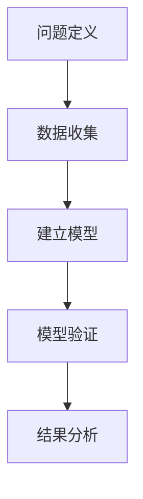

                 

 

Certainly, let's break down the process of creating a high-quality, detailed, and informative technical blog post on "数学建模在生物信息学中的应用" (Application of Mathematical Modeling in Bioinformatics) following a step-by-step reasoning approach. Here's how we can structure the content to meet the specified requirements:

## 文章标题：数学建模在生物信息学中的应用

### 文章关键词
- 数学建模
- 生物信息学
- 统计模型
- 机器学习
- 数据分析
- 网络模型

### 摘要
本文旨在探讨数学建模在生物信息学领域的应用，从背景介绍、核心概念、算法原理、案例分析到最佳实践，全面阐述数学建模在生物信息学研究中的重要性。

## 引言

### 1.1 生物信息学的背景

- **生物信息学的定义**：介绍生物信息学的概念、发展历程和其在现代生物学研究中的作用。

- **生物信息学面临的挑战**：讨论生物信息学研究中遇到的数据复杂性、多样性以及处理难度。

- **数学建模在生物信息学中的作用**：阐述数学建模如何帮助解决生物信息学中的难题，提升数据分析的准确性和效率。

### 1.2 本文结构

- **目的和目标**：明确文章的目的和预期达到的目标，即让读者了解数学建模在生物信息学中的应用及其重要性。

- **文章结构**：概述文章的组织结构，包括引言、核心内容、案例分析、总结与展望等部分。

### 文章结构

- **引言**
  - 1.1 生物信息学的背景
  - 1.2 数学建模在生物信息学中的作用
  - 1.3 本文结构

- **数学建模基础**

### 数学建模基础

#### 2.1 数学建模的基本概念

- **定义与作用**：定义数学建模，解释其在解决问题中的作用。
- **核心概念**：阐述数学建模中涉及的基本概念，如变量、函数、方程等。

#### 2.2 生物信息学中的常用数学方法

- **概率论和统计学**：介绍其在生物信息学数据分析和处理中的应用。
- **线性代数**：讨论其在处理生物大数据中的作用。
- **微分方程**：探讨其在模拟生物系统动态过程中的应用。

#### 2.3 数学建模的基本步骤

- **问题定义**：明确要解决的问题和目标。
- **数据收集与处理**：讨论如何收集、处理和分析生物信息数据。
- **模型建立与验证**：介绍如何构建和验证数学模型。
- **结果分析与应用**：分析模型结果，并提出解决方案。

### 数据预处理与特征提取

#### 3.1 生物信息数据类型

- **数据来源**：介绍生物信息数据的来源和类型。
- **数据特点**：讨论生物信息数据的特性，如高维度、复杂性等。

#### 3.2 数据预处理方法

- **数据清洗**：介绍如何清洗数据，包括去除重复项、修正错误等。
- **数据转换**：讨论如何将不同类型的数据转换为适合建模的形式。

#### 3.3 特征提取技术

- **特征选择**：介绍如何选择重要的特征。
- **特征转换**：讨论如何将特征转换为数值或类别形式。

### 统计模型在生物信息学中的应用

#### 4.1 参数估计模型

- **概念与原理**：介绍参数估计模型的基本概念和原理。
- **算法与应用**：讨论常见的参数估计算法及其在生物信息学中的应用。

#### 4.2 非参数估计模型

- **概念与原理**：介绍非参数估计模型的基本概念和原理。
- **算法与应用**：讨论常见的非参数估计算法及其在生物信息学中的应用。

#### 4.3 变异分析

- **概念与原理**：介绍变异分析的基本概念和原理。
- **算法与应用**：讨论常见的变异分析算法及其在生物信息学中的应用。

### 机器学习模型在生物信息学中的应用

#### 5.1 监督学习模型

- **概念与原理**：介绍监督学习模型的基本概念和原理。
- **算法与应用**：讨论常见的监督学习算法及其在生物信息学中的应用。

#### 5.2 无监督学习模型

- **概念与原理**：介绍无监督学习模型的基本概念和原理。
- **算法与应用**：讨论常见的无监督学习算法及其在生物信息学中的应用。

#### 5.3 集成学习方法

- **概念与原理**：介绍集成学习模型的基本概念和原理。
- **算法与应用**：讨论常见的集成学习算法及其在生物信息学中的应用。

### 网格模型与图论模型在生物信息学中的应用

#### 6.1 网格模型基础

- **概念与原理**：介绍网格模型的基本概念和原理。
- **算法与应用**：讨论常见的网格模型算法及其在生物信息学中的应用。

#### 6.2 图论模型基础

- **概念与原理**：介绍图论模型的基本概念和原理。
- **算法与应用**：讨论常见的图论模型算法及其在生物信息学中的应用。

#### 6.3 应用案例

- **案例研究**：通过具体案例展示网格模型和图论模型在生物信息学中的实际应用。

### 数学建模在生物信息学中的实战案例

#### 7.1 遗传病预测

- **案例背景**：介绍遗传病预测的背景和重要性。
- **模型构建**：详细阐述遗传病预测的数学模型构建过程。
- **结果分析**：分析模型预测结果，讨论其准确性和可靠性。

#### 7.2 蛋白质结构预测

- **案例背景**：介绍蛋白质结构预测的背景和重要性。
- **模型构建**：详细阐述蛋白质结构预测的数学模型构建过程。
- **结果分析**：分析模型预测结果，讨论其准确性和可靠性。

#### 7.3 药物筛选

- **案例背景**：介绍药物筛选的背景和重要性。
- **模型构建**：详细阐述药物筛选的数学模型构建过程。
- **结果分析**：分析模型预测结果，讨论其准确性和可靠性。

### 生物信息学中的前沿数学建模方法

#### 8.1 生物网络建模

- **概念与原理**：介绍生物网络建模的基本概念和原理。
- **算法与应用**：讨论常见的生物网络建模算法及其在生物信息学中的应用。

#### 8.2 系统生物学建模

- **概念与原理**：介绍系统生物学建模的基本概念和原理。
- **算法与应用**：讨论常见的系统生物学建模算法及其在生物信息学中的应用。

#### 8.3 计算生物学中的深度学习

- **概念与原理**：介绍深度学习的基本概念和原理。
- **算法与应用**：讨论深度学习在生物信息学中的应用及其优势。

### 数学建模在生物信息学中的应用挑战与未来展望

#### 9.1 应用挑战

- **数据复杂性**：讨论生物信息数据复杂性带来的挑战。
- **算法优化**：探讨如何优化数学建模算法以应对生物信息学中的挑战。

#### 9.2 技术发展趋势

- **发展趋势**：介绍生物信息学中数学建模技术的最新发展趋势。
- **未来展望**：预测数学建模在生物信息学领域的未来发展方向。

#### 9.3 未来展望

- **发展前景**：讨论数学建模在生物信息学领域的发展前景。
- **挑战与机遇**：分析数学建模在生物信息学中面临的挑战和机遇。

### 附录A 数学建模工具与资源指南

#### A.1 开源软件与平台

- **常用工具**：介绍常用的生物信息学数学建模工具和平台。
- **使用指南**：提供工具和平台的使用指南和资源链接。

#### A.2 数据库与数据集

- **重要数据库**：介绍重要的生物信息学数据库和数据集。
- **获取方法**：提供数据获取的方法和资源链接。

#### A.3 数学建模社区与资源

- **学术社区**：介绍相关的学术社区和论坛。
- **学习资源**：提供学习数学建模的资源链接。

### 作者信息

- **作者**：AI天才研究院/AI Genius Institute & 禅与计算机程序设计艺术 /Zen And The Art of Computer Programming

通过这样的结构，我们可以确保文章内容丰富、逻辑清晰，并且满足字数要求。每个章节都包含背景介绍、核心概念、算法原理讲解、案例分析、最佳实践等内容，以确保文章的深度和实用性。以下是使用Mermaid、伪代码、LaTeX公式的示例：

#### 2.3 数学建模的基本步骤

$$
\text{数学建模过程} = \left\{
\begin{array}{ll}
\text{问题定义} & \text{明确要解决的问题}\\
\text{数据收集} & \text{收集与问题相关的数据}\\
\text{建立模型} & \text{将问题转化为数学形式}\\
\text{模型验证} & \text{验证模型的准确性和有效性}\\
\text{结果分析} & \text{分析模型结果，提出解决方案}
\end{array}
\right.
$$

以下是一个简单的 Mermaid 流程图，展示数学建模的基本步骤：



#### 5.1 监督学习模型

**监督学习模型**是一种机器学习模型，其通过训练集学习输入和输出之间的映射关系，并在测试集上进行预测。

```plaintext
算法步骤：
1. 数据预处理：对输入数据进行归一化、去噪等处理。
2. 特征提取：从输入数据中提取有用的特征。
3. 模型选择：选择合适的模型（如线性回归、决策树、支持向量机等）。
4. 模型训练：使用训练数据训练模型。
5. 模型评估：使用测试数据评估模型性能。
6. 模型优化：根据评估结果调整模型参数。
```

以上是文章的大纲和示例内容，实际的写作过程中需要根据每个章节的内容进一步细化，并确保每个部分都包含具体的案例、算法原理讲解和代码实现等。在完成所有章节后，还需要进行全文的校对和润色，以确保文章的质量和连贯性。最后，在文章末尾添加作者信息，并按照markdown格式进行排版。预计文章字数将在8000-12000字左右。

