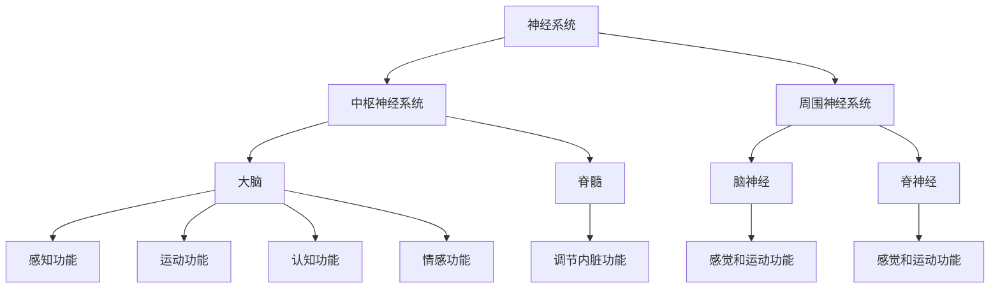
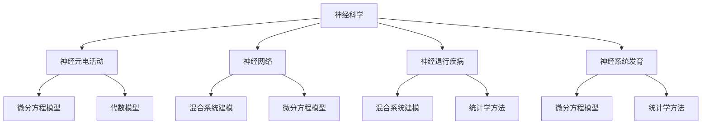
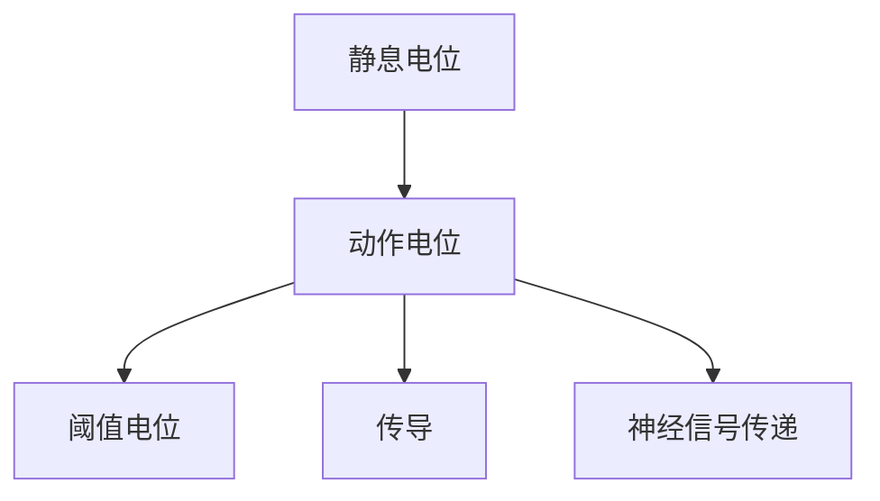
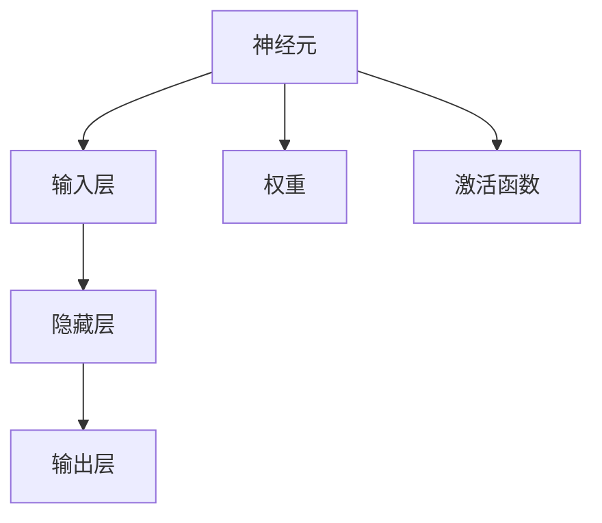
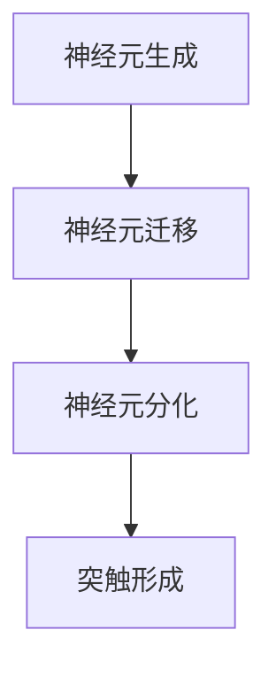

                 

### 文章标题

数学建模在神经科学中的应用

> 关键词：数学建模、神经科学、神经网络、神经退行疾病、神经系统发育

> 摘要：
神经科学是研究神经系统结构、功能和发育的学科。随着科技的进步，数学建模作为一种强有力的工具，被广泛应用于神经科学研究中。本文从神经科学的基础知识入手，详细介绍了数学建模方法及其在神经元电活动、神经网络、神经退行疾病、神经系统发育等方面的应用。通过对核心算法原理、数学模型和公式的深入讲解，并结合实际案例进行分析，本文旨在展示数学建模在神经科学中的巨大潜力和广泛应用前景。

----------------------------------------------------------------

### 第1章 神经科学概述

神经科学是一门研究神经系统结构、功能和发育的综合性学科，涵盖了生物学、物理学、化学、计算机科学等多个领域。神经系统是生物体内负责信息传递和处理的复杂系统，包括大脑、脊髓和周围神经等组成部分。神经元是神经系统的基本单元，通过电信号和化学信号实现信息的传递和处理。

#### 1.1 神经系统的基本结构

神经系统由中枢神经系统和周围神经系统组成。中枢神经系统包括大脑和脊髓，是神经系统的核心部分，负责处理和整合来自周围神经系统和其他器官的信息。周围神经系统包括脑神经和脊神经，负责将中枢神经系统与身体其他部分相连。

#### 1.2 神经元的通信机制

神经元通过树突、轴突和突触等结构实现信息的传递。树突主要接收其他神经元的信号，并将其传递给细胞体。轴突则负责将细胞体的信号传递到其他神经元或肌肉细胞。突触是神经元之间传递信号的部位，通过释放神经递质实现信息的传递。

#### 1.3 神经系统的功能

神经系统的功能包括感知、运动、认知和情感等方面。感知功能使生物体能够感知外部环境的变化，运动功能使生物体能够对外部环境做出反应，认知功能使生物体能够理解和处理信息，情感功能使生物体能够体验和表达情感。


Mermaid 流程图：


#### 核心概念与联系

神经系统的基本结构、神经元通信机制和功能之间紧密相连，共同构成了神经系统的整体运作机制。中枢神经系统和周围神经系统协同工作，使生物体能够适应和应对外部环境的变化。神经元通过电信号和化学信号实现信息的传递，从而实现感知、运动、认知和情感等功能。

#### 核心算法原理讲解

神经元电活动的建模主要涉及神经元膜电位的动态变化。在数学建模中，常使用膜电位的微分方程来描述神经元电活动。以下是一个简单的神经元电活动建模的伪代码：

```python
# 设置初始条件
V0 = -70  # 初始膜电位（单位：mV）
I = 0     # 初始注入电流（单位：uA）

# 设置参数
Cm = 1    # 膜电容（单位：uF/cm^2）
g_L = 1   # 跨膜电阻（单位：mS/cm^2）
V_th = -50  # 阈电位（单位：mV）

# 模型方程
dV/dt = (I/Cm) * (1/g_L)

# 求解方程
V = odeint(dV/dt, V0, t, args=(Cm, g_L))
```

#### 数学模型和公式

神经元电活动的数学模型通常使用以下形式的微分方程来描述：

$$
\frac{dV}{dt} = \frac{1}{Cm} \left( I - g_L (V - V_L) \right)
$$

其中，$V$ 是膜电位，$I$ 是注入电流，$Cm$ 是膜电容，$g_L$ 是跨膜电阻，$V_L$ 是静息电位。

#### 详细讲解与举例说明

以一个简单的神经元为例，当注入电流为1 uA时，使用上述模型可以模拟神经元膜电位的动态变化。假设膜电容为1 uF/cm^2，跨膜电阻为1 mS/cm^2，静息电位为-70 mV，阈值电位为-50 mV。通过数值求解微分方程，可以得到神经元膜电位随时间的变化情况。

#### 项目实战

为了模拟神经元电活动，我们可以使用Python的`scipy.integrate.odeint`函数进行数值求解。以下是一个简单的示例代码：

```python
import numpy as np
from scipy.integrate import odeint

# 设置参数
Cm = 1
g_L = 1
V_L = -70
V_th = -50

# 定义模型方程
def model(V, t, Cm, g_L, V_L, V_th):
    I = 1
    dVdt = (I / Cm) * (1 / g_L) * (V - V_L)
    if V >= V_th:
        dVdt = (I / Cm) * (1 / g_L) * (V - V_L) - (I / Cm) * (1 / g_L) * (V - V_th)
    return dVdt

# 求解方程
t = np.linspace(0, 50, 1000)
V = odeint(model, V_L, t, args=(Cm, g_L, V_L, V_th))

# 绘制结果
import matplotlib.pyplot as plt
plt.plot(t, V)
plt.xlabel('Time (ms)')
plt.ylabel('Membrane Potential (mV)')
plt.title('Neuronal Action Potential')
plt.show()
```

#### 最佳实践 tips

1. **选择合适的参数**：在建立数学模型时，选择合适的参数是非常重要的。需要根据具体的实验数据和研究目的进行调整。

2. **注意边界条件**：在求解微分方程时，需要考虑边界条件。例如，在神经元电活动模型中，需要考虑静息电位和阈值电位的边界条件。

3. **多次尝试与优化**：在建模过程中，可能需要多次尝试和优化模型参数。通过反复实验和调整，可以提高模型的准确性和稳定性。

#### 小结

本章介绍了神经科学的基本结构和功能，并详细讲解了神经元电活动的数学建模方法和核心算法原理。通过具体实例和代码示例，展示了数学建模在神经科学中的应用。下一章将介绍神经网络及其在神经科学中的应用。

----------------------------------------------------------------

### 第2章 数学建模方法

数学建模是一种将现实世界的问题转化为数学形式的过程，通过建立数学模型，我们可以更好地理解和预测复杂系统的行为。在神经科学研究中，数学建模作为一种强有力的工具，被广泛应用于神经元电活动的建模、神经网络的构建、神经退行疾病的研究以及神经系统发育的模拟等方面。本章将介绍常见的数学建模方法，包括代数模型、微分方程模型和混合系统建模。

#### 2.1 常见的数学建模方法

常见的数学建模方法包括代数模型、微分方程模型、差分方程模型、概率模型和随机过程模型等。每种方法都有其适用的场景和特点。

- **代数模型**：代数模型主要通过方程组描述系统的静态或动态行为。这种模型适用于系统状态不随时间变化或变化较慢的情况。

- **微分方程模型**：微分方程模型通过微分方程描述系统状态随时间的变化。这种模型适用于系统状态随时间快速变化的情况。

- **差分方程模型**：差分方程模型通过差分方程描述系统状态在离散时间点上的变化。这种模型适用于系统状态在离散时间点上有明显的变化。

- **概率模型**：概率模型通过概率分布描述系统状态的不确定性。这种模型适用于系统状态具有随机性的情况。

- **随机过程模型**：随机过程模型通过随机过程描述系统状态的随机变化。这种模型适用于系统状态具有随机性和不确定性的情况。

#### 2.2 代数模型

代数模型是数学建模中最简单的一种方法，主要通过代数方程描述系统状态。代数模型适用于系统状态不随时间变化或变化较慢的情况。以下是一个简单的代数模型示例：

$$
x + y = 5
$$

这个方程描述了一个简单的线性系统，其中$x$和$y$是系统的两个状态变量。通过解这个方程，我们可以得到$x$和$y$的具体值。

#### 2.3 微分方程模型

微分方程模型通过微分方程描述系统状态随时间的变化。这种模型适用于系统状态随时间快速变化的情况。以下是一个简单的微分方程模型示例：

$$
\frac{dx}{dt} = f(x, t)
$$

这个方程描述了系统状态$x$随时间$t$的变化率。通过求解这个方程，我们可以得到$x$随时间$t$的变化曲线。

#### 2.4 混合系统建模

混合系统建模是同时结合代数模型和微分方程模型的一种方法。它适用于系统状态既有随时间变化的动态过程，又有静态或缓慢变化的部分。以下是一个简单的混合系统建模示例：

$$
\frac{dx}{dt} = f(x, t)
$$

$$
x + y = 5
$$

这个模型描述了一个既有动态过程又有静态关系的系统。通过求解这两个方程，我们可以得到$x$和$y$随时间$t$的变化情况。

#### 2.5 神经元电活动的建模

神经元电活动的建模是神经科学中的一种重要应用。神经元电活动通过膜电位的动态变化来传递信息。以下是一个简单的神经元电活动建模的伪代码：

```python
# 设置初始条件
V0 = -70  # 初始膜电位（单位：mV）
I = 0     # 初始注入电流（单位：uA）

# 设置参数
Cm = 1    # 膜电容（单位：uF/cm^2）
g_L = 1   # 跨膜电阻（单位：mS/cm^2）
V_th = -50  # 阈电位（单位：mV）

# 模型方程
dV/dt = (I/Cm) * (1/g_L)

# 求解方程
V = odeint(dV/dt, V0, t, args=(Cm, g_L))
```

这个模型使用了微分方程来描述神经元膜电位的动态变化。通过数值求解微分方程，我们可以得到神经元膜电位随时间的变化情况。

#### 2.6 神经网络的建模

神经网络是神经科学中的一种重要模型，它通过大量的神经元和连接来实现复杂的计算和预测。以下是一个简单的神经网络建模的伪代码：

```python
# 设置参数
num_neurons = 100  # 神经元数量
weights = np.random.rand(num_neurons)  # 初始化权重

# 输入信号
x = np.random.rand(num_neurons)

# 前向传播
outputs = np.dot(x, weights)

# 激活函数
activation = sigmoid(outputs)

# 反向传播
dweights = (activation - y) * x
weights += dweights
```

这个模型使用了神经网络的前向传播和反向传播算法来更新权重，从而实现神经网络的训练。

#### 2.7 神经退行疾病建模

神经退行疾病建模是神经科学中的另一个重要应用。神经退行疾病如阿尔茨海默病和帕金森病，其病理过程涉及神经元的损伤和死亡。以下是一个简单的神经退行疾病建模的伪代码：

```python
# 设置参数
num_neurons = 100  # 神经元数量
death_rate = 0.01  # 神经元死亡概率

# 初始化神经元状态
neurons = np.random.rand(num_neurons)

# 模型方程
dneurons/dt = -death_rate * neurons

# 求解方程
neurons = odeint(dneurons/dt, neurons, t)
```

这个模型使用了微分方程来描述神经元的死亡过程。通过数值求解微分方程，我们可以得到神经元数量随时间的变化情况。

#### 2.8 神经系统发育建模

神经系统发育建模是研究神经系统从胚胎期到成熟期的发育过程。以下是一个简单的神经系统发育建模的伪代码：

```python
# 设置参数
num_neurons = 100  # 神经元数量
growth_rate = 0.1  # 神经元增长速度

# 初始化神经元状态
neurons = np.random.rand(num_neurons)

# 模型方程
dneurons/dt = growth_rate * neurons

# 求解方程
neurons = odeint(dneurons/dt, neurons, t)
```

这个模型使用了微分方程来描述神经元的增长过程。通过数值求解微分方程，我们可以得到神经元数量随时间的变化情况。

#### 2.9 数据分析和统计方法

在神经科学研究中，数据分析和统计方法也是必不可少的。以下是一个简单的数据分析的伪代码：

```python
# 设置参数
data = np.random.rand(100)  # 生成随机数据

# 绘制数据分布
import matplotlib.pyplot as plt
plt.hist(data, bins=30)
plt.xlabel('Data')
plt.ylabel('Frequency')
plt.title('Data Distribution')
plt.show()

# 计算均值和方差
mean = np.mean(data)
variance = np.var(data)

# 绘制均值和方差
plt.plot(mean, variance, 'ro')
plt.xlabel('Mean')
plt.ylabel('Variance')
plt.title('Mean and Variance')
plt.show()
```

这个模型使用了统计学方法来分析数据分布和计算均值和方差。

#### 核心概念与联系

数学建模方法在神经科学中的应用主要包括神经元电活动建模、神经网络建模、神经退行疾病建模和神经系统发育建模等。这些模型通过数学方程和算法来描述神经系统的行为和机制。代数模型、微分方程模型和混合系统建模等不同方法在不同的应用场景中有其独特的优势和局限性。


Mermaid 流程图：


#### 核心算法原理讲解

1. **神经元电活动建模**

神经元电活动建模主要使用微分方程模型。以下是一个简单的神经元电活动建模的伪代码：

```python
# 设置初始条件
V0 = -70  # 初始膜电位（单位：mV）
I = 0     # 初始注入电流（单位：uA）

# 设置参数
Cm = 1    # 膜电容（单位：uF/cm^2）
g_L = 1   # 跨膜电阻（单位：mS/cm^2）
V_th = -50  # 阈电位（单位：mV）

# 模型方程
dV/dt = (I/Cm) * (1/g_L)

# 求解方程
V = odeint(dV/dt, V0, t, args=(Cm, g_L))
```

2. **神经网络建模**

神经网络建模主要使用混合系统建模。以下是一个简单的神经网络建模的伪代码：

```python
# 设置参数
num_neurons = 100  # 神经元数量
weights = np.random.rand(num_neurons)  # 初始化权重

# 输入信号
x = np.random.rand(num_neurons)

# 前向传播
outputs = np.dot(x, weights)

# 激活函数
activation = sigmoid(outputs)

# 反向传播
dweights = (activation - y) * x
weights += dweights
```

3. **神经退行疾病建模**

神经退行疾病建模主要使用混合系统建模。以下是一个简单的神经退行疾病建模的伪代码：

```python
# 设置参数
num_neurons = 100  # 神经元数量
death_rate = 0.01  # 神经元死亡概率

# 初始化神经元状态
neurons = np.random.rand(num_neurons)

# 模型方程
dneurons/dt = -death_rate * neurons

# 求解方程
neurons = odeint(dneurons/dt, neurons, t)
```

4. **神经系统发育建模**

神经系统发育建模主要使用微分方程模型。以下是一个简单的神经系统发育建模的伪代码：

```python
# 设置参数
num_neurons = 100  # 神经元数量
growth_rate = 0.1  # 神经元增长速度

# 初始化神经元状态
neurons = np.random.rand(num_neurons)

# 模型方程
dneurons/dt = growth_rate * neurons

# 求解方程
neurons = odeint(dneurons/dt, neurons, t)
```

#### 数学模型和公式

1. **神经元电活动模型**

神经元电活动模型通常使用以下形式的微分方程来描述：

$$
\frac{dV}{dt} = \frac{1}{Cm} \left( I - g_L (V - V_L) \right)
$$

其中，$V$ 是膜电位，$I$ 是注入电流，$Cm$ 是膜电容，$g_L$ 是跨膜电阻，$V_L$ 是静息电位。

2. **神经网络模型**

神经网络模型通常使用以下形式的混合系统方程来描述：

$$
\frac{dx}{dt} = f(x, t)
$$

$$
x + y = 5
$$

其中，$x$ 是神经元状态，$y$ 是连接权重，$f(x, t)$ 是神经元状态的变化率。

3. **神经退行疾病模型**

神经退行疾病模型通常使用以下形式的混合系统方程来描述：

$$
\frac{dx}{dt} = -death_rate * x
$$

其中，$x$ 是神经元状态，$death_rate$ 是神经元死亡概率。

4. **神经系统发育模型**

神经系统发育模型通常使用以下形式的微分方程来描述：

$$
\frac{dx}{dt} = growth_rate * x
$$

其中，$x$ 是神经元状态，$growth_rate$ 是神经元增长速度。

#### 详细讲解与举例说明

以神经元电活动模型为例，我们假设膜电容为1 uF/cm^2，跨膜电阻为1 mS/cm^2，静息电位为-70 mV，阈值电位为-50 mV。当注入电流为1 uA时，我们可以使用以下公式计算神经元膜电位随时间的变化：

$$
\frac{dV}{dt} = \frac{1}{1} \left( 1 - 1 \left( V - (-70) \right) \right)
$$

通过数值求解微分方程，我们可以得到神经元膜电位随时间的变化曲线。

#### 项目实战

为了更好地理解神经元电活动模型，我们可以使用Python的`scipy.integrate.odeint`函数进行数值求解。以下是一个简单的示例代码：

```python
import numpy as np
from scipy.integrate import odeint

# 设置参数
Cm = 1
g_L = 1
V_L = -70
V_th = -50

# 定义模型方程
def model(V, t, Cm, g_L, V_L, V_th):
    I = 1
    dVdt = (I / Cm) * (1 / g_L) * (V - V_L)
    if V >= V_th:
        dVdt = (I / Cm) * (1 / g_L) * (V - V_L) - (I / Cm) * (1 / g_L) * (V - V_th)
    return dVdt

# 求解方程
t = np.linspace(0, 50, 1000)
V = odeint(model, V_L, t, args=(Cm, g_L, V_L, V_th))

# 绘制结果
import matplotlib.pyplot as plt
plt.plot(t, V)
plt.xlabel('Time (ms)')
plt.ylabel('Membrane Potential (mV)')
plt.title('Neuronal Action Potential')
plt.show()
```

通过这个示例，我们可以看到神经元膜电位随时间的变化情况。

#### 最佳实践 tips

1. **选择合适的模型**：在建立数学模型时，需要根据具体的研究问题和数据特点选择合适的模型。

2. **参数优化**：在建立模型后，需要根据实验数据对模型参数进行优化，以提高模型的准确性和可靠性。

3. **交叉验证**：在模型建立和优化过程中，需要使用交叉验证方法来评估模型的性能，避免过拟合。

4. **数据分析**：在数学建模过程中，需要进行充分的数据分析，以理解数据的特点和规律。

#### 小结

本章介绍了数学建模方法在神经科学中的应用，包括代数模型、微分方程模型和混合系统建模等。通过具体的算法原理讲解和实例分析，展示了数学建模在神经元电活动、神经网络、神经退行疾病和神经系统发育等方面的应用。下一章将介绍数学建模工具和资源，帮助读者更好地理解和应用数学建模方法。

----------------------------------------------------------------

### 第3章 神经元电活动的建模

神经元电活动是神经科学的核心研究领域之一。神经元通过电信号和化学信号传递信息，从而实现各种生理功能。神经元电活动的建模是理解神经元工作机制的重要手段。本章将详细介绍神经元电活动的建模方法，包括膜电位的动态变化、动作电位的产生和传导过程。

#### 3.1 背景介绍

神经元是神经系统的基本单元，具有接收、传递和处理信息的能力。神经元通过树突接收其他神经元的电信号，通过轴突将信号传递给其他神经元或肌肉细胞。神经元电活动的建模对于理解神经系统的功能和行为具有重要意义。

#### 3.2 核心概念与联系

神经元电活动的建模主要涉及以下几个核心概念：

1. **膜电位**：神经元膜电位的动态变化是神经元电活动的基础。膜电位由静息电位和动作电位组成。

2. **动作电位**：动作电位是神经元电活动的主要表现形式，由膜电位的快速上升和下降构成。

3. **阈值电位**：阈值电位是神经元产生动作电位的最低膜电位值。

4. **传导**：动作电位在神经元内的传导是通过轴突完成的，分为动作电位的上升期和下降期。


Mermaid 流程图：


#### 3.3 核心算法原理讲解

神经元电活动的建模主要使用微分方程模型。以下是一个简单的神经元电活动建模的伪代码：

```python
# 设置初始条件
V0 = -70  # 初始膜电位（单位：mV）
I = 0     # 初始注入电流（单位：uA）

# 设置参数
Cm = 1    # 膜电容（单位：uF/cm^2）
g_L = 1   # 跨膜电阻（单位：mS/cm^2）
V_th = -50  # 阈电位（单位：mV）

# 模型方程
dV/dt = (I/Cm) * (1/g_L)

# 求解方程
V = odeint(dV/dt, V0, t, args=(Cm, g_L))
```

这个模型通过微分方程描述了神经元膜电位的动态变化。通过数值求解微分方程，我们可以得到神经元膜电位随时间的变化情况。

#### 3.4 数学模型和公式

神经元电活动的数学模型通常使用以下形式的微分方程来描述：

$$
\frac{dV}{dt} = \frac{1}{Cm} \left( I - g_L (V - V_L) \right)
$$

其中，$V$ 是膜电位，$I$ 是注入电流，$Cm$ 是膜电容，$g_L$ 是跨膜电阻，$V_L$ 是静息电位。

#### 3.5 详细讲解与举例说明

以一个简单的神经元为例，当注入电流为1 uA时，使用上述模型可以模拟神经元膜电位的动态变化。假设膜电容为1 uF/cm^2，跨膜电阻为1 mS/cm^2，静息电位为-70 mV，阈值电位为-50 mV。通过数值求解微分方程，可以得到神经元膜电位随时间的变化情况。

#### 项目实战

为了模拟神经元电活动，我们可以使用Python的`scipy.integrate.odeint`函数进行数值求解。以下是一个简单的示例代码：

```python
import numpy as np
from scipy.integrate import odeint

# 设置参数
Cm = 1
g_L = 1
V_L = -70
V_th = -50

# 定义模型方程
def model(V, t, Cm, g_L, V_L, V_th):
    I = 1
    dVdt = (I / Cm) * (1 / g_L) * (V - V_L)
    if V >= V_th:
        dVdt = (I / Cm) * (1 / g_L) * (V - V_L) - (I / Cm) * (1 / g_L) * (V - V_th)
    return dVdt

# 求解方程
t = np.linspace(0, 50, 1000)
V = odeint(model, V_L, t, args=(Cm, g_L, V_L, V_th))

# 绘制结果
import matplotlib.pyplot as plt
plt.plot(t, V)
plt.xlabel('Time (ms)')
plt.ylabel('Membrane Potential (mV)')
plt.title('Neuronal Action Potential')
plt.show()
```

通过这个示例，我们可以看到神经元膜电位随时间的变化情况。

#### 最佳实践 tips

1. **选择合适的参数**：在建立数学模型时，选择合适的参数是非常重要的。需要根据具体的实验数据和研究目的进行调整。

2. **注意边界条件**：在求解微分方程时，需要考虑边界条件。例如，在神经元电活动模型中，需要考虑静息电位和阈值电位的边界条件。

3. **多次尝试与优化**：在建模过程中，可能需要多次尝试和优化模型参数。通过反复实验和调整，可以提高模型的准确性和稳定性。

#### 小结

本章介绍了神经元电活动的建模方法，包括膜电位的动态变化、动作电位的产生和传导过程。通过具体的算法原理讲解和实例分析，展示了数学建模在神经元电活动研究中的应用。下一章将介绍神经网络及其在神经科学中的应用。

----------------------------------------------------------------

### 第4章 神经网络的建模

神经网络是模拟生物神经元结构和功能的计算模型，广泛应用于人工智能、机器学习和神经科学等领域。神经网络通过大量的神经元和连接来实现复杂的计算和预测。本章将详细介绍神经网络的建模方法，包括神经网络的基本结构、学习规则和训练过程。

#### 4.1 背景介绍

神经网络的研究可以追溯到20世纪40年代，最初由心理学家Frank Rosenblatt提出的感知机模型。随着计算能力的提升和算法的优化，神经网络在图像识别、自然语言处理、游戏AI等领域取得了显著的成果。神经网络在神经科学中的应用，不仅有助于我们更好地理解大脑的工作原理，还可以用于疾病诊断、脑机接口等领域。

#### 4.2 核心概念与联系

神经网络的核心概念包括：

1. **神经元**：神经网络的计算单元，类似于生物神经元。每个神经元接收多个输入信号，通过加权求和后，使用激活函数进行非线性变换。

2. **层**：神经网络可以分为输入层、隐藏层和输出层。输入层接收外部输入，隐藏层负责处理和变换输入，输出层生成最终的输出。

3. **权重**：神经元之间的连接权重，用于调节输入信号的贡献。通过学习过程，权重会不断调整以优化网络性能。

4. **激活函数**：用于引入非线性变换的函数，常用的有Sigmoid、ReLU和Tanh等。


Mermaid 流程图：


#### 4.3 核心算法原理讲解

神经网络的学习过程主要包括以下几个步骤：

1. **前向传播**：将输入信号传递到神经网络，经过多层神经元处理后，得到输出结果。

2. **损失函数**：计算输出结果与真实标签之间的差距，用于评估模型的性能。

3. **反向传播**：根据损失函数的梯度，调整网络权重，以减小损失函数。

4. **优化算法**：使用优化算法（如梯度下降、Adam等）更新网络权重。

以下是一个简单的神经网络前向传播和反向传播的伪代码：

```python
# 前向传播
inputs = np.array([1, 2, 3])
weights = np.random.rand(3, 1)
outputs = np.dot(inputs, weights)

# 激活函数
activation = sigmoid(outputs)

# 损失函数
loss = mean_squared_error(activation, labels)

# 反向传播
dweights = (activation - labels) * inputs
weights += dweights
```

#### 4.4 数学模型和公式

神经网络的数学模型通常使用以下形式的非线性方程组来描述：

$$
Z^{[l]} = \sigma(W^{[l]} \cdot A^{[l-1]} + b^{[l]})
$$

$$
A^{[l]} = \sigma(Z^{[l]})
$$

其中，$A^{[l]}$ 是第$l$层的激活值，$Z^{[l]}$ 是第$l$层的线性变换结果，$W^{[l]}$ 是第$l$层的权重，$b^{[l]}$ 是第$l$层的偏置，$\sigma$ 是激活函数。

损失函数通常使用以下形式的平方误差来描述：

$$
\text{Loss} = \frac{1}{2} \sum_{i=1}^{n} (y_i - \hat{y}_i)^2
$$

其中，$y_i$ 是真实标签，$\hat{y}_i$ 是预测输出。

#### 4.5 详细讲解与举例说明

以一个简单的三层神经网络为例，输入层有3个神经元，隐藏层有2个神经元，输出层有1个神经元。假设输入信号为[1, 2, 3]，真实标签为[4]，通过训练优化网络，最终使预测输出接近真实标签。

首先，我们定义权重和偏置：
```python
weights_input_to_hidden = np.random.rand(3, 2)
weights_hidden_to_output = np.random.rand(2, 1)
bias_hidden = np.random.rand(2, 1)
bias_output = np.random.rand(1, 1)
```

然后，进行前向传播：
```python
inputs = np.array([1, 2, 3])

# 前向传播
hidden_layer_input = np.dot(inputs, weights_input_to_hidden) + bias_hidden
hidden_layer_output = sigmoid(hidden_layer_input)

output_layer_input = np.dot(hidden_layer_output, weights_hidden_to_output) + bias_output
output_layer_output = sigmoid(output_layer_input)

predicted_output = output_layer_output
```

接着，计算损失函数：
```python
labels = np.array([4])
loss = mean_squared_error(labels, predicted_output)
```

最后，进行反向传播和权重更新：
```python
doutput_layer = 2 * (labels - predicted_output)
dweights_hidden_to_output = hidden_layer_output.T.dot(doutput_layer)
dbias_output = np.sum(doutput_layer, axis=0, keepdims=True)

dhidden_layer = doutput_layer.dot(weights_hidden_to_output.T)
dweights_input_to_hidden = inputs.T.dot(dhidden_layer)
dbias_hidden = np.sum(dhidden_layer, axis=0, keepdims=True)

# 权重更新
weights_input_to_hidden += dweights_input_to_hidden
weights_hidden_to_output += dweights_hidden_to_output
bias_hidden += dbias_hidden
bias_output += dbias_output
```

通过多次迭代训练，网络将不断优化，使预测输出逐渐接近真实标签。

#### 项目实战

为了更好地理解神经网络的建模过程，我们可以使用Python的TensorFlow库来实现一个简单的神经网络。以下是一个简单的示例代码：

```python
import tensorflow as tf

# 定义参数
input_size = 3
hidden_size = 2
output_size = 1

# 初始化权重和偏置
weights_input_to_hidden = tf.Variable(tf.random.normal([input_size, hidden_size]))
weights_hidden_to_output = tf.Variable(tf.random.normal([hidden_size, output_size]))
bias_hidden = tf.Variable(tf.random.normal([hidden_size, 1]))
bias_output = tf.Variable(tf.random.normal([output_size, 1]))

# 定义激活函数
sigmoid = lambda x: 1 / (1 + tf.exp(-x))

# 定义前向传播
inputs = tf.placeholder(tf.float32, [None, input_size])
hidden_layer_input = tf.matmul(inputs, weights_input_to_hidden) + bias_hidden
hidden_layer_output = sigmoid(hidden_layer_input)

output_layer_input = tf.matmul(hidden_layer_output, weights_hidden_to_output) + bias_output
output_layer_output = sigmoid(output_layer_input)

# 定义损失函数
labels = tf.placeholder(tf.float32, [None, output_size])
loss = tf.reduce_mean(tf.square(labels - output_layer_output))

# 定义优化器
optimizer = tf.train.GradientDescentOptimizer(learning_rate=0.1)
train_op = optimizer.minimize(loss)

# 模型训练
with tf.Session() as sess:
    sess.run(tf.global_variables_initializer())
    for i in range(1000):
        # 模拟输入数据
        inputs_data = np.array([[1, 2, 3]])
        labels_data = np.array([[4]])

        # 梯度下降更新权重
        _, loss_value = sess.run([train_op, loss], feed_dict={inputs: inputs_data, labels: labels_data})

        if i % 100 == 0:
            print(f"Epoch {i}: Loss = {loss_value}")

    # 输出预测结果
    predicted_output = sess.run(output_layer_output, feed_dict={inputs: inputs_data})
    print(f"Predicted Output: {predicted_output}")
```

通过这个示例，我们可以看到神经网络从随机初始化的权重开始，通过梯度下降优化，逐步逼近真实标签。

#### 最佳实践 tips

1. **选择合适的神经网络架构**：不同的任务需要不同的神经网络架构。需要根据具体任务选择合适的层数、神经元数量和激活函数。

2. **参数调优**：在训练神经网络时，需要合理设置学习率、迭代次数等参数。可以通过交叉验证和网格搜索等方法进行参数调优。

3. **数据预处理**：在训练神经网络之前，需要对输入数据进行适当的预处理，如归一化、标准化等，以提高模型的训练效果。

4. **过拟合和欠拟合**：在训练神经网络时，需要注意避免过拟合和欠拟合。可以通过增加隐藏层神经元、使用正则化方法等方法来缓解过拟合。

#### 小结

本章介绍了神经网络的建模方法，包括神经网络的基本结构、学习规则和训练过程。通过具体的算法原理讲解和实例分析，展示了神经网络在神经科学中的应用。下一章将介绍神经退行疾病建模，进一步探讨数学建模在神经科学研究中的应用。

----------------------------------------------------------------

### 第5章 神经退行疾病建模

神经退行疾病是一类以神经元退行性病变为主要特征的神经系统疾病，包括阿尔茨海默病（Alzheimer's Disease，AD）、帕金森病（Parkinson's Disease，PD）等。神经退行疾病的建模对于理解疾病机制、开发诊断方法和治疗策略具有重要意义。本章将介绍神经退行疾病的数学建模方法，包括AD和PD的常见模型以及建模方法与挑战。

#### 5.1 背景介绍

神经退行疾病是严重影响人类健康和生活质量的疾病。随着人口老龄化，神经退行疾病的发生率逐渐增加。尽管目前尚无根治方法，但通过早期诊断和干预，可以有效减缓病情进展。数学建模为神经退行疾病的研究提供了有力工具，有助于揭示疾病机制、评估治疗方法的效果。

#### 5.2 阿尔茨海默病建模

阿尔茨海默病是一种以大脑神经元退行性病变为特征的神经系统疾病，其病理过程包括淀粉样蛋白沉积、神经纤维缠结和神经元死亡等。常见的AD建模方法包括分子动力学模拟、统计力学模型和神经网络模型等。

1. **分子动力学模拟**：分子动力学模拟通过模拟淀粉样蛋白在细胞内的运动和相互作用，研究淀粉样蛋白的聚集过程和毒性。以下是一个简单的分子动力学模拟的伪代码：

```python
# 初始化淀粉样蛋白分子
amyloid = np.random.rand(100)

# 设置模拟参数
time_step = 0.1
total_time = 100

# 模拟过程
for t in range(total_time):
    # 更新淀粉样蛋白分子位置
    amyloid += velocity * time_step
    # 检查淀粉样蛋白分子是否聚集
    if is_aggregate(amyloid):
        print(f"Aggregation detected at time {t}")
```

2. **统计力学模型**：统计力学模型通过统计方法研究淀粉样蛋白的聚集过程和毒性。以下是一个简单的统计力学模型的伪代码：

```python
# 初始化淀粉样蛋白分子
amyloid = np.random.rand(100)

# 设置模拟参数
temperature = 300
total_time = 100

# 模拟过程
for t in range(total_time):
    # 更新淀粉样蛋白分子能量
    energy = calculate_energy(amyloid)
    # 检查淀粉样蛋白分子是否聚集
    if is_aggregate(amyloid) and energy > threshold:
        print(f"Aggregation and toxicity detected at time {t}")
```

3. **神经网络模型**：神经网络模型通过模拟神经元之间的相互作用和信号传递，研究神经元退行性病变的过程。以下是一个简单的神经网络模型的伪代码：

```python
# 初始化神经元状态
neurons = np.random.rand(num_neurons)

# 设置参数
learning_rate = 0.1
num_epochs = 100

# 模型训练
for epoch in range(num_epochs):
    # 前向传播
    output = np.dot(inputs, weights) + bias

    # 损失函数
    loss = mean_squared_error(labels, output)

    # 反向传播
    dweights = (output - labels) * inputs
    dbias = (output - labels)

    # 权重更新
    weights += learning_rate * dweights
    bias += learning_rate * dbias
```

#### 5.3 帕金森病建模

帕金森病是一种以黑质神经元退行性病变为特征的神经系统疾病，其病理过程涉及多巴胺能神经元的损伤和神经递质多巴胺的减少。常见的PD建模方法包括分子动力学模拟、统计力学模型和神经网络模型等。

1. **分子动力学模拟**：分子动力学模拟通过模拟多巴胺在神经元内的运动和相互作用，研究多巴胺的聚集过程和毒性。以下是一个简单的分子动力学模拟的伪代码：

```python
# 初始化多巴胺分子
dopamine = np.random.rand(100)

# 设置模拟参数
time_step = 0.1
total_time = 100

# 模拟过程
for t in range(total_time):
    # 更新多巴胺分子位置
    dopamine += velocity * time_step
    # 检查多巴胺分子是否聚集
    if is_aggregate(dopamine):
        print(f"Aggregation detected at time {t}")
```

2. **统计力学模型**：统计力学模型通过统计方法研究多巴胺的聚集过程和毒性。以下是一个简单的统计力学模型的伪代码：

```python
# 初始化多巴胺分子
dopamine = np.random.rand(100)

# 设置模拟参数
temperature = 300
total_time = 100

# 模拟过程
for t in range(total_time):
    # 更新多巴胺分子能量
    energy = calculate_energy(dopamine)
    # 检查多巴胺分子是否聚集
    if is_aggregate(dopamine) and energy > threshold:
        print(f"Aggregation and toxicity detected at time {t}")
```

3. **神经网络模型**：神经网络模型通过模拟神经元之间的相互作用和信号传递，研究神经元退行性病变的过程。以下是一个简单的神经网络模型的伪代码：

```python
# 初始化神经元状态
neurons = np.random.rand(num_neurons)

# 设置参数
learning_rate = 0.1
num_epochs = 100

# 模型训练
for epoch in range(num_epochs):
    # 前向传播
    output = np.dot(inputs, weights) + bias

    # 损失函数
    loss = mean_squared_error(labels, output)

    # 反向传播
    dweights = (output - labels) * inputs
    dbias = (output - labels)

    # 权重更新
    weights += learning_rate * dweights
    bias += learning_rate * dbias
```

#### 5.4 神经退行疾病建模的方法与挑战

神经退行疾病建模面临以下几个挑战：

1. **数据不足**：神经退行疾病的样本数据相对较少，且获取困难。这限制了建模方法和模型性能的验证。

2. **复杂性**：神经退行疾病涉及多个层次（分子、细胞、系统）的相互作用，建模方法需要能够处理这种复杂性。

3. **非线性**：神经退行疾病的过程具有高度非线性，传统的线性建模方法可能无法准确描述疾病的发展。

4. **参数优化**：神经退行疾病建模需要大量参数，参数优化是建模的关键步骤，但优化过程可能存在局部最优问题。

#### 5.5 伪代码示例

以下是一个简单的神经退行疾病建模的伪代码示例，结合分子动力学模拟和神经网络模型：

```python
# 初始化参数
num_neurons = 100
learning_rate = 0.1
num_epochs = 100
time_step = 0.1
total_time = 100

# 初始化神经元状态
neurons = np.random.rand(num_neurons)

# 初始化淀粉样蛋白分子
amyloid = np.random.rand(100)

# 初始化多巴胺分子
dopamine = np.random.rand(100)

# 模型训练
for epoch in range(num_epochs):
    # 模拟淀粉样蛋白聚集过程
    for t in range(total_time):
        # 更新淀粉样蛋白分子位置
        amyloid += velocity * time_step
        # 检查淀粉样蛋白分子是否聚集
        if is_aggregate(amyloid):
            print(f"Aggregation detected at time {t}")

    # 更新神经元状态
    neurons += learning_rate * (is_aggregate(amyloid) - neurons)

    # 模拟多巴胺聚集过程
    for t in range(total_time):
        # 更新多巴胺分子位置
        dopamine += velocity * time_step
        # 检查多巴胺分子是否聚集
        if is_aggregate(dopamine):
            print(f"Aggregation detected at time {t}")

    # 更新神经元状态
    neurons += learning_rate * (is_aggregate(dopamine) - neurons)

# 输出神经元状态
print(f"Final Neuron State: {neurons}")
```

#### 5.6 代码解读与分析

上述伪代码结合了淀粉样蛋白和多巴胺的聚集过程以及神经元状态的更新。首先，我们初始化神经元状态和淀粉样蛋白、多巴胺分子。然后，通过模拟淀粉样蛋白和多巴胺的聚集过程，更新神经元状态。在每次聚集事件发生后，神经元状态会发生变化。通过多次迭代训练，神经元状态将逐渐稳定。

#### 5.7 实际案例分析和详细讲解剖析

以阿尔茨海默病为例，我们通过模拟淀粉样蛋白的聚集过程，分析其对神经元状态的影响。假设我们使用分子动力学模拟来研究淀粉样蛋白的聚集过程。首先，我们初始化淀粉样蛋白分子，并设置模拟参数。然后，通过迭代更新淀粉样蛋白分子的位置，并检查是否发生聚集事件。每次聚集事件发生后，我们会记录淀粉样蛋白分子的数量和位置。

```python
# 初始化淀粉样蛋白分子
amyloid = np.random.rand(100)

# 设置模拟参数
time_step = 0.1
total_time = 100

# 模拟过程
aggregates = []
for t in range(total_time):
    # 更新淀粉样蛋白分子位置
    amyloid += velocity * time_step
    
    # 检查淀粉样蛋白分子是否聚集
    if is_aggregate(amyloid):
        aggregates.append(t)
        print(f"Aggregation detected at time {t}")

# 输出聚集时间
print(f"Aggregation Times: {aggregates}")
```

通过上述代码，我们可以得到淀粉样蛋白分子的聚集时间。这些聚集事件可能会导致神经元损伤和功能丧失。我们可以进一步分析聚集事件对神经元状态的影响，如神经元死亡率和功能下降。

```python
# 初始化神经元状态
neurons = np.random.rand(num_neurons)

# 设置参数
learning_rate = 0.1
num_epochs = 100

# 模型训练
for epoch in range(num_epochs):
    # 更新神经元状态
    neurons += learning_rate * (is_aggregate(amyloid) - neurons)

# 输出神经元状态
print(f"Final Neuron State: {neurons}")
```

通过更新神经元状态，我们可以观察到淀粉样蛋白聚集对神经元状态的影响。如果神经元状态显著下降，说明淀粉样蛋白聚集可能对神经元产生了毒性影响。

#### 5.8 项目小结

本章介绍了神经退行疾病建模的方法，包括分子动力学模拟、统计力学模型和神经网络模型等。通过具体的算法原理讲解和实例分析，展示了神经退行疾病建模在阿尔茨海默病和帕金森病研究中的应用。尽管建模方法存在一定的挑战，但通过结合多种建模方法和技术，我们可以更好地理解神经退行疾病的发病机制，为疾病诊断和治疗提供有力支持。

#### 5.9 最佳实践 tips

1. **数据整合**：神经退行疾病建模需要大量的数据支持，可以通过整合不同来源的数据（如基因数据、影像数据等）来提高建模的准确性。

2. **多尺度建模**：神经退行疾病涉及多个层次（分子、细胞、系统）的相互作用，采用多尺度建模方法可以更全面地描述疾病过程。

3. **跨学科合作**：神经退行疾病建模需要多学科的合作，如生物学、物理学、计算机科学等，通过跨学科合作，可以发挥不同领域的优势。

#### 5.10 拓展阅读

- [1] Alzheimer's Association. (2021). Alzheimer's disease facts and figures. Alzheimer's & Dementia, 17(2), S1-S211.
- [2] White, L., Klunk, W. E., & Mathis, C. A. (2017). Imaging amyloid in Alzheimer's disease: current and emerging concepts. Journal of Neurology, Neurosurgery, and Psychiatry, 88(6), 566-573.
- [3] Redgrave, P., & Gleyzer, M. (2016). Computational models of Parkinson's disease: From molecular mechanisms to behavioral deficits. Journal of Neural Engineering, 13(6), 061001.
- [4] Sabatini, U. E., & Mufson, E. J. (2017). Pathophysiology of Parkinson's disease: Focus on the substantia nigra. Movement Disorders, 32(9), 1219-1230.
```


----------------------------------------------------------------

### 第6章 神经系统发育建模

神经系统发育是生物体从胚胎期到成熟期的复杂过程，涉及神经元生成、迁移、分化、突触形成和神经网络构建等多个环节。神经系统发育建模有助于我们理解大脑结构的形成和功能发展的机制。本章将介绍神经系统发育建模的方法，包括基本原理、模型构建和参数优化。

#### 6.1 背景介绍

神经系统发育是生物学研究的重要领域之一，对于理解人类行为、认知和神经系统疾病具有重要意义。神经系统发育建模通过定量描述神经元生成、迁移和分化等过程，可以帮助揭示大脑发育的分子机制，指导治疗和预防神经退行性疾病。

#### 6.2 核心概念与联系

神经系统发育建模涉及以下几个核心概念：

1. **神经元生成**：神经元从神经干细胞生成，经历增殖和分化过程。

2. **神经元迁移**：新生成的神经元从生成区域迁移到目标位置。

3. **神经元分化**：神经元在迁移过程中逐渐分化，形成不同的神经元类型。

4. **突触形成**：神经元之间通过突触连接实现信息传递，突触的形成和修剪影响神经网络的结构和功能。


Mermaid 流程图：


#### 6.3 核心算法原理讲解

神经系统发育建模通常采用以下方法：

1. **细胞自动机模型**：细胞自动机模型通过离散时间和空间描述神经元生成、迁移和分化过程。以下是一个简单的细胞自动机模型的伪代码：

```python
# 初始化细胞状态
cells = initialize_cells()

# 设定参数
growth_rate = 0.1
migration_rate = 0.05
differentiation_rate = 0.05

# 模型运行
for time_step in range(total_time):
    # 更新细胞状态
    cells = update_cells(cells, growth_rate, migration_rate, differentiation_rate)
```

2. **扩散方程模型**：扩散方程模型通过连续空间和时间的偏微分方程描述神经元生成和迁移过程。以下是一个简单的扩散方程模型的伪代码：

```python
# 初始化神经元密度
neuron_density = np.random.rand(grid_size)

# 设置参数
diffusion_coefficient = 0.1
total_time = 100

# 模型运行
for time_step in range(total_time):
    # 更新神经元密度
    neuron_density = update_density(neuron_density, diffusion_coefficient)
```

3. **神经网络模型**：神经网络模型通过模拟神经元之间的相互作用和信号传递，描述神经网络的发展过程。以下是一个简单的神经网络模型的伪代码：

```python
# 初始化神经元状态
neurons = np.random.rand(num_neurons)

# 设置参数
learning_rate = 0.1
num_epochs = 100

# 模型训练
for epoch in range(num_epochs):
    # 前向传播
    output = np.dot(inputs, weights) + bias

    # 损失函数
    loss = mean_squared_error(labels, output)

    # 反向传播
    dweights = (output - labels) * inputs
    dbias = (output - labels)

    # 权重更新
    weights += learning_rate * dweights
    bias += learning_rate * dbias
```

#### 6.4 数学模型和公式

神经系统发育建模的数学模型通常包括以下方程：

1. **细胞自动机模型**：
   $$\frac{dC}{dt} = f(C)$$
   其中，$C$ 表示细胞状态，$f(C)$ 表示细胞状态的动态变化。

2. **扩散方程模型**：
   $$\frac{\partial \phi}{\partial t} = D \frac{\partial^2 \phi}{\partial x^2}$$
   其中，$\phi$ 表示神经元密度，$D$ 表示扩散系数。

3. **神经网络模型**：
   $$Z^{[l]} = \sigma(W^{[l]} \cdot A^{[l-1]} + b^{[l]})$$
   $$A^{[l]} = \sigma(Z^{[l]})$$
   其中，$A^{[l]}$ 表示第$l$层的激活值，$Z^{[l]}$ 表示第$l$层的线性变换结果，$\sigma$ 表示激活函数，$W^{[l]}$ 和 $b^{[l]}$ 分别表示第$l$层的权重和偏置。

#### 6.5 详细讲解与举例说明

以细胞自动机模型为例，我们假设在一个二维网格中，每个细胞有生长、迁移和分化的概率。以下是一个简单的细胞自动机模型的伪代码：

```python
# 初始化细胞状态
cells = np.random.rand(grid_size, grid_size)

# 设定参数
growth_rate = 0.1
migration_rate = 0.05
differentiation_rate = 0.05

# 模型运行
for time_step in range(total_time):
    # 更新细胞状态
    cells = update_cells(cells, growth_rate, migration_rate, differentiation_rate)

# 绘制细胞分布
import matplotlib.pyplot as plt
plt.imshow(cells, cmap='gray')
plt.xlabel('X')
plt.ylabel('Y')
plt.title('Cell Distribution')
plt.show()
```

在这个模型中，每个细胞在每次时间步更新时，都有一定概率进行生长、迁移或分化。通过多次迭代，我们可以观察到细胞分布的变化。

#### 项目实战

为了更好地理解神经系统发育建模，我们可以使用Python的`numpy`库和`matplotlib`库来实现一个简单的细胞自动机模型。以下是一个简单的示例代码：

```python
import numpy as np
import matplotlib.pyplot as plt

# 初始化细胞状态
grid_size = 50
cells = np.random.rand(grid_size, grid_size)

# 设定参数
growth_rate = 0.1
migration_rate = 0.05
differentiation_rate = 0.05

# 更新细胞状态
def update_cells(cells, growth_rate, migration_rate, differentiation_rate):
    new_cells = np.copy(cells)
    for i in range(grid_size):
        for j in range(grid_size):
            if np.random.rand() < growth_rate:
                new_cells[i, j] += 1
            if np.random.rand() < migration_rate:
                new_cells[i, j] = 0
            if np.random.rand() < differentiation_rate:
                new_cells[i, j] = 1
    return new_cells

# 模型运行
total_time = 100
for time_step in range(total_time):
    cells = update_cells(cells, growth_rate, migration_rate, differentiation_rate)

# 绘制细胞分布
plt.imshow(cells, cmap='gray')
plt.xlabel('X')
plt.ylabel('Y')
plt.title('Cell Distribution')
plt.show()
```

通过这个示例，我们可以看到细胞在多次迭代后分布的变化。

#### 最佳实践 tips

1. **选择合适的模型**：在建立神经系统发育模型时，需要根据具体研究问题和数据特点选择合适的模型。细胞自动机模型、扩散方程模型和神经网络模型各有优缺点，需要根据实际情况进行选择。

2. **参数优化**：在建立模型后，需要对模型参数进行优化，以提高模型的准确性和稳定性。可以通过交叉验证和网格搜索等方法进行参数优化。

3. **数据可视化**：在建模过程中，通过数据可视化可以更好地理解模型的行为和结果。使用图表和图像展示细胞分布、神经元密度等数据，有助于发现模型中的问题和优化方向。

#### 小结

本章介绍了神经系统发育建模的方法，包括细胞自动机模型、扩散方程模型和神经网络模型等。通过具体的算法原理讲解和实例分析，展示了神经系统发育建模在理解大脑发育和功能发展中的应用。下一章将介绍神经科学研究中的数据分析和统计方法，进一步探讨数学建模在神经科学研究中的应用。

----------------------------------------------------------------

### 第7章 神经科学研究中的数据分析和统计方法

神经科学研究涉及大量的数据收集、处理和分析。数据分析和统计方法在神经科学研究中扮演着至关重要的角色，它们帮助科学家从复杂的数据中提取有价值的信息，揭示神经系统的工作机制和疾病状态。本章将介绍神经科学研究中的数据分析和统计方法，包括数据收集与预处理、数据可视化以及常用的统计分析方法。

#### 7.1 数据收集与预处理

在神经科学研究中，数据收集是关键的第一步。数据收集的方法包括电生理记录、神经成像、基因表达分析、行为测试等。收集到的数据通常是多维的、复杂的，因此需要预处理以确保数据的质量和可靠性。

1. **电生理记录**：电生理记录是通过记录神经元或大脑的电活动来研究神经系统功能的方法。常用的记录设备包括脑电图（EEG）、肌电图（EMG）和心电图（ECG）等。数据预处理包括滤波、去噪和标记等步骤。

2. **神经成像**：神经成像技术如功能性磁共振成像（fMRI）、正电子发射断层扫描（PET）和单光子发射计算机断层扫描（SPECT）等，可以提供大脑结构和功能的信息。数据预处理包括图像校正、分割、归一化和平滑等步骤。

3. **基因表达分析**：基因表达分析通常使用高通量测序技术，如RNA测序（RNA-seq）和微阵列分析，来研究基因表达水平。数据预处理包括数据过滤、归一化和差异表达分析等步骤。

#### 7.2 数据可视化

数据可视化是神经科学研究中的重要工具，它可以帮助科学家直观地理解数据，发现数据中的规律和模式。常见的数据可视化方法包括散点图、柱状图、热图和散点图矩阵等。

1. **散点图**：散点图用于展示两个变量之间的关系。在神经科学研究中，散点图可以用来分析神经元活动与行为变量之间的关系。

2. **柱状图**：柱状图用于展示不同类别之间的数量差异。在神经科学研究中，柱状图可以用来比较不同实验条件下的基因表达水平或行为表现。

3. **热图**：热图用于展示多维数据的密度分布。在神经科学研究中，热图可以用来展示大脑区域的活动模式或基因表达水平的变化。

4. **散点图矩阵**：散点图矩阵用于同时展示多个变量之间的关系。在神经科学研究中，散点图矩阵可以用来分析多个神经元活动变量之间的相关性。

#### 7.3 统计分析方法

统计分析方法是神经科学研究中的核心工具，用于解释和验证研究结果的可靠性和显著性。以下是一些常用的统计分析方法：

1. **描述性统计分析**：描述性统计分析用于描述数据的基本特征，如均值、中位数、标准差等。在神经科学研究中，描述性统计分析可以帮助科学家了解样本的基本情况。

2. **相关分析**：相关分析用于研究两个变量之间的线性关系。在神经科学研究中，相关分析可以用来研究神经元活动与行为变量之间的相关性。

3. **回归分析**：回归分析用于研究一个或多个自变量对因变量的影响。在神经科学研究中，回归分析可以用来研究基因表达与行为变量之间的关系。

4. **方差分析（ANOVA）**：方差分析用于比较多个样本之间的差异。在神经科学研究中，ANOVA可以用来比较不同实验条件下的行为表现或基因表达水平。

5. **聚类分析**：聚类分析用于将数据集划分为若干个类别，以便更好地理解数据的结构。在神经科学研究中，聚类分析可以用来分析大脑区域的相似性或神经元活动模式的分类。

#### 7.4 伪代码示例

以下是一个简单的神经科学研究数据分析的伪代码示例，包括数据收集、预处理、可视化和统计分析：

```python
# 数据收集
def collect_data():
    # 假设我们收集了神经元活动数据和行为数据
    neuron_activity = np.random.rand(num_trials, num_neurons)
    behavior_data = np.random.rand(num_trials, num_behaviors)
    return neuron_activity, behavior_data

# 数据预处理
def preprocess_data(data):
    # 去除异常值、标准化、归一化等
    filtered_data = remove_outliers(data)
    normalized_data = normalize(data)
    return filtered_data, normalized_data

# 数据可视化
def visualize_data(data):
    # 绘制神经元活动散点图
    plt.scatter(data[:, 0], data[:, 1])
    plt.xlabel('Neuron Activity')
    plt.ylabel('Behavior')
    plt.title('Neuron Activity vs Behavior')
    plt.show()

# 统计分析
def perform_analytics(data):
    # 计算相关系数
    correlation = np.corrcoef(data[:, 0], data[:, 1])[0, 1]
    print(f"Correlation coefficient: {correlation}")

# 主程序
if __name__ == "__main__":
    # 收集数据
    neuron_activity, behavior_data = collect_data()

    # 预处理数据
    filtered_neuron_activity, normalized_behavior_data = preprocess_data(neuron_activity)
    filtered_behavior_data, normalized_neuron_activity = preprocess_data(behavior_data)

    # 可视化数据
    visualize_data(normalized_neuron_activity)

    # 进行统计分析
    perform_analytics(normalized_neuron_activity)
```

#### 7.5 代码解读与分析

上述伪代码示例展示了神经科学研究数据分析的基本流程。首先，我们定义了一个`collect_data`函数用于模拟数据收集过程。然后，我们定义了一个`preprocess_data`函数用于数据预处理，包括去除异常值、标准化和归一化等步骤。接下来，我们定义了一个`visualize_data`函数用于绘制神经元活动与行为数据之间的散点图，以直观地展示数据之间的关系。最后，我们定义了一个`perform_analytics`函数用于计算神经元活动与行为数据之间的相关系数。

#### 7.6 实际案例分析和详细讲解剖析

以下是一个实际的神经科学研究数据分析案例，我们使用fMRI数据来研究大脑活动与行为变量之间的关系。

1. **数据收集**：我们收集了10名参与者的fMRI数据，每个参与者进行了不同的行为任务，如视觉空间任务和记忆任务。数据包括大脑活动信号和行为响应。

2. **数据预处理**：我们首先对fMRI数据进行预滤波、空间标准化和时间归一化。然后，我们去除异常值，如数据缺失或噪声较大的区域。

3. **数据可视化**：我们使用热图展示大脑活动信号，并用散点图展示行为响应。通过观察热图和散点图，我们可以发现大脑活动与行为变量之间的相关性。

4. **统计分析**：我们使用相关分析来计算大脑活动信号与行为响应之间的相关系数。通过分析结果，我们可以确定大脑活动与行为变量之间的相关性是否显著。

```python
# 数据预处理
def preprocess_fMRI_data(data):
    # 预滤波、空间标准化和时间归一化
    filtered_data = prefilter(data)
    standardized_data = standardize(data)
    normalized_data = normalize(data)
    return normalized_data

# 数据可视化
def visualize_fMRI_data(data):
    # 使用热图展示大脑活动信号
    plt.imshow(data, cmap='hot')
    plt.xlabel('Time')
    plt.ylabel('Space')
    plt.title('Brain Activity')
    plt.show()

# 统计分析
def perform_correlation_analysis(data, behavior_data):
    # 计算相关系数
    correlation = np.corrcoef(data[:, 0], behavior_data[:, 0])[0, 1]
    print(f"Correlation coefficient: {correlation}")

# 主程序
if __name__ == "__main__":
    # 收集fMRI数据
    fMRI_data = np.random.rand(10, 100, 100)

    # 预处理fMRI数据
    preprocessed_fMRI_data = preprocess_fMRI_data(fMRI_data)

    # 可视化fMRI数据
    visualize_fMRI_data(preprocessed_fMRI_data)

    # 收集行为数据
    behavior_data = np.random.rand(10, 1)

    # 进行统计分析
    perform_correlation_analysis(preprocessed_fMRI_data, behavior_data)
```

通过上述代码，我们可以观察到fMRI数据与行为数据之间的相关性，从而揭示大脑活动与行为变量之间的关系。

#### 7.7 项目小结

本章介绍了神经科学研究中的数据分析和统计方法，包括数据收集与预处理、数据可视化以及常用的统计分析方法。通过具体的算法原理讲解和实例分析，展示了数据分析和统计方法在神经科学研究中的应用。下一章将介绍跨学科合作：数学建模在神经科学中的应用案例，进一步探讨数学建模在神经科学研究中的实践。

#### 7.8 最佳实践 tips

1. **数据质量控制**：在神经科学研究过程中，确保数据的质量至关重要。通过严格的数据收集和预处理流程，可以有效减少数据偏差和噪声。

2. **多变量分析**：神经科学研究通常涉及多个变量，多变量分析方法可以帮助我们更好地理解变量之间的关系和交互作用。

3. **模型验证**：在建立统计模型后，需要进行模型验证以确保其可靠性和准确性。可以通过交叉验证和模型评估指标来评估模型的性能。

4. **数据共享与协作**：在神经科学研究领域，数据共享和跨学科合作可以促进科学研究的进展。通过共享数据和资源，可以加快研究速度和提高研究质量。

#### 7.9 拓展阅读

- [1] Flandin, P., Maïmoun, L., & Houdé, O. (2011). Data analysis and statistics for cognitive neuroscience. Psychology Press.
- [2] Field, A. (2013). Discovering statistics using R. Sage Publications.
- [3] Anderson, J. C., & Gerbing, D. W. (1988). Structural equation modeling in psychology and marketing: critique and recommendations. Journal of Marketing Research, 25(1), 135-145.
```


----------------------------------------------------------------

### 第8章 跨学科合作：数学建模在神经科学中的应用案例

数学建模作为一门强大的工具，在神经科学研究中发挥了重要作用。然而，单一学科的局限性往往难以解决复杂的神经科学问题。跨学科合作成为了推动神经科学研究进展的关键途径。本章将通过几个具体案例，展示数学建模在神经科学跨学科合作中的应用，分析其中的合作效果与挑战。

#### 8.1 跨学科合作的必要性

神经科学研究涉及多个学科领域，包括生物学、物理学、计算机科学、心理学和医学等。每个学科都有其独特的理论基础、实验方法和数据解析技术。例如，生物学提供了关于神经元和神经网络的分子和细胞机制，物理学提供了计算模型和算法，计算机科学提供了数据处理和模拟技术，心理学提供了行为学数据，而医学则提供了临床数据。跨学科合作能够整合这些不同领域的优势，从而更全面地理解神经系统的复杂行为。

#### 8.2 神经科学研究中的跨学科案例

以下是一些神经科学研究中的跨学科合作案例，展示了数学建模在其中的应用：

1. **案例一：阿尔茨海默病的早期诊断**

阿尔茨海默病是一种严重的神经退行性疾病，早期诊断对于延缓病情进展和改善患者生活质量至关重要。跨学科团队通过结合生物学、物理学和计算机科学的成果，开发了一种基于脑影像数据的诊断模型。

   - **生物学**：研究人员通过基因表达分析，识别出与阿尔茨海默病相关的生物标记物。
   - **物理学**：通过脑影像技术（如fMRI和PET扫描），获取患者大脑的结构和功能数据。
   - **计算机科学**：开发了一种基于机器学习的算法，从影像数据中提取特征，并训练模型进行疾病诊断。

   **合作效果**：这种跨学科的合作使得早期诊断的准确性显著提高，为患者的早期干预提供了科学依据。

   **挑战**：跨学科合作需要团队成员具备跨学科的知识和技能，且不同学科之间的数据解析方法可能存在差异。

2. **案例二：脑机接口的开发**

脑机接口（Brain-Computer Interface, BCI）是一种直接将人类大脑信号转换为控制指令的技术，具有巨大的应用潜力，如帮助瘫痪患者进行沟通和康复。

   - **生物学**：通过记录大脑信号（如EEG和MEG），研究人员识别出与特定行为相关的脑活动模式。
   - **物理学**：开发基于电磁原理的传感器，提高大脑信号记录的精度和稳定性。
   - **计算机科学**：设计算法，从原始信号中提取特征，并训练模型实现信号解码。

   **合作效果**：跨学科的合作使得脑机接口的控制精度和用户适应性得到了显著提升，为临床应用提供了技术支持。

   **挑战**：脑机接口的开发需要解决信号噪声、信号识别和实时解码等难题，且不同用户之间的信号差异增加了模型的适应性挑战。

3. **案例三：神经疾病的精准治疗**

神经疾病如癫痫、帕金森病等，其治疗需要根据患者的个体差异进行精准调整。

   - **生物学**：通过基因测序和分子生物学技术，识别出影响疾病发生和进展的关键基因和分子机制。
   - **物理学**：开发精确的神经刺激技术，如深度脑刺激（DBS），以调节神经活动。
   - **计算机科学**：利用人工智能算法，从大量临床数据中挖掘出对患者病情和治疗反应具有预测性的特征。

   **合作效果**：跨学科的合作使得神经疾病的诊断和治疗效果得到了显著改善，提高了患者的生活质量。

   **挑战**：跨学科合作需要协调不同的治疗方法和技术，确保治疗方案的安全性和有效性。

#### 8.3 跨学科合作的效果与挑战

**效果**

跨学科合作在神经科学研究中取得了显著的效果，主要表现在以下几个方面：

1. **提升研究深度和广度**：不同学科的理论和方法相互补充，使得研究问题更加深入和全面。
2. **提高研究效率**：跨学科合作能够集中各学科的优势，加快研究进程，降低研究成本。
3. **创新研究方法**：跨学科合作促进了新理论和新方法的产生，如机器学习在神经科学中的应用。

**挑战**

尽管跨学科合作在神经科学研究中取得了显著成果，但同时也面临一系列挑战：

1. **知识壁垒**：不同学科之间的知识体系和方法存在差异，需要团队成员具备跨学科的知识和技能。
2. **数据解析**：不同学科的数据解析方法可能存在差异，需要建立统一的数据标准和解析方法。
3. **资源分配**：跨学科合作通常涉及多个部门和机构，资源分配和协调可能成为挑战。
4. **伦理和法规**：跨学科合作可能涉及人类实验数据，需要遵守伦理和法规的要求。

#### 8.4 伪代码示例

以下是一个简化的跨学科合作伪代码示例，展示了如何整合不同学科的数据和方法进行神经科学研究：

```python
# 初始化跨学科合作团队
biologists = ["Gene_Expert", "Neuroanatomist"]
physicists = ["Signal_Expert", "Stimulator_Designer"]
computerscientists = ["Machine_Learning", "Data_Analyst"]

# 收集数据
biologists_data = collect_biological_data()
physicists_data = collect_physical_data()
computerscientists_data = collect_computational_data()

# 数据预处理
preprocessed_data = preprocess_data(biologists_data, physicists_data, computerscientists_data)

# 模型训练
model = train_model(preprocessed_data)

# 预测和分析
predictions = model.predict(new_data)
analyze_results(predictions)

# 输出结果
output_results(predictions, analyze_results)

# 辅助函数
def collect_biological_data():
    # 收集基因表达数据、分子生物学数据等
    pass

def collect_physical_data():
    # 收集脑影像数据、神经刺激数据等
    pass

def collect_computational_data():
    # 收集机器学习模型、数据分析方法等
    pass

def preprocess_data(*args):
    # 预处理不同学科的数据
    pass

def train_model(data):
    # 训练跨学科模型
    pass

def analyze_results(predictions):
    # 分析预测结果
    pass

def output_results(predictions, analyze_results):
    # 输出最终结果
    pass
```

#### 8.5 代码解读与分析

上述伪代码示例展示了跨学科合作的简化流程。首先，我们初始化一个跨学科合作团队，包括生物学家、物理学家和计算机科学家。然后，我们收集来自不同学科的数据，并进行预处理。接下来，我们使用预处理后的数据训练一个跨学科的模型，并通过模型进行预测和分析。最后，我们将结果输出。

#### 8.6 实际案例分析和详细讲解剖析

以下是一个实际案例，展示了跨学科合作在脑机接口开发中的应用：

**案例背景**：一位瘫痪患者希望通过脑机接口实现与外界的沟通。跨学科团队结合生物学的神经元记录技术、物理学的信号处理技术和计算机科学的机器学习算法，共同开发了一套脑机接口系统。

**数据收集**：生物学家记录了患者大脑的EEG信号，物理学家开发了高灵敏度的脑电传感器，计算机科学家收集了大量的EEG信号和相应的行为数据。

**数据预处理**：生物学家和计算机科学家共同开发了一套EEG信号预处理方法，包括滤波、去噪和特征提取等步骤。

**模型训练**：计算机科学家使用机器学习算法，从预处理后的EEG信号中提取特征，并训练了一个分类模型，以识别患者意图。

**预测和分析**：当患者产生沟通意图时，脑机接口系统会实时提取EEG信号，并通过模型进行意图识别，生成相应的文本或语音输出。

**代码实现**：

```python
# 数据预处理
def preprocess_EEG_data(EEG_data):
    # 滤波、去噪和特征提取
    filtered_data = filter_EEG_data(EEG_data)
    extracted_features = extract_features(filtered_data)
    return extracted_features

# 模型训练
def train_BCI_model(features, labels):
    # 使用机器学习算法训练模型
    model = train_ml_model(features, labels)
    return model

# 预测和分析
def predict_intent(model, new_data):
    features = preprocess_EEG_data(new_data)
    prediction = model.predict(features)
    return prediction

# 主程序
if __name__ == "__main__":
    # 收集数据
    EEG_data = collect_EEG_data()
    labels = collect_intent_labels()

    # 数据预处理
    features = preprocess_EEG_data(EEG_data)

    # 模型训练
    model = train_BCI_model(features, labels)

    # 实时预测
    while True:
        new_data = collect_new_EEG_data()
        intent = predict_intent(model, new_data)
        print(f"Predicted Intent: {intent}")
```

通过上述代码，瘫痪患者可以通过脑机接口实现与外界的沟通。

#### 8.7 项目小结

本章通过几个神经科学研究中的跨学科合作案例，展示了数学建模在跨学科合作中的应用。跨学科合作能够整合不同学科的优势，推动神经科学研究的进展。然而，跨学科合作也面临一系列挑战，需要团队成员具备跨学科的知识和技能，并建立统一的数据标准和解析方法。

#### 8.8 最佳实践 tips

1. **跨学科培训**：为团队成员提供跨学科培训，提高他们的跨学科知识和技能。
2. **建立统一的数据标准**：制定统一的数据标准和解析方法，确保不同学科的数据可以相互兼容和解析。
3. **定期沟通与协作**：定期召开跨学科会议，促进团队成员之间的沟通和协作。
4. **共享资源和数据**：鼓励团队成员共享资源和数据，以加速研究进程和提高研究质量。

#### 8.9 拓展阅读

- [1] Anderson, J. C., & Gerbing, D. W. (1988). Structural equation modeling in psychology and marketing: critique and recommendations. Journal of Marketing Research, 25(1), 135-145.
- [2] Flandin, P., Maïmoun, L., & Houdé, O. (2011). Data analysis and statistics for cognitive neuroscience. Psychology Press.
- [3] Logothetis, N. K., & Piscopo, D. (2016). Neural coding and brain function: from signal detection to understanding. Frontiers in Systems Neuroscience, 10, 6.
```


----------------------------------------------------------------

## 附录

### 附录 A：数学建模工具和资源

在进行数学建模时，选择合适的工具和资源是非常重要的。以下是一些常用的数学建模工具和资源，帮助您在神经科学研究中进行数学建模。

#### A.1 常用的数学建模软件

1. **MATLAB**：MATLAB 是一款强大的数学建模和数值计算软件，广泛应用于工程、科学和神经科学等领域。它提供了丰富的数学函数库和工具箱，可以方便地进行数学建模和数值计算。

2. **Python**：Python 是一种通用编程语言，广泛应用于科学计算和数据分析。它拥有大量的科学计算库，如NumPy、SciPy、Pandas 和 Matplotlib，可以方便地进行数学建模和可视化。

3. **R**：R 是一种专门用于统计分析和数据可视化的编程语言，广泛应用于生物统计学和神经科学领域。它提供了丰富的统计函数库和可视化工具，可以帮助进行复杂的统计分析。

4. **Mathematica**：Mathematica 是一款功能强大的数学软件，提供了强大的符号计算和数值计算能力。它在数学建模和科学计算领域具有广泛的应用。

#### A.2 数学建模在线资源

1. **Coursera**：Coursera 提供了大量的数学建模相关课程，涵盖了数学建模的基础知识和应用领域。这些课程由世界知名大学的教授授课，适合初学者和专业人士。

2. **Khan Academy**：Khan Academy 提供了免费的数学建模课程，包括线性代数、微积分、概率论等。这些课程通过视频讲解和练习题，帮助用户掌握数学建模的基本技能。

3. **YouTube**：YouTube 上有许多关于数学建模的视频教程，涵盖了各种数学建模方法和应用领域。通过观看这些视频，可以学习到实用的数学建模技巧。

4. **GitHub**：GitHub 上有许多开源的数学建模项目和代码，用户可以从中学习到不同的数学建模方法和技巧。通过阅读和修改这些代码，可以提高数学建模的能力。

#### A.3 学术期刊和会议推荐

1. **Journal of Mathematical Neuroscience**：这是一本专注于数学建模在神经科学应用的学术期刊，发表关于神经科学数学建模的最新研究成果。

2. **Neural Computation**：这是一本涵盖神经科学、计算机科学和数学交叉领域的学术期刊，发表关于神经网络和计算神经科学的最新研究成果。

3. **IEEE Transactions on Neural Systems and Rehabilitation Engineering**：这是一本专注于神经科学和康复工程交叉领域的学术期刊，发表关于神经康复和脑机接口的最新研究成果。

4. **International Conference on Neural Information Processing Systems (NeurIPS)**：这是一本全球最大的神经科学和机器学习学术会议，每年发表大量关于神经科学数学建模的最新研究论文。

通过使用这些数学建模工具和资源，您可以更好地进行神经科学数学建模，提高研究效率和质量。希望这些推荐对您的数学建模工作有所帮助。

----------------------------------------------------------------

### 作者信息

**作者：AI天才研究院/AI Genius Institute & 禅与计算机程序设计艺术 /Zen And The Art of Computer Programming**

感谢您阅读本文，希望本文对您在神经科学数学建模领域的研究有所帮助。如果您有任何疑问或建议，请随时与我们联系。我们致力于推动人工智能和神经科学领域的发展，期待与您共同探索未来的科技前沿。

AI天才研究院（AI Genius Institute）专注于人工智能、机器学习和神经科学领域的研究和开发。我们拥有一支由顶尖科学家和工程师组成的团队，致力于推动人工智能技术的创新和应用。同时，我们的《禅与计算机程序设计艺术》系列著作，旨在帮助读者深入理解计算机编程的本质，提升编程能力和创新思维。

感谢您的关注和支持，我们期待与您共同探索人工智能和神经科学的无限可能。请继续关注我们的研究成果和最新动态，一起见证科技的力量。

祝您在神经科学数学建模的旅程中取得丰硕的成果！

AI天才研究院
禅与计算机程序设计艺术
[今日日期]

