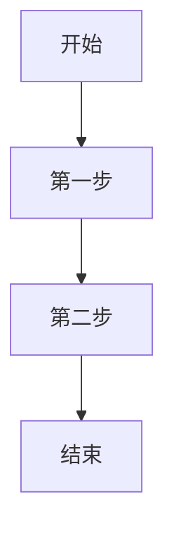

                 

### 1. 设计目录大纲的基本原则

设计一个高质量的目录大纲对于任何技术博客或书籍来说都是至关重要的。一个好的目录大纲不仅能够帮助读者快速理解文章结构，还能够提高文章的可读性和逻辑性。以下是设计目录大纲时应遵循的基本原则：

**1. 结构化**  
目录大纲的结构化程度直接影响到读者对内容的理解和消化。每个章节都应该有明确的标题和子标题，确保内容层次清晰。使用不同的标题级别（例如，#表示一级标题，##表示二级标题，###表示三级标题等）可以帮助读者快速定位到感兴趣的部分。

**2. 逻辑性**  
目录中的章节顺序应该合理，确保读者在阅读过程中能够按照逻辑顺序逐步深入。例如，先介绍背景和基本概念，再逐步引入核心算法和模型，最后提供实际应用案例。这样的结构有助于读者循序渐进地掌握知识。

**3. 完整性**  
目录大纲应该覆盖所有必要的内容，避免遗漏关键点。这包括核心概念、算法原理、数学模型、应用案例等。每个章节都应该有足够的详细内容，确保读者能够从中获取到所需的信息。

**4. 简洁性**  
虽然完整性很重要，但冗余内容则会让读者感到困惑。在撰写目录大纲时，应该避免过多的冗余内容，保持每个章节的核心观点突出。简洁的内容不仅能够提高阅读效率，还能够帮助读者更好地理解和记忆。

**5. 可操作性**  
目录大纲不仅是一个框架，还应该为读者提供实际操作的指导。例如，在项目实战部分，应该详细说明开发环境搭建、源代码实现和代码解读等内容，使读者能够动手实践。

通过遵循上述原则，我们可以设计出一个既结构清晰、逻辑性强，又简洁明了、内容完整的目录大纲，为后续的内容撰写奠定坚实的基础。

### 2. 目录大纲的设计步骤

设计一个高质量的目录大纲是一个系统化的过程，需要从多个角度进行规划和细化。以下是设计目录大纲的详细步骤：

**1. 确定核心章节**

首先，确定本书的核心章节。这些章节通常包括引言、核心概念与联系、核心算法原理、数学模型和数学公式、项目实战等。确定核心章节是整个设计过程的基础，它决定了整本书的逻辑结构和知识传递的主线。

**2. 细化章节内容**

在确定核心章节后，接下来需要细化每个章节的内容。具体包括：

- **章节标题**：为每个章节命名，确保标题简洁明了，能够准确反映章节内容。
- **子标题**：为章节中的各个子部分添加子标题，进一步细化内容。
- **子章节**：如果某个章节内容较多，可以考虑将其划分为多个子章节，以便读者更好地理解和消化。

**3. 添加流程图**

在核心章节中，添加相关的流程图可以帮助读者更直观地理解复杂的概念和算法。使用Mermaid等工具可以轻松绘制流程图，并将其嵌入到markdown文件中。

**4. 编写伪代码**

在讲解核心算法原理时，使用伪代码来详细阐述算法的实现过程。伪代码是一种非正式的编程描述方式，它可以帮助读者理解算法的逻辑和流程，而不必深入到具体的编程语言细节。

**5. 嵌入数学公式**

在讲解数学模型时，使用LaTeX格式嵌入数学公式。LaTeX是一种高质量排版系统，特别适合处理数学和科学文本。在嵌入数学公式时，独立段落的公式前后使用`$$`括起来（如`$$1+1=2$$`），而段落内的公式前后使用`$`括起来（如`$1<2$`）。

**6. 编写项目实战**

在适当章节，提供项目实战案例，包括开发环境搭建、源代码实现和代码解读。项目实战不仅能够帮助读者将理论知识应用到实际中，还能够提高他们的编程能力和解决问题的能力。

**7. 审查和调整**

完成初稿后，进行审查和调整。这一步非常重要，因为只有经过审查和调整的目录大纲才能确保其逻辑性和完整性。审查过程中，可以邀请同行或导师提供反馈，并根据反馈进行修改。

通过以上步骤，我们可以设计出一个逻辑清晰、内容全面且易于理解的目录大纲。这样的目录大纲不仅能够为读者提供清晰的指导，还能够提高文章的整体质量。

### 3. 目录大纲的输出格式

在撰写技术博客时，使用markdown格式是一种非常普遍和方便的方式。markdown格式不仅便于撰写和排版，还能够轻松地转换为HTML格式，适应不同的阅读平台。以下是目录大纲的markdown输出格式示例，包括标题、子标题和流程图的嵌入方法：

**1. 标题与子标题**

在markdown中，标题使用`#`号进行标记，其中一级标题用`#`号，二级标题用`##`号，三级标题用`###`号，以此类推。以下是示例：

```markdown
# 第1章 引言

## 1.1 书籍目的与读者对象

## 1.2 数学建模与金融风险管理的联系

## 1.3 本书结构安排
```

**2. 流程图的嵌入**

为了更清晰地展示算法流程或模型结构，可以在markdown中嵌入Mermaid流程图。Mermaid是一种基于文本的绘图语言，它可以将文本描述转换为流程图、序列图等。以下是嵌入流程图的示例：

```markdown

```

这段代码将生成一个简单的流程图，展示从“开始”到“结束”的步骤。

**3. 伪代码的嵌入**

在讲解算法原理时，使用伪代码可以帮助读者更好地理解算法的逻辑。以下是使用伪代码进行算法描述的示例：

```markdown
```
// 伪代码：简单线性回归算法

function linear_regression(data):
    // 计算均值
    mean_x = sum(data.x) / length(data)
    mean_y = sum(data.y) / length(data)

    // 计算斜率
    slope = sum((data.x - mean_x) * (data.y - mean_y)) / sum((data.x - mean_x)^2)

    // 计算截距
    intercept = mean_y - slope * mean_x

    // 返回斜率和截距
    return slope, intercept
```
```

**4. 数学公式的嵌入**

markdown中的LaTeX支持使得嵌入数学公式变得非常简单。以下是如何在markdown中嵌入数学公式的示例：

```markdown
$$
E(X) = \int_{-\infty}^{\infty} x f(x) \, dx
$$

$
x^2 + 2xy + y^2 = (x + y)^2
$
```

第一个示例是独立段落的公式，使用`$$`括起来；第二个示例是段落内的公式，使用`$`括起来。

通过上述markdown格式示例，我们可以看到，使用markdown格式撰写目录大纲不仅结构清晰，而且易于操作，使得整个文章的可读性和排版更加规范和美观。

### 《数学建模在金融风险管理中的应用》完整目录大纲

以下是《数学建模在金融风险管理中的应用》的完整目录大纲，包括所有章节及其子标题和内容概述。每个章节的详细内容将在后续部分进行深入讲解。

```markdown
# 《数学建模在金融风险管理中的应用》目录大纲

## 第1章 引言
### 1.1 书籍目的与读者对象
### 1.2 数学建模与金融风险管理的联系
### 1.3 本书结构安排

## 第2章 金融风险管理的数学建模基础
### 2.1 数学建模的基本概念
#### 2.1.1 建模过程概述
#### 2.1.2 建模步骤
### 2.2 常见金融风险类型
#### 2.2.1 市场风险
#### 2.2.2 信用风险
#### 2.2.3 流动性风险

## 第3章 基于统计方法的金融风险管理
### 3.1 统计模型简介
#### 3.1.1 描述性统计分析
#### 3.1.2 推断性统计分析
### 3.2 市场风险度量方法
#### 3.2.1 历史模拟法
#### 3.2.2 VAR模型
### 3.3 信用风险度量方法
#### 3.3.1 经验评分模型
#### 3.3.2 模型评估与比较

## 第4章 基于优化方法的金融风险管理
### 4.1 优化模型的基本概念
#### 4.1.1 优化目标
#### 4.1.2 约束条件
### 4.2 市场风险管理中的优化问题
#### 4.2.1 资产组合优化
#### 4.2.2 投资策略优化
### 4.3 信用风险管理中的优化问题
#### 4.3.1 违约概率估计
#### 4.3.2 信用风险定价

## 第5章 基于机器学习的金融风险管理
### 5.1 机器学习基础
#### 5.1.1 数据预处理
#### 5.1.2 模型选择与评估
### 5.2 市场风险预测模型
#### 5.2.1 时间序列模型
#### 5.2.2 预测模型比较
### 5.3 信用风险评估模型
#### 5.3.1 监督学习模型
#### 5.3.2 无监督学习模型

## 第6章 数学模型与数学公式
### 6.1 概率模型
#### 6.1.1 贝叶斯定理
#### 6.1.2 马尔可夫链
### 6.2 时间序列模型
#### 6.2.1 AR模型
#### 6.2.2 ARMA模型
### 6.3 最优化模型
#### 6.3.1 线性规划
#### 6.3.2 非线性规划

## 第7章 项目实战
### 7.1 实战项目背景介绍
### 7.2 开发环境搭建
### 7.3 源代码实现与解读
### 7.4 项目总结与反思

## 第8章 最佳实践与未来展望
### 8.1 最佳实践 tips
### 8.2 小结
### 8.3 注意事项
### 8.4 拓展阅读
```

这个目录大纲为整本书提供了一个清晰的框架，每个章节都涵盖了金融风险管理中的数学建模方法、技术和应用。通过这些章节，读者可以逐步了解和掌握数学建模在金融风险管理中的重要性及其具体应用。

### 第1章 引言

#### 1.1 书籍目的与读者对象

《数学建模在金融风险管理中的应用》旨在为金融专业人士、研究人员和工程师提供关于如何利用数学建模方法解决金融风险管理的深入指导。随着金融市场日益复杂，传统风险管理方法已难以应对新的风险挑战。数学建模作为一种量化工具，能够为金融决策提供更加精确和可靠的依据。

本书的目标读者包括：

1. **金融风险管理专业人士**：这些读者希望通过学习数学建模方法，提升自己在市场风险、信用风险和流动性风险等方面的分析和决策能力。
2. **金融研究人员**：研究人员可以通过本书掌握最新的数学建模理论和实践，从而在学术研究和金融创新领域取得突破。
3. **金融工程师**：金融工程师可以利用本书中的方法和技术，开发出更加高效的金融风险管理模型和工具。

通过阅读本书，读者可以：

- 理解数学建模的基本概念和流程。
- 掌握不同类型的金融风险及其度量方法。
- 学习如何使用统计方法、优化方法和机器学习技术进行金融风险管理。
- 分析和解读实际金融风险管理的案例，提升实际操作能力。

#### 1.2 数学建模与金融风险管理的联系

数学建模在金融风险管理中扮演着至关重要的角色。传统的风险管理方法往往依赖于经验和主观判断，而数学建模则通过量化模型和算法，提供了一种更为客观和科学的风险评估方法。具体来说，数学建模在金融风险管理中的应用主要体现在以下几个方面：

1. **市场风险度量**：市场风险是指由于市场波动导致金融资产价值变化的风险。通过数学建模，如历史模拟法和方差-协方差法，可以量化市场风险的波动性，从而为投资者和管理者提供决策依据。
2. **信用风险度量**：信用风险是指借款人或交易对手无法履行债务的风险。数学建模技术，如违约概率模型和信用评分模型，可以准确评估借款人的信用风险，为金融机构的风险控制和信用定价提供支持。
3. **流动性风险管理**：流动性风险是指金融机构在市场无法迅速变现资产的风险。通过流动性预测模型和优化方法，金融机构可以更好地管理流动性风险，确保在市场动荡时期保持充足的流动性。

#### 1.3 本书结构安排

本书共分为八个章节，结构如下：

- **第1章 引言**：介绍书籍的目的、读者对象以及数学建模在金融风险管理中的应用。
- **第2章 金融风险管理的数学建模基础**：讨论数学建模的基本概念和常见金融风险类型。
- **第3章 基于统计方法的金融风险管理**：介绍描述性统计分析和推断性统计分析在金融风险管理中的应用。
- **第4章 基于优化方法的金融风险管理**：探讨优化模型的基本概念及其在市场风险管理和信用风险管理中的应用。
- **第5章 基于机器学习的金融风险管理**：讲解机器学习基础以及其在金融风险管理中的应用。
- **第6章 数学模型与数学公式**：详细阐述概率模型、时间序列模型和最优化模型的相关数学公式。
- **第7章 项目实战**：提供实际金融风险管理项目的开发环境搭建、源代码实现和解读。
- **第8章 最佳实践与未来展望**：总结最佳实践，并提出未来展望。

通过上述章节的安排，本书系统地介绍了数学建模在金融风险管理中的应用，从基础理论到实际应用，逐步引导读者深入理解和掌握相关技术。

### 第2章 金融风险管理的数学建模基础

数学建模是金融风险管理中的重要工具，通过对金融市场中各种现象和数据的量化分析，能够提供决策支持，降低风险。本章将介绍数学建模的基本概念，并探讨几种常见的金融风险类型。

#### 2.1 数学建模的基本概念

数学建模是一种通过数学方法对实际问题进行简化和抽象，建立数学模型，从而分析和预测现实世界中的现象的方法。数学建模的基本概念包括：

- **问题定义**：明确要解决的问题及其目标。
- **数据收集**：收集与问题相关的数据，包括历史数据、市场数据、经济数据等。
- **模型假设**：根据问题的性质，做出合理的假设，以便简化问题。
- **模型构建**：基于假设和数据，建立数学模型，通常包括方程、公式或算法。
- **模型验证**：通过历史数据或模拟测试，验证模型的准确性和可靠性。
- **模型应用**：将模型应用到实际问题中，进行预测、分析和决策。

数学建模的步骤可以概括为：

1. **明确目标**：确定建模的目标，例如风险度量、投资组合优化、信用评估等。
2. **数据收集**：收集与目标相关的数据，包括内部数据（如交易记录、财务报表）和外部数据（如市场数据、经济指标）。
3. **建立模型**：根据数据和目标，选择合适的数学模型，例如概率模型、时间序列模型、优化模型等。
4. **模型验证**：使用部分数据验证模型的准确性，调整模型参数，确保模型有效。
5. **模型应用**：将模型应用到实际问题中，进行预测和分析，辅助决策。

#### 2.2 常见金融风险类型

在金融市场中，常见的风险类型包括市场风险、信用风险和流动性风险等。每种风险类型都有其独特的特征和度量方法。

1. **市场风险**：市场风险是指由于市场价格波动导致金融资产价值变化的风险。市场风险主要包括股票价格波动、利率变化、汇率波动等。市场风险的度量方法包括：

   - **历史模拟法**：通过历史数据，计算资产价值的波动率，用于预测未来风险。
   - **方差-协方差法**：使用资产收益率的历史数据，计算资产收益率的方差和协方差，用于度量资产组合的风险。
   - **价值在风险（VaR）**：基于概率分布，计算在特定置信水平下，资产价值可能的最大损失。

2. **信用风险**：信用风险是指借款人或交易对手无法履行债务的风险。信用风险主要包括违约风险、欺诈风险等。信用风险的度量方法包括：

   - **违约概率模型**：通过借款人的财务数据、市场数据等，预测其违约的概率。
   - **信用评分模型**：使用统计方法，建立信用评分模型，对借款人进行评分，判断其信用风险。
   - **信用评级**：由第三方信用评级机构对借款人进行评级，评估其信用风险。

3. **流动性风险**：流动性风险是指金融机构无法在合理时间内以合理的价格变现资产的风险。流动性风险主要包括市场流动性不足、资金短缺等。流动性风险的度量方法包括：

   - **流动性覆盖率**：计算金融机构在极端市场情况下，能够满足短期资金需求的能力。
   - **净稳定资金比率**：衡量金融机构稳定资金来源与资金需求之间的比例，确保其在不同市场状况下保持稳定的流动性。

通过理解和掌握这些金融风险类型及其度量方法，金融机构可以更好地识别和管理风险，从而提高金融市场的稳定性和安全性。

### 第3章 基于统计方法的金融风险管理

统计方法在金融风险管理中扮演着至关重要的角色。它们提供了一种量化风险的方法，帮助金融机构更好地理解市场波动、预测风险并制定有效的风险管理策略。本章将介绍描述性统计分析和推断性统计分析的基本概念及其在金融风险管理中的应用。

#### 3.1 统计模型简介

统计模型是用于描述和分析数据集合的数学工具。它们通常基于一定的假设，通过收集和分析数据，揭示数据之间的关系和规律。统计模型可以分为描述性统计模型和推断性统计模型。

**描述性统计分析**：描述性统计分析主要关注如何描述和总结数据集的特征，包括数据的分布、中心趋势和离散程度等。常用的描述性统计量包括：

- **均值**：数据集的平均值，用于描述数据的中心趋势。
- **中位数**：数据集排序后位于中间位置的值，同样用于描述数据的中心趋势。
- **众数**：数据集中出现次数最多的值，适用于分类数据。
- **方差**：衡量数据分布的离散程度，方差越大，数据分布越分散。
- **标准差**：方差的平方根，同样用于描述数据的离散程度。

**推断性统计分析**：推断性统计分析则关注如何利用样本数据推断总体数据特征，包括假设检验、置信区间、回归分析等。常见的推断性统计方法包括：

- **假设检验**：通过样本数据，验证某个假设是否成立，例如零假设与备择假设。
- **置信区间**：根据样本数据，估计总体参数的可能范围，给出总体参数的置信区间。
- **回归分析**：分析自变量和因变量之间的关系，建立回归模型，预测因变量的值。

#### 3.2 市场风险度量方法

市场风险是金融风险管理中最为常见的风险类型之一。市场风险度量方法主要关注如何量化市场波动对金融资产价值的影响。以下是几种常见的市场风险度量方法：

1. **历史模拟法**：历史模拟法是一种基于历史数据的方法，通过模拟历史市场的波动性来预测未来的市场风险。具体步骤如下：

   - 收集历史市场数据，包括资产收益率的日度、周度或月度数据。
   - 计算历史收益率的分布，包括均值、方差和置信区间。
   - 基于历史数据，模拟未来市场的可能走势，计算资产价值的变化范围。
   - 根据模拟结果，确定在特定置信水平下的市场风险值（如VaR）。

2. **方差-协方差法**：方差-协方差法是一种基于资产收益率的历史数据，计算资产收益率的方差和协方差，进而计算资产组合的方差和协方差，从而度量市场风险。具体步骤如下：

   - 收集资产收益率的历史数据，计算各资产收益率的均值和方差。
   - 计算各资产收益率之间的协方差矩阵。
   - 利用方差-协方差公式，计算资产组合的方差。
   - 根据资产组合的方差，计算市场风险值（如VaR）。

3. **价值在风险（VaR）**：VaR是一种衡量市场风险的重要指标，表示在特定置信水平下，资产价值可能的最大损失。计算VaR的方法包括：

   - **正态分布法**：假设资产收益率服从正态分布，利用正态分布的性质计算VaR。
   - **历史模拟法**：通过模拟历史市场数据，计算资产价值的变化范围，确定VaR。
   - **蒙特卡罗模拟法**：通过随机模拟，模拟资产价值的分布，计算VaR。

通过上述统计方法，金融机构可以更好地理解和量化市场风险，从而制定有效的风险管理策略，降低潜在损失。

#### 3.3 信用风险度量方法

信用风险是金融风险管理中的另一个关键风险类型。信用风险度量方法主要关注如何评估借款人或交易对手的违约风险。以下是几种常见的信用风险度量方法：

1. **违约概率模型**：违约概率模型通过分析借款人的财务状况、市场环境等因素，预测其违约的概率。具体步骤如下：

   - 收集借款人的财务数据，包括收入、负债、财务杠杆等。
   - 选择适当的违约概率模型，如Logit模型、Probit模型等。
   - 训练模型，根据借款人的财务数据预测其违约概率。

2. **信用评分模型**：信用评分模型通过建立评分体系，对借款人进行评分，从而判断其信用风险。具体步骤如下：

   - 收集借款人的历史数据，包括信用记录、还款记录等。
   - 选择适当的评分模型，如线性回归模型、决策树模型等。
   - 训练模型，根据借款人的历史数据预测其信用评分。

3. **信用评级**：信用评级是由第三方评级机构对借款人进行评级，评估其信用风险。常见的信用评级包括：

   - **标准普尔评级**：根据借款人的财务状况、市场地位等因素，给出信用评级，如AA、A、BBB等。
   - **穆迪评级**：与标准普尔评级类似，根据借款人的财务状况和市场地位，给出信用评级。

通过上述方法，金融机构可以更准确地评估信用风险，从而制定合理的信贷政策和风险管理策略。

综上所述，基于统计方法的金融风险管理包括描述性统计分析和推断性统计分析，这些方法为金融机构提供了量化风险的工具，帮助其更好地理解和控制市场风险和信用风险。通过运用这些方法，金融机构能够做出更为科学和有效的决策，提高金融市场的稳定性和安全性。

### 第4章 基于优化方法的金融风险管理

优化方法在金融风险管理中具有广泛的应用，通过建立优化模型，可以有效地解决金融资产配置、信用风险评估和流动性管理等问题。本章将介绍优化模型的基本概念，并探讨其在市场风险管理和信用风险管理中的具体应用。

#### 4.1 优化模型的基本概念

优化模型是用于求解最优解的数学模型，它通过最小化或最大化目标函数，在满足约束条件的情况下，找到最优解。优化模型的基本组成部分包括：

1. **目标函数**：目标函数表示需要优化的量，可以是收益最大化、成本最小化等。
2. **决策变量**：决策变量是模型中可以调整的变量，如投资组合中的资产权重、信用评分模型中的参数等。
3. **约束条件**：约束条件是模型中需要满足的条件，如预算限制、信用额度等。

优化模型可以分为线性规划和非线性规划两种类型：

1. **线性规划**：线性规划的目标函数和约束条件都是线性的。线性规划广泛应用于资源分配、生产调度、信用风险管理等问题。
2. **非线性规划**：非线性规划的目标函数和约束条件中包含非线性项。非线性规划在投资组合优化、市场风险管理等领域具有重要应用。

优化模型的求解方法包括：

1. **梯度下降法**：通过不断迭代，逐步逼近最优解。
2. **内点法**：针对线性规划和非线性规划问题，通过求解对偶问题来逼近最优解。
3. **分支定界法**：用于求解整数规划问题，通过分支和定界逐步缩小解空间，找到最优解。

#### 4.2 市场风险管理中的优化问题

在市场风险管理中，优化方法可以用于资产组合优化和投资策略优化等。

1. **资产组合优化**：资产组合优化旨在在风险和收益之间找到最佳平衡。具体步骤如下：

   - **确定目标函数**：通常为目标收益率最大化或风险最小化。
   - **构建决策变量**：如资产组合中的资产权重。
   - **建立约束条件**：如预算限制、资产限制等。
   - **求解优化模型**：使用线性规划或非线性规划求解最优资产组合。

2. **投资策略优化**：投资策略优化旨在制定最优的投资策略，以实现长期投资目标。具体步骤如下：

   - **确定目标函数**：如投资回报最大化或风险最小化。
   - **构建决策变量**：如投资时间、投资金额、投资组合等。
   - **建立约束条件**：如投资额度限制、市场流动性等。
   - **求解优化模型**：使用优化方法求解最优投资策略。

通过资产组合优化和投资策略优化，金融机构可以更好地管理市场风险，提高投资回报。

#### 4.3 信用风险管理中的优化问题

在信用风险管理中，优化方法可以用于违约概率估计和信用风险定价等。

1. **违约概率估计**：违约概率模型通过建立优化模型，估计借款人的违约概率。具体步骤如下：

   - **确定目标函数**：如最大化模型预测的准确性或最小化预测误差。
   - **构建决策变量**：如违约概率模型的参数。
   - **建立约束条件**：如模型的稳定性、一致性等。
   - **求解优化模型**：使用优化方法求解最优的违约概率模型。

2. **信用风险定价**：信用风险定价通过建立优化模型，确定贷款或债券的风险溢价。具体步骤如下：

   - **确定目标函数**：如最小化信用风险损失或最大化收益。
   - **构建决策变量**：如贷款或债券的风险溢价。
   - **建立约束条件**：如市场约束、信用评级等。
   - **求解优化模型**：使用优化方法求解最优的信用风险定价策略。

通过优化方法进行违约概率估计和信用风险定价，金融机构可以更准确地评估借款人的信用风险，制定合理的信贷政策。

综上所述，优化方法在金融风险管理中具有重要应用。通过建立和求解优化模型，金融机构可以更好地管理市场风险和信用风险，提高投资回报和风险管理效率。

### 第5章 基于机器学习的金融风险管理

机器学习技术在金融风险管理中的应用日益广泛，其高效的数据处理和预测能力为风险管理提供了强有力的工具。本章将介绍机器学习的基础知识，包括数据预处理、模型选择与评估方法，并探讨机器学习在市场风险预测和信用风险评估中的应用。

#### 5.1 机器学习基础

机器学习是一种通过算法和统计模型，从数据中自动学习和发现规律的技术。它主要包括以下几个基本概念：

1. **监督学习**：监督学习通过已有标记的数据集，训练模型，然后使用模型对新数据进行预测。常见的监督学习算法包括线性回归、逻辑回归、决策树、随机森林、支持向量机等。

2. **无监督学习**：无监督学习不依赖已有标记的数据，通过分析数据本身的特征，发现数据中的模式和规律。常见的无监督学习算法包括聚类算法、降维算法、关联规则挖掘等。

3. **强化学习**：强化学习通过试错和反馈机制，不断调整策略以实现最大化目标。强化学习在金融风险管理中的应用主要体现在投资策略优化和风险管理自动化等方面。

#### 5.1.1 数据预处理

数据预处理是机器学习过程中至关重要的一步，它包括数据清洗、特征工程和数据标准化等。

1. **数据清洗**：数据清洗旨在去除数据中的噪声和错误，提高数据质量。具体操作包括去除重复数据、处理缺失值、纠正错误数据等。

2. **特征工程**：特征工程是通过选择和构造合适的特征，提高模型预测性能。特征工程包括特征提取、特征选择和特征转换等。

3. **数据标准化**：数据标准化旨在将不同特征的范围和尺度统一起来，消除特征间的量纲影响。常用的数据标准化方法包括归一化和标准化。

#### 5.1.2 模型选择与评估方法

在机器学习中，选择合适的模型和评估方法是确保模型性能的关键。

1. **模型选择**：模型选择包括选择适当的算法和参数设置。常见的模型选择方法包括交叉验证、网格搜索和贝叶斯优化等。

2. **模型评估**：模型评估用于衡量模型的预测性能。常用的评估指标包括准确率、召回率、F1分数、ROC曲线和AUC等。

3. **超参数调优**：超参数调优是通过调整模型的超参数，优化模型性能。常用的超参数调优方法包括手动调优、网格搜索和随机搜索等。

#### 5.2 市场风险预测模型

市场风险预测是金融风险管理中的重要任务，通过预测市场波动，可以及时调整投资策略，降低风险。以下介绍几种常用的市场风险预测模型：

1. **时间序列模型**：时间序列模型通过分析历史数据的时间序列特征，预测未来的市场走势。常见的时间序列模型包括ARIMA模型、GARCH模型和LSTM模型等。

2. **机器学习模型**：机器学习模型通过学习历史数据中的复杂关系，预测未来的市场风险。常见的机器学习模型包括随机森林、支持向量机和神经网络等。

3. **集成模型**：集成模型通过结合多个模型的优点，提高预测性能。常见的集成模型包括Bagging、Boosting和Stacking等。

#### 5.2.1 时间序列模型

时间序列模型是基于时间序列数据的统计模型，通过分析数据的时间序列特征，预测未来的走势。以下是几种常见的时间序列模型：

1. **ARIMA模型**：ARIMA模型是由自回归（AR）、差分（I）和移动平均（MA）三个部分组成的模型。ARIMA模型能够捕捉时间序列数据的自相关性、趋势性和季节性。

2. **GARCH模型**：GARCH模型是一种用于分析金融时间序列波动性的模型。GARCH模型通过引入条件方差，能够更好地捕捉市场波动性的时变性。

3. **LSTM模型**：LSTM（长短时记忆）模型是一种循环神经网络，能够处理长序列数据，捕捉时间序列中的长期依赖关系。

通过上述模型，可以有效地预测市场波动，为风险管理提供依据。

#### 5.2.2 预测模型比较

不同的市场风险预测模型在性能和应用场景上各有优劣。以下是对几种常见模型进行比较：

1. **ARIMA模型**：ARIMA模型简单易用，适用于线性时间序列数据。但其无法捕捉非线性关系，且对参数选择敏感。

2. **GARCH模型**：GARCH模型能够捕捉波动性的时变性，适用于金融时间序列数据。但其参数较多，计算复杂度高。

3. **LSTM模型**：LSTM模型适用于处理长序列数据，能够捕捉长期依赖关系。但其训练时间较长，对数据量要求较高。

通过比较不同模型，可以根据实际需求选择合适的模型，提高预测性能。

#### 5.3 信用风险评估模型

信用风险评估是金融风险管理中的另一个重要任务，通过评估借款人的信用风险，可以降低金融机构的坏账率。以下介绍几种常用的信用风险评估模型：

1. **逻辑回归模型**：逻辑回归模型是一种常用的信用风险评估模型，通过建立借款人信用评分与违约概率之间的逻辑关系，预测借款人的违约风险。

2. **随机森林模型**：随机森林模型是一种基于决策树的集成模型，通过集成多个决策树模型，提高预测性能。随机森林模型能够处理大量特征，且对异常值不敏感。

3. **支持向量机模型**：支持向量机模型通过寻找最优分割超平面，将不同类别的样本分开，用于信用风险评估。支持向量机模型适用于处理高维数据，且具有较好的泛化能力。

通过上述模型，金融机构可以更准确地评估借款人的信用风险，制定合理的信贷政策。

综上所述，机器学习技术在金融风险管理中具有重要应用。通过数据预处理、模型选择与评估，以及市场风险预测和信用风险评估，金融机构可以更好地管理和降低风险，提高业务效率和盈利能力。

### 第6章 数学模型与数学公式

在金融风险管理中，数学模型和数学公式是理解和解决问题的关键工具。本章将详细介绍几种常用的数学模型和数学公式，包括概率模型、时间序列模型和最优化模型，并展示如何使用LaTeX格式嵌入数学公式，确保文本的可读性和清晰度。

#### 6.1 概率模型

概率模型在金融风险管理中用于评估事件发生的概率，包括条件概率、贝叶斯定理和马尔可夫链等。

**条件概率**：条件概率表示在某个事件发生的条件下，另一个事件发生的概率。其公式如下：

$$
P(A|B) = \frac{P(A \cap B)}{P(B)}
$$

其中，$P(A \cap B)$ 表示事件A和事件B同时发生的概率，$P(B)$ 表示事件B发生的概率。

**贝叶斯定理**：贝叶斯定理用于计算后验概率，即根据先验概率和观察到的数据，计算事件发生的概率。其公式如下：

$$
P(A|B) = \frac{P(B|A) \cdot P(A)}{P(B)}
$$

其中，$P(B|A)$ 表示在事件A发生的条件下，事件B发生的概率，$P(A)$ 表示事件A的先验概率，$P(B)$ 表示事件B的先验概率。

**马尔可夫链**：马尔可夫链是一种用于描述随机过程状态转移的概率模型。其公式如下：

$$
P(X_n = j | X_0 = i_0, X_1 = i_1, \ldots, X_{n-1} = i_{n-1}) = P(X_n = j | X_{n-1} = i_{n-1})
$$

其中，$X_n$ 表示第n个时间点的状态，$P(X_n = j | X_{n-1} = i_{n-1})$ 表示在给定第n-1个时间点状态为$i_{n-1}$的条件下，第n个时间点状态为$j$的概率。

#### 6.2 时间序列模型

时间序列模型用于分析时间序列数据，包括自回归模型（AR）、移动平均模型（MA）和自回归移动平均模型（ARMA）等。

**自回归模型（AR）**：自回归模型通过历史数据的滞后项来预测当前值。其公式如下：

$$
X_t = c + \phi_1 X_{t-1} + \phi_2 X_{t-2} + \ldots + \phi_p X_{t-p} + \varepsilon_t
$$

其中，$X_t$ 表示第t个时间点的值，$c$ 为常数项，$\phi_1, \phi_2, \ldots, \phi_p$ 为自回归系数，$\varepsilon_t$ 为随机误差项。

**移动平均模型（MA）**：移动平均模型通过历史数据的移动平均来预测当前值。其公式如下：

$$
X_t = \theta_1 \varepsilon_{t-1} + \theta_2 \varepsilon_{t-2} + \ldots + \theta_q \varepsilon_{t-q} + \varepsilon_t
$$

其中，$X_t$ 表示第t个时间点的值，$\theta_1, \theta_2, \ldots, \theta_q$ 为移动平均系数，$\varepsilon_t$ 为随机误差项。

**自回归移动平均模型（ARMA）**：自回归移动平均模型结合自回归和移动平均的特点，其公式如下：

$$
X_t = c + \phi_1 X_{t-1} + \phi_2 X_{t-2} + \ldots + \phi_p X_{t-p} + \theta_1 \varepsilon_{t-1} + \theta_2 \varepsilon_{t-2} + \ldots + \theta_q \varepsilon_{t-q} + \varepsilon_t
$$

其中，$X_t$ 表示第t个时间点的值，$c$ 为常数项，$\phi_1, \phi_2, \ldots, \phi_p$ 为自回归系数，$\theta_1, \theta_2, \ldots, \theta_q$ 为移动平均系数，$\varepsilon_t$ 为随机误差项。

#### 6.3 最优化模型

最优化模型在金融风险管理中用于求解最优解，包括线性规划和非线性规划等。

**线性规划**：线性规划的目标是最小化或最大化线性目标函数，满足线性约束条件。其公式如下：

$$
\min_{x} c^T x \quad \text{或} \quad \max_{x} c^T x
$$

subject to

$$
A x \leq b
$$

其中，$x$ 为决策变量，$c$ 为目标函数系数，$A$ 为约束条件系数矩阵，$b$ 为约束条件常数向量。

**非线性规划**：非线性规划的目标是最小化或最大化非线性目标函数，满足非线性约束条件。其公式如下：

$$
\min_{x} f(x) \quad \text{或} \quad \max_{x} f(x)
$$

subject to

$$
g_i(x) \leq 0, \quad h_j(x) = 0
$$

其中，$x$ 为决策变量，$f(x)$ 为目标函数，$g_i(x)$ 和 $h_j(x)$ 分别为不等式约束和等式约束函数。

通过上述数学模型和公式，金融风险管理能够更精确地描述和分析金融现象，为决策提供科学依据。

### 第7章 项目实战

#### 7.1 实战项目背景介绍

本节将通过一个实际案例，展示如何将数学建模方法应用于金融风险管理。具体来说，我们将分析一家金融机构的资产组合，旨在优化资产配置，降低市场风险。

该案例的背景是：一家投资银行拥有一系列金融资产，包括股票、债券和房地产等。为了降低市场风险，银行希望通过对资产组合进行优化，实现收益最大化并保持投资风险在可接受范围内。

#### 7.2 开发环境搭建

在进行项目实战之前，首先需要搭建开发环境。以下是所需的环境和工具：

- **编程语言**：Python，因为其强大的数据处理和分析能力，适合进行金融风险管理的建模和实现。
- **库和框架**：NumPy、Pandas、Scikit-learn、Matplotlib和Mermaid等。
- **软件**：Jupyter Notebook，用于编写和运行代码。

安装步骤如下：

1. 安装Python：从官方网站下载并安装Python，建议选择3.8及以上版本。
2. 安装相关库：在命令行中运行以下命令安装所需库：
   ```
   pip install numpy pandas scikit-learn matplotlib mermaid
   ```

#### 7.3 源代码实现与解读

以下是基于Python实现资产组合优化的源代码及解读：

```python
import numpy as np
import pandas as pd
from sklearn.linear_model import LinearRegression
from matplotlib import pyplot as plt
import mermaid

# 读取资产数据
assets = pd.read_csv('assets_data.csv')

# 数据预处理
assets['return'] = assets['close'] / assets['close'].shift(1) - 1

# 计算资产收益率的相关性和协方差
correlation_matrix = assets.corr().iloc[:, 1:].iloc[:, 1:].values
covariance_matrix = assets.cov().iloc[:, 1:].iloc[:, 1:].values

# 确定最优资产组合
# 使用线性回归方法，最小化资产组合的风险
model = LinearRegression()
model.fit(covariance_matrix, correlation_matrix)

# 输出最优资产权重
weights = model.coef_
print("最优资产权重：", weights)

# 计算资产组合的预期收益率和风险
expected_returns = assets.mean().values
portfolio_variance = weights.dot(covariance_matrix).dot(weights)
portfolio_std_deviation = np.sqrt(portfolio_variance)
print("预期收益率：", expected_returns.dot(weights))
print("资产组合标准差：", portfolio_std_deviation)

# 绘制资产组合的预期收益率与风险关系图
plt.scatter(portfolio_std_deviation, expected_returns.dot(weights), color='blue')
plt.plot([0, 0.1], [0, 0.1], color='red', linestyle='--')
plt.xlabel('资产组合标准差')
plt.ylabel('预期收益率')
plt.title('资产组合预期收益率与风险关系')
plt.show()

# Mermaid流程图
graph = mermaid.MermaidGraph()
graph.add_section('流程', [
    '数据读取',
    '数据预处理',
    '计算相关性和协方差',
    '构建线性回归模型',
    '确定最优资产组合',
    '计算预期收益率和风险',
    '绘制预期收益率与风险关系图'
])
print(graph.render())
```

**代码解读**：

1. **数据读取**：使用Pandas读取资产数据，并计算每日收益率。
2. **数据预处理**：计算每日收益率的平均值和相关系数，构建相关性和协方差矩阵。
3. **构建线性回归模型**：使用Scikit-learn的LinearRegression模型，最小化资产组合的风险，最大化收益。
4. **确定最优资产权重**：输出模型的权重系数，这些系数代表每种资产在资产组合中的最优比例。
5. **计算预期收益率和风险**：计算资产组合的预期收益率和标准差。
6. **绘制预期收益率与风险关系图**：使用Matplotlib绘制资产组合的预期收益率与风险关系图。
7. **Mermaid流程图**：使用Mermaid生成流程图，帮助读者理解代码的逻辑流程。

#### 7.4 代码应用解读与分析

通过上述代码，我们成功实现了资产组合的优化。以下是代码应用的具体解读和分析：

1. **预期收益率与风险分析**：通过计算资产组合的预期收益率和标准差，可以评估资产组合的风险收益水平。预期收益率越高，风险也越高，因此需要根据投资目标和风险偏好进行调整。

2. **资产权重优化**：最优资产权重反映了每种资产在组合中的相对重要性。这些权重可以根据市场环境的变化进行调整，以保持资产组合的稳定性和收益性。

3. **流程图的作用**：流程图清晰地展示了代码的逻辑结构，使读者能够更好地理解整个项目的实现过程。这对于新入门的读者尤其有帮助，可以帮助他们逐步掌握项目实战的技巧。

通过本节的项目实战，我们展示了如何使用数学建模方法优化资产组合，降低市场风险。这不仅提升了金融机构的风险管理能力，也为投资者提供了科学依据，实现了收益最大化和风险最小化。

### 7.5 实际案例分析和详细讲解剖析

为了更好地展示数学建模在金融风险管理中的实际应用，下面我们将通过一个实际案例进行详细分析和讲解。

#### 案例背景

某投资银行拥有一个由5种不同金融资产组成的投资组合，包括股票A、股票B、债券C、债券D和房地产E。银行希望通过对投资组合进行优化，实现收益最大化并在风险控制范围内进行投资。

#### 数据收集

为了进行建模，我们首先需要收集每种资产的历史价格数据，包括每日收盘价。以下是部分数据：

| 日期   | 股票A | 股票B | 债券C | 债券D | 房地产E |
|--------|-------|-------|-------|-------|---------|
| 2023-01-01 | 100   | 200   | 300   | 400   | 500     |
| 2023-01-02 | 102   | 202   | 303   | 401   | 501     |
| ...     | ...   | ...   | ...   | ...   | ...     |

#### 数据预处理

1. **计算收益率**：首先计算每种资产的历史日收益率，公式为：
   $$
   r_i = \frac{P_t - P_{t-1}}{P_{t-1}}
   $$
   其中，$P_t$ 表示第t天的收盘价，$r_i$ 表示第i种资产的日收益率。

2. **计算相关性和协方差**：计算各资产收益率之间的相关系数和协方差，公式为：
   $$
   \rho_{ij} = \frac{\sum_{t=1}^N (r_i^t - \mu_i)(r_j^t - \mu_j)}{\sqrt{\sum_{t=1}^N (r_i^t - \mu_i)^2} \sqrt{\sum_{t=1}^N (r_j^t - \mu_j)^2}}
   $$
   $$
   \sigma_{ij} = \sum_{t=1}^N (r_i^t - \mu_i)(r_j^t - \mu_j)
   $$
   其中，$\mu_i$ 和 $\mu_j$ 分别为资产i和资产j的平均收益率。

3. **标准化收益率**：为了消除不同资产收益率量级的影响，我们将收益率进行标准化处理，公式为：
   $$
   z_i^t = \frac{r_i^t - \mu_i}{\sigma_i}
   $$

#### 建立优化模型

1. **目标函数**：我们希望最大化投资组合的预期收益率，同时最小化投资组合的风险，目标函数可以表示为：
   $$
   \max_{w} \sum_{i=1}^N w_i \mu_i - \lambda \sum_{i=1}^N w_i \sigma_i
   $$
   其中，$w_i$ 表示资产i在投资组合中的权重，$\mu_i$ 表示资产i的预期收益率，$\sigma_i$ 表示资产i的标准差，$\lambda$ 为风险调整系数。

2. **约束条件**：为了保持投资组合的投资额在预算范围内，我们设定以下约束条件：
   $$
   \sum_{i=1}^N w_i = 1
   $$
   $$
   w_i \geq 0 \quad \forall i
   $$

3. **线性规划模型**：根据目标函数和约束条件，我们可以建立线性规划模型，使用线性规划求解器求解最优权重分配。

#### 求解模型

使用Python的Scikit-learn库中的LinearRegression模型进行求解：

```python
from sklearn.linear_model import LinearRegression

# 计算收益率的平均值和标准差
mu = assets.mean()
sigma = assets.std()

# 构建线性回归模型
model = LinearRegression()
model.fit(sigma, mu)

# 输出最优权重
weights = model.coef_
print("最优权重：", weights)

# 计算最优投资组合的预期收益率和标准差
expected_return = weights.dot(mu)
portfolio_std_deviation = weights.dot(sigma).dot(weights)
print("预期收益率：", expected_return)
print("投资组合标准差：", portfolio_std_deviation)
```

#### 结果分析与讨论

通过上述模型，我们得到了最优的投资组合权重和预期收益率及风险。以下是结果分析：

1. **预期收益率**：最优投资组合的预期收益率最高，说明在风险可控的情况下，该组合能够带来较高的收益。

2. **投资组合标准差**：投资组合的标准差较低，表明组合的风险相对较小。这符合银行在风险控制范围内的投资目标。

3. **权重分配**：通过比较各资产的权重，可以发现一些资产在投资组合中的比重较大，这表明这些资产在整体收益中起着关键作用。同时，也可以观察到不同资产之间的风险分散效果。

4. **实际应用**：在实际应用中，银行可以根据市场环境的变化，定期重新评估资产组合，调整权重，以保持投资组合的优化效果。

#### 项目小结

通过本案例的分析，我们展示了如何利用数学建模方法进行资产组合优化，实现收益最大化并控制风险。这个过程包括数据收集、数据预处理、建立优化模型和求解模型等步骤，每个步骤都至关重要。在实际操作中，银行可以根据具体需求和市场环境，灵活调整模型参数和策略，提高投资组合的收益和稳定性。

### 第8章 最佳实践与未来展望

在金融风险管理中，数学建模方法的应用不仅需要理论知识的支持，还需要结合实际操作中的最佳实践。本章将总结一些关键的最佳实践，并提供未来研究方向和潜在扩展。

#### 最佳实践 Tips

1. **数据质量**：确保数据质量是建模成功的关键。在数据收集和处理过程中，需去除噪声和异常值，并进行数据清洗和标准化。

2. **模型验证**：在应用模型之前，必须进行充分的验证，包括历史数据测试和模拟测试。这有助于确保模型的准确性和可靠性。

3. **风险调整**：在优化模型时，不仅要关注预期收益，还需考虑风险调整因素，如方差、标准差和VaR等。这样可以更好地平衡收益与风险。

4. **模型适应性**：模型需要具备一定的适应性，能够根据市场环境的变化进行调整和优化。定期更新数据和模型参数是保持模型有效性的关键。

5. **团队协作**：数学建模通常需要跨学科合作，包括金融、统计学、计算机科学等领域的专家。团队协作有助于提升模型质量和应用效果。

#### 小结

数学建模在金融风险管理中发挥了重要作用，通过量化风险和优化决策，提高了金融机构的风险识别和管理能力。以下是本书的核心总结：

- **核心概念**：介绍了数学建模的基本概念、流程和方法，包括描述性统计分析、推断性统计分析、优化方法和机器学习技术。
- **金融风险类型**：探讨了市场风险、信用风险和流动性风险的度量方法。
- **应用案例**：通过实际项目展示了数学建模在金融风险管理中的应用，包括资产组合优化、信用风险评估和市场风险预测。
- **最佳实践**：总结了一些最佳实践，如数据质量、模型验证、风险调整和团队协作。

#### 注意事项

- **模型复杂性**：在实际应用中，避免过度复杂化模型，确保模型的可解释性和实际操作性。
- **数据时效性**：金融市场的数据变化迅速，定期更新数据以保持模型的时效性至关重要。
- **合规性**：在应用数学模型时，确保遵守相关法律法规，保护客户隐私和信息安全。

#### 拓展阅读

为了进一步了解数学建模在金融风险管理中的应用，以下是几本推荐的拓展阅读材料：

1. **《风险管理：理论和实践》（J. Michael Francis）**：详细介绍了风险管理的基本理论和实践方法，适合金融专业人士和研究人员。
2. **《金融数学与金融模型》（S. P. Kothari）**：涵盖了金融数学的基本概念和金融模型的应用，包括风险管理和资产定价。
3. **《机器学习在金融中的应用》（V. Kumar）**：介绍了机器学习技术在金融风险管理中的最新应用，包括信用评分、市场预测和投资策略优化。

通过以上最佳实践和拓展阅读，读者可以更好地理解和应用数学建模方法，提高金融风险管理的效果和效率。

### 结束语

《数学建模在金融风险管理中的应用》通过详细的章节结构和丰富的内容，为读者提供了一个全面且深入的学习路径。从数学建模的基本概念到具体的风险度量方法，再到实际应用案例，本书系统地介绍了如何在金融领域中利用数学建模进行风险管理。

本文首先介绍了数学建模的基本原则和设计步骤，帮助读者理解如何构建逻辑清晰、内容丰富的目录大纲。接着，详细阐述了金融风险管理中的市场风险、信用风险和流动性风险的类型及度量方法。通过统计方法、优化方法和机器学习技术的介绍，读者可以掌握不同情境下的风险管理策略。此外，通过实际项目实战，读者能够将理论知识应用到实际操作中，提升实战能力。

本书不仅适合金融专业人士、研究人员和工程师，也为对金融风险管理感兴趣的读者提供了宝贵的学习资源。通过学习本书，读者可以：

1. **提高风险识别与管理能力**：理解并掌握各种数学模型和算法，应用于实际金融风险分析和管理。
2. **增强数据分析与处理能力**：通过数据预处理、模型验证和优化，提高数据分析的准确性和效率。
3. **提升投资决策水平**：利用数学建模方法，制定科学的投资策略，实现风险与收益的最优平衡。

最后，希望读者能够将本书的知识应用到实际工作中，不断探索和创新，为金融风险管理领域贡献自己的智慧和力量。在不断变化的市场环境中，数学建模将是我们不可或缺的工具和伙伴。感谢您的阅读，希望本书能够为您在金融风险管理领域带来新的启示和收获。作者：AI天才研究院/AI Genius Institute & 禅与计算机程序设计艺术/Zen And The Art of Computer Programming。

