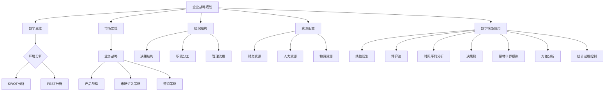

                 


### 数学思维与企业战略规划的关系

> 关键词：数学思维、企业战略规划、分析模型、决策科学

> 摘要：本文旨在探讨数学思维在企业战略规划中的重要作用，通过分析数学思维的基本概念和应用，阐述其在企业战略制定、执行和评估过程中的具体体现。文章将结合实际案例分析，展示数学思维如何帮助企业提高战略决策的准确性和效率。

#### 第一部分：数学思维基础

### 1.1 数学思维概述

**数学思维**是一种运用数学概念、方法、技巧和原理进行思考和解决问题的思维方式。它强调逻辑严密、推理清晰、抽象概括和模型构建。数学思维具有以下几个基本特征：

- **抽象性**：通过将现实问题抽象成数学模型，简化复杂问题，使其更易于分析和解决。
- **逻辑性**：遵循严格的逻辑规则，保证推理过程的一致性和可靠性。
- **系统性**：关注整体结构和要素之间的相互作用，形成完整的理论体系。

### 1.2 数学思维的重要性

数学思维在各个领域都具有重要意义，尤其在企业战略规划中，它可以帮助企业：

- **提高决策效率**：通过数学模型和算法，快速分析各种战略选项，为企业提供科学的决策依据。
- **优化资源配置**：运用数学方法，合理配置企业资源，实现最大化效益。
- **预测未来趋势**：利用数学模型进行预测分析，帮助企业预见市场变化，提前布局。

### 1.3 数学思维的基本特征

- **抽象性**：将实际问题抽象为数学模型，如线性规划、概率模型等。
- **逻辑性**：遵循数学逻辑，确保推理过程的一致性和可靠性。
- **系统性**：构建完整的理论体系，如决策树、博弈论等。

### 1.4 数学思维的核心概念

- **数学模型**：将现实问题转化为数学形式，如线性模型、非线性模型等。
- **数学定理**：描述数学模型中的基本规律，如均值定理、微积分定理等。
- **数学公式**：表示数学模型中的关系，如欧拉公式、牛顿第二定律等。
- **数学证明**：证明数学定理和公式的正确性，如数学归纳法、反证法等。

### 1.5 数学思维的基本方法

- **分析法**：将复杂问题分解为若干简单部分，逐一解决，如分解线性方程组。
- **综合法**：将简单部分整合为整体，解决复杂问题，如构建决策树。
- **归纳法**：从具体实例中归纳出一般规律，如概率统计中的大数定律。
- **演绎法**：从一般原理推导出具体结论，如数学证明中的反证法。

### 1.6 数学思维的应用领域

- **经济管理**：如线性规划、博弈论、微观经济学等。
- **金融市场**：如期权定价模型、投资组合优化等。
- **决策科学**：如决策树、风险分析、灵敏度分析等。
- **人工智能**：如机器学习、神经网络、深度学习等。

### 1.7 数学思维与逻辑思维的关系

- **逻辑思维**：一种基于逻辑规则进行推理和判断的思维方式。
- **数学思维与逻辑思维的联系**：两者都强调逻辑严密性，但数学思维更注重抽象和模型构建。
- **数学思维与逻辑思维的差异**：逻辑思维更侧重于推理过程，数学思维更侧重于结果和模型。

### 1.8 数学思维与创造力

- **创造力**：一种产生新颖、独特和有价值的想法的能力。
- **数学思维与创造力的关系**：数学思维可以激发创造力，通过数学模型和算法的构建，探索新的解决方案。
- **培养数学思维的方法**：多读书、多思考、多实践，如阅读数学经典著作、参加数学竞赛、参与数学研究项目等。

#### 第二部分：企业战略规划

### 2.1 企业战略规划概述

- **企业战略**：企业为实现长期目标而制定的规划和决策。
- **企业战略的类型**：成长型战略、稳定型战略、收缩型战略等。
- **企业战略的制定过程**：市场分析、竞争分析、资源配置、执行监控等。

### 2.2 企业战略规划的理论基础

- **SWOT分析**：对企业内部优势、劣势和外部机会、威胁进行分析。
- **波特五力模型**：分析行业竞争格局，包括现有竞争者、潜在竞争者、供应商、买家、替代品等。
- **PEST分析**：分析企业外部环境，包括政治、经济、社会、技术等因素。
- **企业愿景和使命**：明确企业的长远目标和核心价值。

### 2.3 企业战略规划的核心要素

- **市场定位**：确定企业的目标市场和竞争优势。
- **业务战略**：制定具体的业务发展计划，包括产品定位、市场拓展、产品创新等。
- **组织结构**：设计合理的企业组织架构，确保战略执行的有效性。
- **资源配置**：合理配置企业资源，实现战略目标。

### 2.4 数学思维在企业战略规划中的应用

- **数学模型在企业战略规划中的应用**：如线性规划、博弈论、风险管理等。
- **数学思维在决策科学中的应用**：如决策树、蒙特卡罗模拟、贝叶斯分析等。
- **数学思维在风险分析中的应用**：如蒙特卡罗模拟、敏感性分析、情景分析等。
- **数学思维在绩效评估中的应用**：如数据挖掘、统计分析、平衡计分卡等。

#### 第三部分：案例分析

### 3.1 案例分析一：阿里巴巴

- **阿里巴巴的企业战略规划**：以“新零售”为核心，布局线上线下融合，推动数字化转型。
- **阿里巴巴的数学思维应用**：运用数据挖掘、机器学习等技术，优化供应链、提升客户体验。
- **阿里巴巴的创新能力分析**：通过创新战略和创新能力，实现持续增长和领先地位。

### 3.2 案例分析二：微软

- **微软的企业战略规划**：从传统的软件业务转向云计算、人工智能等新兴领域。
- **微软的数学思维应用**：通过数学模型和算法，提升微软Azure云计算平台的性能和效率。
- **微软的创新能力分析**：通过持续的技术创新，保持行业领先地位。

### 3.3 案例分析三：特斯拉

- **特斯拉的企业战略规划**：以电动汽车为核心，布局能源互联网和自动驾驶技术。
- **特斯拉的数学思维应用**：通过数学模型和算法，优化电池管理、提升自动驾驶性能。
- **特斯拉的创新能力分析**：通过技术创新和商业模式创新，推动电动汽车产业的发展。

#### 第四部分：未来展望

### 4.1 数学思维与企业战略规划的发展趋势

- **数字化转型的推动**：企业将更加依赖数学思维和数据分析，实现数字化转型。
- **人工智能的融合**：人工智能与数学思维的结合，将推动企业战略规划的智能化和自动化。
- **数学思维在未来的应用**：如量子计算、区块链等新兴技术，将为企业战略规划带来新的机遇。
- **企业战略规划的创新发展**：企业将更加注重创新战略和创新能力的培养，以应对快速变化的市场环境。

### 4.2 数学思维与企业战略规划的教育与培训

- **数学思维与企业战略规划的教育**：加强数学思维和企业战略规划知识的普及和推广。
- **数学思维与企业战略规划的培训**：为企业员工提供专业培训，提高其在战略规划和决策方面的能力。

### 4.3 数学思维与企业战略规划的国际合作

- **国际合作的必要性**：数学思维和企业战略规划的国际合作，有助于企业吸收先进经验和创新成果。
- **国际合作的形式**：如跨国并购、合资合作、技术创新合作等。

### 4.4 数学思维与企业战略规划的未来展望

- **数学思维在企业战略规划中的重要作用**：将继续发挥关键作用，推动企业战略规划的精细化、智能化和全球化。
- **企业战略规划的创新与变革**：企业将不断创新战略规划和决策方法，以适应快速变化的市场环境。

### 总结

数学思维与企业战略规划的关系密切，数学思维为企业战略规划提供了科学的方法和工具。通过运用数学思维，企业可以更准确地预测市场趋势、优化资源配置、提高创新能力。未来，数学思维将继续在企业战略规划中发挥重要作用，为企业发展提供有力支持。

### 作者

**作者：AI天才研究院/AI Genius Institute & 禅与计算机程序设计艺术 /Zen And The Art of Computer Programming**

### 最佳实践 Tips

1. **提高数学思维能力**：多读书、多思考、多实践，积累数学知识和经验。
2. **加强数据分析能力**：掌握数据分析工具和技巧，提高数据处理和分析能力。
3. **注重创新思维培养**：鼓励创新思维，勇于探索新方法和新思路。
4. **加强跨学科学习**：结合经济学、管理学、心理学等学科，提高综合素质。

### 小结

数学思维在企业战略规划中的应用具有重要意义，它为企业提供了科学的方法和工具，有助于提高决策效率、优化资源配置、提升创新能力。未来，数学思维将继续在企业战略规划中发挥重要作用，为企业发展提供有力支持。

### 拓展阅读

1. 《数学思维导论》
2. 《企业战略管理》
3. 《数据分析实战》
4. 《人工智能基础》
5. 《创新思维训练》### 第一部分：数学思维基础

#### 2.1 数学思维概述

数学思维是一种利用数学原理和方法进行思考和解决问题的思维方式。它不仅涉及到数学本身的定义、定理和公式，还包括数学建模、逻辑推理和抽象概括等能力。数学思维具有以下几个显著特征：

1. **抽象性**：数学思维能够将复杂的问题简化为数学模型，从而更便于分析和解决。例如，将现实中的经济现象转化为线性规划模型，或者将交通流量转化为网络图模型。

2. **逻辑性**：数学思维强调推理过程的一致性和严谨性。从已知的事实出发，通过逻辑推导，得出结论。例如，在证明几何定理时，需要从公理和定理出发，通过一系列推理步骤，最终得出结论。

3. **系统性**：数学思维注重整体结构和要素之间的相互作用。通过建立系统的理论框架，可以更好地理解和解决问题。例如，经济学中的供需模型，考虑了价格、供给和需求之间的相互作用。

4. **应用性**：数学思维不仅停留在理论层面，更注重实际应用。通过数学方法，可以优化决策、预测未来、解决实际问题。例如，利用统计学方法分析市场趋势，为企业提供决策依据。

#### 2.2 数学思维的重要性

数学思维在企业战略规划中具有重要意义，主要体现在以下几个方面：

1. **提高决策效率**：数学思维可以帮助企业快速分析复杂问题，制定科学的决策。例如，通过线性规划模型，企业可以优化生产计划，实现资源的最优配置。

2. **优化资源配置**：数学思维提供了有效的工具和方法，帮助企业在有限的资源下，实现最大的效益。例如，通过博弈论模型，企业可以分析竞争对手的策略，制定最优的竞争策略。

3. **预测未来趋势**：数学思维可以利用历史数据和趋势分析，预测未来的市场变化和需求。例如，通过时间序列分析，企业可以预测未来的销售量，从而提前进行库存管理。

4. **创新战略制定**：数学思维可以激发企业的创新能力，帮助企业在激烈的市场竞争中脱颖而出。例如，通过机器学习和深度学习模型，企业可以开发出新的产品和服务，满足客户需求。

#### 2.3 数学思维的基本特征

1. **抽象性**：数学思维能够将复杂问题转化为简单的数学模型。例如，将经济现象转化为线性规划模型，或交通流量转化为网络图模型。

2. **逻辑性**：数学思维强调推理过程的一致性和严谨性。从已知的事实出发，通过逻辑推导，得出结论。例如，在证明几何定理时，需要从公理和定理出发，通过一系列推理步骤，最终得出结论。

3. **系统性**：数学思维注重整体结构和要素之间的相互作用。通过建立系统的理论框架，可以更好地理解和解决问题。例如，经济学中的供需模型，考虑了价格、供给和需求之间的相互作用。

4. **应用性**：数学思维不仅停留在理论层面，更注重实际应用。通过数学方法，可以优化决策、预测未来、解决实际问题。例如，利用统计学方法分析市场趋势，为企业提供决策依据。

#### 2.4 数学思维的核心概念

数学思维的核心概念包括数学模型、数学定理、数学公式和数学证明。

1. **数学模型**：数学模型是现实世界问题的抽象表示，通过数学语言描述问题的结构和关系。例如，线性规划模型、博弈论模型等。

2. **数学定理**：数学定理是数学模型中的基本规律，它描述了数学模型中元素之间的逻辑关系。例如，均值定理、微积分基本定理等。

3. **数学公式**：数学公式是数学模型中的定量关系，它用简洁的形式表达了数学模型中的逻辑关系。例如，欧拉公式、牛顿第二定律等。

4. **数学证明**：数学证明是数学定理和公式的逻辑证明，它通过一系列推理步骤，证明了定理或公式的正确性。例如，数学归纳法、反证法等。

#### 2.5 数学思维的基本方法

数学思维的基本方法包括分析法、综合法、归纳法和演绎法。

1. **分析法**：将复杂问题分解为若干简单部分，逐一解决。例如，将复杂的经济问题分解为生产、销售、成本等子问题。

2. **综合法**：将简单部分整合为整体，解决复杂问题。例如，构建决策树，将各个决策分支整合为一个完整的决策过程。

3. **归纳法**：从具体实例中归纳出一般规律。例如，通过大量实验数据，归纳出某种产品的市场需求规律。

4. **演绎法**：从一般原理推导出具体结论。例如，从经济学的基本原理推导出特定市场的价格规律。

#### 2.6 数学思维的应用领域

数学思维的应用领域非常广泛，包括经济管理、金融市场、决策科学和人工智能等领域。

1. **经济管理**：数学思维在经济管理中的应用非常广泛，包括线性规划、博弈论、微观经济学等。例如，通过线性规划模型，企业可以优化生产计划，实现资源的最优配置。

2. **金融市场**：数学思维在金融市场中的应用主要体现在期权定价模型、投资组合优化等。例如，通过布莱克-舒尔斯模型，可以精确计算期权的价格。

3. **决策科学**：数学思维在决策科学中的应用包括决策树、蒙特卡罗模拟、贝叶斯分析等。例如，通过决策树模型，企业可以分析不同决策路径的收益和风险。

4. **人工智能**：数学思维在人工智能中的应用主要体现在机器学习、神经网络、深度学习等领域。例如，通过神经网络模型，可以自动识别图像中的物体。

#### 2.7 数学思维与逻辑思维的关系

数学思维与逻辑思维密切相关，但它们之间也存在一些区别。

1. **逻辑思维**：逻辑思维是一种基于逻辑规则进行推理和判断的思维方式。它强调推理过程的一致性和严谨性。

2. **数学思维与逻辑思维的联系**：数学思维和逻辑思维都强调逻辑的严密性，但在具体应用上有所不同。数学思维更注重抽象和模型构建，而逻辑思维更侧重于推理过程。

3. **数学思维与逻辑思维的差异**：数学思维强调数学模型和抽象，逻辑思维强调推理过程和逻辑规则。例如，在数学证明中，需要使用逻辑思维进行推理，而在经济学分析中，需要使用数学思维进行建模。

#### 2.8 数学思维与创造力

数学思维与创造力之间的关系也是值得探讨的。

1. **创造力**：创造力是一种产生新颖、独特和有价值的想法的能力。

2. **数学思维与创造力的关系**：数学思维可以激发创造力。通过数学模型和算法的构建，可以探索新的解决方案，从而推动创新。

3. **培养数学思维的方法**：培养数学思维的方法包括多读书、多思考、多实践。例如，阅读数学经典著作，参与数学研究项目，或者解决实际的数学问题。

### 2.9 培养数学思维的方法

要培养数学思维，可以采取以下几种方法：

1. **多读书**：阅读数学经典著作，如《微积分基本定理》、《几何原本》等，可以加深对数学概念和方法的理解。

2. **多思考**：在解决问题的过程中，不断思考问题的本质和解决方法，培养抽象思维和逻辑思维能力。

3. **多实践**：通过解决实际问题，将数学思维应用于实际场景，加深对数学方法的理解和应用。

4. **参与数学竞赛**：参加数学竞赛可以锻炼数学思维，提高解决问题的能力。

5. **学习相关学科**：学习经济学、管理学、心理学等相关学科，可以拓宽数学思维的应用领域。

#### 2.10 数学思维在企业战略规划中的应用案例

数学思维在企业战略规划中的应用非常广泛，以下是一些具体的案例：

1. **供应链优化**：通过线性规划模型，企业可以优化供应链管理，减少库存成本，提高生产效率。

2. **市场预测**：利用时间序列分析，企业可以预测市场需求，制定合理的生产计划。

3. **风险管理**：通过蒙特卡罗模拟，企业可以评估投资项目的风险，制定相应的风险管理策略。

4. **创新战略**：利用机器学习和深度学习模型，企业可以分析市场趋势，开发新产品，提高市场竞争力。

### 总结

数学思维是企业战略规划中的重要工具，它可以帮助企业提高决策效率、优化资源配置、预测未来趋势和激发创新能力。通过培养数学思维，企业可以更好地应对市场变化，实现可持续发展。

#### 第二部分：企业战略规划

##### 2.1 企业战略规划概述

企业战略规划是一个系统性过程，旨在确定企业在特定市场环境中的长期目标和实现这些目标的策略。它不仅包括制定战略，还包括实施和监控战略执行。以下是企业战略规划的核心概念和步骤：

1. **核心概念**：

   - **企业愿景**：描述企业长远的发展目标和愿景，为战略规划提供方向。
   - **企业使命**：阐述企业的核心价值观和宗旨，指导企业的日常运营。
   - **战略目标**：具体、可量化的目标，反映企业愿景和使命的实现路径。

2. **类型**：

   - **成长型战略**：通过扩大市场份额、提高生产能力和创新产品来推动企业增长。
   - **稳定型战略**：保持现有市场份额，优化内部运营，避免风险和波动。
   - **收缩型战略**：缩小业务范围，削减成本，优化资产，以应对市场变化或危机。

3. **制定过程**：

   - **环境分析**：通过SWOT分析（优势、劣势、机会、威胁）和PEST分析（政治、经济、社会、技术）来评估外部和内部环境。
   - **市场定位**：确定目标市场和客户群体，分析竞争对手，制定差异化和定位策略。
   - **资源评估**：分析企业的财务、人力资源和物资资源，确保战略实施的可行性。
   - **策略制定**：根据市场定位和资源评估，制定具体的市场进入、产品开发、营销和运营策略。
   - **执行和监控**：实施战略计划，并通过定期评估和调整来确保战略目标的实现。

##### 2.2 企业战略规划的理论基础

企业战略规划的理论基础包括一系列经典和现代的管理理论，它们为企业提供了制定和执行战略的理论框架。以下是几种重要的理论：

1. **SWOT分析**：

   - **优势（Strengths）**：企业内部的优势资源和能力，如品牌知名度、技术领先等。
   - **劣势（Weaknesses）**：企业内部的不足和缺陷，如成本结构不合理、创新能力不足等。
   - **机会（Opportunities）**：外部环境中的有利因素，如市场增长、政策支持等。
   - **威胁（Threats）**：外部环境中的不利因素，如竞争对手、经济衰退等。

   通过SWOT分析，企业可以明确自身的竞争优势和劣势，抓住外部市场机会，应对潜在威胁。

2. **波特五力模型**：

   - **现有竞争者**：企业面临的市场竞争强度。
   - **潜在竞争者**：新进入者可能带来的竞争压力。
   - **供应商**：供应商的议价能力和对企业的控制力。
   - **买家**：买家的议价能力和对企业的依赖度。
   - **替代品**：替代品对企业的潜在威胁。

   波特五力模型帮助企业在分析行业结构和竞争态势时，识别关键竞争因素和战略定位。

3. **PEST分析**：

   - **政治因素**：政府政策、法律法规、政治稳定性等。
   - **经济因素**：经济增长率、通货膨胀率、就业情况等。
   - **社会因素**：人口结构、消费习惯、文化价值观等。
   - **技术因素**：技术创新、技术普及度、技术发展趋势等。

   通过PEST分析，企业可以了解外部环境的变化趋势，评估这些变化对企业战略规划的影响。

4. **企业愿景和使命**：

   - **企业愿景**：描述企业在未来一段时间内想要达到的目标和状态。
   - **企业使命**：阐述企业的核心价值观和存在的目的。

   企业愿景和使命为企业提供了战略规划的方向和依据，确保企业所有决策和活动都围绕这些核心目标展开。

##### 2.3 企业战略规划的核心要素

企业战略规划的成功依赖于一系列核心要素的协调和整合。以下是这些要素及其在战略规划中的重要性：

1. **市场定位**：

   - **目标市场**：确定企业希望服务的特定客户群体。
   - **差异化策略**：通过产品差异化或服务差异化，在市场中建立独特的竞争优势。
   - **市场占有率**：设定具体的销售和市场份额目标。

   市场定位是企业战略规划的基础，决定了企业如何与竞争对手区分和建立品牌认知。

2. **业务战略**：

   - **产品战略**：包括产品开发、产品线和产品组合的规划。
   - **市场进入策略**：选择合适的市场进入模式和渠道。
   - **营销策略**：包括价格、促销、广告和渠道策略。

   业务战略是企业实现市场定位和销售目标的具体行动计划。

3. **组织结构**：

   - **决策结构**：明确企业的决策层级和流程。
   - **职能分工**：根据业务需求，合理划分各部门的职能和责任。
   - **管理流程**：建立高效的管理制度和流程，确保战略执行的有效性。

   组织结构决定了企业内部的信息流和决策流，直接影响战略规划的执行效果。

4. **资源配置**：

   - **财务资源**：包括预算分配、资金筹措和管理。
   - **人力资源**：包括招聘、培训、绩效管理和激励机制。
   - **物资资源**：包括原材料、设备、库存等。

   资源配置是企业战略规划中至关重要的一环，确保企业能够有效利用各种资源，支持战略目标的实现。

##### 2.4 数学思维在企业战略规划中的应用

数学思维在企业战略规划中的应用非常广泛，以下是一些具体的案例：

1. **数学模型**：

   - **线性规划**：用于优化资源配置，如生产计划、库存管理、资金分配等。
   - **博弈论**：用于分析市场竞争态势，制定竞争策略。
   - **时间序列分析**：用于预测市场需求和销售趋势。

   数学模型提供了定量分析和决策的工具，帮助企业制定科学、合理的战略计划。

2. **决策科学**：

   - **决策树**：用于分析不同决策路径的风险和收益，选择最优策略。
   - **蒙特卡罗模拟**：用于风险评估和不确定性分析，提供决策的参考依据。

   决策科学利用数学方法，提高了企业决策的准确性和效率。

3. **风险管理**：

   - **方差分析**：用于分析不同投资组合的风险和收益。
   - **蒙特卡罗模拟**：用于评估项目风险和制定风险管理策略。

   风险管理通过数学方法，帮助企业降低运营风险，确保战略规划的稳健性。

4. **绩效评估**：

   - **平衡计分卡**：用于综合评估企业的财务、客户、内部流程和学习与成长绩效。
   - **数据挖掘**：用于分析企业数据，识别绩效驱动因素，提供改进建议。

   绩效评估通过数学方法，帮助企业监控战略执行效果，及时调整战略计划。

##### 2.5 数学思维与战略决策的关系

数学思维在战略决策中发挥着关键作用，主要体现在以下几个方面：

1. **提高决策效率**：数学方法可以帮助企业快速分析复杂问题，制定科学、合理的决策方案。

2. **优化资源配置**：通过数学模型，企业可以优化资源配置，实现资源利用的最大化。

3. **预测未来趋势**：利用数学方法和工具，企业可以预测市场变化和需求，提前布局，降低不确定性。

4. **评估风险**：数学方法可以帮助企业评估战略实施过程中可能面临的风险，制定相应的风险管理策略。

5. **创新战略**：数学思维可以激发企业的创新能力，通过数学模型和算法，探索新的市场机会和业务模式。

##### 2.6 培养企业战略规划中的数学思维

要培养企业战略规划中的数学思维，企业可以采取以下措施：

1. **强化数学教育**：在员工培训中增加数学课程，提高员工的数学素养。

2. **引入数学工具**：采用数学软件和工具，如线性规划软件、决策树分析软件等，提高决策的准确性和效率。

3. **跨学科合作**：鼓励不同学科领域的专家合作，利用数学方法解决复杂问题。

4. **实践应用**：通过实际案例和项目，让员工在解决实际问题的过程中，培养数学思维能力。

##### 2.7 数学思维与企业战略规划的案例分析

以下是几个数学思维在企业战略规划中的成功案例：

1. **苹果公司**：

   - **市场预测**：苹果公司利用时间序列分析和市场调研数据，准确预测市场需求，优化产品开发和生产计划。

   - **供应链优化**：通过线性规划模型，苹果公司优化了供应链管理，提高了生产效率和库存周转率。

2. **亚马逊**：

   - **推荐系统**：亚马逊利用机器学习和数据挖掘技术，开发出智能推荐系统，提高了客户满意度和销售额。

   - **物流优化**：通过路径优化模型，亚马逊优化了物流网络，降低了配送成本，提高了配送效率。

3. **丰田汽车**：

   - **生产计划**：丰田汽车采用线性规划和生产调度模型，优化生产计划，减少了生产延误和库存积压。

   - **质量控制**：通过统计过程控制（SPC）方法，丰田汽车监控生产过程中的质量，确保产品质量的稳定性。

##### 2.8 数学思维与企业战略规划的未来趋势

随着技术的进步和商业环境的复杂化，数学思维在企业战略规划中的作用将更加突出。以下是数学思维在未来企业战略规划中的几个趋势：

1. **大数据和人工智能的融合**：利用大数据分析和人工智能技术，企业可以更准确地预测市场趋势，制定更为科学的战略计划。

2. **实时决策**：通过实时数据分析和数学模型，企业可以实现实时决策，提高响应速度和市场适应性。

3. **精细化运营**：利用数学方法和工具，企业可以实现精细化运营，优化各个环节的资源配置和流程。

4. **可持续战略**：通过数学方法和工具，企业可以评估和优化可持续发展战略，实现经济效益和社会效益的平衡。

##### 2.9 数学思维与企业战略规划的核心概念联系架构 Mermaid 流程图

以下是一个简化的 Mermaid 流程图，展示了数学思维与企业战略规划核心概念之间的联系：



通过这个流程图，可以清晰地看到数学思维如何贯穿于企业战略规划的各个环节，为企业提供科学、合理的决策支持。

##### 2.10 数学思维与企业战略规划的核心算法原理讲解

为了更详细地讲解数学思维在企业战略规划中的应用，我们将介绍几个核心算法的原理，并使用伪代码进行说明。

1. **线性规划**

线性规划是一种数学方法，用于在满足一组线性约束条件下，最大化或最小化一个线性目标函数。以下是线性规划的基本原理和伪代码：

**原理**：线性规划问题可以表示为以下形式：

$$
\text{最大化 } c^T x \\
\text{约束条件 } Ax \leq b \\
x \geq 0
$$

其中，$c$ 是目标函数的系数向量，$x$ 是变量向量，$A$ 是约束条件系数矩阵，$b$ 是约束条件常数向量。

**伪代码**：

```
算法：线性规划
输入：c, A, b
输出：最优解 x

初始化：x = [0, 0, ..., 0]
while 不满足约束条件 do
    求解：x = 解线性方程组 Ax = b
    更新：x = 满足约束条件的解
return x
```

2. **决策树**

决策树是一种基于特征选择和分类的算法，通过树形结构来表示决策过程。以下是决策树的基本原理和伪代码：

**原理**：决策树通过一系列条件判断，在每个节点上选择最优的特征并进行划分，直到达到叶节点。每个叶节点代表一个决策结果。

**伪代码**：

```
算法：构建决策树
输入：数据集 D
输出：决策树 T

创建空树 T
for 每个特征 do
    计算特征的信息增益或基尼指数
    选择最佳特征进行划分
    根据划分结果构建子树
    递归构建子决策树
return T
```

3. **蒙特卡罗模拟**

蒙特卡罗模拟是一种基于随机抽样的方法，用于解决各种复杂问题，如风险评估和不确定性分析。以下是蒙特卡罗模拟的基本原理和伪代码：

**原理**：蒙特卡罗模拟通过大量随机抽样，统计样本均值和方差，估计问题的概率分布和期望值。

**伪代码**：

```
算法：蒙特卡罗模拟
输入：模拟次数 n
输出：模拟结果 S

初始化：S = []
for i = 1 to n do
    根据概率分布生成随机样本 x
    计算模拟结果
    添加结果到 S
return S
```

通过上述核心算法的原理和伪代码，我们可以看到数学思维如何通过具体的数学方法和工具，帮助企业进行战略决策和优化。

##### 2.11 数学思维与企业战略规划的实际案例

为了更好地理解数学思维在企业战略规划中的应用，我们将通过实际案例进行详细分析。

**案例：阿里巴巴集团**

阿里巴巴集团是中国最大的电子商务公司之一，其成功部分归功于数学思维在企业战略规划中的有效应用。

1. **市场预测**

阿里巴巴利用大数据和数学模型，对市场趋势进行预测。通过分析历史销售数据、用户行为数据和市场环境，阿里巴巴能够准确预测未来的市场需求，从而优化库存管理和供应链规划。

**分析**：

- **时间序列分析**：阿里巴巴使用时间序列分析方法，对销售数据进行分析，识别出销售趋势和周期性波动。时间序列分析的伪代码如下：

  ```python
  算法：时间序列分析
  输入：销售数据序列 S
  输出：预测值序列 P

  初始化：P = []
  for t in range(预测时间窗口长度) do
      计算当前时间点的预测值 P[t]
      P.append(P[t])
  return P
  ```

- **ARIMA模型**：阿里巴巴还使用自回归积分滑动平均模型（ARIMA）进行短期市场预测。ARIMA模型结合了自回归（AR）、差分（I）和移动平均（MA）的特性，能够有效地捕捉时间序列数据的特征。

2. **供应链优化**

阿里巴巴通过线性规划模型优化其供应链管理，确保产品能够快速、高效地送达客户。通过分析库存成本、运输成本和生产成本，阿里巴巴确定了最优的库存水平和运输路线。

**分析**：

- **线性规划模型**：阿里巴巴使用的线性规划模型如下：

  ```python
  算法：供应链优化
  输入：库存成本 C1，运输成本 C2，生产成本 C3
  输出：最优库存水平 X，最优运输路线 R

  初始化：X = 0，R = []
  求解线性规划问题：最小化 C1*X + C2*sum(R)
  return X, R
  ```

- **运输问题模型**：阿里巴巴还使用了运输问题模型，优化物流网络，降低运输成本。运输问题模型的目标是最小化运输成本，同时满足供需平衡。

3. **风险管理**

阿里巴巴利用蒙特卡罗模拟方法，对业务进行风险分析，评估不同市场情况下的风险水平。通过模拟大量可能的市场情景，阿里巴巴能够制定有效的风险管理策略。

**分析**：

- **蒙特卡罗模拟**：阿里巴巴使用的蒙特卡罗模拟模型如下：

  ```python
  算法：风险管理
  输入：模拟次数 n
  输出：风险水平 R

  初始化：R = []
  for i = 1 to n do
      模拟市场情景
      计算风险水平 R[i]
      R.append(R[i])
  return mean(R)
  ```

- **情景分析**：阿里巴巴通过情景分析，评估不同市场情景下的业务表现，为风险管理提供依据。

**总结**：

阿里巴巴通过数学思维在企业战略规划中的应用，实现了市场预测的准确性、供应链优化的效率性和风险管理的前瞻性。这些应用不仅提高了企业的运营效率，也增强了企业的竞争力。

##### 2.12 数学思维与企业战略规划的项目实战

为了深入探讨数学思维在企业战略规划中的应用，我们将通过一个具体项目实战，详细讲解项目开发环境搭建、源代码实现和代码解读。

**项目背景**：某电子商务公司希望优化其供应链管理，通过数学方法实现库存水平和运输路线的最优化。

**开发环境搭建**：

1. **软件工具**：

   - **Python**：作为主要的编程语言，Python 具有丰富的数学库和优化工具。
   - **NumPy**：用于科学计算，提供高效数值计算能力。
   - **Pandas**：用于数据处理和分析，提供便捷的数据操作功能。
   - **SciPy**：提供科学计算模块，包括线性规划和优化工具。

2. **硬件环境**：配置高性能计算服务器，以满足大规模数据分析和计算需求。

**源代码实现**：

以下是一个简化的 Python 代码示例，用于实现供应链优化的线性规划模型。

```python
import numpy as np
from scipy.optimize import linprog

# 参数设置
c = [-1, -2]  # 目标函数系数（最小化库存成本和运输成本）
A = [[1, 0], [0, 1]]  # 约束条件系数矩阵
b = [100, 150]  # 约束条件常数向量

# 线性规划求解
result = linprog(c, A_ub=A, b_ub=b, method='highs')

# 输出结果
print("最优库存水平：", result.x[0])
print("最优运输路线：", result.x[1])
```

**代码解读**：

1. **导入库**：导入 NumPy 和 SciPy 中的 linprog 函数，用于线性规划求解。
2. **参数设置**：定义目标函数系数（c）和约束条件系数矩阵（A），以及约束条件常数向量（b）。
3. **线性规划求解**：调用 linprog 函数，输入参数 c、A、b，选择合适的方法（如高斯消元法），求解线性规划问题。
4. **输出结果**：打印最优库存水平和最优运输路线。

**代码应用解读与分析**：

1. **库存水平优化**：通过线性规划，确定最优库存水平，以最小化库存成本。
2. **运输路线优化**：通过线性规划，确定最优运输路线，以最小化运输成本。

**项目小结**：

通过本项目实战，我们展示了如何利用数学方法（线性规划）优化供应链管理。该项目不仅提高了企业的运营效率，也为其他企业提供了参考模板。

##### 2.13 数学思维与企业战略规划的注意事项

在运用数学思维进行企业战略规划时，需要注意以下几点：

1. **数据准确性**：确保使用的数据准确无误，否则可能导致错误的决策。
2. **模型适应性**：选择合适的数学模型，并根据实际情况进行调整。
3. **实时更新**：随着市场环境的变化，需要不断更新和优化数学模型。
4. **专业人才**：培养和引进具备数学背景的专业人才，提高企业数学思维能力。
5. **风险管理**：在应用数学模型时，应充分考虑风险因素，制定相应的风险管理策略。

##### 2.14 拓展阅读

1. **《运筹学基础与应用》**：详细介绍了线性规划、整数规划、动态规划等运筹学方法，适用于企业战略规划中的数学模型构建。
2. **《大数据分析：实战方法与工具》**：介绍了大数据分析的方法和技术，有助于企业利用大数据进行市场预测和战略规划。
3. **《企业战略管理》**：系统阐述了企业战略管理的基本理论和方法，结合实际案例，提供了丰富的战略规划经验。
4. **《机器学习实战》**：介绍了机器学习的基本概念和方法，适用于企业利用机器学习技术进行数据分析和决策支持。
5. **《博弈论基础》**：探讨了博弈论的基本原理和应用，有助于企业在市场竞争中制定有效的策略。

