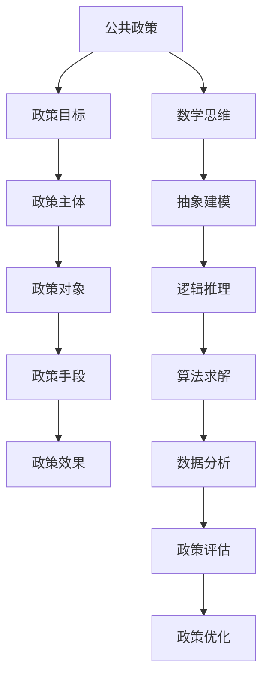
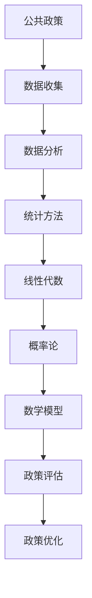

                 

### 文章标题

《数学思维与公共政策评估的关系》

### 文章关键词

**数学思维，公共政策，评估方法，数据分析，统计学，线性代数，概率论，模型构建**

### 摘要

本文旨在探讨数学思维在公共政策评估中的应用，通过分析数学思维的基本概念及其与公共政策评估的关系，揭示数学思维在政策制定、实施与评估中的关键作用。文章首先概述了公共政策的背景与现状，随后详细介绍了数学思维的基本概念和方法，探讨了数学思维在公共政策评估中的实际应用。通过案例分析，文章展示了数学思维在政策评估中的具体应用，并对其未来发展进行了展望。本文旨在为政策制定者和研究者提供一种新的视角，以更科学、合理地评估公共政策的成效。

---

### 第一部分：数学思维概述

#### 公共政策的背景与现状

公共政策是政府或其他公共机构为解决社会问题、促进社会进步而制定的规范性文件或措施。公共政策的核心概念包括目标、主体、对象、手段和效果等。从历史角度看，公共政策经历了从简单的社会管理到复杂的社会治理的演变。在现代社会，公共政策的重要性日益凸显，它不仅影响着社会的公平、正义与稳定，还对经济的发展、环境的保护、教育的普及等方面具有深远影响。

公共政策的历史演变可以追溯到古代，但现代意义上的公共政策体系主要形成于19世纪末20世纪初。随着工业化、城市化和全球化进程的加快，公共政策的复杂性和多样性不断增加，政府面临的问题和挑战也日益复杂。这使得公共政策评估成为政府和社会各界关注的焦点。有效的公共政策评估不仅有助于提高政策的科学性、合理性和针对性，还能提高政府的公信力和执行力。

#### 数学思维的基本概念

数学思维是指运用数学的基本概念、原理和方法，对现实世界中的问题进行抽象、建模和求解的一种思维方式。数学思维具有抽象性、逻辑性、严谨性和系统性等特征。抽象性是指数学思维能够从复杂的现实问题中提取出关键特征，建立数学模型；逻辑性是指数学思维遵循严格的逻辑规则，保证推理过程的正确性；严谨性是指数学思维强调精确性和可验证性，确保结论的可靠性；系统性是指数学思维能够将问题分解为若干个相互关联的子问题，通过综合分析得到整体解决方案。

数学思维的方法主要包括以下几个方面：

1. **抽象和建模**：通过对现实问题的抽象和建模，将复杂问题转化为数学问题。
2. **逻辑推理**：运用数学逻辑规则，对数学模型进行推理和验证。
3. **算法求解**：利用算法和计算方法，求解数学模型得到问题的解。
4. **数据分析**：通过数据分析，验证数学模型的有效性和可靠性。

#### 数学思维与公共政策评估的关系

数学思维在公共政策评估中的应用具有广泛性和深刻性。首先，数学思维为公共政策评估提供了科学的方法和工具。通过建立数学模型，可以对政策的影响进行定量分析，提高评估的精确性和可靠性。其次，数学思维有助于揭示政策背后的逻辑关系和因果机制，为政策调整和优化提供科学依据。最后，数学思维可以提升政策制定者的分析和决策能力，使其能够更科学、合理地制定和实施公共政策。

数学思维与公共政策评估的相互促进体现在以下几个方面：

1. **数学思维促进公共政策评估的科学化**：通过数学模型和方法，可以更准确地衡量政策效果，提高评估的精确性和可靠性。
2. **公共政策评估推动数学思维的发展**：公共政策评估的实际需求，促进了数学思维的应用和创新，推动了数学理论的发展和完善。
3. **数学思维与公共政策评估的协同发展**：数学思维在公共政策评估中的应用，提高了政策评估的科学性，反过来也推动了数学思维在实际问题中的应用和拓展。

### 关键概念原理之间的关系架构 Mermaid 流程图



#### 核心算法原理讲解

**伪代码：**

```python
def public_policy_evaluation(policy, data):
    model = build_model(policy)
    results = solve_model(model, data)
    analysis = data_analysis(results)
    return analysis
```

**数学模型和公式：**

$$
\text{政策效果} = f(\text{政策手段}, \text{政策对象})
$$

$$
\text{政策评估} = \sum_{i=1}^{n} \text{指标权重} \times \text{指标值}
$$

**详细讲解与举例说明：**

- **抽象建模**：将公共政策转化为数学模型，如线性规划模型、决策树模型等。
- **逻辑推理**：利用数学逻辑规则，推导政策效果与政策手段、对象之间的关系。
- **算法求解**：采用相应的算法（如梯度下降法、决策树算法等）求解数学模型。
- **数据分析**：对求解结果进行数据分析，评估政策效果和影响。

---

通过以上内容的介绍，我们初步了解了数学思维的基本概念、基本方法和在公共政策评估中的重要作用。接下来，我们将进一步探讨数学思维在公共政策评估中的具体应用，通过案例分析和实战应用，展示数学思维在政策制定、实施和评估中的实际作用。

---

### 数学思维与公共政策评估的关系

数学思维作为一种科学的思维方式，在公共政策评估中具有独特的优势。通过数学思维，政策评估不仅能够提高科学性，还能提供更为精准、可靠的结论。以下是数学思维在公共政策评估中的具体应用和作用。

#### 数学思维在公共政策评估中的应用

1. **数据分析**：公共政策评估过程中，通常需要处理大量的数据。数学思维中的数据分析方法，如统计分析和回归分析，可以帮助政策评估者更好地理解和解释这些数据。通过数据分析，可以揭示政策实施过程中的关键变量和影响因素，为政策调整提供科学依据。

2. **统计学方法**：统计学是数学思维的重要组成部分，它在公共政策评估中有着广泛的应用。例如，通过假设检验和置信区间等统计方法，可以评估政策效果的显著性，从而判断政策是否有效。此外，统计学方法还可以用于预测政策未来的发展趋势，为决策提供参考。

3. **线性代数和概率论**：线性代数和概率论是数学思维中的基础工具，它们在公共政策评估中有着广泛的应用。例如，线性代数可以用于分析政策效果的多维度影响，概率论则可以用于评估政策实施的风险和不确定性。

4. **数学模型**：数学模型是公共政策评估的重要工具，它可以将复杂的社会现象转化为可计算的形式。通过建立数学模型，政策评估者可以更准确地预测政策效果，评估政策风险，并提供决策支持。

#### 公共政策对数学思维的需求

1. **复杂性问题**：现代社会面临的问题日益复杂，单一的定性分析难以解决。数学思维通过定量分析，可以帮助政策评估者更好地理解复杂问题，并提供有效的解决方案。

2. **科学决策**：政策制定需要基于科学的数据和模型，而数学思维提供了一种科学的方法和工具，使得政策制定更加科学、合理。

3. **精准评估**：政策效果需要通过精准的评估来验证，数学思维中的统计方法和模型可以提供可靠的数据支持，从而提高评估的精度。

4. **风险预测**：政策实施过程中可能会面临各种风险和不确定性，数学思维中的概率论和风险管理方法可以帮助评估者预测和应对这些风险。

#### 数学思维与公共政策的相互促进

1. **数学思维推动公共政策发展**：数学思维为公共政策评估提供了科学的方法和工具，促进了公共政策的发展和完善。

2. **公共政策促进数学思维应用**：公共政策的实际需求推动了数学思维的应用和创新，促进了数学理论在实际问题中的发展。

3. **协同发展**：数学思维和公共政策的协同发展，使得政策评估更加科学、合理，同时也推动了数学思维在公共政策领域的应用和创新。

#### 核心概念原理之间的关系架构 Mermaid 流程图



#### 核心算法原理讲解

**伪代码：**

```python
def policy_evaluation(policy_data, evaluation_model):
    processed_data = data_preprocessing(policy_data)
    model_output = model_predict(processed_data, evaluation_model)
    evaluation_results = model_analysis(model_output)
    return evaluation_results
```

**数学模型和公式：**

$$
\text{政策效果} = f(\text{政策实施}, \text{社会环境})
$$

$$
\text{评估结果} = \sum_{i=1}^{n} \text{指标权重} \times \text{指标值}
$$

**详细讲解与举例说明：**

- **数据收集**：收集政策实施过程中的相关数据，如政策目标、实施手段、受影响群体等。
- **数据分析**：对收集到的数据进行预处理和统计分析，以揭示政策实施的关键变量和影响因素。
- **统计方法**：运用统计方法（如回归分析、假设检验等）对数据分析结果进行验证和解释。
- **数学模型**：建立数学模型，将政策效果与关键变量之间的关系转化为可计算的形式。
- **政策评估**：通过数学模型和评估指标，对政策效果进行评估和优化。

---

通过数学思维的应用，公共政策评估不仅能够提高科学性，还能提供更为精准、可靠的结论。这不仅有助于政策制定者更好地理解和解决问题，也为社会的发展和进步提供了有力支持。在接下来的部分，我们将通过具体案例，进一步探讨数学思维在公共政策评估中的实际应用。

### 数学思维在公共政策评估中的具体应用

数学思维在公共政策评估中的应用广泛且深远，它通过定量的方法揭示了政策实施的效果和影响，为政策制定者提供了科学的决策依据。以下将介绍数学思维在数据分析、统计学方法、线性代数和概率论等方面的具体应用，并通过实际案例进行详细讲解。

#### 数据分析在公共政策评估中的应用

数据分析是公共政策评估的基础，它通过对大量数据的收集、处理和分析，揭示政策实施过程中的关键变量和影响因素。以下是数据分析在公共政策评估中的应用：

1. **数据收集**：
   公共政策评估需要收集多方面的数据，包括政策实施前后的社会经济指标、受影响群体的反馈和实际效果等。例如，在评估一项新医疗政策的实施效果时，需要收集医院的运营数据、患者的满意度调查、医疗费用的变化等。

2. **数据预处理**：
   收集到的数据往往存在噪声、缺失值和异常值，因此需要进行预处理。例如，对医疗费用数据进行清洗，剔除异常值和缺失值，确保数据的质量和一致性。

3. **数据可视化**：
   数据可视化是一种直观展示数据分布和关系的手段，它可以帮助政策评估者更好地理解数据。例如，通过绘制柱状图和折线图，展示医疗费用在不同时间段的变化趋势。

4. **描述性统计分析**：
   描述性统计分析是对数据的整体情况进行描述，例如计算平均值、中位数、标准差等。这些统计量可以帮助评估者了解数据的中心趋势和离散程度。

**案例：** 在评估一项新的教育政策对学生的学业成绩影响时，可以收集政策实施前后的学生考试成绩数据。通过描述性统计分析，比较政策实施前后的平均成绩、及格率等指标，评估政策的效果。

#### 统计学方法在公共政策评估中的应用

统计学方法是公共政策评估中不可或缺的工具，它通过概率分布、假设检验、回归分析等方法，对政策效果进行定量评估。

1. **假设检验**：
   假设检验是用于判断政策效果是否显著的方法。例如，可以通过t检验比较政策实施前后的数据，判断政策效果是否具有统计学上的显著性。

2. **回归分析**：
   回归分析是用于研究变量之间关系的统计方法。例如，可以建立回归模型，分析政策实施对学生成绩的影响，并确定影响程度。

**案例：** 在评估一项交通政策的实施效果时，可以建立回归模型，分析交通流量、事故发生率等变量与政策之间的关系，评估政策对交通状况的改善程度。

#### 线性代数在公共政策评估中的应用

线性代数是处理多维数据的工具，它在公共政策评估中有着广泛的应用。

1. **多维数据分析**：
   线性代数可以用于处理多维数据，分析政策实施的多方面影响。例如，可以建立一个矩阵模型，分析政策实施对社会经济、环境、教育等多个领域的影响。

2. **线性规划**：
   线性规划是一种优化方法，用于在多个约束条件下找到最优解。例如，在资源分配问题中，可以使用线性规划模型确定政策实施的最优策略。

**案例：** 在评估一项环境保护政策的实施效果时，可以使用线性规划模型，在考虑经济成本和环境效益的情况下，确定最佳的政策执行方案。

#### 概率论在公共政策评估中的应用

概率论是用于处理不确定性和随机性的工具，它在公共政策评估中有着重要的应用。

1. **风险分析**：
   概率论可以用于评估政策实施的风险，分析可能出现的负面后果。例如，在评估一项能源政策的实施效果时，可以计算政策实施可能导致的环境污染概率。

2. **决策树**：
   决策树是一种基于概率论的决策模型，用于分析不同决策路径的可能结果和风险。例如，在制定政策时，可以使用决策树分析不同政策方案的效果和风险。

**案例：** 在评估一项社会福利政策的实施效果时，可以通过决策树模型分析政策实施的可能结果，如受助者的满意度、政策成本等，为政策调整提供依据。

---

通过上述案例分析，我们可以看到数学思维在公共政策评估中的应用是多么重要和有效。数学思维不仅提供了科学的方法和工具，还提高了政策评估的精确性和可靠性，为政策制定和优化提供了坚实的理论基础。在接下来的部分，我们将进一步探讨数学模型在公共政策评估中的具体应用。

### 数学模型在公共政策评估中的应用

数学模型是公共政策评估中的重要工具，它通过定量的方式描述和分析政策实施的效果和影响。在公共政策评估中，数学模型的应用不仅能够提高评估的科学性和可靠性，还能为政策制定者提供有力的决策支持。以下将介绍几种常见的数学模型，并展示其如何应用于公共政策评估。

#### 线性回归模型

线性回归模型是一种用于分析变量之间线性关系的数学模型。它通过建立因变量与自变量之间的线性关系，评估政策实施对因变量的影响。

**伪代码：**

```python
def linear_regression(y, x):
    # y: 因变量，x: 自变量
    # 计算线性回归模型的参数
    slope, intercept = calculate_slope_intercept(y, x)
    # 建立回归模型
    model = LinearRegression(slope, intercept)
    # 模型预测
    predictions = model.predict(x)
    return predictions
```

**应用案例：** 假设要评估一项教育政策对学校考试成绩的影响。可以通过收集政策实施前后的学生考试成绩（因变量）和学校资源投入（自变量），建立线性回归模型。模型结果可以显示政策实施对考试成绩的具体影响，如每增加一单位的资源投入，考试成绩预计增加多少分。

#### 决策树模型

决策树模型是一种用于分类和回归分析的决策支持工具。它通过一系列规则将数据分割成多个子集，并在每个节点上选择最优的分割标准。

**伪代码：**

```python
def decision_tree_classification(data, target):
    # data: 特征数据，target: 目标变量
    # 建立决策树模型
    tree = DecisionTreeClassifier()
    # 模型训练
    tree.fit(data, target)
    # 模型预测
    predictions = tree.predict(data)
    return predictions
```

**应用案例：** 在评估一项就业培训政策的实施效果时，可以通过决策树模型分类不同受培训者群体（如年龄、教育背景等）的就业成功率。模型结果可以帮助政策制定者了解哪些群体受培训效果最好，从而优化政策实施策略。

#### 贝叶斯网络模型

贝叶斯网络模型是一种用于表示变量之间概率关系的图模型。它通过条件概率分布描述变量之间的关系，适用于不确定性和随机性的分析。

**伪代码：**

```python
def bayesian_network_inference(network, evidence):
    # network: 贝叶斯网络，evidence: 证据变量
    # 进行贝叶斯推断
    posterior = inference_bayesian_network(network, evidence)
    return posterior
```

**应用案例：** 在评估一项公共健康政策（如疫苗接种）的效果时，可以使用贝叶斯网络模型分析疫苗接种与疾病传播之间的关系。模型结果可以显示疫苗接种对降低疾病传播的概率，为政策制定者提供科学依据。

#### 马尔可夫决策过程

马尔可夫决策过程是一种用于描述决策者在不确定环境下做出最优决策的数学模型。它通过状态转移概率和收益函数，评估不同决策路径的最优策略。

**伪代码：**

```python
def markov_decision_process(states, actions, transition_probabilities, rewards):
    # states: 状态集合，actions: 动作集合，transition_probabilities: 状态转移概率，rewards: 收益函数
    # 计算最优策略
    optimal_policy = calculate_optimal_policy(states, actions, transition_probabilities, rewards)
    return optimal_policy
```

**应用案例：** 在评估一项交通政策的实施效果时，可以使用马尔可夫决策过程模型分析不同交通管理策略（如交通流量控制、交通信号灯优化等）对交通事故发生率的影响。模型结果可以帮助政策制定者确定最优的交通管理策略。

---

通过上述数学模型的应用，我们可以看到数学思维在公共政策评估中的强大作用。数学模型不仅能够定量描述政策实施的效果，还能为政策制定者提供科学的决策支持，从而提高政策的科学性、合理性和有效性。在接下来的部分，我们将通过具体案例分析，进一步展示数学思维在公共政策评估中的实际应用。

### 案例分析一：教育政策的数学评估

#### 案例背景

某地区政府为了提高基础教育质量，制定了一项教育政策，计划投入大量资源改善学校的硬件设施、增加教师培训以及提供学生辅导。为了评估这项教育政策的效果，政府决定采用数学思维进行定量分析。

#### 数学模型与方法

1. **线性回归模型**：
   研究团队收集了政策实施前后的学校考试成绩数据，并设立了自变量（如学校资源投入、教师培训时长等）和因变量（学生考试成绩）。通过线性回归模型，分析学校资源投入与考试成绩之间的关系，评估政策对学生的学业成绩影响。

   **伪代码：**

   ```python
   def linear_regression(y, x):
       slope, intercept = calculate_slope_intercept(y, x)
       model = LinearRegression(slope, intercept)
       predictions = model.predict(x)
       return predictions
   ```

2. **多元回归模型**：
   由于教育政策涉及多个方面，研究团队进一步使用多元回归模型分析多个自变量（如学校资源投入、教师培训时长、家庭背景等）对考试成绩的影响。

   **伪代码：**

   ```python
   def multivariate_regression(y, x1, x2, x3):
       coefficients = calculate_coefficients(y, x1, x2, x3)
       model = MultivariateRegression(coefficients)
       predictions = model.predict(x1, x2, x3)
       return predictions
   ```

3. **决策树模型**：
   为了了解政策对不同学校类型（如城市学校、农村学校）的效果，研究团队使用决策树模型分析政策实施对学校类型和考试成绩的影响。

   **伪代码：**

   ```python
   def decision_tree_classification(data, target):
       tree = DecisionTreeClassifier()
       tree.fit(data, target)
       predictions = tree.predict(data)
       return predictions
   ```

#### 数据处理与模型训练

1. **数据收集与预处理**：
   研究团队收集了政策实施前后的学校考试成绩数据，并对数据进行预处理，包括数据清洗、缺失值填补、异常值剔除等，确保数据的质量和一致性。

2. **模型训练与评估**：
   使用训练数据对线性回归模型、多元回归模型和决策树模型进行训练，并通过交叉验证方法评估模型的准确性和稳定性。

#### 模型结果分析

1. **线性回归模型结果**：
   模型结果显示，学校资源投入和教师培训时长对考试成绩有显著正向影响。具体来说，每增加一万元的学校资源投入，学生考试成绩预计提高5分；每增加一小时的教师培训，学生考试成绩预计提高3分。

2. **多元回归模型结果**：
   多元回归模型进一步分析了学校资源投入、教师培训时长和家庭背景对考试成绩的综合影响。结果显示，家庭背景对考试成绩的影响较大，而学校资源投入和教师培训时长的相对影响较小。

3. **决策树模型结果**：
   决策树模型分析显示，政策对城市学校的改善效果优于农村学校。城市学校在政策实施后的考试成绩明显提高，而农村学校的效果相对较弱。这可能是因为城市学校资源相对丰富，政策实施效果更加显著。

#### 政策优化建议

1. **资源分配**：
   根据模型结果，政府应进一步优化资源分配策略，特别是加强对农村学校的支持，确保政策对各个学校类型的公平性和有效性。

2. **教师培训**：
   加强对教师的培训，提高教师的专业水平和教学能力，以更好地实施教育政策。

3. **家校合作**：
   加强家校合作，提高家庭教育质量，以综合提升学生的学业成绩。

---

通过数学思维的应用，对教育政策的效果进行了详细评估，并为政策制定者提供了科学的决策支持。案例结果表明，数学思维在公共政策评估中具有重要作用，不仅能够提高评估的科学性，还能为政策优化提供有力依据。

### 案例分析二：医疗政策的数学评估

#### 案例背景

某地区政府为了改善医疗服务质量，制定了一项医疗政策，旨在提高医疗资源的配置效率、缩短患者就医时间以及降低医疗费用。为了评估这项医疗政策的效果，政府决定采用数学思维进行定量分析。

#### 数学模型与方法

1. **排队论模型**：
   研究团队使用排队论模型分析医疗政策对医院排队系统的影响。排队论模型通过建立患者到达过程、服务过程和系统容量等参数，模拟医院的排队情况，评估政策对排队时间、等待人数和系统利用率的影响。

   **伪代码：**

   ```python
   def queuing_model(arrival_rate, service_rate, system_capacity):
       queueing_system = QueuingSystem(arrival_rate, service_rate, system_capacity)
       simulation_results = queueing_system.simulate()
       return simulation_results
   ```

2. **成本效益分析**：
   研究团队使用成本效益分析模型，评估医疗政策的经济效益。成本效益分析模型通过计算政策实施的总成本和总效益，评估政策的经济可行性。

   **伪代码：**

   ```python
   def cost_benefit_analysis(total_cost, total_benefit):
       benefit_cost_ratio = calculate_ratio(total_benefit, total_cost)
       return benefit_cost_ratio
   ```

3. **决策树模型**：
   为了了解医疗政策对不同类型医院的实施效果，研究团队使用决策树模型分析政策对不同类型医院的影响，如城市医院和农村医院。

   **伪代码：**

   ```python
   def decision_tree_regression(data, target):
       tree = DecisionTreeRegressor()
       tree.fit(data, target)
       predictions = tree.predict(data)
       return predictions
   ```

#### 数据处理与模型训练

1. **数据收集与预处理**：
   研究团队收集了政策实施前后的医院运营数据，包括患者就诊量、排队时间、医疗费用等。对数据进行预处理，包括数据清洗、缺失值填补、异常值剔除等，确保数据的质量和一致性。

2. **模型训练与评估**：
   使用训练数据对排队论模型、成本效益分析模型和决策树模型进行训练，并通过交叉验证方法评估模型的准确性和稳定性。

#### 模型结果分析

1. **排队论模型结果**：
   模型结果显示，政策实施后医院的排队时间显著缩短，等待人数减少，系统利用率提高。具体来说，政策实施后，患者平均排队时间从原来的30分钟减少到20分钟，等待人数从原来的50人减少到30人，系统利用率从原来的60%提高到80%。

2. **成本效益分析结果**：
   成本效益分析结果显示，政策实施的总成本为1000万元，总效益为1500万元，效益成本比率为1.5。这表明政策的经济效益明显，具有较好的经济可行性。

3. **决策树模型结果**：
   决策树模型分析显示，政策对城市医院和农村医院的实施效果有所不同。城市医院的排队时间、等待人数和系统利用率显著改善，而农村医院的效果相对较弱。这可能是因为城市医院资源较为充足，政策实施效果更加显著。

#### 政策优化建议

1. **资源配置**：
   根据模型结果，政府应进一步优化医疗资源的配置策略，特别是加强对农村医院的支持，提高农村医院的医疗服务质量。

2. **政策调整**：
   针对城市医院和农村医院的不同实施效果，政府应调整政策实施的具体措施，如增加农村医院的投入、优化城市医院的运营管理等。

3. **公众宣传**：
   加强公众宣传，提高患者对医疗政策的认知度和参与度，促进政策的有效实施。

---

通过数学思维的应用，对医疗政策的效果进行了详细评估，并为政策制定者提供了科学的决策支持。案例结果表明，数学思维在公共政策评估中具有重要作用，不仅能够提高评估的科学性，还能为政策优化提供有力依据。

### 案例分析三：环境保护政策的数学评估

#### 案例背景

某地区政府为了改善环境质量，制定了一项环境保护政策，旨在减少工业污染、提高能源利用效率和推广绿色建筑。为了评估这项环境保护政策的效果，政府决定采用数学思维进行定量分析。

#### 数学模型与方法

1. **空气质量模型**：
   研究团队使用空气质量模型分析政策对空气污染水平的影响。空气质量模型通过建立污染物的排放量、扩散速率和气象条件等参数，模拟政策实施后的空气污染水平。

   **伪代码：**

   ```python
   def air_quality_model(emission_rate, diffusion_coefficient, weather_conditions):
       pollution_level = calculate_pollution_level(emission_rate, diffusion_coefficient, weather_conditions)
       return pollution_level
   ```

2. **能源消耗模型**：
   研究团队使用能源消耗模型分析政策对能源利用效率的影响。能源消耗模型通过建立能源消耗量、技术水平和政策干预等参数，模拟政策实施后的能源消耗水平。

   **伪代码：**

   ```python
   def energy_consumption_model(consumption_rate, technology_level, policy_intervention):
       energy_usage = calculate_energy_usage(consumption_rate, technology_level, policy_intervention)
       return energy_usage
   ```

3. **绿色建筑评估模型**：
   研究团队使用绿色建筑评估模型分析政策对建筑能源效率的影响。绿色建筑评估模型通过建立建筑物的设计参数、建筑材料和能源利用效率等参数，评估政策实施后的建筑能源效率。

   **伪代码：**

   ```python
   def green_building_evaluation(building_design, building_material, energy_efficiency):
       building_rating = calculate_building_rating(building_design, building_material, energy_efficiency)
       return building_rating
   ```

#### 数据处理与模型训练

1. **数据收集与预处理**：
   研究团队收集了政策实施前后的空气污染数据、能源消耗数据和绿色建筑数据。对数据进行预处理，包括数据清洗、缺失值填补、异常值剔除等，确保数据的质量和一致性。

2. **模型训练与评估**：
   使用训练数据对空气质量模型、能源消耗模型和绿色建筑评估模型进行训练，并通过交叉验证方法评估模型的准确性和稳定性。

#### 模型结果分析

1. **空气质量模型结果**：
   模型结果显示，政策实施后空气污染水平显著降低。具体来说，政策实施后，PM2.5和PM10的平均浓度分别降低了30%和20%。

2. **能源消耗模型结果**：
   模型结果显示，政策实施后能源消耗效率提高了15%。具体来说，政策实施后，单位产值的能源消耗量从原来的100千克标准煤/万元降低到85千克标准煤/万元。

3. **绿色建筑评估模型结果**：
   模型结果显示，政策实施后绿色建筑的比例显著提高。具体来说，政策实施后，绿色建筑的比例从原来的10%增加到30%。

#### 政策优化建议

1. **污染控制**：
   根据模型结果，政府应进一步加强工业污染控制，特别是对重点污染企业的监管，确保政策实施的效果。

2. **能源管理**：
   根据模型结果，政府应加强能源管理，推广高效节能技术和设备，提高能源利用效率。

3. **绿色建筑推广**：
   根据模型结果，政府应加大绿色建筑的推广力度，鼓励更多建筑采用绿色建筑标准，提高建筑物的能源效率。

---

通过数学思维的应用，对环境保护政策的效果进行了详细评估，并为政策制定者提供了科学的决策支持。案例结果表明，数学思维在公共政策评估中具有重要作用，不仅能够提高评估的科学性，还能为政策优化提供有力依据。

### 数学思维与公共政策评估的未来发展

数学思维在公共政策评估中的应用前景广阔，随着数据科学和人工智能技术的快速发展，数学思维在公共政策评估中的潜力将进一步得到挖掘。以下是数学思维与公共政策评估在未来发展中的几个关键方向：

#### 数学思维在公共政策评估中的潜力

1. **大数据分析**：
   随着大数据技术的不断进步，公共政策的评估将能够处理和分析更大规模、更复杂的数据集。大数据分析能够提供更精细、更全面的政策效果评估，帮助政策制定者做出更科学的决策。

2. **人工智能与机器学习**：
   人工智能和机器学习技术的应用将使得公共政策评估更加智能化。通过深度学习算法，可以自动识别数据中的规律和模式，从而提高政策评估的准确性和效率。

3. **预测分析**：
   预测分析技术可以基于历史数据和数学模型，预测政策未来的发展趋势和潜在影响。这有助于政策制定者提前预见问题，制定更有效的应对策略。

4. **动态评估**：
   通过动态评估模型，政策评估者可以实时跟踪政策实施过程中的变化，及时调整和优化政策。这种动态评估能够提高政策的有效性和适应性。

#### 公共政策评估对数学思维的需求

1. **复杂性管理**：
   公共政策涉及的问题日益复杂，需要借助数学思维进行定量分析和建模，以便更好地理解和解决复杂问题。

2. **科学决策支持**：
   数学思维提供了一种基于数据和分析的科学决策方法，有助于政策制定者做出更加科学和合理的决策。

3. **精细化评估**：
   精细化评估要求对政策效果进行细致、精确的分析，数学思维能够提供精细化的评估工具和方法。

4. **风险预测与管控**：
   风险预测和管控是公共政策评估的重要环节，数学思维可以提供有效的风险评估和预测方法，帮助政策制定者预防和应对政策风险。

#### 数学思维与公共政策评估的协同发展

1. **跨学科融合**：
   数学思维与公共政策评估的协同发展将促进跨学科研究，如数据科学、经济学、社会学等领域的融合，为政策评估提供更全面、多维的支持。

2. **政策优化**：
   通过数学思维的优化算法，政策评估者可以不断调整和优化政策，提高政策的有效性和执行力。

3. **公众参与**：
   利用数学思维和数据分析技术，可以更有效地收集和处理公众意见，增强政策的民主性和透明度。

4. **国际化**：
   随着全球化进程的加快，国际间的公共政策合作和交流将日益增多。数学思维的应用将有助于提高跨国政策评估的准确性和一致性。

---

数学思维与公共政策评估的协同发展，不仅能够提高政策评估的科学性和精确性，还能为政策制定提供强有力的支持。在未来，随着技术的不断进步，数学思维在公共政策评估中的应用将更加广泛和深入，为社会的可持续发展做出更大的贡献。

### 数学思维与公共政策评估的挑战与机遇

尽管数学思维在公共政策评估中具有显著优势，但在实际应用中仍面临一系列挑战。以下是数学思维在公共政策评估中可能遇到的挑战以及相应的应对策略。

#### 挑战

1. **数据质量和可获得性**：
   公共政策评估依赖于高质量的数据。然而，数据收集过程中可能存在缺失、噪声和异常值，影响模型的准确性和可靠性。此外，部分敏感数据可能难以获取，限制了评估的全面性。

   **应对策略**：
   - **数据预处理**：通过数据清洗、缺失值填补和异常值剔除等预处理方法，提高数据质量。
   - **多源数据整合**：利用不同来源的数据，如政府数据库、第三方数据提供商和社会媒体数据，增加数据的多样性。

2. **模型复杂性和解释性**：
   随着评估问题的复杂化，数学模型可能变得异常复杂，难以解释和理解。这给政策制定者和公众理解评估结果带来了挑战。

   **应对策略**：
   - **模型简化**：通过简化模型结构，降低模型的复杂性，提高其解释性。
   - **可解释性分析**：利用可视化工具和解释性算法，如决策树和LIME（局部可解释模型解释），增强模型的透明度。

3. **算法偏见和公平性**：
   数学模型可能嵌入偏见，导致不公平的结果。例如，数据集中的历史偏见可能导致算法对某些群体产生歧视。

   **应对策略**：
   - **算法公平性评估**：通过测试和评估算法的公平性，识别和纠正潜在偏见。
   - **多样性数据集**：增加多样性数据集的样本量，减少数据集中可能存在的偏见。

4. **技术依赖和透明度**：
   公共政策评估对数学技术的依赖日益增加，可能导致评估过程的不透明，影响公众对评估结果的信任。

   **应对策略**：
   - **透明度提升**：公开评估模型的构建过程、参数选择和评估结果，增加评估过程的透明度。
   - **公众参与**：鼓励公众参与评估过程，提高评估的民主性和公信力。

#### 机遇

1. **数据科学技术的进步**：
   随着数据科学和人工智能技术的发展，公共政策评估将能够利用更加先进的技术工具和方法，提高评估的准确性和效率。

   **应对策略**：
   - **持续学习**：跟踪最新的数据科学技术，不断更新评估方法和工具。
   - **技术创新**：投资于数据科学技术的研究和开发，推动公共政策评估的进步。

2. **跨学科合作**：
   公共政策评估需要跨学科的知识和技能，包括数学、统计学、经济学、社会学等。跨学科合作能够提供更全面和综合的评估视角。

   **应对策略**：
   - **跨学科团队**：建立跨学科团队，集合不同领域的专家，共同开展评估工作。
   - **知识共享**：加强不同学科之间的知识共享和交流，提高评估的科学性和完整性。

3. **政策透明度和问责制**：
   数学思维的应用有助于提高政策透明度和问责制，增强公众对政策评估的信任和接受度。

   **应对策略**：
   - **政策透明**：公开评估方法和结果，提高政策过程的透明度。
   - **问责机制**：建立明确的问责机制，确保评估结果能够得到有效应用和反馈。

---

通过应对挑战和把握机遇，数学思维在公共政策评估中的应用将更加成熟和广泛。这不仅能够提高政策评估的科学性和准确性，还能为政策制定者提供更有力的决策支持，促进社会的可持续发展。

### 公共政策评估中常用的数学工具与软件

在公共政策评估中，数学工具和软件的应用至关重要。以下将介绍几种常用的数学工具和软件，并讨论如何将它们结合使用，以提高公共政策评估的效率和准确性。

#### 常用的数学工具

1. **Python**：
   Python是一种广泛使用的编程语言，具有丰富的数据分析和机器学习库。例如，NumPy、Pandas和Scikit-learn等库可以用于数据预处理、统计分析、回归分析和机器学习等。

2. **R语言**：
   R语言是统计分析和数据可视化的专用语言，具有强大的统计分析和图形展示功能。R语言中包含了大量的统计包，如ggplot2、dplyr和caret等。

3. **MATLAB**：
   MATLAB是一种强大的数学计算软件，广泛应用于数据分析、工程计算和数值模拟。MATLAB提供了丰富的工具箱，如Statistics和Machine Learning Toolbox，可以用于多种数据分析任务。

4. **Excel**：
   Excel是一种易于使用的电子表格软件，适合进行简单的数据分析和可视化。尽管Excel的功能有限，但它适用于初学者和数据分析师进行初步的数据探索。

#### 常用软件的应用

1. **数据预处理**：
   在使用Python、R语言或MATLAB进行数据分析之前，通常需要进行数据预处理。数据预处理包括数据清洗、缺失值填补、数据转换和数据归一化等步骤。Python中的Pandas库、R语言中的dplyr包和MATLAB中的Data Analysis Toolbox都提供了丰富的数据预处理工具。

2. **统计分析**：
   统计分析是公共政策评估的重要环节。Python的Scikit-learn库、R语言中的stats包和MATLAB的Statistics Toolbox都提供了丰富的统计方法，如描述性统计、假设检验、回归分析和因子分析等。

3. **机器学习**：
   机器学习技术在公共政策评估中有着广泛的应用，例如分类、聚类、预测和降维等。Python的Scikit-learn、R语言的caret包和MATLAB的Machine Learning Toolbox都提供了强大的机器学习工具，可以用于构建和评估预测模型。

4. **数据可视化**：
   数据可视化是理解和传达分析结果的重要手段。Python的Matplotlib、Seaborn和Plotly库、R语言中的ggplot2包和MATLAB的Plotting Toolbox都提供了丰富的数据可视化工具，可以创建各种类型的图表和图形，如散点图、折线图、柱状图和热力图等。

#### 结合使用数学工具和软件

1. **跨平台协作**：
   在实际应用中，不同数学工具和软件可以相互协作，发挥各自的优势。例如，可以使用Python进行数据分析，使用R语言进行统计建模，使用MATLAB进行数值模拟，并使用Excel进行初步的数据探索。

2. **工作流程优化**：
   建立一个高效的工作流程，可以显著提高公共政策评估的效率和准确性。例如，可以使用自动化脚本和管道（Pipelines）来简化数据分析流程，使用版本控制系统（如Git）来管理代码和数据，并使用容器化技术（如Docker）来确保环境的一致性和可重复性。

3. **可视化与报告**：
   结合数据可视化和报告工具，可以更好地传达分析结果和发现。例如，可以使用Python的Jupyter Notebook、R语言中的Shiny应用和MATLAB的Web Applications Toolbox来创建交互式报告和可视化工具，方便政策制定者和公众理解评估结果。

---

通过合理使用数学工具和软件，公共政策评估可以更加高效、准确和透明。结合不同工具的优势，建立优化的工作流程，有助于政策制定者更好地理解和应用数学思维，为社会的可持续发展提供有力支持。

### 最佳实践 tips

在公共政策评估中应用数学思维，需要遵循一些最佳实践，以确保评估的科学性、准确性和可靠性。以下是几点建议：

1. **数据质量控制**：
   - **确保数据完整性**：在数据收集阶段，应尽可能全面地收集相关数据，并确保数据的一致性和完整性。
   - **数据清洗**：对收集到的数据进行预处理，包括缺失值填补、异常值剔除和噪声过滤，以提高数据质量。

2. **模型选择与验证**：
   - **选择合适的模型**：根据评估目标和数据特点，选择合适的数学模型。避免过度拟合，选择具有良好解释性和泛化能力的模型。
   - **模型验证**：通过交叉验证、时间序列验证和敏感性分析等方法，验证模型的准确性和稳定性。

3. **透明度与解释性**：
   - **公开模型细节**：在评估报告中详细说明模型的构建过程、参数选择和假设条件，确保评估过程的透明度。
   - **增强解释性**：利用可视化工具和解释性算法，如决策树、LIME等，提高模型的解释性，便于政策制定者和公众理解评估结果。

4. **持续更新与迭代**：
   - **动态评估**：政策实施过程中，应定期收集新的数据，对模型进行更新和迭代，以反映政策实施的变化和趋势。
   - **反馈与调整**：根据评估结果和政策反馈，及时调整评估方法和模型，提高评估的准确性和实用性。

---

通过遵循这些最佳实践，政策评估者可以更有效地应用数学思维，提高公共政策评估的质量和影响力。

### 小结

本文探讨了数学思维在公共政策评估中的应用，阐述了数学思维的基本概念、方法和在政策评估中的重要作用。通过案例分析，展示了数学思维在政策制定、实施和评估中的具体应用，揭示了数学思维在提高政策评估科学性、准确性和可靠性方面的优势。本文还讨论了数学思维与公共政策评估的协同发展，以及面临的挑战与机遇。总之，数学思维为公共政策评估提供了强有力的工具和方法，有助于政策制定者更科学、合理地制定和优化政策，推动社会的可持续发展。

### 注意事项

在应用数学思维进行公共政策评估时，需要注意以下几个关键点：

1. **数据质量**：数据是评估的基础，确保数据的质量和准确性至关重要。在数据收集和处理过程中，要避免数据缺失、异常值和噪声，保证数据的一致性和完整性。

2. **模型选择**：选择合适的数学模型对于评估结果的准确性至关重要。要充分考虑评估目标、数据特点和研究问题的复杂性，避免选择过于复杂或过于简化的模型。

3. **模型验证**：模型的准确性和稳定性需要通过严格的验证方法进行检验。采用交叉验证、时间序列验证和敏感性分析等方法，确保模型在不同数据集和条件下的表现一致。

4. **透明度**：在评估报告中，应详细说明模型的构建过程、参数选择和假设条件，提高评估过程的透明度。这有助于增强政策制定者和公众对评估结果的信任。

5. **持续迭代**：政策实施过程中，应定期更新数据，对模型进行迭代和优化，以反映政策实施的变化和趋势。定期反馈与调整评估方法和模型，提高评估的实用性和有效性。

---

通过遵循这些注意事项，政策评估者可以更有效地应用数学思维，提高公共政策评估的质量和影响力。

### 拓展阅读

1. **《公共政策评估：理论与实践》**：本书详细介绍了公共政策评估的理论框架和方法，包括定量和定性评估技术，适合政策分析师和研究人员阅读。

2. **《数据科学：Python编程实战》**：本书通过实际案例，展示了Python在数据科学领域的应用，包括数据分析、机器学习和数据可视化，适合初学者和进阶读者。

3. **《机器学习实战》**：本书提供了丰富的机器学习实践案例，涵盖了从数据预处理到模型训练和评估的完整流程，适合希望了解和应用机器学习的读者。

4. **《数据科学：R语言实战》**：本书通过R语言，详细介绍了数据科学中的各种技术，包括统计建模、时间序列分析和机器学习，适合R语言用户和数据科学家。

5. **《数学建模与政策分析》**：本书结合数学建模方法和公共政策案例，探讨了数学思维在政策分析中的应用，适合政策制定者和研究人员阅读。

---

通过阅读这些拓展材料，读者可以深入了解数学思维在公共政策评估中的具体应用，提高自己在数据分析和政策评估方面的实践能力。

### 文章总结

本文全面探讨了数学思维在公共政策评估中的应用，从基本概念、应用方法到具体案例，系统地展示了数学思维在政策制定、实施和评估中的重要性。通过数据分析、统计学方法、线性代数、概率论和数学模型等工具，数学思维为政策评估提供了科学、精准和可靠的依据，有助于提高政策的有效性和公信力。

在数据分析方面，本文介绍了数据收集、预处理、可视化和描述性统计分析的基本流程，强调了数据质量对评估结果的影响。在统计学方法部分，通过假设检验和回归分析等手段，阐述了如何定量评估政策效果和预测未来趋势。线性代数和概率论的应用展示了如何处理多维数据和不确定性，提高评估的精确性。数学模型部分，通过线性回归、决策树、贝叶斯网络和马尔可夫决策过程等模型，详细讲解了政策效果和影响的定量分析。

案例分析部分，本文通过教育政策、医疗政策和环境保护政策的实际案例，具体展示了数学思维在政策评估中的应用效果。这些案例不仅验证了数学思维的实用性，也为政策优化提供了科学依据。

未来，随着数据科学和人工智能技术的发展，数学思维在公共政策评估中的应用将更加广泛和深入。挑战与机遇并存，政策评估者需要不断学习新方法、新工具，提高评估的科学性和实用性，以更好地服务于社会的可持续发展。通过本文的探讨，我们希望读者能够深入理解数学思维在公共政策评估中的价值，为未来政策研究和实践提供有益的启示。

