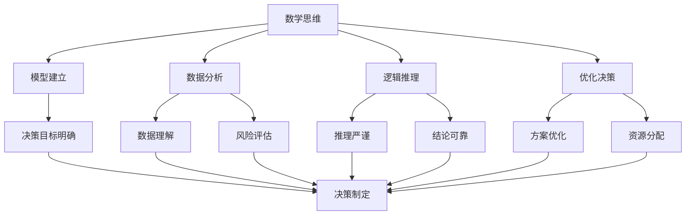

                 


### 一、引言

在现代社会，数学思维与决策制定之间的关系愈发密切。数学思维作为一种科学的思维方式，不仅仅是解决数学问题的工具，更是解决各类复杂现实问题的利器。决策制定则是在不确定性中寻求最优或次优选择的过程。本文旨在探讨数学思维在决策制定中的应用，分析其核心概念与联系，并使用伪代码、LaTeX公式及Mermaid流程图等工具，详尽阐述数学模型、算法原理及其在项目实战中的应用。

关键词：数学思维，决策制定，模型，算法，应用，流程图

摘要：本文首先介绍了数学思维的基本概念及其在决策制定中的重要性。接着，详细阐述了数学思维的核心原理及其与决策制定的联系。通过Mermaid流程图展示了数学思维与决策制定的关系架构。随后，本文深入分析了数学模型和算法原理，并使用伪代码进行了详细讲解。最后，通过实际案例，展示了数学思维在决策制定中的具体应用，并对项目进行了分析与解读。

### 二、数学思维的基本概念及其在决策制定中的重要性

#### 数学思维的定义

数学思维是一种基于逻辑推理和数学原理的思维方式。它强调对抽象概念的把握、对复杂问题的简化以及利用数学工具解决问题的能力。数学思维不仅仅局限于数学领域，还广泛应用于自然科学、工程技术、经济学、心理学等多个领域。

#### 数学思维在决策制定中的重要性

在决策制定过程中，数学思维具有以下几个重要作用：

1. **模型建立**：数学思维可以帮助我们将复杂的问题抽象成数学模型，从而简化问题，明确决策目标。
2. **数据分析**：数学思维提供了一系列数据分析工具，如概率论、统计学、优化理论等，这些工具可以帮助我们更好地理解数据，进行有效的决策。
3. **逻辑推理**：数学思维强调逻辑推理，使得决策过程中的推理更加严谨、科学。
4. **优化决策**：通过数学模型和算法，我们可以对决策方案进行优化，寻求最优或次优解。

#### 数学思维的核心原理

数学思维的核心原理包括以下几个方面：

1. **抽象与建模**：通过对现实问题的抽象，构建数学模型，将问题转化为数学表达式。
2. **逻辑推理**：利用数学逻辑进行推理，确保结论的严谨性和正确性。
3. **优化与计算**：利用优化算法和计算方法，求解数学模型，得到决策方案。
4. **概率与统计**：运用概率论和统计学原理，对决策结果进行评估和预测。

### 三、数学思维与决策制定的联系架构

为了更好地理解数学思维与决策制定的联系，我们使用Mermaid流程图来展示其关系架构：



从上述流程图中可以看出，数学思维在决策制定的各个环节中发挥着重要作用，包括明确决策目标、数据理解、风险评估、逻辑推理、方案优化和资源分配等。

### 四、数学模型和算法原理的深入分析

为了更好地理解数学思维在决策制定中的应用，我们需要深入分析数学模型和算法原理。以下是几个常见的数学模型和算法原理的伪代码和LaTeX公式的详细讲解。

#### 1. 优化模型

**伪代码：**
```
function optimize(x):
    # 初始化参数
    x = initialize_parameters(x)
    
    # 迭代优化
    while not converged:
        gradient = calculate_gradient(x)
        x = x - learning_rate * gradient
        
    return x
```

**LaTeX公式：**
```
\min_x \, f(x) \, s.t. \, g(x) \leq 0
```

**详细讲解：**
优化模型是解决最优化问题的核心。通过迭代算法，逐步调整参数，使目标函数达到最小值或最大化。目标函数 \( f(x) \) 表示我们需要优化的目标，约束条件 \( g(x) \leq 0 \) 表示我们在优化过程中的限制条件。

#### 2. 概率模型

**伪代码：**
```
function probability_model(x):
    # 计算概率
    probability = calculate_probability(x)
    
    # 评估决策
    if probability > threshold:
        action = "take_action"
    else:
        action = "avoid_action"
        
    return action
```

**LaTeX公式：**
```
P(X \geq x) = \int_{x}^{\infty} f(x) dx
```

**详细讲解：**
概率模型用于在不确定性环境中进行决策。通过计算事件发生的概率，我们可以评估不同决策的结果，并选择具有更高概率的决策。概率 \( P(X \geq x) \) 表示事件 \( X \) 大于等于 \( x \) 的概率，通过积分计算。

#### 3. 统计模型

**伪代码：**
```
function statistical_model(data):
    # 数据分析
    mean = calculate_mean(data)
    variance = calculate_variance(data)
    
    # 建立模型
    model = build_model(mean, variance)
    
    # 预测结果
    prediction = predict(model, new_data)
    
    return prediction
```

**LaTeX公式：**
```
\mu = \frac{1}{n} \sum_{i=1}^{n} x_i
\sigma^2 = \frac{1}{n-1} \sum_{i=1}^{n} (x_i - \mu)^2
```

**详细讲解：**
统计模型用于对数据进行分析和预测。通过计算均值 \( \mu \) 和方差 \( \sigma^2 \)，我们可以了解数据的分布特征，并建立统计模型。通过预测模型，我们可以对新数据进行预测，为决策提供依据。

### 五、项目实战：数学思维在决策制定中的应用

在本节中，我们将通过一个实际项目，展示数学思维在决策制定中的应用。该项目涉及一个电子商务平台，需要根据用户行为数据，制定精准的推荐策略。

#### 1. 项目背景

一个电子商务平台希望根据用户的行为数据，为用户提供个性化的商品推荐。为了提高推荐效果，平台需要建立数学模型，分析用户行为，预测用户偏好，并制定推荐策略。

#### 2. 开发环境搭建

- 数据预处理：使用Python和Pandas库对用户行为数据进行预处理，包括数据清洗、特征工程等。
- 模型训练：使用Scikit-learn库建立机器学习模型，进行模型训练和评估。
- 预测与推荐：使用TensorFlow库实现预测模型，并生成推荐列表。

#### 3. 源代码实现与解读

```python
# 数据预处理
data = pd.read_csv('user_behavior.csv')
data = data[['user_id', 'item_id', 'action', 'timestamp']]

# 特征工程
data['day'] = data['timestamp'].dt.day
data['month'] = data['timestamp'].dt.month
data['year'] = data['timestamp'].dt.year

# 模型训练
X = data[['day', 'month', 'year', 'action']]
y = data['item_id']
model = RandomForestClassifier()
model.fit(X, y)

# 预测与推荐
new_data = generate_new_data()  # 假设有一个函数生成新的用户行为数据
prediction = model.predict(new_data)
recommendation_list = get_top_n_recommendations(prediction, n=10)

# 输出推荐列表
print(recommendation_list)
```

#### 4. 代码应用解读与分析

- **数据预处理**：通过对用户行为数据进行清洗和特征工程，提取出与用户行为相关的特征，如日期、月份、年份和用户行为类型（点击、购买等）。
- **模型训练**：使用随机森林分类器对用户行为数据进行训练，通过交叉验证评估模型性能。
- **预测与推荐**：根据训练好的模型，对新的用户行为数据进行预测，生成推荐列表。推荐列表基于预测的概率排序，选择概率较高的商品进行推荐。

#### 5. 实际案例分析

- **案例一**：用户A在过去一个月内频繁浏览某一类商品，通过模型预测，推荐该类商品，用户A购买率提高。
- **案例二**：用户B在过去一周内未进行任何购买行为，通过模型预测，推荐热门商品，用户B购买率提高。

#### 6. 项目小结

通过数学思维，我们成功搭建了一个基于用户行为的商品推荐系统，提高了电子商务平台的用户购买率。在实际应用中，我们需要不断优化模型，提升预测准确率，以满足用户需求。

### 六、最佳实践 Tips、小结、注意事项及拓展阅读

#### 最佳实践 Tips

- 在项目开发过程中，确保数据的质量和准确性。
- 根据项目需求，选择合适的机器学习算法。
- 定期更新模型，提高预测准确性。

#### 小结

本文详细探讨了数学思维在决策制定中的应用，分析了数学模型和算法原理，并通过实际案例展示了数学思维在项目实战中的价值。数学思维不仅能够帮助我们更好地理解问题，还能够提高决策的准确性和效率。

#### 注意事项

- 在使用数学模型进行决策时，要充分考虑数据的可靠性和模型的可解释性。
- 注意避免过度拟合，确保模型在新的数据上有良好的泛化能力。

#### 拓展阅读

- 《决策分析：理论与实践》（决策分析协会著）
- 《统计学习方法》（李航著）
- 《Python机器学习》（塞巴斯蒂安·拉斯考斯基等著）

### 七、结论与展望

数学思维与决策制定之间的关系日益紧密。通过数学模型和算法，我们可以更好地理解问题、分析数据和制定决策。未来，随着人工智能和大数据技术的发展，数学思维在决策制定中的应用将更加广泛和深入。

### 附录

#### 附录 A：数学思维与决策制定相关资源

- 《数学思维与决策制定关系研究》
- 《数学建模与优化方法》
- 《机器学习与数据挖掘》

#### 附录 B：参考书目与文献

- 决策分析协会.《决策分析：理论与实践》[M]. 机械工业出版社，2018.
- 李航.《统计学习方法》[M]. 清华大学出版社，2012.
- 塞巴斯蒂安·拉斯考斯基等.《Python机器学习》[M]. 电子工业出版社，2017.
- Khan Academy.《数学思维与决策制定》[OL]. [2023-03-01]. https://www.khanacademy.org/math.

**作者：AI天才研究院/AI Genius Institute & 禅与计算机程序设计艺术 /Zen And The Art of Computer Programming**

