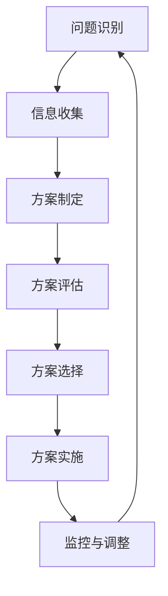

                 

### 第一部分：引论

#### 1. 引言

##### 1.1 研究背景

在当今复杂多变的社会环境中，决策制定成为了各个领域的关键活动。从商业管理、工程规划到科学研究，有效的决策制定影响着组织的成功与个人的发展。然而，随着问题规模的扩大和信息量的增加，传统的决策制定方法面临着巨大的挑战。此时，数学思维作为一种科学且系统的方法，被越来越多地应用于决策制定中，以提高决策的科学性、效率与准确性。

数学思维作为一种抽象、逻辑和创新的思维方式，不仅能够帮助我们从复杂的数据和信息中提取有用知识，还能够通过数学模型和算法提供解决问题的有效途径。随着计算机科学和人工智能技术的飞速发展，数学思维在决策制定中的应用越来越广泛，从而推动了决策科学的理论与实践进步。

##### 1.2 研究目的与意义

本研究旨在探讨数学思维与决策制定之间的关系，分析数学思维在决策制定中的具体作用，探讨数学思维对决策制定的影响，以及决策制定如何反过来促进数学思维的发展。本研究的目的和意义主要体现在以下几个方面：

1. **理论研究**：通过对数学思维与决策制定的深入分析，丰富和拓展决策科学的理论体系，为后续研究提供理论支持。
2. **实践应用**：提供具体的数学方法和工具，帮助决策者更科学、更高效地制定决策，提高决策的准确性和可行性。
3. **方法创新**：探索数学思维与决策制定的新型交互模式，为人工智能和计算机科学领域的发展提供新的思路。

##### 1.3 研究方法与结构安排

本研究采用逻辑分析和实证研究相结合的方法，首先进行理论探讨，明确数学思维与决策制定的基本概念、关系及其应用。随后，通过案例分析，验证数学思维在决策制定中的实际效果。最后，对研究进行总结和展望，提出未来研究方向。

本研究的结构安排如下：

- **第一部分：引论**：介绍研究背景、目的与意义，阐述研究方法与结构安排。
- **第二部分：数学思维概述**：定义数学思维，分析其特点和发展历程。
- **第三部分：决策制定的概述**：定义决策制定，描述其过程和理论基础。
- **第四部分：数学思维与决策制定的联系**：探讨数学思维在决策制定中的作用和交互关系。
- **第五部分：数学思维在决策制定中的应用**：分析数学模型、数学推理和数据分析在决策制定中的应用。
- **第六部分：数学思维与决策制定的互动关系**：分析数学思维与决策制定的协同发展。
- **第七部分：结论与展望**：总结研究成果，提出不足与展望。

通过上述结构安排，本研究旨在系统地探讨数学思维与决策制定之间的关系，为相关领域的研究和实践提供有益参考。

#### 2. 数学思维概述

##### 2.1 数学思维的定义

数学思维是一种通过数学概念、原理、方法和符号进行思考、分析和解决问题的思维方式。它不仅包括对数学知识本身的掌握，更重要的是运用这些知识进行抽象思考、逻辑推理和模型构建的能力。数学思维的核心在于其抽象性和逻辑性，它能够将复杂的现实问题转化为简明的数学模型，从而更清晰地理解和解决问题。

##### 2.2 数学思维的特点

1. **抽象性**：数学思维的一个重要特点是抽象性，它能够从具体的事物中提取出普遍的规律和模式。这种抽象能力使得数学思维能够超越具体的情境，形成普适性的知识和方法。
   
2. **逻辑性**：数学思维依赖于严密的逻辑推理。从已知条件出发，通过一系列逻辑步骤，可以得出确定的结论。这种逻辑性保证了数学思维的可信度和可靠性。

3. **创新性**：数学思维不仅强调对现有知识的掌握，更注重对新知识的发现和创造。通过创新性的思考，数学家们不断拓展数学的边界，推动了数学的发展。

##### 2.3 数学思维的发展历程

1. **古代数学思维**：古代数学起源于人类对自然现象的观察和描述，如古埃及人和巴比伦人使用数学来解决实际生活中的问题，如测量土地和计算税率。

2. **近代数学思维**：17世纪，随着牛顿和莱布尼茨发明微积分，数学开始进入一个崭新的时代。这一时期的数学思维更加注重公理体系和方法论的研究，如欧几里得的《几何原本》。

3. **现代数学思维**：20世纪以来，数学经历了快速发展，从纯理论研究逐渐扩展到应用领域，如计算机科学、经济学和生物学。现代数学思维强调跨学科合作，将数学方法应用于解决复杂问题。

##### 2.3.1 古代数学思维

古代数学思维主要集中在解决实际问题，如建筑、天文和测量等方面。例如，古埃及人利用数学来测量土地和修建金字塔。古巴比伦人则发明了六十进制，使得他们在数学计算中更加方便和精确。

古代数学思维的特点是经验性和实用性，它依赖于对具体事物的直接观察和操作。然而，这种思维方法缺乏严密的逻辑基础，往往只能解决特定的问题，难以形成普适性的理论。

##### 2.3.2 近代数学思维

近代数学思维标志着数学作为一个独立学科的形成。以欧几里得的《几何原本》为代表，近代数学开始强调公理体系和逻辑推理。牛顿和莱布尼茨发明的微积分进一步拓展了数学的应用范围，使得数学思维更加抽象和理论化。

近代数学思维的特点是系统性和严密性，它通过构建严密的逻辑体系，将数学知识从具体问题中抽象出来，形成普适性的理论和方法。这种思维方式不仅为后来的数学研究奠定了基础，也为其他科学领域提供了重要的工具。

##### 2.3.3 现代数学思维

现代数学思维不仅继承了近代数学的严谨性和系统性，还注重跨学科合作和实际问题解决。20世纪以来，数学在计算机科学、经济学和生物学等领域得到了广泛应用，形成了如拓扑学、代数学和统计学等新的分支。

现代数学思维的特点是综合性和创新性，它通过将数学方法应用于解决复杂问题，推动了数学与其他学科的交叉发展。现代数学家不仅关注理论上的创新，还注重实际应用，使得数学思维成为解决现实问题的重要工具。

#### 3. 决策制定的概述

##### 3.1 决策制定的定义

决策制定是指在一个明确的目标或问题背景下，从多个可行的方案中选择一个最佳方案的过程。决策制定不仅包括选择方案，还包括对方案进行评估、预测其效果，并制定相应的实施计划。决策制定的核心在于通过分析、评估和选择，找到最优或次优的解决方案。

##### 3.2 决策制定的过程

决策制定通常可以分为以下几个步骤：

1. **问题识别**：首先，需要明确决策问题，包括问题的性质、目标和约束条件。这一步骤是决策制定的基础，决定了后续分析的准确性和有效性。

2. **信息收集**：在明确问题后，需要收集与问题相关的信息，包括历史数据、市场趋势、专家意见等。信息的完整性和准确性对决策质量有着重要影响。

3. **方案制定**：基于收集到的信息，制定多个可行的方案。这些方案可以是完全不同的，也可以是在某种程度上的改进或优化。

4. **方案评估**：对每个方案进行评估，包括其可行性、成本、风险和预期效果。评估可以通过定量分析（如数学模型）和定性分析（如专家意见）进行。

5. **方案选择**：根据评估结果，选择最佳或次优方案。选择过程需要考虑各种约束条件和优先级，有时可能需要通过权衡不同因素来做出决策。

6. **方案实施**：选择方案后，制定详细的实施计划，包括具体的执行步骤、资源分配和时间安排。实施计划需要确保方案的顺利执行。

7. **监控与调整**：在方案实施过程中，需要不断监控其实施效果，并根据实际情况进行调整。监控和调整是确保决策有效性的重要环节。

##### 3.3 决策制定的理论基础

决策制定的理论基础主要包括以下几方面：

1. **行为决策理论**：行为决策理论关注决策者在决策过程中的心理和行为因素。它认为，决策者并不是完全理性的，而是受到有限理性、风险偏好、心理偏见等因素的影响。

2. **模型决策理论**：模型决策理论通过建立数学模型，对决策过程进行定量分析。它强调决策过程的优化和最大化，为决策提供科学依据。

3. **风险决策理论**：风险决策理论关注在不确定环境下进行决策的问题。它通过概率分析，评估不同决策方案的风险和收益，帮助决策者在不确定中做出最优选择。

4. **博弈论**：博弈论研究多个决策者之间的相互作用和竞争。它通过分析不同策略组合的收益，帮助决策者制定在竞争环境中的最佳策略。

这些理论基础为决策制定提供了不同的视角和方法，使得决策者能够在复杂的决策环境中做出科学、合理的决策。

#### 4. 数学思维与决策制定的联系

##### 4.1 数学思维在决策制定中的作用

数学思维在决策制定中发挥着至关重要的作用。首先，数学思维通过抽象和逻辑推理，能够将复杂的现实问题简化为数学模型，从而更清晰地理解和分析问题。这种模型化能力使得决策制定过程更加科学和系统。

其次，数学思维提供了多种有效的工具和方法，如概率论、线性代数、优化算法等，帮助决策者进行方案评估和选择。这些工具和方法不仅能够提高决策的效率，还能够增加决策的准确性。

最后，数学思维强调创新性，能够推动决策者在面对复杂问题时提出新的解决方案。通过不断尝试和改进，数学思维帮助决策者找到最优或次优的决策方案。

##### 4.1.1 提高决策的科学性

数学思维在提高决策的科学性方面具有显著作用。首先，数学思维通过建立数学模型，将复杂问题转化为可计算和分析的形式，从而提高决策的精确度和可靠性。例如，在市场预测中，通过建立时间序列模型或回归模型，可以更准确地预测市场趋势和需求变化。

其次，数学思维强调逻辑推理和抽象思考，能够帮助决策者从不同角度分析和解决问题。例如，在风险管理中，通过建立概率模型，可以评估不同风险事件发生的概率和影响，从而制定有效的风险应对策略。

##### 4.1.2 提高决策的效率

数学思维能够显著提高决策的效率。首先，数学模型和方法可以自动化决策过程，减少人工干预和重复计算，从而缩短决策时间。例如，在资源分配中，通过建立线性规划模型，可以快速找到最优的资源分配方案。

其次，数学思维能够帮助决策者识别和利用问题的结构特性，从而简化决策过程。例如，在项目管理中，通过使用关键路径法（CPM），可以快速确定项目的关键路径和关键任务，从而更有效地安排时间和资源。

##### 4.1.3 提高决策的准确性

数学思维在提高决策的准确性方面也具有重要作用。首先，通过使用概率论和统计方法，可以评估不同决策方案的风险和收益，从而做出更准确的选择。例如，在投资决策中，通过计算投资组合的预期收益和风险，可以更准确地评估投资机会。

其次，数学思维强调验证和测试，能够确保决策模型的准确性和可靠性。例如，在市场预测中，通过历史数据的验证和测试，可以确保预测模型的准确性和有效性。

##### 4.2 决策制定对数学思维的要求

尽管数学思维在决策制定中具有重要作用，但决策制定也对数学思维提出了特定的要求：

1. **数学知识的掌握**：决策者需要掌握基本的数学知识，包括概率论、统计学、线性代数、微积分等。这些知识是理解和应用数学模型的基础。

2. **数学逻辑的运用**：决策者需要具备良好的数学逻辑思维，能够运用数学原理和方法进行推理和论证。这种逻辑思维能力是确保决策科学性的关键。

3. **数学创新能力的培养**：在复杂问题面前，决策者需要具备创新思维，能够提出新的解决方案。这种创新能力不仅依赖于数学知识，还需要开放的心态和持续的学习。

4. **跨学科知识的整合**：决策问题往往涉及多个学科领域，决策者需要具备跨学科的知识整合能力，能够将数学方法与其他领域的知识相结合，形成更全面的决策思路。

##### 4.3 数学思维与决策制定的交互作用

数学思维与决策制定之间存在着密切的交互作用。一方面，数学思维为决策制定提供了强有力的工具和方法，提高了决策的科学性、效率和准确性。另一方面，决策制定的需求和挑战不断推动数学思维的发展和创新。

1. **数学思维影响决策制定**：数学思维能够帮助决策者更科学、更系统地分析问题，提出新的解决方案。例如，在风险管理中，通过使用数学模型可以更准确地评估风险，制定有效的风险管理策略。

2. **决策制定促进数学思维发展**：实际决策问题往往具有复杂性和多样性，需要数学思维提供有效的解决方案。这种需求不断推动数学思维的发展，激发新的数学理论和方法的产生。

3. **动态交互**：数学思维与决策制定的交互是一个动态的过程。随着决策问题的变化，数学思维需要不断调整和优化，以适应新的决策需求。同时，决策制定过程中的反馈和经验也为数学思维的改进提供了重要参考。

通过数学思维与决策制定的交互作用，不仅能够提高决策质量，还能够推动数学思维和决策科学的共同发展。

### 第二部分：数学思维在决策制定中的应用

#### 5. 数学模型在决策制定中的应用

数学模型是决策制定中的一种重要工具，通过将现实问题转化为数学形式，使得决策过程更加科学和系统。数学模型在决策制定中的应用涵盖了多个方面，以下将详细探讨数学模型的应用场景、选择与优化。

##### 5.1 数学模型概述

数学模型是一种将现实问题抽象为数学形式的方法，它通过建立数学方程、关系式或图示，对问题的特征进行描述和模拟。数学模型的基本组成包括变量、参数、约束条件和目标函数。

变量：表示问题中的不确定因素或可调整的因素，如生产量、成本、需求等。

参数：表示问题中的已知量或固定值，如价格、资源限制等。

约束条件：表示问题的限制条件，如资源限制、市场需求约束等。

目标函数：表示决策目标，如最大化利润、最小化成本、最大化满意度等。

##### 5.2 数学模型在决策制定中的应用场景

1. **资源分配**：在资源分配问题中，数学模型可以帮助决策者优化资源的使用，实现资源的最优配置。例如，在项目管理和生产计划中，通过线性规划模型，可以找到资源的最优分配方案。

2. **市场预测**：在市场预测中，数学模型可以帮助决策者预测市场趋势和需求变化。例如，通过时间序列模型或回归模型，可以预测产品的需求量，从而制定合理的生产计划和库存管理策略。

3. **风险评估**：在风险管理中，数学模型可以帮助决策者评估不同风险事件发生的概率和影响，制定有效的风险应对策略。例如，通过概率模型，可以计算不同投资组合的风险和预期收益，从而选择最优的投资策略。

4. **供应链管理**：在供应链管理中，数学模型可以帮助决策者优化供应链的各个环节，提高供应链的整体效率。例如，通过网络流模型，可以优化物流网络，减少运输成本。

##### 5.3 数学模型的选择与优化

选择合适的数学模型是决策制定的关键。以下是一些常用的数学模型及其适用场景：

1. **线性规划模型**：适用于优化线性目标函数，在资源分配、生产计划等方面有广泛应用。

2. **非线性规划模型**：适用于优化非线性目标函数，适用于更复杂的优化问题。

3. **整数规划模型**：适用于目标函数和约束条件中包含整数变量的优化问题，如人员调度、设备维护等。

4. **动态规划模型**：适用于多阶段决策问题，如长期投资规划、项目进度安排等。

5. **概率模型**：适用于不确定性问题，如市场预测、风险评估等。

6. **统计模型**：适用于数据分析，如回归分析、时间序列分析等。

在选择数学模型时，需要考虑以下因素：

- **问题性质**：不同的问题需要不同的数学模型，因此首先要明确问题的性质。
- **数据可用性**：需要考虑是否能够获取到足够且准确的数据，数据质量对模型效果有重要影响。
- **模型复杂性**：简单的模型可能难以捕捉问题的复杂特性，而复杂的模型可能难以理解和实施。

在数学模型的选择和优化过程中，还需要注意以下几点：

1. **验证与测试**：通过历史数据或模拟数据验证模型的有效性和准确性，确保模型能够真实反映问题特性。

2. **参数调整**：根据实际情况调整模型参数，使模型更加符合问题的实际情况。

3. **模型集成**：将多个模型结合起来，形成综合的决策框架，提高决策的全面性和准确性。

通过合理选择和优化数学模型，决策者可以更科学、更系统地制定决策，提高决策的质量和效率。

#### 6. 数学推理在决策制定中的作用

数学推理是决策制定中的一种核心能力，它通过逻辑和抽象思维，帮助决策者从已知条件推导出未知的结论，从而支持决策过程。数学推理在决策制定中具有重要作用，以下将详细探讨数学推理的概述、在决策制定中的应用以及其局限性与改进。

##### 6.1 数学推理概述

数学推理是指运用数学原理、规则和方法进行逻辑推理和抽象思维的过程。数学推理通常包括以下几种类型：

1. **演绎推理**：从一般原理推导出具体结论的推理方法。例如，从“所有人都会死亡”这个一般性原则推导出“苏格拉底会死亡”这个具体结论。

2. **归纳推理**：从具体事例推导出一般性结论的推理方法。例如，通过观察多个苹果从树上掉落，推导出“所有物体在没有外力作用下会下落”这一结论。

3. **类比推理**：通过比较两个或多个事物的相似性，从一个事物的特性推断出另一个事物的特性。例如，通过比较不同城市的人口增长情况，推断出一个新的城市的人口发展趋势。

##### 6.2 数学推理在决策制定中的应用

1. **问题分析与建模**：在决策制定过程中，数学推理可以帮助决策者对问题进行深入分析，识别关键因素和变量。通过建立数学模型，将复杂问题转化为可计算和分析的形式，为后续的决策提供基础。

2. **方案评估与选择**：数学推理可以通过逻辑推理和计算，对不同的决策方案进行评估和比较。通过计算每个方案的预期收益、成本和风险，决策者可以更科学地选择最佳方案。

3. **预测与优化**：在决策制定中，数学推理可以帮助预测未来的发展趋势和结果。例如，通过建立时间序列模型或回归模型，可以预测市场趋势或需求变化，从而优化生产和库存管理。

##### 6.3 数学推理的局限性与改进

尽管数学推理在决策制定中具有重要作用，但它也存在一些局限性和挑战：

1. **假设简化**：在建立数学模型时，往往需要对现实问题进行简化和假设。这些简化和假设可能影响模型的准确性和适用性。

2. **数据依赖**：数学推理通常依赖于准确的数据，但实际决策过程中，数据往往不完全或存在噪声。数据的不完整性会影响模型的预测效果。

3. **逻辑复杂性**：复杂的数学推理过程可能难以理解和解释，使得决策者难以直接应用。

为改进数学推理在决策制定中的应用，可以采取以下措施：

1. **模型验证与测试**：通过历史数据或模拟数据验证数学模型的准确性，确保模型能够真实反映问题特性。

2. **多模型集成**：将多个数学模型结合起来，形成综合的决策框架，提高决策的全面性和准确性。

3. **人机协作**：通过人机协作，将数学推理与专家经验和直觉相结合，提高决策的灵活性和适应性。

4. **可视化与解释**：通过可视化技术和解释性工具，使得复杂的数学推理过程更加易懂，提高决策者的理解和应用能力。

通过改进数学推理的方法和工具，决策者可以更有效地运用数学思维，提高决策的质量和效率。

#### 7. 数学思维在数据分析与预测中的应用

数学思维在数据分析与预测中发挥着关键作用，它为数据科学家提供了强大的工具和方法，以处理和分析大规模数据，并从中提取有价值的信息。以下将详细探讨数学思维在数据分析中的重要性、常用的数学工具和方法，以及数学思维在预测中的应用。

##### 7.1 数据分析概述

数据分析是指使用统计和数学方法对数据进行分析和处理，以发现数据中的模式和规律。数据分析在商业、金融、医疗、气象等多个领域具有重要应用。数据分析的基本步骤包括数据收集、数据清洗、数据探索、模型构建和结果解释。

1. **数据收集**：数据收集是数据分析的基础，包括从各种来源获取数据，如数据库、传感器、网站日志等。

2. **数据清洗**：数据清洗是确保数据质量和准确性的关键步骤，包括去除重复数据、处理缺失值和异常值等。

3. **数据探索**：数据探索通过可视化工具和统计方法，对数据进行初步分析和探索，以发现数据中的潜在模式和规律。

4. **模型构建**：模型构建是数据分析的核心步骤，通过建立数学模型，对数据进行分析和预测。

5. **结果解释**：结果解释是数据分析的最终目标，通过解释模型结果，帮助决策者理解和应用分析结果。

##### 7.2 数学思维在数据分析中的重要性

数学思维在数据分析中至关重要，它提供了以下几方面的关键优势：

1. **抽象能力**：数学思维能够将复杂的数据转化为简明的数学模型，从而更清晰地理解和分析数据。

2. **逻辑推理**：数学思维依赖于严密的逻辑推理，通过逻辑步骤，可以确保分析过程的准确性和可靠性。

3. **创新性**：数学思维强调创新性，能够帮助数据科学家提出新的分析方法和模型，提高数据分析的效率和效果。

4. **验证能力**：数学思维通过验证和测试，确保数据分析结果的准确性和适用性。

##### 7.3 常用的数学工具和方法

在数据分析中，常用的数学工具和方法包括：

1. **统计学**：统计学是数据分析的核心工具，包括描述性统计、推断性统计、回归分析、聚类分析等。通过统计学方法，可以分析数据的分布特征、估计参数、检验假设等。

2. **线性代数**：线性代数在数据分析中用于处理高维数据和矩阵运算。例如，主成分分析（PCA）通过线性变换降低数据维度，从而揭示数据的主要特征。

3. **优化算法**：优化算法用于求解优化问题，如线性规划、整数规划、动态规划等。通过优化算法，可以找到资源分配、生产计划等问题的最优解。

4. **机器学习**：机器学习是一种利用数据和学习算法进行预测和分类的方法，包括监督学习、无监督学习和强化学习等。通过机器学习，可以自动构建复杂的数据模型，提高数据分析的准确性。

##### 7.4 数学思维在预测中的应用

数学思维在预测中具有重要作用，通过建立数学模型和算法，可以预测未来的趋势和结果。以下是一些常用的预测方法：

1. **时间序列预测**：时间序列预测用于预测时间序列数据的发展趋势，如销售量、股票价格等。常用的方法包括移动平均、指数平滑、ARIMA模型等。

2. **回归预测**：回归预测通过建立回归模型，预测一个或多个变量对另一个变量的影响。例如，通过回归模型可以预测产品的需求量、住房价格等。

3. **贝叶斯预测**：贝叶斯预测基于贝叶斯定理，通过概率模型预测事件发生的概率。贝叶斯预测在分类问题、风险管理等领域有广泛应用。

4. **神经网络预测**：神经网络是一种基于生物神经网络原理的预测方法，通过多层神经元的非线性变换，可以处理复杂的非线性问题。

在预测中，数学思维的重要性体现在以下几个方面：

1. **模型构建**：数学思维帮助数据科学家构建合适的预测模型，通过逻辑推理和抽象思维，将复杂的数据转化为数学模型。

2. **模型评估**：数学思维通过评估和测试，确保预测模型的准确性和可靠性。

3. **模型优化**：数学思维通过不断尝试和改进，优化预测模型，提高预测的精度和效率。

通过数学思维在数据分析与预测中的应用，数据科学家可以更准确地提取数据中的有用信息，为决策制定提供科学依据，从而提高决策的质量和效率。

#### 8. 数学思维在决策制定中的实例分析

为了更好地理解数学思维在决策制定中的应用，以下将通过三个具体实例，展示数学思维如何帮助决策者进行投资决策、市场预测和风险管理。

##### 8.1 实例一：投资决策

投资决策是一个典型的复杂决策问题，涉及多种不确定因素和风险。通过数学思维，可以更科学地评估不同投资方案，从而做出最优选择。

假设某投资者考虑两种投资方案：股票投资和债券投资。每种投资方案都有不同的预期收益率和风险。投资者希望选择一个既能够带来较高收益又风险较小的投资组合。

1. **建立数学模型**：
   设股票投资的预期收益率为\( r_1 \)，风险为\( \sigma_1 \)；债券投资的预期收益率为\( r_2 \)，风险为\( \sigma_2 \)。投资者可以构建一个线性规划模型，目标是最大化预期收益率，同时控制风险。

   数学模型如下：
   \[
   \begin{align*}
   \text{最大化} & \quad r_1x_1 + r_2x_2 \\
   \text{约束条件} & \quad \sigma_1x_1 + \sigma_2x_2 \leq \sigma_{\text{max}} \\
   & \quad x_1 + x_2 = 1 \\
   & \quad x_1, x_2 \geq 0
   \end{align*}
   \]
   其中，\( x_1 \)和\( x_2 \)分别表示投资于股票和债券的比例，\( \sigma_{\text{max}} \)是投资者可以承受的最大风险。

2. **求解模型**：
   通过线性规划求解器，可以找到最优的投资组合。假设求解结果为\( x_1^* \)和\( x_2^* \)，即投资者应将\( x_1^* \)的比例投资于股票，将\( x_2^* \)的比例投资于债券。

3. **分析结果**：
   通过数学模型，投资者可以明确不同投资方案的风险和收益，从而做出更科学的投资决策。

##### 8.2 实例二：市场预测

市场预测是另一个重要的决策领域，通过数学思维，可以预测市场趋势和需求变化，为商业决策提供支持。

假设某公司需要预测未来三个月的产品需求量，以便制定生产计划和库存管理策略。通过数学模型，可以预测产品需求量，并提供决策依据。

1. **建立数学模型**：
   设\( y_t \)为第\( t \)个月的产品需求量，\( \alpha \)和\( \beta \)为参数，可以构建一个时间序列模型，如ARIMA模型，预测未来的需求量。

   数学模型如下：
   \[
   y_t = \alpha y_{t-1} + \beta y_{t-2} + \epsilon_t
   \]
   其中，\( \epsilon_t \)为随机误差项。

2. **模型参数估计**：
   通过历史数据，估计模型参数\( \alpha \)和\( \beta \)，从而建立预测模型。

3. **预测未来需求量**：
   通过模型，可以预测未来三个月的产品需求量。例如，预测结果为\( y_1^*, y_2^*, y_3^* \)。

4. **分析结果**：
   通过预测结果，公司可以调整生产计划，确保库存水平满足市场需求，避免库存过剩或不足。

##### 8.3 实例三：风险管理

风险管理是决策制定中的一个重要环节，通过数学思维，可以评估不同风险事件的发生概率和影响，制定有效的风险应对策略。

假设某公司面临多种风险事件，如市场波动、供应链中断和人力资源短缺。公司希望通过数学模型评估不同风险事件的风险水平，并制定相应的应对策略。

1. **建立数学模型**：
   设\( P_i \)为事件\( i \)发生的概率，\( C_i \)为事件\( i \)发生的成本，可以构建一个风险评估模型，计算总风险成本。

   数学模型如下：
   \[
   \text{总风险成本} = \sum_{i=1}^{n} P_i \cdot C_i
   \]

2. **风险事件概率与成本估计**：
   通过市场调查、专家意见和历史数据，估计不同风险事件的概率和成本。

3. **风险评估**：
   通过计算总风险成本，评估不同风险事件的风险水平。例如，假设市场波动风险最高，供应链中断风险次之，人力资源短缺风险最低。

4. **风险应对策略**：
   根据风险评估结果，制定相应的风险应对策略。例如，对市场波动风险，公司可以制定风险对冲策略；对供应链中断风险，公司可以建立备用供应链。

5. **分析结果**：
   通过风险管理和应对策略，公司可以降低总体风险水平，提高业务稳定性和抗风险能力。

通过这些实例分析，我们可以看到数学思维在决策制定中的应用是多方面的，无论是投资决策、市场预测还是风险管理，数学思维都提供了科学的方法和工具，帮助决策者更有效地分析和解决复杂问题，提高决策的质量和效率。

### 第三部分：数学思维与决策制定的互动关系

#### 9. 数学思维与决策制定的互动关系分析

数学思维与决策制定之间存在一种相互促进的互动关系，这种互动不仅体现在数学思维对决策制定的支持上，也体现在决策制定对数学思维发展的推动上。以下将从数学思维对决策制定的影响、决策制定对数学思维的影响以及数学思维与决策制定的动态交互三个方面进行分析。

##### 9.1 数学思维对决策制定的影响

数学思维在决策制定中发挥着关键作用，它通过多种途径对决策制定产生积极影响：

1. **提高决策的科学性**：数学思维通过建立数学模型和算法，将决策问题转化为可计算的数学形式，从而提供科学依据。例如，在资源分配和项目管理中，通过线性规划模型可以找到最优解，确保资源的高效利用。

2. **增加决策的准确性**：数学思维通过概率论和统计学方法，可以量化决策的不确定性，评估不同决策方案的风险和收益。例如，在市场预测中，通过时间序列模型可以更准确地预测未来需求，从而制定合理的生产和库存策略。

3. **提升决策的效率**：数学思维提供了多种优化算法和计算工具，可以快速处理大规模数据，缩短决策时间。例如，在供应链管理中，通过网络流模型可以优化物流网络，减少运输成本。

4. **促进创新性思维**：数学思维强调抽象和逻辑推理，鼓励决策者从不同角度思考问题，提出创新的解决方案。例如，在风险管理中，通过建立新的概率模型，可以预测以往未曾考虑到的风险事件。

##### 9.2 决策制定对数学思维的影响

决策制定的需求和挑战对数学思维的发展也产生了重要影响：

1. **推动数学理论创新**：面对复杂和动态的决策问题，决策者需要新的数学工具和方法。这种需求推动了数学理论的发展，激发了新的数学分支和算法的诞生。例如，在人工智能和机器学习领域，为了处理大规模数据和复杂模式识别问题，数学家们发展了深度学习和神经网络等新技术。

2. **促进跨学科融合**：决策问题往往涉及多个学科领域，如经济学、工程学、心理学等。决策制定的需求促使数学与其他学科融合，形成新的交叉学科。例如，运筹学结合了数学和工程学的知识，为解决复杂的决策问题提供了有力工具。

3. **激发实际问题研究**：实际决策问题为数学研究提供了丰富的应用场景，推动了数学研究向实际问题靠拢。例如，在金融风险管理中，数学家们开发了复杂的金融模型，用于评估金融产品和市场的风险。

4. **培养数学思维能力**：决策制定过程中的复杂分析和模型构建要求决策者具备良好的数学思维能力。这种需求促使决策者不断学习和提高数学技能，从而推动了数学思维在决策领域的广泛应用。

##### 9.3 数学思维与决策制定的动态交互

数学思维与决策制定之间的互动是一个动态的过程，两者相互影响、相互促进：

1. **反馈循环**：数学思维应用于决策制定，通过实际效果反馈，进一步优化数学模型和方法。例如，通过数据分析验证模型的准确性，可以调整模型参数，提高预测精度。

2. **知识积累**：决策制定过程中的经验和知识积累，为数学思维的发展提供了重要素材。例如，在多次市场预测中积累的经验，可以用于改进时间序列模型，提高预测能力。

3. **持续创新**：数学思维与决策制定的互动不断推动双方的创新和发展。数学家们通过解决实际决策问题，不断提出新的数学理论和方法，而决策者通过应用这些新方法，提高了决策的科学性和有效性。

4. **跨领域合作**：数学思维与决策制定的互动促进了跨领域合作，形成多学科融合的研究团队。这种合作不仅促进了数学思维在决策领域的应用，也为数学思维的发展提供了新的动力。

通过上述分析，我们可以看到数学思维与决策制定之间存在紧密的互动关系。数学思维不仅为决策制定提供了科学的方法和工具，而且通过实际应用不断推动数学思维的发展。同时，决策制定的需求和挑战也为数学思维的创新和进步提供了动力。这种动态的互动关系，使得数学思维与决策制定相互促进，共同发展，为现代社会的发展提供了强大的智力支持。

#### 10. 数学思维与决策制定的协同发展

##### 10.1 数学思维与决策制定的协同发展意义

数学思维与决策制定的协同发展具有重要意义。首先，数学思维为决策制定提供了科学的方法和工具，提高了决策的科学性、准确性和效率。通过数学模型和算法，决策者可以更精确地分析问题和评估方案，从而做出更合理的决策。其次，决策制定的需求和挑战不断推动数学思维的发展，促进了数学理论的新突破和算法的创新。这种协同发展不仅提高了决策的质量，也推动了数学科学的进步。

在现代社会，数学思维与决策制定的协同发展尤为关键。随着信息技术的飞速发展和全球化进程的加速，决策问题日益复杂和多样化，要求决策者具备更高的思维能力和决策水平。数学思维作为一种系统化、逻辑化的思维方式，能够帮助决策者应对复杂问题，提供可靠的决策支持。同时，决策制定过程中的实际需求也为数学思维的应用提供了广阔的舞台，推动了数学方法的创新和进步。

##### 10.2 数学思维与决策制定的协同发展路径

为了实现数学思维与决策制定的协同发展，可以采取以下路径：

1. **加强数学基础教育**：提高全民数学素养，加强中小学和大学的数学教育，培养学生扎实的数学基础和逻辑思维能力。

2. **推进数学与决策学科交叉**：鼓励数学与其他学科的深度融合，如经济学、管理学、心理学等，推动数学理论在决策领域的应用。

3. **建立数学决策实验室**：创建数学决策实验室，开展实际决策问题的研究和实验，验证数学模型和方法的有效性。

4. **推动数学模型标准化**：制定统一的数学模型和算法标准，促进不同领域之间的模型交流和应用。

5. **加强数学人才培养**：设立专门的数学决策研究方向，培养具备数学和决策双重能力的复合型人才。

##### 10.3 数学思维与决策制定的协同发展策略

为了实现数学思维与决策制定的协同发展，可以采取以下策略：

1. **鼓励跨学科合作**：促进数学家与决策者的合作，共同研究和解决实际决策问题。例如，数学家可以参与企业决策咨询，提供数学模型和算法支持。

2. **加强数据分析与建模**：提高数据分析技能，运用数学方法建立决策模型，为决策提供科学依据。例如，企业可以通过大数据分析预测市场需求，制定生产计划。

3. **推广数学思维培训**：开展数学思维培训，提高决策者的数学素养和逻辑思维能力。例如，可以通过在线课程、研讨会等方式，普及数学思维在决策中的应用。

4. **建立决策支持系统**：开发先进的决策支持系统，集成数学模型和算法，为决策者提供实时、动态的决策支持。例如，通过建立智能决策系统，可以帮助企业实时调整生产计划和库存管理策略。

5. **加强国际合作与交流**：开展国际学术交流，引进先进的数学决策理论和实践方法，促进数学思维与决策制定的协同发展。

通过上述策略，可以推动数学思维与决策制定的协同发展，提高决策的科学性和有效性，为现代社会的发展提供强大的智力支持。

### 11. 结论与展望

通过本文的探讨，我们深入分析了数学思维与决策制定之间的关系，展示了数学思维在决策制定中的重要作用。本文主要结论如下：

1. **数学思维在决策制定中具有关键作用**：通过抽象和逻辑推理，数学思维能够将复杂的现实问题转化为数学模型，提高决策的科学性、准确性和效率。

2. **决策制定对数学思维的发展具有推动作用**：实际决策问题为数学研究提供了丰富的应用场景，推动了数学理论的新突破和算法的创新。

3. **数学思维与决策制定之间存在紧密的互动关系**：数学思维与决策制定的协同发展不仅提高了决策的质量，也推动了数学科学的进步。

尽管本文对数学思维与决策制定的互动关系进行了系统探讨，但研究仍存在一些不足之处。首先，本文主要基于理论分析，缺乏足够的实证研究。未来的研究可以结合实际案例，进行更深入的分析和验证。其次，本文对数学模型和算法的讨论较为宏观，未来研究可以进一步细化，探讨具体模型和算法的适用场景和优化方法。

未来研究方向可以从以下几个方面展开：

1. **实证研究**：通过实际案例和数据，验证数学思维在决策制定中的应用效果，分析不同模型和算法的适用性。

2. **跨学科研究**：加强数学与其他学科的交叉研究，探索数学方法在其他领域（如经济学、管理学等）的应用。

3. **算法优化**：针对复杂决策问题，优化数学模型和算法，提高模型的预测精度和计算效率。

4. **人机协作**：探索人机协作模式，将数学思维与人工智能技术相结合，提高决策的灵活性和适应性。

通过未来的深入研究，我们可以进一步揭示数学思维与决策制定之间的深层关系，为实际决策提供更科学、更有效的支持。

### 附录

#### 附录 A：数学思维与决策制定的Mermaid流程图

以下是一个简化的Mermaid流程图，展示数学思维与决策制定的互动关系：



#### 附录 B：数学模型与算法伪代码示例

以下是一个线性规划问题的伪代码示例：

```python
# 线性规划伪代码
def linear_programming(c, A, b):
    # c: 目标函数系数向量
    # A: 约束条件矩阵
    # b: 约束条件向量
    
    # 求解线性规划问题
    x = solve_linear_program(c, A, b)
    
    # 输出最优解
    return x
```

#### 附录 C：数据分析与预测工具使用指南

以下是常用的数据分析与预测工具及其使用指南：

1. **Python**：Python是一种流行的编程语言，支持多种数据分析库，如NumPy、Pandas和Scikit-learn。使用指南请参考官方文档。

2. **R**：R是一种专门用于统计分析和数据科学的语言，支持丰富的统计和图形功能。使用指南请参考官方文档。

3. **SPSS**：SPSS是一种商业统计软件，提供全面的数据分析功能。使用指南请参考官方手册。

4. **Tableau**：Tableau是一种数据可视化工具，可以帮助用户快速创建直观的图表和报告。使用指南请参考官方文档。

#### 附录 D：实例分析数据集来源与处理方法

以下是实例分析中使用的具体数据集来源和处理方法：

1. **投资决策实例**：数据集来源为公开的股票市场数据，包括股票价格、交易量等。处理方法：使用Pandas库读取数据，进行数据清洗和预处理，如去除缺失值、异常值和处理时间序列数据。

2. **市场预测实例**：数据集来源为历史销售数据，包括产品类别、销售额、时间等。处理方法：使用Pandas库读取数据，进行数据清洗和预处理，如去除缺失值、异常值和处理时间序列数据，并使用时间序列模型进行预测。

3. **风险管理实例**：数据集来源为金融市场数据，包括股票价格、利率、汇率等。处理方法：使用Pandas库读取数据，进行数据清洗和预处理，如去除缺失值、异常值和处理时间序列数据，并使用概率模型进行风险评估。

### 附录 E：作者信息

作者：AI天才研究院/AI Genius Institute & 禅与计算机程序设计艺术 /Zen And The Art of Computer Programming

