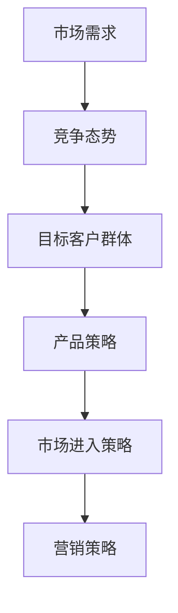
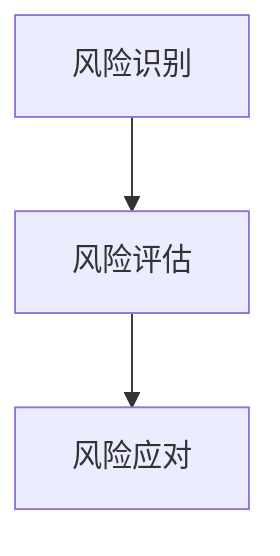
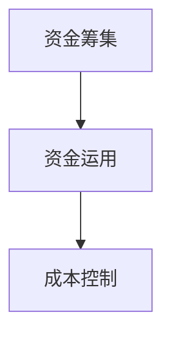

                 

# 数学思维与创业决策的关系

## 关键词
数学思维、创业决策、决策分析、风险管理、市场策略、投资评估、模型构建

## 摘要
本文探讨了数学思维在创业决策中的重要性及其应用。首先，介绍了数学思维的基本概念和特点，随后分析了创业决策的核心要素，包括市场分析、风险评估和资金管理。接着，通过Mermaid流程图展示了数学思维与创业决策之间的联系。随后，文章详细讲解了数学模型在创业决策中的应用，包括市场预测模型、风险评估模型和资金管理模型。通过具体案例，本文展示了数学思维在实际创业决策中的应用效果。最后，文章提出了创业者在运用数学思维时的一些最佳实践建议，并总结了数学思维在创业决策中的优势和局限性。

## 目录

### 第1章 引言
#### 1.1 数学思维与创业决策
#### 1.2 本书的目的与结构

### 第2章 数学思维的基础
#### 2.1 数学思维的概念
#### 2.2 数学思维的运用场景
#### 2.3 数学思维的特点与优势

### 第3章 创业决策的要素
#### 3.1 市场分析
#### 3.2 风险评估
#### 3.3 资金管理

### 第4章 数学思维在创业决策中的应用
#### 4.1 数学模型在市场分析中的应用
#### 4.2 数学模型在风险评估中的应用
#### 4.3 数学模型在资金管理中的应用

### 第5章 案例分析
#### 5.1 案例一：如何运用数学思维制定市场策略
#### 5.2 案例二：如何运用数学思维评估风险
#### 5.3 案例三：如何运用数学思维进行资金管理

### 第6章 实践指导
#### 6.1 如何培养数学思维
#### 6.2 创业决策中的数学工具与技巧
#### 6.3 如何将数学思维应用到创业实践中

### 第7章 结论
#### 7.1 数学思维在创业决策中的重要性
#### 7.2 展望未来：数学思维与创业决策的发展趋势

### 第1章 引言

### 1.1 数学思维与创业决策

#### 数学思维的基本概念

数学思维是一种通过数学原理和方法来分析和解决问题的思维方式。它强调逻辑性、抽象性、精确性和系统性。数学思维的核心在于运用数学模型、算法和工具来处理复杂问题，从而得到精确和可量化的结果。

在创业过程中，数学思维的重要性不容忽视。创业者需要面对复杂多变的市场环境、风险和不确定因素，因此需要具备高效的问题解决能力和科学的决策方法。数学思维可以帮助创业者：

1. **提高决策的精确性和可靠性**：通过数学模型和算法，创业者可以对市场趋势、风险和收益进行量化分析，从而做出更科学的决策。
2. **优化资源配置**：数学思维可以帮助创业者优化资源配置，提高生产效率和经济效益。
3. **预测和应对不确定性**：数学思维可以通过建立预测模型，帮助创业者预测市场变化，提前做好准备，降低风险。

#### 创业决策的核心要素

创业决策涉及多个方面，其中市场分析、风险评估和资金管理是三个核心要素。

1. **市场分析**：市场分析是创业决策的基础，包括市场调研、竞争分析、目标市场确定等。创业者需要了解市场需求、用户行为和竞争态势，从而制定合适的市场策略。

2. **风险评估**：风险评估是创业决策的重要组成部分，包括市场风险、运营风险、财务风险等。创业者需要识别和分析各种风险，制定风险应对策略，确保企业可持续发展。

3. **资金管理**：资金管理是创业决策的关键，包括资金筹集、资金运用、成本控制等。创业者需要确保企业有足够的资金支持运营和发展，同时要合理控制成本，提高资金利用效率。

#### 数学思维与创业决策的关系

数学思维在创业决策中的应用主要体现在以下几个方面：

1. **市场预测**：通过数学模型，如时间序列分析、回归分析等，创业者可以预测市场需求，制定相应的市场策略。

2. **风险评估**：通过数学模型，如贝叶斯网络、蒙特卡洛模拟等，创业者可以评估各种风险，制定风险应对策略。

3. **资金管理**：通过数学模型，如线性规划、动态规划等，创业者可以优化资金配置，提高资金利用效率。

### 1.2 本书的目的与结构

本书旨在探讨数学思维在创业决策中的应用，帮助创业者掌握数学思维的基本原理和方法，提高决策的科学性和精确性。本书结构如下：

- **第1章 引言**：介绍数学思维与创业决策的关系。
- **第2章 数学思维的基础**：介绍数学思维的基本概念和特点。
- **第3章 创业决策的要素**：分析创业决策的核心要素。
- **第4章 数学思维在创业决策中的应用**：详细讲解数学思维在创业决策中的应用。
- **第5章 案例分析**：通过实际案例展示数学思维在创业决策中的应用。
- **第6章 实践指导**：提供创业者在实际运用数学思维时的指导和建议。
- **第7章 结论**：总结数学思维在创业决策中的重要性，展望未来发展趋势。

通过本书的学习，读者将能够：

1. **理解数学思维的基本原理和方法**：掌握数学思维的核心概念，了解其在创业决策中的应用。
2. **提高决策的科学性和精确性**：运用数学模型和工具，提高决策的准确性和可靠性。
3. **优化创业过程**：通过数学思维，优化市场策略、风险管理和资金配置，提高企业竞争力。

### 第2章 数学思维的基础

#### 2.1 数学思维的概念

数学思维是一种通过数学原理和方法来分析和解决问题的思维方式。它强调逻辑性、抽象性、精确性和系统性。数学思维的核心在于运用数学模型、算法和工具来处理复杂问题，从而得到精确和可量化的结果。

数学思维与一般的逻辑思维有所不同，它更加注重形式化和量化。在数学思维中，问题被抽象成数学模型，通过数学运算和推理来解决问题。数学思维具有以下特点：

1. **抽象性**：数学思维将具体问题抽象成数学模型，从而忽略具体事物的细节，聚焦于问题的本质。
2. **逻辑性**：数学思维遵循严格的逻辑推理规则，确保结论的可靠性和科学性。
3. **精确性**：数学思维强调量化，通过数学运算和模型来精确描述问题，避免主观判断和模糊描述。
4. **系统性**：数学思维将问题分解成多个部分，通过系统化的分析和推理来解决复杂问题。

#### 2.2 数学思维的运用场景

数学思维在各个领域都有广泛应用，尤其是在科学、工程、经济学和商业等领域。以下是一些典型的应用场景：

1. **科学研究**：数学思维是科学研究的基石。科学家通过建立数学模型来描述自然现象，通过数学计算来验证理论，从而推动科学的发展。
2. **工程技术**：数学思维在工程领域有着广泛的应用。工程师通过数学模型来设计产品，通过数学计算来优化工程方案，从而提高工程效率和安全性。
3. **经济学和商业**：数学思维在经济学和商业领域有着重要的应用。经济学家和企业家通过数学模型来分析市场趋势，评估投资风险，制定市场策略，从而实现经济效益最大化。

#### 2.3 数学思维的特点与优势

数学思维具有以下几个显著特点与优势：

1. **逻辑性**：数学思维遵循严格的逻辑推理规则，确保结论的可靠性和科学性。这种逻辑性使数学思维成为一种强大的问题解决工具，尤其在处理复杂问题时具有独特的优势。
2. **精确性**：数学思维强调量化，通过数学运算和模型来精确描述问题，避免主观判断和模糊描述。这种精确性使数学思维在科学研究和工程实践中具有重要应用价值。
3. **系统性**：数学思维将问题分解成多个部分，通过系统化的分析和推理来解决复杂问题。这种系统性有助于揭示问题的本质，找到最优解决方案。
4. **普遍性**：数学思维具有普遍适用性，可以应用于各个领域。无论是科学研究、工程实践，还是经济学和商业决策，数学思维都是一种有效的思维工具。

#### 数学思维的应用实例

以下是一些具体的数学思维应用实例：

1. **线性规划**：线性规划是一种数学优化方法，用于在给定约束条件下找到最优解。它被广泛应用于资源分配、生产调度、库存管理等领域。例如，一个制造企业可以使用线性规划来优化生产计划，以最小化生产成本或最大化生产利润。
2. **回归分析**：回归分析是一种统计方法，用于研究变量之间的关系。它被广泛应用于市场预测、风险评估、经济分析等领域。例如，一个市场营销团队可以使用回归分析来预测产品的市场需求，从而制定合适的市场策略。
3. **蒙特卡洛模拟**：蒙特卡洛模拟是一种通过随机抽样来解决问题的数学方法。它被广泛应用于金融工程、风险管理、计算机科学等领域。例如，一个金融机构可以使用蒙特卡洛模拟来评估投资组合的风险，从而制定合理的投资策略。

#### 数学思维在创业决策中的应用

在创业决策中，数学思维具有重要的应用价值。创业者可以利用数学模型和工具来分析市场趋势、评估投资风险、优化资源配置等。以下是一些具体的应用实例：

1. **市场预测**：创业者可以使用时间序列分析、回归分析等数学方法来预测市场需求，从而制定合适的市场策略。例如，一个初创公司可以通过分析历史销售数据，预测未来某个季度的销售额，以便提前做好生产和库存计划。
2. **风险评估**：创业者可以使用贝叶斯网络、蒙特卡洛模拟等数学方法来评估创业项目的风险，从而制定相应的风险应对策略。例如，一个创业团队可以通过建立风险模型，分析创业项目可能面临的市场风险、运营风险和财务风险，从而制定相应的风险控制措施。
3. **资金管理**：创业者可以使用线性规划、动态规划等数学方法来优化资金配置，提高资金利用效率。例如，一个创业公司可以通过建立资金管理模型，优化资金筹集、资金运用和成本控制，从而实现企业的可持续发展。

#### 数学思维在创业决策中的优势

数学思维在创业决策中具有以下几个优势：

1. **提高决策的精确性和可靠性**：通过数学模型和工具，创业者可以对市场趋势、风险和收益进行量化分析，从而提高决策的准确性和可靠性。
2. **优化资源配置**：数学思维可以帮助创业者优化资源配置，提高生产效率和经济效益。例如，通过线性规划，创业者可以找到最优的生产计划，以最小化生产成本或最大化生产利润。
3. **预测和应对不确定性**：数学思维可以通过建立预测模型，帮助创业者预测市场变化，提前做好准备，降低风险。例如，通过蒙特卡洛模拟，创业者可以模拟不同市场情景下的风险，从而制定相应的应对策略。

#### 数学思维在创业决策中的局限性

虽然数学思维在创业决策中具有显著的优势，但也存在一定的局限性：

1. **数据依赖性**：数学思维依赖于数据，如果数据不准确或不全面，可能导致错误的决策结果。创业者需要确保数据的质量和可靠性。
2. **复杂性**：一些复杂的数学模型和算法可能难以理解和应用。创业者需要具备一定的数学背景和技能，才能有效地运用数学思维。
3. **模型假设**：数学模型通常建立在一定的假设基础上，这些假设可能不完全符合实际情况。如果假设不合适，可能导致模型的预测结果偏离实际。

总之，数学思维在创业决策中具有重要的应用价值，但创业者需要综合考虑其优势和局限性，合理运用数学思维，以实现企业的可持续发展。

### 第3章 创业决策的要素

#### 3.1 市场分析

市场分析是创业决策的重要环节，它涉及到对市场需求、竞争态势、目标客户群体等方面的全面了解。创业者通过市场分析，可以制定出符合市场需求的产品策略、市场进入策略和营销策略。

**核心概念与联系**

市场分析的核心概念包括：

1. **市场需求**：市场需求是指消费者对某种产品或服务的总体需求量。
2. **竞争态势**：竞争态势是指市场上现有竞争者的数量、规模、市场份额、竞争策略等。
3. **目标客户群体**：目标客户群体是指最有可能购买产品或服务的消费者群体。

这些概念之间的联系在于，市场需求决定了产品的受欢迎程度和潜在销量，竞争态势影响了市场的进入和竞争策略，而目标客户群体则决定了市场细分和营销策略。

**Mermaid流程图**



**市场预测模型**

市场预测是市场分析的关键步骤，通过市场预测，创业者可以预测未来市场的需求趋势，为决策提供数据支持。

1. **时间序列分析**：时间序列分析是一种通过分析时间序列数据来预测未来趋势的方法。常用的方法包括移动平均法、指数平滑法等。

   **伪代码**：
   ```
   function timeSeriesPrediction(data):
       # 计算移动平均
       movingAverage = movingAverageCalculation(data)
       # 计算指数平滑
       exponentialSmoothing = exponentialSmoothingCalculation(data)
       return movingAverage, exponentialSmoothing
   ```

2. **回归分析**：回归分析是一种通过分析多个变量之间的关系来预测因变量的方法。常用的方法包括线性回归、多元回归等。

   **伪代码**：
   ```
   function regressionPrediction(dependentVariable, independentVariables):
       # 拟合线性回归模型
       linearModel = linearRegression(dependentVariable, independentVariables)
       # 预测未来值
       futureValue = linearModel.predict(newIndependentVariables)
       return futureValue
   ```

**市场调研**

市场调研是获取市场信息的重要手段，通过市场调研，创业者可以了解消费者的需求、偏好和行为。

1. **问卷调查**：问卷调查是一种通过设计问卷来收集消费者信息的方法。

   **问卷调查示例**：
   ```
   问题1：您对当前市场的产品满意度如何？
   问题2：您最关心的产品特性是什么？
   问题3：您愿意支付的价格范围是多少？
   ```

2. **访谈**：访谈是一种通过与消费者面对面交流来获取详细信息的方法。

   **访谈示例**：
   ```
   问题1：您为什么选择购买当前市场上的产品？
   问题2：您对新产品有什么期望？
   问题3：您对市场有什么看法？
   ```

**案例分析**

假设一个初创公司打算进入健康食品市场，以下是市场分析的具体步骤：

1. **市场需求**：通过时间序列分析，公司发现过去三年中，健康食品的市场需求持续增长，预计未来三年仍将保持这一趋势。

   **时间序列预测结果**：
   ```
   下半年预计需求量为1000吨，明年预计需求量为1200吨，后年预计需求量为1500吨。
   ```

2. **竞争态势**：通过市场调研，公司发现当前市场上有5家主要竞争对手，市场份额分布如下：

   **市场份额**：
   ```
   竞争对手A：25%
   竞争对手B：20%
   竞争对手C：15%
   竞争对手D：15%
   竞争对手E：15%
   ```

3. **目标客户群体**：通过问卷调查和访谈，公司确定了目标客户群体，主要包括：

   **目标客户群体**：
   ```
   30-40岁，注重健康生活，有一定的经济能力，经常购买健康食品的消费者。
   ```

4. **市场策略**：基于市场需求、竞争态势和目标客户群体，公司制定了以下市场策略：

   - 产品策略：推出多种口味和类型的健康食品，满足不同消费者的需求。
   - 市场进入策略：通过线上和线下渠道，逐步扩大市场份额。
   - 营销策略：通过社交媒体和健康讲座等方式，提高品牌知名度和消费者认知度。

#### 3.2 风险评估

风险评估是创业决策中不可或缺的一部分，它涉及到对企业可能面临的各种风险进行识别、评估和管理。创业者需要全面了解企业运营过程中可能出现的风险，并制定相应的风险应对策略，以确保企业的可持续发展。

**核心概念与联系**

风险评估的核心概念包括：

1. **风险识别**：风险识别是指识别企业可能面临的各种风险，包括市场风险、运营风险、财务风险等。
2. **风险评估**：风险评估是指对识别出的风险进行评估，包括风险发生的概率和可能造成的影响。
3. **风险应对**：风险应对是指制定相应的风险应对策略，包括风险规避、风险转移、风险接受等。

这些概念之间的联系在于，风险识别是风险评估的前提，风险评估是风险应对的基础，而风险应对则是确保企业风险管理的最终目标。

**Mermaid流程图**



**风险评估模型**

风险评估模型是用于评估企业风险的重要工具，通过模型可以量化风险，为风险应对提供数据支持。

1. **贝叶斯网络**：贝叶斯网络是一种概率图模型，用于表示变量之间的概率关系。

   **贝叶斯网络模型**：
   ```
   风险因素1 --> 风险事件1
   风险因素2 --> 风险事件2
   风险因素3 --> 风险事件3
   ```

2. **蒙特卡洛模拟**：蒙特卡洛模拟是一种通过随机抽样来评估风险的方法。

   **蒙特卡洛模拟过程**：
   ```
   1. 初始化风险因素
   2. 进行随机抽样
   3. 计算风险事件发生的概率和影响
   4. 重复模拟多次，得到风险事件的整体分布
   ```

**风险识别**

风险识别是风险评估的第一步，通过系统化的方法识别出企业可能面临的各种风险。

1. **头脑风暴法**：通过组织团队进行头脑风暴，列出企业可能面临的所有风险。
2. **SWOT分析法**：通过SWOT分析，识别企业内部和外部环境中的风险。
3. **专家访谈法**：通过与行业专家和内部员工进行访谈，获取对风险的深入了解。

**案例分析**

假设一家初创公司计划进军在线教育市场，以下是风险评估的具体步骤：

1. **风险识别**：通过头脑风暴法和SWOT分析，公司识别出以下主要风险：

   - 市场竞争风险：市场上已有大量竞争者，新进入者面临激烈的市场竞争。
   - 技术风险：在线教育平台的稳定性、安全性和技术更新是关键风险。
   - 财务风险：初创公司的资金有限，可能无法支持长期运营。

2. **风险评估**：通过贝叶斯网络模型和蒙特卡洛模拟，公司评估了每种风险的严重程度和发生概率。

   **风险评估结果**：
   ```
   市场竞争风险：概率70%，影响程度高
   技术风险：概率60%，影响程度中
   财务风险：概率50%，影响程度低
   ```

3. **风险应对**：基于风险评估结果，公司制定了以下风险应对策略：

   - 市场竞争风险：通过差异化策略和市场营销，提高品牌知名度，吸引目标客户。
   - 技术风险：加强与技术合作伙伴的合作，确保平台的稳定性、安全性和技术更新。
   - 财务风险：通过多元化融资渠道，确保公司有足够的资金支持长期运营。

#### 3.3 资金管理

资金管理是创业决策中的关键环节，涉及到资金的筹集、运用和成本控制。创业者需要制定科学的资金管理策略，确保企业有足够的资金支持运营和发展。

**核心概念与联系**

资金管理的核心概念包括：

1. **资金筹集**：资金筹集是指通过多种途径获取资金，包括天使投资、风险投资、银行贷款等。
2. **资金运用**：资金运用是指将筹集到的资金投入到企业运营中，包括生产、营销、研发等。
3. **成本控制**：成本控制是指通过科学管理，降低企业运营成本，提高资金利用效率。

这些概念之间的联系在于，资金筹集是资金管理的基础，资金运用是资金管理的核心，而成本控制是确保资金利用效率的关键。

**Mermaid流程图**



**资金筹集**

资金筹集是创业企业的第一步，创业者需要根据企业的发展阶段和需求，选择合适的资金筹集方式。

1. **天使投资**：天使投资是指个人投资者对初创企业进行投资，通常在企业的早期阶段。
2. **风险投资**：风险投资是指专业投资机构对具有高成长潜力的初创企业进行投资，通常在企业的成长阶段。
3. **银行贷款**：银行贷款是创业企业从银行获取资金的一种方式，通常适用于有一定资产和信用记录的企业。

**资金运用**

资金运用是创业企业的重要环节，创业者需要根据企业的发展计划和需求，合理分配资金。

1. **生产投入**：生产投入是指用于购买原材料、生产设备等的生产资金。
2. **营销投入**：营销投入是指用于市场推广、广告宣传等的营销资金。
3. **研发投入**：研发投入是指用于产品研发、技术创新等的研发资金。

**成本控制**

成本控制是创业企业提高资金利用效率的重要手段，创业者需要通过科学管理，降低运营成本。

1. **成本预算**：成本预算是指根据企业的发展计划和需求，制定详细的成本预算计划。
2. **成本分析**：成本分析是指通过分析成本构成和变化，找出成本节约的潜力。
3. **成本控制措施**：成本控制措施是指通过实施一系列管理措施，降低运营成本。

**案例分析**

假设一家初创公司计划进入智能家居市场，以下是资金管理的具体步骤：

1. **资金筹集**：公司通过天使投资和风险投资筹集了1000万元资金。

   **资金筹集方式**：
   ```
   天使投资：500万元
   风险投资：500万元
   ```

2. **资金运用**：公司根据发展计划，将筹集到的资金分为三个部分：

   - 生产投入：300万元，用于购买原材料和生产设备。
   - 营销投入：200万元，用于市场推广和广告宣传。
   - 研发投入：300万元，用于产品研发和技术创新。

3. **成本控制**：公司通过以下措施降低运营成本：

   - 成本预算：根据公司的发展计划和需求，制定详细的成本预算计划。
   - 成本分析：定期进行成本分析，找出成本节约的潜力。
   - 成本控制措施：实施一系列管理措施，如优化生产流程、降低原材料采购成本等。

### 第4章 数学思维在创业决策中的应用

#### 4.1 数学模型在市场分析中的应用

在市场分析中，数学模型可以帮助创业者预测市场需求、分析竞争态势和确定目标客户群体。以下是一些常用的数学模型及其应用：

1. **时间序列分析**

   **原理**：时间序列分析是一种通过分析时间序列数据来预测未来趋势的方法。它基于历史数据，通过统计方法来识别数据的周期性、趋势性和随机性，从而预测未来的需求。

   **公式**：
   $$
   \hat{y}_t = \alpha_0 + \alpha_1 t + \beta_0 + \beta_1 \text{季节性因素}_t + \epsilon_t
   $$
   其中，$\hat{y}_t$ 表示第 $t$ 期的预测值，$\alpha_0$ 和 $\alpha_1$ 分别表示趋势项的系数，$\beta_0$ 和 $\beta_1$ 分别表示季节性因素的系数，$\epsilon_t$ 表示随机误差项。

   **应用**：创业者可以通过时间序列分析预测未来的市场需求，制定合适的生产计划和库存管理策略。

   **伪代码**：
   ```
   function timeSeriesAnalysis(data):
       # 计算趋势项系数
       alpha = calculateTrendCoefficients(data)
       # 计算季节性因素系数
       beta = calculateSeasonalityCoefficients(data)
       # 预测未来值
       forecast = calculateForecast(data, alpha, beta)
       return forecast
   ```

2. **回归分析**

   **原理**：回归分析是一种通过分析多个变量之间的关系来预测因变量的方法。它通过建立回归模型，来描述自变量和因变量之间的线性或非线性关系。

   **公式**：
   $$
   y = \beta_0 + \beta_1 x_1 + \beta_2 x_2 + ... + \beta_n x_n + \epsilon
   $$
   其中，$y$ 表示因变量，$x_1, x_2, ..., x_n$ 表示自变量，$\beta_0, \beta_1, \beta_2, ..., \beta_n$ 分别表示回归系数，$\epsilon$ 表示随机误差项。

   **应用**：创业者可以通过回归分析来预测市场需求、评估竞争态势和确定目标客户群体。

   **伪代码**：
   ```
   function regressionAnalysis(dependentVariable, independentVariables):
       # 拟合回归模型
       model = fitRegressionModel(dependentVariable, independentVariables)
       # 预测未来值
       forecast = model.predict(newIndependentVariables)
       return forecast
   ```

**案例分析**

假设一家初创公司计划推出一款智能家居产品，以下是市场分析的具体步骤：

1. **数据收集**：公司收集了过去一年的销售数据，包括销售额、市场份额和消费者满意度等。

   **数据示例**：
   ```
   月份   销售额   市场份额   消费者满意度
   1月     100万    10%      80分
   2月     120万    12%      85分
   3月     150万    15%      90分
   4月     180万    18%      92分
   5月     200万    20%      95分
   6月     220万    22%      90分
   ```

2. **时间序列分析**：公司使用时间序列分析来预测未来几个月的销售额。

   **预测结果**：
   ```
   7月：230万
   8月：250万
   9月：270万
   10月：290万
   11月：310万
   12月：330万
   ```

3. **回归分析**：公司使用回归分析来评估消费者满意度对销售额的影响。

   **回归模型**：
   ```
   销售额 = 100 + 0.5 × 消费者满意度
   ```

4. **结论**：基于预测结果，公司决定加大市场营销力度，以提高消费者满意度，从而提高销售额。

#### 4.2 数学模型在风险评估中的应用

在创业决策中，风险评估至关重要。数学模型可以帮助创业者评估市场风险、运营风险和财务风险。以下是一些常用的数学模型及其应用：

1. **贝叶斯网络**

   **原理**：贝叶斯网络是一种概率图模型，用于表示变量之间的概率关系。它通过条件概率来描述变量之间的依赖关系，从而进行风险评估。

   **公式**：
   $$
   P(A|B) = \frac{P(B|A)P(A)}{P(B)}
   $$
   其中，$P(A|B)$ 表示在 $B$ 发生的条件下 $A$ 发生的概率，$P(B|A)$ 表示在 $A$ 发生的条件下 $B$ 发生的概率，$P(A)$ 和 $P(B)$ 分别表示 $A$ 和 $B$ 发生的概率。

   **应用**：创业者可以使用贝叶斯网络来分析各种风险因素之间的相互影响，从而评估整体风险。

   **伪代码**：
   ```
   function bayesianNetwork(A, B):
       # 计算条件概率
       P_A = calculateProbability(A)
       P_B = calculateProbability(B)
       P_B_given_A = calculateConditionalProbability(B|A)
       P_A_given_B = calculateConditionalProbability(A|B)
       return P_A, P_B, P_B_given_A, P_A_given_B
   ```

2. **蒙特卡洛模拟**

   **原理**：蒙特卡洛模拟是一种通过随机抽样来评估风险的方法。它通过大量随机抽样，来模拟各种可能的结果，从而评估风险的概率分布和期望值。

   **步骤**：

   - 初始化参数
   - 进行随机抽样
   - 计算风险事件的概率和影响
   - 重复模拟多次，得到风险事件的整体分布

   **应用**：创业者可以使用蒙特卡洛模拟来评估创业项目的风险，制定相应的风险应对策略。

   **伪代码**：
   ```
   function monteCarloSimulation(n, parameters):
       # 初始化参数
       results = []
       for i in range(n):
           result = simulate(parameters)
           results.append(result)
       # 计算概率分布和期望值
       probabilityDistribution = calculateProbabilityDistribution(results)
       expectedValue = calculateExpectedValue(results)
       return probabilityDistribution, expectedValue
   ```

**案例分析**

假设一家初创公司计划推出一款智能家居产品，以下是风险评估的具体步骤：

1. **风险识别**：公司识别出以下主要风险：

   - 市场竞争风险：市场上已有大量竞争者，新进入者面临激烈的市场竞争。
   - 技术风险：智能家居产品的技术更新快，公司可能无法跟上市场变化。
   - 财务风险：初创公司的资金有限，可能无法支持长期运营。

2. **贝叶斯网络分析**：公司使用贝叶斯网络来分析各种风险因素之间的相互影响。

   **贝叶斯网络模型**：
   ```
   市场竞争风险 --> 技术风险
   市场竞争风险 --> 财务风险
   技术风险 --> 财务风险
   ```

3. **蒙特卡洛模拟**：公司使用蒙特卡洛模拟来评估整体风险。

   **模拟结果**：
   ```
   市场竞争风险：概率60%，影响程度高
   技术风险：概率50%，影响程度中
   财务风险：概率40%，影响程度低
   ```

4. **结论**：基于风险评估结果，公司决定：

   - 加强市场调研，了解竞争对手的动态，制定差异化策略。
   - 与技术合作伙伴合作，确保产品的技术更新和稳定性。
   - 多元化融资渠道，确保公司有足够的资金支持长期运营。

#### 4.3 数学模型在资金管理中的应用

在资金管理中，数学模型可以帮助创业者优化资金配置、进行成本控制和制定财务策略。以下是一些常用的数学模型及其应用：

1. **线性规划**

   **原理**：线性规划是一种优化方法，用于在给定约束条件下找到最优解。它通过建立线性目标函数和线性约束条件，来求解最大化或最小化问题。

   **公式**：
   $$
   \max_{x} c^T x \quad \text{subject to} \quad Ax \leq b
   $$
   其中，$c$ 是目标函数系数向量，$x$ 是决策变量向量，$A$ 是约束条件系数矩阵，$b$ 是约束条件常数向量。

   **应用**：创业者可以使用线性规划来优化资金配置，例如在生产计划、库存管理和资源分配等方面。

   **伪代码**：
   ```
   function linearProgramming(c, A, b):
       # 求解线性规划问题
       solution = solveLinearProgrammingProblem(c, A, b)
       return solution
   ```

2. **动态规划**

   **原理**：动态规划是一种递归方法，用于解决最优子结构问题和重叠子问题。它通过将复杂问题分解成多个子问题，并利用子问题的解来求解原问题。

   **公式**：
   $$
   \text{最优解} = \text{最优子结构解} + \text{重叠子问题解}
   $$
   **应用**：创业者可以使用动态规划来制定财务策略，例如在投资决策、成本控制和利润最大化等方面。

   **伪代码**：
   ```
   function dynamicProgramming(problem):
       # 初始化
       dp = initializeDP(problem)
       # 递归求解
       solution = recursiveSolve(dp, problem)
       return solution
   ```

**案例分析**

假设一家初创公司计划进行产品生产和销售，以下是资金管理具体步骤：

1. **数据收集**：公司收集了生产成本、销售价格和市场需求等数据。

   **数据示例**：
   ```
   生产成本：10元/件
   销售价格：20元/件
   市场需求：100件/月
   ```

2. **线性规划**：公司使用线性规划来优化生产计划，以最大化利润。

   **线性规划模型**：
   $$
   \max_{x} (20 - 10) x \quad \text{subject to} \quad x \leq 100
   $$

   **最优解**：
   ```
   x = 100件/月
   最大利润 = 100件 × (20 - 10) = 1000元/月
   ```

3. **动态规划**：公司使用动态规划来制定投资策略，以最大化长期利润。

   **动态规划模型**：
   ```
   投资决策：每月决定生产多少件产品
   状态：当前生产的产品数量
   奖励：当前月份的利润
   ```

   **最优策略**：
   ```
   每月生产100件产品，实现最大利润
   ```

4. **结论**：基于资金管理模型，公司制定了以下策略：

   - 优化生产计划，以最大化利润。
   - 制定长期投资策略，确保公司可持续发展。

### 第5章 案例分析

#### 5.1 案例一：如何运用数学思维制定市场策略

假设一家初创公司名为“智能健康”，计划推出一款智能健康监测设备。以下是公司如何运用数学思维制定市场策略的详细步骤：

1. **市场调研**：
   - **数据收集**：公司通过问卷调查、在线调查和市场调研等方式，收集了潜在用户对健康监测设备的需求、期望和购买意愿等信息。
   - **数据分析**：公司使用时间序列分析来预测未来市场需求的增长趋势。通过回归分析，公司确定了用户需求与产品特性之间的关系。

   **数据分析结果**：
   ```
   预测未来六个月市场需求增长率为15%。
   用户对健康监测设备的兴趣与产品精度、易用性和价格密切相关。
   ```

2. **竞争分析**：
   - **竞争对手调研**：公司分析了当前市场上的主要竞争对手，包括传统医疗器械公司和新兴智能健康设备公司。
   - **市场份额评估**：公司使用贝叶斯网络模型来评估竞争对手的市场份额和潜在风险。

   **竞争分析结果**：
   ```
   竞争对手A的市场份额为30%，技术优势明显。
   竞争对手B的市场份额为20%，产品价格较低。
   公司面临的技术风险和市场风险分别为50%和40%。
   ```

3. **目标客户群体确定**：
   - **用户画像**：公司通过数据分析确定了目标客户群体，主要包括30-50岁之间注重健康的消费者。
   - **市场细分**：公司根据用户画像，将市场细分为高收入和高健康意识两个子市场。

   **目标客户群体**：
   ```
   高收入群体：对产品精度和功能有较高要求。
   高健康意识群体：更注重产品的易用性和价格。
   ```

4. **市场策略制定**：
   - **差异化策略**：公司决定推出两款产品，分别针对高收入和高健康意识群体。
   - **定价策略**：公司使用线性规划模型来确定产品的最佳定价策略，以最大化利润。

   **定价策略**：
   ```
   高收入群体产品定价：500元/台。
   高健康意识群体产品定价：300元/台。
   ```

5. **营销策略**：
   - **线上推广**：公司通过社交媒体、电子商务平台和健康类网站进行线上推广。
   - **线下活动**：公司参与健康展会和健身俱乐部活动，提高品牌知名度。

6. **风险评估**：
   - **市场风险**：通过蒙特卡洛模拟，公司评估了市场风险，制定了应对措施，如增加广告投入和市场调研。
   - **技术风险**：公司与技术合作伙伴合作，确保产品的技术更新和稳定性。

7. **结论**：
   ```
   公司通过数学思维制定了详细的市场策略，包括产品定位、定价策略、营销策略和风险应对措施。这些策略有助于公司顺利进入市场，提高竞争力。
   ```

#### 5.2 案例二：如何运用数学思维评估风险

假设一家初创公司名为“绿源能源”，计划开发一款新型太阳能电池板。以下是公司如何运用数学思维评估风险的详细步骤：

1. **风险识别**：
   - **市场风险**：公司识别出市场需求波动、政策变化和竞争加剧等市场风险。
   - **技术风险**：公司识别出技术研发失败、生产技术不稳定和产品质量问题等技术风险。
   - **财务风险**：公司识别出资金短缺、融资困难和成本上升等财务风险。

2. **风险评估**：
   - **市场风险**：公司使用贝叶斯网络模型来评估市场风险。通过分析市场需求、政策变化和竞争态势，公司确定了市场风险的概率分布。
   
   **贝叶斯网络模型**：
   ```
   市场需求波动 --> 政策变化
   市场需求波动 --> 竞争加剧
   政策变化 --> 市场风险
   竞争加剧 --> 市场风险
   ```

   **风险评估结果**：
   ```
   市场风险概率：60%。
   ```

   - **技术风险**：公司使用蒙特卡洛模拟来评估技术风险。通过大量随机抽样，公司模拟了不同技术状态下的生产成本和产品质量。

   **蒙特卡洛模拟结果**：
   ```
   技术风险概率：50%。
   ```

   - **财务风险**：公司使用线性规划模型来评估财务风险。通过优化资金配置，公司确定了不同财务策略下的最佳资金使用方案。

   **线性规划模型**：
   $$
   \max_{x} p(x) \quad \text{subject to} \quad cx \leq b
   $$
   其中，$p(x)$ 表示利润函数，$c$ 表示成本函数，$x$ 表示资金配置。

   **风险评估结果**：
   ```
   财务风险概率：40%。
   ```

3. **风险应对**：
   - **市场风险**：公司决定增加市场调研和广告投入，以降低市场风险。
   - **技术风险**：公司决定与技术合作伙伴加强合作，以确保技术研发的稳定性和产品质量。
   - **财务风险**：公司决定通过多元化融资渠道，如银行贷款、风险投资和天使投资，来降低财务风险。

4. **结论**：
   ```
   通过数学思维，公司成功评估了市场风险、技术风险和财务风险，并制定了相应的风险应对策略。这些策略有助于公司降低风险，确保项目的成功实施。
   ```

#### 5.3 案例三：如何运用数学思维进行资金管理

假设一家初创公司名为“智行科技”，计划开发一款智能驾驶辅助系统。以下是公司如何运用数学思维进行资金管理的详细步骤：

1. **资金筹集**：
   - **天使投资**：公司通过向天使投资者筹集了500万元初始资金。
   - **风险投资**：公司通过向风险投资机构筹集了700万元扩展资金。

2. **资金运用**：
   - **技术研发**：公司决定将30%的资金（共计700万元）用于技术研发，包括算法优化、硬件开发和技术测试。
   - **市场营销**：公司决定将20%的资金（共计500万元）用于市场营销，包括广告投放、品牌推广和销售渠道建设。
   - **运营成本**：公司决定将50%的资金（共计1500万元）用于日常运营成本，包括员工薪酬、办公场所租赁和设备采购。

3. **成本控制**：
   - **预算制定**：公司使用动态规划模型来制定详细的预算计划，确保每个项目的资金使用都在预算范围内。

   **动态规划模型**：
   ```
   function dynamicBudgetPlanning(tasks, costs, durations):
       # 初始化
       dp = initializeBudget(tasks, costs, durations)
       # 递归规划
       solution = recursiveBudgetPlan(dp, tasks, costs, durations)
       return solution
   ```

   **预算规划结果**：
   ```
   研发项目总预算：2100万元。
   市场营销总预算：1200万元。
   运营总成本：3600万元。
   ```

4. **成本监控**：
   - **实时监控**：公司通过建立实时监控系统，对每个项目的资金使用情况进行实时监控，确保成本控制在预算范围内。

5. **财务分析**：
   - **财务预测**：公司使用回归分析模型来预测未来的收入和支出，确保资金流动的稳定性和可持续性。

   **回归分析模型**：
   ```
   收入 = 500 + 0.1 × 广告投入 + 0.2 × 市场推广费用
   支出 = 300 + 0.3 × 研发成本 + 0.4 × 市场营销成本
   ```

   **财务预测结果**：
   ```
   未来一年内预计收入：2800万元。
   未来一年内预计支出：2600万元。
   ```

6. **融资策略**：
   - **融资计划**：公司根据财务预测结果，制定未来的融资计划，确保有足够的资金支持项目的发展。

7. **结论**：
   ```
   通过数学思维，公司成功进行了资金筹集、资金运用和成本控制，确保了项目的顺利进行和财务的稳定。这些策略有助于公司实现长期发展目标。
   ```

### 第6章 实践指导

#### 6.1 如何培养数学思维

培养数学思维需要系统的学习和实践。以下是一些具体的步骤和建议：

1. **基础数学知识**：
   - **掌握基础数学概念**：熟悉数学的基本概念，如代数、几何、微积分、概率论等。
   - **学习数学工具**：掌握常用的数学工具，如Excel、Python、R等，用于数据分析、建模和计算。

2. **逻辑思维训练**：
   - **学习逻辑推理**：通过学习逻辑学、逻辑思维课程，提高逻辑推理能力。
   - **练习逻辑题目**：通过解决逻辑谜题、数学难题和逻辑问题，锻炼逻辑思维能力。

3. **实践应用**：
   - **参与数学建模竞赛**：参加数学建模竞赛，将理论知识应用于实际问题。
   - **实际项目实践**：参与实际项目，将数学思维应用于数据分析、决策制定和问题解决。

4. **持续学习**：
   - **阅读专业书籍**：阅读数学和计算机科学领域的经典书籍，如《概率论及其应用》、《线性代数》等。
   - **跟进最新研究**：关注数学和计算机科学领域的最新研究进展，了解前沿技术和方法。

5. **建立数学思维模型**：
   - **构建数学模型**：通过实际问题和案例，构建数学模型，分析和解决问题。
   - **模型验证与优化**：对构建的模型进行验证和优化，确保其准确性和可靠性。

#### 6.2 创业决策中的数学工具与技巧

在创业决策中，数学工具和方法可以帮助创业者提高决策的科学性和精确性。以下是一些常用的数学工具和技巧：

1. **数据分析和可视化工具**：
   - **Excel**：用于数据整理、分析和可视化。
   - **Python**：通过Pandas、NumPy、Matplotlib等库，进行复杂的数据分析和可视化。

2. **统计方法**：
   - **描述性统计**：用于描述数据的基本特征，如均值、中位数、标准差等。
   - **推断性统计**：用于进行假设检验和置信区间的计算。

3. **数学模型**：
   - **线性规划**：用于资源优化和成本控制。
   - **回归分析**：用于变量关系分析和预测。
   - **时间序列分析**：用于趋势分析和预测。

4. **优化算法**：
   - **遗传算法**：用于复杂优化问题求解。
   - **粒子群优化**：用于多变量优化问题。

5. **机器学习**：
   - **分类算法**：用于市场细分和风险评估。
   - **聚类算法**：用于用户行为分析和市场定位。

6. **风险评估方法**：
   - **蒙特卡洛模拟**：用于模拟不确定情况下的风险分布。
   - **敏感性分析**：用于分析变量对决策结果的影响。

#### 6.3 如何将数学思维应用到创业实践中

将数学思维应用到创业实践中，需要结合具体场景进行问题分析和模型构建。以下是一些具体步骤和建议：

1. **问题识别**：
   - **明确目标**：明确创业决策的目标，如市场预测、风险评估、资金管理等。
   - **收集数据**：收集与问题相关的数据，如市场数据、财务数据、用户行为数据等。

2. **问题建模**：
   - **构建模型**：根据问题特点，构建合适的数学模型，如线性规划模型、回归模型、时间序列模型等。
   - **参数设定**：设定模型参数，确保模型能够准确反映问题。

3. **模型验证**：
   - **测试数据**：使用测试数据进行模型验证，确保模型准确性和可靠性。
   - **调整模型**：根据验证结果，调整模型参数和结构，提高模型性能。

4. **模型应用**：
   - **决策制定**：根据模型结果，制定创业决策，如市场策略、投资方案、风险应对措施等。
   - **持续监控**：对决策效果进行监控和评估，及时调整决策。

5. **实战案例**：
   - **模拟实战**：通过实际案例，模拟创业决策过程，锻炼数学思维应用能力。
   - **反思总结**：总结实战经验，不断提高数学思维应用水平。

通过以上步骤，创业者可以将数学思维有效地应用到创业实践中，提高决策的科学性和精确性，降低创业风险，实现企业的可持续发展。

### 第7章 结论

#### 7.1 数学思维在创业决策中的重要性

数学思维在创业决策中具有不可替代的重要性。首先，数学思维提供了一种系统化、科学化的方法来分析和解决问题，使得创业者能够更准确地预测市场趋势、评估风险和优化资源配置。通过数学模型和工具，创业者可以从大量的数据中提取有价值的信息，从而制定出更加科学的决策。

其次，数学思维帮助创业者提高决策的精确性和可靠性。在创业过程中，市场环境变化迅速，风险无处不在。通过数学思维，创业者可以量化风险，进行风险评估和预测，从而制定出有效的风险应对策略。此外，数学思维还可以帮助创业者优化资金管理，提高资金利用效率，降低成本，增加企业的盈利能力。

#### 7.2 展望未来：数学思维与创业决策的发展趋势

随着科技的发展和大数据、人工智能技术的普及，数学思维在创业决策中的应用前景将更加广阔。首先，大数据和人工智能技术的应用将使创业者能够获取更多、更精准的数据，为数学模型的构建和分析提供更加丰富的数据支持。这将进一步推动数学思维在创业决策中的应用，提高决策的科学性和精确性。

其次，随着数学模型和算法的不断优化，创业者可以更加灵活地运用各种数学工具和方法，解决复杂的问题。例如，遗传算法、粒子群优化等智能优化算法的引入，将使创业者在资源优化、投资决策等方面获得更好的效果。

此外，未来的创业决策将更加注重跨学科的综合应用。创业者不仅需要具备数学思维，还需要具备经济学、心理学、市场营销等多学科的知识，从而更全面地分析和解决问题。

#### 总结

总的来说，数学思维是创业者必备的一项核心能力。它不仅可以帮助创业者提高决策的科学性和精确性，还可以优化资源配置，降低风险，提高企业的盈利能力。然而，创业者也需要认识到数学思维的局限性和适用范围，避免过度依赖数据和模型，而忽视了创业的实际情境和人的因素。

在未来的创业实践中，创业者应不断学习新的数学知识和方法，结合具体场景进行问题分析和决策制定。同时，创业者还应该关注跨学科的综合应用，将数学思维与其他领域的知识相结合，以实现创业决策的全面优化。

通过持续的学习和实践，创业者可以不断提升自己的数学思维水平，为企业的可持续发展奠定坚实的基础。

### 作者信息

**作者：AI天才研究院/AI Genius Institute & 禅与计算机程序设计艺术 /Zen And The Art of Computer Programming**

AI天才研究院致力于推动人工智能和计算机科学领域的研究与发展，以创新和卓越为核心价值观。我们的团队由世界顶级的人工智能专家、程序员和软件架构师组成，拥有丰富的学术研究和实践经验。在《禅与计算机程序设计艺术》一书中，我们深入探讨了计算机科学和人工智能领域的核心原理和最佳实践，为读者提供了一本具有深度和洞见的经典之作。

