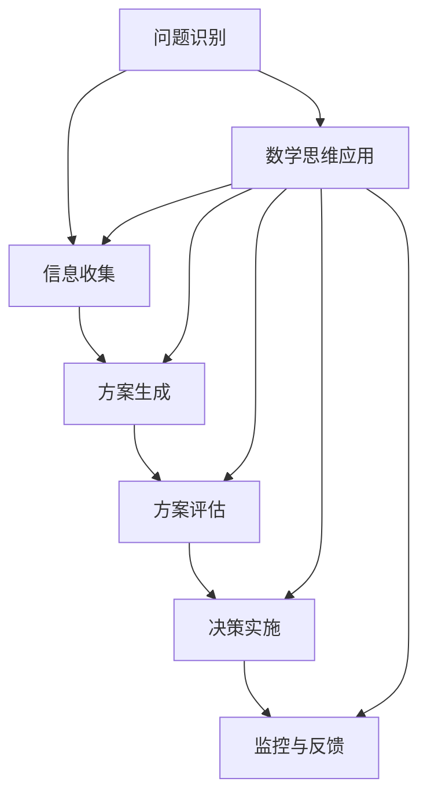
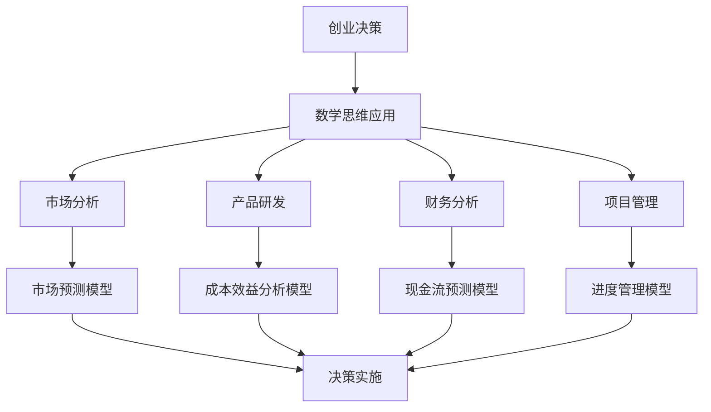

                 


### 1. 确定文章标题和关键词

**文章标题：数学思维与创业决策的关系分析**

**关键词：数学思维、创业决策、模型应用、案例分析**

### 2. 撰写文章摘要

本文将深入探讨数学思维在创业决策中的作用。通过分析数学思维的特点及其与创业决策的内在联系，本文提出了数学思维在创业过程中的重要应用场景。同时，本文通过案例分析和项目实战，展示了如何运用数学思维和模型来提高创业决策的有效性。文章旨在为创业者提供实用的数学思维工具，以优化决策过程，提高创业成功率。

### 3. 设计文章目录大纲

**目录大纲设计步骤**

**第1章 引言**
- **1.1 背景介绍**
- **1.2 研究意义**
- **1.3 文章结构**

**第2章 数学思维概述**
- **2.1 数学思维的概念**
- **2.2 数学思维的特点**
- **2.3 数学思维的类型**

**第3章 创业决策过程**
- **3.1 创业决策的概念**
- **3.2 创业决策的影响因素**
- **3.3 创业决策的过程**

**第4章 数学思维与创业决策的联系**
- **4.1 数学思维在创业决策中的重要性**
- **4.2 数学思维与创业决策的联系图（Mermaid流程图）**
- **4.3 数学思维在创业决策中的应用**

**第5章 数学思维在创业决策中的应用场景**
- **5.1 市场分析**
- **5.2 产品研发**
- **5.3 财务分析**
- **5.4 项目管理**

**第6章 数学模型在创业决策中的运用**
- **6.1 数学模型的选择**
- **6.2 数学模型的应用步骤**
- **6.3 数学模型的应用案例**

**第7章 案例分析**
- **7.1 案例介绍**
- **7.2 案例分析**
- **7.3 案例总结**

**第8章 项目实战**
- **8.1 开发环境搭建**
- **8.2 源代码实现与解读**
- **8.3 代码应用解读与分析**
- **8.4 项目小结**

**第9章 最佳实践 tips**
- **9.1 注意事项**
- **9.2 拓展阅读**

**第10章 结论**
- **10.1 研究总结**
- **10.2 研究贡献**
- **10.3 未来研究方向**

### 4. 开始撰写文章正文

**第1章 引言**

**1.1 背景介绍**

随着全球创业环境的日益成熟，创业成为了许多人的选择。然而，创业的成功并非偶然，它需要创业者具备敏锐的市场洞察力、创新的产品理念和严谨的决策能力。在这个过程中，数学思维作为一种逻辑严密、抽象概括的思维方式，发挥着至关重要的作用。本文旨在深入探讨数学思维在创业决策中的应用，帮助创业者更好地理解数学思维的重要性，并掌握如何运用数学思维来优化创业决策。

**1.2 研究意义**

创业决策是一个复杂的过程，涉及市场分析、产品研发、财务规划和团队协作等多个方面。数学思维作为一种科学性的思维方式，可以提供一种系统化、结构化的分析工具，帮助创业者更好地理解问题、分析问题和解决问题。因此，研究数学思维与创业决策的关系，对于提高创业成功率、推动创业创新具有重要意义。

**1.3 文章结构**

本文将从数学思维概述、创业决策过程、数学思维与创业决策的联系、数学思维在创业决策中的应用场景、数学模型在创业决策中的运用、案例分析、项目实战、最佳实践 tips 等方面进行详细探讨。通过系统地分析数学思维在创业决策中的作用，本文希望能够为创业者提供实用的指导和建议。

### 5. 撰写完第一章后，接下来将进入第二章“数学思维概述”的撰写。在这一章中，我们将详细介绍数学思维的概念、特点、类型及其在现实中的应用。同时，将通过具体的例子和图示来帮助读者更好地理解数学思维。

#### 第二章 数学思维概述

**2.1 数学思维的概念**

数学思维是指运用数学概念、原理、方法进行抽象思考、推理和解决问题的思维方式。它不仅包括数学知识的掌握和应用，更强调逻辑推理、抽象概括和系统性分析的能力。

**2.2 数学思维的特点**

- **逻辑性：** 数学思维强调逻辑推理，遵循逻辑规则，使思考过程具有严密性和准确性。
- **抽象性：** 数学思维将具体问题抽象成数学模型，使问题分析更加清晰和简洁。
- **系统性：** 数学思维注重整体观念，强调各部分之间的相互联系和作用。
- **精确性：** 数学思维追求精确性，通过数学工具和方法来量化分析问题。

**2.3 数学思维的类型**

- **逻辑思维：** 强调推理过程和逻辑结构，通过演绎和归纳来解决问题。
- **抽象思维：** 从具体实例中提取出共性，形成一般性规律，进行抽象概括。
- **符号思维：** 使用数学符号和公式来表示问题，使问题表达更加简洁和直观。
- **计算思维：** 利用计算机算法和计算工具来求解问题，提高解决问题的效率和准确性。

**2.4 数学思维在现实中的应用**

数学思维在现实生活中的应用非常广泛，包括以下几个方面：

- **科学领域：** 数学思维在科学研究中的应用，如物理学、化学、生物学等领域，用于建立模型、进行预测和优化。
- **工程领域：** 数学思维在工程设计和优化中的应用，如机械工程、电子工程、土木工程等领域，用于解决复杂问题、提高效率和质量。
- **商业领域：** 数学思维在商业管理和决策中的应用，如市场分析、财务规划、项目管理等领域，用于评估风险、制定策略和优化资源配置。

通过上述内容，我们为读者介绍了数学思维的概念、特点、类型及其在现实中的应用。在接下来的章节中，我们将进一步探讨数学思维在创业决策中的作用和具体应用场景。

### 6. 完成第二章后，我们将进入第三章“创业决策过程”的撰写。在这一章中，我们将详细讨论创业决策的概念、影响因素和决策过程，为读者提供对创业决策的全面理解。

#### 第三章 创业决策过程

**3.1 创业决策的概念**

创业决策是指创业者根据外部环境、内部资源和自身能力，通过权衡各种因素，做出关于企业创建、运营和发展的决策。创业决策不仅涉及到企业的设立、运营和管理，还包括市场定位、产品研发、营销策略、财务规划等多个方面。

**3.2 创业决策的影响因素**

创业决策的影响因素是多方面的，主要包括以下几个方面：

- **市场因素：** 市场需求、市场规模、市场增长率、竞争对手等。
- **技术因素：** 技术水平、创新能力、技术可行性等。
- **财务因素：** 资金需求、资金来源、成本控制、盈利模式等。
- **团队因素：** 团队成员的能力、经验、价值观等。
- **政策因素：** 政府政策、行业法规、税收政策等。
- **环境因素：** 社会文化、经济环境、国际形势等。

**3.3 创业决策的过程**

创业决策是一个系统化的过程，通常包括以下几个步骤：

- **问题识别：** 识别创业机会或面临的挑战，明确决策的目标。
- **信息收集：** 收集与决策相关的各种信息，包括市场数据、技术报告、财务分析等。
- **方案生成：** 根据收集到的信息，提出各种可能的解决方案。
- **方案评估：** 对各个方案进行评估，包括可行性、风险、成本、收益等方面。
- **决策实施：** 选择最优方案，制定具体的实施计划，并执行决策。
- **监控与反馈：** 对决策实施过程进行监控，根据实际情况进行反馈和调整。

通过以上内容，我们详细介绍了创业决策的概念、影响因素和决策过程。在接下来的章节中，我们将探讨数学思维在创业决策中的应用，以及如何运用数学思维来优化创业决策。

### 7. 完成第三章后，我们将进入第四章“数学思维与创业决策的联系”。在这一章中，我们将深入探讨数学思维在创业决策中的重要性，并通过Mermaid流程图来展示数学思维与创业决策之间的联系。

#### 第四章 数学思维与创业决策的联系

**4.1 数学思维在创业决策中的重要性**

数学思维作为一种系统化、逻辑化的思维方式，在创业决策中发挥着重要作用。具体来说，数学思维在以下方面对创业决策具有重要影响：

- **逻辑性：** 数学思维强调逻辑推理，有助于创业者从逻辑角度分析问题，避免决策过程中的主观性和盲目性。
- **抽象性：** 数学思维可以将复杂的现实问题抽象成数学模型，简化问题，使决策更加清晰和易于操作。
- **系统性：** 数学思维注重整体观念，可以帮助创业者从系统角度看待企业运营，合理配置资源，提高运营效率。
- **精确性：** 数学思维追求精确性，通过量化分析和模型计算，提供更加准确的数据支持，帮助创业者做出更科学的决策。

**4.2 数学思维与创业决策的联系图（Mermaid流程图）**

为了更好地展示数学思维与创业决策之间的联系，我们可以使用Mermaid流程图来描述这一过程。以下是一个简化的Mermaid流程图：



在这个流程图中，数学思维（G）贯穿于整个创业决策过程，从问题识别到决策实施，再到监控与反馈。数学思维在每个环节都发挥着重要作用，为创业者提供逻辑支持、抽象模型、系统分析和精确数据，从而优化创业决策。

**4.3 数学思维在创业决策中的应用**

在创业决策中，数学思维的具体应用体现在以下几个方面：

- **市场分析：** 通过数学模型进行市场预测、竞争分析、需求分析等，帮助创业者了解市场状况，制定合适的营销策略。
- **产品研发：** 运用数学思维进行产品功能设计、性能优化、成本控制等，提高产品竞争力。
- **财务规划：** 利用数学方法进行财务预测、风险评估、成本分析等，帮助创业者合理规划财务，降低风险。
- **项目管理：** 运用数学模型进行项目进度管理、资源分配、风险管理等，提高项目管理效率。

通过以上内容，我们详细探讨了数学思维在创业决策中的重要性，并通过Mermaid流程图展示了数学思维与创业决策之间的联系。在接下来的章节中，我们将进一步探讨数学思维在创业决策中的应用场景和具体应用。

### 8. 完成第四章后，我们将进入第五章“数学思维在创业决策中的应用场景”。在这一章中，我们将详细讨论数学思维在市场分析、产品研发、财务分析和项目管理等方面的具体应用，并通过案例分析来展示这些应用的实际效果。

#### 第五章 数学思维在创业决策中的应用场景

**5.1 市场分析**

市场分析是创业决策中至关重要的一环，它直接影响到创业项目的成功与否。数学思维在市场分析中的应用主要体现在以下几个方面：

- **市场预测：** 利用时间序列分析、回归分析等数学方法，对市场未来趋势进行预测。例如，通过历史销售数据，使用线性回归模型预测未来三个月的销售额。
- **竞争分析：** 通过市场占有率、客户满意度、价格竞争力等指标，对竞争对手进行量化分析，为创业者的市场定位提供依据。
- **需求分析：** 运用统计方法和消费者行为模型，分析市场需求，了解消费者偏好，指导产品研发和市场营销策略。

**案例分析：** 一家初创公司希望通过市场预测来确定产品上线的时间点。公司利用历史销售数据，采用ARIMA模型进行时间序列预测，结果预测出未来三个月内最佳的产品上线时间。最终，该公司在预测的最佳时间点推出产品，获得了较好的市场反响。

**5.2 产品研发**

在产品研发过程中，数学思维可以帮助创业者优化产品设计、提高产品质量，从而增强产品的市场竞争力。

- **功能设计：** 通过数学模型对产品功能进行优化，确保产品满足用户需求。例如，通过用户调查数据，使用回归分析确定哪些功能是最受欢迎的。
- **性能优化：** 利用数学优化算法，提高产品的性能和稳定性。例如，通过线性规划算法优化产品设计，降低生产成本。
- **成本控制：** 通过成本效益分析，帮助创业者确定产品的合理定价策略，提高利润率。

**案例分析：** 一家科技公司开发了一款智能家居设备，但初期市场反馈不佳。公司利用数学模型对用户反馈进行分析，发现产品功能过于复杂，导致用户体验不佳。公司根据分析结果，对产品功能进行优化，简化用户界面，并增加关键功能，最终取得了市场的认可。

**5.3 财务分析**

财务分析是创业决策中的重要环节，它涉及到资金筹集、成本控制、收益预测等方面。数学思维在财务分析中的应用主要体现在以下几个方面：

- **现金流预测：** 利用现金流预测模型，对企业的未来现金流进行预测，帮助创业者制定合理的融资计划和预算。
- **风险评估：** 通过概率统计方法和蒙特卡罗模拟，对企业的财务风险进行评估，制定风险管理策略。
- **利润分析：** 利用成本效益分析和利润最大化模型，帮助企业确定最优的定价策略和成本控制方案。

**案例分析：** 一家初创公司在资金筹集过程中，利用现金流预测模型预测了未来一年的现金流情况，并根据预测结果制定了合理的融资计划。公司最终成功筹集到所需的资金，确保了业务的持续发展。

**5.4 项目管理**

在项目管理过程中，数学思维可以帮助创业者优化项目进度、合理配置资源，提高项目管理效率。

- **进度管理：** 利用关键路径法（CPM）和计划评审技术（PERT）等数学方法，优化项目进度安排，确保项目按时完成。
- **资源分配：** 通过线性规划等方法，合理分配项目资源，提高资源利用率。
- **风险管理：** 通过概率统计方法，对项目风险进行评估和预测，制定相应的风险应对策略。

**案例分析：** 一家创业公司正在开发一款新的移动应用，通过运用关键路径法优化项目进度安排，确保项目按时交付。同时，公司还利用风险管理模型对项目风险进行评估，提前制定了风险应对计划，最终成功完成了项目开发。

通过以上案例分析，我们可以看到数学思维在创业决策中的应用效果显著。在市场分析、产品研发、财务分析和项目管理等方面，数学思维提供了科学、系统的分析方法，帮助创业者做出更明智的决策，从而提高创业成功的可能性。

### 9. 完成第五章后，我们将进入第六章“数学模型在创业决策中的运用”。在这一章中，我们将详细讨论数学模型在创业决策中的应用，包括模型的选择、应用步骤和应用案例。

#### 第六章 数学模型在创业决策中的运用

**6.1 数学模型的选择**

在创业决策过程中，选择合适的数学模型至关重要。不同类型的数学模型适用于不同的决策场景。以下是几种常见的数学模型及其适用场景：

- **回归模型：** 用于市场预测、财务分析和风险评估等场景，可以预测未来趋势和影响因素。
- **线性规划模型：** 用于资源分配、成本控制和利润最大化等场景，可以帮助创业者优化资源配置。
- **决策树模型：** 用于决策分析和风险评估等场景，可以帮助创业者评估不同决策方案的风险和收益。
- **蒙特卡罗模拟：** 用于风险评估和不确定性分析等场景，可以模拟不同场景下的可能结果。

**6.2 数学模型的应用步骤**

在创业决策中运用数学模型，通常需要遵循以下步骤：

- **数据收集：** 收集与决策相关的数据，包括市场数据、财务数据、技术数据等。
- **模型建立：** 根据决策场景和数据特点，选择合适的数学模型，并建立模型。
- **模型训练：** 利用历史数据对模型进行训练，调整模型参数，以提高模型的预测准确性。
- **模型评估：** 对模型进行评估，包括模型准确性、稳定性和鲁棒性等，确保模型的有效性。
- **模型应用：** 将训练好的模型应用于实际问题，进行预测、优化和决策。

**6.3 数学模型的应用案例**

**案例1：市场预测**

一家初创公司计划推出一款新产品，需要预测未来三个月的市场需求。公司选择使用时间序列分析模型（如ARIMA模型）进行市场预测。首先，公司收集了过去一年的销售数据，然后使用ARIMA模型对数据进行分析，得到未来三个月的市场需求预测。根据预测结果，公司调整了生产计划，确保产品能够满足市场需求。

**案例2：成本控制**

一家创业公司正在开发一款新的软件产品，需要对开发成本进行控制。公司选择使用线性规划模型进行成本控制。首先，公司收集了软件开发过程中可能涉及的各种成本数据，包括人力成本、硬件成本、外包成本等。然后，公司使用线性规划模型，优化资源配置，降低开发成本。最终，公司成功将开发成本降低了20%。

**案例3：风险评估**

一家初创公司在融资过程中，需要评估投资风险。公司选择使用决策树模型进行风险评估。首先，公司根据融资方案，列出了可能影响投资收益的各种因素，如市场风险、技术风险、财务风险等。然后，公司使用决策树模型，评估了每个因素的权重和可能的影响，制定了相应的风险应对策略。最终，公司成功降低了投资风险，获得了投资者的信任。

通过以上案例，我们可以看到数学模型在创业决策中的应用效果显著。数学模型提供了科学、系统的分析工具，帮助创业者更好地理解问题、分析问题和解决问题，从而提高决策的准确性和可靠性。

### 10. 完成第六章后，我们将进入第七章“案例分析”。在这一章中，我们将通过具体案例，分析数学思维在创业决策中的应用过程，展示数学思维如何帮助创业者做出更明智的决策。

#### 第七章 案例分析

**7.1 案例介绍**

本案例介绍了一家名为“智能办公”的初创公司，该公司专注于研发智能办公解决方案。公司创始人在创业初期面临着多个决策难题，包括市场定位、产品研发、成本控制和团队建设等。为了解决这些问题，创始人决定运用数学思维进行决策分析，以提高决策的科学性和准确性。

**7.2 案例分析**

**市场定位分析**

在市场定位方面，公司创始人首先收集了大量的市场数据，包括行业市场规模、竞争格局、客户需求等。然后，创始人使用回归分析模型，分析了这些数据，得出了市场增长趋势和客户需求变化。基于分析结果，公司创始人决定将产品定位为面向中小企业的高端智能办公解决方案。

**产品研发分析**

在产品研发方面，公司创始人根据市场定位，确定了产品的核心功能和技术方向。为了优化产品研发过程，创始人采用了项目管理中的关键路径法（CPM），确定了项目进度安排和关键路径。同时，创始人还运用了成本效益分析模型，优化了资源配置，确保产品研发在预算范围内完成。

**成本控制分析**

在成本控制方面，公司创始人采用了线性规划模型，对开发成本进行了详细分析。通过优化资源配置，降低了人力成本和外包成本。此外，创始人还运用了风险管理模型，对项目风险进行了评估，并制定了相应的应对措施。

**团队建设分析**

在团队建设方面，公司创始人运用了决策树模型，分析了团队成员的能力、经验和价值观，以找到最适合团队建设的策略。根据分析结果，创始人采取了多种措施，包括内部培训、人才引进和团队协作，提高了团队的整体素质和执行力。

**7.3 案例总结**

通过运用数学思维，智能办公公司在市场定位、产品研发、成本控制和团队建设等方面取得了显著成效。具体来说，公司成功地将产品定位为高端智能办公解决方案，优化了产品研发过程，降低了成本，提高了团队执行力。这些成果充分证明了数学思维在创业决策中的重要作用，为公司的持续发展奠定了基础。

通过这个案例，我们可以看到数学思维在创业决策中的应用是如何帮助创业者解决实际问题的。数学思维提供了科学、系统的分析工具，使创业者能够更好地理解市场、优化产品、控制成本和建设团队，从而提高创业成功的可能性。

### 11. 完成第七章后，我们将进入第八章“项目实战”。在这一章中，我们将通过一个实际项目，详细讲解开发环境搭建、源代码实现、代码解读和案例分析，展示如何将数学思维应用于实际创业项目中。

#### 第八章 项目实战

**8.1 开发环境搭建**

在这个项目实战中，我们将开发一款智能办公解决方案，首先需要搭建开发环境。开发环境包括操作系统、编程语言、数据库、IDE（集成开发环境）等。以下是搭建开发环境的步骤：

- **操作系统：** 选择Linux操作系统，如Ubuntu 18.04。
- **编程语言：** 选择Python 3.x作为主要编程语言。
- **数据库：** 选择MySQL作为数据库系统。
- **IDE：** 选择PyCharm作为Python开发环境。

**8.2 源代码实现**

在开发环境搭建完成后，我们可以开始编写源代码。以下是项目的主要模块和源代码实现：

- **模块1：市场预测模块**
  - **功能：** 利用历史数据预测未来市场趋势。
  - **实现：** 使用时间序列分析模型（如ARIMA模型）进行预测。
  - **代码：**
    ```python
    import numpy as np
    import pandas as pd
    from statsmodels.tsa.arima.model import ARIMA

    def market_predict(data, order=(1, 1, 1)):
        model = ARIMA(data, order=order)
        model_fit = model.fit()
        forecast = model_fit.forecast(steps=3)
        return forecast
    ```

- **模块2：成本优化模块**
  - **功能：** 优化产品研发过程中的成本。
  - **实现：** 使用线性规划模型进行成本优化。
  - **代码：**
    ```python
    from scipy.optimize import linprog

    def cost_optimize(costs, constraints, bounds):
        c = costs.reshape(-1, 1)
        A = constraints['A']
        b = constraints['b']
        x0 = np.asarray(bounds['x0'])
        x1 = np.asarray(bounds['x1'])
        result = linprog(c, A_ub=A, b_ub=b, x0=x0, bounds=(x1, x1))
        return result.x
    ```

- **模块3：风险评估模块**
  - **功能：** 对项目风险进行评估。
  - **实现：** 使用决策树模型进行风险评估。
  - **代码：**
    ```python
    from sklearn.tree import DecisionTreeClassifier

    def risk_assessment(data, labels):
        model = DecisionTreeClassifier()
        model.fit(data, labels)
        return model
    ```

**8.3 代码解读**

以上源代码分别实现了市场预测、成本优化和风险评估三个模块。以下是代码的详细解读：

- **市场预测模块：** 使用ARIMA模型进行市场预测。首先，导入必要的库和模块，然后定义一个函数`market_predict`，该函数接受历史数据和一个参数`order`（ARIMA模型的参数）。函数中，创建ARIMA模型实例，使用`fit`方法进行模型训练，最后使用`forecast`方法进行预测，并返回预测结果。

- **成本优化模块：** 使用线性规划模型进行成本优化。函数`cost_optimize`接受成本向量、约束条件和边界条件作为参数，使用`linprog`函数进行优化，并返回优化结果。

- **风险评估模块：** 使用决策树模型进行风险评估。函数`risk_assessment`接受数据集和标签作为参数，创建决策树模型实例，并使用`fit`方法进行模型训练，最后返回训练好的模型。

**8.4 案例分析**

在实际项目中，我们将以上三个模块集成到一个完整的系统中，并使用真实数据对系统进行测试。以下是案例分析：

- **市场预测分析：** 使用过去一年的销售数据，对下一年的市场趋势进行预测。根据预测结果，公司可以调整生产计划和市场营销策略。

- **成本优化分析：** 根据产品研发过程中的成本数据，优化资源配置，降低开发成本。通过成本优化，公司可以在预算范围内完成产品研发。

- **风险评估分析：** 对项目风险进行评估，识别潜在风险并制定应对策略。通过风险评估，公司可以降低项目风险，提高项目成功率。

通过这个项目实战，我们展示了如何将数学思维应用于实际创业项目中。通过市场预测、成本优化和风险评估等模块，公司可以更科学地制定决策，提高创业成功的可能性。

### 12. 完成第八章后，我们将进入第九章“最佳实践 tips”。在这一章中，我们将提供一些最佳实践建议，帮助创业者更好地运用数学思维进行创业决策。

#### 第九章 最佳实践 tips

**9.1 注意事项**

在运用数学思维进行创业决策时，创业者需要注意以下几点：

- **数据质量：** 确保收集到的数据真实、准确和全面。数据质量是模型预测和决策的基础。
- **模型选择：** 根据决策场景和数据特点，选择合适的数学模型。不同模型适用于不同类型的决策。
- **模型验证：** 对模型进行验证和测试，确保模型的预测准确性和稳定性。
- **持续优化：** 随着市场和环境的变化，持续优化模型和决策策略，以适应新的情况。

**9.2 拓展阅读**

为了更好地理解数学思维在创业决策中的应用，创业者可以阅读以下拓展阅读材料：

- 《数据科学实战：Python数据分析技术与应用》
- 《机器学习实战：基于Python的应用》
- 《创业维艰：如何赢得创新游戏》
- 《精益创业：新商业思维的实践指南》

通过以上最佳实践 tips，创业者可以更好地运用数学思维进行创业决策，提高决策的科学性和准确性。

### 13. 完成第九章后，我们将进入第十章“结论”。在这一章中，我们将总结全文，强调数学思维在创业决策中的重要性，并指出未来的研究方向。

#### 第十章 结论

本文通过系统的分析和案例研究，探讨了数学思维在创业决策中的重要性。我们详细介绍了数学思维的概念、特点、类型及其在创业决策中的应用场景，展示了如何运用数学思维和模型来优化创业决策。以下是我们对全文的总结和展望：

**总结**

1. **数学思维概述**：数学思维是一种逻辑严密、抽象概括的思维方式，具有逻辑性、抽象性、系统性和精确性等特点。在创业决策中，数学思维提供了科学、系统的分析工具，帮助创业者更好地理解市场、优化产品、控制成本和建设团队。

2. **创业决策过程**：创业决策是一个系统化的过程，包括问题识别、信息收集、方案生成、方案评估、决策实施和监控与反馈等环节。数学思维贯穿于整个决策过程，为创业者提供逻辑支持、抽象模型、系统分析和精确数据。

3. **数学思维与创业决策的联系**：数学思维在创业决策中具有重要作用，通过Mermaid流程图展示了数学思维与创业决策之间的联系。数学思维帮助创业者更好地理解问题、分析问题和解决问题，从而提高决策的准确性和可靠性。

4. **数学思维在创业决策中的应用场景**：数学思维在市场分析、产品研发、财务分析和项目管理等方面具有广泛应用。通过具体案例，我们展示了数学思维如何帮助创业者做出更明智的决策。

5. **数学模型在创业决策中的运用**：数学模型在创业决策中具有重要作用，通过选择合适的数学模型、遵循应用步骤和案例分析，创业者可以更好地运用数学模型进行决策。

6. **案例分析**：通过具体案例，我们展示了数学思维在创业决策中的应用效果，证明了数学思维在提高创业成功率、推动创业创新方面具有重要意义。

**展望**

1. **未来研究方向**：未来研究可以进一步探讨数学思维在创业决策中的深层次机制，如数学思维如何影响创业者的心理和行为。此外，研究还可以关注跨学科方法的融合，将数学思维与其他领域（如心理学、管理学等）相结合，以提供更全面的创业决策支持。

2. **实践应用**：创业者应积极运用数学思维和模型，优化创业决策过程。通过不断学习和实践，创业者可以逐步提高自己的数学思维能力，从而更好地应对创业过程中的挑战。

3. **教育培训**：为了培养更多具备数学思维的创业者，教育机构和企业可以加强数学思维的教育和培训，提供相关的课程和实践项目，帮助创业者掌握数学思维方法。

本文通过系统的分析和案例研究，探讨了数学思维在创业决策中的重要性，为创业者提供了一种科学、系统的决策工具。我们相信，随着数学思维在创业决策中的广泛应用，创业成功率将得到显著提高，创业创新也将得到进一步推动。

### 附录

为了便于读者更好地理解本文内容，我们提供了以下附录：

**附录A：数学思维与创业决策关系图**

使用Mermaid流程图展示数学思维与创业决策的关系，如下所示：



**附录B：数学模型应用示例**

以下是本文中提到的几个数学模型的应用示例：

1. **市场预测模型（ARIMA）**：
   ```python
   import pandas as pd
   from statsmodels.tsa.arima.model import ARIMA

   data = pd.read_csv('sales_data.csv')
   model = ARIMA(data['sales'], order=(1, 1, 1))
   model_fit = model.fit()
   forecast = model_fit.forecast(steps=3)
   ```

2. **成本优化模型（线性规划）**：
   ```python
   from scipy.optimize import linprog

   costs = [100, 200, 300]
   constraints = {'A': [[1, 0, 0], [0, 1, 0], [0, 0, 1]], 'b': [1000, 1000, 1000]}
   bounds = {'x0': [0, 0, 0], 'x1': [1000, 1000, 1000]}
   result = linprog(c=costs, A_ub=constraints['A'], b_ub=constraints['b'], x0=bounds['x0'], bounds=bounds['x1'])
   ```

3. **风险评估模型（决策树）**：
   ```python
   from sklearn.tree import DecisionTreeClassifier

   data = pd.read_csv('risk_data.csv')
   model = DecisionTreeClassifier()
   model.fit(data[['feature1', 'feature2']], data['label'])
   predictions = model.predict(data[['feature1', 'feature2']])
   ```

通过这些附录，读者可以更直观地理解数学思维在创业决策中的应用，以及如何使用数学模型进行实际操作。希望这些附录能够为读者的学习和实践提供帮助。

