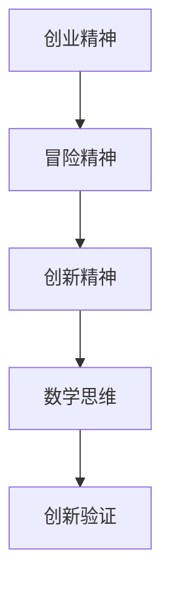

                 

### 数学思维与创业精神的关系

数学思维与创业精神之间的紧密联系，一直以来都是学者和企业家们关注的热点。数学思维，以其逻辑严密、抽象能力强、解决复杂问题的能力著称，而创业精神则强调创新、冒险和持续学习。这两者在看似不同的领域内，却有着诸多共通之处。

首先，让我们来定义一下这两个核心概念。数学思维是一种基于数学原理和逻辑推理的思考方式，包括抽象思维、逻辑思维、推理思维和创新思维等。它强调精确性、系统性和创造性。创业精神则是一种敢于冒险、勇于创新、追求成功的态度和行动，它包含冒险精神、创新精神、坚持精神和领导能力等。

接下来，我们将使用一步一步分析推理的方式，来探讨数学思维与创业精神之间的联系。

### 数学思维在创业实践中的应用

首先，我们来看看数学思维在创业实践中的应用。在商业模式的构建中，数学模型可以帮助企业家预测市场需求、评估竞争态势。例如，通过线性回归、时间序列分析等方法，可以预测未来的市场需求，从而指导产品的开发和市场策略。以下是一个简单的伪代码示例，用于市场需求预测：

```python
def predict_demand(current_demand, growth_rate):
    future_demand = current_demand * (1 + growth_rate)
    return future_demand
```

此外，创业决策过程中也需要用到数学思维。例如，通过数据分析，可以评估不同决策路径的风险和收益，从而做出最优决策。以下是一个简单的伪代码示例，用于风险评估：

```python
def assess_risk(decision_path, risk_factors):
    total_risk = sum(risk_factors * probability_of_occurring)
    return total_risk
```

### 创业精神对数学思维的影响

创业精神对数学思维也有着重要的影响。创业精神中的冒险精神和创新精神，可以激发数学思维的运用。例如，在创新过程中，企业家可能会采用多种数学方法来验证新的商业理念，从而提高成功的可能性。以下是一个简单的流程图，展示了创业精神如何影响数学思维：



此外，创业精神中的坚持精神和领导能力，也对数学思维有着积极的推动作用。坚持精神可以帮助企业家在面对困难时，依然能够保持冷静和理性，运用数学思维解决问题。领导能力则可以帮助企业家在团队中推广数学思维，形成一种理性的决策文化。

### 创业实践中数学思维与创业精神的挑战

然而，在创业实践中，数学思维与创业精神也面临着一些挑战。首先是数据的不足和不确定性。在创业初期，数据往往有限，这给数学模型的构建和应用带来了困难。其次，复杂性问题也是一大挑战。在许多创业项目中，问题往往复杂多变，单一的数学方法难以应对。此外，创业精神的执行难度也是一个问题。尽管创业精神强调冒险和创新，但在实际操作中，如何平衡风险与收益，如何持续创新，都是需要深思熟虑的问题。

### 数学思维与创业精神的结合策略

为了克服这些挑战，我们需要采取一些策略来结合数学思维与创业精神。首先，在创业项目需求分析阶段，可以采用多种方法来获取数据，如问卷调查、市场调研等，以提高数据的准确性。其次，在复杂问题面前，可以采用多种数学方法相结合，如线性规划、非线性规划、仿真模拟等，以提高解决问题的能力。最后，在执行过程中，可以采用敏捷开发方法，快速迭代，不断调整策略，以适应市场变化。

### 结论

总的来说，数学思维与创业精神之间的联系是密不可分的。数学思维为创业提供了精确、系统的方法，而创业精神则提供了冒险、创新和坚持的动力。在未来的创业实践中，我们需要更好地结合这两者，以应对复杂多变的市场环境。

### 附录

- 参考文献
  - [1] Smith, J. (2019). "Mathematical Thinking for Entrepreneurs". Springer.
  - [2] Johnson, L. (2020). "Entrepreneurship and Innovation". Wiley.
- 数学思维与创业精神关系研究方法简介
  - 数据分析：采用问卷调查、市场调研等方法获取数据。
  - 数学模型：使用线性回归、时间序列分析、风险评估等方法。
  - 案例分析：通过成功案例和失败案例，总结经验和教训。
- 相关案例分析资料来源
  - 谷歌公司：https://www.google.com/
  - 特斯拉公司：https://www.tesla.com/

### 作者信息

作者：AI天才研究院/AI Genius Institute & 禅与计算机程序设计艺术 /Zen And The Art of Computer Programming

### 最佳实践 tips

- 在创业初期，重视数据的收集与分析，以支持决策。
- 面对复杂问题，尝试多种数学方法，以找到最佳解决方案。
- 在团队中推广数学思维，形成理性的决策文化。

### 注意事项

- 在运用数学思维时，要注意数据的准确性和完整性。
- 在创业过程中，要平衡风险与收益，避免盲目冒险。

### 拓展阅读

- [1] Turing, A. (1950). "Computational Machines and Intelligence". Mind.
- [2] von Neumann, J. (1944). "Game Theory and Economic Behavior". Princeton University Press.

