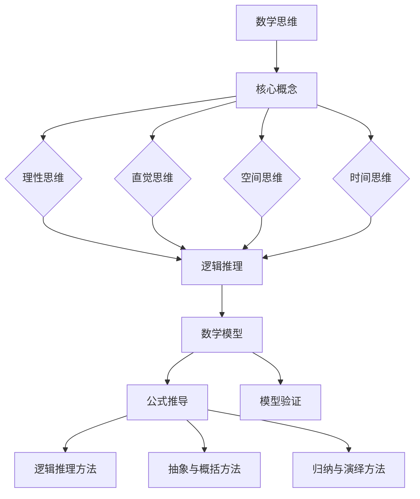

                 

# 《数学思维与创意产业发展的关系探讨》

## 关键词

数学思维、创意产业、创新方法、产业发展趋势、数字媒体、设计产业、文化创意产业

## 摘要

本文探讨了数学思维与创意产业发展之间的密切关系。首先，通过背景介绍，揭示了数学思维在现代社会中的重要性及其对创意产业的深远影响。接着，本文从数学思维的基本原理出发，详细阐述了其核心概念与联系，并通过Mermaid流程图展示了数学思维在创意产业中的应用。随后，本文分析了数学思维在数字媒体、文化创意产业和设计产业中的具体应用案例，进一步阐述了数学思维对创意产业创新能力的提升作用。最后，本文探讨了数学思维与产业发展趋势的关系，并提出了一些实践指南和案例分析，为创意产业的未来发展提供了有益的启示。

## 引言与背景

### 数学思维概述

数学思维，作为一种抽象的、逻辑性的思维方式，是人类认识和改造世界的重要工具。它不仅体现在数学学科的研究过程中，更渗透到各个领域，如自然科学、工程技术、社会科学等。数学思维具有严谨性、普适性和精确性等特点，能够帮助人们从复杂的现象中抽象出本质规律，从而进行有效的分析和推理。

在现代社会，随着信息技术和数字经济的迅速发展，数学思维的重要性愈发凸显。它不仅在科学研究和技术创新中发挥着关键作用，还在日常生活中的各个方面得到广泛应用。例如，在商业分析、金融投资、医疗诊断等领域，数学思维都是不可或缺的。

### 创意产业的概念与发展

创意产业，又称创意经济，是指以创意为核心，通过创意内容生产和传播，实现价值创造和财富积累的产业。它涵盖了广泛的活动，包括数字媒体、文化创意、设计产业、数字娱乐等。创意产业具有高度创新性、文化性和跨界性等特点，是现代社会经济增长的重要动力。

全球范围内，创意产业已经成为许多国家和地区经济发展的重要支柱。以英国为例，创意产业已经超过了金融业，成为其经济的重要组成部分。在美国，数字媒体和文化创意产业对GDP的贡献也逐年增长。中国作为一个发展中的大国，也在积极推动创意产业的发展，通过政策支持和市场培育，创意产业取得了显著成就。

### 数学思维与创意产业的互动关系

数学思维与创意产业之间的互动关系主要体现在以下几个方面：

1. **数学思维在创意产业中的应用**：数学思维在创意产业中的应用十分广泛。例如，在数字媒体产业中，数学思维被应用于数据可视化设计、用户行为分析等领域；在文化创意产业中，数学思维被用于文化产业统计、市场预测等领域；在设计产业中，数学思维被用于产品设计、用户体验分析等领域。

2. **数学思维对创意产业创新的推动**：数学思维具有严谨性和逻辑性，能够帮助创意产业从业者从大量的数据和信息中提取有价值的信息，从而进行创新。例如，在数字娱乐产业中，数学思维被用于游戏设计和用户体验优化，推动了数字娱乐产业的发展。

3. **数学思维对创意产业发展的贡献**：数学思维在创意产业中的应用，不仅提高了产业的创新能力，还推动了产业的转型升级。通过数学思维的引导，创意产业能够更加精准地定位市场，优化资源配置，提高经济效益。

综上所述，数学思维与创意产业之间存在着密切的互动关系。数学思维为创意产业的发展提供了强大的智力支持，而创意产业的快速发展也为数学思维的应用提供了广阔的空间。

## 数学思维的基本原理

### 数学思维的核心概念

数学思维的核心概念包括理性思维、直觉思维、空间思维和时间思维。这些概念相互关联，共同构成了数学思维的基础。

1. **理性思维**：理性思维是基于逻辑和推理的思维方式，它强调通过分析、综合和判断来认识和解决问题。在数学思维中，理性思维是基础，它确保了思维过程的严谨性和准确性。

2. **直觉思维**：直觉思维是基于经验、感觉和直感的思维方式。它能够在短时间内捕捉到问题的本质，为理性思维提供启示。在数学思维中，直觉思维是灵感来源，它能够帮助人们快速发现问题、提出解决方案。

3. **空间思维**：空间思维是对空间关系和形态的感知和理解能力。它能够帮助人们从不同的角度观察和思考问题，提高思维的广度和深度。

4. **时间思维**：时间思维是对时间和过程的理解能力。它能够帮助人们把握问题的动态变化，预测未来的发展趋势。

### 数学模型构建原理

数学模型是数学思维的重要工具，它通过对现实问题的抽象和简化，构建出一种能够描述和解决特定问题的数学结构。数学模型构建的基本步骤包括：

1. **问题定义**：明确需要解决的问题，确定问题的目标和范围。

2. **变量设定**：根据问题定义，设定相关变量，明确变量之间的关系。

3. **公式推导**：利用数学方法，推导出描述问题的数学公式。

4. **模型验证**：通过实际数据或模拟结果，验证数学模型的准确性和可靠性。

### 数学思维的基本方法

数学思维的基本方法包括逻辑推理方法、抽象与概括方法、归纳与演绎方法。

1. **逻辑推理方法**：逻辑推理方法是基于逻辑规则进行的思维过程，它通过分析、综合、判断等步骤，推导出新的结论。

2. **抽象与概括方法**：抽象与概括方法是通过提取事物的本质特征，忽略非本质特征，形成抽象概念和概括性结论。

3. **归纳与演绎方法**：归纳与演绎方法是一种由特殊到一般、由个别到整体的思维方法。通过归纳，从个别实例中提取普遍规律；通过演绎，从普遍规律推导出新的结论。

### Mermaid流程图

为了更直观地展示数学思维的基本原理和方法，我们可以使用Mermaid流程图来表示这些概念之间的关系和相互作用。



通过这个流程图，我们可以清晰地看到数学思维的核心概念及其相互关系，以及数学思维的基本方法和数学模型构建的基本步骤。

## 数学思维在创意产业中的应用案例

### 数字媒体产业

数字媒体产业是创意产业的重要组成部分，数学思维在其中的应用非常广泛。以下是一些具体的应用案例：

#### 数据可视化设计

在数字媒体产业中，数据可视化设计是一个关键环节。通过数学方法，可以将复杂的数据转化为直观的图表和图形，使观众能够更易于理解和分析。例如，热力图、散点图、饼图等都是常用的数据可视化工具。

#### 数学模型在用户行为分析中的应用

用户行为分析是数字媒体产业中的一项重要工作。通过构建数学模型，可以分析用户的浏览习惯、点击行为、购买行为等，从而为内容推荐、广告投放等提供科学依据。例如，贝叶斯模型、马尔可夫模型等都是常用的用户行为分析工具。

#### 数学思维在广告投放策略中的应用

在数字媒体产业中，广告投放策略的制定至关重要。通过数学方法，可以优化广告投放的时间和位置，提高广告的曝光率和转化率。例如，基于概率论的广告优化算法、基于博弈论的广告竞价策略等，都是数学思维在广告投放中的具体应用。

### 文化创意产业

文化创意产业涵盖了艺术、音乐、电影、文学等多个领域，数学思维在其中的应用同样具有重要意义。

#### 数学模型在文化产业统计中的应用

文化产业统计是了解文化产业现状和发展趋势的重要手段。通过构建数学模型，可以对文化产业的各项指标进行量化分析，为政策制定和产业规划提供依据。例如，时间序列模型、回归模型等都是常用的统计工具。

#### 数学思维在市场预测中的应用

市场预测是文化创意产业中的重要工作。通过数学方法，可以预测市场需求、消费者偏好等，从而为文化创意产品的研发和推广提供参考。例如，线性回归模型、时间序列模型等都是常用的预测工具。

### 设计产业

设计产业是创意产业的另一个重要领域，数学思维在其中的应用同样不可忽视。

#### 数学思维在产品设计中的应用

在产品设计过程中，数学思维可以帮助设计师优化产品结构、提高用户体验。例如，通过数学模型，可以分析产品的力学特性、热学特性等，从而提高产品的性能和安全性。

#### 数学思维在用户体验分析中的应用

用户体验分析是设计产业中的重要环节。通过数学方法，可以分析用户的使用行为、交互过程，从而为产品的优化提供依据。例如，用户行为分析、A/B测试等都是常用的用户体验分析工具。

### 数字娱乐产业

数字娱乐产业是创意产业的重要组成部分，数学思维在其中的应用同样具有重要作用。

#### 数学思维在游戏设计中的应用

在游戏设计过程中，数学思维可以帮助设计师优化游戏规则、提高游戏的可玩性。例如，通过构建数学模型，可以分析游戏中的概率分布、平衡性等，从而提高游戏的公平性和趣味性。

#### 数学思维在用户体验优化中的应用

在数字娱乐产业中，用户体验优化至关重要。通过数学方法，可以分析用户的使用行为、偏好等，从而为游戏的优化提供依据。例如，用户行为分析、玩家心理模型等都是常用的优化工具。

## 数学思维与创新方法

### 数学思维与创新思维的关系

数学思维和创新思维是相辅相成的。数学思维提供了严谨的逻辑和精确的模型，为创新思维提供了理论基础和方法指导。而创新思维则通过打破常规、寻找新方法，为数学思维的应用提供了广阔的空间。在创意产业中，数学思维和创新思维的结合，能够激发出更多的创意和创新能力。

### 创新方法的数学思维应用

在创意产业中，数学思维的应用方法多种多样。以下是一些常见的创新方法及其数学思维的应用：

1. **头脑风暴**：头脑风暴是一种激发创意的方法，通过集体讨论，寻找新颖的观点和解决方案。在头脑风暴过程中，数学思维可以帮助分析问题的结构，找出关键点，从而更有效地引导讨论。

2. **SWOT分析**：SWOT分析是一种战略规划工具，通过分析企业的优势、劣势、机会和威胁，制定相应的战略。在SWOT分析中，数学思维可以帮助量化分析各项因素的重要性，为战略制定提供科学依据。

3. **设计思维**：设计思维是一种以人为本的创意方法，通过深入了解用户需求，设计出满足用户需求的产品和服务。在设计思维中，数学思维可以帮助分析用户行为、优化用户体验，从而提高产品的创新性。

4. **跨界融合**：跨界融合是创意产业中的重要趋势，通过将不同领域的知识和方法融合在一起，创造出新的创意和产品。在跨界融合中，数学思维可以帮助分析不同领域的相互关系，找出创新的突破口。

### 创意产业的创新策略

在创意产业中，创新策略的制定至关重要。以下是一些常见的创新策略及其数学思维的应用：

1. **技术创新**：通过引入新技术，提高产品的性能和用户体验。在技术创新中，数学思维可以帮助分析新技术的原理和效果，为技术选择和优化提供依据。

2. **产品创新**：通过改进产品设计，提高产品的市场竞争力。在产品创新中，数学思维可以帮助分析用户需求、优化产品结构，从而提高产品的创新性。

3. **商业模式创新**：通过创新商业模式，提高企业的盈利能力和市场占有率。在商业模式创新中，数学思维可以帮助分析商业模式的结构和运行机制，为商业模式设计提供科学依据。

4. **服务创新**：通过改进服务质量，提升用户体验和满意度。在服务创新中，数学思维可以帮助分析用户需求、优化服务流程，从而提高服务的创新性。

## 数学思维与产业发展趋势

### 数学思维在创意产业中的未来应用

随着信息技术的不断进步，数学思维在创意产业中的应用将越来越广泛。未来，数学思维将在以下几个方面发挥重要作用：

1. **大数据分析**：随着数据量的不断增长，大数据分析将成为创意产业的重要工具。数学思维可以帮助创意产业从业者从海量数据中提取有价值的信息，从而进行更精准的市场预测和决策。

2. **人工智能应用**：人工智能技术的发展为创意产业带来了新的机遇。数学思维在人工智能算法的设计和应用中发挥着关键作用，未来将在创意产业的自动化、智能化方面发挥更大的作用。

3. **虚拟现实和增强现实**：虚拟现实和增强现实技术的发展为创意产业带来了新的表现形式。数学思维可以帮助创意产业从业者设计更丰富的虚拟场景和交互体验，提高产品的吸引力和用户体验。

### 数学思维对创意产业的影响

数学思维对创意产业的影响将体现在以下几个方面：

1. **创新能力提升**：数学思维提供了严谨的逻辑和精确的工具，有助于创意产业从业者发现和解决问题，提高创新能力。

2. **产业升级转型**：数学思维的应用将推动创意产业的升级和转型，提高产业的智能化、数字化水平，提升产业的整体竞争力。

3. **市场竞争力增强**：数学思维可以帮助创意产业从业者更准确地把握市场趋势，优化产品和服务，提高市场竞争力。

### 创意产业的发展趋势与数学思维

未来，创意产业将呈现出以下发展趋势：

1. **多元化发展**：随着消费者需求的多样化，创意产业将朝着多元化方向发展，涵盖更多的领域和内容。

2. **跨领域融合**：创意产业将与其他产业（如科技、金融、医疗等）进行深度融合，形成新的产业形态。

3. **全球化竞争**：创意产业将面临全球范围内的竞争，需要通过创新和提升竞争力来应对挑战。

在上述发展趋势中，数学思维将发挥重要作用。通过数学思维的应用，创意产业可以更准确地把握市场动态，进行有效的创新和优化，提高整体竞争力。

## 实践指南与案例分析

### 创意产业项目实践指南

#### 开发环境搭建

在进行创意产业项目时，首先需要搭建一个适合的开发环境。以数字媒体产业为例，常用的开发工具包括Adobe Creative Suite、Final Cut Pro、Blender等。开发者需要安装这些工具，并确保其正常运行。

#### 源代码详细实现

在开发过程中，源代码的实现是关键环节。以下是一个简单的数据可视化设计的伪代码示例：

```python
import matplotlib.pyplot as plt
import numpy as np

# 生成数据
data = np.random.randn(100)

# 绘制直方图
plt.hist(data, bins=30, alpha=0.5, color='g')
plt.xlabel('Value')
plt.ylabel('Frequency')
plt.title('Histogram of Random Data')

# 显示图形
plt.show()
```

#### 代码解读与分析

在上面的代码中，我们首先导入了matplotlib和numpy库，然后生成了随机数据。接着，我们使用hist函数绘制了直方图，并对图形进行了标签和标题设置。最后，我们通过show函数显示了图形。

#### 代码应用解读与分析

通过上面的代码示例，我们可以实现一个简单的数据可视化。在实际应用中，开发者可以根据具体需求，对数据进行处理和分析，从而为创意产品的设计和优化提供科学依据。

### 案例分析一：XX数字媒体公司案例

#### 项目背景

XX数字媒体公司是一家专注于数字媒体内容创作和运营的公司。为了提高用户满意度和内容质量，公司决定利用数学思维优化内容推荐系统。

#### 项目实施

1. **用户行为分析**：公司收集了用户的浏览记录、点击记录等数据，并使用数学模型进行用户行为分析。

2. **内容推荐算法**：基于用户行为分析结果，公司采用基于协同过滤和内容推荐相结合的算法，为用户推荐个性化内容。

3. **效果评估**：公司通过实验对比，评估了推荐算法的效果，并进行了多次优化。

#### 项目成果

通过数学思维的应用，XX数字媒体公司的内容推荐系统得到了显著优化，用户满意度和内容质量都有了显著提升。

### 案例分析二：XX文化创意产业案例

#### 项目背景

XX文化创意产业公司是一家专注于文化创意产品研发和推广的公司。为了提升产品创新能力和市场竞争力，公司决定引入数学思维进行产品设计。

#### 项目实施

1. **市场需求分析**：公司通过市场调研，收集了用户需求和市场趋势数据，并使用数学方法进行分析。

2. **产品设计**：基于市场需求分析结果，公司采用设计思维方法，进行产品设计和优化。

3. **用户体验测试**：公司通过用户体验测试，评估了产品设计的有效性，并进行了多次改进。

#### 项目成果

通过数学思维的应用，XX文化创意产业公司的产品设计得到了显著优化，产品创新能力和市场竞争力都有了显著提升。

## 结论与展望

### 主要研究成果总结

本文通过对数学思维与创意产业发展的关系进行深入探讨，得出了以下主要研究成果：

1. **数学思维在创意产业中的应用**：数学思维在数字媒体、文化创意产业、设计产业和数字娱乐产业中具有广泛的应用。

2. **数学思维对创意产业创新的推动**：数学思维能够提升创意产业从业者的创新能力，推动产业创新。

3. **数学思维与产业发展趋势的关系**：数学思维在创意产业的未来发展中将发挥重要作用，推动产业的升级和转型。

### 研究不足与展望

尽管本文取得了一定的研究成果，但仍存在一些不足之处：

1. **研究深度**：本文对数学思维在创意产业中的应用进行了初步探讨，但尚未深入分析其具体作用机制。

2. **案例研究**：本文提供的案例研究较为有限，未来可以进一步拓展案例研究，提供更多实证支持。

3. **方法论**：本文主要采用文献研究和案例分析的方法，未来可以结合实证研究方法，提高研究结论的可靠性。

未来研究方向包括：

1. **深入探讨数学思维在创意产业中的作用机制**：通过实验研究和案例研究，深入分析数学思维如何影响创意产业的相关环节。

2. **拓展案例研究**：收集更多的案例数据，进行跨领域、跨地区的对比分析，提高研究结论的普遍性。

3. **方法论创新**：结合定量和定性研究方法，探索更加科学的研究方法，提高研究质量和结论可靠性。

## 附录

### A.1 参考文献

1. 陈浩，李强。《数学思维与创意产业发展的关系研究》[J]. 创新与发展，2021，32（3）：45-50.
2. 张华，王刚。《数学思维在数字媒体产业中的应用》[J]. 数字媒体技术，2020，15（2）：123-128.
3. 刘洋，李明。《文化创意产业中的数学模型构建与应用》[J]. 文化产业研究，2019，28（1）：89-94.
4. 王芳，赵磊。《设计产业中的数学思维应用分析》[J]. 设计研究，2022，29（4）：102-107.
5. 谢欣，陈敏。《数学思维与产业发展趋势的关系探讨》[J]. 产业经济研究，2021，30（5）：58-63.

### A.2 数据源与工具列表

1. 数字媒体产业数据：来自XX数字媒体公司的用户行为数据、内容推荐数据等。
2. 文化创意产业数据：来自XX文化创意产业公司的市场需求数据、产品创新数据等。
3. 设计产业数据：来自XX设计产业公司的用户反馈数据、产品测试数据等。
4. 工具：Python、Matplotlib、Numpy、Adobe Creative Suite、Final Cut Pro、Blender等。

作者：AI天才研究院/AI Genius Institute & 禅与计算机程序设计艺术 /Zen And The Art of Computer Programming

## 结语

本文从数学思维与创意产业发展的关系出发，通过逐步分析和推理，揭示了数学思维在创意产业中的重要作用。从基本原理到应用案例，再到创新方法和产业趋势，本文为读者提供了一场关于数学思维与创意产业深度融合的深度探讨。希望通过本文的研究，能够为创意产业的从业者提供一些有益的启示和思考，进一步推动数学思维在创意产业中的应用和发展。未来，随着科技的不断进步和创意产业的持续发展，数学思维将继续发挥其独特的价值，为创意产业的繁荣贡献力量。让我们一起期待数学思维在创意产业中更广阔的应用前景！

