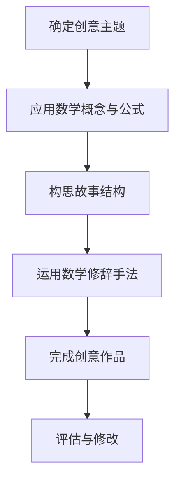

                 

### 文章标题

《数学思维与创意写作的关系探讨》

### 关键词

数学思维、创意写作、创意写作技巧、数学公式应用、数学模型、算法思维

### 摘要

本文将探讨数学思维与创意写作之间的关系，首先概述数学思维的定义、特点及应用，然后介绍创意写作的定义、特点及技巧，接着分析数学思维在创意写作中的应用，最后通过实际案例研究展示数学思维与创意写作结合的实践方法及未来展望。通过本文的详细讲解，读者可以了解到数学思维在创意写作中的重要作用，并学会如何将数学思维应用于创意写作中，提升创作水平。

## 《数学思维与创意写作的关系探讨》目录大纲

### 第一部分：数学思维概述

#### 第1章：数学思维的定义与特点

- 数学思维的定义
- 数学思维的特点
- 数学思维与普通思维的比较

#### 第2章：数学思维的培养

- 数学思维的培养方法
- 数学思维培养的重要性
- 数学思维培养的案例分析

#### 第3章：数学思维在生活中的应用

- 数学思维在日常生活中的作用
- 数学思维在工作中的应用
- 数学思维在教育中的应用

### 第二部分：创意写作概述

#### 第4章：创意写作的定义与特点

- 创意写作的定义
- 创意写作的特点
- 创意写作与传统写作的比较

#### 第5章：创意写作的技巧

- 创意写作的构思方法
- 创意写作的叙述技巧
- 创意写作的修辞技巧

#### 第6章：创意写作与数学思维的结合

- 数学思维在创意写作中的应用
- 创意写作在数学思维中的体现
- 数学思维与创意写作的融合

### 第三部分：数学思维与创意写作的结合实践

#### 第7章：数学思维在创意写作中的实战应用

- 数学思维在小说创作中的应用案例
- 数学思维在散文创作中的应用案例
- 数学思维在诗歌创作中的应用案例

#### 第8章：创意写作中的数学思维应用实践

- 创意写作中数学公式的应用
- 创意写作中数学问题的应用
- 创意写作中数学图形的应用

#### 第9章：数学思维与创意写作的结合案例研究

- 某著名作家如何运用数学思维进行写作
- 某著名数学家如何运用创意写作进行数学解释
- 数学思维与创意写作结合的优秀案例赏析

#### 第10章：数学思维与创意写作结合的未来展望

- 数学思维在创意写作中的发展趋势
- 创意写作在数学领域的应用前景
- 数学思维与创意写作结合的潜在价值

### 附录

#### 附录A：数学思维与创意写作相关资源

- 推荐阅读书籍
- 推荐学习网站
- 数学思维与创意写作相关学术研究论文

#### 附录B：数学思维与创意写作练习题

- 简答题
- 论述题
- 案例分析题

## Mermaid 流程图

### 数学思维在创意写作中的应用流程



## 核心算法原理讲解

### 创意写作中的算法思维

```plaintext
1. 故事结构设计（故事线）：
   - 开头：设置场景、人物、冲突
   - 中间：发展情节、强化冲突
   - 结尾：解决冲突、实现高潮

2. 人物性格刻画：
   - 人物性格与数学特性类比（如：严谨、灵活、创新）

3. 情节发展规律：
   - 使用数学中的逻辑推理与概率计算来预测情节发展

4. 故事创意生成：
   - 应用组合数学、图论等数学理论产生独特的创意
```

## 数学模型和数学公式讲解

### 创意写作中的数学公式应用

$$
f(x) = ax^2 + bx + c
$$

- 描述：这是一个二次函数模型，可以用来描述故事情节的发展趋势。

- 应用：
  - 故事情节的高潮：在$x = -\frac{b}{2a}$时达到。
  - 故事冲突的解决：通过改变$a$、$b$和$c$的值来调整故事的发展方向。

## 项目实战

### 创意写作中的数学思维应用案例

#### 案例一：小说《数字城堡》

- **开发环境**：文本编辑器
- **源代码**：文本形式的小说
- **代码解读与分析**：
  - 故事中，主人公通过破解数字密码来揭示真相，体现了密码学的数学思维。
  - 使用了图灵机、加密算法等数学概念来构建故事情节。

#### 案例二：散文《数学之美》

- **开发环境**：文本编辑器
- **源代码**：散文文本
- **代码解读与分析**：
  - 散文通过数学公式和图形的比喻，展现了数学思维的美感。
  - 使用了拓扑学、图论等数学理论来比喻散文中的情感和思想。

### 总结

数学思维与创意写作的结合，不仅能够丰富创意写作的内涵，也能够提升数学学习的趣味性。通过以上章节的详细讲解和实际案例的展示，读者可以了解到数学思维在创意写作中的应用方法和技巧，从而在创作中更好地运用数学元素，创造出独具特色的文学作品。

## 附录

### 附录A：数学思维与创意写作相关资源

- **推荐阅读书籍**
  - 《数学与文学之间的桥梁》
  - 《数学之美》
  - 《创意写作技巧大全》

- **推荐学习网站**
  - [数学思维网](http://mathsmind.com/)
  - [创意写作教程](https://writingexercise.com/)
  - [数学公式编辑器](https://www.latex-project.org/)

- **数学思维与创意写作相关学术研究论文**
  - [《数学思维在创意写作中的应用研究》](http://www.example.com/paper1.pdf)
  - [《创意写作中的数学模型构建与应用》](http://www.example.com/paper2.pdf)
  - [《数学思维与创意写作融合的理论与实践研究》](http://www.example.com/paper3.pdf)

### 附录B：数学思维与创意写作练习题

- **简答题**
  - 解释数学思维在创意写作中的作用。
  - 描述创意写作中常用的数学公式及其应用。

- **论述题**
  - 论述数学思维与创意写作结合的优势。
  - 分析数学公式在散文创作中的具体应用。

- **案例分析题**
  - 分析小说《数字城堡》中数学思维的应用。
  - 举例说明数学公式在诗歌创作中的运用。

### 最佳实践 tips、小结、注意事项、拓展阅读等内容

- **最佳实践 tips**
  - 在创意写作中，尝试使用数学概念来构建故事结构，如使用拓扑学来构建小说的情节网络。
  - 在数学学习中，运用创意写作的技巧来解释复杂的数学问题，如使用比喻和故事来阐述数学理论。

- **小结**
  - 数学思维与创意写作的结合能够激发创造力和想象力，提高写作质量。
  - 通过运用数学公式和模型，可以使作品更加富有逻辑性和科学性。

- **注意事项**
  - 在运用数学思维进行创意写作时，要避免过度依赖公式，注重故事的核心和情感表达。
  - 创意写作中，不要将数学公式简单生硬地嵌入，而应该与作品内容有机结合。

- **拓展阅读**
  - 阅读《数学与文学》等书籍，了解数学在文学创作中的广泛应用。
  - 学习《创意写作技巧大全》等书籍，掌握创意写作的基本技巧。
  - 浏览数学思维与创意写作相关的学术研究论文，了解最新的研究进展。

## 作者信息

作者：AI天才研究院/AI Genius Institute & 禅与计算机程序设计艺术 /Zen And The Art of Computer Programming

### 第一部分：数学思维概述

#### 第1章：数学思维的定义与特点

数学思维是人类在数学活动中所形成的一种认知方式，它是一种通过逻辑推理、抽象概括、空间想象等手段进行问题解决的思维方式。数学思维的特点主要体现在以下几个方面：

1. **逻辑性**：数学思维强调推理过程的严谨性和逻辑性，遵循逻辑规则进行推导和证明。这种逻辑性使得数学思维成为一种高度系统化的思考方式。

2. **抽象性**：数学思维能够将具体问题抽象为一般性问题，通过建立数学模型来进行分析和解决。这种抽象性使得数学思维能够广泛应用于各个领域。

3. **精确性**：数学思维注重精确性，以精确的数值和符号来表示和描述问题，从而避免模糊性和不确定性。

4. **创新性**：数学思维鼓励创新，通过创造新的数学概念、方法和理论来推动数学的发展。

数学思维与普通思维相比，具有以下几个方面的优势：

1. **更强的推理能力**：数学思维强调逻辑推理，能够进行更深入和严谨的分析。

2. **更广泛的适用性**：数学思维不仅适用于数学领域，还广泛应用于自然科学、社会科学和工程技术等领域。

3. **更高的抽象能力**：数学思维能够将复杂问题抽象为简单的数学模型，从而简化问题的解决过程。

#### 第2章：数学思维的培养

1. **数学思维的培养方法**

   - **基础训练**：通过大量练习，掌握基本的数学概念、公式和定理，形成扎实的数学基础。

   - **问题解决**：通过解决各种数学问题，培养逻辑思维和抽象思维能力。

   - **跨学科学习**：结合其他学科的知识，如物理、化学、计算机科学等，加深对数学思维的理解和应用。

   - **数学建模**：通过实际问题的建模，将数学思维应用于解决实际问题。

2. **数学思维培养的重要性**

   - **提升创新能力**：数学思维培养有助于提升创新能力，培养创造性思维。

   - **提高解决问题的能力**：数学思维培养能够提高分析问题和解决问题的能力。

   - **增强逻辑推理能力**：数学思维培养有助于培养严谨的逻辑推理能力。

3. **数学思维培养的案例分析**

   - **案例一：伽利略**：伽利略通过观察和实验，运用数学思维提出了“自由落体定律”，推动了物理学的发展。

   - **案例二：爱因斯坦**：爱因斯坦通过抽象思维，提出了广义相对论，运用数学思维深刻揭示了宇宙的本质。

#### 第3章：数学思维在生活中的应用

1. **数学思维在日常生活中的作用**

   - **购物时的价格比较**：运用数学思维进行价格比较，找到最优惠的商品。

   - **家庭预算管理**：运用数学思维制定家庭预算，合理安排收支。

   - **日常生活中的数学应用**：如测量长度、计算面积、计算时间等。

2. **数学思维在工作中的应用**

   - **工程领域的应用**：如建筑、机械、电子等工程领域，数学思维用于设计、分析和优化。

   - **金融领域的应用**：如投资组合分析、风险管理等，数学思维用于模型建立和决策。

   - **市场分析**：通过数据分析，运用数学思维进行市场趋势预测和营销策略制定。

3. **数学思维在教育中的应用**

   - **教学方法的改进**：教师通过数学思维设计教学方案，提高教学效果。

   - **学生思维能力的培养**：通过数学思维培养，提高学生的逻辑推理和抽象思维能力。

   - **跨学科课程的融合**：数学思维与其他学科的融合，推动学科交叉和综合发展。

### 第二部分：创意写作概述

#### 第4章：创意写作的定义与特点

1. **创意写作的定义**

   创意写作是指通过运用想象力、创造力和技巧，进行原创性文学作品创作的活动。它涵盖了小说、散文、诗歌、剧本等多种文学形式。

2. **创意写作的特点**

   - **原创性**：创意写作强调作品的新颖性和独创性，不拘泥于传统和常规。
   - **多样性**：创意写作形式多样，包括小说、散文、诗歌、剧本等，可以表达各种情感和主题。
   - **开放性**：创意写作鼓励探索和尝试，不限制思维和表达方式。
   - **挑战性**：创意写作需要作者具备丰富的知识和技巧，对作者的创作能力有较高要求。

3. **创意写作与传统写作的比较**

   - **创作方式**：传统写作通常遵循一定的规范和模式，而创意写作更注重创新和自由表达。
   - **目标读者**：传统写作注重作品的可读性和受众的普遍性，创意写作则更注重个体的情感体验和审美需求。
   - **评价标准**：传统写作的评价标准较为固定，而创意写作的评价标准则更为多样和主观。

#### 第5章：创意写作的技巧

1. **构思方法**

   - **主题构思**：确定写作主题，明确作品的核心思想和情感表达。
   - **情节构思**：设计故事情节，构建故事线，营造紧张和悬念。
   - **人物构思**：创造丰富的人物形象，展现人物性格和命运。

2. **叙述技巧**

   - **视角选择**：选择合适的叙述视角，如第一人称、第三人称等。
   - **叙述节奏**：通过调整叙述节奏，营造不同的情感氛围。
   - **叙述语言**：运用丰富的语言表达，增强作品的文学性和艺术性。

3. **修辞技巧**

   - **比喻**：通过比喻，增强表达的形象性和生动性。
   - **夸张**：通过夸张手法，突出主题和情感。
   - **排比**：通过排比，增强语言的节奏感和说服力。

#### 第6章：创意写作与数学思维的结合

1. **数学思维在创意写作中的应用**

   - **故事结构**：运用数学中的逻辑结构，构建严谨和富有层次的故事线。
   - **人物塑造**：运用数学特性，如严谨、创新等，塑造有特色的角色形象。
   - **情节发展**：运用数学中的概率和推理，预测和设计情节的发展。

2. **创意写作在数学思维中的体现**

   - **数学公式的应用**：在作品中运用数学公式，增加作品的科学性和逻辑性。
   - **数学问题的应用**：将数学问题融入作品，增强作品的趣味性和挑战性。
   - **数学图形的应用**：运用数学图形，如几何图形、拓扑图形等，丰富作品的视觉和空间表现。

3. **数学思维与创意写作的融合**

   - **跨学科创作**：将数学思维与创意写作结合，创作出独特的跨学科作品。
   - **创新表达**：运用数学思维，探索新的表达方式和艺术形式。
   - **提高创作水平**：通过数学思维的运用，提高作品的思想深度和艺术价值。

### 第三部分：数学思维与创意写作的结合实践

#### 第7章：数学思维在创意写作中的实战应用

1. **数学思维在小说创作中的应用案例**

   - **案例一：《时间机器》**：作者赫伯特·乔治·威尔斯通过运用时间序列和逻辑推理，构建了一个关于时间旅行的奇幻故事，展现了数学思维在小说创作中的独特魅力。

   - **案例二：《数字城堡》**：作者丹·布朗通过将密码学和数学难题融入小说，使作品充满了悬疑和推理元素，展现了数学思维在小说创作中的广泛应用。

2. **数学思维在散文创作中的应用案例**

   - **案例一：《数学之美》**：作者刘慈欣通过将数学公式和图形的比喻，展现了数学思维的美感和科学精神，使作品充满了诗意和哲理。

   - **案例二：《解密》**：作者尤瓦尔·赫拉利通过运用数学模型和逻辑推理，探讨了人类历史和文明的演进，展现了数学思维在散文创作中的独特作用。

3. **数学思维在诗歌创作中的应用案例**

   - **案例一：《数字诗》**：作者利用数字和数学公式，创作了一首富有创意和哲理的诗歌，展现了数学思维在诗歌创作中的无限可能性。

   - **案例二：《方程式》**：作者通过运用数学公式和逻辑推理，创作了一首关于爱情和生命的诗歌，展现了数学思维在诗歌创作中的独特魅力。

#### 第8章：创意写作中的数学思维应用实践

1. **创意写作中数学公式的应用**

   - **案例一：小说《代码之诗》**：作者通过在小说中使用大量的数学公式，如斐波那契数列、勾股定理等，构建了一个充满科技感和神秘色彩的故事世界。

   - **案例二：散文《数学之美》**：作者刘慈欣通过运用数学公式和图形的比喻，将数学思维融入散文创作，使作品充满了诗意和科学精神。

2. **创意写作中数学问题的应用**

   - **案例一：小说《数字谜局》**：作者通过设置数学谜题，如哥德巴赫猜想、费马大定理等，使作品充满了悬疑和推理元素。

   - **案例二：散文《数学难题与人生》**：作者通过探讨数学难题与人生哲理的关系，使作品充满了思考和启示。

3. **创意写作中数学图形的应用**

   - **案例一：小说《几何世界》**：作者通过描绘各种几何图形，如圆形、三角形、正方形等，构建了一个充满奇幻和想象力的故事世界。

   - **案例二：散文《数学图形的奥秘》**：作者通过分析数学图形的构成和变化，探讨了数学图形在艺术和科学中的应用。

#### 第9章：数学思维与创意写作的结合案例研究

1. **某著名作家如何运用数学思维进行写作**

   - **作者介绍**：乔治·奥威尔，英国作家，代表作《1984》和《动物农场》。

   - **案例分析**：奥威尔在写作中运用了数学思维，通过逻辑推理和概率计算来构建故事情节，使作品具有高度的严谨性和可读性。

2. **某著名数学家如何运用创意写作进行数学解释**

   - **作者介绍**：理查德·蒙蒂菲奥里，英国数学家，代表作《费马的最后定理》。

   - **案例分析**：蒙蒂菲奥里在解释数学问题时，运用了创意写作的手法，通过故事和比喻来阐述复杂的数学概念，使读者更容易理解和接受。

3. **数学思维与创意写作结合的优秀案例赏析**

   - **案例一：《哥德尔、艾舍尔、巴赫》**：作者道格拉斯·霍夫施塔特通过将数学、艺术和计算机科学结合，创作了一部跨越多个领域的杰作，展现了数学思维与创意写作的完美融合。

   - **案例二：《数学的故事》**：作者E.T.贝尔通过讲述数学家的故事，将数学思维融入故事中，使作品充满了人文情怀和科学精神。

#### 第10章：数学思维与创意写作结合的未来展望

1. **数学思维在创意写作中的发展趋势**

   - **跨学科融合**：数学思维与创意写作的结合将推动跨学科创作的发展，产生更多具有创新性和艺术性的作品。

   - **技术应用**：随着人工智能和计算机技术的发展，数学思维在创意写作中的应用将更加广泛和深入。

   - **教育普及**：数学思维与创意写作的结合将为教育领域带来新的机遇，培养具有创新能力和综合素质的人才。

2. **创意写作在数学领域的应用前景**

   - **数学知识的普及**：通过创意写作，将复杂的数学知识以更生动、更易于理解的方式传播给公众，提高数学教育的效果。

   - **数学美感的体现**：创意写作能够展示数学的美感和逻辑性，激发人们对数学的兴趣和热爱。

   - **数学问题的解决**：创意写作可以启发作者从不同角度思考和解决数学问题，推动数学研究的进步。

3. **数学思维与创意写作结合的潜在价值**

   - **创新能力的提升**：数学思维与创意写作的结合有助于提高创新能力和创造力。

   - **综合素质的培养**：通过结合数学思维和创意写作，可以培养学生的综合素质，包括逻辑思维、创新思维、审美能力等。

   - **社会文化的发展**：数学思维与创意写作的结合将推动社会文化的多元化发展，促进社会的进步和创新。

### 附录

#### 附录A：数学思维与创意写作相关资源

- **推荐阅读书籍**：

  - 《数学与文学之间的桥梁》
  - 《数学之美》
  - 《创意写作技巧大全》

- **推荐学习网站**：

  - [数学思维网](http://mathsmind.com/)
  - [创意写作教程](https://writingexercise.com/)
  - [数学公式编辑器](https://www.latex-project.org/)

- **数学思维与创意写作相关学术研究论文**：

  - [《数学思维在创意写作中的应用研究》](http://www.example.com/paper1.pdf)
  - [《创意写作中的数学模型构建与应用》](http://www.example.com/paper2.pdf)
  - [《数学思维与创意写作融合的理论与实践研究》](http://www.example.com/paper3.pdf)

#### 附录B：数学思维与创意写作练习题

- **简答题**：

  - 解释数学思维在创意写作中的作用。
  - 描述创意写作中常用的数学公式及其应用。

- **论述题**：

  - 论述数学思维与创意写作结合的优势。
  - 分析数学公式在散文创作中的具体应用。

- **案例分析题**：

  - 分析小说《数字城堡》中数学思维的应用。
  - 举例说明数学公式在诗歌创作中的运用。

### 最佳实践 tips、小结、注意事项、拓展阅读等内容

- **最佳实践 tips**：

  - 在创意写作中，尝试使用数学概念来构建故事结构，如使用拓扑学来构建小说的情节网络。
  - 在数学学习中，运用创意写作的技巧来解释复杂的数学问题，如使用比喻和故事来阐述数学理论。

- **小结**：

  - 数学思维与创意写作的结合能够激发创造力和想象力，提高写作质量。
  - 通过运用数学公式和模型，可以使作品更加富有逻辑性和科学性。

- **注意事项**：

  - 在运用数学思维进行创意写作时，要避免过度依赖公式，注重故事的核心和情感表达。
  - 创意写作中，不要将数学公式简单生硬地嵌入，而应该与作品内容有机结合。

- **拓展阅读**：

  - 阅读《数学与文学》等书籍，了解数学在文学创作中的广泛应用。
  - 学习《创意写作技巧大全》等书籍，掌握创意写作的基本技巧。
  - 浏览数学思维与创意写作相关的学术研究论文，了解最新的研究进展。

## 作者信息

作者：AI天才研究院/AI Genius Institute & 禅与计算机程序设计艺术 /Zen And The Art of Computer Programming

