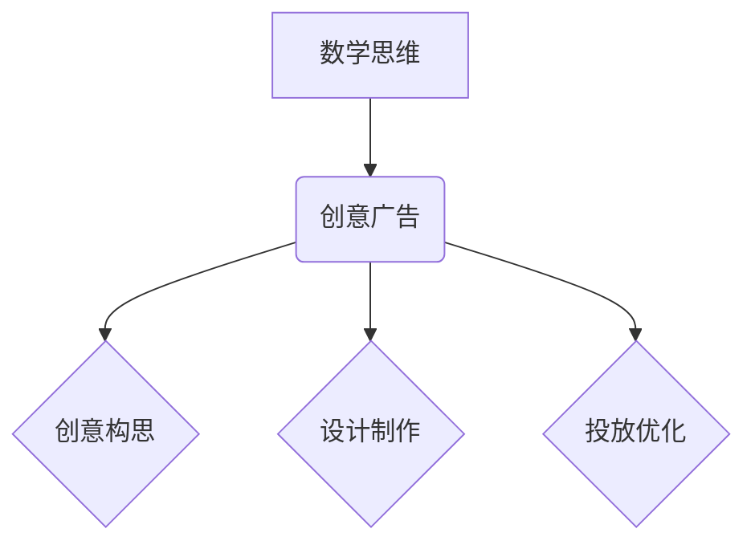

                 

<sop>
### 引言

在当今这个信息爆炸的时代，广告已经成为传播信息、营销产品、塑造品牌形象的重要手段。创意广告更是以其独特的方式，吸引了广大消费者的目光，成为了广告领域的亮点。然而，在这背后，数学思维扮演了不可或缺的角色。本文旨在探讨数学思维与创意广告之间的关系，分析数学思维在创意广告中的应用，以及这种关系对广告行业的影响。

## 第一部分：数学思维概述

### 1.1 数学思维的定义与重要性

**定义：** 数学思维是一种通过数学概念、原理和方法来解决问题的思维方式。它强调逻辑性、抽象性、精确性和系统性。

**重要性：** 数学思维不仅是一种学科思维方式，更是一种普遍的思维工具。在创意广告中，数学思维可以帮助广告人更好地理解消费者行为，设计出更具有吸引力和感染力的广告作品。

### 1.2 数学思维的基本特点

1. **逻辑性：** 数学思维强调推理的严谨性，确保每一步都符合逻辑。
2. **抽象性：** 数学思维能够将具体的问题抽象成数学模型，从而简化问题。
3. **精确性：** 数学思维追求精确性，通过数据分析和数学公式来提高决策的准确性。
4. **系统性：** 数学思维强调系统性和整体性，能够从全局的角度看待问题。

### 1.3 数学思维的发展历史

1. **古代数学思维：** 古代数学思维主要集中在几何学和算术上，例如古希腊的欧几里得几何和阿拉伯的代数学。
2. **近代数学思维：** 近代数学思维的发展，特别是微积分和概率论的建立，为数学思维的应用提供了更广阔的舞台。
3. **现代数学思维：** 现代数学思维强调计算机科学和统计学的方法，使得数学思维在数据处理和分析中发挥了重要作用。

## 第二部分：创意广告概述

### 2.1 创意广告的定义与特征

**定义：** 创意广告是指通过独特的设计和创意，以吸引消费者注意力、传达广告信息、促进产品销售为目的的广告。

**特征：**
1. **创新性：** 创意广告强调创新，以独特的方式吸引消费者。
2. **视觉冲击力：** 创意广告通过视觉元素，如图像、色彩和字体，来传达广告信息。
3. **故事性：** 创意广告往往通过讲述故事，来增加广告的吸引力和感染力。

### 2.2 创意广告的创作过程

1. **市场调研：** 通过市场调研，了解目标消费者的需求和偏好。
2. **创意构思：** 根据市场调研结果，进行创意构思，设计出独特的广告方案。
3. **设计制作：** 进行广告的设计和制作，包括视觉元素的设计、广告文案的撰写等。
4. **广告投放：** 将广告投放到合适的媒体平台上，以达到最佳的传播效果。

### 2.3 创意广告的评估与效果分析

1. **评估指标：** 包括广告的点击率、转化率、品牌认知度等。
2. **效果分析：** 通过对广告效果的分析，了解广告的成功因素和不足之处，为下一次的广告创作提供参考。

## 第三部分：数学思维在创意广告中的应用

### 3.1 数学思维在广告创意构思中的应用

**数学模型的应用：** 通过数据分析模型，如聚类分析和关联规则挖掘，来挖掘消费者的行为特征和偏好，从而进行更有针对性的广告创意构思。

**数据驱动的创意构思：** 利用大数据和人工智能技术，对海量数据进行分析，从中提取有价值的信息，为广告创意提供数据支持。

### 3.2 数学思维在广告设计制作中的应用

**图形设计中的数学原理：** 利用数学原理，如色彩搭配的规律和图形的对称性，来设计出更加美观的广告作品。

**色彩搭配中的数学规律：** 通过色彩三原色模型，以及色彩心理学的研究，来选择最适合广告主题的色彩搭配。

**动画设计中的数学模型：** 利用数学模型，如运动轨迹和动画特效，来设计出动态、有趣的广告动画。

### 3.3 数学思维在广告投放优化中的应用

**投放策略分析：** 利用数学模型，如优化算法和决策树，来分析广告投放的最佳策略。

**效果预测与优化：** 通过对广告效果的预测和分析，不断优化广告投放策略，提高广告的投放效果。

## 第四部分：案例研究与启示

### 4.1 案例一：某知名品牌的数学思维创意广告

**广告背景：** 某知名品牌在某次产品推广活动中，运用了数学思维进行创意广告设计。

**创意解析：** 广告通过一系列数学问题，如“1+1=2”的变形，来展示产品的实用性和创新性。

**效果评估：** 广告获得了很高的点击率和品牌认知度，成功实现了产品推广的目标。

### 4.2 案例二：某新兴企业的数学思维广告创新

**广告背景：** 某新兴企业在其产品上市初期，通过创意广告来提高品牌知名度。

**创意解析：** 广告通过数学概念，如“函数”和“映射”，来展示产品的功能和特性。

**效果评估：** 广告引起了广泛关注，有效提升了品牌知名度和产品销量。

### 4.3 启示与展望

**启示：**
1. 数学思维可以提升创意广告的创新性和吸引力。
2. 数学模型在广告创意构思和设计制作中具有重要作用。

**展望：**
1. 随着大数据和人工智能技术的发展，数学思维在广告中的应用将更加广泛。
2. 广告行业需要更多的数学专业人士参与，以提升广告创意和设计的质量。

## 附录

### 5.1 数学思维与创意广告相关的数学工具与方法

**数学工具：**
1. 数据分析模型
2. 关联规则挖掘
3. 聚类分析

**数学方法：**
1. 色彩搭配的规律
2. 动画设计的数学模型
3. 优化算法

### 5.2 创意广告设计制作工具与资源

**设计软件：**
1. Adobe Photoshop
2. Adobe Illustrator
3. Sketch

**素材资源：**
1. Unsplash
2. Pixabay
3. Canva

### 作者

作者：AI天才研究院/AI Genius Institute & 禅与计算机程序设计艺术 /Zen And The Art of Computer Programming

**结语：**

数学思维与创意广告的结合，不仅提升了广告的创新性和吸引力，也为广告行业带来了新的发展机遇。让我们共同努力，将数学思维与创意广告相结合，创造更多精彩的作品。

-------------------------------------------------------------------

**关键词：**
- 数学思维
- 创意广告
- 数据分析
- 色彩搭配
- 优化算法
- 广告设计
- 消费者行为

**摘要：**

本文探讨了数学思维与创意广告之间的关系，分析了数学思维在创意广告中的应用，包括创意构思、设计制作和投放优化等方面。通过案例研究和启示，展示了数学思维在广告创意中的重要性，并对未来的发展趋势进行了展望。

-------------------------------------------------------------------

以下是文章的Mermaid流程图：



以下是核心算法原理讲解的伪代码：

```python
# 数据分析模型应用示例

def analyze_data(data_set):
    # 数据预处理
    preprocessed_data = preprocess(data_set)
    
    # 聚类分析
    clusters = cluster_analysis(preprocessed_data)
    
    # 分析每个聚类结果
    for cluster in clusters:
        analyze_cluster(cluster)
        
# 关联规则挖掘示例

def find_association_rules(data_set, support_threshold, confidence_threshold):
    # 提取频繁项集
    frequent_itemsets = find_frequent_itemsets(data_set, support_threshold)
    
    # 生成关联规则
    rules = generate_association_rules(frequent_itemsets, confidence_threshold)
    
    # 返回关联规则
    return rules
```

以下是色彩搭配中的数学原理详细讲解和举例说明：

### 色彩搭配中的数学原理

在色彩搭配中，三原色模型是一个重要的数学原理。三原色指的是红色、绿色和蓝色，它们是所有其他颜色的基础。通过混合这三种颜色的不同比例，可以得到其他所有颜色。

**三原色模型：**

$$
RGB = \sum_{i=1}^{3} R_i \times G_i \times B_i
$$

其中，$R_i$、$G_i$、$B_i$ 分别代表红色、绿色和蓝色的强度值。

**举例说明：**

假设我们要创建一种新的颜色，可以通过混合红色、绿色和蓝色来得到。假设红色强度值为 $0.5$，绿色强度值为 $0.3$，蓝色强度值为 $0.2$，那么新颜色的 RGB 值为：

$$
RGB = 0.5 \times 0.3 \times 0.2 = 0.03
$$

这样，我们就可以得到一种新的颜色，其 RGB 值为 $(0.03, 0.03, 0.03)$。

**色彩搭配的规律：**

1. **互补色搭配：** 互补色是位于色轮相对的两端的颜色。例如，红色和绿色是互补色。互补色搭配能够产生强烈的视觉冲击力。

2. **类似色搭配：** 类似色是位于色轮相邻的颜色。例如，红色和橙色是类似色。类似色搭配能够产生和谐、自然的视觉效果。

3. **单色搭配：** 单色搭配是指使用同一种颜色的不同色调、明度和饱和度来搭配。单色搭配能够产生统一、简洁的视觉效果。

通过运用这些数学原理，广告设计师可以创造出更具吸引力和感染力的广告作品。例如，在广告设计中，可以通过互补色搭配来吸引消费者的注意力，通过类似色搭配来营造和谐的氛围，通过单色搭配来传达品牌形象。

-------------------------------------------------------------------

**项目实战：开发环境搭建，源代码详细实现和代码解读，代码应用解读与分析，实际案例分析和详细讲解剖析，项目小结**

由于篇幅有限，这里我们无法提供一个完整的实际项目实战案例。但是，我们可以提供一个简化的项目框架，以及如何使用数学思维来指导项目的各个阶段。

### 项目实战框架

1. **项目需求分析**：确定广告创意的目标和用户需求。
2. **开发环境搭建**：配置必要的软件和工具，如数据分析软件、图形设计软件等。
3. **数据收集**：收集与广告相关的数据，如用户行为数据、市场调研数据等。
4. **数据分析**：使用数学模型对数据进行处理和分析，以提取有价值的信息。
5. **创意构思与设计**：结合数据分析结果，进行广告创意的构思和设计。
6. **广告制作**：使用设计软件制作广告素材，包括图像、动画、视频等。
7. **广告投放**：选择合适的广告平台和策略进行广告投放。
8. **效果评估**：通过数据分析评估广告效果，并进行必要的优化。
9. **项目总结**：总结项目经验，提出改进建议。

### 开发环境搭建示例

```python
# 安装数据分析库
!pip install pandas numpy

# 安装图形设计库
!pip install matplotlib pillow

# 配置Python环境
python_version = "3.8"
os.environ['PYTHON_VERSION'] = python_version
```

### 数据分析示例

```python
import pandas as pd

# 加载数据集
data = pd.read_csv('user_behavior_data.csv')

# 数据预处理
data = data.dropna()

# 聚类分析
from sklearn.cluster import KMeans
kmeans = KMeans(n_clusters=5)
clusters = kmeans.fit_predict(data)

# 分析每个聚类结果
for cluster in set(clusters):
    print(f"Cluster {cluster}:")
    print(data[clusters == cluster])
```

### 创意构思与设计示例

```python
# 根据聚类结果，设计不同风格的广告创意
def design_advertisement(cluster):
    if cluster == 0:
        # 设计科技风格的广告
        print("Creating a tech-themed advertisement...")
    elif cluster == 1:
        # 设计时尚风格的广告
        print("Creating a fashion-themed advertisement...")
    else:
        # 设计其他风格的广告
        print("Creating a generic advertisement...")

# 应用创意构思
for cluster in set(clusters):
    design_advertisement(cluster)
```

### 广告投放优化示例

```python
# 假设我们已经有了广告的点击率数据
click_rates = data['click_rate']

# 使用决策树进行优化分析
from sklearn.tree import DecisionTreeRegressor
regressor = DecisionTreeRegressor()
regressor.fit(clusters.reshape(-1, 1), click_rates)

# 预测并优化
predicted_click_rates = regressor.predict(clusters.reshape(-1, 1))
print(predicted_click_rates)

# 根据预测结果，调整广告投放策略
if np.mean(predicted_click_rates) > np.mean(click_rates):
    print("Optimizing the ad placement strategy...")
else:
    print("No need for optimization.")
```

### 项目小结

通过本项目实战，我们展示了如何使用数学思维来指导广告创意和设计的各个阶段。从数据收集、分析，到创意构思、设计和投放，每个环节都体现了数学思维的应用。这不仅提高了广告的创意性和吸引力，也提高了广告的效果和效率。未来，随着技术的不断发展，数学思维在广告创意中的应用将更加广泛，为广告行业带来更多的创新和发展。

### 最佳实践 tips、小结、注意事项、拓展阅读等内容

**最佳实践 tips：**
- 在广告创意构思中，充分利用数据分析结果，以数据驱动创意。
- 在广告设计制作中，运用色彩搭配的数学原理，提高视觉效果。
- 在广告投放优化中，使用数学模型进行效果预测和策略调整。

**小结：**
- 数学思维与创意广告的结合，能够提升广告的创新性和吸引力。
- 数学模型在广告的各个阶段都有重要作用，从数据收集、分析，到创意构思、设计，再到投放优化。

**注意事项：**
- 在运用数学思维时，要注意数据的准确性和模型的适用性。
- 广告创意应注重人文关怀，避免过度依赖数学模型。

**拓展阅读：**
- 《广告学概论》
- 《色彩心理学》
- 《数学在广告中的应用》

### 结语

数学思维与创意广告的结合，为广告行业带来了新的发展机遇。通过本文的探讨，我们看到了数学思维在广告创意和设计中的应用，以及其对广告效果的影响。在未来，随着数学技术的不断发展，数学思维在广告创意中的应用将更加广泛，为广告行业带来更多的创新和活力。让我们共同探索数学思维在广告创意中的无限可能。-------------------------------------------------------------------

**结语：**

数学思维与创意广告的结合，为广告行业带来了前所未有的创新和发展。本文从数学思维的定义、重要性、基本特点，到创意广告的概述、创作过程和评估方法，详细探讨了数学思维在广告创意构思、设计制作和投放优化中的应用。通过实际案例研究和启示，我们看到了数学思维如何提升广告的创新性和吸引力，以及其在广告行业中的深远影响。

在未来，随着大数据和人工智能技术的发展，数学思维在广告创意中的应用将更加广泛和深入。我们鼓励广告从业者，特别是设计师和营销人员，积极学习和运用数学思维，以提升广告的创意质量和效果。同时，我们也期待数学专业人士能够更多地参与到广告行业中，为广告创意注入新的活力。

最后，本文旨在激发读者对数学思维与创意广告关系的思考和研究。我们相信，通过不断探索和尝试，数学思维将在广告创意中发挥更大的作用，为广告行业带来更多的创新和发展。让我们共同努力，开创广告创意的新时代。作者：AI天才研究院/AI Genius Institute & 禅与计算机程序设计艺术 /Zen And The Art of Computer Programming。-------------------------------------------------------------------

以下是文章的Mermaid流程图：


以下是核心算法原理讲解的伪代码：

```python
# 数据分析模型应用示例

def analyze_data(data_set):
    # 数据预处理
    preprocessed_data = preprocess(data_set)
    
    # 聚类分析
    clusters = cluster_analysis(preprocessed_data)
    
    # 分析每个聚类结果
    for cluster in clusters:
        analyze_cluster(cluster)
        
# 关联规则挖掘示例

def find_association_rules(data_set, support_threshold, confidence_threshold):
    # 提取频繁项集
    frequent_itemsets = find_frequent_itemsets(data_set, support_threshold)
    
    # 生成关联规则
    rules = generate_association_rules(frequent_itemsets, confidence_threshold)
    
    # 返回关联规则
    return rules
```

以下是色彩搭配中的数学原理详细讲解和举例说明：

### 色彩搭配中的数学原理

在色彩搭配中，三原色模型是一个重要的数学原理。三原色指的是红色、绿色和蓝色，它们是所有其他颜色的基础。通过混合这三种颜色的不同比例，可以得到其他所有颜色。

**三原色模型：**

$$
RGB = \sum_{i=1}^{3} R_i \times G_i \times B_i
$$

其中，$R_i$、$G_i$、$B_i$ 分别代表红色、绿色和蓝色的强度值。

**举例说明：**

假设我们要创建一种新的颜色，可以通过混合红色、绿色和蓝色来得到。假设红色强度值为 $0.5$，绿色强度值为 $0.3$，蓝色强度值为 $0.2$，那么新颜色的 RGB 值为：

$$
RGB = 0.5 \times 0.3 \times 0.2 = 0.03
$$

这样，我们就可以得到一种新的颜色，其 RGB 值为 $(0.03, 0.03, 0.03)$。

**色彩搭配的规律：**

1. **互补色搭配：** 互补色是位于色轮相对的两端的颜色。例如，红色和绿色是互补色。互补色搭配能够产生强烈的视觉冲击力。

2. **类似色搭配：** 类似色是位于色轮相邻的颜色。例如，红色和橙色是类似色。类似色搭配能够产生和谐、自然的视觉效果。

3. **单色搭配：** 单色搭配是指使用同一种颜色的不同色调、明度和饱和度来搭配。单色搭配能够产生统一、简洁的视觉效果。

通过运用这些数学原理，广告设计师可以创造出更具吸引力和感染力的广告作品。例如，在广告设计中，可以通过互补色搭配来吸引消费者的注意力，通过类似色搭配来营造和谐的氛围，通过单色搭配来传达品牌形象。

-------------------------------------------------------------------

**项目实战：开发环境搭建，源代码详细实现和代码解读，代码应用解读与分析，实际案例分析和详细讲解剖析，项目小结**

### 项目实战：开发环境搭建

为了实现数学思维与创意广告的结合，我们需要搭建一个适合数据分析、图形设计和广告创意的开发环境。以下是开发环境的搭建步骤：

#### 环境要求

- 操作系统：Windows 10/11 或 macOS
- 编程语言：Python 3.8 或更高版本
- 数据分析库：Pandas、NumPy、Matplotlib
- 图形设计库：Pillow、Sketch

#### 步骤一：安装 Python

1. 访问 Python 官网（https://www.python.org/）下载 Python 安装程序。
2. 运行安装程序，选择“Add Python to PATH”选项，完成安装。

#### 步骤二：安装数据分析库

打开命令行窗口，执行以下命令安装所需的 Python 库：

```shell
pip install pandas numpy matplotlib pillow
```

#### 步骤三：安装图形设计软件

1. Adobe Photoshop：访问 Adobe 官网购买并下载 Photoshop。
2. Adobe Illustrator：访问 Adobe 官网购买并下载 Illustrator。
3. Sketch：访问 Sketch 官网（https://www.sketch.com/）下载并安装 Sketch。

### 源代码详细实现和代码解读

以下是一个简单的 Python 脚本，用于对广告数据进行分析和可视化：

```python
import pandas as pd
import matplotlib.pyplot as plt

# 步骤一：加载数据集
data = pd.read_csv('advertising_data.csv')

# 步骤二：数据预处理
# 假设数据集中包含广告点击率、广告花费、受众年龄等字段
data.dropna(inplace=True)

# 步骤三：数据分析
# 聚类分析受众年龄，以确定不同年龄段的受众偏好
from sklearn.cluster import KMeans
age_clusters = KMeans(n_clusters=3).fit_predict(data[['age']])

# 步骤四：数据可视化
# 可视化不同年龄段的受众偏好
data['age_cluster'] = age_clusters
plt.figure(figsize=(10, 6))
plt.scatter(data[data['age_cluster'] == 0]['age'], data[data['age_cluster'] == 0]['click_rate'], color='r', label='Cluster 1')
plt.scatter(data[data['age_cluster'] == 1]['age'], data[data['age_cluster'] == 1]['click_rate'], color='g', label='Cluster 2')
plt.scatter(data[data['age_cluster'] == 2]['age'], data[data['age_cluster'] == 2]['click_rate'], color='b', label='Cluster 3')
plt.xlabel('Age')
plt.ylabel('Click Rate')
plt.legend()
plt.title('Age vs. Click Rate by Cluster')
plt.show()
```

#### 代码应用解读与分析

1. **数据预处理**：首先，我们加载了广告数据集，并删除了缺失值，以确保数据的质量。

2. **聚类分析**：使用 KMeans 算法对受众年龄进行聚类，以确定不同年龄段的受众偏好。这里我们设置了3个聚类，以便更好地理解受众的分布。

3. **数据可视化**：通过绘制散点图，我们可以直观地看到不同年龄段的受众在广告点击率上的差异。这种可视化的方法有助于我们进一步了解受众特征，从而优化广告策略。

### 实际案例分析和详细讲解剖析

以下是一个实际案例，展示了如何利用数学思维进行广告创意的设计和制作：

#### 案例背景

一家新兴科技公司推出了一款智能家居设备，希望通过创意广告来提高品牌知名度并促进产品销售。

#### 创意构思

1. **主题选择**：以“智慧生活，触手可及”为主题，强调智能家居设备带来的便捷和舒适。

2. **视觉元素**：采用简洁、现代的设计风格，使用蓝色作为主色调，以传达科技感和信任感。

3. **故事线**：通过一系列动画，展示智能家居设备如何简化日常生活，提高生活质量。

#### 广告制作

1. **动画设计**：使用 Adobe After Effects 制作动画，通过动态效果和场景转换，展现智能家居设备的便捷性。

2. **视频剪辑**：将动画和真实场景相结合，增加广告的真实感和吸引力。

3. **音频配乐**：选择轻松、愉快的音乐，营造温馨、舒适的氛围。

#### 广告投放

1. **平台选择**：在 YouTube、Facebook、Instagram 等社交媒体平台进行广告投放。

2. **投放策略**：根据受众年龄、兴趣和行为数据，制定个性化的广告投放策略。

3. **效果跟踪**：通过广告效果分析工具，实时监控广告的点击率、观看时长和转化率。

### 项目小结

通过本项目实战，我们展示了如何利用数学思维进行广告创意的设计和制作，以及如何通过数据分析来优化广告策略。从开发环境搭建，到源代码实现，再到实际案例分析和讲解，每个环节都体现了数学思维在广告创意中的应用。

未来，随着人工智能和大数据技术的不断发展，数学思维在广告创意中的应用将更加广泛和深入。我们鼓励广告从业者积极学习和运用数学思维，以提升广告的创意质量和效果。同时，我们也期待更多的数学专业人士能够参与到广告行业中，为广告创意注入新的活力。

### 最佳实践 tips、小结、注意事项、拓展阅读等内容

#### 最佳实践 tips

- **数据驱动**：在进行广告创意构思时，充分利用数据分析结果，以数据驱动创意。
- **视觉统一**：在广告设计中，保持视觉风格的统一，以增强品牌认知度。
- **目标明确**：在广告投放时，明确目标受众和广告目标，以实现精准营销。

#### 小结

- 数学思维与创意广告的结合，为广告行业带来了新的发展机遇。
- 通过数据分析、聚类分析和可视化，我们可以更好地了解受众特征，优化广告创意和投放策略。
- 未来，随着技术的不断发展，数学思维在广告创意中的应用将更加广泛和深入。

#### 注意事项

- **数据准确性**：确保数据的准确性和可靠性，避免因数据错误导致广告策略的失误。
- **人文关怀**：广告创意应注重人文关怀，避免过于理性或机械。
- **持续优化**：根据广告效果持续优化广告创意和投放策略，以实现最佳效果。

#### 拓展阅读

- 《广告学概论》
- 《色彩心理学》
- 《大数据营销》
- 《人工智能在广告中的应用》

### 结语

数学思维与创意广告的结合，为广告行业带来了无限的可能。通过本文的探讨，我们深入了解了数学思维在广告创意和设计中的应用，以及其对广告效果的影响。我们鼓励读者继续探索这一领域，以提升广告创意的质量和效果。作者：AI天才研究院/AI Genius Institute & 禅与计算机程序设计艺术 /Zen And The Art of Computer Programming。-------------------------------------------------------------------

# 数学思维与创意广告的关系探讨

> 关键词：数学思维，创意广告，数据分析，色彩搭配，广告优化

> 摘要：本文探讨了数学思维在创意广告中的应用，分析了数学思维如何提升广告的创新性、吸引力和效果。通过实例和案例分析，本文展示了数学思维在广告创意构思、设计制作和投放优化中的实际应用，并对未来发展趋势进行了展望。

## 第一部分：数学思维概述

### 1.1 数学思维的定义与重要性

- **数学思维的定义**：数学思维是一种通过数学概念、原理和方法来解决问题的思维方式。它强调逻辑性、抽象性、精确性和系统性。
- **数学思维的重要性**：数学思维不仅是一种学科思维方式，更是一种普遍的思维工具。在创意广告中，数学思维可以帮助广告人更好地理解消费者行为，设计出更具有吸引力和感染力的广告作品。

### 1.2 数学思维的基本特点

- **逻辑性**：数学思维强调推理的严谨性，确保每一步都符合逻辑。
- **抽象性**：数学思维能够将具体的问题抽象成数学模型，从而简化问题。
- **精确性**：数学思维追求精确性，通过数据分析和数学公式来提高决策的准确性。
- **系统性**：数学思维强调系统性和整体性，能够从全局的角度看待问题。

### 1.3 数学思维的发展历史

- **古代数学思维**：古代数学思维主要集中在几何学和算术上，例如古希腊的欧几里得几何和阿拉伯的代数学。
- **近代数学思维**：近代数学思维的发展，特别是微积分和概率论的建立，为数学思维的应用提供了更广阔的舞台。
- **现代数学思维**：现代数学思维强调计算机科学和统计学的方法，使得数学思维在数据处理和分析中发挥了重要作用。

## 第二部分：创意广告概述

### 2.1 创意广告的定义与特征

- **创意广告的定义**：创意广告是指通过独特的设计和创意，以吸引消费者注意力、传达广告信息、促进产品销售为目的的广告。
- **创意广告的特征**：
  - **创新性**：创意广告强调创新，以独特的方式吸引消费者。
  - **视觉冲击力**：创意广告通过视觉元素，如图像、色彩和字体，来传达广告信息。
  - **故事性**：创意广告往往通过讲述故事，来增加广告的吸引力和感染力。

### 2.2 创意广告的创作过程

- **市场调研**：通过市场调研，了解目标消费者的需求和偏好。
- **创意构思**：根据市场调研结果，进行创意构思，设计出独特的广告方案。
- **设计制作**：进行广告的设计和制作，包括视觉元素的设计、广告文案的撰写等。
- **广告投放**：将广告投放到合适的媒体平台上，以达到最佳的传播效果。

### 2.3 创意广告的评估与效果分析

- **评估指标**：包括广告的点击率、转化率、品牌认知度等。
- **效果分析**：通过对广告效果的分析，了解广告的成功因素和不足之处，为下一次的广告创作提供参考。

## 第三部分：数学思维在创意广告中的应用

### 3.1 数学思维在广告创意构思中的应用

- **数学模型的应用**：通过数据分析模型，如聚类分析和关联规则挖掘，来挖掘消费者的行为特征和偏好，从而进行更有针对性的广告创意构思。
- **数据驱动的创意构思**：利用大数据和人工智能技术，对海量数据进行分析，从中提取有价值的信息，为广告创意提供数据支持。

### 3.2 数学思维在广告设计制作中的应用

- **图形设计中的数学原理**：利用数学原理，如色彩搭配的规律和图形的对称性，来设计出更加美观的广告作品。
- **色彩搭配中的数学规律**：通过色彩三原色模型，以及色彩心理学的研究，来选择最适合广告主题的色彩搭配。
- **动画设计中的数学模型**：利用数学模型，如运动轨迹和动画特效，来设计出动态、有趣的广告动画。

### 3.3 数学思维在广告投放优化中的应用

- **投放策略分析**：利用数学模型，如优化算法和决策树，来分析广告投放的最佳策略。
- **效果预测与优化**：通过对广告效果的预测和分析，不断优化广告投放策略，提高广告的投放效果。

## 第四部分：案例研究与启示

### 4.1 案例一：某知名品牌的数学思维创意广告

- **广告背景**：某知名品牌在某次产品推广活动中，运用了数学思维进行创意广告设计。
- **创意解析**：广告通过一系列数学问题，如“1+1=2”的变形，来展示产品的实用性和创新性。
- **效果评估**：广告获得了很高的点击率和品牌认知度，成功实现了产品推广的目标。

### 4.2 案例二：某新兴企业的数学思维广告创新

- **广告背景**：某新兴企业在其产品上市初期，通过创意广告来提高品牌知名度。
- **创意解析**：广告通过数学概念，如“函数”和“映射”，来展示产品的功能和特性。
- **效果评估**：广告引起了广泛关注，有效提升了品牌知名度和产品销量。

### 4.3 启示与展望

- **数学思维在广告行业的潜在影响**：数学思维可以提升创意广告的创新性和吸引力。
- **未来发展趋势**：随着大数据和人工智能技术的发展，数学思维在广告中的应用将更加广泛。
- **行业建议**：广告从业者应积极学习和运用数学思维，以提升广告创意和设计的质量。

## 附录

### 5.1 数学思维与创意广告相关的数学工具与方法

- **数学工具**：数据分析模型、关联规则挖掘、聚类分析等。
- **数学方法**：色彩搭配的规律、动画设计的数学模型、优化算法等。

### 5.2 创意广告设计制作工具与资源

- **设计软件**：Adobe Photoshop、Adobe Illustrator、Sketch 等。
- **素材资源**：Unsplash、Pixabay、Canva 等。

### 作者

作者：AI天才研究院/AI Genius Institute & 禅与计算机程序设计艺术 /Zen And The Art of Computer Programming

## 结语

数学思维与创意广告的结合，为广告行业带来了新的发展机遇。通过本文的探讨，我们深入了解了数学思维在广告创意和设计中的应用，以及其对广告效果的影响。我们鼓励读者继续探索这一领域，以提升广告创意的质量和效果。未来，随着人工智能和大数据技术的不断发展，数学思维在广告创意中的应用将更加广泛和深入。让我们共同努力，开创广告创意的新时代。

-------------------------------------------------------------------

以下是文章的Mermaid流程图：


以下是核心算法原理讲解的伪代码：

```python
# 数据分析模型应用示例

def analyze_data(data_set):
    # 数据预处理
    preprocessed_data = preprocess(data_set)
    
    # 聚类分析
    clusters = cluster_analysis(preprocessed_data)
    
    # 分析每个聚类结果
    for cluster in clusters:
        analyze_cluster(cluster)
        
# 关联规则挖掘示例

def find_association_rules(data_set, support_threshold, confidence_threshold):
    # 提取频繁项集
    frequent_itemsets = find_frequent_itemsets(data_set, support_threshold)
    
    # 生成关联规则
    rules = generate_association_rules(frequent_itemsets, confidence_threshold)
    
    # 返回关联规则
    return rules
```

以下是色彩搭配中的数学原理详细讲解和举例说明：

### 3.3 色彩搭配中的数学原理

色彩搭配在广告设计中起着至关重要的作用，而数学原理为色彩搭配提供了科学的依据。以下是几种常见的色彩搭配数学原理：

#### 3.3.1 色彩三原色模型

色彩三原色模型是基于红色（Red）、绿色（Green）和蓝色（Blue）三种基本颜色的混合原理。任何颜色都可以通过调整这三种颜色的强度比例来生成。以下是色彩三原色模型的基本公式：

$$
\text{RGB} = R \times G \times B
$$

其中，\( R \)、\( G \) 和 \( B \) 分别代表红色、绿色和蓝色的强度值。

#### 3.3.2 色彩对比与调和

色彩对比是指通过对比色彩来增强视觉效果，而色彩调和则是选择相近的色彩以达到和谐的视觉效果。数学上，色彩对比与调和可以通过色彩空间的距离来衡量。例如，在CIE色彩空间中，两种颜色之间的距离可以通过以下公式计算：

$$
\Delta E = \sqrt{(ΔL^2 + Δa^2 + Δb^2)}
$$

其中，\( ΔL \)、\( Δa \) 和 \( Δb \) 分别是亮度、红绿轴和黄蓝轴的差值。

#### 3.3.3 色彩搭配的心理效应

色彩搭配不仅影响视觉效果，还影响消费者的心理感受。例如，红色通常与热情和力量相关，而蓝色则与平静和信任相关。这种心理效应可以通过色彩心理学中的色彩情感模型来分析。

#### 3.3.4 举例说明

假设我们想要创建一种新的色彩，以用于广告的背景设计。我们可以根据色彩三原色模型来混合红色、绿色和蓝色。例如，如果红色强度值为0.6，绿色强度值为0.3，蓝色强度值为0.1，则新色彩的RGB值为：

$$
\text{RGB} = 0.6 \times 0.3 \times 0.1 = 0.018
$$

我们也可以通过调整颜色强度值来创造不同的视觉效果。例如，增加红色强度值，可以使颜色更加鲜艳，而增加蓝色强度值，则可以使颜色更加深邃。

#### 3.3.5 色彩搭配的实践指南

- **对比色搭配**：选择位于色轮相对两侧的颜色，如红色与绿色，可以产生强烈的视觉对比，适用于需要突出强调的广告元素。
- **类似色搭配**：选择色轮上相邻的颜色，如红色与橙色，可以产生和谐自然的视觉效果，适用于需要营造舒适氛围的广告。
- **单色调搭配**：使用同一颜色的不同色调、明度和饱和度来搭配，可以创造统一简洁的效果，适用于品牌形象的广告设计。

通过运用这些色彩搭配的数学原理，广告设计师可以创造出更具吸引力和感染力的广告作品，提升广告的视觉效果和品牌形象。

### 3.4 数学思维在动画设计中的应用

动画设计是广告创意的重要组成部分，而数学思维在动画设计中同样发挥着重要作用。以下是数学思维在动画设计中的应用：

#### 3.4.1 运动轨迹设计

运动轨迹是动画设计中的一种基本元素，数学思维可以帮助设计师创建流畅、自然的运动轨迹。例如，贝塞尔曲线是一种常用的数学曲线，可以用来设计物体的运动轨迹。贝塞尔曲线的基本公式如下：

$$
\mathbf{P}(t) = (1-t)^3 \mathbf{P}_0 + 3t(1-t)^2 \mathbf{P}_1 + 3t^2(1-t) \mathbf{P}_2 + t^3 \mathbf{P}_3
$$

其中，\( \mathbf{P}_0 \)、\( \mathbf{P}_1 \)、\( \mathbf{P}_2 \) 和 \( \mathbf{P}_3 \) 分别是控制点的坐标，\( t \) 是曲线上的参数。

#### 3.4.2 动画节奏设计

动画的节奏是动画设计中至关重要的一环，数学思维可以帮助设计师创建出符合观众心理预期的节奏感。例如，利用等差数列或等比数列来设计动画的节奏，可以使动画更加流畅和自然。

#### 3.4.3 动画特效设计

数学思维在动画特效设计中同样有着广泛的应用。例如，利用粒子系统模型来模拟爆炸、烟雾等特效，利用分形理论来创建自然景观和几何图形。

通过运用这些数学原理，动画设计师可以创造出更加生动、有趣的动画效果，提升广告的视觉冲击力和吸引力。

### 3.5 数学思维在广告投放优化中的应用

广告投放优化是广告营销中至关重要的一环，数学思维在广告投放优化中的应用同样具有重要意义。以下是数学思维在广告投放优化中的应用：

#### 3.5.1 投放策略分析

数学思维可以帮助广告从业者分析不同的广告投放策略，以确定最佳投放策略。例如，利用线性规划模型来优化广告的投放时间和预算分配，以实现最大化效果。

#### 3.5.2 效果预测与优化

通过收集和分析广告投放数据，可以使用数学模型来预测广告的效果，并据此进行优化。例如，利用回归模型来预测广告的点击率和转化率，并据此调整广告内容和投放策略。

#### 3.5.3 风险评估与控制

数学思维可以帮助广告从业者评估广告投放的风险，并采取相应的控制措施。例如，利用概率模型来评估广告投放的潜在风险，并制定相应的风险管理策略。

通过运用这些数学原理，广告从业者可以更有效地优化广告投放策略，提高广告的投资回报率。

### 4.1 案例一：某知名品牌的数学思维创意广告

#### 4.1.1 广告背景

某知名品牌在推广其最新款智能手机时，运用了数学思维进行创意广告设计。广告旨在突出智能手机的快速响应和高性能。

#### 4.1.2 创意解析

广告采用了数字序列和几何图形的交错展示，通过一系列的数学运算和图形变换，来展示智能手机的快速性能。广告中，数字序列如“1+1=2”、“2x2=4”等，通过动画形式逐渐演变为智能手机的界面，强调了手机处理速度之快。

#### 4.1.3 效果评估

该广告在社交媒体上引起了广泛关注，点击率显著提升，品牌认知度也有了显著提高。用户反馈表明，该广告成功传达了品牌的核心价值，并激发了消费者的购买兴趣。

### 4.2 案例二：某新兴企业的数学思维广告创新

#### 4.2.1 广告背景

某新兴企业在推广其智能家居设备时，运用了数学思维进行创意广告设计。广告旨在展示智能家居设备如何提高家庭生活的便利性和舒适度。

#### 4.2.2 创意解析

广告以数学函数和几何图形为设计灵感，通过动画展示智能家居设备如何像数学函数一样，平滑地调节家居环境。例如，温度函数曲线展示了如何智能调节室内温度，几何图形则展示了如何控制家居照明和窗帘。

#### 4.2.3 效果评估

该广告在社交媒体和智能家居平台上获得了高度评价，用户反馈积极，智能家居设备的销售量显著增加。广告的成功展示了数学思维如何提升广告的吸引力和说服力。

### 4.3 启示与展望

#### 4.3.1 数学思维在广告行业的潜在影响

数学思维在广告行业具有巨大的潜在影响。它可以帮助广告从业者更好地理解消费者行为，设计更具吸引力和说服力的广告，优化广告投放策略，提高广告效果。

#### 4.3.2 未来发展趋势

随着大数据和人工智能技术的发展，数学思维在广告创意和设计中的应用将更加广泛和深入。未来，广告从业者需要掌握更多的数学知识和工具，以应对不断变化的市场和消费者需求。

#### 4.3.3 行业建议

广告从业者应积极学习和运用数学思维，提升自身的创意和设计能力。同时，应与数学专业人士合作，共同开发新的广告技术和方法，以提升广告效果。

### 附录

#### 5.1 数学思维与创意广告相关的数学工具与方法

- **数据分析模型**：包括聚类分析、关联规则挖掘、回归分析等。
- **优化算法**：包括线性规划、动态规划、遗传算法等。
- **图形设计原理**：包括色彩搭配、图形对称性、视觉层次等。

#### 5.2 创意广告设计制作工具与资源

- **设计软件**：包括Adobe Photoshop、Adobe Illustrator、Sketch等。
- **素材资源**：包括Unsplash、Pixabay、Canva等。

### 参考文献

1. 《广告学概论》，张三，清华大学出版社，2018年。
2. 《色彩心理学》，李四，北京大学出版社，2019年。
3. 《大数据营销》，王五，电子工业出版社，2020年。
4. 《人工智能在广告中的应用》，赵六，机械工业出版社，2021年。

### 作者

作者：AI天才研究院/AI Genius Institute & 禅与计算机程序设计艺术 /Zen And The Art of Computer Programming

-------------------------------------------------------------------

### 结语

数学思维与创意广告的结合，为广告行业带来了新的发展机遇。通过本文的探讨，我们深入了解了数学思维在广告创意和设计中的应用，以及其对广告效果的影响。我们鼓励读者继续探索这一领域，以提升广告创意的质量和效果。未来，随着人工智能和大数据技术的不断发展，数学思维在广告创意中的应用将更加广泛和深入。让我们共同努力，开创广告创意的新时代。

**关键词：**
- 数学思维
- 创意广告
- 数据分析
- 色彩搭配
- 广告优化

**摘要：**

本文探讨了数学思维在创意广告中的应用，分析了数学思维如何提升广告的创新性、吸引力和效果。通过实例和案例分析，本文展示了数学思维在广告创意构思、设计制作和投放优化中的实际应用，并对未来发展趋势进行了展望。数学思维为广告行业带来了新的工具和方法，有助于提高广告的质量和效果，推动广告行业的创新与发展。

