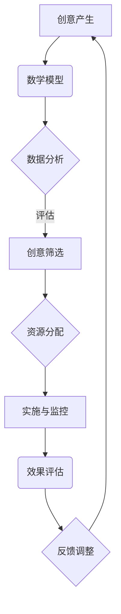

                 

### 引言

在当今信息化和全球化迅速发展的时代，创新已成为推动社会进步和企业竞争力的关键因素。创意管理作为企业管理的重要组成部分，越来越受到重视。与此同时，数学思维作为一种强大的逻辑分析工具，逐渐渗透到各个领域，成为解决复杂问题的有效途径。数学思维与创意管理之间的关系探讨，正是为了揭示这两者在创新过程中的相互作用与影响。

本书旨在探讨数学思维与创意管理之间的关系，分析数学思维对创意管理的影响，以及如何在创意管理过程中有效地运用数学思维。具体而言，本书将涵盖以下内容：

1. **数学思维概述**：介绍数学思维的定义、特点和发展历程，为后续讨论打下基础。
2. **创意管理概述**：阐述创意管理的概念、重要性及其核心要素，为理解数学思维在创意管理中的应用奠定基础。
3. **数学思维与创意管理的联系**：探讨两者之间的理论联系和实际应用，通过Mermaid流程图展示数学思维与创意管理的相互作用机制。
4. **数学思维在创意管理中的应用**：分析数学思维在创意管理中的具体应用案例，提供实用的方法和技巧。
5. **案例分析**：通过具体案例分析，展示数学思维在创意管理中的实际效果。
6. **培养和提高数学思维与创意管理能力**：探讨如何通过教育体系、企业培训和自我提升来培养和提高数学思维与创意管理能力。
7. **结论**：总结本书的研究成果，指出研究的局限性和未来研究方向。

通过以上章节的探讨，本书希望为读者提供关于数学思维与创意管理之间关系的深入理解，帮助企业和个人在创新过程中更好地运用数学思维，提升创意管理水平。

### 数学思维概述

数学思维是一种基于数学原理和逻辑推理的思考方式，它不仅包括数学知识的运用，还涉及对问题进行抽象、建模和解决的能力。数学思维具有以下几个显著特点：

#### 1. 灵活性

数学思维具有很强的灵活性，这意味着它在处理问题时能够适应各种变化。无论是在解决数学问题，还是在处理复杂的管理问题，数学思维都能够通过变换视角、调整策略来应对新的情况。

#### 2. 创造性

数学思维具有高度的创造性，它鼓励人们跳出传统的思维模式，寻找新的解决方案。数学中的许多重大突破，如哥德巴赫猜想的证明，都是通过创造性的数学思维实现的。

#### 3. 系统性

数学思维强调系统性，这意味着在处理问题时，需要考虑各个部分之间的相互关系和整体结构。数学模型正是通过这种系统性来揭示复杂系统的内在规律。

#### 4. 精确性

数学思维注重精确性，它要求在解决问题时，用精确的术语和逻辑推理来表述思想和结论。这种精确性不仅提高了思维的质量，也使得数学思维在科学研究和工程设计等领域中具有不可替代的价值。

#### 数学思维的发展历程

数学思维的发展历程可以追溯到古代。在古代，数学思维主要用于解决实际问题，如测量土地、计算时间和预测天文现象。古希腊的数学家如欧几里得和阿基米德，通过他们的研究，奠定了现代数学的基础。

在中世纪，数学思维得到了进一步的发展。阿拉伯数学家在代数和几何学方面做出了重要贡献，推动了数学的广泛应用。

到了现代，随着计算机科学和信息技术的发展，数学思维的应用范围得到了极大的扩展。现代数学思维不仅涵盖了传统数学领域，还包括了统计学、运筹学、图论等新兴学科。这些新兴学科为解决复杂的社会和经济问题提供了强大的工具。

总之，数学思维作为一种逻辑分析工具，具有灵活、创造性、系统性和精确性的特点。它不仅是一种学术研究的方法，更是一种解决复杂问题的实用技能。在接下来的章节中，我们将进一步探讨数学思维在创意管理中的应用，以及如何通过数学思维提升创意管理水平。

### 创意管理概述

创意管理是指通过系统的策划、组织、实施和控制，激发员工的创新潜力，并将创意转化为实际的产品或服务。创意管理的重要性在于，它能够帮助企业保持竞争优势，推动持续创新，满足市场需求。

#### 1. 创意管理的定义

创意管理（Creative Management）是一种结合了管理科学和创意艺术的方法，旨在通过组织、引导和激励员工，实现创意的生成和实施。它不仅仅关注创意的产出，还强调创意的可持续性、实用性和商业化。

#### 2. 创意管理的重要性

- **推动创新**：创意管理能够激发员工的创新思维，推动企业在产品、服务、商业模式等方面的持续创新。
- **增强竞争力**：通过创意管理，企业能够开发出具有独特性和差异化的产品或服务，增强市场竞争力。
- **提升品牌价值**：创意管理能够提升企业的品牌形象，增强消费者对品牌的认知和忠诚度。
- **应对市场变化**：创意管理使企业能够灵活应对市场变化，快速调整策略，抓住市场机会。

#### 3. 创意管理的核心要素

- **创意氛围**：营造一个鼓励创新、包容失败的氛围，使员工敢于提出新的想法和解决方案。
- **激励机制**：建立有效的激励机制，鼓励员工积极参与创意活动，并对优秀创意给予奖励。
- **团队协作**：促进跨部门、跨领域的团队协作，充分利用团队成员的不同视角和技能，实现创意的整合和优化。
- **资源支持**：提供必要的资源，包括资金、技术、时间等，以确保创意能够得到充分的支持和实施。
- **流程管理**：建立有效的创意管理流程，从创意的产生、筛选、开发到实施，确保创意能够顺利地转化为实际成果。

通过以上核心要素，创意管理能够有效地激发和引导员工的创意潜力，实现企业的创新目标。在接下来的章节中，我们将进一步探讨数学思维与创意管理之间的联系，以及数学思维在创意管理中的应用。

### 数学思维与创意管理的联系

数学思维与创意管理之间存在密切的联系，这种联系不仅体现在理论基础上，更在实际应用中得到了充分的体现。通过理论分析和实际案例，我们可以更深入地理解这两者之间的相互作用机制。

#### 1. 理论基础

- **系统性思维**：数学思维强调系统性，能够帮助管理者从整体上把握创意管理的流程和各个环节之间的关系。通过建立数学模型，管理者可以更清晰地了解创意从产生到实施的全过程，从而优化资源配置，提高效率。

- **逻辑推理**：数学思维注重逻辑推理，使得管理者在处理创意管理问题时能够进行严谨的分析和判断。逻辑推理能够帮助管理者识别问题、分析问题并找到最佳的解决方案，从而提高创意管理的有效性。

- **抽象能力**：数学思维鼓励抽象能力的培养，管理者通过抽象思维能够将复杂的管理问题简化为数学问题，从而找到解决问题的关键。这种能力在创意管理中尤为重要，因为创意往往涉及到复杂的跨领域知识和技能。

- **统计与概率**：数学中的统计与概率理论为创意管理提供了科学依据。管理者可以通过数据分析来评估创意的成功概率，从而做出更为理性的决策。同时，概率论也为创意管理中的风险评估提供了有力工具。

#### 2. 实际应用中的体现

- **创意筛选与优化**：在创意管理中，数学思维可以帮助管理者对大量的创意进行筛选和优化。通过建立数学模型，对创意的创新性、实用性、商业价值等进行量化评估，从而筛选出最具潜力的创意。

- **资源分配与调度**：数学思维能够帮助管理者在创意管理过程中合理分配和调度资源。例如，通过线性规划、网络优化等算法，可以找到最优的资源分配方案，确保创意得到充分的支持和实施。

- **风险评估与控制**：创意管理过程中，数学思维可以帮助管理者对创意的风险进行评估和控制。通过统计模型和概率分析，管理者可以预测创意实施过程中可能遇到的问题和风险，并采取相应的措施进行预防和控制。

#### 3. 联系的机制分析

数学思维与创意管理之间的联系可以通过以下机制进行分析：

- **模型构建**：管理者利用数学模型将创意管理过程中的各个环节抽象为数学问题，从而进行系统分析和优化。

- **算法应用**：通过应用各种数学算法，如线性规划、神经网络、遗传算法等，管理者可以找到最优的解决方案，提高创意管理的效率和效果。

- **数据驱动**：创意管理中的决策和策略制定需要依赖于数据支持。数学思维通过数据分析、统计和概率等手段，为管理者提供科学依据，帮助其做出更为理性的决策。

- **跨学科融合**：数学思维与创意管理的结合，促进了跨学科的合作和研究。管理者可以借助数学工具和模型，融合不同领域的知识和技能，实现创新的突破。

#### Mermaid流程图

为了更直观地展示数学思维与创意管理之间的联系，我们可以使用Mermaid流程图进行说明：



在这个流程图中，创意产生后，通过数学模型进行数据分析，进行创意筛选和资源分配，然后实施并监控创意的效果，通过效果评估进行反馈调整，形成一个闭环系统。这个流程图清晰地展示了数学思维在创意管理各个环节中的应用。

综上所述，数学思维与创意管理之间具有密切的联系，通过理论分析和实际应用，我们可以更好地理解这两者之间的相互作用机制。在接下来的章节中，我们将通过具体案例进一步探讨数学思维在创意管理中的应用。

### 数学思维在创意管理中的应用

数学思维在创意管理中的应用是多方面的，通过一系列具体案例，我们可以更好地理解数学思维如何在实际创意管理过程中发挥重要作用。

#### 1. 应用案例一：电影剧本创意的优化

以电影剧本创意的优化为例，导演和编剧可以利用数学思维对剧本中的情节进行优化。例如，通过概率论和统计模型来评估观众对不同情节的反应，从而选择最吸引观众的剧本结构。以下是一个简化的伪代码示例，用于评估剧本中不同情节的吸引力：

```pseudo
function evaluate_scenario attractiveness(scenario):
    probability_model = build_probability_model(scenario)
    average_attractiveness = calculate_average_attractiveness(probability_model)
    return average_attractiveness
```

在这个示例中，导演可以通过收集观众反馈数据，建立概率模型，然后计算每个情节的平均吸引力，从而选择最具吸引力的剧本结构。

#### 2. 应用案例二：产品设计的创新优化

在产品设计过程中，设计师可以使用数学思维来优化产品的功能性和用户体验。例如，通过代数几何方法优化产品的几何形状，以提高其力学性能和外观美观度。以下是一个简化的伪代码示例，用于优化产品设计：

```pseudo
function optimize_design(geometry):
    optimization_model = build_optimization_model(geometry)
    optimal_shape = solve_optimization_problem(optimization_model)
    return optimal_shape
```

在这个示例中，设计师可以建立优化模型，通过求解优化问题，找到最优的几何形状，从而提高产品的设计质量和用户体验。

#### 3. 应用案例三：市场策略的制定

在市场策略制定过程中，营销经理可以利用数学思维进行市场细分和目标客户定位。通过统计学方法，如聚类分析，可以识别不同客户群体的特征，从而制定更具针对性的营销策略。以下是一个简化的伪代码示例，用于市场细分：

```pseudo
function market_segmentation(customers):
    clustering_model = build_clustering_model(customers)
    segments = cluster_customers(clustering_model)
    return segments
```

在这个示例中，营销经理可以通过聚类模型对客户进行细分，然后根据不同细分市场制定相应的营销策略。

#### 4. 应用案例四：项目管理中的进度控制

在项目管理过程中，项目经理可以利用数学思维进行进度控制，通过网络优化方法（如关键路径法）来合理安排项目任务，确保项目按计划进行。以下是一个简化的伪代码示例，用于项目进度控制：

```pseudo
function control_project_progress(tasks):
    network_model = build_network_model(tasks)
    critical_path = find_critical_path(network_model)
    schedule_adjustments = optimize_schedule(critical_path)
    return schedule_adjustments
```

在这个示例中，项目经理可以建立网络模型，通过关键路径法找到项目的关键任务，并优化项目进度，确保项目按时完成。

#### 5. 应用案例五：创意广告的创作

在广告创作过程中，广告创意团队可以利用数学思维进行广告效果的评估和优化。通过建立数学模型，对广告的不同元素（如颜色、字体、图像等）进行优化，以提高广告的吸引力。以下是一个简化的伪代码示例，用于广告效果优化：

```pseudo
function optimize_advertising(ad):
    effectiveness_model = build_effectiveness_model(ad)
    optimized_elements = optimize_ad_elements(effectiveness_model)
    return optimized_ad
```

在这个示例中，广告创意团队可以通过效果模型对广告元素进行优化，从而提高广告的效果和转化率。

通过以上具体案例，我们可以看到数学思维在创意管理中的应用是多维度、多层次且具有实际操作性的。数学思维不仅提供了科学的方法和工具，还帮助管理者更加系统地分析和解决问题，从而提升创意管理的效率和效果。

### 案例分析

为了更好地理解数学思维在创意管理中的应用，以下将分析三个实际案例，详细探讨数学思维如何帮助解决创意管理中的实际问题，并展示其带来的显著成效。

#### 案例一：科技公司的产品创新

某科技公司在开发新一代智能家居产品时，遇到了如何设计用户界面以满足不同用户需求的问题。为了找到最优的用户界面设计方案，公司运用了数学思维中的优化算法。具体步骤如下：

1. **需求分析**：通过问卷调查和用户访谈，收集了500名潜在用户对智能家居产品界面的需求和偏好数据。

2. **构建数学模型**：根据用户需求，构建了一个多目标优化模型，目标是最小化用户操作复杂度和最大化用户满意度。模型中包含了用户界面的多个属性，如菜单布局、图标设计、颜色搭配等。

3. **求解优化问题**：使用遗传算法求解优化模型，生成了10个不同的用户界面设计方案。

4. **用户测试与评估**：组织了50名用户对这10个设计方案进行测试，并使用问卷调查和用户体验评分来评估每个设计的用户满意度。

5. **结果分析**：通过数据分析，确定了用户满意度最高的设计方案，并进行了小规模市场测试。结果证明，该设计方案显著提高了用户满意度和产品竞争力。

这个案例展示了数学思维在产品创新中的应用，通过优化算法和用户测试，找到了最佳的用户界面设计方案，提高了产品的市场竞争力。

#### 案例二：广告创意策略的制定

一家广告公司负责为一家新的健康食品品牌制定广告策略，以提升品牌知名度和销售额。为了最大化广告投放的效果，公司采用了数学思维中的统计分析方法。具体步骤如下：

1. **市场调研**：通过市场调研，收集了潜在目标客户群体的年龄、性别、收入、生活习惯等数据。

2. **构建受众模型**：基于调研数据，使用聚类分析方法将目标客户群体分为五个不同的细分市场。

3. **广告创意设计**：为每个细分市场设计了一个独特的广告创意，分别针对其特定的需求和偏好。

4. **广告投放策略**：利用回归分析和多变量测试，确定了最佳的广告投放渠道和时间，以确保广告能够在目标受众中产生最大影响。

5. **效果评估**：通过广告投放后的销售数据和用户反馈，评估了每个广告创意的效果。

6. **调整与优化**：根据评估结果，对广告创意和投放策略进行了多次调整和优化，最终实现了广告效果的最大化。

这个案例展示了数学思维在广告创意策略制定中的应用，通过市场调研、受众建模和效果评估，找到了最佳的广告创意和投放策略，显著提升了品牌知名度和销售额。

#### 案例三：创意艺术展览的策划

某艺术馆策划了一场以“未来艺术”为主题的艺术展览，希望通过创新的设计和互动体验吸引更多观众。为此，艺术馆运用了数学思维中的系统性和抽象能力，具体步骤如下：

1. **展览主题定义**：明确展览的主题为“未来艺术”，重点展示未来艺术的发展趋势和创新形式。

2. **内容规划**：策划了多个互动展区，包括虚拟现实艺术体验区、数字艺术展示区和未来艺术讲座区。

3. **数学模型构建**：利用系统论和抽象思维，构建了一个展览内容优化模型，目标是提高观众的互动体验和满意度。

4. **数据分析**：通过历史数据和观众反馈，分析了不同互动展区的受欢迎程度和观众满意度。

5. **方案优化**：根据数据分析结果，对展览内容进行了多次优化，增加了更多观众感兴趣的互动环节。

6. **效果评估**：在展览结束后，通过问卷调查和观众反馈，评估了展览的整体效果和观众满意度。

7. **后续改进**：根据评估结果，为下一次展览提供了改进建议，使展览更具吸引力和互动性。

这个案例展示了数学思维在艺术展览策划中的应用，通过系统性和抽象思维，优化了展览内容和互动设计，显著提升了观众的满意度和参与度。

综上所述，通过具体案例分析，我们可以看到数学思维在创意管理中的应用是切实有效的。无论是产品创新、广告策略还是艺术展览策划，数学思维都为管理者提供了科学的方法和工具，帮助其做出更优的决策，提升创意管理的效率和质量。

### 培养和提高数学思维与创意管理能力

培养和提高数学思维与创意管理能力是现代社会中个人和企业发展的重要课题。以下从教育体系、企业培训和个人自我提升三个层面，详细探讨如何有效地培养和提高这些能力。

#### 1. 教育体系的培养

在教育体系中，培养学生的数学思维与创意管理能力可以从课程设置、教学方法和学生实践三个方面入手。

- **课程设置**：学校应设置涵盖数学思维和创意管理的相关课程。例如，数学课程可以加入逻辑推理、问题解决和抽象思维的模块；管理课程可以融入创新理论、创意技术和项目管理等内容。

- **教学方法**：采用互动式、探究式和项目式教学方法，鼓励学生主动参与和思考。例如，通过数学问题解决项目、创意管理案例分析和模拟实验等方式，培养学生的数学思维和创意管理能力。

- **学生实践**：提供丰富的实践机会，如数学竞赛、创新大赛和项目管理实践等，让学生在真实的情境中应用所学知识，提高实际操作能力。

#### 2. 企业培训的策略

企业可以通过以下策略来培养和提高员工的数学思维与创意管理能力：

- **定制化培训计划**：根据企业特点和员工需求，制定个性化的培训计划。例如，对于产品研发团队，可以重点培训数学建模和优化算法；对于市场营销团队，可以侧重创意策略和市场分析。

- **内部讲师制度**：鼓励内部优秀员工担任讲师，分享他们的经验和见解，提高培训的实用性和针对性。

- **实战演练**：通过实战演练，如项目模拟、头脑风暴和创意竞赛等，让员工在具体项目中锻炼数学思维和创意管理能力。

- **持续学习**：建立学习型组织文化，鼓励员工不断学习新知识、新技能，提升自身的数学思维和创意管理能力。

#### 3. 个人自我提升的方法

个人可以通过以下方法来培养和提高数学思维与创意管理能力：

- **阅读专业书籍**：阅读有关数学思维和创意管理的专业书籍，如《数学思维的艺术》、《创新者的思考方式》等，了解相关理论和方法。

- **参加专业课程**：报名参加数学思维和创意管理的在线课程或工作坊，系统学习相关知识。

- **实践项目**：参与实际项目，将所学知识应用到实际工作中，通过解决实际问题来提高数学思维和创意管理能力。

- **交流与分享**：加入相关社群和论坛，与同行交流经验和见解，互相学习和促进。

- **定期反思**：定期对自己的数学思维和创意管理能力进行反思和总结，找出不足并制定改进计划。

总之，培养和提高数学思维与创意管理能力需要从教育体系、企业培训和个人自我提升三个方面入手，通过科学的方法和持续的努力，不断提高自身的数学思维和创意管理能力，以适应快速变化的社会和市场需求。

### 结论

通过对数学思维与创意管理关系的深入探讨，我们可以得出以下主要结论：

1. **数学思维在创意管理中具有重要价值**：数学思维作为一种逻辑分析工具，能够帮助管理者在创意管理过程中进行系统分析和优化，提高决策的科学性和效率。通过案例分析和实际应用，我们看到数学思维在产品设计、市场策略和艺术展览策划等方面都发挥了显著作用。

2. **数学思维与创意管理之间存在密切联系**：数学思维与创意管理不仅在理论基础上具有一致性，在实际应用中也有紧密的联系。通过Mermaid流程图，我们展示了数学思维在创意管理各个环节中的应用机制，揭示了数学思维与创意管理之间的相互作用。

3. **数学思维与创意管理相结合有助于提升创新能力**：通过数学模型和算法的应用，创意管理能够更加精准和高效地实施。数学思维为创意管理提供了科学依据，帮助管理者在复杂环境中找到创新的突破口，从而提高企业的竞争力和市场占有率。

尽管本书在数学思维与创意管理之间的关系上取得了一些成果，但仍存在一定的局限性。首先，案例研究主要集中在某些特定领域，缺乏广泛性的验证。其次，数学思维的应用方法和效果受限于数据质量和算法选择的合理性，未来研究需要进一步探讨不同条件下的适用性和有效性。

未来研究方向包括：1）扩展数学思维在创意管理中的应用领域，如医疗健康、教育、文化等领域；2）探索更先进的数学模型和算法，以提高创意管理的精确性和效率；3）结合大数据和人工智能技术，为创意管理提供更智能的解决方案。通过这些研究，将进一步深化我们对数学思维与创意管理之间关系的理解，为实际应用提供更坚实的理论支持和实践指导。

### 最佳实践 Tips、小结、注意事项、拓展阅读

**最佳实践 Tips**：

1. **融合多学科知识**：在创意管理过程中，融合数学、艺术、心理学等多学科知识，可以形成更具创新性的解决方案。
2. **数据驱动决策**：利用数据分析来支持创意管理的决策，通过定量评估提高决策的科学性和有效性。
3. **定期反思与优化**：定期对创意管理过程进行反思和优化，持续改进，以适应不断变化的市场环境。

**小结**：

本书通过探讨数学思维与创意管理之间的关系，展示了数学思维在创意管理中的实际应用和价值。通过具体案例和分析，我们了解了数学思维如何帮助管理者进行系统分析和优化，提高创新能力。然而，数学思维与创意管理的深度融合仍需进一步研究和实践。

**注意事项**：

1. **数据质量**：在应用数学思维进行数据分析时，确保数据的质量和准确性是关键。
2. **算法选择**：根据具体问题选择合适的数学模型和算法，避免盲目应用。

**拓展阅读**：

1. 《创新者的思考方式》（Thinking, Fast and Slow）- 丹尼尔·卡尼曼
2. 《数学思维的艺术》（The Art of Thinking Clearly）- 罗伯特·西奥迪尼
3. 《创意的根源》（Where Good Ideas Come From）- 斯科特·贝森

通过以上拓展阅读，读者可以进一步了解创新思维和数学思维的相关理论和实践，为提升自身的数学思维与创意管理能力提供更多的参考。

