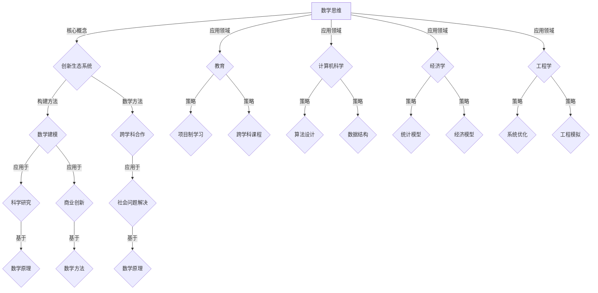

                 

### 数学思维与创新生态系统的构建

> 关键词：数学思维、创新生态系统、数学建模、跨学科合作、创新方法论

> 摘要：本文旨在探讨数学思维在构建创新生态系统中的重要作用。首先，文章介绍了数学思维的基本概念及其在解决问题中的应用。接着，文章深入分析了创新生态系统的定义、构成要素及其发展阶段。通过具体案例分析，展示了数学思维如何在不同领域推动创新。最后，文章提出了构建创新生态系统的策略，并探讨了跨学科合作的重要性及其挑战与解决方案。本文旨在为读者提供一个全面理解数学思维与创新生态系统构建的视角。

#### 引言

**1.1 数学思维的定义与重要性**

数学思维是一种逻辑严谨、抽象化强的思考方式，它通过符号化、模型化的手段，对现实世界进行量化分析和抽象推理。数学思维不仅在数学领域具有核心地位，也在科学、工程、经济等多个领域中发挥着重要作用。其重要性主要体现在以下几个方面：

- **问题解决能力**：数学思维提供了系统化、规范化的问题解决方法，有助于人们从复杂现象中提取关键信息，找到解决方案。
- **抽象与建模能力**：数学思维能够帮助人们将复杂问题抽象为数学模型，进而进行定量分析和求解。
- **创新驱动能力**：数学思维鼓励人们探索未知、追求创新，是推动科学技术进步的重要动力。

**1.2 创新生态系统的概念及其作用**

创新生态系统是指由多种创新主体（如企业、研究机构、大学、政府等）相互联系、相互作用而形成的复杂系统。其核心作用在于促进创新资源的高效配置和利用，推动创新活动的持续进行。创新生态系统的特点包括：

- **多样性**：创新生态系统中的主体多样，包括不同行业、不同领域的专家和研究者，这种多样性为创新提供了丰富的资源。
- **协同性**：创新生态系统中的主体通过合作、交流、竞争，实现知识共享和技术突破。
- **动态性**：创新生态系统是一个不断变化的过程，它通过自我调整和优化，适应外部环境的变化。

**1.3 本书的目标与结构**

本书的目标是深入探讨数学思维在创新生态系统构建中的关键作用，分析数学思维与创新生态系统的内在联系，并探讨如何通过数学思维推动创新生态系统的构建。本书结构如下：

- **第1章** 引言，介绍数学思维和创新生态系统的基本概念。
- **第2章** 数学思维基础，详细阐述数学思维的基本原理和方法。
- **第3章** 数学思维在创新中的应用，分析数学思维在不同领域中的应用案例。
- **第4章** 创新生态系统的构建，探讨创新生态系统的构成要素和构建策略。
- **第5章** 数学思维与创新方法论，介绍数学思维在创新方法中的应用。
- **第6章** 创新生态系统中的跨学科合作，分析跨学科合作的重要性及其挑战。
- **第7章** 数学思维与创新教育，探讨数学思维在创新教育中的应用。
- **第8章** 总结与展望，总结本书的主要观点，并对创新生态系统的未来进行展望。

通过本书的阅读，读者可以全面了解数学思维和创新生态系统的构建过程，掌握数学思维在创新中的应用方法，为实际工作提供理论指导和实践参考。

### 第2章 数学思维基础

**2.1 数学符号与逻辑表达**

数学符号是数学思维的重要组成部分，它通过简洁、直观的方式表达数学概念和逻辑关系。常见的数学符号包括：

- **变量**：如 \( x, y, z \)，用于表示未知数或可变数。
- **常数**：如 \( \pi, e \)，用于表示固定的数学常数。
- **函数**：如 \( f(x) \)，用于表示输入和输出关系。
- **运算符**：如 \( +, -, \times, / \)，用于表示数学运算。
- **集合**：如 \( \{1, 2, 3\} \)，用于表示一组元素。
- **逻辑符号**：如 \( \land, \lor, \neg \)，用于表示逻辑关系。

逻辑表达是数学思维的核心，它通过逻辑推理和证明来揭示数学概念的本质。常见的逻辑表达包括：

- **命题**：如 \( P \)，表示一个可以判断真假的陈述。
- **命题连接词**：如 \( \land (\text{且}) \)，\( \lor (\text{或}) \)，\( \neg (\text{非}) \)，用于组合命题。
- **条件命题**：如 \( P \rightarrow Q \)，表示“如果 \( P \)，则 \( Q \)”。
- **逆命题**：如 \( Q \rightarrow P \)，表示“如果 \( Q \)，则 \( P \)”。
- **逆否命题**：如 \( \neg Q \rightarrow \neg P \)，表示“如果非 \( Q \)，则非 \( P \)”。

**2.2 数学原理与逻辑推理**

数学原理是数学思维的基础，它通过公理、定理和证明来构建完整的数学体系。常见的数学原理包括：

- **公理**：如欧几里得几何的平行公理，用于建立数学体系的基石。
- **定理**：如勾股定理，用于描述特定的数学关系。
- **证明**：如反证法、归纳法，用于证明数学定理的正确性。

逻辑推理是数学思维的核心方法，它通过演绎推理和归纳推理来推导新的结论。常见的逻辑推理方法包括：

- **演绎推理**：从一般原理推导出特定结论，如 \( P \land Q \rightarrow R \)。
- **归纳推理**：从具体实例推导出一般结论，如自然数归纳法。

**2.3 基本数学模型介绍**

基本数学模型是数学思维的具体应用，它通过建立数学模型来解决实际问题。常见的数学模型包括：

- **线性模型**：如线性方程组，用于描述线性关系。
- **非线性模型**：如非线性方程组，用于描述非线性关系。
- **微分方程模型**：如微分方程，用于描述动态系统。
- **概率模型**：如概率分布，用于描述随机事件。

**2.4 数学思维训练方法**

数学思维训练是提高数学思维能力的重要途径，它通过以下方法进行：

- **问题解决**：通过解决各种数学问题，提高逻辑推理和问题解决能力。
- **模型构建**：通过建立数学模型，提高抽象思维和建模能力。
- **证明技巧**：通过学习证明技巧，提高数学证明能力。
- **数学软件应用**：通过使用数学软件，如MATLAB、Python等，提高计算能力和数据分析能力。

**实例分析：**

假设我们要解决一个线性方程组：

$$
\begin{align*}
x + 2y &= 3 \\
2x - y &= 1
\end{align*}
$$

我们可以使用代入法或消元法来求解。以下是使用消元法的步骤：

1. 将第一个方程乘以2，得到 \(2x + 4y = 6\)。
2. 将第二个方程乘以1，得到 \(2x - y = 1\)。
3. 将上述两个方程相减，消去 \(2x\)，得到 \(5y = 5\)。
4. 解得 \(y = 1\)。
5. 将 \(y = 1\) 代入第一个方程，解得 \(x = 1\)。

因此，线性方程组的解为 \(x = 1, y = 1\)。

通过这个实例，我们可以看到数学思维的基础知识在解决实际问题中的重要性。数学思维不仅要求我们掌握基本的数学符号和原理，还需要我们具备逻辑推理和问题解决的能力。

### 第3章 数学思维在创新中的应用

**3.1 数学建模与创新**

数学建模是创新过程中的一种重要方法，它通过将实际问题抽象成数学模型，从而揭示问题的本质和规律。数学建模的创新应用体现在以下几个方面：

- **问题识别与定义**：通过数学建模，我们可以清晰地定义问题，将复杂现象简化为数学表达式，从而为后续分析提供基础。
- **预测与优化**：数学模型可以用于预测未来趋势和优化决策，如经济学中的宏观经济模型、物流系统中的优化算法等。
- **仿真与验证**：通过仿真和验证，我们可以验证数学模型的准确性和可靠性，为实际应用提供依据。

**实例分析：**

假设我们要研究一个城市的交通流量问题，我们可以使用以下步骤进行数学建模：

1. **问题定义**：明确研究的对象和目标，例如分析特定时间段内主要道路的交通流量。
2. **数据收集**：收集交通流量数据，包括车辆数量、车速、道路长度等。
3. **模型建立**：建立数学模型，例如使用排队论模型描述交通流量的动态变化。
4. **仿真与优化**：通过仿真分析交通流量，优化道路信号灯控制策略，减少拥堵时间。

**3.2 数学方法在科学研究中的应用**

数学方法在科学研究中的应用非常广泛，它为科学发现和技术创新提供了强有力的工具。以下是一些典型的应用案例：

- **物理学**：牛顿力学、电磁学等经典物理学理论都是基于数学模型建立的。如牛顿第二定律 \( F = ma \)，通过数学推导得出了力、质量和加速度之间的关系。
- **生物学**：在生物学研究中，数学方法被广泛应用于遗传学、生态学、神经科学等领域。例如，哈迪-温伯格定律通过数学模型描述了遗传平衡状态。
- **计算机科学**：算法设计和分析是计算机科学的核心。例如，图算法用于解决网络问题，如最短路径算法、最小生成树算法等。

**实例分析：**

假设我们要研究一个基因突变问题，我们可以使用以下步骤进行数学建模：

1. **问题定义**：明确研究的对象和目标，例如分析特定基因突变对生物体的影响。
2. **数据收集**：收集基因突变数据，包括突变位点、突变频率等。
3. **模型建立**：建立数学模型，例如使用马尔可夫链模型描述基因突变的动态过程。
4. **仿真与验证**：通过仿真分析基因突变对生物体的影响，验证数学模型的准确性。

**3.3 数学思维与商业创新**

数学思维在商业创新中的应用同样非常广泛，它为企业提供了优化决策和预测未来的工具。以下是一些典型的应用案例：

- **市场预测**：通过数学模型进行市场趋势预测，帮助企业制定有效的营销策略。
- **供应链优化**：通过数学方法优化供应链管理，提高生产效率，降低成本。
- **风险控制**：使用数学模型评估和管理风险，确保企业运营的稳健性。

**实例分析：**

假设一家公司要制定新产品定价策略，我们可以使用以下步骤进行数学建模：

1. **问题定义**：明确定价策略的目标和约束条件，例如确定新产品的目标利润率。
2. **数据收集**：收集产品成本、市场需求、竞争情况等数据。
3. **模型建立**：建立定价模型，例如使用需求函数和成本函数确定最优定价策略。
4. **仿真与优化**：通过仿真分析不同定价策略的效果，优化定价策略。

**3.4 数学思维在社会问题解决中的应用**

数学思维在社会问题解决中的应用同样具有重要意义，它为政策制定和社会管理提供了科学依据。以下是一些典型的应用案例：

- **公共政策**：通过数学建模分析公共政策的成本和效益，帮助政府制定科学合理的政策。
- **环境保护**：通过数学模型评估环境污染程度和治理效果，为环境保护提供决策支持。
- **社会安全**：通过数学方法分析社会安全问题，如犯罪率预测、自然灾害预警等。

**实例分析：**

假设我们要研究城市交通拥堵问题，我们可以使用以下步骤进行数学建模：

1. **问题定义**：明确研究的目标，例如减少交通拥堵，提高道路通行效率。
2. **数据收集**：收集交通流量、道路状况、公共交通数据等。
3. **模型建立**：建立交通流模型，如使用交通流量方程描述道路上的车辆运动。
4. **仿真与优化**：通过仿真分析不同交通管理策略的效果，优化交通流管理。

通过上述实例，我们可以看到数学思维在创新中的应用是非常广泛且富有成效的。无论是科学研究、商业创新还是社会问题解决，数学思维都为问题的识别、分析和解决提供了强有力的工具和方法。数学思维不仅是一种思维方式，更是一种解决问题的艺术。

### 第4章 创新生态系统的构建

**4.1 创新生态系统的定义与要素**

创新生态系统是一个复杂的社会网络系统，它由多个创新主体、资源、规则和互动机制组成，通过协同作用实现创新资源的共享和高效利用。创新生态系统的定义可以从以下几个方面来理解：

- **主体多样性**：创新生态系统包括企业、研究机构、大学、政府、投资者、创业者等多种主体，他们各自扮演不同的角色，共同推动创新活动。
- **资源多样化**：创新生态系统中的资源包括知识、技术、资金、人才、信息等多种形式，这些资源通过流动和共享，促进创新活动的开展。
- **规则和机制**：创新生态系统中的规则和机制包括知识产权保护、市场准入、合作机制、竞争机制等，它们为创新活动提供了良好的环境。
- **互动性**：创新生态系统中的主体之间通过合作、竞争、交流等互动机制，实现知识共享、技术突破和资源整合。

创新生态系统的要素主要包括以下几个方面：

- **创新主体**：包括企业、研究机构、大学、政府等，他们都是创新生态系统中的关键角色。
- **创新资源**：包括知识、技术、资金、人才、信息等，它们是创新生态系统的基础。
- **创新环境**：包括政策、法规、市场、文化等，它们为创新活动提供支持和保障。
- **创新机制**：包括合作机制、竞争机制、激励机制等，它们促进创新生态系统的良性运行。

**4.2 创新生态系统的发展阶段**

创新生态系统的发展阶段可以分为以下几个阶段：

1. **萌芽阶段**：在这一阶段，创新生态系统中的主体开始意识到创新的重要性，初步形成合作意识和合作机制。
2. **形成阶段**：在这一阶段，创新生态系统中的资源逐渐积累，创新主体之间的互动机制逐步完善，创新活动开始活跃。
3. **发展阶段**：在这一阶段，创新生态系统中的创新主体和资源更加丰富，创新活动达到高峰，创新成果显著。
4. **成熟阶段**：在这一阶段，创新生态系统进入稳定发展状态，创新资源得到高效利用，创新成果持续产生。

**4.3 构建创新生态系统的策略**

构建创新生态系统需要综合运用多种策略，以下是一些常见的策略：

1. **政策支持**：政府通过制定有利于创新的法律法规、政策指南，为创新生态系统提供制度保障。
2. **资源共享**：通过建立共享平台，促进创新资源的共享和利用，降低创新成本，提高创新效率。
3. **人才培养**：通过教育、培训等手段，培养具备创新能力和专业知识的人才，为创新生态系统提供人才支持。
4. **资金支持**：通过政府、企业、投资者等多种渠道，提供充足的资金支持，为创新项目提供资金保障。
5. **合作机制**：建立合作机制，促进创新主体之间的合作与交流，实现知识共享和技术突破。
6. **知识产权保护**：建立完善的知识产权保护体系，保障创新成果的合法权益，激励创新主体的创新活动。

**4.4 创新生态系统的实践案例分析**

以下是一个创新生态系统的实践案例分析：

案例：某城市智慧交通创新生态系统的构建

1. **背景**：某城市交通拥堵严重，政府意识到智慧交通的重要性，决定构建一个智慧交通创新生态系统。
2. **策略**：
   - **政策支持**：政府出台了一系列支持智慧交通的政策，包括资金支持、税收优惠等。
   - **资源共享**：建立了智慧交通共享平台，整合了交通数据、智能设备等资源。
   - **人才培养**：与高校合作，设立智慧交通专项奖学金，培养专业人才。
   - **资金支持**：通过政府专项资金、企业投资等多种渠道，提供充足的资金支持。
   - **合作机制**：建立政府、企业、研究机构等多方合作机制，共同推进智慧交通项目。
   - **知识产权保护**：建立完善的知识产权保护体系，保障创新成果的合法权益。
3. **成果**：
   - **交通流量优化**：通过数据分析，优化了交通信号灯控制策略，减少了交通拥堵。
   - **智能交通管理**：实现了交通流量的实时监控和管理，提高了道路通行效率。
   - **技术创新**：推动了智能交通领域的多项技术创新，如自动驾驶技术、车联网技术等。

通过这个案例，我们可以看到，构建创新生态系统需要多方面的策略和措施，通过政策支持、资源共享、人才培养、资金支持、合作机制和知识产权保护等多方面的努力，可以实现创新生态系统的良性运行，推动智慧交通等领域的创新发展。

### 第5章 数学思维与创新方法论

**5.1 创新方法论概述**

创新方法论是指一系列用于推动创新活动的方法和工具，它通过系统化的方法来引导创新过程，提高创新效率和成功率。创新方法论的核心思想是：通过结构化的方法，将创意转化为可行的解决方案，并在实践中不断迭代和完善。

常见的创新方法论包括：

- **TRIZ**：是一种基于冲突解决的系统化创新方法论，它通过一系列创新原则和工具，帮助人们找到创新的解决方案。
- **设计思维**：是一种以人为本的创新方法论，它通过深入理解用户需求，设计出符合用户需求的产品和服务。
- **精益创业**：是一种基于快速实验和迭代的创新方法论，它通过不断试错和调整，找到可行的商业模型。

**5.2 数学思维与创新方法**

数学思维在创新方法中的应用主要体现在以下几个方面：

- **抽象与建模**：通过数学思维，可以将复杂问题抽象成数学模型，从而简化问题的处理过程，提高解决问题的效率。
- **优化与决策**：数学方法如线性规划、非线性规划、动态规划等，可以用于优化决策过程，找到最优解。
- **预测与模拟**：通过数学模型，可以预测未来趋势，模拟不同方案的效果，从而为决策提供科学依据。

**实例：基于数学思维的TRIZ应用**

假设我们要解决一个生产线上机器效率低的问题，可以使用以下步骤：

1. **问题定义**：明确生产线上机器效率低的具体表现，如停机时间多、生产速度慢等。
2. **问题建模**：将问题抽象成数学模型，例如使用排队论模型描述机器和工人的匹配问题。
3. **优化求解**：使用数学优化方法，如线性规划，确定最优的机器和工人的配比。
4. **仿真与验证**：通过仿真模拟不同配比方案的效果，验证最优解的可行性。

**5.3 创新过程中的数学工具应用**

在创新过程中，数学工具的应用至关重要。以下是一些常见的数学工具及其应用：

- **数学软件**：如MATLAB、Python等，用于数学建模和仿真分析。
- **算法**：如遗传算法、粒子群优化、神经网络等，用于解决复杂优化问题。
- **概率统计**：用于数据分析、风险评估和预测。
- **微分方程**：用于描述动态系统和复杂过程。

**实例：基于遗传算法的优化问题求解**

假设我们要优化一个生产流程，使其生产效率最大化。可以使用以下步骤：

1. **问题定义**：明确优化目标，如最小化生产时间、最大化产量等。
2. **编码与初始种群**：将生产流程编码为染色体，生成初始种群。
3. **适应度函数**：定义适应度函数，用于评估每个染色体的优劣。
4. **遗传操作**：包括选择、交叉和变异操作，用于生成新的种群。
5. **迭代与优化**：通过迭代，逐步优化种群，找到最优生产方案。

**5.4 创新方法的实践应用**

数学思维和创新方法在各个领域的应用案例丰富多样。以下是一些典型的应用案例：

- **科技领域**：如人工智能、大数据分析、生物信息学等，数学方法在数据建模、算法优化和模型验证中发挥了关键作用。
- **工业领域**：如智能制造、工业互联网、智能制造等，数学方法用于优化生产流程、提高生产效率。
- **商业领域**：如市场预测、供应链管理、金融分析等，数学方法用于分析市场趋势、优化决策。

**实例：基于数学思维的市场预测**

假设我们要预测某商品的未来销售量，可以使用以下步骤：

1. **数据收集**：收集历史销售数据、市场环境数据等。
2. **模型建立**：建立时间序列模型，如ARIMA模型，描述销售量的动态变化。
3. **参数估计**：使用最小二乘法等参数估计方法，确定模型参数。
4. **预测与验证**：使用模型进行预测，并对比实际销售量，验证模型准确性。

通过上述实例，我们可以看到数学思维和创新方法在实践中的应用是非常广泛且有效的。数学思维不仅提供了系统化的方法，还通过数学模型和工具，提高了创新效率和成功率。数学思维与创新方法的结合，为各个领域的创新发展提供了有力支持。

### 第6章 创新生态系统中的跨学科合作

**6.1 跨学科合作的重要性**

跨学科合作是构建创新生态系统的重要手段之一，它通过整合不同学科的知识、技能和资源，推动创新活动的深度和广度。跨学科合作的重要性主要体现在以下几个方面：

- **知识整合**：跨学科合作可以将不同学科的理论、方法和工具结合起来，形成全新的研究视角和解决方案。
- **创新能力提升**：跨学科合作促进了不同领域专家的交流和互动，激发了创新思维，提高了创新能力。
- **解决复杂问题**：许多现实问题具有跨学科的复杂性，单一学科难以解决，跨学科合作可以提供多维度、多层次的解决方案。
- **资源优化**：跨学科合作可以共享不同学科的资源，提高资源利用效率，降低研究成本。

**6.2 数学与其他学科的合作方式**

数学与其他学科的合作方式多种多样，以下是一些典型的合作方式：

- **数学与物理**：数学在物理学中应用广泛，如描述物理现象的数学模型、解决物理问题的数学方法等。
- **数学与生物**：数学在生物学中的应用包括基因序列分析、生态系统建模、生物信息学等。
- **数学与计算机科学**：数学在计算机科学中的应用包括算法分析、网络安全、人工智能等。
- **数学与经济学**：数学在经济学中的应用包括模型建立、数据分析、风险评估等。

**实例分析：**

1. **数学与物理学**：

   在量子物理学中，数学模型如薛定谔方程描述了粒子的波动行为。薛定谔方程是一个偏微分方程，它通过数学表达揭示了量子系统的动态特性。这一合作不仅推动了物理学的发展，还为数学提供了新的应用领域。

2. **数学与生物学**：

   在基因组学中，数学方法如隐马尔可夫模型（HMM）用于分析基因序列，识别基因结构。HMM模型通过概率模型描述基因序列的隐状态，帮助科学家识别基因的关键区域。

3. **数学与计算机科学**：

   在人工智能领域，数学工具如梯度下降法用于优化神经网络。梯度下降法是一种优化算法，通过迭代更新网络参数，使得网络输出更接近目标。这种合作推动了人工智能技术的发展。

**6.3 跨学科合作案例分析**

以下是一些跨学科合作的经典案例：

1. **癌症研究**：

   癌症研究是一个典型的跨学科领域，涉及生物学、医学、化学、数学等多个学科。数学方法如统计分析、机器学习等被广泛应用于癌症的诊断、治疗和预后分析。通过跨学科合作，科学家们开发出了一系列先进的癌症诊断工具和治疗方法。

2. **智能交通系统**：

   智能交通系统是一个跨学科项目，涉及交通工程、计算机科学、数学等多个领域。通过数学建模和优化方法，研究人员开发了智能交通信号控制系统、车辆导航系统等，提高了交通效率和安全性。

3. **可持续能源**：

   可持续能源领域是一个跨学科的典范，涉及物理学、化学、工程学、经济学等多个学科。通过跨学科合作，研究人员开发出了高效的光伏电池、风能转换系统等，推动了可持续能源的发展。

**6.4 跨学科合作的挑战与解决方案**

跨学科合作虽然带来了许多机遇，但也面临一系列挑战：

1. **语言障碍**：

   跨学科合作中，不同学科使用的术语和表达方式可能不同，导致沟通障碍。解决方案是建立统一的语言和术语体系，加强跨学科沟通。

2. **知识差距**：

   不同学科的知识体系和方法论可能存在较大差异，导致合作中的知识差距。解决方案是加强学科交叉培训，提高跨学科合作的能力。

3. **利益分配**：

   跨学科合作中的利益分配可能引发争议，影响合作的积极性。解决方案是建立公正的利益分配机制，确保各方利益得到合理保障。

通过解决上述挑战，跨学科合作可以为创新生态系统注入新的活力，推动科学技术的进步和社会的发展。

### 第7章 数学思维与创新教育

**7.1 创新教育的重要性**

创新教育是一种以培养学生的创新精神和实践能力为核心的教育理念。其重要性在于：

- **培养创新人才**：创新教育旨在培养学生的创新意识、创新能力，使他们能够在未来的社会中立足并有所作为。
- **推动社会进步**：创新教育能够激发学生的创造力，培养出具有创新能力的人才，这些人才将推动科学技术、经济、文化等各个领域的发展。
- **应对未来挑战**：随着社会的快速发展，创新已成为应对未来挑战的关键。创新教育能够帮助学生适应快速变化的环境，培养他们解决复杂问题的能力。

**7.2 数学思维在创新教育中的应用**

数学思维在创新教育中发挥着重要作用，其应用主要体现在以下几个方面：

- **问题解决能力**：数学思维训练有助于学生培养系统化、逻辑化的思维习惯，提高他们的问题解决能力。
- **抽象思维**：数学思维的抽象性有助于学生将复杂问题简化为数学模型，从而提高抽象思维能力。
- **创新能力**：数学思维鼓励学生探索未知、追求创新，是培养创新能力的重要手段。

**实例分析：**

1. **数学竞赛**：

   数学竞赛是一种培养学生数学思维和创新能力的重要途径。通过参加数学竞赛，学生需要解决各种复杂的数学问题，这有助于提高他们的逻辑思维和创新能力。

2. **数学建模**：

   数学建模课程通过引导学生建立数学模型，解决实际问题，提高他们的数学思维和创新能力。学生可以从实际问题中提取关键信息，构建数学模型，通过数学方法求解问题，从而培养创新能力。

**7.3 创新教育的实施策略**

实施创新教育需要采取一系列策略，以下是一些常见的策略：

- **课程设计**：将创新教育理念融入课程设计，设置多样化的课程，如数学建模、创新设计等，激发学生的创新兴趣。
- **教学方法**：采用启发式教学、问题导向教学等教学方法，引导学生主动思考和探索，培养他们的创新思维。
- **实践环节**：增加实践环节，如实验、项目研究等，让学生在实际操作中培养创新能力。
- **评价体系**：建立多元化评价体系，不仅重视学生的理论知识，还重视他们的实践能力和创新能力。

**实例分析：**

1. **项目制学习**：

   项目制学习是一种创新教育模式，通过学生自主选择和设计项目，培养他们的创新能力。教师提供指导和支持，学生通过团队合作，完成项目任务，从而培养创新思维和实践能力。

2. **跨学科合作**：

   跨学科合作是创新教育的重要组成部分。通过跨学科合作，学生可以接触到不同学科的知识和思维方式，培养跨学科思维能力和创新能力。

**7.4 创新教育案例与实践**

以下是一些创新教育案例和实践：

1. **数学实验室**：

   在数学实验室中，学生通过实际操作和实验，学习数学知识和方法，培养数学思维和创新能力。教师提供各种实验方案，学生可以选择感兴趣的课题进行探究。

2. **科技竞赛**：

   参加科技竞赛是一种培养学生创新能力和实践能力的重要方式。通过科技竞赛，学生可以接触到最新的科技成果和前沿科技问题，激发他们的创新热情。

3. **创业教育**：

   创业教育通过培养学生的创业意识和创业能力，培养创新人才。在创业教育中，学生可以学习创业理论、创业实践，通过实际创业项目，培养创新能力。

通过创新教育，我们可以培养出具有创新能力和实践能力的人才，推动社会的进步和发展。

### 第8章 总结与展望

**8.1 数学思维与创新生态系统的发展趋势**

随着科技的不断进步和社会的快速发展，数学思维与创新生态系统的发展趋势呈现出以下几个特点：

- **多元化**：创新生态系统中的主体和资源日益多元化，涉及多个学科和领域，促进了知识融合和技术创新。
- **数字化**：数字化技术的广泛应用，使得数据成为创新的重要资源，数学方法在数据分析和处理中发挥着越来越重要的作用。
- **全球化**：全球化促进了不同国家和地区之间的创新合作，国际化的创新生态系统正在形成。
- **可持续发展**：随着环保意识的增强，可持续发展成为创新生态系统的重要目标，数学方法在优化资源配置、减少环境污染等方面发挥着重要作用。

**8.2 创新生态系统的未来展望**

未来，创新生态系统将朝着以下方向发展：

- **智能化**：随着人工智能技术的快速发展，创新生态系统将更加智能化，利用大数据、机器学习等技术，实现更高效率的创新。
- **网络化**：创新生态系统将更加网络化，通过互联网和物联网，实现全球范围内的资源整合和共享。
- **协同化**：创新生态系统中的主体将更加协同，通过跨学科、跨领域的合作，实现创新的协同效应。
- **绿色化**：创新生态系统将更加注重可持续发展，通过绿色技术创新，实现经济增长与环境保护的平衡。

**8.3 个人与组织的创新生态建设指南**

为了在个人和组织层面构建高效的创新生态系统，可以采取以下策略：

- **培养数学思维**：个人应注重培养数学思维，通过学习数学知识、掌握数学方法，提高逻辑推理和抽象思维能力。
- **搭建创新平台**：组织应搭建创新平台，提供丰富的创新资源和良好的创新环境，促进创新活动的开展。
- **跨学科合作**：个人和组织应积极开展跨学科合作，利用不同学科的知识和方法，推动创新。
- **持续学习**：个人和组织应保持持续学习的态度，紧跟科技前沿，不断提高创新能力。
- **激励机制**：建立有效的激励机制，鼓励创新行为，激发创新活力。

通过这些策略，个人和组织可以在创新生态系统中发挥更大的作用，推动科技创新和社会进步。

### 作者信息

- 作者：AI天才研究院/AI Genius Institute & 禅与计算机程序设计艺术 /Zen And The Art of Computer Programming

---

### 设计一个思维导图

以下是一个基于Mermaid语言的思维导图，展示了《数学思维与创新生态系统的构建》这本书的核心概念和联系：

在这个思维导图中，核心概念“数学思维”与“创新生态系统”相连，表示数学思维是构建创新生态系统的基础。创新生态系统的构建方法分为数学建模和跨学科合作，这两者又分别应用于科学研究、商业创新和社会问题解决。此外，数学思维的应用领域还包括教育、计算机科学、经济学和工程学，每个领域都有相应的创新策略。这样的思维导图能够帮助读者清晰地理解数学思维在创新生态系统中的多层次应用。

