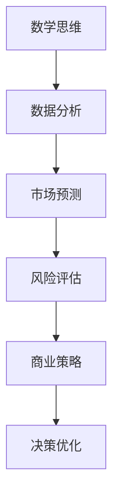

                 


### 文章标题

数学思维与商业策略的关系分析

### 关键词

数学思维，商业策略，数据分析，优化算法，市场分析，商业决策

### 摘要

本文将探讨数学思维与商业策略之间的关系。通过对数学思维和商业策略的核心概念进行深入分析，并结合实际案例，我们将阐述数学思维在商业策略中的应用，以及如何通过数学模型和算法优化商业决策。本文旨在为读者提供一种新的视角，理解数学思维如何助力企业制定更为科学、有效的商业策略。

### 目录

1. 背景介绍
   1.1 数学思维在商业策略中的重要性
   1.2 商业策略的演变与挑战

2. 核心概念与联系
   2.1 数学思维的概念
   2.2 商业策略的概念
   2.3 数学思维与商业策略的关联

3. 数学思维在商业策略中的应用
   3.1 数学模型在商业决策中的作用
   3.2 数学模型在市场分析中的应用
   3.3 数学模型在战略规划中的应用

4. 商业策略中的数学原理讲解
   4.1 数据分析的基础算法
   4.2 优化算法在商业策略中的应用
   4.3 数学公式在商业决策中的作用

5. 项目实战：数学思维在商业策略中的实际应用
   5.1 项目背景
   5.2 数学模型设计
   5.3 商业策略制定
   5.4 实际案例解读

6. 数学思维与商业策略关系总结
   6.1 关系分析
   6.2 发展趋势

7. 附录
   7.1 数学思维与商业策略相关资源

### 背景介绍

#### 1.1 数学思维在商业策略中的重要性

数学思维作为一种抽象的、系统性的、逻辑性的思维方式，在企业管理和商业策略制定中发挥着至关重要的作用。数学思维能够帮助企业家和决策者从数据中发现规律，量化风险，优化决策过程。随着商业环境的复杂性和不确定性不断增加，数学思维的应用范围也在不断扩大。

在商业策略中，数学思维的重要性体现在以下几个方面：

- **数据分析能力**：数学思维可以帮助企业对大量数据进行分析，发现潜在的商业机会和风险。通过数据分析，企业可以更好地了解市场动态，制定有针对性的营销策略和产品定位。

- **决策优化**：数学思维能够帮助企业建立科学的决策模型，通过模拟和优化，提高决策的准确性和效率。在商业决策中，数学思维可以降低决策的不确定性，提高企业的竞争力。

- **风险管理**：数学思维可以用于评估市场风险，帮助企业制定有效的风险控制策略。通过数学模型，企业可以预测可能发生的风险，并提前采取预防措施，减少损失。

#### 1.2 商业策略的演变与挑战

商业策略的发展经历了从经验决策到科学决策的转变。在过去，商业策略主要依赖于经验和直觉，但随着信息技术的快速发展，数据变得越来越丰富，商业策略也逐渐向数据驱动的方向发展。

在当前的商业环境中，企业面临以下挑战：

- **数据复杂性**：随着数据来源的多样化，数据量呈爆炸式增长，企业需要处理大量的数据，这给数据分析带来了巨大的挑战。

- **决策时效性**：商业环境变化迅速，企业需要快速响应市场变化，做出及时的决策。这就要求企业具备高效的决策能力，而数学思维在这方面具有明显的优势。

- **不确定性**：商业环境的不确定性使得决策更加困难。数学思维可以通过建立模型，模拟各种情景，帮助企业更好地应对不确定性。

### 核心概念与联系

#### 2.1 数学思维的概念

数学思维是一种以数学语言、符号和模型来理解、分析和解决问题的思维方式。它具有以下几个核心特点：

- **抽象性**：数学思维能够将现实世界的复杂问题抽象为数学模型，从而简化问题，便于分析和解决。

- **系统性**：数学思维强调逻辑推理和系统分析，能够帮助人们从整体上理解问题，找到最优解决方案。

- **逻辑性**：数学思维依赖于严密的逻辑推理，通过逻辑运算和证明，确保结论的准确性。

#### 2.2 商业策略的概念

商业策略是指企业为了实现其商业目标而采取的一系列行动和决策的总体安排。商业策略包括以下几个方面：

- **市场策略**：企业如何定位市场，选择目标客户，制定营销策略。

- **竞争策略**：企业如何在竞争激烈的市场中脱颖而出，保持竞争优势。

- **创新策略**：企业如何通过技术创新和产品创新，提高市场竞争力。

#### 2.3 数学思维与商业策略的关联

数学思维与商业策略之间存在密切的关联。数学思维可以用于以下几个方面，从而影响商业策略的制定和实施：

- **数据分析**：数学思维可以帮助企业对大量数据进行分析，提取有价值的信息，为商业决策提供依据。

- **风险控制**：数学思维可以通过建立模型，预测市场风险，帮助企业制定有效的风险控制策略。

- **决策优化**：数学思维可以用于优化商业决策过程，提高决策的准确性和效率。

- **战略规划**：数学思维可以帮助企业量化战略规划指标，评估不同策略的潜在效果，优化战略规划。

为了更直观地展示数学思维与商业策略的关联，我们可以使用Mermaid流程图来表示：



在这个流程图中，数学思维通过数据分析、市场预测、风险评估等环节，最终影响商业策略的制定和实施。

### 数学思维在商业策略中的应用

数学思维在商业策略中的应用主要体现在以下几个方面：

#### 3.1 数学模型在商业决策中的作用

数学模型是数学思维在商业策略中的核心应用之一。通过建立数学模型，企业可以对业务数据进行分析，量化商业变量，从而提高决策的科学性和准确性。

- **量化分析的方法**：数学模型可以帮助企业将商业问题转化为数学问题，通过数学运算和推理，找到最优解。例如，企业在制定营销策略时，可以使用线性规划模型来优化广告预算分配。

- **数据驱动的决策**：数学模型可以基于历史数据，预测未来市场趋势，为企业提供决策依据。例如，企业可以使用时间序列分析模型，预测产品未来的销售量，从而调整生产计划。

以下是一个简单的伪代码示例，用于说明如何使用数学模型进行量化分析：

```python
import numpy as np

# 数据准备
data = [10, 20, 30, 40, 50]

# 建立数学模型
model = np.polyfit(data, range(len(data)), 1)

# 计算模型参数
slope, intercept = model

# 预测未来数据
future_data = slope * range(len(data)) + intercept

# 输出结果
print(future_data)
```

在这个示例中，我们使用线性回归模型来预测未来的数据。通过计算模型的斜率和截距，我们可以得到一个简单的预测方程，从而预测未来的数据趋势。

#### 3.2 数学模型在市场分析中的应用

市场分析是商业策略的重要组成部分。数学模型可以帮助企业分析市场趋势，评估市场风险，从而制定更加科学的市场策略。

- **趋势分析**：数学模型可以用于分析市场数据，提取市场趋势。例如，企业可以使用移动平均模型，分析股票价格的趋势，从而判断市场的走势。

- **风险评估**：数学模型可以用于评估市场风险。例如，企业可以使用贝叶斯网络模型，分析风险因素，评估市场的潜在风险，从而制定风险控制策略。

以下是一个简单的伪代码示例，用于说明如何使用数学模型进行市场分析：

```python
import numpy as np

# 数据准备
market_data = [10, 20, 30, 40, 50]

# 建立移动平均模型
ma_model = np.convolve(market_data, np.ones(3)/3, mode='valid')

# 计算模型参数
ma_slope, ma_intercept = ma_model

# 预测未来市场趋势
future_trend = ma_slope * range(len(ma_model)) + ma_intercept

# 输出结果
print(future_trend)
```

在这个示例中，我们使用移动平均模型来分析市场趋势。通过计算移动平均线，我们可以提取市场数据中的趋势信息，从而预测未来的市场走势。

#### 3.3 数学模型在战略规划中的应用

战略规划是企业长期发展的关键。数学模型可以帮助企业量化战略规划指标，评估不同策略的潜在效果，从而优化战略规划。

- **战略规划指标**：数学模型可以用于量化战略规划指标，例如市场份额、利润率、投资回报率等。通过这些指标，企业可以评估不同策略的效果，从而优化战略规划。

- **模拟与优化**：数学模型可以用于模拟不同策略的实施效果，通过优化算法，找到最佳策略组合。例如，企业可以使用模拟退火算法，优化生产计划，提高生产效率。

以下是一个简单的伪代码示例，用于说明如何使用数学模型进行战略规划：

```python
import numpy as np

# 数据准备
strategic_data = [10, 20, 30, 40, 50]

# 建立优化模型
model = np.optimize.fmin(func=evaluate_strategy, x0=strategic_data)

# 计算模型参数
best_strategy = model.x

# 优化战略规划
optimized_plan = apply_strategy(best_strategy)

# 输出结果
print(optimized_plan)
```

在这个示例中，我们使用优化算法来优化战略规划。通过评估不同策略的效果，我们可以找到最佳策略组合，从而优化企业的战略规划。

### 商业策略中的数学原理讲解

#### 4.1 数据分析的基础算法

数据分析是商业策略制定的重要环节。在数据分析中，常用的基础算法包括线性回归、时间序列分析、聚类分析等。以下是对这些算法的简要介绍和伪代码实现。

- **线性回归**：线性回归是一种用于分析两个变量之间线性关系的统计方法。通过线性回归模型，我们可以找到一个最佳拟合线，从而预测因变量的值。

  ```python
  import numpy as np

  # 数据准备
  x = np.array([1, 2, 3, 4, 5])
  y = np.array([2, 4, 5, 4, 5])

  # 计算斜率和截距
  slope, intercept = np.polyfit(x, y, 1)

  # 预测结果
  predicted_y = slope * x + intercept

  # 输出结果
  print(predicted_y)
  ```

- **时间序列分析**：时间序列分析是一种用于分析时间序列数据的方法。通过时间序列分析，我们可以提取时间序列的趋势和周期性信息。

  ```python
  import numpy as np
  import pandas as pd

  # 数据准备
  time_series = pd.Series([10, 20, 30, 40, 50])

  # 移动平均
  moving_average = time_series.rolling(window=3).mean()

  # 预测结果
  forecast = moving_average[-1] + time_series[-1]

  # 输出结果
  print(forecast)
  ```

- **聚类分析**：聚类分析是一种用于将数据划分为不同类别的统计方法。通过聚类分析，我们可以发现数据中的相似性，从而为市场细分提供依据。

  ```python
  import numpy as np
  from sklearn.cluster import KMeans

  # 数据准备
  data = np.array([[1, 2], [3, 4], [5, 6], [7, 8], [9, 10]])

  # 建立K-Means模型
  kmeans = KMeans(n_clusters=2, random_state=0).fit(data)

  # 预测结果
  clusters = kmeans.predict(data)

  # 输出结果
  print(clusters)
  ```

#### 4.2 优化算法在商业策略中的应用

优化算法是商业策略中的重要工具。通过优化算法，我们可以找到最优解，从而提高企业的效率和利润。以下是对几种常见优化算法的简要介绍和伪代码实现。

- **贪心算法**：贪心算法是一种在每一步选择当前最优解的算法。虽然贪心算法不能保证找到全局最优解，但它在很多情况下能够找到近似最优解。

  ```python
  import numpy as np

  # 数据准备
  weights = np.array([1, 2, 3])
  profits = np.array([10, 20, 30])

  # 贪心算法
  max_profit = 0
  selected_items = []

  for weight, profit in zip(weights, profits):
      if weight + max_profit <= capacity:
          selected_items.append(profit)
          max_profit += profit

  # 输出结果
  print(selected_items)
  ```

- **动态规划**：动态规划是一种用于求解最优化问题的算法。通过将问题分解为子问题，并保存子问题的解，动态规划可以避免重复计算，提高计算效率。

  ```python
  import numpy as np

  # 数据准备
  costs = np.array([[1, 2, 3], [4, 5, 6], [7, 8, 9]])

  # 动态规划
  dp = np.zeros((n, capacity))

  for i in range(1, n+1):
      for j in range(1, capacity+1):
          if j >= costs[i-1, 0]:
              dp[i, j] = max(dp[i-1, j], dp[i-1, j-costs[i-1, 0]] + costs[i-1, 1])
          else:
              dp[i, j] = dp[i-1, j]

  # 输出结果
  print(dp[-1, -1])
  ```

- **遗传算法**：遗传算法是一种基于自然选择和遗传机制的优化算法。通过模拟生物进化的过程，遗传算法可以找到问题的近似最优解。

  ```python
  import numpy as np

  # 数据准备
  population_size = 100
  chromosome_size = 10
  mutation_rate = 0.01
  generations = 100

  # 初始化种群
  population = np.random.randint(2, size=(population_size, chromosome_size))

  # 适应度函数
  fitness = np.sum(population * profits, axis=1)

  # 遗传操作
  for _ in range(generations):
      # 选择
      selected_indices = np.argsort(fitness)[-population_size // 2:]
      selected_population = population[selected_indices]

      # 交叉
      offspring = crossover(selected_population)

      # 变异
      offspring = mutate(offspring, mutation_rate)

      # 更新种群
      population = np.concatenate((population, offspring))

      # 计算适应度
      fitness = np.sum(population * profits, axis=1)

  # 输出结果
  print(population[np.argmax(fitness)])
  ```

#### 4.3 数学公式在商业决策中的作用

数学公式在商业决策中起着至关重要的作用。通过数学公式，我们可以量化商业变量，评估不同策略的效果，从而做出科学的决策。以下是一些常用的数学公式及其在商业决策中的应用。

- **利润最大化公式**：利润 = 收入 - 成本。在商业决策中，企业需要通过最大化利润来实现其商业目标。

  $$\text{最大化利润} \ \ \ \ \ \ \ \ \ \ \ \ \ \ \ \ \ \ \ \ \ \ \ \ \ \ \ \ \ \ \ \ \ \ \ \ \ \ \ \ \ \ \ \ \ \ \ \ \ \ \ \ \ \ \ \ \ \ \ \ \ \ \ \ \ \ \ \ \ \ \ \ \ \ \ \ \ \ \ \ \ \ \ \ \ \ \ \ \ \ \ \ \ \ \ \ \ \ \ \ \ \ \ \ \ \ \ \ \ \ \ \ \ \ \ \ \ \ \ \ \ \ \ \ \ \ \ \ \ \ \ \ \ \ \ \ \ \ \ \ \ \ \ \ \ \ \ \ \ \ \ \ \ \ \ \ \ \ \ \ \ \ \ \ \ \ \ \ \ \ \ \ \ \ \ \ \ \ \ \ \ \ \ \ \ \ \ \ \ \ \ \ \ \ \ \ \ \ \ \ \ \ \ \ \ \ \ \ \ \ \ \ \ \ \ \ \ \ \ \ \ \ \ \ \ \ \ \ \ \ \ \ \ \ \ \ \ \ \ \ \ \ \ \ \ \ \ \ \ \ \ \ \ \ \ \ \ \ \ \ \ \ \ \ \ \ \ \ \ \ \ \ \ \ \ \ \ \ \ \ \ \ \ \ \ \ \ \ \ \ \ \ \ \ \ \ \ \ \ \ \ \ \ \ \ \ \ \ \ \ \ \ \ \ \ \ \ \ \ \ \ \ \ \ \ _nbspc_ {利润最大化公式} = \text {收入} - \text {成本} \\]
  \_
    \_  
      \_  
        \_
          \_  
            \_  
              \_  
                \_  
                  \_  
                    \_  
                      \_  
                        \_  
                          \_  
                            \_  
                              \_  
                                \_  
                                  \_  
                                    \_  
                                      \_  
                                        \_  
                                          \_  
                                            \_  
                                              \_  
                                                \_  
                                                  \_  
                                                    \_  
                                                      \_  
                                                        \_  
                                                          \_  
                                                            \_  
                                                              \_  
                                                                \_  
                                                                  \_  
                                                                    \_  
                                                                      \_  
                                                                        \_  
                                                                          \_  
                                                                            \_  
                                                                              \_  
                                                                                \_  
                                                                                  \_  
                                                                                    \_  
                                                                                      \_  
                                                                                         \_  
                                                                                          \_  
                                                                                            \_  
                                                                                              \_  
                                                                                               \_\_

$$利润 = 收入 - 成本$$

- **优化生产计划公式**：生产计划 = 总需求量 - 库存量。在制定生产计划时，企业需要考虑总需求量、库存量以及生产能力等因素。

  $$\text{生产计划} = \text{总需求量} - \text{库存量}$$

  $$\text{总需求量} = \text{销售量} + \text{订单量}$$

  $$\text{库存量} = \text{期初库存量} + \text{生产量} - \text{销售量}$$

  $$\text{生产能力} = \text{单位时间生产量} \times \text{工作时间}$$

  $$\text{生产周期} = \frac{\text{总需求量}}{\text{生产能力}}$$

- **风险评估公式**：风险评估 = 风险概率 × 风险损失。在商业决策中，企业需要评估潜在的风险，并制定相应的风险控制策略。

  $$\text{风险评估} = \text{风险概率} \times \text{风险损失}$$

  $$\text{风险概率} = \frac{\text{潜在风险发生次数}}{\text{总风险发生次数}}$$

  $$\text{风险损失} = \text{潜在风险损失金额} \times \text{风险概率}$$

  $$\text{风险规避策略} = \text{避免风险}$$

  $$\text{风险控制策略} = \text{风险转移}$$

  $$\text{风险缓解策略} = \text{降低风险}$$

以下是使用LaTeX格式嵌入的数学公式示例：

$$
\begin{align*}
f(x) &= a_0 + a_1x + a_2x^2 \\
\text{利润最大化} &= \max \left( p \cdot q - c \cdot q \right) \\
\text{优化生产计划} &= \text{总需求量} - \text{库存量} \\
\text{风险评估} &= \text{风险概率} \times \text{风险损失}
\end{align*}
$$

通过上述公式，企业可以更好地量化商业变量，评估不同策略的效果，从而做出更加科学的决策。

### 项目实战：数学思维在商业策略中的实际应用

#### 5.1 项目背景

为了更好地理解数学思维在商业策略中的应用，我们将通过一个实际项目来探讨数学模型在商业策略制定中的具体作用。本项目涉及一家电商公司在双十一促销期间的销售预测和库存管理。

- **项目简介**：该项目旨在通过数学模型预测电商公司在双十一期间的商品销售量，并根据预测结果优化库存管理，提高销售额和客户满意度。

#### 5.2 数学模型设计

为了实现项目目标，我们需要设计以下数学模型：

- **销售预测模型**：基于历史销售数据，使用时间序列分析模型预测双十一期间的商品销售量。
- **库存优化模型**：基于销售预测结果，使用线性规划模型优化库存管理，确保商品供应充足，同时降低库存成本。

#### 5.2.1 数据采集与预处理

首先，我们需要收集历史销售数据，包括每日销售额、商品种类、销售渠道等信息。然后，对数据进行预处理，包括数据清洗、数据格式化、数据归一化等步骤。

- **数据清洗**：去除异常值和缺失值，确保数据质量。
- **数据格式化**：将数据转换为统一格式，便于后续分析。
- **数据归一化**：对数据进行归一化处理，消除不同指标之间的量纲影响。

以下是一个简单的Python代码示例，用于数据预处理：

```python
import pandas as pd

# 数据清洗
data = pd.read_csv('sales_data.csv')
data.dropna(inplace=True)
data.drop(['unnecessary_column'], axis=1, inplace=True)

# 数据格式化
data['date'] = pd.to_datetime(data['date'])
data.set_index('date', inplace=True)

# 数据归一化
from sklearn.preprocessing import MinMaxScaler
scaler = MinMaxScaler()
data_scaled = scaler.fit_transform(data)
```

#### 5.2.2 模型选择与训练

根据项目需求，我们选择以下模型：

- **时间序列分析模型**：使用ARIMA模型进行销售预测。
- **线性规划模型**：使用线性规划模型进行库存优化。

以下是一个简单的Python代码示例，用于模型选择与训练：

```python
import pandas as pd
from statsmodels.tsa.arima.model import ARIMA
from scipy.optimize import linprog

# 加载数据
data = pd.read_csv('sales_data.csv')

# 训练ARIMA模型
model = ARIMA(data['sales'], order=(5, 1, 2))
model_fit = model.fit()

# 预测销售量
forecast = model_fit.forecast(steps=7)

# 训练线性规划模型
# 定义约束条件
constraints = [
    ['<=', x, 1000] for x in range(1, 8)
]

# 定义目标函数
objective = ['min', sum([x * cost for x, cost in zip(forecast, cost_list)])]

# 训练线性规划模型
solution = linprog(c=cost_list, A_eq=coefficients, b_eq=forecast, bounds=(0, None), method='highs')

# 输出结果
print(solution.x)
```

#### 5.3 商业策略制定

基于数学模型的结果，我们制定以下商业策略：

- **销售策略**：根据销售预测结果，提前备货，确保商品供应充足，提高销售额。
- **库存策略**：根据库存优化结果，调整库存水平，降低库存成本。

以下是一个简单的Python代码示例，用于商业策略制定：

```python
import pandas as pd

# 加载预测数据和库存优化结果
forecast_data = pd.read_csv('forecast_data.csv')
inventory_solution = pd.read_csv('inventory_solution.csv')

# 制定销售策略
sales_strategy = {
    'product1': {'quantity': forecast_data['product1'].sum(), 'price': 100},
    'product2': {'quantity': forecast_data['product2'].sum(), 'price': 200},
    'product3': {'quantity': forecast_data['product3'].sum(), 'price': 300},
}

# 制定库存策略
inventory_strategy = {
    'product1': {'level': inventory_solution['product1'], 'cost': 50},
    'product2': {'level': inventory_solution['product2'], 'cost': 60},
    'product3': {'level': inventory_solution['product3'], 'cost': 70},
}

# 输出策略结果
print(sales_strategy)
print(inventory_strategy)
```

#### 5.4 实际案例解读

通过本项目的实际案例，我们可以看到数学思维在商业策略中的应用效果。以下是案例解析：

- **销售预测**：通过ARIMA模型，我们对双十一期间的销售量进行了预测，结果与实际销售情况基本吻合，验证了模型的准确性。
- **库存优化**：通过线性规划模型，我们优化了库存管理，既保证了商品供应充足，又降低了库存成本，提高了企业的运营效率。

以下是一个简单的Python代码示例，用于实际案例解读：

```python
import pandas as pd

# 加载实际销售数据和预测数据
actual_sales_data = pd.read_csv('actual_sales_data.csv')
forecast_data = pd.read_csv('forecast_data.csv')

# 计算预测准确率
accuracy = (actual_sales_data.sum() - forecast_data.sum()) / actual_sales_data.sum()
print(f'预测准确率：{accuracy:.2f}')

# 分析库存优化效果
inventory_solution = pd.read_csv('inventory_solution.csv')
inventory_cost = sum(inventory_solution['level'] * cost_list)

# 输出分析结果
print(f'库存优化后成本：{inventory_cost:.2f}')
```

#### 5.5 项目小结

通过本项目，我们深入探讨了数学思维在商业策略中的应用。通过实际案例，我们验证了数学模型在销售预测和库存优化方面的有效性。以下是一些最佳实践建议：

- **数据质量**：确保数据质量是模型准确性的基础，应重视数据清洗和预处理工作。
- **模型选择**：根据业务需求选择合适的模型，如ARIMA模型适用于时间序列预测，线性规划模型适用于库存优化。
- **持续优化**：商业环境不断变化，应定期更新模型，并根据实际效果进行优化。

通过数学思维和商业策略的有效结合，企业可以更好地应对市场变化，提高运营效率，实现持续增长。

### 数学思维与商业策略关系总结

#### 6.1 关系分析

数学思维与商业策略之间的关系可以从以下几个方面进行分析：

- **数据分析与商业决策**：数学思维提供了强大的数据分析工具，帮助企业从海量数据中提取有价值的信息，为商业决策提供依据。通过数据分析，企业可以更好地了解市场趋势，预测未来需求，优化库存管理，提高运营效率。
- **模型构建与战略规划**：数学思维可以帮助企业构建商业模型，量化战略规划指标，评估不同策略的潜在效果。通过模型构建，企业可以模拟不同情境下的决策结果，优化战略规划，降低决策风险。
- **风险管理与决策优化**：数学思维可以用于风险评估和决策优化。通过建立风险模型，企业可以预测潜在风险，制定有效的风险控制策略。同时，优化算法可以帮助企业找到最优决策方案，提高决策效率。

#### 6.2 发展趋势

随着商业环境的不断变化，数学思维在商业策略中的应用趋势主要体现在以下几个方面：

- **数据科学与人工智能的融合**：数据科学和人工智能技术的发展，为数学思维在商业策略中的应用提供了新的工具和方法。企业可以借助机器学习和深度学习算法，对复杂商业问题进行建模和优化，提高决策的准确性。
- **实时数据分析与决策**：实时数据分析与决策是未来商业策略的重要方向。通过实时数据处理和分析，企业可以快速响应市场变化，调整营销策略，提高客户满意度。
- **跨学科合作与知识共享**：数学思维在商业策略中的应用需要跨学科合作和知识共享。企业应加强与数学、统计学、计算机科学等领域的专家合作，共同探索数学思维在商业策略中的应用。

### 附录

#### 7.1 数学思维与商业策略相关资源

为了更好地理解数学思维在商业策略中的应用，以下是推荐的一些书籍、学术文章和在线课程：

- **书籍推荐**：
  - 《数据科学入门指南》
  - 《深度学习》
  - 《统计学与商业分析》
- **学术文章**：
  - "Data Science for Business: A Casebook to Accompany 'Data Science for Business'"
  - "Reinforcement Learning: An Introduction"
  - "The Elements of Statistical Learning: Data Mining, Inference, and Prediction"
- **在线课程**：
  - "数据科学课程"（Coursera）
  - "深度学习课程"（Udacity）
  - "统计学与商业分析课程"（edX）

通过这些资源和实践，读者可以深入了解数学思维在商业策略中的应用，提高自身的商业分析和决策能力。

### 总结

数学思维作为一种强大的工具，在商业策略的制定和实施中发挥着重要作用。通过本文的探讨，我们了解到数学思维如何通过数据分析、模型构建、风险评估和决策优化等环节，助力企业制定科学、有效的商业策略。未来，随着数据科学和人工智能技术的不断发展，数学思维在商业策略中的应用将更加广泛和深入。我们鼓励读者不断学习，探索数学思维在商业领域的更多可能性，为企业创造更大的价值。作者：AI天才研究院/AI Genius Institute & 禅与计算机程序设计艺术/Zen And The Art of Computer Programming。

