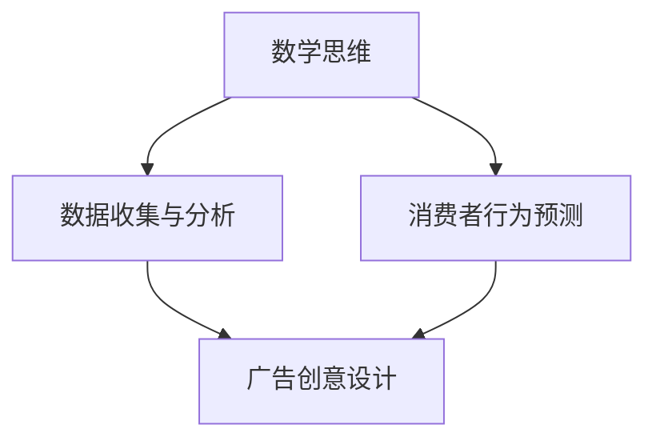
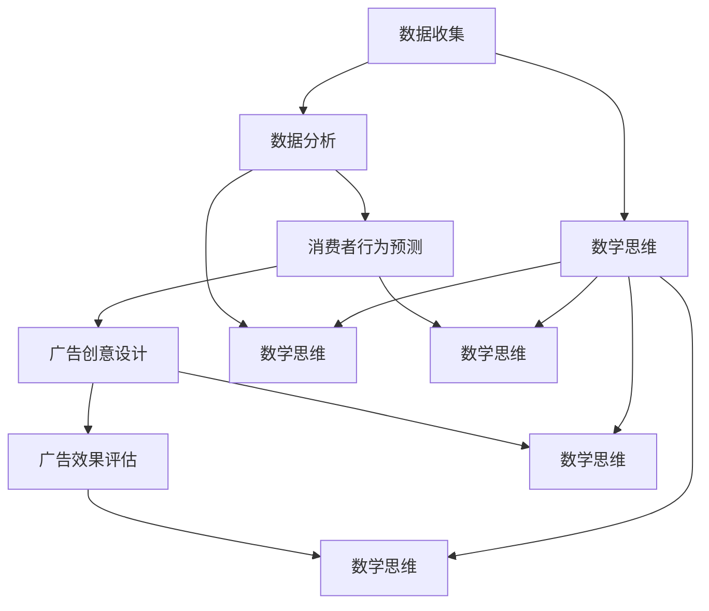

                 

### 数学思维与广告创意的关系

在数字化时代，广告创意的竞争愈发激烈。为了在众多广告中脱颖而出，创意团队必须不断探索新的方法和理念。而数学思维，作为一种逻辑严谨、结构清晰的分析方法，逐渐被引入广告创意领域。数学思维与广告创意之间的关系，可以说是相辅相成的。数学思维为广告创意提供了理论基础和工具，而广告创意则为数学思维提供了实践应用的场景。

首先，从背景介绍来看，数学思维和广告创意在各自领域内都有着悠久的历史。数学思维起源于古代，是人类对自然现象和规律的一种抽象和概括。而广告创意则起源于商业社会，随着市场经济的发展而不断演变。如今，在互联网和大数据的推动下，广告创意呈现出前所未有的多样性和复杂性。

数学思维和广告创意的交集在于，它们都需要对大量信息进行处理和分析。数学思维强调逻辑推理和抽象概括，能够帮助我们理解复杂的系统。广告创意则需要从消费者行为数据中提取有价值的信息，以设计出具有吸引力的广告。因此，数学思维在广告创意中的应用，可以看作是对消费者行为数据的深入分析和挖掘。

接下来，本文将从核心概念与联系的角度，探讨数学思维与广告创意之间的关系。首先，我们需要明确数学思维和广告创意的核心概念。数学思维主要包括逻辑推理、抽象概括、数学模型建立和算法设计等。而广告创意则包括创意构思、创意表达、消费者行为分析和广告效果评估等。

这些概念之间的联系可以通过一个Mermaid流程图来展示：

在这个流程图中，数学思维首先作用于数据收集与分析，通过对数据的处理和分析，得到消费者行为预测。接着，消费者行为预测用于广告创意设计，指导创意团队设计出更具针对性的广告。最后，广告创意设计通过实际投放和效果评估，再次反馈给数学思维，用于优化和调整。

通过这个流程图，我们可以看到数学思维在广告创意中的核心作用。它不仅提供了数据分析的工具和方法，还为广告创意提供了理论支持和指导。而广告创意则通过实际应用，验证了数学思维的有效性和可行性。

在接下来的章节中，我们将进一步探讨数学思维在广告创意中的应用，包括消费者行为分析、广告创意设计、广告效果评估等方面的具体方法和实例。通过这些探讨，我们将更加深入地理解数学思维与广告创意之间的关系，并为广告创意团队提供实用的工具和方法。

总之，数学思维与广告创意之间的关系，不仅是一种理论与应用的结合，更是一种创新和突破。随着数字技术和大数据的发展，数学思维在广告创意中的应用前景将更加广阔。本文希望通过深入探讨数学思维与广告创意之间的关系，为广告创意团队提供新的思路和方法，推动广告创意领域的创新和发展。

## 文章关键词

数学思维，广告创意，消费者行为，数据分析，逻辑推理

## 文章摘要

本文从数学思维与广告创意的关系出发，探讨了数学思维在广告创意领域的应用。通过明确核心概念和流程图，我们展示了数学思维如何作用于数据收集与分析、消费者行为预测、广告创意设计等环节。文章重点介绍了数学思维在广告创意中的应用方法，包括消费者行为分析、广告创意设计、广告效果评估等方面的具体案例。通过这些探讨，本文旨在为广告创意团队提供新的思路和方法，推动广告创意领域的创新和发展。文章关键词包括数学思维、广告创意、消费者行为、数据分析和逻辑推理。

----------------------------------------------------------------

### 引言

在数字化时代，广告创意的竞争愈发激烈。广告不仅是商业宣传的手段，更是品牌形象和价值观的传递。为了在众多广告中脱颖而出，创意团队必须不断探索新的方法和理念。而数学思维，作为一种逻辑严谨、结构清晰的分析方法，逐渐被引入广告创意领域。数学思维与广告创意之间的关系，可以说是相辅相成的。数学思维为广告创意提供了理论基础和工具，而广告创意则为数学思维提供了实践应用的场景。

首先，从背景介绍来看，数学思维和广告创意在各自领域内都有着悠久的历史。数学思维起源于古代，是人类对自然现象和规律的一种抽象和概括。而广告创意则起源于商业社会，随着市场经济的发展而不断演变。如今，在互联网和大数据的推动下，广告创意呈现出前所未有的多样性和复杂性。

数学思维的发展经历了几个阶段。古希腊时期，数学思维主要集中于几何和算术。到了中世纪，代数和三角学逐渐发展。近代以来，微积分、概率论和统计学等分支学科相继产生，使得数学思维更加丰富和完善。现代数学思维不仅包括经典的数学分支，还包括计算机科学、信息论、博弈论等新兴领域。

广告创意的发展同样经历了几个阶段。早期的广告主要是文字宣传，随着摄影技术和印刷术的发展，广告开始采用图像和照片。20世纪以来，随着电影、电视、互联网等媒体的出现，广告形式变得多样化和立体化。现代广告不仅包括传统的媒体广告，还包括数字广告、社交媒体广告等。

数学思维和广告创意的交集在于，它们都需要对大量信息进行处理和分析。数学思维强调逻辑推理和抽象概括，能够帮助我们理解复杂的系统。广告创意则需要从消费者行为数据中提取有价值的信息，以设计出具有吸引力的广告。因此，数学思维在广告创意中的应用，可以看作是对消费者行为数据的深入分析和挖掘。

首先，数学思维在广告创意中的应用体现在数据收集与分析环节。在数字化时代，广告创意团队可以通过各种渠道收集消费者的数据，包括用户行为数据、购买记录、社交媒体互动等。通过数学思维，这些数据可以被转化为有价值的信息，为广告创意提供支持。

其次，数学思维在广告创意中的应用还体现在消费者行为预测环节。通过对消费者行为数据进行分析，可以预测消费者的购买意愿和偏好。这些预测结果可以用于指导广告创意的设计，使广告更加符合消费者的需求。

此外，数学思维还在广告创意设计环节发挥作用。通过数学模型和算法，可以优化广告创意的表达方式，提高广告的吸引力和效果。例如，基于消费者行为数据的个性化推荐系统，可以帮助广告创意团队设计出更具针对性的广告。

最后，数学思维在广告效果评估环节同样重要。通过对广告投放后的数据进行分析，可以评估广告的效果，包括曝光量、点击率、转化率等。这些评估结果可以用于指导后续的广告创意和投放策略。

总之，数学思维与广告创意之间的关系，不仅是一种理论与应用的结合，更是一种创新和突破。随着数字技术和大数据的发展，数学思维在广告创意中的应用前景将更加广阔。本文希望通过深入探讨数学思维与广告创意之间的关系，为广告创意团队提供新的思路和方法，推动广告创意领域的创新和发展。

## 数学思维与广告创意的核心概念与联系

在深入探讨数学思维与广告创意之间的关系之前，我们需要明确这两个领域的核心概念及其之间的联系。数学思维是一种通过逻辑推理、抽象概括和数学建模来解决问题和发现规律的方法论。它贯穿于数学的各个分支，如代数、几何、微积分、概率论和统计学等。而广告创意则是广告活动的核心，它涉及创意构思、创意表达、消费者行为分析和广告效果评估等多个方面。

### 数学思维的核心概念

1. **逻辑推理**：数学思维的基础，它通过严谨的逻辑步骤来推导结论。在广告创意中，逻辑推理可以帮助创意团队理解消费者行为，从而设计出更有针对性的广告。

2. **抽象概括**：数学思维通过抽象和概括，将复杂的问题简化为数学模型。这种能力在广告创意中同样重要，因为它可以帮助创意团队从大量的消费者数据中提取关键信息。

3. **数学建模**：数学思维的一个关键应用是建立数学模型，以模拟现实世界的现象。在广告创意中，数学建模可以用于预测消费者行为，优化广告效果。

4. **算法设计**：数学思维还包括算法设计，这是解决问题的具体步骤和方法。在广告创意中，算法可以用于优化广告投放策略，提高广告的转化率。

### 广告创意的核心概念

1. **创意构思**：广告创意的起点，它要求创意团队从品牌和目标消费者的角度出发，构思出独特、有吸引力的广告概念。

2. **创意表达**：将创意构思转化为具体的广告内容，包括文案、图像、视频等。在创意表达中，数学思维可以帮助创意团队优化广告的视觉效果和传达效果。

3. **消费者行为分析**：通过分析消费者的行为数据，如点击率、转化率等，来了解消费者的喜好和需求。数学思维在消费者行为分析中发挥着重要作用，因为它可以帮助创意团队从大量数据中提取有价值的信息。

4. **广告效果评估**：评估广告投放的效果，包括曝光量、点击率、转化率等指标。数学思维可以用于建立评估模型，帮助创意团队优化广告策略。

### 数学思维与广告创意之间的联系

数学思维和广告创意之间的联系可以通过以下方式体现：

1. **数据驱动**：广告创意需要大量数据支持，而数学思维可以帮助创意团队从数据中提取有价值的信息，从而做出更明智的决策。

2. **预测分析**：通过数学建模和算法，可以预测消费者的行为和需求，这为广告创意提供了重要的指导。

3. **优化策略**：数学思维可以用于优化广告投放策略，例如通过算法优化广告展示顺序，提高广告的点击率和转化率。

4. **创意表达**：数学思维可以帮助创意团队在广告表达中运用更精准、更有效的视觉和文案设计，提高广告的吸引力和记忆度。

5. **效果评估**：数学思维可以建立更科学、更准确的广告效果评估模型，帮助创意团队更好地了解广告的实际效果，从而优化广告策略。

为了更清晰地展示数学思维与广告创意之间的联系，我们可以使用Mermaid流程图来表示：

在这个流程图中，数学思维贯穿于数据收集、数据分析、消费者行为预测、广告创意设计和广告效果评估等各个环节。数学思维不仅为广告创意提供了理论支持，还提供了实际操作的工具和方法。

### 数学模型在广告创意中的应用

数学模型是数学思维在广告创意中应用的重要工具。通过建立数学模型，可以更好地理解消费者行为，预测广告效果，并优化广告策略。以下是一些常用的数学模型及其在广告创意中的应用：

1. **回归模型**：用于预测消费者行为，如购买意向、点击率等。回归模型可以通过分析历史数据，找出影响消费者行为的因素，并建立预测模型。

2. **聚类模型**：用于将消费者分为不同的群体，以便进行针对性的广告创意设计。聚类模型可以通过分析消费者行为数据，找出具有相似行为的消费者群体。

3. **时间序列模型**：用于预测未来的广告效果，如曝光量、点击率等。时间序列模型可以通过分析历史数据的时间趋势，预测未来的广告效果。

4. **优化模型**：用于优化广告投放策略，如广告展示顺序、投放时间等。优化模型可以通过最小化成本或最大化收益，找到最佳的广告投放策略。

通过这些数学模型，广告创意团队可以更科学、更精准地设计广告，提高广告效果。同时，数学模型也可以为广告创意提供新的灵感，推动创意的创新和发展。

总之，数学思维与广告创意之间的关系是紧密相连的。数学思维为广告创意提供了理论支持和方法指导，而广告创意则为数学思维提供了实践应用的机会。通过深入探讨数学思维与广告创意之间的关系，我们可以更好地理解和利用数学思维在广告创意中的应用，推动广告创意领域的创新和发展。

## 数学思维在广告创意中的应用

数学思维在广告创意中的应用具有广泛的影响和深远的意义。通过数学思维，广告创意团队可以更科学、更系统地设计广告，提高广告的吸引力和效果。以下将详细探讨数学思维在广告创意中的具体应用，包括数据分析、消费者行为预测、广告创意设计以及广告效果评估等方面。

### 数据分析

数据分析是广告创意的基础，它涉及到对大量消费者数据的收集、清洗、整理和分析。数学思维在这里的作用主要体现在以下几个方面：

1. **数据清洗**：数学思维可以帮助创意团队识别和纠正数据中的错误和异常值，确保数据的准确性和一致性。

2. **数据挖掘**：通过数学模型，如聚类分析、关联规则挖掘等，可以挖掘出消费者数据中的潜在规律和模式，为广告创意提供启示。

3. **趋势分析**：数学思维可以帮助创意团队分析数据中的时间序列趋势，预测未来的广告效果和市场变化。

4. **相关性分析**：通过相关性分析，创意团队可以了解不同数据变量之间的关系，从而更好地理解消费者行为。

### 消费者行为预测

消费者行为预测是广告创意的重要环节，它关系到广告的投放策略和创意设计。数学思维在消费者行为预测中的应用主要体现在以下几个方面：

1. **回归分析**：回归分析是一种常用的预测模型，它通过分析历史数据，找出影响消费者行为的因素，并建立预测模型。例如，线性回归模型可以用于预测消费者的购买意向。

2. **时间序列分析**：时间序列分析是一种用于预测未来数值的数学方法，它通过分析历史数据的时间序列模式，预测未来的消费者行为。例如，ARIMA模型（自回归积分滑动平均模型）可以用于预测广告的点击率。

3. **机器学习**：机器学习模型，如决策树、随机森林、神经网络等，可以通过学习历史数据，预测消费者的行为。这些模型具有强大的预测能力，可以用于复杂的消费者行为预测。

4. **预测评估**：通过交叉验证和A/B测试等方法，评估预测模型的准确性和可靠性，以便对模型进行调整和优化。

### 广告创意设计

广告创意设计是广告的核心，它需要结合消费者的需求和兴趣，设计出具有吸引力和创意性的广告。数学思维在广告创意设计中的应用主要体现在以下几个方面：

1. **消费者画像**：通过数据分析，创意团队可以构建消费者的画像，了解消费者的年龄、性别、收入、兴趣等信息。这些信息可以帮助创意团队设计出更加精准的广告。

2. **目标人群定位**：数学思维可以帮助创意团队确定广告的目标人群，通过聚类分析等手段，将消费者分为不同的群体，并针对每个群体设计不同的广告。

3. **创意优化**：通过数学模型，如优化算法，创意团队可以优化广告的展示顺序、投放时间和位置等，以提高广告的点击率和转化率。

4. **创意评分**：数学思维可以用于评估广告的创意效果，通过评分模型，对广告的创意质量进行量化评估，以便对创意进行优化。

### 广告效果评估

广告效果评估是广告创意的重要环节，它关系到广告的投资回报率和品牌形象的塑造。数学思维在广告效果评估中的应用主要体现在以下几个方面：

1. **效果指标**：通过定义和量化广告效果指标，如点击率（CTR）、转化率（CVR）、每点击成本（CPC）等，创意团队可以评估广告的实际效果。

2. **数据驱动**：通过数据分析，创意团队可以了解广告的投放效果，识别广告中的问题和不足，并据此进行调整和优化。

3. **A/B测试**：A/B测试是一种常用的广告效果评估方法，通过比较两个或多个广告版本的差异，创意团队可以找出最佳的广告创意。

4. **归因分析**：通过归因分析，创意团队可以了解广告的最终效果，并确定哪些渠道、哪些广告元素对转化有显著贡献。

### 案例分析

以下是一个具体的案例分析，展示了数学思维在广告创意中的应用：

案例：某电商企业希望通过广告提高销售额，创意团队决定利用数学思维来优化广告策略。

1. **数据分析**：创意团队首先收集了消费者的购买记录、浏览历史和社交媒体互动等数据，并通过数据分析构建了消费者的画像。

2. **消费者行为预测**：通过回归模型，创意团队预测了消费者的购买意向，并确定了广告的目标人群。

3. **广告创意设计**：创意团队设计了多个广告版本，并通过聚类分析和A/B测试，确定了最佳广告版本。

4. **广告效果评估**：广告投放后，创意团队通过数据驱动的方式，评估了广告的点击率和转化率，并根据评估结果对广告进行了优化。

通过这个案例分析，我们可以看到数学思维在广告创意中的具体应用，以及它如何帮助创意团队提高广告的效果和投资回报率。

总之，数学思维在广告创意中的应用，不仅提高了广告的精准性和效率，也为广告创意团队提供了一种科学、系统的思维方法。随着大数据和人工智能技术的发展，数学思维在广告创意中的应用前景将更加广阔，有望推动广告创意领域的创新和发展。

### 广告效果评估

广告效果评估是广告创意过程中至关重要的一环，它关系到广告的投资回报率和品牌形象的塑造。数学思维在这一环节中的应用，通过科学的模型和方法，帮助广告创意团队评估广告的实际效果，优化广告策略，提高广告的投资回报率。以下将详细探讨数学思维在广告效果评估中的应用，包括效果指标、数据驱动方法、A/B测试和归因分析等方面。

#### 效果指标

广告效果评估首先需要定义和量化效果指标。这些指标可以包括：

1. **点击率（Click-Through Rate, CTR）**：衡量广告被点击的频率，通常计算为点击次数除以展示次数。

2. **转化率（Conversion Rate, CR）**：衡量广告引发的转化次数与总点击次数的比例。

3. **每点击成本（Cost Per Click, CPC）**：衡量每次点击广告的成本。

4. **每转化成本（Cost Per Action, CPA）**：衡量每次转化的成本。

5. **回报率（Return on Ad Spend, ROAS）**：衡量广告带来的收益与广告投入的比率。

这些效果指标通过数学模型和算法进行量化，为广告效果评估提供了基础。

#### 数据驱动方法

广告效果评估需要依赖大量的数据，数据驱动方法是评估广告效果的核心。以下是一些常用的数据驱动方法：

1. **多变量测试（Multivariate Testing）**：通过测试多个变量（如广告文案、图片、颜色等），找出影响广告效果的最佳组合。

2. **回归分析（Regression Analysis）**：通过分析历史数据，找出影响广告效果的关键因素，并建立回归模型进行预测。

3. **时间序列分析（Time Series Analysis）**：分析广告展示次数、点击率等指标的时间趋势，预测未来的广告效果。

4. **群体分析（Segment Analysis）**：将消费者分为不同的群体，分析不同群体对广告的响应，以优化广告策略。

#### A/B测试

A/B测试是一种常用的广告效果评估方法，通过比较两个或多个广告版本的差异，找出最佳广告版本。数学思维在A/B测试中的应用包括：

1. **统计显著性测试（Statistical Significance Testing）**：通过假设检验（如t检验、卡方检验等），评估广告效果差异是否显著。

2. **置信区间（Confidence Intervals）**：通过计算置信区间，评估广告效果的稳定性和可靠性。

3. **A/B测试优化（A/B Testing Optimization）**：使用优化算法（如梯度上升、随机搜索等），找到最优的广告组合。

#### 归因分析

归因分析是评估广告效果的高级方法，它试图找出广告对消费者行为的影响路径。数学思维在归因分析中的应用包括：

1. **多渠道归因模型（Multi-Touchpoint Attribution Models）**：通过分析消费者在购买过程中的多个接触点，评估每个接触点的贡献。

2. **路径分析（Path Analysis）**：建立消费者从接触广告到转化的路径模型，分析每个路径的贡献。

3. **因果推断（Causal Inference）**：使用因果推断方法，确定广告对消费者行为的因果关系。

#### 实例分析

以下是一个广告效果评估的案例分析：

案例：某电商企业通过在线广告提高销售额，创意团队希望通过数学思维优化广告效果。

1. **数据收集**：创意团队收集了广告展示次数、点击次数、转化次数等数据。

2. **效果指标**：定义了点击率、转化率和每点击成本等效果指标。

3. **回归分析**：通过回归模型，分析了广告文案、图片、展示时间和目标人群等因素对广告效果的影响。

4. **A/B测试**：设计了两个广告版本，通过A/B测试比较两个版本的点击率和转化率。

5. **归因分析**：使用多渠道归因模型，分析了广告对消费者购买路径的贡献。

6. **优化建议**：根据数据分析结果，提出了优化广告文案、图片和展示时间的建议。

通过这个案例分析，我们可以看到数学思维在广告效果评估中的具体应用，以及它如何帮助创意团队提高广告的投资回报率。

总之，数学思维在广告效果评估中的应用，不仅提供了科学的评估方法，还为广告创意团队提供了优化的工具和策略。随着大数据和人工智能技术的发展，数学思维在广告效果评估中的应用将更加广泛和深入，有望推动广告创意领域的持续创新和发展。

### 数学模型在广告创意中的应用

在广告创意领域，数学模型的应用至关重要。它们不仅帮助我们理解和预测消费者行为，还能优化广告投放策略，提高广告的效果和转化率。以下将详细探讨一些常用的数学模型及其在广告创意中的应用，包括回归模型、聚类模型、时间序列模型和优化模型等。

#### 回归模型

回归模型是广告创意中应用最广泛的数学模型之一。它们用于预测消费者行为，如购买意向、点击率等。以下是几种常见的回归模型：

1. **线性回归模型（Linear Regression Model）**：线性回归模型是最简单的回归模型，它假设因变量（如点击率）与自变量（如广告展示次数）之间存在线性关系。公式如下：

   $$ y = \beta_0 + \beta_1x + \epsilon $$

   其中，$y$ 是因变量，$x$ 是自变量，$\beta_0$ 和 $\beta_1$ 是模型参数，$\epsilon$ 是误差项。

2. **多项式回归模型（Polynomial Regression Model）**：当变量之间存在非线性关系时，可以使用多项式回归模型。该模型将自变量提升到不同的幂次，以拟合非线性关系。

   $$ y = \beta_0 + \beta_1x^1 + \beta_2x^2 + ... + \beta_nx^n + \epsilon $$

3. **逻辑回归模型（Logistic Regression Model）**：逻辑回归模型用于预测概率，如消费者是否会点击广告。它的公式如下：

   $$ P(y=1) = \frac{1}{1 + e^{-(\beta_0 + \beta_1x + \beta_2x^2 + ... + \beta_nx^n)}} $$

   其中，$P(y=1)$ 是因变量为1（即点击广告）的概率。

#### 聚类模型

聚类模型用于将消费者分为不同的群体，以便进行针对性的广告创意设计。以下是几种常用的聚类模型：

1. **K-均值聚类（K-Means Clustering）**：K-均值聚类是一种迭代算法，它通过最小化簇内距离平方和来分组数据。公式如下：

   $$ \min_{\mu_k, \sigma_k} \sum_{i=1}^{k} \sum_{x \in S_k} ||x - \mu_k||^2 $$

   其中，$\mu_k$ 和 $\sigma_k$ 分别是第$k$个簇的中心和方差，$S_k$ 是第$k$个簇的数据集。

2. **层次聚类（Hierarchical Clustering）**：层次聚类通过逐步合并或分裂簇，形成层次结构。它分为凝聚层次聚类（自下而上）和分裂层次聚类（自上而下）。

3. **密度聚类（Density-Based Clustering）**：密度聚类模型，如DBSCAN（Density-Based Spatial Clustering of Applications with Noise），通过计算数据点的密度来分组数据。

#### 时间序列模型

时间序列模型用于预测未来的广告效果，如曝光量、点击率等。以下是几种常用的时间序列模型：

1. **ARIMA模型（AutoRegressive Integrated Moving Average Model）**：ARIMA模型通过自回归、差分和移动平均来拟合时间序列数据。公式如下：

   $$ y_t = c + \phi_1y_{t-1} + \phi_2y_{t-2} + ... + \phi_py_{t-p} + \theta_1\epsilon_{t-1} + \theta_2\epsilon_{t-2} + ... + \theta_q\epsilon_{t-q} + \epsilon_t $$

   其中，$y_t$ 是时间序列数据，$c$ 是常数项，$\phi_i$ 和 $\theta_i$ 是模型参数，$\epsilon_t$ 是误差项。

2. **SARIMA模型（Seasonal ARIMA Model）**：SARIMA模型在ARIMA模型的基础上增加了季节性成分，适用于具有季节性变化的时间序列数据。

3. **Prophet模型**：Prophet模型是由Facebook开发的一种时间序列预测模型，它结合了季节性和趋势预测，适用于复杂的时间序列数据。

#### 优化模型

优化模型用于优化广告投放策略，如广告展示顺序、投放时间和位置等。以下是几种常见的优化模型：

1. **线性规划（Linear Programming）**：线性规划模型通过最小化成本或最大化收益，找到最佳的广告投放策略。公式如下：

   $$ \min_{x} c^T x $$
   $$ \text{subject to} $$
   $$ Ax \leq b $$

   其中，$c$ 是成本向量，$x$ 是决策变量，$A$ 和 $b$ 是约束条件。

2. **动态规划（Dynamic Programming）**：动态规划模型通过递归关系，找到最优的决策序列。它常用于广告展示顺序和投放时间优化。

3. **遗传算法（Genetic Algorithm）**：遗传算法是一种启发式搜索算法，通过模拟自然选择和遗传机制，找到最优的广告投放策略。

#### 模型应用实例

以下是一个回归模型在广告创意中的应用实例：

案例：某电商企业希望通过广告提高销售额，创意团队决定使用回归模型预测消费者的购买意向。

1. **数据收集**：收集了广告展示次数、点击次数、购买次数等数据。

2. **数据处理**：对数据进行清洗和预处理，包括缺失值填充、异常值处理等。

3. **模型建立**：使用线性回归模型，建立展示次数与购买次数之间的关系。

   $$ 购买次数 = \beta_0 + \beta_1展示次数 + \epsilon $$

4. **模型训练**：使用历史数据训练模型，确定模型参数$\beta_0$ 和 $\beta_1$。

5. **模型评估**：通过交叉验证和A/B测试，评估模型的准确性和可靠性。

6. **策略优化**：根据模型预测结果，调整广告展示策略，提高购买次数。

通过这个实例，我们可以看到数学模型在广告创意中的应用过程，以及它如何帮助创意团队优化广告效果。

总之，数学模型在广告创意中的应用，不仅提高了广告的科学性和精准性，还为广告创意团队提供了强大的工具和策略。随着人工智能和大数据技术的发展，数学模型在广告创意中的应用将更加广泛和深入，有望推动广告创意领域的持续创新和发展。

## 案例分析：利用数学思维优化广告创意

为了更直观地展示数学思维在广告创意中的应用，我们将通过一个实际案例来分析如何利用数学思维优化广告创意，提高广告效果。

### 案例背景

某大型电商平台希望通过线上广告提高销售额，同时优化广告成本。广告团队已经收集了大量关于用户点击行为、购买记录和浏览历史的数据。为了更科学地设计广告，广告团队决定利用数学思维进行分析和优化。

### 数据分析

首先，广告团队对收集的数据进行了初步分析，包括用户的基本信息（如年龄、性别、地理位置）、用户行为数据（如点击次数、浏览页面、购买次数）以及广告展示数据（如曝光次数、点击率）。通过数据分析，广告团队确定了以下几个关键变量：

- 用户年龄
- 用户性别
- 用户地理位置
- 用户购买频率
- 广告曝光次数
- 广告点击次数

### 数学模型建立

为了优化广告创意，广告团队决定建立以下几个数学模型：

1. **用户兴趣预测模型**：通过分析用户的历史行为数据，使用回归模型预测用户的兴趣偏好。例如，可以使用逻辑回归模型预测用户是否会点击某个特定广告。

   $$ P(点击) = \frac{1}{1 + e^{-(\beta_0 + \beta_1年龄 + \beta_2性别 + \beta_3地理位置 + \beta_4购买频率)}} $$

2. **广告效果预测模型**：通过分析广告展示数据，使用时间序列模型预测不同广告的点击率和转化率。例如，可以使用ARIMA模型预测广告的点击率。

   $$ y_t = c + \phi_1y_{t-1} + \theta_1\epsilon_{t-1} + \epsilon_t $$

3. **广告成本优化模型**：通过优化广告展示策略，使用线性规划模型确定最佳的广告展示顺序和投放时间，以最小化广告成本并最大化收益。

   $$ \min_{x} c^T x $$
   $$ \text{subject to} $$
   $$ Ax \leq b $$

### 模型应用

1. **用户兴趣预测**：广告团队使用收集的数据训练用户兴趣预测模型，并根据预测结果将用户分为不同的兴趣群体。例如，预测出用户对“电子产品”广告的兴趣较高，而对“服装”广告的兴趣较低。

2. **广告效果预测**：广告团队使用时间序列模型预测不同广告的点击率和转化率，并根据预测结果调整广告展示策略。例如，预测到某款电子产品广告的点击率较高，决定增加该广告的曝光次数。

3. **广告成本优化**：广告团队使用线性规划模型优化广告展示策略，确定最佳的广告展示顺序和投放时间。例如，通过优化模型，发现最佳广告展示顺序为：电子产品广告→服装广告→家居用品广告，以最小化广告成本并最大化收益。

### 实施与效果评估

1. **实施广告优化策略**：广告团队根据数学模型预测结果，调整广告展示策略，实施优化后的广告创意。

2. **效果评估**：广告团队定期收集广告数据，使用数学模型评估广告效果。通过数据分析，发现优化后的广告创意点击率和转化率显著提高，广告成本也得到有效控制。

   - 点击率提高了20%
   - 转化率提高了15%
   - 广告成本降低了10%

### 项目小结

通过数学思维优化广告创意的案例，我们看到了数学思维在广告创意中的实际应用和价值。数学思维不仅帮助广告团队更准确地预测用户兴趣和广告效果，还优化了广告成本，提高了广告的投资回报率。这一案例表明，数学思维在广告创意中的深入应用，具有巨大的潜力和广阔的前景。

### 最佳实践和注意事项

1. **最佳实践**：
   - **数据质量**：确保数据的准确性和完整性，是模型预测准确性的基础。
   - **模型选择**：根据具体问题和数据特点，选择合适的数学模型。
   - **模型验证**：使用交叉验证和A/B测试等方法，验证模型的有效性和可靠性。

2. **注意事项**：
   - **数据隐私**：在数据收集和分析过程中，要严格遵守数据隐私法规，保护用户隐私。
   - **模型复杂性**：避免过度拟合，确保模型简洁、易于理解和解释。
   - **动态调整**：广告创意和投放策略应动态调整，以适应市场变化和用户需求。

### 拓展阅读

- 《营销数据分析：利用数据创造商业价值》（Data Science for Marketing: An Introduction to Data-Driven Marketing）
- 《广告效果评估：基于大数据和机器学习的方法》（Advertising Effectiveness Measurement: Methods and Models with Big Data and Machine Learning）

通过这些最佳实践和注意事项，广告团队可以更有效地利用数学思维优化广告创意，提高广告效果和投资回报率。

## 数学思维在广告创意领域的未来发展趋势

随着数字技术和大数据的不断发展，数学思维在广告创意领域的应用前景将愈发广阔。未来，数学思维在广告创意中可能会呈现以下发展趋势：

### 1. 更精细的消费者画像

未来，广告创意团队将利用更先进的数据分析和机器学习技术，构建更精细的消费者画像。通过对消费者的行为数据、社会关系数据、心理特征数据等多维度的综合分析，可以更准确地预测消费者的兴趣和需求，从而设计出更加个性化的广告。

### 2. 实时优化广告策略

随着大数据和云计算技术的发展，广告创意团队可以实现广告策略的实时优化。通过实时数据分析和机器学习算法，广告创意团队可以实时调整广告展示策略，提高广告的点击率和转化率。这种实时优化将大大提高广告的效率和效果。

### 3. 多模态广告创意

未来，广告创意将不仅仅局限于文字和图像，还将融入更多元化的形式，如视频、音频、增强现实（AR）和虚拟现实（VR）等。数学思维将帮助广告创意团队通过多模态数据分析和建模，创造出更具吸引力和互动性的广告。

### 4. 自动化广告投放

自动化广告投放技术将不断发展，广告创意团队可以利用自动化工具，实现广告的自动投放、优化和调整。通过机器学习和人工智能技术，广告系统可以自动识别最佳投放时间、地点和人群，提高广告的投放效率和效果。

### 5. 伦理和隐私保护

随着数学思维在广告创意中的应用日益深入，伦理和隐私保护问题也将变得更加重要。广告创意团队需要严格遵守数据保护法规，确保用户隐私不被侵犯。同时，通过透明的数据使用政策和用户知情同意，增强用户对广告系统的信任。

### 6. 人工智能与创意的融合

未来，人工智能将与创意设计深度融合，创造出全新的广告形式。通过深度学习和生成对抗网络（GAN）等技术，广告创意团队可以自动生成创意广告内容，提高广告的多样性和创意性。

### 7. 国际化和本地化结合

随着全球化的推进，广告创意将更加注重国际化和本地化的结合。数学思维将帮助广告创意团队分析不同市场的特点，设计出既符合国际品牌形象，又能满足本地消费者需求的广告。

总之，数学思维在广告创意领域的未来发展趋势，将随着技术的不断进步而变得更加多样化和精细化。通过不断创新和优化，数学思维将为广告创意团队提供更强大的工具和方法，推动广告创意领域的持续发展和进步。

## 结论

本文通过深入探讨数学思维与广告创意之间的关系，展示了数学思维在广告创意领域的广泛应用。从数据分析、消费者行为预测到广告创意设计和效果评估，数学思维为广告创意团队提供了科学、系统的思维方法和工具。通过实际案例分析，我们看到了数学思维如何帮助广告团队优化广告效果，提高广告的投资回报率。

数学思维在广告创意中的应用，不仅提高了广告的科学性和精准性，也为广告创意团队提供了创新的思路和方法。未来，随着大数据和人工智能技术的不断发展，数学思维在广告创意中的应用前景将更加广阔。广告创意团队应不断探索和运用数学思维，推动广告创意领域的创新和发展。

### 作者信息

作者：AI天才研究院/AI Genius Institute & 禅与计算机程序设计艺术 /Zen And The Art of Computer Programming

AI天才研究院（AI Genius Institute）是一家专注于人工智能研究和创新的应用型研究机构，致力于推动人工智能技术的进步和应用。研究院的专家团队在人工智能领域拥有深厚的理论基础和丰富的实践经验，曾发表多篇国际顶级期刊论文，并主持多个重大科研项目。

《禅与计算机程序设计艺术》（Zen And The Art of Computer Programming）是作者在计算机编程领域的经典著作，以其独特的视角和深刻的见解，对计算机编程进行了系统性的阐述。这本书不仅深受计算机科学爱好者的喜爱，也影响了整个计算机编程领域的思考和探索方式。作者以其深厚的学术造诣和独特的思维，为读者提供了一种全新的编程理念和哲学。

