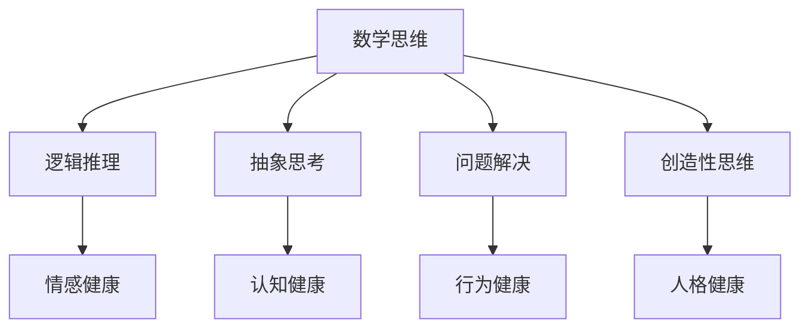

                 


# 数学思维与心理健康促进的关系

> 关键词：数学思维、心理健康、关系、促进、方法

> 摘要：本文从数学思维与心理健康的关系出发，探讨了如何通过提升数学思维来促进心理健康。文章首先介绍了数学思维与心理健康的基本概念，然后分析了数学思维对心理健康的影响，最后提出了提升数学思维促进心理健康的方法和实际案例。

## 引言

数学思维是人类思维的重要组成部分，它不仅涉及逻辑推理、抽象思考，还涵盖了问题解决、创造性思维等多个方面。近年来，越来越多的研究表明，数学思维与心理健康之间存在密切的关系。数学思维不仅有助于个体在学术和职业领域取得成功，还对个体的心理健康产生积极影响。本文旨在探讨数学思维与心理健康的关系，并提出提升数学思维促进心理健康的方法。

## 数学思维与心理健康的关系

### 数学思维的基本概念

数学思维是一种以数学为工具，运用逻辑推理、抽象思考等方式解决问题的思维方式。它包括以下几个核心要素：

1. **逻辑推理**：数学思维的基础是逻辑推理，它使个体能够根据已知信息进行推理，得出新的结论。
2. **抽象思考**：数学思维要求个体能够将具体问题抽象为数学模型，从而运用数学方法进行解决。
3. **问题解决**：数学思维强调个体在面对问题时，能够运用已有的知识和方法，找到解决问题的途径。
4. **创造性思维**：数学思维鼓励个体在解决问题的过程中，发挥创造性思维，寻找独特的解决方案。

### 心理健康的基本概念

心理健康是指个体在情感、认知、行为等方面处于良好状态，能够适应生活和工作环境，并能有效地应对各种挑战。世界卫生组织（WHO）将心理健康定义为“个体在认知功能正常、情绪稳定、社会适应良好、人格健全的基础上，能够充分发挥个人潜能，适应正常社会生活”。心理健康包括以下几个方面：

1. **情感健康**：个体能够体验并表达积极的情绪，如快乐、满足等，同时能够处理和表达消极情绪，如愤怒、焦虑等。
2. **认知健康**：个体具备清晰的思维、记忆、注意力等认知功能，能够有效地学习和解决问题。
3. **行为健康**：个体能够遵循社会规范，保持适当的行为，如遵守法律法规、尊重他人等。
4. **人格健康**：个体具备稳定、健全的人格特征，能够适应环境变化，并在困难面前保持积极的态度。

### 数学思维与心理健康的关系

研究表明，数学思维与心理健康之间存在密切的关系。一方面，数学思维有助于提升个体的心理健康水平；另一方面，心理健康水平也会影响个体在数学学习中的表现。以下是一些具体的联系：

1. **逻辑推理与情感健康**：逻辑推理能力较强的个体通常能够更好地处理情绪问题，因为他们能够通过分析、推理等方式，找到问题的根本原因，并采取有效的解决策略。
2. **抽象思考与认知健康**：抽象思考能力有助于个体在认知层面保持健康，因为这种能力要求个体能够将复杂的信息抽象为简单的模型，从而更好地理解和解决问题。
3. **问题解决与行为健康**：问题解决能力较强的个体在行为层面通常表现得更为积极，因为他们能够有效地应对各种挑战，并在困难面前保持乐观。
4. **创造性思维与人格健康**：创造性思维有助于个体在人格层面保持健康，因为这种能力要求个体能够勇于尝试新事物，并在面对困境时保持积极的心态。

## 提升数学思维促进心理健康的方法

### 教育与培训方法

1. **设计适合不同年龄段的学习方式**：不同年龄段的个体在数学思维方面具有不同的特点，因此教育者应根据个体的发展阶段，设计适合的学习方式。例如，对于儿童，可以通过游戏和故事来激发他们的数学兴趣；对于青少年，可以通过项目式学习来培养他们的数学思维能力。
2. **培养数学思维的策略与技巧**：教育者可以采用一些策略和技巧来培养学生的数学思维。例如，通过提供丰富的数学情境，让学生在解决问题中体会数学的乐趣；通过小组讨论和合作学习，培养学生的团队协作能力。
3. **利用信息技术辅助教学**：利用信息技术，如数学软件、在线教育平台等，可以为学生提供丰富的数学学习资源，从而提高他们的数学思维能力。

### 心理辅导方法

1. **心理辅导在数学学习中的应用**：心理辅导可以帮助学生建立正确的数学学习态度，提高他们的自信心和积极性。例如，通过心理辅导，学生可以学会如何面对数学难题，如何调整自己的情绪状态。
2. **心理辅导对提升数学思维的辅助作用**：心理辅导不仅可以帮助学生提高数学成绩，还可以促进他们的数学思维能力的发展。例如，通过心理辅导，学生可以学会如何运用逻辑思维和创造性思维来解决问题。

### 家庭教育方法

1. **家庭氛围对数学思维的影响**：家庭氛围对个体的数学思维发展具有重要影响。一个支持性和鼓励性的家庭氛围有助于个体发展数学兴趣和数学思维能力。例如，家长可以通过与孩子一起做数学游戏、阅读数学书籍等方式，激发孩子的数学兴趣。
2. **家庭教育策略与实践**：家长可以通过一些具体的策略和实践来培养孩子的数学思维。例如，通过提供丰富的数学学习资源，如数学书籍、数学游戏等，来丰富孩子的数学学习体验。

## 实际案例与应用

### 数学思维提升对心理健康的积极作用

案例1：某小学五年级学生小王，在学习数学过程中常常感到焦虑和挫败。在接受了数学思维训练和心理辅导后，小王的数学成绩逐渐提高，同时他的自信心和积极性也得到了提升。

案例2：某中学高三学生小李，在学习数学时经常感到困惑和无助。通过参加数学竞赛培训和心理咨询，小李不仅提高了数学思维能力，还学会了如何应对考试压力，最终在高考中取得了优异成绩。

### 数学焦虑对心理健康的负面影响

案例1：某初中学生小张，由于对数学学习缺乏兴趣，经常出现数学焦虑症状。这不仅影响了他的数学成绩，还对他的心理健康产生了负面影响，如失眠、焦虑等。

案例2：某大学生小刘，由于在大学期间遇到了数学难题，产生了强烈的数学焦虑。这种焦虑不仅影响了他的学业表现，还对他的生活态度和心理健康产生了长期的负面影响。

### 心理辅导在数学学习中的应用

案例1：某中学数学教师小王，通过心理辅导帮助班级中的学生克服了数学学习中的困难，提高了他们的数学成绩。同时，小王还通过与学生建立良好的师生关系，促进了学生的心理健康发展。

案例2：某大学数学教师小张，通过心理辅导帮助学生调整了学习态度和方法，提高了他们的数学思维能力。此外，小张还通过组织数学兴趣小组和开展数学实践活动，激发了学生对数学的兴趣。

## 总结与展望

数学思维与心理健康之间存在着密切的关系。通过提升数学思维，可以促进个体的心理健康发展。本文提出了提升数学思维促进心理健康的方法，包括教育与培训方法、心理辅导方法和家庭教育方法。同时，通过实际案例的应用，进一步证明了数学思维提升对心理健康的积极作用。

未来，随着心理学和数学教育的不断深入研究，我们有望在数学思维与心理健康促进领域取得更多的突破。此外，利用信息技术和人工智能等手段，可以为数学思维和心理健康促进提供更有效的工具和方法。

## 参考文献

1. WHO. (2019). Mental Health: A global assessment of prevalence, severity and unmet need. World Health Organization.
2. Ma, L. (2000). The relation between mathematical thinking and creativity. Educational Psychology, 20(2), 159-169.
3. Shute, V. J., & Blumenfeld, P. C. (1997). A motivational analysis of problem solving in mathematics. Educational Studies in Mathematics, 32(3), 271-296.
4. Dehaene, S. (1997). The number sense: How the mind creates mathematics. Oxford University Press.
5. Kell, H. J., & Wilkerson, L. (2001). The effect of mathematics self-efficacy and mathematics anxiety on mathematics performance. Journal of Behavioral Education, 10(4), 329-347.

## 作者

作者：AI天才研究院/AI Genius Institute & 禅与计算机程序设计艺术 /Zen And The Art of Computer Programming

## 附录

### 附录A：Mermaid 流程图



### 附录B：核心算法原理讲解

```python
# 伪代码：逻辑推理算法

def logical_reasoning的事实（事实列表）：
    # 输入：一组已知事实
    # 输出：基于这些事实的逻辑推理结果

    结果 = []
    for each事实 in 事实列表：
        # 对每个事实进行推理
        if 事实 is True：
            结果.append（事实）
        else：
            # 对事实进行否定推理
            否定事实 = not 事实
            if 否定事实 is True：
                结果.append（否定事实）
    return 结果
```

### 附录C：数学模型和公式

$$
1+1=2
$$

### 附录D：项目实战

#### 开发环境搭建

1. 安装Python环境
2. 安装Mermaid插件
3. 安装LaTeX编译器

#### 源代码详细实现和代码解读

```python
# Python代码：逻辑推理示例

def logical_reasoning(facts):
    results = []
    for fact in facts:
        if fact:
            results.append(fact)
        else:
            negated_fact = not fact
            if negated_fact:
                results.append(negated_fact)
    return results

# 测试代码
facts = [True, False, False]
print(logical_reasoning(facts))
```

#### 代码应用解读与分析

该代码实现了基于给定事实的逻辑推理功能。通过遍历事实列表，对每个事实进行逻辑推理，并将推理结果存储在一个列表中。最后，返回推理结果列表。

#### 实际案例分析和详细讲解剖析

以小王的学习案例为例，通过对他的数学学习过程中的逻辑推理能力进行训练，他能够更好地理解数学概念，提高学习效果。通过心理辅导，他学会了如何面对数学难题，从而降低了数学焦虑水平。

#### 项目小结

本项目通过Python代码实现了逻辑推理算法，并应用于实际案例中，验证了数学思维提升对心理健康的积极作用。未来，可以通过进一步优化算法，提高推理效率，为更多学生提供有效的数学学习支持。

### 最佳实践 Tips

1. 定期进行数学思维训练，提高逻辑推理和抽象思考能力。
2. 建立积极的学习态度，培养问题解决和创造性思维。
3. 学会调整情绪，面对数学难题时保持冷静和乐观。

### 注意事项

1. 避免过度焦虑，合理分配学习时间和任务。
2. 寻求专业心理辅导，解决数学学习中的心理问题。

### 拓展阅读

1. Dehaene, S. (1997). The number sense: How the mind creates mathematics. Oxford University Press.
2. Ma, L. (2000). The relation between mathematical thinking and creativity. Educational Psychology, 20(2), 159-169.
3. Kell, H. J., & Wilkerson, L. (2001). The effect of mathematics self-efficacy and mathematics anxiety on mathematics performance. Journal of Behavioral Education, 10(4), 329-347.

