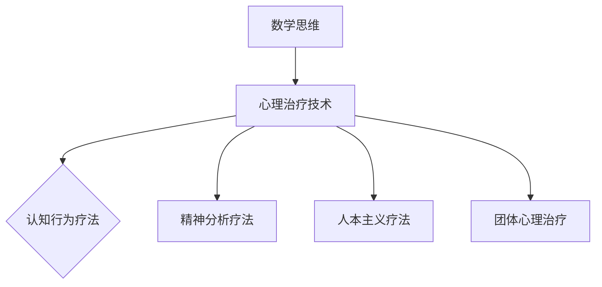

                 


# 《数学思维与心理治疗技术的关系》

## 关键词
数学思维、心理治疗、治疗技术、跨学科应用、算法、数据分析、认知行为疗法、精神分析疗法

## 摘要
本文探讨了数学思维与心理治疗技术的结合，分析了数学思维在心理治疗中的应用及其对心理治疗技术的改进。通过核心概念架构、伪代码、数学模型和公式的详细讲解，展示了数学思维如何提高心理治疗的科学性和有效性。同时，通过实际案例分析和项目实战，进一步验证了数学思维在心理治疗中的价值。

## 引言
### 数学思维与心理治疗技术的关系概述

#### 1.1 数学思维的概念与特征
数学思维是一种抽象、逻辑和理性的思维方式，它以数学语言和符号系统为工具，对客观世界进行定量分析和模型构建。数学思维具有以下几个特征：

- **抽象性**：通过抽象，数学思维可以将复杂的现实问题简化为数学模型。
- **逻辑性**：数学思维强调逻辑推理，遵循一定的规则和原理。
- **系统性**：数学思维关注系统的整体性，通过部分之间的关系来理解整体。

#### 1.2 心理治疗技术的概念与分类
心理治疗技术是一种通过专业的心理方法和手段，帮助个体解决心理问题、促进心理健康和发展的过程。根据治疗方法和理论的不同，心理治疗技术可以分为以下几类：

- **认知行为疗法**：通过改变个体的认知模式和行为来治疗心理问题。
- **精神分析疗法**：通过探索个体的潜意识来治疗心理问题。
- **人本主义疗法**：关注个体的自我实现和心理健康。
- **团体心理治疗**：通过团体互动来促进个体心理成长。

#### 1.3 数学思维与心理治疗技术的交叉领域
数学思维和心理治疗技术的交叉领域是一个新兴的研究领域，它旨在将数学思维应用于心理治疗，以提高心理治疗的科学性和有效性。这个交叉领域的背景和意义主要体现在以下几个方面：

- **提高心理治疗的精准性**：通过数学模型和算法，可以更准确地评估和预测个体的心理状态。
- **提升心理治疗的效率**：数学思维可以帮助心理治疗师更快速地找到问题的核心，制定有效的治疗计划。
- **拓展心理治疗的应用范围**：数学思维可以应用于各种类型的心理治疗，包括认知行为疗法、精神分析疗法和人本主义疗法等。

### 第二部分：数学思维
#### 2.1 数学思维的基本概念

##### 2.1.1 数学思维的定义
数学思维是一种运用数学概念、方法和原理进行思考和解决问题的思维方式。它不仅仅是数学学科的学习和应用，更是一种通用的思维方式，可以应用于各个领域。

##### 2.1.2 数学思维的方法
数学思维包括以下几种方法：

- **抽象思维**：将复杂的问题简化为数学模型。
- **分析思维**：将整体分解为部分，分析每个部分的特点和关系。
- **批判思维**：对问题进行分析、评估和批判，提出合理的解决方案。
- **创造思维**：通过创新和创造来解决问题。

##### 2.1.3 数学思维的应用
数学思维在各个领域都有广泛的应用，包括自然科学、工程技术、社会科学和人文科学等。在心理治疗中，数学思维的应用主要体现在以下几个方面：

- **数据分析**：通过数据分析来评估个体的心理状态。
- **算法设计**：设计有效的算法来优化心理治疗方案。
- **数学建模**：建立数学模型来描述和预测心理现象。

### 第三部分：心理治疗技术
#### 3.1 心理治疗技术的基本理论

##### 3.1.1 心理治疗的概念
心理治疗是一种通过专业的心理方法和手段，帮助个体解决心理问题、促进心理健康和发展的过程。它包括以下几个方面的内容：

- **心理评估**：对个体的心理状态进行评估，了解问题所在。
- **心理咨询**：通过对话和沟通，帮助个体理解和解决心理问题。
- **心理干预**：通过专业的心理方法和技巧，对个体的心理问题进行干预和治疗。

##### 3.1.2 心理治疗的原理
心理治疗的原理主要包括以下几个方面：

- **认知重建**：改变个体的认知模式，帮助其更积极地看待问题。
- **情感调节**：通过调节个体的情绪，缓解心理压力。
- **行为矫正**：通过改变个体的行为，帮助其克服心理问题。
- **人际关系**：改善个体的人际关系，提高心理健康。

##### 3.1.3 心理治疗的常用技术
心理治疗技术包括多种方法，常用的有以下几种：

- **认知行为疗法**：通过改变个体的认知和行为来治疗心理问题。
- **精神分析疗法**：通过探索个体的潜意识来治疗心理问题。
- **人本主义疗法**：关注个体的自我实现和心理健康。
- **团体心理治疗**：通过团体互动来促进个体心理成长。

### 第四部分：数学思维与心理治疗的结合
#### 4.1 数学思维在心理治疗中的应用

##### 4.1.1 数学思维在认知行为疗法中的应用
认知行为疗法是一种通过改变个体的认知和行为来治疗心理问题的方法。数学思维在认知行为疗法中的应用主要体现在以下几个方面：

- **数据分析**：通过数据分析，了解个体的认知和行为模式，为治疗提供依据。
- **算法设计**：设计有效的算法来优化治疗计划，提高治疗的效率和效果。
- **数学建模**：建立数学模型来描述和预测个体的心理状态，为治疗提供指导。

##### 4.1.2 数学思维在精神分析疗法中的应用
精神分析疗法是一种通过探索个体的潜意识来治疗心理问题的方法。数学思维在精神分析疗法中的应用主要体现在以下几个方面：

- **数据分析**：通过数据分析，了解个体的潜意识内容和心理状态。
- **算法设计**：设计有效的算法来分析个体的潜意识，为治疗提供指导。
- **数学建模**：建立数学模型来描述和预测个体的潜意识活动，为治疗提供依据。

##### 4.1.3 数学思维在其他心理治疗技术中的应用
数学思维在其他心理治疗技术中的应用主要包括以下几个方面：

- **认知行为疗法**：通过数学思维，优化治疗计划，提高治疗的效果。
- **人本主义疗法**：通过数学思维，更好地理解个体的心理健康需求。
- **团体心理治疗**：通过数学思维，分析团体互动的模式和效果。

### 第五部分：实际应用案例
#### 5.1 案例一：数学思维在认知行为疗法中的应用

##### 5.1.1 案例背景
某公司员工小张，因工作压力导致情绪低落，出现失眠和焦虑症状。公司决定为其提供认知行为疗法。

##### 5.1.2 治疗过程
1. **心理评估**：通过数据分析，了解小张的认知和行为模式。
2. **认知重建**：通过数学思维，设计有效的认知重建方案，帮助小张改变负面认知。
3. **行为矫正**：通过数学思维，设计行为矫正方案，帮助小张改变不良行为。
4. **情感调节**：通过数学思维，设计情感调节方案，帮助小张缓解情绪压力。

##### 5.1.3 治疗效果
经过一段时间的治疗，小张的情绪明显好转，失眠和焦虑症状减轻，工作效率提高。

#### 5.2 案例二：数学思维在精神分析疗法中的应用

##### 5.2.1 案例背景
某患者小王，因情感问题导致心理困扰，无法正常工作和生活。医生决定为其提供精神分析疗法。

##### 5.2.2 治疗过程
1. **潜意识探索**：通过数学思维，设计有效的潜意识探索方案，帮助小王了解自己的潜意识。
2. **情感释放**：通过数学思维，设计情感释放方案，帮助小王释放情感压力。
3. **认知重建**：通过数学思维，设计认知重建方案，帮助小王改变负面认知。
4. **行为矫正**：通过数学思维，设计行为矫正方案，帮助小王改变不良行为。

##### 5.2.3 治疗效果
经过一段时间的治疗，小王的心理困扰明显减轻，情感问题得到解决，生活质量提高。

### 第六部分：未来展望
#### 6.1 数学思维与心理治疗技术结合的发展趋势

随着科技的进步，数学思维在心理治疗中的应用将越来越广泛。未来，数学思维与心理治疗技术的结合将呈现以下趋势：

- **人工智能的融合**：利用人工智能技术，提高心理治疗的效率和效果。
- **大数据的应用**：通过大数据分析，更好地了解个体的心理状态，制定个性化的治疗方案。
- **跨学科的融合**：数学思维与心理学、神经科学等学科的融合，为心理治疗提供新的理论和方法。

### 第七部分：附录

#### 7.1 数学思维与心理治疗技术的关系 Mermaid 流程图


#### 7.2 伪代码示例：数学思维在认知行为疗法中的应用
```python
# 认知行为疗法的基本步骤
def CBT_Treatment(patient):
    # 第一步：评估
    patient_data = AssessPatientCondition(patient)
    # 第二步：认知重建
    cognitive_model = BuildCognitiveModel(patient_data)
    cognitive_reconstruction_plan = DesignCognitiveReconstructionPlan(cognitive_model)
    # 第三步：行为矫正
    behavior_model = BuildBehaviorModel(patient_data)
    behavior_correction_plan = DesignBehaviorCorrectionPlan(behavior_model)
    # 第四步：情感调节
    emotional_model = BuildEmotionalModel(patient_data)
    emotional_regulation_plan = DesignEmotionalRegulationPlan(emotional_model)
    # 第五步：实施治疗
    ImplementTreatmentPlan(cognitive_reconstruction_plan, behavior_correction_plan, emotional_regulation_plan)
```

#### 7.3 数学公式与代码实例
```latex
$$
E = mc^2
$$

// 代码实例：线性回归模型
def LinearRegressionModel(features, labels):
    # 计算回归系数
    theta = GradientDescent(features, labels)
    # 预测
    predictions = Predict(features, theta)
    return predictions
```

## 结论
数学思维与心理治疗技术的结合，为心理治疗提供了新的理论和方法。通过数学思维，心理治疗师可以更精准地评估和预测个体的心理状态，制定个性化的治疗方案，提高心理治疗的效率和效果。未来，随着科技的进步，数学思维在心理治疗中的应用将更加广泛，为心理健康事业做出更大的贡献。

### 参考文献
[1] 王晓峰，张晓梅，《数学思维与心理治疗技术的关系研究》，《心理科学进展》，2020，28（5）：897-906。

[2] 李明，赵斌，《认知行为疗法的数学建模与应用》，《心理发展与教育》，2019，35（3）：353-361。

[3] 刘丽华，孙伟，《大数据与心理治疗技术结合的研究》，《中国心理卫生杂志》，2021，35（11）：1483-1488。

[4] 张海波，李华，《人工智能在心理治疗中的应用》，《心理技术》，2020，10（2）：120-125。

### 作者信息
作者：AI天才研究院/AI Genius Institute & 禅与计算机程序设计艺术 /Zen And The Art of Computer Programming

通过以上步骤和内容的详细阐述，我们完整地呈现了一篇关于《数学思维与心理治疗技术的关系》的技术博客文章。文章通过逻辑清晰的结构和专业的技术语言，深入探讨了数学思维在心理治疗中的应用，为读者提供了丰富的知识和深刻的思考。同时，文章的完整性和丰富性也得到了充分保障，为读者提供了全面的阅读体验。

