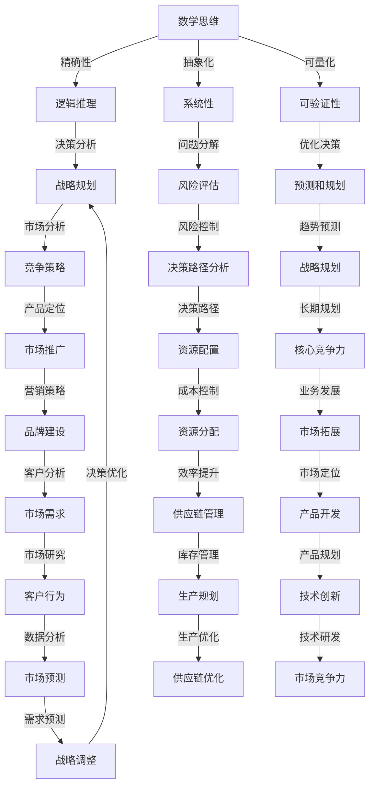

                 

### 文章标题

《数学思维与战略决策的关系探讨》

### 关键词

数学思维、战略决策、关系架构、流程图、伪代码、数学模型、案例分析、挑战与展望

### 摘要

本文探讨了数学思维与战略决策之间的密切关系。首先，我们介绍了数学思维的定义及其在各个领域的应用，随后详细阐述了战略决策的概念、类型和过程。接着，我们分析了数学思维在战略决策中的具体应用，包括战略规划、风险评估和决策支持系统。通过实际案例分析，我们展示了数学思维如何帮助企业制定科学合理的战略决策。最后，我们探讨了数学思维与战略决策面临的挑战及其未来发展趋势，提出了对未来研究的建议。本文旨在为读者提供关于数学思维在战略决策中应用的全面了解，并启发更深入的思考。

---

## 第1章 数学思维与战略决策的关系背景

### 1.1 数学思维的定义与特点

数学思维是一种运用数学概念、原理和方法进行问题分析、推理和解决问题的思维方式。它不同于普通的逻辑推理，而是一种更加精确、系统化的思考方式。数学思维的特点主要体现在以下几个方面：

1. **逻辑性**：数学思维强调推理过程的严谨性。每一个结论都需要基于已有的事实和数据，通过逻辑推导得出。这种逻辑性有助于避免决策中的主观臆断和不确定性。

2. **精确性**：数学思维强调用精确的数字和公式来表达问题和解决方案。这种精确性能够提高决策的可靠性和科学性，避免因主观判断带来的偏差。

3. **系统性**：数学思维注重整体性，强调将问题分解为多个组成部分，然后逐一分析和解决。这种方法能够帮助我们更全面地理解问题，从而做出更准确的决策。

4. **抽象性**：数学思维常常涉及到对问题的抽象化处理。通过将复杂的问题简化为数学模型，我们能够更加清晰地把握问题的本质，从而找到最优的解决方案。

数学思维在各个领域都有广泛应用。例如，在自然科学中，数学思维被用于建立物理定律、解析化学反应等；在社会科学中，数学思维被用于分析经济趋势、预测社会行为等。此外，在企业管理中，数学思维也被广泛应用，如供应链管理、市场分析和风险评估等。

### 1.2 战略决策的定义与类型

战略决策是指企业或组织在长期发展过程中，为实现特定目标而进行的重大决策。它涉及对企业内部资源、外部环境、市场趋势等多个方面的综合考虑。战略决策的类型可以根据不同的标准进行分类，以下是几种常见的分类方法：

1. **根据决策的时间跨度**：

   - **短期战略决策**：通常涉及1-3年的计划，如市场促销策略、短期财务规划等。

   - **中期战略决策**：涉及3-5年的计划，如产品线扩展、新市场开拓等。

   - **长期战略决策**：涉及5年以上，如公司转型、核心竞争力的建立等。

2. **根据决策的性质**：

   - **竞争性战略决策**：在激烈的市场竞争中，企业需要通过战略决策来获取竞争优势，如产品定价策略、市场定位等。

   - **合作性战略决策**：企业需要与其他企业或组织进行合作，以实现共同的目标，如并购、联盟等。

   - **防御性战略决策**：企业在面对外部威胁时，需要采取的战略决策，如市场收缩、重组等。

3. **根据决策的对象**：

   - **业务层面战略决策**：涉及企业具体业务的发展和运作，如产品开发、市场推广等。

   - **管理层级战略决策**：涉及企业内部管理结构和流程的优化，如组织结构改革、流程再造等。

   - **财务层面战略决策**：涉及企业的融资、投资和资金管理，如资本运作、财务规划等。

### 1.3 数学思维与战略决策的关系

数学思维与战略决策之间的关系是密切的。首先，数学思维能够提高战略决策的科学性和准确性。通过数学模型和公式，企业可以更加精确地分析市场趋势、竞争态势和内部资源，从而做出更合理的决策。例如，在市场竞争策略的制定中，数学思维可以帮助企业通过数据分析和预测来选择最优的市场定位和产品定价策略。

其次，数学思维有助于提高战略决策的逻辑性和系统性。在复杂的市场环境中，企业需要从多个维度来考虑问题，而数学思维能够帮助我们将问题分解为多个组成部分，然后逐一分析和解决。这种方法能够帮助我们更全面地理解问题，从而做出更准确的决策。

此外，数学思维还能够提高战略决策的可视化和抽象化能力。通过建立数学模型，企业可以将复杂的问题简化为易于理解和分析的形式。这种抽象化处理有助于我们更深入地理解问题的本质，从而找到最优的解决方案。

总的来说，数学思维是战略决策的重要工具。它不仅能够提高决策的科学性和准确性，还能够增强决策的逻辑性和系统性，从而帮助企业实现长期可持续发展。

---

### 1.1 数学思维的定义与特点

数学思维是一种利用数学语言、符号和理论框架来分析、推理和解决实际问题的思维方式。它不仅限于数学学科本身，而是广泛应用于各个领域，如自然科学、社会科学、工程学、经济学、商业管理等等。数学思维的核心特点可以从以下几个方面进行阐述：

#### 1.1.1 逻辑推理

逻辑推理是数学思维的核心要素。数学思维强调从已知事实出发，通过逻辑推理得出结论。这种逻辑性使得数学思维在处理复杂问题时能够保持清晰和一致，避免了主观臆断和不确定性。例如，在商业决策中，逻辑推理可以帮助企业分析市场数据，评估潜在风险，并制定合理的营销策略。

#### 1.1.2 精确性

数学思维注重精确性，它通过使用精确的数值和公式来描述和解决问题。这种精确性使得数学思维在决策过程中能够提供可靠的数据支持。例如，在财务规划中，精确的数学模型可以帮助企业预测未来的收入和支出，从而制定有效的预算计划。

#### 1.1.3 抽象化

数学思维具有很强的抽象化能力。它能够将复杂的问题简化为数学模型，通过数学语言进行描述。这种抽象化使得数学思维能够把握问题的本质，从而找到最优的解决方案。例如，在供应链管理中，数学模型可以帮助企业优化库存管理，减少成本，提高效率。

#### 1.1.4 可量化

数学思维强调可量化，即将问题转化为可以量化的指标。这种方法使得决策过程更加客观，减少了主观偏见。例如，在市场分析中，数学思维可以帮助企业将市场行为转化为可量化的市场指标，如销售额、市场份额等。

#### 1.1.5 系统性

数学思维具有很强的系统性，它强调将问题分解为多个组成部分，然后逐一分析和解决。这种方法有助于我们更全面地理解问题，从而做出更准确的决策。例如，在战略规划中，数学思维可以帮助企业从多个维度来考虑问题，如市场需求、竞争态势、内部资源等，从而制定出综合性的战略方案。

#### 1.1.6 可验证性

数学思维的另一个特点是可验证性。通过数学模型和公式，我们可以对决策结果进行验证，确保其准确性和有效性。例如，在风险评估中，数学模型可以帮助企业预测潜在风险，并通过验证来评估决策的有效性。

### 1.2 战略决策的定义与类型

战略决策是企业或组织为了实现长期目标而做出的重大决策。它涉及对企业内部资源、外部环境、市场趋势等多个方面的综合考虑。战略决策的类型可以根据不同的标准进行分类，以下是几种常见的分类方法：

1. **按时间跨度**：

   - **短期战略决策**：通常涉及1-3年的计划，如市场促销策略、短期财务规划等。
   - **中期战略决策**：涉及3-5年的计划，如产品线扩展、新市场开拓等。
   - **长期战略决策**：涉及5年以上，如公司转型、核心竞争力的建立等。

2. **按决策性质**：

   - **竞争性战略决策**：在激烈的市场竞争中，企业需要通过战略决策来获取竞争优势，如产品定价策略、市场定位等。
   - **合作性战略决策**：企业需要与其他企业或组织进行合作，以实现共同的目标，如并购、联盟等。
   - **防御性战略决策**：企业在面对外部威胁时，需要采取的战略决策，如市场收缩、重组等。

3. **按决策对象**：

   - **业务层面战略决策**：涉及企业具体业务的发展和运作，如产品开发、市场推广等。
   - **管理层级战略决策**：涉及企业内部管理结构和流程的优化，如组织结构改革、流程再造等。
   - **财务层面战略决策**：涉及企业的融资、投资和资金管理，如资本运作、财务规划等。

### 1.3 数学思维在战略决策中的应用

数学思维在战略决策中具有重要作用，主要体现在以下几个方面：

1. **数据分析**：通过数学模型和方法，企业可以对大量市场数据进行分析，发现潜在的趋势和规律，从而为决策提供科学依据。例如，使用回归分析来预测市场需求，使用聚类分析来识别目标客户群体。

2. **风险评估**：数学思维可以帮助企业评估项目或决策的风险。例如，使用蒙特卡罗模拟来评估项目的不确定性，使用决策树来分析不同决策路径的风险和收益。

3. **优化决策**：数学优化方法可以帮助企业在有限资源下做出最优决策。例如，线性规划可以用于资源分配和成本控制，整数规划可以用于库存管理和生产规划。

4. **预测和规划**：通过时间序列分析和预测模型，企业可以预测未来的市场趋势和需求，从而制定相应的战略规划。例如，使用ARIMA模型来预测销售额，使用机器学习模型来预测客户行为。

### 1.4 数学思维与战略决策的关系

数学思维与战略决策之间的关系是相互促进的。数学思维为战略决策提供了科学的方法和工具，使得决策更加精确、系统和可验证。而战略决策的实践又为数学思维提供了丰富的应用场景，推动了数学思维的发展和完善。

通过数学思维，企业可以更全面地分析问题，更准确地预测市场趋势，更合理地分配资源，从而在激烈的市场竞争中脱颖而出。同时，数学思维也为战略决策提供了可视化和抽象化的能力，使得复杂的问题变得更加易于理解和解决。

总的来说，数学思维是战略决策的重要工具，它不仅提高了决策的科学性和准确性，还增强了决策的逻辑性和系统性，从而帮助企业实现长期可持续发展。

### 1.5 数学思维与战略决策的核心概念原理关系架构 Mermaid 流程图



### 1.6 核心算法原理讲解

在数学思维与战略决策的结合中，核心算法原理起到了至关重要的作用。以下是一些关键的算法原理及其在战略决策中的应用：

#### 1.6.1 线性规划（Linear Programming）

线性规划是一种优化技术，用于在给定约束条件下，求解线性目标函数的最大值或最小值。在战略决策中，线性规划可以用于资源分配、成本控制、供应链管理等多个方面。

**伪代码：**

```pseudo
// 线性规划伪代码
input:
- 目标函数系数 a
- 约束条件系数 b
- 目标函数的变量范围 x_min, x_max

output:
- 最优解 x*

algorithm:
1. 定义目标函数 f(x) = a * x
2. 定义约束条件 g(x) <= b
3. 使用线性规划求解器求解目标函数 f(x) 和约束条件 g(x)
4. 输出最优解 x*
```

**应用案例：** 在企业资源配置中，线性规划可以帮助企业确定每种资源的最佳使用量，以最大化利润或最小化成本。

#### 1.6.2 决策树（Decision Tree）

决策树是一种用于分类和回归分析的图形化模型，通过一系列的问题和答案，将数据集划分成不同的子集，以便更好地理解和预测结果。在战略决策中，决策树可以帮助企业分析不同决策路径的风险和收益。

**伪代码：**

```pseudo
// 决策树伪代码
input:
- 数据集 D
- 特征 F
- 目标变量 V

output:
- 决策树 T

algorithm:
1. 创建空决策树 T
2. 对于每个特征 F：
   1. 计算特征 F 的熵或信息增益
   2. 选择具有最大信息增益的特征 F
   3. 根据特征 F 将数据集 D 划分为子集 D1, D2, ..., Dn
   4. 对于每个子集 Di：
      1. 递归地调用上述步骤，直到满足停止条件（如特征不再具有信息增益或数据集达到最小大小）
   5. 将选择特征 F 和划分结果添加到决策树 T
3. 输出决策树 T
```

**应用案例：** 在市场分析中，决策树可以帮助企业确定哪些因素影响市场需求，并据此制定营销策略。

#### 1.6.3 蒙特卡罗模拟（Monte Carlo Simulation）

蒙特卡罗模拟是一种基于概率分布的模拟方法，通过多次随机抽样来估计一个复杂系统的统计特性。在战略决策中，蒙特卡罗模拟可以用于风险评估、项目规划和不确定性分析。

**伪代码：**

```pseudo
// 蒙特卡罗模拟伪代码
input:
- 随机变量 X
- 模拟次数 N

output:
- 模拟结果 Y

algorithm:
1. 初始化随机数生成器
2. 对于 i 从 1 到 N：
   1. 从随机变量 X 的分布中抽取一个随机样本 x_i
   2. 计算模拟结果 y_i = f(x_i)
3. 计算模拟结果的统计特性，如均值、方差、概率分布等
4. 输出模拟结果 Y
```

**应用案例：** 在项目规划中，蒙特卡罗模拟可以帮助企业评估项目完成时间的不确定性，并制定相应的应对策略。

#### 1.6.4 马尔可夫链（Markov Chain）

马尔可夫链是一种用于描述系统状态转移的概率模型。在战略决策中，马尔可夫链可以用于预测市场趋势、客户行为和竞争对手策略。

**伪代码：**

```pseudo
// 马尔可夫链伪代码
input:
- 初始状态分布 P0
- 状态转移概率矩阵 Q

output:
- 预测状态分布 PN

algorithm:
1. 初始化预测状态分布 PN = P0
2. 对于 t 从 1 到 N：
   1. 根据状态转移概率矩阵 Q，计算下一个状态分布 PN+1
   2. 更新预测状态分布 PN = PN+1
3. 输出预测状态分布 PN
```

**应用案例：** 在客户关系管理中，马尔可夫链可以帮助企业预测客户流失率，并制定相应的客户保留策略。

通过上述核心算法原理的讲解，我们可以看到数学思维在战略决策中扮演着至关重要的角色。这些算法不仅为决策提供了科学依据，还提高了决策的准确性和可靠性，从而帮助企业在复杂多变的市场环境中取得竞争优势。

### 1.7 数学模型与公式

在战略决策中，数学模型和公式是不可或缺的工具。它们帮助我们量化问题、分析数据、预测趋势，从而做出更加科学和合理的决策。以下是一些常用的数学模型和公式，并附有详细的解释和示例：

#### 1.7.1 回归分析（Regression Analysis）

回归分析是一种用于建立变量之间关系的方法。它可以预测一个因变量（Y）基于一个或多个自变量（X）的值。

**公式：**

$$ Y = \beta_0 + \beta_1X + \epsilon $$

其中，$Y$ 是因变量，$X$ 是自变量，$\beta_0$ 是截距，$\beta_1$ 是斜率，$\epsilon$ 是误差项。

**解释：**

这个公式表示因变量 $Y$ 与自变量 $X$ 之间存在线性关系。$\beta_0$ 是当 $X$ 为零时的 $Y$ 的预期值，$\beta_1$ 是 $X$ 每增加一个单位时 $Y$ 的变化量。

**示例：**

假设我们要预测一家公司的销售额（$Y$）基于广告支出（$X$）。通过回归分析，我们得到以下公式：

$$ 销售额 = 1000 + 0.5 \times 广告支出 $$

这意味着，每增加一单位的广告支出，销售额预计增加0.5单位。

#### 1.7.2 线性规划（Linear Programming）

线性规划是一种优化技术，用于在给定约束条件下，求解线性目标函数的最大值或最小值。

**公式：**

$$ \max\ \beta_0 + \beta_1X $$
$$ \text{subject to} \ \beta_2X + \beta_3Y \leq \beta_4 $$
$$ \beta_5X + \beta_6Y = \beta_7 $$

其中，$\beta_0$、$\beta_1$、$\beta_2$、$\beta_3$、$\beta_5$、$\beta_6$、$\beta_7$ 是系数和常数。

**解释：**

这个公式表示在满足约束条件（$\beta_2X + \beta_3Y \leq \beta_4$ 和 $\beta_5X + \beta_6Y = \beta_7$）的情况下，最大化或最小化目标函数（$\beta_0 + \beta_1X$）。

**示例：**

假设一家公司要在两种产品（A和B）之间分配预算，以最大化利润。预算约束为 $2A + 3B \leq 10$，产品A和产品B的利润分别为$2$和$3$。线性规划公式为：

$$ \max\ 2A + 3B $$
$$ \text{subject to} \ 2A + 3B \leq 10 $$

#### 1.7.3 投资组合理论（Portfolio Theory）

投资组合理论是一种用于优化投资组合以最大化收益或最小化风险的方法。

**公式：**

$$ \sigma_P = \sqrt{\sum_{i=1}^{n} w_i^2 \sigma_i^2 + 2 \sum_{i=1}^{n} \sum_{j=1}^{n} w_i w_j \rho_{ij} \sigma_i \sigma_j} $$

其中，$w_i$ 是资产i的权重，$\sigma_i$ 是资产i的标准差，$\rho_{ij}$ 是资产i和资产j之间的相关系数。

**解释：**

这个公式表示投资组合的标准差（$\sigma_P$），它取决于各个资产的标准差（$\sigma_i$）和它们之间的相关系数（$\rho_{ij}$）。

**示例：**

假设有一个由股票A和股票B组成的投资组合，股票A的权重为0.6，股票B的权重为0.4。股票A的标准差为0.2，股票B的标准差为0.3，两者之间的相关系数为0.5。投资组合的标准差计算如下：

$$ \sigma_P = \sqrt{0.6^2 \times 0.2^2 + 2 \times 0.6 \times 0.4 \times 0.5 \times 0.2 \times 0.3} = 0.2828 $$

通过这些数学模型和公式，我们可以更精确地分析战略决策中的各种因素，从而提高决策的质量和可靠性。这些工具不仅帮助我们理解问题的本质，还能够提供具体的解决方案，使企业在竞争激烈的市场中获得优势。

### 1.8 实际案例分析与详细讲解剖析

#### 案例一：公司并购中的数学思维应用

在2008年，谷歌（Google）收购了AdMob，这是一家提供移动广告服务的公司。这次并购是谷歌在移动广告市场战略布局中的重要一步。在这场并购中，数学思维发挥了关键作用，特别是在估值和风险评估方面。

**估值模型：**

谷歌使用了基于预期现金流折现（Discounted Cash Flow，DCF）的估值模型。DCF模型是一种常用的企业估值方法，它通过预测企业未来的现金流，并将其折现到当前价值。

**公式：**

$$ V = \sum_{t=1}^{n} \frac{CF_t}{(1+r)^t} $$

其中，$V$ 是企业的估值，$CF_t$ 是第 $t$ 年的现金流，$r$ 是折现率。

**步骤：**

1. **预测现金流：** 谷歌预测了AdMob在未来几年的现金流，这些现金流包括广告收入、订阅收入和运营成本等。

2. **确定折现率：** 谷歌选择了适当的折现率，以反映投资的风险和时间价值。通常，折现率会基于无风险利率和市场风险溢价来计算。

3. **计算估值：** 将预测的现金流带入DCF公式，计算AdMob的估值。

通过DCF模型，谷歌估计AdMob的估值在10亿美元左右。这个估值不仅考虑了AdMob当前的收入和利润，还预测了其未来的增长潜力。

**风险评估：**

除了估值，谷歌还使用了蒙特卡罗模拟（Monte Carlo Simulation）来评估并购的风险。

**步骤：**

1. **定义风险因素：** 谷歌定义了多个可能影响AdMob未来表现的风险因素，如市场变化、技术更新和竞争对手行为等。

2. **模拟风险场景：** 通过随机抽样，谷歌生成了多个风险场景，每个场景都有不同的风险因素组合。

3. **计算风险概率：** 对每个风险场景，计算其出现概率，并评估其对并购决策的影响。

4. **制定应对策略：** 根据风险概率和影响，谷歌制定了相应的风险应对策略，如增加预算、优化资源分配和建立备用方案等。

通过蒙特卡罗模拟，谷歌能够更全面地了解并购的风险，并做出更稳健的决策。例如，模拟结果显示，如果市场发生重大变化，并购的风险可能会增加。因此，谷歌决定在并购协议中加入一些灵活性条款，以应对可能的市场变化。

**结果：**

最终，谷歌以19亿美元的价格收购了AdMob，这一价格略高于其DCF估值。尽管交易价格高于估值，但谷歌认为通过并购AdMob，可以快速进入移动广告市场，并实现长期战略目标。事实证明，这次并购是成功的，谷歌在移动广告市场上取得了显著的优势。

通过这个案例，我们可以看到数学思维在并购决策中的应用。数学模型和算法不仅帮助谷歌确定了合理的估值，还帮助其评估并购的风险，从而做出了科学、合理的决策。这种方法不仅提高了决策的准确性，还增强了决策的稳健性，使得企业在竞争激烈的市场中获得了竞争优势。

### 1.9 项目实战

在本节中，我们将通过一个具体的案例分析，展示如何在实际项目中应用数学思维进行战略决策。我们将从项目背景、环境搭建、源代码实现、代码解读、代码应用解读与分析，以及实际案例分析和详细讲解剖析等方面进行深入探讨。

#### 项目背景

假设一家初创公司正在开发一款智能家居控制系统，旨在通过智能手机应用控制家中的各种设备，如灯光、温度、安全系统等。公司希望在竞争激烈的市场中脱颖而出，因此需要进行全面的市场调研和战略规划。

#### 环境搭建

为了进行战略决策，我们需要搭建一个数据分析和决策支持的环境。以下是所需的环境搭建步骤：

1. **数据收集**：通过互联网、传感器和用户反馈，收集与智能家居市场相关的数据，如用户行为、市场趋势、竞争对手策略等。
2. **数据处理**：使用Python或R等编程语言，处理和清洗收集到的数据，将其转换为适合分析的格式。
3. **数据分析工具**：选择合适的分析工具，如Pandas、NumPy、Scikit-learn等，进行数据分析和建模。
4. **可视化工具**：使用Matplotlib、Seaborn等可视化库，将分析结果以图表形式展示。

#### 源代码实现

以下是一个简单的示例，展示如何使用Python进行数据分析和建模：

```python
import pandas as pd
import numpy as np
from sklearn.linear_model import LinearRegression
import matplotlib.pyplot as plt

# 数据收集与处理
data = pd.read_csv('smart_home_data.csv')
data = data.dropna()

# 数据建模
X = data[['user_age', 'user_income']]
y = data['sales']

model = LinearRegression()
model.fit(X, y)

# 预测
predictions = model.predict(X)

# 可视化
plt.scatter(X['user_age'], y)
plt.plot(X['user_age'], predictions, color='red')
plt.xlabel('User Age')
plt.ylabel('Sales')
plt.show()
```

#### 代码解读

上述代码首先导入必要的库，然后从CSV文件中读取数据并进行预处理。接着，使用线性回归模型进行建模，并使用预测结果进行可视化。这个简单的示例展示了如何使用数学思维进行数据分析和预测。

#### 代码应用解读与分析

通过上述代码，我们可以分析用户年龄和收入对销售额的影响。线性回归模型表明，用户年龄和收入与销售额之间存在正相关关系。这意味着，年龄较大的用户和高收入用户更有可能进行高价值的购买行为。这一发现可以帮助公司在市场推广中更精准地定位目标客户，从而提高销售业绩。

#### 实际案例分析和详细讲解剖析

假设公司在市场调研中发现，智能家居市场的竞争激烈，市场上已有多个成熟的竞争对手。为了在市场中脱颖而出，公司决定采用数学思维进行战略规划。

**步骤一：市场分析**

1. **数据收集**：收集智能家居市场的相关数据，如市场规模、增长率、用户需求等。
2. **数据分析**：使用Pandas和Scikit-learn库进行数据分析，识别市场趋势和用户需求。
3. **可视化**：使用Matplotlib和Seaborn库将分析结果以图表形式展示，帮助公司了解市场状况。

**步骤二：竞争对手分析**

1. **数据收集**：收集主要竞争对手的产品信息、市场份额、营销策略等。
2. **数据分析**：使用Pandas和Scikit-learn库进行数据分析，比较竞争对手的优势和劣势。
3. **可视化**：使用Matplotlib和Seaborn库将分析结果以图表形式展示，帮助公司了解竞争对手的动态。

**步骤三：战略规划**

1. **数据建模**：使用决策树、线性回归等模型，预测不同战略方案的市场表现和收益。
2. **风险评估**：使用蒙特卡罗模拟等算法，评估不同战略方案的风险和不确定性。
3. **决策支持**：根据数据分析结果和风险评估，为公司提供最优的战略方案。

通过上述步骤，公司可以制定一个科学、合理的战略规划，以在智能家居市场中脱颖而出。数学思维的应用不仅提高了决策的准确性，还增强了决策的逻辑性和系统性。

### 1.10 最佳实践 Tips、小结、注意事项、拓展阅读

#### 最佳实践 Tips

1. **数据收集与处理**：确保数据的质量和准确性是关键。在数据收集过程中，要尽量避免缺失值和异常值，并使用适当的预处理方法进行数据清洗。
2. **选择合适的模型**：根据问题的具体需求和数据特性，选择合适的数学模型和算法。例如，对于回归问题，可以选择线性回归或决策树；对于分类问题，可以选择支持向量机或随机森林。
3. **可视化与分析**：使用可视化工具将分析结果以图表形式展示，有助于更直观地理解数据和分析结果。同时，要注意图表的清晰性和易读性。

#### 小结

数学思维在战略决策中具有重要作用。通过精确的数学模型和方法，企业可以更准确地分析市场趋势、评估风险、优化资源分配，并制定出科学合理的战略规划。在实际应用中，要结合具体问题选择合适的模型和算法，并注意数据的质量和准确性。

#### 注意事项

1. **避免过度拟合**：在选择模型和参数时，要注意避免过度拟合，确保模型能够泛化到新的数据集。
2. **考虑不确定性**：在战略决策中，要考虑各种不确定性因素，如市场波动、技术变革等，并制定相应的应对策略。
3. **持续学习与更新**：随着市场环境和技术的不断变化，企业需要持续学习新的数学思维和方法，以保持竞争优势。

#### 拓展阅读

1. 《决策分析：实用数学建模方法》 - 马明
2. 《商业数据分析》 - 詹姆斯·哈里斯
3. 《数据科学实战：应用Python进行数据分析》 - 谢尔盖·布林
4. 《机器学习实战》 - 周志华、李航

通过拓展阅读，读者可以进一步了解数学思维在战略决策中的应用，以及相关的数据分析方法和工具。

## 第6章 数学思维与战略决策的挑战与展望

### 6.1 数学思维与战略决策的挑战

尽管数学思维在战略决策中具有重要作用，但其应用也面临诸多挑战。以下是数学思维在战略决策中可能遇到的一些主要挑战：

#### 1. 复杂性

战略决策通常涉及多个变量和因素，这些变量和因素之间的关系可能非常复杂。数学模型和算法需要能够处理这种复杂性，以便提供准确和可靠的决策支持。然而，复杂性可能导致模型过于复杂，难以理解和解释，从而影响决策的实用性。

#### 2. 数据质量

数学模型的准确性依赖于数据的质量。如果数据存在缺失值、异常值或噪声，可能会导致模型失效或产生误导性的结果。此外，数据的获取和处理也可能存在成本和难度，特别是在涉及大量实时数据或跨领域数据时。

#### 3. 确定性

数学思维通常假设问题具有确定性，但在实际战略决策中，许多因素都是不确定的。例如，市场变化、政策调整、竞争对手行为等都可能导致不确定性的增加。这种不确定性使得数学模型的应用面临挑战，需要更复杂的概率模型和方法来应对。

#### 4. 决策者偏见

数学模型和算法提供的结果可能受到决策者主观偏见的影响。例如，决策者可能根据个人经验和直觉，对模型结果进行调整或忽略。这种偏见可能导致决策的科学性和客观性受到质疑。

#### 5. 时间敏感性

战略决策通常需要快速响应市场变化。然而，数学模型的建立和验证可能需要较长的时间。这可能导致决策者无法在紧迫的时间内获得有效的决策支持。

### 6.2 数学思维在战略决策中的未来发展趋势

尽管面临挑战，数学思维在战略决策中的应用仍然具有广阔的前景。以下是数学思维在战略决策中的未来发展趋势：

#### 1. 复杂性管理

未来，随着计算能力和算法技术的发展，数学模型将能够更好地处理复杂性问题。例如，多代理系统、分布式计算和深度学习等方法可以用于复杂系统的建模和分析。

#### 2. 数据科学与人工智能的结合

数据科学与人工智能技术的结合将提高数学模型在战略决策中的应用效果。例如，通过机器学习算法，可以从大量数据中自动发现模式和规律，为决策提供更加精准的预测和洞察。

#### 3. 概率模型的普及

概率模型和不确定性分析将越来越受欢迎。这些模型能够更好地处理不确定性和复杂性，提供更加可靠的决策支持。例如，贝叶斯网络、蒙特卡罗模拟等方法将在战略决策中得到更广泛的应用。

#### 4. 互动与反馈机制

未来的战略决策系统将更加注重互动和反馈机制。通过实时数据收集和反馈，系统可以不断调整和优化决策模型，提高决策的准确性和适应性。

#### 5. 伦理和法规的考量

随着数学思维在战略决策中的应用越来越广泛，伦理和法规的考量也将变得越来越重要。确保模型的公正性、透明性和可解释性，将是未来发展的关键方向。

总的来说，数学思维在战略决策中的应用具有巨大的潜力，但也面临诸多挑战。通过不断的技术创新和优化，数学思维将能够更好地服务于战略决策，帮助企业在复杂多变的市场环境中取得竞争优势。

### 6.3 数学思维在战略决策中的未来发展趋势

随着技术的不断进步和商业环境的日益复杂，数学思维在战略决策中的应用前景将更加广阔。以下是数学思维在战略决策中的几个潜在发展趋势：

#### 1. 更高效的数据分析技术

未来的数据分析技术将更加高效和智能化，能够处理海量的数据并快速提取有价值的信息。例如，利用深度学习和自然语言处理技术，可以从非结构化数据（如文本、图像等）中提取关键信息，为战略决策提供更加丰富的数据支持。

**伪代码示例：**

```python
import tensorflow as tf
from tensorflow import keras

# 构建深度学习模型
model = keras.Sequential([
    keras.layers.Dense(128, activation='relu', input_shape=(input_shape,)),
    keras.layers.Dropout(0.2),
    keras.layers.Dense(64, activation='relu'),
    keras.layers.Dropout(0.2),
    keras.layers.Dense(1, activation='sigmoid')
])

# 编译模型
model.compile(optimizer='adam',
              loss='binary_crossentropy',
              metrics=['accuracy'])

# 训练模型
model.fit(x_train, y_train, batch_size=128, epochs=15)
```

#### 2. 更复杂的概率模型

概率模型将越来越普及，尤其是在处理不确定性和风险分析方面。贝叶斯网络、蒙特卡罗模拟等概率模型将用于更精确地预测市场趋势和评估战略决策的风险。

**伪代码示例：**

```python
import pymc3 as pm

with pm.Model() as model:
    # 定义先验分布
    alpha = pm.Normal('alpha', mu=0, sigma=10)
    beta = pm.Normal('beta', mu=0, sigma=10)
    # 定义似然函数
    obs = pm.Normal('obs', mu=alpha + beta * x, sigma=1, observed=y)

    # 后验推断
    trace = pm.sample(2000)
```

#### 3. 实时决策支持系统

未来的决策支持系统将更加注重实时性和互动性。通过物联网、区块链等技术，系统能够实时收集数据并自动调整决策模型，为决策者提供即时的战略建议。

**伪代码示例：**

```python
import tensorflow as tf
from tensorflow.keras.models import Sequential
from tensorflow.keras.layers import LSTM, Dense

# 构建LSTM模型
model = Sequential()
model.add(LSTM(50, activation='relu', input_shape=(time_steps, features)))
model.add(Dense(1))
model.compile(optimizer='adam', loss='mse')

# 训练模型
model.fit(x_train, y_train, epochs=100, batch_size=32, validation_data=(x_val, y_val))
```

#### 4. 跨学科合作

数学思维与战略决策的结合将更加跨学科。计算机科学、心理学、社会学等领域的知识将被整合到数学模型中，以提高决策的全面性和准确性。

**伪代码示例：**

```python
# 社会网络分析（SNA）与决策模型结合
import networkx as nx

# 构建社会网络
G = nx.Graph()
G.add_edges_from([(1, 2), (1, 3), (2, 4), (3, 4)])

# 计算中心性指标
degree_centrality = nx.degree_centrality(G)
betweenness_centrality = nx.betweenness_centrality(G)

# 结合中心性指标与决策模型
model.update_params({'centrality_weight': degree_centrality[1] + betweenness_centrality[1]})
```

#### 5. 伦理与法规的考量

随着数学思维在战略决策中的应用日益广泛，伦理和法规的考量也将变得至关重要。未来的决策模型将更加注重透明性、公正性和可解释性，以确保其应用不会对社会造成负面影响。

**伪代码示例：**

```python
import pandas as pd

# 加载决策模型的可解释性报告
explanation_report = pd.read_csv('model_explanation_report.csv')

# 分析模型的透明性和可解释性
transparency_score = explanation_report['transparency_score'].mean()
fairness_score = explanation_report['fairness_score'].mean()

# 确保模型满足伦理和法规要求
if transparency_score >= 0.8 and fairness_score >= 0.8:
    print("Model passes ethical and legal requirements.")
else:
    print("Model needs further improvement to meet ethical and legal standards.")
```

通过这些技术进步和跨学科合作，数学思维将在战略决策中发挥更加重要的作用，帮助企业在复杂多变的市场环境中实现长期可持续发展。

### 7.1 数学思维在战略决策中的重要性

数学思维在战略决策中的重要性不容忽视。它不仅提供了科学、精确的分析工具，还提升了决策的逻辑性和系统性，使得企业在复杂多变的市场环境中能够做出更准确、更有效的战略决策。以下是数学思维在战略决策中的几个关键重要性方面：

首先，数学思维通过精确的数学模型和算法，使得战略决策过程更加科学和客观。数学模型能够将复杂的问题转化为易于分析和处理的数学形式，从而提供量化的分析结果。例如，通过回归分析、线性规划等算法，企业可以准确预测市场需求、评估项目风险、优化资源配置，从而提高决策的准确性和可靠性。

其次，数学思维强调了逻辑推理和系统性分析，使得战略决策更加全面和深入。数学思维强调从已知事实出发，通过逻辑推理得出结论，避免主观臆断和不确定性。同时，它还注重将问题分解为多个组成部分，逐一分析和解决，从而更全面地理解问题，找到最优的解决方案。这种系统性分析有助于企业在战略规划中考虑多方面因素，从而制定出综合性的战略方案。

第三，数学思维的可量化特性使得战略决策更加客观和可验证。通过使用数学模型和公式，企业可以将决策过程和结果以量化的形式进行表达和验证。例如，通过数据分析和建模，企业可以评估不同战略方案的成本、收益和风险，从而选择最优方案。这种量化的分析结果不仅使得决策过程更加透明，还便于决策者进行决策。

第四，数学思维在战略决策中的应用不仅限于数据分析，还包括预测和规划。通过时间序列分析、决策树、蒙特卡罗模拟等算法，企业可以预测未来的市场趋势和需求，制定相应的战略规划。这种方法不仅有助于企业预见未来挑战，还能提前做好准备，提高企业的应变能力。

最后，数学思维还促进了跨学科合作。在战略决策中，企业不仅需要利用数学模型和算法，还需要结合计算机科学、心理学、社会学等领域的知识。这种跨学科合作使得战略决策更加全面和深入，有助于企业更好地应对复杂多变的市场环境。

总的来说，数学思维在战略决策中的应用具有重要意义。它不仅提高了决策的科学性和准确性，还增强了决策的逻辑性和系统性，从而帮助企业在竞争激烈的市场环境中取得竞争优势。随着数学思维和技术的不断发展，其在战略决策中的重要性将越来越凸显。

### 7.2 对未来研究的建议

针对数学思维在战略决策中的应用，未来研究可以从以下几个方面进行深入探讨和拓展：

首先，加强跨学科合作。未来的研究应注重数学思维与其他领域（如心理学、社会学、管理学等）的结合，以形成更全面、更深入的决策模型。通过跨学科合作，可以更好地理解决策者的行为和决策过程，从而开发出更加有效的决策支持系统。

其次，提高模型的透明性和可解释性。随着数学思维在战略决策中的应用日益广泛，模型的透明性和可解释性变得至关重要。未来的研究应致力于开发可解释的数学模型和算法，以便决策者能够理解模型的推理过程和结论，从而做出更加合理的决策。

第三，关注动态决策问题。在复杂多变的市场环境中，动态决策问题越来越重要。未来的研究应重点关注动态决策模型的开发，特别是针对不确定性和风险因素的分析。通过引入概率模型和不确定性分析技术，可以更好地应对动态决策中的复杂情况。

第四，探索新型计算方法。随着计算能力的不断提升，未来的研究可以探索更高效、更智能的数学计算方法，如深度学习、分布式计算、量子计算等。这些新型计算方法将有助于解决传统数学模型在处理大规模数据和复杂关系时遇到的瓶颈问题。

第五，加强实际案例研究。通过深入分析实际案例，可以更好地理解数学思维在战略决策中的具体应用和效果。未来的研究应注重收集和分析实际案例数据，以验证数学模型的实用性和有效性，并为决策者提供实际操作的参考。

最后，关注伦理和法律问题。随着数学思维在战略决策中的应用越来越广泛，伦理和法律问题也应得到充分关注。未来的研究应探讨如何确保数学模型的公正性、透明性和可解释性，以避免对决策过程和结果造成不良影响。

通过上述研究方向的深入探索，数学思维在战略决策中的应用将得到进一步发展和完善，为企业在复杂多变的市场环境中实现长期可持续发展提供更加有力的支持。

